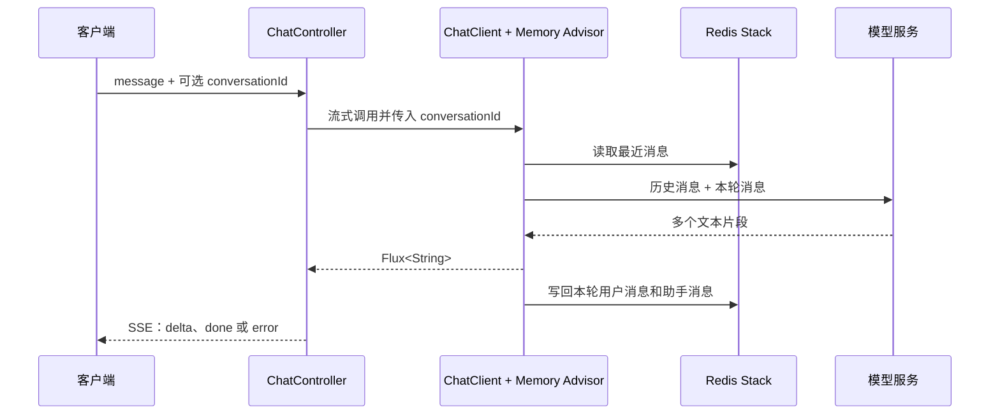

## 一、💡 一句话理解

> [!tip] 第 10 天核心结论
> 今天不是再学一个新框架，而是把前 1～9 天已经验证过的能力收口成一个接口：客户端发送问题，后端通过 SSE 持续返回模型文本，并按 `conversationId` 把本轮问答保存到 Redis 会话记忆中。

本篇严格对应 [[0-学习路线]] 第 10 天：[[10.完成可运行聊天接口]]。它只整合已经学习过的 `ChatClient`、SSE、会话记忆和接口保护，不提前加入 Tool Calling、RAG 或 Agent 工作流。

第 10 天的验收目标是：

```text
POST /api/chat/stream
  → 返回 text/event-stream
  → 首次请求生成 conversationId
  → 后续请求携带同一个 ID
  → 模型能利用最近聊天上下文回答
  → Redis 保存短期会话记忆
```

## 二、🧭 理论：它是什么

### 2.1 什么叫“可运行聊天接口”

它不是只有“能调用模型”的一个 Controller 方法，而是一条可以被客户端稳定使用的完整链路。

| 能力 | 前序学习内容 | 第 10 天怎样组合 |
| --- | --- | --- |
| 模型调用 | [[3.Spring AI ChatClient]] | `ChatClient` 负责组织 Prompt 并调用模型。 |
| 流式输出 | [[7.SSE 流式响应]] | `stream().content()` 产生文本片段，WebMVC 以 SSE 推送。 |
| 连续对话 | [[8.会话 ID、聊天记录、Redis]] | 同一 `conversationId` 读取和写回最近消息窗口。 |
| 异常保护 | [[9.超时、重试、限流、降级]] | 重试配置、入口限流和流内错误事件避免把失败伪装成答案。 |

> [!info] 本篇中的“会话记录”
> Redis 保存的是给模型提供上下文的**短期会话记忆**，不是长期审计档案。路线后续接入 PostgreSQL、权限和审计后，再单独设计可查询、可删除的完整聊天记录。

### 2.2 请求为什么要带会话 ID

大模型不会天然记住上一轮。`conversationId` 就是一段对话的档案编号：首次请求由后端生成，客户端保存后在下一次请求中带回。`MessageChatMemoryAdvisor` 按这个 ID 从 Redis 读取历史消息，并在本轮结束后写回用户消息和助手消息。



### 2.3 SSE 事件协议：为什么不直接裸返回字符串

直接推文本可以跑通，但客户端无法分辨“这是模型正文”“模型已经结束”还是“调用失败”。本篇统一定义三类事件：

| 事件名 | 何时出现 | `data` 中的关键字段 |
| --- | --- | --- |
| `delta` | 模型产生一个文本片段 | `conversationId`、`content` |
| `done` | 模型正常结束 | `conversationId` |
| `error` | 超时、上游失败或连接异常 | `conversationId`、`code`、`message` |

这样前端只需要订阅自己的 `/api/chat/stream`，无需理解不同模型供应商的原始流式协议。

## 三、⚙️ 理论：它是怎么工作的

### 3.1 Spring AI 调用链

Spring AI 官方的 `ChatClient` 同时支持同步调用和流式调用。此处必须使用 `.stream().content()`，它返回会陆续产生内容的 `Flux<String>`；误写成 `.call().content()` 就会退化为等待完整回答后一次性返回的普通接口。

```java
// 正确：得到会持续产生文本片段的数据流。
Flux<String> contentStream = chatClient.prompt()
        .user(message)
        .stream()
        .content();
```

Spring MVC 可以处理响应式返回值，因此本学习路线既然明确选择 **WebMVC**，就不额外加入 `spring-boot-starter-webflux`。同一个项目混用两套 Web 技术栈容易让自动配置和排错范围变大。

### 3.2 本篇的保护边界

```text
请求进入
  → 限流过滤器：过快则直接 429
  → Controller：校验 message、生成或复用 conversationId
  → Spring AI：按 spring.ai.retry 配置重试暂时性上游错误
  → 流式模型调用：最长等待 30 秒
  → SSE：持续发送 delta；正常发送 done；异常发送 error
  → Redis：由 Memory Advisor 保存短期上下文
```

这里的 `30 秒` 只限制本服务等待响应式数据流的最长时间；它不保证远端服务一定立即取消请求。错误事件不是模型答案，客户端收到后应停止本轮渲染并提示用户重试。

## 四、🚀 实践：从准备到验证

### 4.1 前置准备

#### 4.1.1 Maven：严格沿用学习路线的基础配置

项目使用 Java 21、Spring Boot 4.1.1、Spring AI 2.0.1 与**唯一的 WebMVC starter**。不要同时添加 `spring-boot-starter-webflux`，也不要把 API Key 写入 `pom.xml`。

文件位置：`pom.xml`。

```xml
<?xml version="1.0" encoding="UTF-8"?>
<project xmlns="http://maven.apache.org/POM/4.0.0"
         xmlns:xsi="http://www.w3.org/2001/XMLSchema-instance"
         xsi:schemaLocation="http://maven.apache.org/POM/4.0.0 https://maven.apache.org/xsd/maven-4.0.0.xsd">
    <modelVersion>4.0.0</modelVersion>

    <parent>
        <groupId>org.springframework.boot</groupId>
        <artifactId>spring-boot-starter-parent</artifactId>
        <version>4.1.1</version>
        <relativePath/>
    </parent>

    <groupId>com.afyke</groupId>
    <artifactId>ai-agent-demo</artifactId>
    <version>0.0.1-SNAPSHOT</version>

    <properties>
        <java.version>21</java.version>
        <spring-ai.version>2.0.1</spring-ai.version>
    </properties>

    <dependencyManagement>
        <dependencies>
            <dependency>
                <groupId>org.springframework.ai</groupId>
                <artifactId>spring-ai-bom</artifactId>
                <version>${spring-ai.version}</version>
                <type>pom</type>
                <scope>import</scope>
            </dependency>
        </dependencies>
    </dependencyManagement>

    <dependencies>
        <!-- 唯一的 Web 技术栈：Spring MVC。 -->
        <dependency>
            <groupId>org.springframework.boot</groupId>
            <artifactId>spring-boot-starter-webmvc</artifactId>
        </dependency>
        <!-- 校验请求中的 message，避免空问题消耗模型配额。 -->
        <dependency>
            <groupId>org.springframework.boot</groupId>
            <artifactId>spring-boot-starter-validation</artifactId>
        </dependency>
        <!-- OpenAI 兼容模型（例如路线中的 DeepSeek 配置）。 -->
        <dependency>
            <groupId>org.springframework.ai</groupId>
            <artifactId>spring-ai-starter-model-openai</artifactId>
        </dependency>
        <!-- Redis Stack 聊天记忆仓库。 -->
        <dependency>
            <groupId>org.springframework.ai</groupId>
            <artifactId>spring-ai-starter-model-chat-memory-repository-redis</artifactId>
        </dependency>
        <dependency>
            <groupId>org.springframework.boot</groupId>
            <artifactId>spring-boot-starter-test</artifactId>
            <scope>test</scope>
        </dependency>
    </dependencies>

    <build>
        <plugins>
            <plugin>
                <groupId>org.springframework.boot</groupId>
                <artifactId>spring-boot-maven-plugin</artifactId>
            </plugin>
        </plugins>
    </build>
</project>
```

依赖更新后，在 IDEA 的 Maven 面板重新加载。路线指定的本机 Maven 路径是 `/Volumes/data/develop/apache-maven-3.9.16`；没有 Maven Wrapper 时，使用它执行后文的 Maven 命令。

#### 4.1.2 高级配置：模型、Redis 和重试

文件位置：`src/main/resources/application.properties`。真实密钥只通过 IDEA Run Configuration 或终端环境变量 `DEEPSEEK_API_KEY` 提供。

```properties
# ===== 模型：沿用学习路线的 OpenAI 兼容配置 =====
spring.ai.openai.api-key=${DEEPSEEK_API_KEY}
spring.ai.openai.base-url=https://api.deepseek.com
spring.ai.openai.chat.model=deepseek-v4-flash

# ===== Redis Stack 会话记忆 =====
spring.ai.chat.memory.repository.redis.host=localhost
spring.ai.chat.memory.repository.redis.port=6379
# 如果 Redis 设置密码，取消下一行注释，并在环境变量中提供 REDIS_PASSWORD。
# spring.ai.chat.memory.repository.redis.password=${REDIS_PASSWORD}
spring.ai.chat.memory.repository.redis.key-prefix=chat-memory:
spring.ai.chat.memory.repository.redis.time-to-live=24h
# 本地学习时创建 Redis 搜索索引；生产环境应由部署流程统一管理。
spring.ai.chat.memory.repository.redis.initialize-schema=true

# ===== 第 9 天的模型调用重试配置 =====
spring.ai.retry.max-attempts=3
spring.ai.retry.backoff.initial-interval=1s
spring.ai.retry.backoff.multiplier=2
spring.ai.retry.backoff.max-interval=4s
spring.ai.retry.on-client-errors=false
spring.ai.retry.on-http-codes=429,500,502,503,504
spring.ai.retry.exclude-on-http-codes=400,401,403
```

`429` 在这里指模型供应商返回的限额错误；它和稍后本服务限流返回的 `429` 状态相同，但发生位置不同。认证、权限和参数错误不能重试。

#### 4.1.3 启动 Redis Stack 并检查构建

`RedisChatMemoryRepository` 需要 Redis Stack，基础 Redis 镜像不够。Docker 可用时执行：

```bash
docker run -d --name ai-redis-stack -p 6379:6379 redis/redis-stack-server:latest
mvn clean compile
```

预期：Redis 容器正在运行，且 Maven 编译成功。若你已创建同名容器，不要再次执行 `docker run`；先使用 `docker start ai-redis-stack` 启动即可。

### 4.2 可以拿来干什么

#### 4.2.1 实现连续流式对话

输入是 `message` 和可选 `conversationId`；输出是连续的 SSE 事件。第一次获得服务端返回的 ID 后，客户端必须保存它并用于下一次请求：

```json
{"message":"我叫小王。"}
```

下一次：

```json
{"conversationId":"demo-user:实际返回的UUID","message":"我叫什么？"}
```

预期：模型可以基于 Redis 中的最近消息回答“小王”。这只验证记忆链路，不代表模型回答百分之百可靠。

#### 4.2.2 为后续 Agent 保留稳定入口

第 20 天加入 Tool Calling、第 30 天加入 RAG 后，客户端仍可以调用 `/api/chat/stream`；变化应留在 Controller 之后的业务层，而不是把供应商 URL、密钥和原始协议暴露给前端。

### 4.3 完整实践：代码、启动和验证

下面的代码实现完整的第 10 天链路。假设应用基础包为 `com.afyke.ai`；若你的实际包名不同，必须统一替换所有文件第一行的 `package`。

#### 4.3.1 注册 Redis 会话记忆与 `ChatClient`

要解决的问题：让每一次模型调用能按会话 ID 自动读取和写回 Redis 中的最近消息。

文件位置：`src/main/java/com/afyke/ai/config/ChatMemoryConfig.java`。

```java
package com.afyke.ai.config;

import java.time.Duration;

import redis.clients.jedis.RedisClient;
import org.springframework.ai.chat.client.ChatClient;
import org.springframework.ai.chat.client.advisor.MessageChatMemoryAdvisor;
import org.springframework.ai.chat.memory.ChatMemory;
import org.springframework.ai.chat.memory.MessageWindowChatMemory;
import org.springframework.ai.chat.memory.repository.redis.RedisChatMemoryRepository;
import org.springframework.beans.factory.annotation.Value;
import org.springframework.context.annotation.Bean;
import org.springframework.context.annotation.Configuration;

/**
 * 把 Redis Stack 里的消息存储、消息窗口和 ChatClient 串起来。
 * Controller 不需要手写“查历史、拼 Prompt、存回答”的重复逻辑。
 */
@Configuration
public class ChatMemoryConfig {

    @Value("${spring.ai.chat.memory.repository.redis.host:localhost}")
    private String redisHost;

    @Value("${spring.ai.chat.memory.repository.redis.port:6379}")
    private int redisPort;

    @Value("${spring.ai.chat.memory.repository.redis.key-prefix:chat-memory:}")
    private String redisKeyPrefix;

    @Value("${spring.ai.chat.memory.repository.redis.time-to-live:24h}")
    private Duration redisTimeToLive;

    @Bean
    RedisClient redisClient() {
        // 建立到 Redis Stack 的客户端；真实密码由 Starter 配置或安全部署配置处理。
        return RedisClient.builder().hostAndPort(redisHost, redisPort).build();
    }

    @Bean
    RedisChatMemoryRepository redisChatMemoryRepository(RedisClient redisClient) {
        // 指定键前缀和过期时间，避免短期测试会话永久占用 Redis。
        return RedisChatMemoryRepository.builder()
                .jedisClient(redisClient)
                .keyPrefix(redisKeyPrefix)
                .timeToLive(redisTimeToLive)
                .build();
    }

    @Bean
    ChatMemory chatMemory(RedisChatMemoryRepository repository) {
        // 每次模型调用最多带入最近 10 条消息，控制上下文长度和 Token 成本。
        return MessageWindowChatMemory.builder()
                .chatMemoryRepository(repository)
                .maxMessages(10)
                .build();
    }

    @Bean
    ChatClient chatClient(ChatClient.Builder builder, ChatMemory chatMemory) {
        // Advisor 在模型调用前读历史、在调用完成后写回本轮用户和助手消息。
        return builder
                .defaultAdvisors(MessageChatMemoryAdvisor.builder(chatMemory).build())
                .build();
    }
}
```

输入是 `application.properties` 中的 Redis 地址、端口、键前缀和 TTL；输出是已注册记忆 Advisor 的唯一 `ChatClient` Bean。后续 Controller 必须注入这个 `ChatClient`，不要再注入 `ChatClient.Builder` 后自行 `build()`，否则会绕开这里注册的记忆能力。

#### 4.3.2 定义接口：SSE、会话 ID 与错误边界

要解决的问题：接收经过校验的消息，首次生成会话 ID，用 `SseEmitter` 依次发送 `delta`、`done` 或 `error` 事件。

文件位置：`src/main/java/com/afyke/ai/controller/ChatController.java`。

```java
package com.afyke.ai.controller;

import java.io.IOException;
import java.time.Duration;
import java.util.UUID;

import jakarta.validation.Valid;
import jakarta.validation.constraints.NotBlank;
import org.springframework.ai.chat.client.ChatClient;
import org.springframework.ai.chat.memory.ChatMemory;
import org.springframework.http.MediaType;
import org.springframework.web.bind.annotation.PostMapping;
import org.springframework.web.bind.annotation.RequestBody;
import org.springframework.web.bind.annotation.RequestMapping;
import org.springframework.web.bind.annotation.RestController;
import org.springframework.web.servlet.mvc.method.annotation.SseEmitter;

/**
 * 对外只暴露自己的聊天协议；前端不直接接触模型供应商地址和 API Key。
 */
@RestController
@RequestMapping("/api/chat")
public class ChatController {

    // 比模型响应流略长，防止 Servlet 容器先于业务超时关闭连接。
    private static final long SSE_TIMEOUT_MILLIS = 35_000L;

    private final ChatClient chatClient;

    public ChatController(ChatClient chatClient) {
        // 注入 4.3.1 中已配置好聊天记忆 Advisor 的 Bean。
        this.chatClient = chatClient;
    }

    @PostMapping(
            value = "/stream",
            consumes = MediaType.APPLICATION_JSON_VALUE,
            produces = MediaType.TEXT_EVENT_STREAM_VALUE
    )
    public SseEmitter chatStream(@Valid @RequestBody ChatRequest request) {
        // 新对话由服务端生成 ID；真实项目应把 demo-user 改为登录态中的可信用户 ID。
        String conversationId = createOrReuseConversationId(request.conversationId());
        SseEmitter emitter = new SseEmitter(SSE_TIMEOUT_MILLIS);

        chatClient.prompt()
                // 这里先沿用第 5 天的 System Prompt；业务规则不要由客户端传入。
                .system("你是企业售后与知识库 Agent 的学习版助手，请使用简洁、诚实的中文回答。")
                // 只把本轮用户消息放进 User Message，历史由 Advisor 自动读取。
                .user(request.message())
                // 每次调用都必须传入会话 ID，否则聊天记忆无法隔离。
                .advisors(a -> a.param(ChatMemory.CONVERSATION_ID, conversationId))
                // Spring AI 返回会陆续产生文本片段的 Flux<String>。
                .stream()
                .content()
                // 第 10 天的流式总等待上限；上游慢或断开时会进入 error 分支。
                .timeout(Duration.ofSeconds(30))
                .subscribe(
                        chunk -> send(emitter, "delta", new ChatEvent(conversationId, chunk, null, null)),
                        error -> {
                            // 失败时给客户端可识别的事件，绝不伪造一段模型回答。
                            send(emitter, "error", new ChatEvent(
                                    conversationId,
                                    null,
                                    "AI_STREAM_FAILED",
                                    "AI 服务暂时不可用或响应超时，请稍后重试"
                            ));
                            emitter.complete();
                        },
                        () -> {
                            // 模型正常结束；客户端收到 done 后结束本轮渲染。
                            send(emitter, "done", new ChatEvent(conversationId, null, null, null));
                            emitter.complete();
                        }
                );

        // 客户端断开或容器超时时释放异步响应；订阅的取消由底层连接传播处理。
        emitter.onTimeout(emitter::complete);
        emitter.onCompletion(() -> { });
        return emitter;
    }

    private String createOrReuseConversationId(String requestedConversationId) {
        if (requestedConversationId == null || requestedConversationId.isBlank()) {
            return "demo-user:" + UUID.randomUUID();
        }
        return requestedConversationId;
    }

    private void send(SseEmitter emitter, String eventName, ChatEvent event) {
        try {
            // name() 写入 SSE 的 event: 字段；data() 写入 JSON 数据。
            emitter.send(SseEmitter.event().name(eventName).data(event));
        }
        catch (IOException exception) {
            // 浏览器关闭页面等场景会导致写响应失败，只结束本次 SSE，不再继续写入。
            emitter.completeWithError(exception);
        }
    }

    /** 客户端请求：新对话时 conversationId 可不传，message 不能为空。 */
    public record ChatRequest(String conversationId, @NotBlank String message) {
    }

    /** 每一条 SSE 的 JSON 数据结构。 */
    public record ChatEvent(String conversationId, String content, String code, String message) {
    }
}
```

输入、过程和输出如下：

| 环节 | 内容 |
| --- | --- |
| 输入 | JSON 中的 `message`，以及可选的 `conversationId`。 |
| 过程 | 记忆 Advisor 读取 Redis 历史；模型持续产生文本；Controller 将每一段封装为 `delta`。 |
| 正常输出 | 多条 `event: delta`，最后一条 `event: done`。 |
| 异常输出 | 一条 `event: error`，包含固定错误码和可展示提示。 |

> [!warning] 会话 ID 的安全边界
> 为了让 `curl` 直接验证，示例接受客户端回传的 ID。真实系统必须从 JWT 或登录态取得用户 ID，并校验会话归属；不能相信任意客户端传来的 `demo-user:...`。

#### 4.3.3 添加单机入口限流

要解决的问题：同一用户在一分钟内最多开始 5 条新聊天请求，避免明显误操作或脚本耗尽模型配额。

文件位置：`src/main/java/com/afyke/ai/ratelimit/FixedWindowRateLimiter.java`。

```java
package com.afyke.ai.ratelimit;

import java.util.concurrent.ConcurrentHashMap;
import java.util.concurrent.atomic.AtomicInteger;

import org.springframework.stereotype.Component;

@Component
public class FixedWindowRateLimiter {

    private static final int LIMIT_PER_MINUTE = 5;
    private static final long WINDOW_MILLIS = 60_000L;
    private final ConcurrentHashMap<String, Counter> counters = new ConcurrentHashMap<>();

    public boolean allow(String key) {
        long now = System.currentTimeMillis();
        Counter counter = counters.compute(key, (ignored, old) -> {
            if (old == null || now - old.windowStartedAt() >= WINDOW_MILLIS) {
                // 新用户或旧窗口已过期：本次请求是新窗口的第 1 次。
                return new Counter(now, new AtomicInteger(1));
            }
            old.used().incrementAndGet();
            return old;
        });
        return counter.used().get() <= LIMIT_PER_MINUTE;
    }

    private record Counter(long windowStartedAt, AtomicInteger used) {
    }
}
```

文件位置：`src/main/java/com/afyke/ai/ratelimit/AiRateLimitFilter.java`。

```java
package com.afyke.ai.ratelimit;

import java.io.IOException;

import jakarta.servlet.FilterChain;
import jakarta.servlet.ServletException;
import jakarta.servlet.http.HttpServletRequest;
import jakarta.servlet.http.HttpServletResponse;
import org.springframework.http.HttpStatus;
import org.springframework.stereotype.Component;
import org.springframework.web.filter.OncePerRequestFilter;

@Component
public class AiRateLimitFilter extends OncePerRequestFilter {

    private final FixedWindowRateLimiter rateLimiter;

    public AiRateLimitFilter(FixedWindowRateLimiter rateLimiter) {
        this.rateLimiter = rateLimiter;
    }

    @Override
    protected boolean shouldNotFilter(HttpServletRequest request) {
        // 只限制本篇的聊天入口，不影响其他业务接口和健康检查。
        return !"/api/chat/stream".equals(request.getRequestURI());
    }

    @Override
    protected void doFilterInternal(HttpServletRequest request, HttpServletResponse response,
                                    FilterChain filterChain) throws ServletException, IOException {
        // 学习用请求头；生产环境必须从认证后的登录态读取可信用户 ID。
        String userId = request.getHeader("X-User-Id");
        String limitKey = (userId == null || userId.isBlank()) ? "anonymous" : userId;

        if (!rateLimiter.allow(limitKey)) {
            response.setStatus(HttpStatus.TOO_MANY_REQUESTS.value());
            response.setContentType("application/json;charset=UTF-8");
            response.getWriter().write("{\"code\":\"RATE_LIMITED\",\"message\":\"请求过于频繁，请 1 分钟后再试\"}");
            return;
        }
        filterChain.doFilter(request, response);
    }
}
```

这是单实例内存限流：应用重启会清零，多台机器不能共享计数。它适合第 10 天验证入口保护；路线后续使用 Redis、网关和认证后，再替换为分布式方案。

#### 4.3.4 启动与两轮验证

先在 IDEA 中配置环境变量 `DEEPSEEK_API_KEY=真实值`，再执行：

```bash
mvn clean compile
mvn spring-boot:run
```

第 1 次请求不传会话 ID。`-N` 禁用 `curl` 缓冲，才能看到边生成边输出的效果：

```bash
curl -N -X POST 'http://localhost:8080/api/chat/stream' \
  -H 'Content-Type: application/json' \
  -H 'X-User-Id: demo-user' \
  -d '{"message":"我叫小王，请记住这个名字。"}'
```

预期输出（文本分片边界由模型决定，以下仅示意）：

```text
event: delta
data: {"conversationId":"demo-user:...","content":"好的，"}

event: delta
data: {"conversationId":"demo-user:...","content":"我会记住你叫小王。"}

event: done
data: {"conversationId":"demo-user:...","content":null,"code":null,"message":null}
```

复制第一轮的 `conversationId`，第 2 次请求继续带入它：

```bash
curl -N -X POST 'http://localhost:8080/api/chat/stream' \
  -H 'Content-Type: application/json' \
  -H 'X-User-Id: demo-user' \
  -d '{"conversationId":"demo-user:替换为第一轮返回的值","message":"我叫什么？"}'
```

预期：返回的多个 `delta` 片段组合后含有“小王”。若省略或更换会话 ID，则不能把模型未记住名字视为故障，因为那是另一段对话。

#### 4.3.5 验收与常见问题

验收清单：

- [ ] `mvn clean compile` 成功。
- [ ] Redis Stack 在 `6379` 端口运行。
- [ ] `POST /api/chat/stream` 的响应类型为 `text/event-stream`。
- [ ] 第 1 次请求能连续收到 `delta`，最后收到 `done`。
- [ ] 第 2 次携带同一 `conversationId` 后可以利用前文上下文。
- [ ] 模型错误或超过等待时间时收到 `error`，而不是虚假的业务回答。
- [ ] 同一 `X-User-Id` 一分钟第 6 次请求返回 `429`。
- [ ] API Key 未写入代码、`application.properties` 或 Git。

| 现象 | 优先检查 | 处理方式 |
| --- | --- | --- |
| `RedisChatMemoryRepository` 找不到 Bean | Redis starter 是否在 `pom.xml`，Maven 是否重新加载 | 保留 4.1.1 的依赖和 4.3.1 的显式 Bean。 |
| 启动时 Redis 连接失败 | 是否启动了 Redis Stack、端口是否为 6379 | 启动容器并核对 host、port、密码配置。 |
| 一次性收到所有内容 | `curl` 是否使用 `-N`；接口是否为 `text/event-stream` | 先用本文命令复核；若经过网关，关闭其响应缓冲。 |
| 第二轮不记得名字 | 两次 `conversationId` 是否完全相同 | 使用服务端第一轮返回的原值；不要自行拼写。 |
| `401` / `403` | 环境变量名和模型配置是否匹配 | 检查 IDEA Run Configuration 中的 `DEEPSEEK_API_KEY`。 |
| 第 6 次仍没有 429 | 请求头 `X-User-Id` 是否相同 | 在一分钟内使用相同请求头重试；该限流器按用户键计数。 |

## 五、📌 总结

- `ChatClient.stream().content()` 是流式调用；`.call().content()` 是普通同步调用。
- 本项目坚持 WebMVC，不新增 WebFlux starter。
- `conversationId` 是会话边界；Redis 记忆窗口负责让模型获得最近上下文。
- API Key 放环境变量，模型重试只针对暂时性上游错误。
- 第 10 天的成品要让客户端能稳定识别正文、结束和失败，而不只是“偶尔能返回一段文字”。

## 六、🔗 官方资料

- [Spring AI：Chat Client API](https://docs.spring.io/spring-ai/reference/api/chatclient.html)：`ChatClient.Builder`、同步与流式调用。
- [Spring AI：Chat Memory](https://docs.spring.io/spring-ai/reference/api/chat-memory.html)：会话 ID、消息窗口和 Redis 聊天记忆。
- [Spring Framework：MVC Controller 返回值](https://docs.spring.io/spring-framework/reference/web/webmvc/mvc-controller/ann-methods/return-types.html)：Spring MVC 对响应式返回值的支持。
