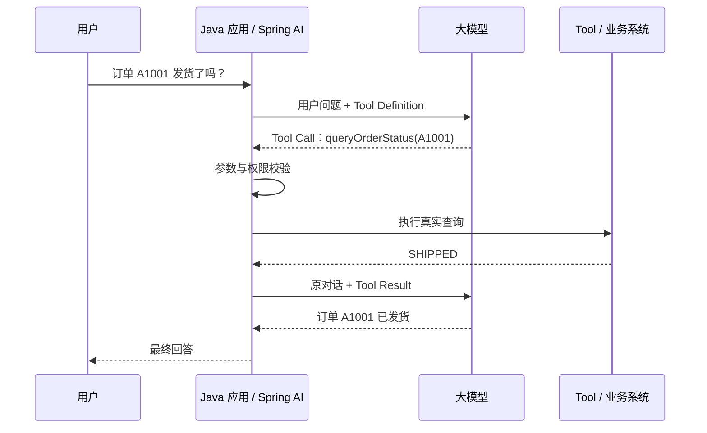

## 一、💡 一句话理解

> [!tip] 第 11 天核心结论
> Tool Calling 不是“模型亲自执行 Java 方法”，而是模型返回一张结构化的“工具调用申请单”：要调用哪个工具、传什么参数。真正查数据库、请求业务接口或执行 Java 方法的是应用程序；应用程序再把执行结果交给模型，由模型整理成最终回答。

本篇对应 [[0-学习路线]] 第 11 天：`Function Calling / Tool Calling 原理`。

学完后，你应该能独立说清下面这条完整链路：

```text
用户提问
  → 应用把“问题 + 可用工具说明”发给模型
  → 模型判断是否需要工具
  → 模型返回工具名称和 JSON 参数
  → 应用校验参数并执行真实代码
  → 应用把工具结果发回模型
  → 模型根据真实结果生成最终回答
```

今天先理解原理并跑通一个只读工具，不提前展开第 12～19 天的复杂参数、真实订单接口、异常重试、权限和人工审批。

## 二、🧭 理论：它是什么

### 2.1 为什么只会聊天的模型不够用

大模型擅长理解自然语言和生成文字，但它不会天然知道：

- 数据库中订单 `A1001` 现在是什么状态。
- 当前服务器时间是多少。
- 某个商品还有多少库存。
- 用户是否有创建售后工单的权限。

这些信息存在于训练数据之外，而且会不断变化。如果让模型直接回答，它可能根据语言规律猜出一个看似合理、实际错误的结果。

Tool Calling 解决的是“模型怎样向外部系统请求真实数据或动作”这个问题：模型负责理解用户意图，应用负责连接真实世界。

| 参与者 | 主要职责 | 不应该承担的职责 |
| --- | --- | --- |
| 模型 | 理解问题、选择工具、组织参数、整理结果 | 直接连接数据库、直接执行 Java 方法 |
| Spring AI | 把工具说明交给模型，管理工具调用循环 | 替业务系统决定权限和安全规则 |
| Java 应用 | 校验参数、执行工具、处理异常、记录审计 | 无条件相信模型给出的参数 |
| 业务系统 | 提供订单、物流、库存等真实数据和操作 | 理解用户的自然语言问题 |

### 2.2 Tool、Tool Call 和 Tool Result

这三个概念很容易混在一起。

| 概念 | 白话解释 | 例子 |
| --- | --- | --- |
| Tool | 应用允许模型申请使用的一项能力 | 查询天气、查询订单、创建工单 |
| Tool Definition | 给模型看的“工具说明书” | 工具名、用途、参数 JSON Schema |
| Tool Call | 模型返回的“调用申请单” | 调用 `queryOrderStatus`，参数是 `{"orderId":"A1001"}` |
| Tool Result | 应用真正执行后得到的结果 | `{"status":"SHIPPED"}` |
| Final Response | 模型读完工具结果后生成的人类可读答案 | “订单 A1001 已发货。” |

> [!warning] 最重要的安全边界
> 模型返回 Tool Call，不等于操作已经执行。应用仍然要做参数校验、身份认证、权限检查、幂等控制和必要的人工确认。

### 2.3 Function Calling 和 Tool Calling 有什么区别

在早期接口和很多模型供应商文档中，这项能力常被称为 **Function Calling**：把一个函数的名称、描述和参数结构交给模型，让模型生成函数调用参数。

**Tool Calling** 是更宽泛的叫法。工具不一定只是本地函数，也可能是：

- Java 方法；
- HTTP 接口；
- 数据库查询封装；
- 搜索服务；
- MCP 服务器提供的远程工具；
- 模型平台内置的搜索、代码执行等能力。

因此可以先记成：

```text
Function Calling = 用“函数”形式提供工具能力
Tool Calling     = 模型使用外部能力的整体机制
```

在本学习路线的 Spring AI 项目中，后续会把 Java 方法定义成 Tool，所以日常可以统一称为 Tool Calling。

### 2.4 Tool Calling 和结构化输出的区别

[[6.结构化输出、JSON Schema]] 和 Tool Calling 都会使用 JSON Schema，但目的不同。

| 对比项 | 结构化输出 | Tool Calling |
| --- | --- | --- |
| 核心目标 | 让模型的最终回答变成固定数据结构 | 让模型申请调用外部能力 |
| 模型输出 | 最终业务对象 | 工具名和工具参数 |
| 是否执行外部代码 | 通常不执行 | 由应用执行 |
| 是否需要再次请求模型 | 通常不需要 | 通常要把工具结果发回模型 |
| 典型用途 | 意图分类、字段抽取 | 查订单、查库存、创建工单 |

例如，结构化输出可以判断用户意图是 `ORDER_STATUS`，但不能凭空得到真实订单状态。Tool Calling 可以让模型申请调用 `queryOrderStatus`，由 Java 应用从真实业务系统获取状态。

### 2.5 Tool Calling 不是传统 RPC

传统 Java 调用通常由程序员提前写死：

```java
orderService.queryOrderStatus(orderId);
```

程序在编译时已经确定要调用哪个方法。Tool Calling 则多了一个由模型完成的“语义路由”步骤：用户可以说“帮我看看 A1001 发货没”，模型根据工具描述决定应该使用订单查询工具，并从自然语言中提取 `orderId`。

但工具一旦开始执行，仍然是普通的确定性 Java 代码。模型没有绕过应用边界获得任意方法执行权。

## 三、⚙️ 理论：它是怎么工作的

### 3.1 第一步：应用向模型声明可用工具

应用不会把整个 Java 项目交给模型，而只会发送允许本次请求使用的 Tool Definition。核心信息通常包括：

```json
{
  "name": "queryOrderStatus",
  "description": "根据订单编号查询当前订单状态",
  "inputSchema": {
    "type": "object",
    "properties": {
      "orderId": {
        "type": "string",
        "description": "订单编号，例如 A1001"
      }
    },
    "required": ["orderId"]
  }
}
```

模型看到的是工具名称、用途和参数规则，不是方法内部源码，也不是数据库密码。

Spring AI 2.0.1 中，`ToolDefinition` 的核心就是：

- `name`：工具的唯一名称；
- `description`：告诉模型什么时候应该使用它；
- `inputSchema`：参数的 JSON Schema。

### 3.2 第二步：模型决定直接回答还是申请调用工具

模型收到“用户问题 + 工具定义”后，可能出现两种结果。

#### 3.2.1 不需要工具

用户问：“什么是订单状态？”

这是通用概念，模型可能直接返回文字回答，不产生 Tool Call。

#### 3.2.2 需要工具

用户问：“订单 A1001 发货了吗？”

模型可能返回类似下面的 Tool Call：

```json
{
  "name": "queryOrderStatus",
  "arguments": {
    "orderId": "A1001"
  }
}
```

这只是模型根据上下文生成的结构化请求。参数可能缺失、格式错误，甚至包含恶意内容，因此不能跳过应用侧校验。

### 3.3 第三步：应用执行真实工具

应用根据工具名找到受控的 `ToolCallback`，把 JSON 参数转换成 Java 参数，然后执行对应代码。

```text
Tool Call
  → 根据工具名查找 ToolCallback
  → 解析 JSON 参数
  → 参数校验、权限校验
  → 调用 Java 方法或下游接口
  → 得到 Tool Result
```

如果工具是 `queryOrderStatus`，真正的数据库查询或微服务调用发生在这一步。模型不会获得数据库连接，也不会自己运行 SQL。

### 3.4 第四步：应用把工具结果交还模型

应用执行完成后，会把工具结果作为一条专门的 Tool Result 消息加入本轮对话。例如：

```json
{
  "orderId": "A1001",
  "status": "SHIPPED"
}
```

然后再次请求模型。模型结合原问题和真实工具结果，生成最终答案：

```text
订单 A1001 已经发货。
```

### 3.5 第五步：循环直到模型不再请求工具

一次任务可能需要不止一个工具。例如“查询订单，如果已经签收就创建售后工单”可能经历：

```text
模型请求 queryOrderStatus
  → 应用返回 DELIVERED
  → 模型请求 createAfterSaleTicket
  → 应用要求人工确认
  → 确认后执行并返回工单编号
  → 模型生成最终回答
```

因此 Tool Calling 本质上是一个循环，不是一次普通方法调用。循环的终止条件是模型返回普通回答，不再包含 Tool Call。



### 3.6 Spring AI 2.0.1 怎样管理这个循环

Spring AI 2.0.1 把工具调用循环放进 `ChatClient` 的 Advisor 链中：

1. 你定义工具，并通过 `.tools(...)` 或 `.defaultTools(...)` 交给 `ChatClient`。
2. `ChatClient` 自动注册 `ToolCallingAdvisor`。
3. 模型返回 Tool Call 后，`ToolCallingManager` 查找并执行对应的 `ToolCallback`。
4. Spring AI 把 Tool Result 加入本轮对话，再次请求模型。
5. 模型不再请求工具时，最终回答返回给 Controller。

所以业务代码通常仍然只写一次：

```java
String answer = chatClient.prompt()
        .user(question)
        .tools(new DateTimeTools())
        .call()
        .content();
```

表面只有一次 `.call()`，框架内部可能已经完成两次或更多次模型请求。

> [!info] 版本说明
> 本篇以 Spring AI 2.0.1 为准。Spring AI 1.x 的工具执行循环主要位于各个 `ChatModel` 内部，2.0 将其调整为 `ChatClient` Advisor 链中的一等组件；阅读旧教程时要注意版本差异。

### 3.7 `@Tool`、`ToolCallback` 和业务方法的关系

Spring AI 支持多种工具定义方式，本阶段只需要建立层次感：

| 层次 | 作用 | 当前阶段怎样理解 |
| --- | --- | --- |
| 业务方法 | 真正完成查询或操作 | 普通 Java 代码 |
| `@Tool` | 把方法声明为可供模型申请调用的工具 | 第 12 天重点 |
| `ToolCallback` | Spring AI 统一的工具定义和执行接口 | 框架内部抽象 |
| `ToolCallingManager` | 根据 Tool Call 查找并执行工具 | 循环执行者 |
| `ToolCallingAdvisor` | 管理“请求模型—执行工具—再请求模型”的循环 | 循环编排者 |

`@Tool` 不会让模型随意调用整个 Spring 容器。只有本次明确传给 `ChatClient` 的工具，才会进入模型可见的工具集合。

### 3.8 为什么工具描述和 JSON Schema 很重要

模型不是根据 Java 方法体选择工具，而是根据工具名称、描述和参数 Schema 做判断。

下面的描述过于含糊：

```text
name: query
description: 查询数据
```

下面的描述更容易让模型正确选择：

```text
name: queryOrderStatus
description: 根据订单编号查询当前订单状态；只用于读取订单状态，不创建或修改订单
```

参数 Schema 也不是装饰。它告诉模型字段名、类型、是否必填和含义。Schema 能提高参数格式的稳定性，但不能替代应用侧校验。

### 3.9 Tool Calling 的五个安全边界

| 边界 | 原因 | 应用侧措施 |
| --- | --- | --- |
| 工具白名单 | 模型不应看到所有内部能力 | 只注册本次允许的工具 |
| 参数不可信 | 参数由模型生成 | Bean Validation、格式和范围检查 |
| 权限不能交给模型判断 | 模型不了解真实身份和权限 | 从登录态读取用户，后端鉴权 |
| 写操作风险高 | 可能产生不可逆副作用 | 人工确认、幂等键、事务和审计 |
| 循环可能失控 | 模型可能重复调用 | 超时、最大步数、预算和重复检测 |

本路线第 19 天会专门实现权限校验和人工确认。今天必须先记住：**能调用，不代表应该立即执行。**

## 四、🚀 实践：从准备到验证

### 4.1 前置准备

#### 4.1.1 环境和项目

沿用 [[0-学习路线]] 中已经创建的项目：

- Java 21；
- Spring Boot 4.1.1；
- Spring AI 2.0.1；
- Maven 3.9.16；
- Spring MVC；
- 一个支持 Tool Calling 的聊天模型。

本篇不需要数据库、Redis 或额外 Maven 依赖。`spring-ai-starter-model-openai` 已经包含本例需要的 Tool Calling 支持。

#### 4.1.2 检查 Maven 依赖

文件位置：`pom.xml`。

```xml
<dependency>
    <groupId>org.springframework.ai</groupId>
    <artifactId>spring-ai-starter-model-openai</artifactId>
</dependency>
```

它负责接入 OpenAI 兼容模型，并提供 `ChatClient`、工具定义和工具调用相关能力。

#### 4.1.3 检查模型配置

文件位置：`src/main/resources/application.properties`。

```properties
# 真实密钥通过环境变量提供，不写入配置文件或 Git。
spring.ai.openai.api-key=${DEEPSEEK_API_KEY}
spring.ai.openai.base-url=https://api.deepseek.com
spring.ai.openai.chat.model=deepseek-v4-flash
```

这里沿用学习路线已有配置。模型名称和供应商能力可能变化；实际运行前，应确认当前配置的模型支持 Tool Calling。如果普通聊天成功而工具调用没有发生，首先检查模型能力和供应商兼容性，而不是立刻怀疑 Java 方法。

#### 4.1.4 本例为什么使用“查询当前时间”

模型可能知道日期常识，但不知道 Java 应用运行时的精确当前时间。这个例子有三个优点：

- 不需要数据库或外部服务；
- 只读，没有业务副作用；
- 可以清楚观察“模型申请 → Java 执行 → 模型回答”的完整链路。

### 4.2 可以拿来干什么

#### 4.2.1 查询模型训练数据之外的实时信息

用途：当回答依赖当前时间、天气、订单状态或库存时，让模型先调用真实数据源，而不是猜测。

前置：应用已经把对应 Tool 注册给本次 `ChatClient` 请求；工具内部已经连接真实数据源。

```java
String answer = chatClient.prompt()
        .user("上海现在几点？请先使用工具查询，不要猜测。")
        .tools(new DateTimeTools())
        .call()
        .content();
```

输入是自然语言问题；模型选择时间工具；Java 方法读取系统时间；最终输出是一段人类可读回答。

适用场景：实时信息查询、企业数据查询、搜索和 RAG 检索入口。

#### 4.2.2 把自然语言转换成受控业务调用

用途：用户不需要记住接口名称和参数格式，可以直接说“查一下订单 A1001”。模型负责选择 `queryOrderStatus` 并提取订单号，Java 应用负责校验和执行。

概念代码如下，真实实现会在第 12～14 天完成：

```java
@Tool(description = "根据订单编号查询当前订单状态；该工具只读，不修改订单")
String queryOrderStatus(
        @ToolParam(description = "订单编号，例如 A1001") String orderId) {
    // 真实项目中由应用校验 orderId 和当前用户权限，再调用订单服务。
    return orderService.queryStatus(orderId);
}
```

输入是用户自然语言；Tool Call 参数是结构化的 `orderId`；输出来自订单系统。适合客服、运营助手和企业内部 Agent。

#### 4.2.3 执行业务动作

用途：创建售后工单、发送邮件、触发审批等。

这类工具会改变系统状态，不能照搬只读工具的自动执行方式。模型只能提出动作建议；应用必须补上权限、人工确认、幂等和审计。第 19 天会专门处理这一边界。

```text
模型申请 createAfterSaleTicket
  → 后端校验身份和权限
  → 返回待确认信息
  → 用户明确确认
  → 后端使用幂等键执行一次
  → 保存审计记录
```

适用场景：确实需要 Agent 代替用户完成操作，而且业务能够提供可靠安全控制时。

### 4.3 完整实践：跑通第一个 Tool Calling 循环

目标：新增一个只读时间工具和 `/api/tool/time` 接口。调用接口后，模型主动申请执行 Java 方法，Spring AI 自动把工具结果发回模型，最终返回自然语言答案。

#### 4.3.1 创建时间工具

文件位置：

```text
src/main/java/com/afyke/ai/tool/DateTimeTools.java
```

```java
package com.afyke.ai.tool;

import org.springframework.ai.tool.annotation.Tool;
import org.springframework.ai.tool.annotation.ToolParam;

import java.time.ZonedDateTime;
import java.time.format.DateTimeFormatter;
import java.time.ZoneId;

/**
 * 第 11 天的最小只读工具。
 *
 * 这个类不访问数据库，也不修改任何业务数据，
 * 只用于观察 Tool Calling 的完整往返过程。
 */
public class DateTimeTools {

    @Tool(description = "查询指定时区的当前日期和时间；当用户询问现在几点、今天日期或当前时间时使用")
    public String getCurrentDateTime(
            @ToolParam(description = "IANA 时区名称，例如 Asia/Shanghai；用户未说明时区时使用 Asia/Shanghai")
            String zoneId) {

        // ZoneId.of：把模型提供的时区字符串转换为 Java 时区对象。
        // 非法时区会抛出异常，说明工具参数仍需要应用侧校验和异常处理。
        ZoneId zone = ZoneId.of(zoneId);

        // ZonedDateTime.now：由 Java 应用读取指定时区的真实当前时间。
        // 这一步发生在应用侧，不是模型自己得到时间。
        ZonedDateTime now = ZonedDateTime.now(zone);

        // format：转换成稳定、清晰的文本，作为 Tool Result 返回给模型。
        return now.format(DateTimeFormatter.ISO_ZONED_DATE_TIME);
    }
}
```

这里的 `@Tool` 把 Java 方法转换为模型可见的工具说明；`@ToolParam` 补充参数含义。模型只会看到工具定义，不会看到方法内部实现。

#### 4.3.2 创建验证接口

文件位置：

```text
src/main/java/com/afyke/ai/controller/ToolCallingController.java
```

```java
package com.afyke.ai.controller;

import com.afyke.ai.tool.DateTimeTools;
import org.springframework.ai.chat.client.ChatClient;
import org.springframework.web.bind.annotation.GetMapping;
import org.springframework.web.bind.annotation.RequestMapping;
import org.springframework.web.bind.annotation.RequestParam;
import org.springframework.web.bind.annotation.RestController;

@RestController
@RequestMapping("/api/tool")
public class ToolCallingController {

    private final ChatClient chatClient;

    public ToolCallingController(ChatClient.Builder builder) {
        // build：使用 Spring Boot 已经配置好的 ChatModel 创建 ChatClient。
        // API Key、模型名和服务地址仍由 application.properties 提供。
        this.chatClient = builder.build();
    }

    @GetMapping("/time")
    public String queryCurrentTime(
            @RequestParam(defaultValue = "上海现在几点？请先使用工具查询，不要猜测。")
            String question) {

        return chatClient
                // prompt：开始组织本次模型请求。
                .prompt()
                // user：放入用户的自然语言问题。
                .user(question)
                // tools：只把这个工具对象暴露给本次请求。
                // Spring AI 会读取对象中带 @Tool 的方法并生成 Tool Definition。
                .tools(new DateTimeTools())
                // call：发起同步调用。
                // 如果模型返回 Tool Call，Spring AI 会在内部执行工具并再次请求模型。
                .call()
                // content：取出整个工具调用循环结束后的最终文本回答。
                .content();
    }
}
```

本例使用每次请求的 `.tools(...)`，而不是全局 `.defaultTools(...)`。这样模型只能在确实需要的接口中看到时间工具，也更容易理解“工具白名单”的边界。

#### 4.3.3 编译并启动

项目没有 Maven Wrapper 时，使用学习路线指定的 Maven：

```bash
/Volumes/data/develop/apache-maven-3.9.16/bin/mvn clean compile
/Volumes/data/develop/apache-maven-3.9.16/bin/mvn spring-boot:run
```

也可以在 IntelliJ IDEA 中重新加载 Maven，然后运行 `AiApplication`。

预期：项目编译成功并监听 `8080` 端口。真实 `DEEPSEEK_API_KEY` 继续通过 IDEA Run Configuration 或当前进程环境变量提供，不要写进源码。

#### 4.3.4 发送验证请求

在项目根目录的 `request.http` 中加入：

```http
### 第 11 天：触发时间工具
GET http://localhost:8080/api/tool/time?question=上海现在几点？请使用工具查询

### 对照组：通常不需要调用工具
GET http://localhost:8080/api/tool/time?question=什么是时区？
```

也可以使用命令行：

```bash
curl --get 'http://localhost:8080/api/tool/time' \
  --data-urlencode 'question=上海现在几点？请使用工具查询'
```

#### 4.3.5 预期结果

第一条请求的具体时间会随运行时刻变化，返回形式可能类似：

```text
上海当前时间是 2026 年 9 月 23 日 14:40，时区为 Asia/Shanghai。
```

模型的具体措辞不固定，但事实应来自 `DateTimeTools#getCurrentDateTime` 的返回值。

内部发生的过程是：

```text
GET /api/tool/time
  → Controller 把问题和时间工具交给 ChatClient
  → 第一次模型请求：模型返回 getCurrentDateTime Tool Call
  → Spring AI 执行 Java 方法
  → Spring AI 把当前时间作为 Tool Result 加入对话
  → 第二次模型请求：模型生成最终文本
  → Controller 返回文本
```

第二条“什么是时区”属于通用概念，模型可能直接回答而不调用工具。这说明 Tool Calling 不是每次都必须执行工具；默认情况下，模型会自行判断。

#### 4.3.6 怎样确认工具真的执行了

学习阶段可以临时在工具方法中加入日志：

```java
System.out.println("执行 getCurrentDateTime，zoneId=" + zoneId);
```

再次请求后，如果控制台出现这条日志，就说明 Java 方法确实由应用执行了。理解完成后建议改用正式日志框架，不要在生产代码中长期使用 `System.out.println`。

#### 4.3.7 常见错误排查

##### 4.3.7.1 模型直接猜时间，没有调用工具

检查顺序：

1. 当前模型是否支持 Tool Calling。
2. 是否在当前请求中写了 `.tools(new DateTimeTools())`。
3. `@Tool` 的描述是否明确说明何时使用。
4. 用户问题是否确实需要实时数据。
5. 临时在问题中加入“请先使用工具查询，不要猜测”进行教学验证。

Prompt 只能提高触发概率，不能替代模型能力和正确的工具注册。

##### 4.3.7.2 返回 `Unknown time-zone ID`

原因：模型生成的 `zoneId` 不是 Java 支持的 IANA 时区名称。

本篇先用明确的 `Asia/Shanghai` 描述降低概率。第 13 天学习工具参数设计和校验时，再为时区字段增加更严格的约束、默认值和异常返回。

##### 4.3.7.3 普通聊天成功，但工具调用请求失败

可能原因包括：

- 模型或供应商的 OpenAI 兼容接口不支持工具字段；
- 当前模型名称不支持 Tool Calling；
- 供应商对 JSON Schema 的支持存在差异；
- 使用了针对 Spring AI 1.x 编写的旧示例。

先查看供应商当前官方文档和服务端错误响应，再对照 Spring AI 2.0.1 文档排查。

##### 4.3.7.4 工具执行了，但最终回答仍然不准确

先分别检查两层：

- Tool Result 是否正确：直接记录 Java 方法返回值。
- 模型是否正确转述：查看最终回答有没有曲解工具结果。

Tool Calling 能引入真实数据，但模型对结果的总结仍可能出错。涉及金额、权限、订单状态等关键结果时，接口可以直接返回结构化业务数据，或同时保留原始 Tool Result 供校验。

##### 4.3.7.5 为什么一次用户请求产生多次模型调用

这是正常现象。最小 Tool Calling 通常至少包含：

1. 第一次请求，让模型决定工具和参数；
2. 应用执行工具；
3. 第二次请求，让模型基于工具结果生成最终回答。

因此它的延迟和 Token 消耗通常高于一次普通聊天调用。后续做工程化时要为每轮模型调用和工具执行分别记录 Trace、耗时和错误。

## 五、🛡️ 实际项目中的设计原则

### 5.1 只把必要工具暴露给当前请求

工具越多，工具定义占用的上下文越大，模型也越容易选错。Spring AI 官方建议谨慎使用默认工具，尤其是高风险或破坏性工具。

```java
// 适合：当前接口明确需要的只读工具。
chatClient.prompt()
        .tools(orderQueryTools)
        .call();
```

不要为了方便，把创建工单、退款、删除数据等工具无条件注册为所有请求的默认工具。

### 5.2 工具参数永远按外部输入处理

Tool Call 参数虽然由模型生成，但安全等级应与 HTTP 请求参数相同：不可信，必须验证。

```text
模型参数
  → 类型转换
  → 必填校验
  → 格式和范围校验
  → 身份与权限校验
  → 执行业务方法
```

不要让模型生成原始 SQL、任意 URL、文件路径或类名后直接执行。

### 5.3 查询和写操作要分级

| 风险等级 | 示例 | 建议策略 |
| --- | --- | --- |
| 低风险只读 | 查时间、查公开制度 | 可自动执行，仍需超时和日志 |
| 业务只读 | 查订单、查库存 | 自动执行前校验用户数据权限 |
| 可逆写操作 | 创建草稿、生成待办 | 展示变更内容，必要时确认 |
| 高风险写操作 | 退款、删除、转账 | 强制人工确认、幂等、事务和审计 |

### 5.4 Tool Result 应精简、明确、可追踪

不要把整张数据库表或超长下游响应原样交给模型。返回模型真正需要的字段，并保留业务标识和错误码。

```json
{
  "success": true,
  "orderId": "A1001",
  "status": "SHIPPED",
  "updatedAt": "2026-09-23T10:30:00+08:00"
}
```

这样可以减少 Token 消耗，也方便模型正确理解和应用排错。

### 5.5 不要把模型回答当成工具执行凭证

最终自然语言适合展示给用户，但审计和后续业务判断应读取确定性的执行记录，例如：

- tool call ID；
- 工具名称；
- 经过脱敏的参数；
- 执行用户；
- 开始时间和耗时；
- 成功或错误状态；
- 幂等键；
- 人工确认记录。

模型说“已经创建成功”不能代替数据库中的真实工单记录。

## 六、🎯 面试表达

### 6.1 如何回答“Tool Calling 的完整流程是什么”

可以按下面的顺序回答：

> 应用先把用户问题和可用工具的名称、描述、参数 JSON Schema 一起发给模型。模型不会直接执行工具，而是返回工具名和结构化参数。应用根据白名单找到对应 Java 方法，在参数、权限和风险校验通过后执行，并把结果作为 Tool Result 放回对话，再次请求模型。模型可以继续申请其他工具，或者基于真实结果生成最终回答。生产环境还要增加超时、最大步数、幂等、人工确认和审计。

### 6.2 如何回答“Function Calling 和普通方法调用有什么区别”

> 普通方法调用由程序代码提前确定调用哪个方法和传什么参数；Function Calling 由模型根据自然语言和函数描述，生成调用哪个函数以及对应参数的建议。最终仍然由应用程序校验并执行真实方法，模型没有任意代码执行权限。

### 6.3 如何回答“为什么不能让模型直接执行写操作”

> 模型输出具有不确定性，可能选错工具、生成错误参数或被提示词注入影响。写操作会改变真实系统状态，因此应用必须掌握最终控制权，并使用身份认证、权限校验、人工确认、幂等、事务和审计来限制风险。

## 七、📌 总结

- Tool Calling 的本质是“模型提出结构化调用请求，应用执行真实代码”。
- Tool Definition 由工具名、描述和参数 JSON Schema 组成，是模型选择工具的主要依据。
- 一次调用通常包含至少两次模型请求：先决定工具，再根据 Tool Result 生成最终回答。
- Spring AI 2.0.1 使用 `ToolCallingAdvisor` 和 `ToolCallingManager` 自动管理工具循环。
- 模型生成的工具参数不可信，后端仍要做参数、权限、超时、幂等和审计控制。
- 只读工具可以先自动执行；高风险写操作必须加入人工确认。

> [!tip] 记忆句
> 模型负责“想调用什么”，应用负责“能不能调、怎么调、调完是什么结果”。

下一步学习：第 12 天“用 Java 方法定义 Tool”，重点掌握 `@Tool`、`@ToolParam`、工具名称、工具描述和 Java 参数映射。

## 八、📚 官方资料

### 8.1 Spring AI Tool Calling

- [Spring AI 2.0.1 Tool Calling](https://docs.spring.io/spring-ai/reference/api/tools.html)

本篇的 Spring AI 架构、`@Tool`、`ToolCallback`、`ToolCallingAdvisor`、`ToolCallingManager`、`.tools(...)` 和工具循环顺序以该页面为主要依据。

### 8.2 OpenAI Function Calling

- [OpenAI Function Calling Guide](https://developers.openai.com/api/docs/guides/function-calling)

该页面用于交叉确认通用的五步调用流程，以及 Function、Tool Call 和 Tool Result 的术语关系。不同模型供应商的具体字段和能力可能不同，项目实现仍以当前供应商与 Spring AI 2.0.1 的实际兼容性为准。
