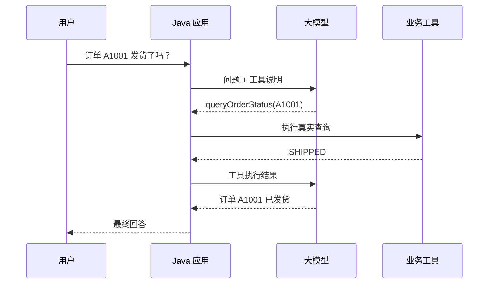
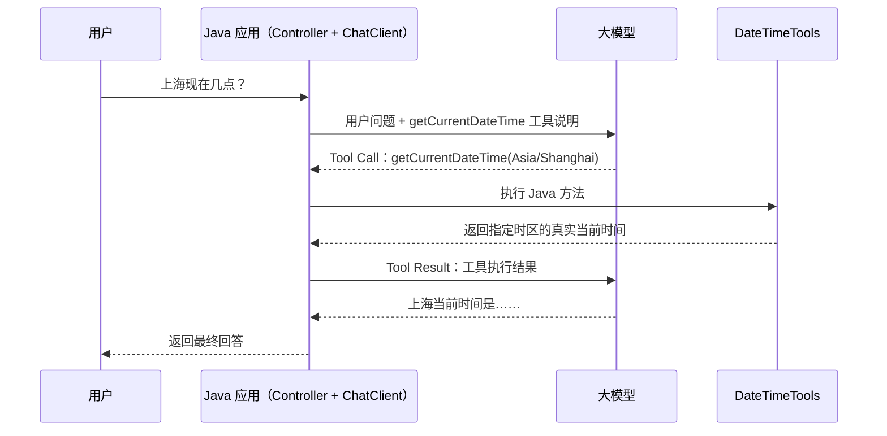

## 一、💡 一句话理解

> [!tip] 第 11 天核心结论
> Tool Calling 就是：模型决定“应该调用哪个工具、传什么参数”，Java 应用负责真正执行工具，再把结果交给模型生成最终回答。

本篇对应 [[0-学习路线]] 第 11 天。

```text
用户提问
  → 模型选择工具并生成参数
  → Java 应用执行工具
  → 模型根据工具结果回答用户
```

最重要的边界：**模型只提出调用请求，不会直接执行 Java 方法，也不应该直接操作数据库。**

## 二、🧭 理论：它是什么

### 2.1 为什么需要 Tool Calling

大模型擅长理解和生成文字，但不知道实时业务数据，例如：

- 订单 `A1001` 是否发货；
- 商品还有多少库存；
- 当前准确时间；
- 用户是否有退款权限。

如果让模型直接回答，它可能会猜。Tool Calling 让模型向 Java 应用请求真实数据或业务能力。

用大白话说，可以把整个过程想成“用户去服务台查询订单”。下面只是帮助理解的类比，真实系统里仍然是模型、Spring AI 和 Java 代码在交换消息。

| 角色 | 大白话类比 | 具体负责什么 | 不负责什么 |
| --- | --- | --- | --- |
| 模型 | 服务台接待员 | 听懂用户的问题，选择合适的工具，并从问题中整理出参数，例如 `orderId=A1001`；拿到工具结果后，再组织成自然语言答案。 | 不直接执行 Java 方法，不直接查询数据库，也不能自己编造订单状态。 |
| Spring AI | 流程协调员 | 把可用工具说明交给模型；收到 Tool Call 后转给 Java 应用；工具执行完成后，再把结果交回模型，并管理可能出现的多轮工具调用。 | 不提供真实订单数据，也不替业务系统决定权限规则。 |
| Java 应用 | 真正办事的工作人员 | 校验订单号是否合法、用户是否有权限，然后执行指定的 Java 方法；同时处理异常、超时和安全控制。 | 不会无条件相信模型生成的工具名和参数。 |
| 业务系统 | 保存真实档案的后台 | 从订单数据库、物流服务或库存系统中返回真实业务数据；它可能位于当前应用中，也可能是其他微服务。 | 不理解用户的自然语言，也不负责选择调用哪个工具。 |

放进一个真实问题里就是：

```text
用户：“订单 A1001 发货了吗？”
  → 模型：听懂问题，申请调用 queryOrderStatus，参数是 A1001
  → Spring AI：把这次调用申请交给 Java 应用
  → Java 应用：校验订单号和用户权限，再查询订单系统
  → 业务系统：返回真实状态 SHIPPED
  → Spring AI：把 SHIPPED 交回模型
  → 模型：整理成“订单 A1001 已发货”并回答用户
```

> [!tip] 最简单的记法
> 模型负责“听懂并决定查什么”，Spring AI 负责“把整个调用流程串起来”，Java 应用负责“安全地执行”，业务系统负责“提供真实数据”。

### 2.2 Function Calling 和 Tool Calling

#### 2.2.1 Function Calling 到底是什么

Function Calling 这个名字很容易让人误以为“模型亲自执行了一个函数”，但真实含义是：

> **Java 后端先告诉模型：“我这里有一个查询时间的方法可以使用。”模型看完用户问题后回复 Java 后端：“请运行查询时间方法，参数是 `America/New_York`。”最后由 Java 后端真正运行这个方法。**

结合当前代码，`.tools(new DateTimeTools())` 会让 Spring AI 读取 `@Tool` 和 `@ToolParam`，整理出一份工具说明。发送给模型的内容可以近似理解为：

```json
{
  "用户问题": "纽约现在几点？",
  "可用工具": [
    {
      "name": "getCurrentDateTime",
      "description": "查询指定时区的当前时间",
      "parameters": {
        "zoneId": "时区名称"
      }
    }
  ]
}
```

注意：这里发给模型的是“方法使用说明”，不是 `DateTimeTools` 的完整 Java 源码。

模型看完以后，不直接查询时间，而是返回类似：

```json
{
  "name": "getCurrentDateTime",
  "arguments": {
    "zoneId": "America/New_York"
  }
}
```

这句话翻译成人话就是：

```text
模型对 Java 后端说：
“这个问题需要查询时间。请你调用 getCurrentDateTime 方法，
并把 America/New_York 作为 zoneId 参数传进去。”
```

Spring AI 收到这份回复后，才会在 Java 应用中找到对应的 `@Tool` 方法并真正执行：

```java
getCurrentDateTime("America/New_York");
```

可以把模型理解成一个只负责填写“函数调用单”的人。调用单中写着：

```text
要调用哪个函数？
要给这个函数传什么参数？
```

模型只负责填单，不负责真正办事。

#### 2.2.2 用查询时间举例

Java 应用先告诉模型存在一个函数：

```text
函数名：getCurrentDateTime
作用：查询指定时区的当前时间
参数：zoneId，例如 Asia/Shanghai
```

用户提问：

```text
纽约现在几点？
```

普通聊天模型可能直接猜时间；支持 Function Calling 的模型可以不回答正文，而是返回一份结构化调用请求：

```json
{
  "name": "getCurrentDateTime",
  "arguments": {
    "zoneId": "America/New_York"
  }
}
```

这一步就是 **Function Calling**。它表示模型判断应该使用 `getCurrentDateTime`，并从问题中整理出了参数，但此时 Java 方法还没有执行。

接下来由 Java 应用完成真正的调用：

```java
getCurrentDateTime("America/New_York");
```

Java 方法返回真实时间后，应用再把结果交给模型，模型最后回答：

```text
纽约当前时间是……
```

完整过程可以记成：

```text
模型生成：函数名 + 参数
  → Java 应用执行函数
  → 函数返回真实结果
  → 模型整理最终答案
```

#### 2.2.3 Function Calling 和 Tool Calling 的关系

Function Calling 是把一个“函数”作为模型可申请使用的能力。Tool Calling 是更宽泛的总称，工具除了函数，还可能是平台内置搜索、代码执行或 MCP 服务器提供的远程能力。

| 名称 | 大白话理解 | 当前项目中的例子 |
| --- | --- | --- |
| Function Calling | 模型生成函数名和参数，由应用执行函数 | `getCurrentDateTime({"zoneId":"America/New_York"})` |
| Tool Calling | 模型申请使用外部能力的整体机制 | Spring AI 把 Java 方法包装成 Tool 并管理完整调用循环 |

在当前学习路线中，Spring AI 使用 `@Tool` 把 Java 方法提供给模型，因此统一称为 Tool Calling；底层仍然包含“模型生成方法名和参数”这个 Function Calling 思路。

### 2.3 四个核心概念

| 概念 | 含义 | 示例 |
| --- | --- | --- |
| Tool Definition | 给模型看的工具说明书 | 名称、用途、参数 JSON Schema |
| Tool Call | 模型生成的调用请求 | `queryOrderStatus({"orderId":"A1001"})` |
| Tool Result | Java 应用执行后的真实结果 | `{"status":"SHIPPED"}` |
| Final Response | 模型整理后的最终回答 | “订单 A1001 已发货。” |

模型看到的是工具说明，不是 Java 方法源码、数据库连接或 API Key。

### 2.4 和结构化输出有什么区别

[[6.结构化输出、JSON Schema]] 与 Tool Calling 都使用结构化数据，但用途不同。

| 对比 | 结构化输出 | Tool Calling |
| --- | --- | --- |
| 目标 | 让最终回答符合固定格式 | 调用外部能力获取数据或执行动作 |
| 是否执行 Java 方法 | 通常不执行 | 会执行 |
| 是否再次请求模型 | 通常不需要 | 通常需要 |

结构化输出可以判断用户想查订单，但只有 Tool Calling 才能调用订单系统取得真实状态。

## 三、⚙️ 理论：它是怎么工作的

### 3.1 完整调用流程

以“订单 A1001 发货了吗”为例：

1. Java 应用把用户问题和可用工具说明发给模型。
2. 模型返回工具名称和 JSON 参数。
3. Java 应用校验参数并执行真实方法。
4. Java 应用把执行结果发回模型。
5. 模型生成最终回答；如果还需要其他工具，则继续循环。


```mermaid
sequenceDiagram
    participant U as 用户
    participant A as Java 应用
    participant M as 大模型
    participant T as 业务工具

    U->>A: 订单 A1001 发货了吗？
    A->>M: 问题 + 工具说明
    M-->>A: queryOrderStatus(A1001)
    A->>T: 执行真实查询
    T-->>A: SHIPPED
    A->>M: 工具执行结果
    M-->>A: 订单 A1001 已发货
    A-->>U: 最终回答
```

一次 Tool Calling 通常至少产生两次模型请求：第一次决定工具，第二次根据工具结果组织答案。

### 3.2 什么时候会调用，什么时候不会调用

先记住：`.tools(...)` 只是把工具放进本次请求的“候选工具列表”，不是命令模型必须调用。默认情况下，模型会根据用户问题和工具描述自行判断。

模型的判断不是 Java 中写死的 `if/else`，而是一次语言模型预测。应用请求模型时，会同时发送用户问题和每个工具的说明；模型结合下面这些信息，预测本轮应该直接输出文字，还是输出一个结构化 Tool Call。

| 判断依据 | 模型会看什么 | 示例 |
| --- | --- | --- |
| 用户问题 | 用户真正想知道或完成什么 | “订单 A1001 发货了吗？”说明需要真实订单状态。 |
| 工具名称 | 工具名称是否和问题语义匹配 | `queryOrderStatus` 比 `queryData` 更容易被正确选择。 |
| 工具描述 | 工具能做什么、什么时候使用、有什么限制 | “根据订单编号查询当前订单状态；只读，不修改订单。” |
| 参数 Schema | 调用工具需要哪些参数以及参数类型 | 模型从问题中提取 `orderId=A1001`。 |
| System Prompt | 应用对模型设置的规则 | “实时业务数据必须通过工具查询，不允许猜测。” |
| 对话上下文 | 前几轮已经提供了什么信息 | 用户上一轮已经给出订单号，本轮只说“它发货了吗”。 |
| 工具调用策略 | 允许模型自由选择，还是由应用强制或禁止 | 默认通常是自动选择；部分模型接口也支持强制调用或禁止调用。 |

模型最后会在两类输出中选择一种：

```text
不需要工具 → 输出普通文字回答

需要工具   → 输出结构化 Tool Call
             name = queryOrderStatus
             arguments = {"orderId":"A1001"}
```

这仍然是概率判断，不保证每次都完全正确。工具名和描述越明确、候选工具越少、参数 Schema 越清晰，模型越容易选对。Java 应用仍要校验最终的工具名和参数。

| 用户的问题 | 是否通常调用 Tool | 原因 |
| --- | --- | --- |
| “订单 A1001 发货了吗？” | 会 | 需要查询业务系统中的实时订单状态。 |
| “上海现在几点？” | 会 | 需要取得当前时间，不能只依赖模型已有知识。 |
| “帮我创建一个售后工单” | 会提出调用请求 | 需要执行系统动作；Java 应用仍应先进行权限校验和人工确认。 |
| “什么是订单状态？” | 不会 | 这是通用概念，模型可以直接解释。 |
| “请帮我润色这段文字” | 不会 | 只需要模型自身的语言能力。 |
| “1 + 1 等于多少？” | 通常不会 | 问题简单，不需要外部数据或动作。 |
| “查询订单 A1001”，但本次请求没有注册订单工具 | 不会 | 模型看不到这个工具，只能说明无法查询，或者产生不可靠的猜测。 |
| 已注册时间工具，但用户询问 Java 集合 | 不会 | 工具虽然可用，但和当前问题无关。 |

通常满足下面三个条件，才会发生工具调用：

```text
当前请求注册了合适的工具
  + 模型本身支持 Tool Calling
  + 模型判断回答需要外部数据或系统动作
  = 模型返回 Tool Call，Spring AI 执行工具
```

不会调用的常见情况有：

1. 问题靠模型自身知识就能回答。
2. 注册的工具与问题无关。
3. 当前请求根本没有注册所需工具。
4. 工具名称或描述太模糊，模型没有正确识别。
5. 当前模型或供应商接口不支持 Tool Calling。
6. 应用明确禁止工具调用，或者在执行前因参数、权限、人工审批没有通过而拦截。

> [!info] “没有调用”和“没有执行”不完全一样
> 模型没有返回 Tool Call，叫“没有调用”；模型已经申请调用，但被 Java 应用的权限或审批逻辑拦住，叫“提出了调用请求，但没有真正执行”。

### 3.3 Spring AI 2.0.1 做了什么

Spring AI 2.0.1 使用 `ToolCallingAdvisor` 管理调用循环，使用 `ToolCallingManager` 查找并执行 `ToolCallback`。

业务代码通常只需要写一次 `.call()`：

```java
String answer = chatClient.prompt()
        .user(question)
        .tools(new DateTimeTools())
        .call()
        .content();
```

内部过程是：

```text
第一次请求模型
  → 收到 Tool Call
  → 执行 Java 方法
  → 把 Tool Result 加入对话
  → 再次请求模型
  → 返回最终回答
```

如果模型认为问题不需要工具，它也可以直接回答。

### 3.4 必须记住的安全边界

模型生成的工具名和参数都是不可信输入，Java 应用必须掌握最终执行权。

| 风险 | 必要控制 |
| --- | --- |
| 调错工具 | 只注册当前请求允许使用的工具 |
| 参数错误 | 类型、格式、范围和业务校验 |
| 越权访问 | 从登录态读取身份并在后端鉴权 |
| 重复写入 | 幂等键、事务和审计日志 |
| 高风险操作 | 执行前人工确认 |
| 无限循环 | 超时、最大步数和重复调用检测 |

> [!warning] 写操作不能直接自动执行
> 查询时间等只读工具可以自动执行；退款、删除、创建工单等写操作必须增加权限、幂等、审计和人工确认。

## 四、🚀 实践：跑通第一个工具

### 4.1 前置准备

沿用学习路线已有环境：

- Java 21；
- Spring Boot 4.1.1；
- Spring AI 2.0.1；
- Maven 3.9.16；
- 一个支持 Tool Calling 的聊天模型。

`pom.xml` 已包含：

```xml
<dependency>
    <groupId>org.springframework.ai</groupId>
    <artifactId>spring-ai-starter-model-openai</artifactId>
</dependency>
```

`application.properties` 沿用已有模型配置：

```properties
# 密钥只从环境变量读取，不写入代码或 Git。
spring.ai.openai.api-key=${DEEPSEEK_API_KEY}
spring.ai.openai.base-url=https://api.deepseek.com
spring.ai.openai.chat.model=deepseek-v4-flash
```

模型名称和能力可能变化。普通聊天成功但工具没有执行时，应先确认当前模型和供应商接口支持 Tool Calling。

### 4.2 可以拿来干什么

Tool Calling 主要有两类用途：

1. **查询真实数据**：时间、天气、订单、物流和库存。
2. **执行系统动作**：创建工单、发送消息和触发审批。

本篇只实现无副作用的“查询当前时间”，用最少代码观察完整调用链。

### 4.3 完整代码

下面这张图对应后文 `DateTimeTools` 和 `ToolCallingController` 的完整调用过程：


```mermaid
sequenceDiagram
    participant U as 用户
    participant A as Java 应用（Controller + ChatClient）
    participant M as 大模型
    participant T as DateTimeTools

    U->>A: 上海现在几点？
    A->>M: 用户问题 + getCurrentDateTime 工具说明
    M-->>A: Tool Call：getCurrentDateTime(Asia/Shanghai)
    A->>T: 执行 Java 方法
    T-->>A: 返回指定时区的真实当前时间
    A->>M: Tool Result：工具执行结果
    M-->>A: 上海当前时间是……
    A-->>U: 返回最终回答
```

图中的两次“大模型”交互都发生在一次 `.call()` 内部：第一次让模型选择工具并生成参数，第二次让模型根据工具结果整理最终答案；中间的工具执行由 Spring AI 自动管理。

#### 4.3.1 定义工具

文件：`src/main/java/com/afyke/ai/tool/DateTimeTools.java`

```java
package com.afyke.ai.tool;

import org.springframework.ai.tool.annotation.Tool;
import org.springframework.ai.tool.annotation.ToolParam;

import java.time.ZoneId;
import java.time.ZonedDateTime;
import java.time.format.DateTimeFormatter;

public class DateTimeTools {

    // @Tool：把下面的 Java 方法声明为一个可供模型选择的工具。
    // 只有当 DateTimeTools 对象通过 .tools(...) 或 .defaultTools(...) 注册后，
    // Spring AI 才会读取这个注解，并把工具说明发送给模型。
    //
    // description：告诉模型这个工具能做什么、什么时候应该使用。
    // 它会影响模型是否选择该工具，但不会执行 Java 代码，也不负责参数校验。
    @Tool(description = "查询指定时区的当前日期和时间；当用户询问现在几点、今天日期或当前时间时使用")
    public String getCurrentDateTime(
            // @ToolParam：描述 zoneId 参数的含义和格式，
            // Spring AI 会用它生成工具参数的 JSON Schema，帮助模型正确传参。
            //
            // required = false：告诉模型这个参数可以不传。
            // 注意：它只把参数标记为可选，不会自动把参数设置成 Asia/Shanghai。
            @ToolParam(
                    description = "IANA 时区名称，例如 Asia/Shanghai；用户未说明时区时可以不传",
                    required = false)
            String zoneId) {

        // description 只是给模型看的说明，不会自动生成 Java 默认值。
        // 因此参数为空时，仍要由业务代码真正设置默认时区。
        String actualZoneId = (zoneId == null || zoneId.isBlank())
                ? "Asia/Shanghai"
                : zoneId;

        // ZoneId.of：把最终时区字符串转换为 Java 时区对象。
        ZoneId zone = ZoneId.of(actualZoneId);

        // ZonedDateTime.now：由 Java 应用读取真实时间，不让模型猜测。
        ZonedDateTime now = ZonedDateTime.now(zone);

        // format：生成稳定的工具结果，再交给模型组织最终回答。
        return now.format(DateTimeFormatter.ISO_ZONED_DATE_TIME);
    }
}
```

这两个注解都会参与生成模型看到的工具说明，但职责不同：

| 注解 | 标注位置 | 大白话作用 |
| --- | --- | --- |
| `@Tool` | Java 方法上 | 告诉 Spring AI：“这个方法可以作为工具提供给模型”，并通过 `description` 告诉模型什么时候应该选择它。 |
| `@ToolParam` | 方法参数上 | 告诉模型这个参数表示什么、应该传什么格式以及是否必填，帮助模型生成正确的 Tool Call 参数。 |

例如用户问“上海现在几点”，模型可能根据这两个说明生成：

```json
{
  "name": "getCurrentDateTime",
  "arguments": {
    "zoneId": "Asia/Shanghai"
  }
}
```

`description` 只会影响模型的选择和参数生成，不会自动执行校验，也不会自动给 Java 参数设置默认值。真正的默认值、格式校验和异常处理仍要写在 Java 方法中。

#### 4.3.2 创建接口

文件：`src/main/java/com/afyke/ai/controller/ToolCallingController.java`

```java
package com.afyke.ai.controller;

import com.afyke.ai.tool.DateTimeTools;
import org.springframework.ai.chat.client.ChatClient;
import org.springframework.web.bind.annotation.GetMapping;
import org.springframework.web.bind.annotation.RequestMapping;
import org.springframework.web.bind.annotation.RequestParam;
import org.springframework.web.bind.annotation.RestController;

@RestController
@RequestMapping("/api/tool")
public class ToolCallingController {

    private final ChatClient chatClient;

    public ToolCallingController(ChatClient.Builder builder) {
        // build：使用已有模型配置创建 ChatClient。
        this.chatClient = builder.build();
    }

    @GetMapping("/time")
    public String queryCurrentTime(
            @RequestParam(defaultValue = "上海现在几点？请使用工具查询。")
            String question) {

        return chatClient
                // prompt：开始组织本次模型请求。
                .prompt()
                // user：放入用户的自然语言问题。
                .user(question)
                // tools：只把时间工具提供给本次请求。
                .tools(new DateTimeTools())
                // call：发起调用；Spring AI 自动完成工具循环。
                .call()
                // content：取出循环结束后的最终文字回答。
                .content();
    }
}
```

### 4.4 启动和验证

编译并启动：

```bash
/Volumes/data/develop/apache-maven-3.9.16/bin/mvn clean compile
/Volumes/data/develop/apache-maven-3.9.16/bin/mvn spring-boot:run
```

发送请求：

```http
GET http://localhost:8080/api/tool/time?question=上海现在几点？请使用工具查询
```

或使用命令行：

```bash
curl --get 'http://localhost:8080/api/tool/time' \
  --data-urlencode 'question=上海现在几点？请使用工具查询'
```

返回内容的措辞不固定，结果可能类似：

```text
上海当前时间是 2026 年 9 月 23 日 15:00，时区为 Asia/Shanghai。
```

可以临时在工具方法中加入下面的日志，确认 Java 方法真的执行了：

```java
System.out.println("执行 getCurrentDateTime，zoneId=" + zoneId);
```

### 4.5 常见问题

#### 4.5.1 模型直接回答，没有调用工具

依次检查：

1. 模型是否支持 Tool Calling；
2. 请求中是否包含 `.tools(new DateTimeTools())`；
3. `@Tool` 描述是否明确；
4. 问题是否确实需要实时数据。

#### 4.5.2 出现 `Unknown time-zone ID`

模型生成了 Java 不支持的时区名称。说明 Tool Call 参数仍然需要校验；第 13 天会专门学习参数设计和校验。

#### 4.5.3 为什么比普通聊天慢

普通聊天通常只请求一次模型。Tool Calling 至少要经过“模型选择工具”和“模型整理工具结果”两次调用，因此延迟和 Token 消耗通常更高。

## 五、📌 总结

- Tool Calling 是“模型提出调用请求，Java 应用执行真实代码”。
- Tool Definition 包含工具名、用途和参数 JSON Schema。
- Spring AI 2.0.1 自动管理“请求模型 → 执行工具 → 再请求模型”的循环。
- 模型生成的参数不可信，后端必须校验参数和权限。
- 查询工具可以自动执行，高风险写操作必须人工确认并保证幂等。

> [!tip] 记忆句
> 模型负责“想调用什么”，应用负责“能不能调、怎么调、结果是什么”。

下一步：学习如何用 Java 方法、`@Tool` 和 `@ToolParam` 定义业务工具。

## 六、📚 官方资料

- [Spring AI 2.0.1 Tool Calling](https://docs.spring.io/spring-ai/reference/api/tools.html)
- [OpenAI Function Calling Guide](https://developers.openai.com/api/docs/guides/function-calling)
