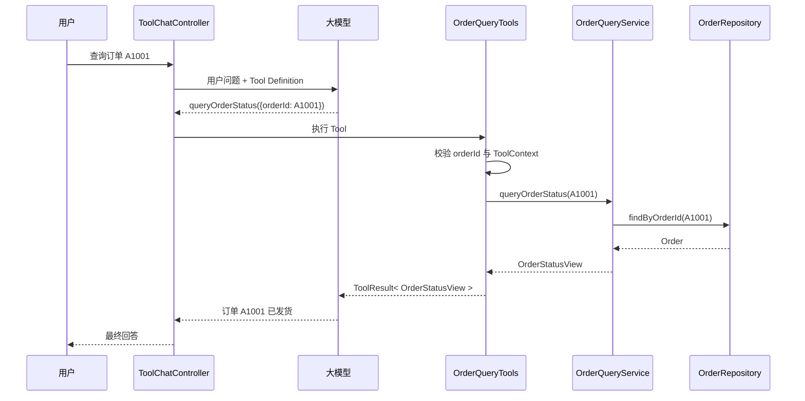

## 一、💡 一句话理解

> [!tip] 第 14 天核心结论
> 实现订单查询工具，不是把订单数据直接写进 `@Tool` 方法，而是让 Tool 只负责接收模型参数和返回结果，把真正的订单查询交给 `OrderQueryService`，再由 `OrderRepository` 隔离具体数据来源。

本篇对应 [[0-学习路线]] 第 14 天，前置知识是：

- [[11.Function Calling、Tool Calling 原理]]：理解模型只提出工具调用请求，Java 应用才是真正执行者；
- [[12.用 Java 方法定义 Tool]]：会使用 `@Tool`、`@ToolParam` 和 `.tools(...)`；
- [[13.工具参数设计和校验]]：会校验模型生成的 `orderId`，并使用 `ToolContext` 传递可信上下文。

今天不再重复“怎样定义一个 Tool”，而是把前一天的演示代码改造成一条清晰的业务调用链：

```text
用户自然语言
  → 模型生成 queryOrderStatus(orderId)
  → OrderQueryTools 校验工具参数
  → OrderQueryService 执行业务查询
  → OrderRepository 读取订单数据
  → ToolResult 返回结构化结果
  → 模型组织最终中文回答
```

> [!info] 本篇为什么暂时不用 PostgreSQL
> 学习路线把 PostgreSQL、pgvector 和数据入库安排在第 24～25 天。第 14 天先使用可替换的 `OrderRepository` 接口和内存实现，重点学会 Tool 与业务代码分层。以后接数据库或下游 RPC 时，只替换 Repository 实现，不需要重写 Tool。

## 二、🧭 理论：订单查询工具是什么

### 2.1 它不是“模型直接查订单”

用户说“帮我查订单 A1001”，模型不会获得数据库连接，也不会直接调用订单系统。

模型只能根据工具说明生成一份近似下面的调用申请：

```json
{
  "name": "queryOrderStatus",
  "arguments": {
    "orderId": "A1001"
  }
}
```

Spring AI 再把这份参数交给 Java 方法。真正查询数据的是 Java 应用中的 Service 和 Repository。

官方文档明确说明：模型负责请求工具并提供参数，应用负责执行工具并把结果返回给模型；模型不会直接访问工具背后的 API。

### 2.2 为什么不能把查询逻辑全写进 Tool

前一天的 `OrderQueryTools` 同时做了四件事：

1. 定义模型可见的工具；
2. 校验订单号；
3. 保存模拟订单数据；
4. 查询并拼装订单状态。

学习示例可以这样写，但真实项目会出现几个问题：

| 问题 | 具体后果 |
| --- | --- |
| Tool 和数据源绑死 | 从内存切换到数据库或 RPC 时必须修改 Tool |
| 业务逻辑无法复用 | 普通 HTTP 接口想查订单时只能复制代码 |
| 测试边界混乱 | 测一个查询规则却必须同时准备模型和 ChatClient |
| 职责不断膨胀 | 后续加入权限、缓存、超时后，一个类会越来越大 |

因此本篇把职责拆开：

| 层次 | 职责 | 不负责什么 |
| --- | --- | --- |
| `OrderQueryTools` | 暴露 Tool、接收模型参数、读取 `ToolContext`、执行输入校验、转换工具结果 | 不保存订单，不直接访问数据库 |
| `OrderQueryService` | 编排订单查询业务，决定“找到”和“未找到”怎样返回 | 不关心模型、Prompt 和 Tool Calling |
| `OrderRepository` | 定义读取订单的接口 | 不关心模型怎样提取订单号 |
| `InMemoryOrderRepository` | 本地学习阶段提供可运行的数据源 | 不是生产数据库实现 |

### 2.3 Repository 接口为什么有价值

Repository 可以理解成“订单数据的插座”。Service 只依赖插座规格，不依赖电从哪里来。

当前阶段：

```text
OrderQueryService → OrderRepository → InMemoryOrderRepository
```

以后可以变成：

```text
OrderQueryService → OrderRepository → JdbcOrderRepository
```

或者：

```text
OrderQueryService → OrderRepository → OrderRpcRepository
```

类比只用于帮助理解。真实概念是**依赖倒置**：业务层依赖稳定接口，基础设施层实现这个接口。

### 2.4 查询结果为什么不直接返回数据库实体

数据库实体往往包含模型不需要、也不应该看到的字段，例如：

- 内部主键；
- 用户手机号；
- 支付流水号；
- 数据库版本号；
- 内部风控标记。

本篇单独定义 `OrderStatusView`，只向模型返回回答问题所需的数据：

```json
{
  "orderId": "A1001",
  "status": "SHIPPED",
  "statusDescription": "订单已发货",
  "updatedAt": "2026-09-25T10:30:00"
}
```

> [!warning] Tool 返回值也是模型输入
> Spring AI 默认使用 Jackson 把 Java 返回对象序列化成字符串，再交回模型。返回字段要少而明确，不要把数据库实体、异常堆栈或敏感字段整个交给模型。

## 三、⚙️ 理论：完整查询链路怎样工作

### 3.1 从用户问题到最终回答

Spring AI 2.0.1 的 `ChatClient` 会通过 `ToolCallingAdvisor` 管理工具调用循环：

1. Java 应用把用户问题和工具定义发给模型；
2. 模型决定调用 `queryOrderStatus`，并生成 `orderId`；
3. Spring AI 找到 `OrderQueryTools.queryOrderStatus(...)` 并执行；
4. Tool 校验参数后调用 `OrderQueryService`；
5. Service 通过 Repository 获取订单；
6. Tool 把 `ToolResult` 返回给 Spring AI；
7. Spring AI 把工具结果追加到对话，再次请求模型；
8. 模型把结构化状态整理成用户能读懂的回答。



### 3.2 `orderId` 和 `userId` 的来源不同

| 数据 | 来源 | 模型能否生成 | 当前用途 |
| --- | --- | --- | --- |
| `orderId` | 用户自然语言 | 能 | 指定要查哪一笔订单 |
| `userId` | Java 登录上下文 | 不能 | 标识本次调用者，为第 19 天权限校验预留可信输入 |

Controller 通过 `.toolContext(...)` 传入 `userId`。官方文档说明，`ToolContext` 不会发送给模型，而是在 Tool 执行时由 Spring AI 直接交给 Tool。

当前示例仍使用 `demo-user`，只是为了跑通调用链。生产项目必须从认证上下文获取真实用户身份，不能信任 HTTP 请求体或模型填写的 `userId`。

### 3.3 成功、未找到和非法参数要分开

三类结果代表不同问题：

| 情况 | 结果码 | 含义 | 是否调用 Repository |
| --- | --- | --- | --- |
| 订单号格式错误 | `INVALID_ARGUMENT` | 模型参数不合法 | 否 |
| 订单不存在 | `ORDER_NOT_FOUND` | 参数合法，但业务数据不存在 | 是 |
| 查询成功 | `OK` | 找到订单并返回必要状态 | 是 |

不要把它们都写成“查询失败”。稳定结果码能让日志、测试和后续 Agent 工作流准确区分原因。

### 3.4 本篇刻意保留的边界

本篇只实现**只读订单状态查询**，不会提前加入后续课程内容：

- 第 15 天再实现物流查询工具；
- 第 17 天再让模型在多个工具之间自动选择；
- 第 18 天再系统处理工具异常、超时和重试；
- 第 19 天再实现订单归属权限和人工确认；
- 第 24～25 天再接入 PostgreSQL/pgvector 和真实持久化。

## 四、🚀 实践：实现完整订单查询工具

### 4.1 前置准备

#### 4.1.1 当前项目环境

严格沿用学习路线中的环境：

- Java 21；
- Spring Boot 4.1.1；
- Spring AI 2.0.1；
- Maven 3.9.16；
- 一个支持 Tool Calling 的 OpenAI 兼容模型。

本篇继续使用现有项目：

```text
/Volumes/data/ideaWorkSpace/AI
```

#### 4.1.2 沿用已有依赖

当前 `pom.xml` 已经包含所需依赖，无须为本篇新增数据库依赖：

```xml
<!-- 提供 @NotBlank、@Pattern 和 Validator。 -->
<dependency>
    <groupId>org.springframework.boot</groupId>
    <artifactId>spring-boot-starter-validation</artifactId>
</dependency>

<!-- 提供 ChatClient、@Tool、@ToolParam 和 ToolContext。 -->
<dependency>
    <groupId>org.springframework.ai</groupId>
    <artifactId>spring-ai-starter-model-openai</artifactId>
</dependency>
```

#### 4.1.3 沿用模型配置

继续使用现有的 `src/main/resources/application.properties`。API Key 必须通过环境变量注入，不要写进配置文件或提交到 Git。

示意配置如下，实际模型名和地址以当前供应商为准：

```properties
spring.ai.openai.api-key=${DEEPSEEK_API_KEY}
spring.ai.openai.base-url=https://api.deepseek.com
spring.ai.openai.chat.model=deepseek-v4-flash
```

模型规格可能变化。运行前应确认当前所选模型支持 Tool Calling。

#### 4.1.4 本篇文件结构

完成后关键文件如下：

```text
src/main/java/com/afyke/ai/
├── controller/toolController/
│   └── ToolChatController.java
├── order/
│   ├── domain/
│   │   ├── Order.java
│   │   └── OrderStatus.java
│   ├── repository/
│   │   ├── InMemoryOrderRepository.java
│   │   └── OrderRepository.java
│   └── service/
│       ├── OrderQueryResult.java
│       └── OrderQueryService.java
└── tool/
    ├── OrderQueryTools.java
    ├── QueryOrderCommand.java
    └── ToolResult.java

src/test/java/com/afyke/ai/
├── order/service/OrderQueryServiceTest.java
└── tool/OrderQueryToolsTest.java
```

### 4.2 可以拿来干什么

#### 4.2.1 让模型查询真实业务层，而不是猜状态

用途：用户用自然语言提问，模型只负责提取订单号，状态必须从业务 Service 获取。

前置对象：`orderQueryService` 由 Spring 注入，数据通过 `OrderRepository` 获得。

```java
@Tool(
        name = "queryOrderStatus",
        description = "根据订单编号查询当前订单状态；用户询问订单是否付款、发货、完成或取消时使用；只读，不修改订单"
)
public ToolResult<OrderQueryResult> queryOrderStatus(
        @ToolParam(
                description = "订单编号，格式为大写字母 A 加 4～10 位数字，例如 A1001",
                required = true
        )
        String orderId,
        ToolContext toolContext) {

    // Tool 只负责接入和保护边界，真实查询交给 Service。
    return queryOrderStatusInternal(orderId, toolContext);
}
```

输入：`订单 A1001 发货了吗？`

处理：模型生成 `orderId=A1001`，Tool 调用 Service 查询。

输出：模型根据真实 Tool Result 回答“订单 A1001 已发货”。

适用场景：订单状态、物流状态、库存余量等必须以业务系统实时数据为准的问题。

#### 4.2.2 让普通接口和 Agent 共用同一套业务能力

用途：业务查询写在 Service 后，Tool、Controller、定时任务都能复用。

前置对象：调用方已经注入 `OrderQueryService`。

```java
OrderQueryResult result = orderQueryService.queryOrderStatus("A1001");
```

输入是合法订单号；输出是与模型无关的 `OrderQueryResult`。Service 不知道调用方是 Agent，因此可以单独测试，也可以被传统 Java 接口使用。

#### 4.2.3 随时替换订单数据来源

用途：学习阶段使用内存数据，以后切换成 PostgreSQL 或下游订单 RPC 时，不修改 Tool 和 Service 的核心流程。

前置对象：新的数据访问类必须实现 `OrderRepository`。

```java
public interface OrderRepository {
    Optional<Order> findByOrderId(String orderId);
}
```

当前输入来自内存 Map，将来可以来自 SQL 或 RPC；输出始终是 `Optional<Order>`。`Optional` 只在应用内部使用，不作为 Tool 的参数或返回值，因为 Spring AI 官方文档不支持把 `Optional` 直接作为方法型 Tool 的参数或返回类型。

### 4.3 完整实践：代码、启动和验证

#### 4.3.1 定义订单状态枚举

文件位置：

```text
src/main/java/com/afyke/ai/order/domain/OrderStatus.java
```

```java
package com.afyke.ai.order.domain;

/**
 * 订单在当前学习项目中可能出现的状态。
 * code 使用稳定英文值，description 用于给用户和模型解释。
 */
public enum OrderStatus {

    PAID("订单已付款，等待发货"),
    PROCESSING("订单正在处理中"),
    SHIPPED("订单已发货"),
    COMPLETED("订单已完成"),
    CANCELLED("订单已取消");

    private final String description;

    OrderStatus(String description) {
        this.description = description;
    }

    public String getDescription() {
        return description;
    }
}
```

这里不让代码到处手写 `"SHIPPED"`。枚举可以限制合法状态，同时保留稳定状态码和中文解释。

#### 4.3.2 定义内部订单对象

文件位置：

```text
src/main/java/com/afyke/ai/order/domain/Order.java
```

```java
package com.afyke.ai.order.domain;

import java.time.LocalDateTime;

/**
 * 应用内部使用的订单对象。
 * 当前只保留本篇查询需要的字段，后续可以由数据库实体或 RPC DTO 转换而来。
 */
public record Order(
        String orderId,
        OrderStatus status,
        LocalDateTime updatedAt
) {
}
```

输入是仓储层读取的订单数据；输出是供 Service 使用的领域对象。它不会直接作为 Tool Result 返回给模型。

#### 4.3.3 定义订单仓储接口

文件位置：

```text
src/main/java/com/afyke/ai/order/repository/OrderRepository.java
```

```java
package com.afyke.ai.order.repository;

import com.afyke.ai.order.domain.Order;

import java.util.Optional;

/**
 * 订单数据读取契约。
 * Service 只依赖这个接口，不关心数据来自内存、数据库还是远程 RPC。
 */
public interface OrderRepository {

    /**
     * findByOrderId：按照订单编号查询。
     * 找到时返回 Optional.of(order)，找不到时返回 Optional.empty()。
     */
    Optional<Order> findByOrderId(String orderId);
}
```

这里的 `Optional` 只存在于 Java 应用内部，用来明确表达“订单可能不存在”。

#### 4.3.4 提供可运行的内存仓储

文件位置：

```text
src/main/java/com/afyke/ai/order/repository/InMemoryOrderRepository.java
```

```java
package com.afyke.ai.order.repository;

import com.afyke.ai.order.domain.Order;
import com.afyke.ai.order.domain.OrderStatus;
import org.springframework.stereotype.Repository;

import java.time.LocalDateTime;
import java.util.Map;
import java.util.Optional;

/**
 * 第 14 天使用的本地数据源。
 * 它让完整调用链无需数据库即可运行；以后接 PostgreSQL 或 RPC 时替换此实现。
 */
@Repository
public class InMemoryOrderRepository implements OrderRepository {

    private final Map<String, Order> orders = Map.of(
            "A1001", new Order(
                    "A1001",
                    OrderStatus.SHIPPED,
                    LocalDateTime.of(2026, 9, 25, 10, 30)
            ),
            "A1002", new Order(
                    "A1002",
                    OrderStatus.PAID,
                    LocalDateTime.of(2026, 9, 25, 11, 15)
            ),
            "A1003", new Order(
                    "A1003",
                    OrderStatus.COMPLETED,
                    LocalDateTime.of(2026, 9, 24, 18, 0)
            )
    );

    @Override
    public Optional<Order> findByOrderId(String orderId) {
        // ofNullable：Map 找不到数据时得到 Optional.empty()，而不是返回 null。
        return Optional.ofNullable(orders.get(orderId));
    }
}
```

这些订单只用于本地学习验证，不代表真实业务数据。

#### 4.3.5 定义对外查询结果

文件位置：

```text
src/main/java/com/afyke/ai/order/service/OrderQueryResult.java
```

```java
package com.afyke.ai.order.service;

import java.time.LocalDateTime;

/**
 * 订单查询用的只读结果。
 * 只暴露模型回答用户问题真正需要的字段。
 */
public record OrderQueryResult(
        String orderId,
        String status,
        String statusDescription,
        LocalDateTime updatedAt
) {
}
```

这里用字符串返回状态码，模型最终会同时看到 `SHIPPED` 和“订单已发货”，既方便程序识别，也方便生成自然语言。

#### 4.3.6 实现订单查询 Service

文件位置：

```text
src/main/java/com/afyke/ai/order/service/OrderQueryService.java
```

```java
package com.afyke.ai.order.service;

import com.afyke.ai.order.domain.Order;
import com.afyke.ai.order.repository.OrderRepository;
import org.springframework.stereotype.Service;

import java.util.Optional;

/**
 * 订单查询业务层。
 * 它不依赖 ChatClient、Prompt 或 @Tool，因此可以被多种入口复用。
 */
@Service
public class OrderQueryService {

    private final OrderRepository orderRepository;

    public OrderQueryService(OrderRepository orderRepository) {
        // Spring 会注入当前唯一的 InMemoryOrderRepository 实现。
        this.orderRepository = orderRepository;
    }

    public Optional<OrderQueryResult> queryOrderStatus(String orderId) {
        return orderRepository.findByOrderId(orderId)
                // map：找到 Order 时，把内部对象转换成最小只读结果。
                .map(this::toQueryResult);
    }

    private OrderQueryResult toQueryResult(Order order) {
        return new OrderQueryResult(
                order.orderId(),
                order.status().name(),
                order.status().getDescription(),
                order.updatedAt()
        );
    }
}
```

输入是经过 Tool 校验的订单号；处理过程是查询 Repository 并转换结果；输出为 `Optional<OrderQueryResult>`。

#### 4.3.7 沿用参数校验对象

文件位置：

```text
src/main/java/com/afyke/ai/tool/QueryOrderCommand.java
```

```java
package com.afyke.ai.tool;

import jakarta.validation.constraints.NotBlank;
import jakarta.validation.constraints.Pattern;

/**
 * 模型生成的订单号必须经过 Java 后端的真实校验。
 */
public record QueryOrderCommand(
        @NotBlank(message = "订单编号不能为空")
        @Pattern(
                regexp = "^A\\d{4,10}$",
                message = "订单编号格式错误，应为字母 A 加 4～10 位数字，例如 A1001"
        )
        String orderId
) {
}
```

`@ToolParam` 是给模型看的填写提示；这里的 Bean Validation 才是 Java 后端真正执行的输入校验。

#### 4.3.8 沿用统一 Tool 结果

文件位置：

```text
src/main/java/com/afyke/ai/tool/ToolResult.java
```

```java
package com.afyke.ai.tool;

import java.util.List;

/**
 * Tool 返回给模型的统一结果。
 */
public record ToolResult<T>(
        boolean success,
        String code,
        String message,
        T data,
        List<String> errors
) {

    public static <T> ToolResult<T> success(String message, T data) {
        return new ToolResult<>(true, "OK", message, data, List.of());
    }

    public static <T> ToolResult<T> failure(
            String code,
            String message,
            List<String> errors) {
        return new ToolResult<>(false, code, message, null, List.copyOf(errors));
    }
}
```

Spring AI 默认通过 Jackson 把这个 record 序列化成字符串，再作为 Tool Result 交回模型。

#### 4.3.9 改造订单 Tool

文件位置：

```text
src/main/java/com/afyke/ai/tool/OrderQueryTools.java
```

用下面的完整代码替换第 13 天版本：

```java
package com.afyke.ai.tool;

import com.afyke.ai.order.service.OrderQueryResult;
import com.afyke.ai.order.service.OrderQueryService;
import jakarta.validation.ConstraintViolation;
import jakarta.validation.Validator;
import org.springframework.ai.chat.model.ToolContext;
import org.springframework.ai.tool.annotation.Tool;
import org.springframework.ai.tool.annotation.ToolParam;
import org.springframework.stereotype.Component;

import java.util.List;

@Component
public class OrderQueryTools {

    private final Validator validator;
    private final OrderQueryService orderQueryService;

    public OrderQueryTools(
            Validator validator,
            OrderQueryService orderQueryService) {
        // Validator 负责校验模型生成的参数。
        this.validator = validator;
        // Service 负责真正的订单查询业务。
        this.orderQueryService = orderQueryService;
    }

    @Tool(
            name = "queryOrderStatus",
            description = "根据订单编号查询当前订单状态；用户询问订单是否付款、发货、完成或取消时使用；只读，不修改订单"
    )
    public ToolResult<OrderQueryResult> queryOrderStatus(
            @ToolParam(
                    description = "订单编号，格式为大写字母 A 加 4～10 位数字，例如 A1001",
                    required = true
            )
            String orderId,
            ToolContext toolContext) {

        // ToolContext 中的数据来自 Java 应用，不由模型生成。
        Object userIdValue = toolContext.getContext().get("userId");
        String userId = userIdValue == null ? "" : userIdValue.toString();

        if (userId.isBlank()) {
            return ToolResult.failure(
                    "CONTEXT_MISSING",
                    "缺少调用用户上下文",
                    List.of("Java 应用必须通过 ToolContext 提供 userId")
            );
        }

        // Tool 入口只做边界处理，再把业务查询交给内部方法和 Service。
        return queryOrderStatusInternal(orderId);
    }

    /**
     * 内部方法不依赖 ToolContext，便于对参数和业务结果做确定性单元测试。
     */
    ToolResult<OrderQueryResult> queryOrderStatusInternal(String orderId) {
        QueryOrderCommand command = new QueryOrderCommand(orderId);

        // validate：执行 @NotBlank 和 @Pattern 约束。
        var violations = validator.validate(command);

        if (!violations.isEmpty()) {
            List<String> errors = violations.stream()
                    // getMessage：只提取受控错误信息，不把异常堆栈交给模型。
                    .map(ConstraintViolation::getMessage)
                    // sorted：让错误顺序稳定，方便测试比较。
                    .sorted()
                    .toList();

            // 参数未通过时立即结束，不调用订单 Service。
            return ToolResult.failure(
                    "INVALID_ARGUMENT",
                    "工具参数校验失败",
                    errors
            );
        }

        return orderQueryService.queryOrderStatus(command.orderId())
                // map：查到订单时包装成统一成功结果。
                .map(order -> ToolResult.success("订单状态查询成功", order))
                // orElseGet：合法订单号没有对应数据时返回稳定业务错误。
                .orElseGet(() -> ToolResult.failure(
                        "ORDER_NOT_FOUND",
                        "未找到订单",
                        List.of("订单 " + command.orderId() + " 不存在")
                ));
    }
}
```

这次改造最关键的变化是：`OrderQueryTools` 中不再出现 `mockOrders`。Tool 只负责 AI 接入边界，订单数据由 Service 和 Repository 负责。

#### 4.3.10 沿用聊天接口

文件位置：

```text
src/main/java/com/afyke/ai/controller/toolController/ToolChatController.java
```

```java
package com.afyke.ai.controller.toolController;

import com.afyke.ai.tool.OrderQueryTools;
import jakarta.validation.Valid;
import jakarta.validation.constraints.NotBlank;
import org.springframework.ai.chat.client.ChatClient;
import org.springframework.web.bind.annotation.PostMapping;
import org.springframework.web.bind.annotation.RequestBody;
import org.springframework.web.bind.annotation.RequestMapping;
import org.springframework.web.bind.annotation.RestController;

import java.util.Map;

@RestController
@RequestMapping("/api/tool-chat")
public class ToolChatController {

    private final ChatClient chatClient;
    private final OrderQueryTools orderQueryTools;

    public ToolChatController(
            ChatClient.Builder chatClientBuilder,
            OrderQueryTools orderQueryTools) {
        // build：使用已自动配置的 ChatModel 创建 ChatClient。
        this.chatClient = chatClientBuilder.build();
        this.orderQueryTools = orderQueryTools;
    }

    @PostMapping
    public ChatResponse chat(@Valid @RequestBody ChatRequest request) {
        String answer = chatClient.prompt()
                // system：明确实时状态必须查询，禁止模型根据常识猜测。
                .system("""
                        你是订单查询助手。
                        实时订单状态必须调用 queryOrderStatus 工具查询，不能根据常识猜测。
                        如果工具返回参数错误，请用中文告诉用户正确格式并要求补充。
                        如果订单不存在，请明确说明未找到，不要编造状态。
                        """)
                // user：用户的自然语言问题。
                .user(request.message())
                // tools：只给本次请求开放只读订单查询工具。
                .tools(orderQueryTools)
                // toolContext：可信上下文不经过模型。
                // demo-user 只用于本地学习，生产环境应从认证登录态读取。
                .toolContext(Map.of("userId", "demo-user"))
                // call：发起同步请求，并由 Spring AI 驱动 Tool Calling 循环。
                .call()
                // content：取得模型结合 Tool Result 生成的最终回答。
                .content();

        return new ChatResponse(answer);
    }

    public record ChatRequest(
            // 这里只校验 HTTP 请求体，不代替 Tool 参数校验。
            @NotBlank(message = "message 不能为空")
            String message
    ) {
    }

    public record ChatResponse(String answer) {
    }
}
```

#### 4.3.11 测试 Service

文件位置：

```text
src/test/java/com/afyke/ai/order/service/OrderQueryServiceTest.java
```

```java
package com.afyke.ai.order.service;

import com.afyke.ai.order.repository.InMemoryOrderRepository;
import org.junit.jupiter.api.Test;

import static org.junit.jupiter.api.Assertions.assertEquals;
import static org.junit.jupiter.api.Assertions.assertTrue;

class OrderQueryServiceTest {

    private final OrderQueryService orderQueryService =
            new OrderQueryService(new InMemoryOrderRepository());

    @Test
    void shouldReturnOrderStatusWhenOrderExists() {
        var result = orderQueryService.queryOrderStatus("A1001");

        // isPresent：确认 Repository 找到了订单。
        assertTrue(result.isPresent());
        assertEquals("A1001", result.orElseThrow().orderId());
        assertEquals("SHIPPED", result.orElseThrow().status());
        assertEquals("订单已发货", result.orElseThrow().statusDescription());
    }

    @Test
    void shouldReturnEmptyWhenOrderDoesNotExist() {
        var result = orderQueryService.queryOrderStatus("A9999");

        // isEmpty：合法订单号没有数据时，不伪造默认订单。
        assertTrue(result.isEmpty());
    }
}
```

这个测试完全不调用大模型，用来确定 Service 与 Repository 的业务行为。

#### 4.3.12 测试 Tool 边界

文件位置：

```text
src/test/java/com/afyke/ai/tool/OrderQueryToolsTest.java
```

```java
package com.afyke.ai.tool;

import com.afyke.ai.order.repository.InMemoryOrderRepository;
import com.afyke.ai.order.service.OrderQueryService;
import jakarta.validation.Validation;
import jakarta.validation.Validator;
import org.junit.jupiter.api.BeforeEach;
import org.junit.jupiter.api.Test;

import static org.junit.jupiter.api.Assertions.assertEquals;
import static org.junit.jupiter.api.Assertions.assertFalse;
import static org.junit.jupiter.api.Assertions.assertTrue;

class OrderQueryToolsTest {

    private OrderQueryTools orderQueryTools;

    @BeforeEach
    void setUp() {
        // buildDefaultValidatorFactory：创建真实 Bean Validation 验证器。
        Validator validator = Validation
                .buildDefaultValidatorFactory()
                .getValidator();

        var repository = new InMemoryOrderRepository();
        var service = new OrderQueryService(repository);

        orderQueryTools = new OrderQueryTools(validator, service);
    }

    @Test
    void shouldRejectInvalidOrderIdBeforeQueryingBusinessData() {
        var result = orderQueryTools.queryOrderStatusInternal("1001");

        assertFalse(result.success());
        assertEquals("INVALID_ARGUMENT", result.code());
        assertTrue(result.errors().getFirst().contains("A 加 4～10 位数字"));
    }

    @Test
    void shouldReturnNotFoundForUnknownOrder() {
        var result = orderQueryTools.queryOrderStatusInternal("A9999");

        assertFalse(result.success());
        assertEquals("ORDER_NOT_FOUND", result.code());
    }

    @Test
    void shouldReturnStableResultForExistingOrder() {
        var result = orderQueryTools.queryOrderStatusInternal("A1001");

        assertTrue(result.success());
        assertEquals("OK", result.code());
        assertEquals("SHIPPED", result.data().status());
    }
}
```

这个测试不需要 API Key，也不依赖模型每次是否用相同文字回答。它直接验证 Tool 的确定性边界。

#### 4.3.13 编译并运行测试

进入项目目录：

```bash
cd /Volumes/data/ideaWorkSpace/AI
```

使用学习路线指定的 Maven：

```bash
/Volumes/data/develop/apache-maven-3.9.16/bin/mvn clean test
```

预期看到：

```text
BUILD SUCCESS
```

并且上面的 Service 和 Tool 测试全部通过。

#### 4.3.14 启动应用

先在当前终端设置 API Key。下面只表示变量名，不要把真实密钥写进笔记、命令历史截图或 Git：

```bash
export DEEPSEEK_API_KEY="替换为你自己的密钥"
```

启动：

```bash
/Volumes/data/develop/apache-maven-3.9.16/bin/mvn spring-boot:run
```

应用默认启动在：

```text
http://localhost:8080
```

#### 4.3.15 验证查询成功

请求：

```bash
curl -X POST 'http://localhost:8080/api/tool-chat' \
  -H 'Content-Type: application/json' \
  -d '{"message":"订单 A1001 发货了吗？"}'
```

预期结果的自然语言可以略有差异，但事实必须来自 Tool：

```json
{
  "answer": "订单 A1001 已发货，状态更新时间为 2026-09-25 10:30。"
}
```

实际流程：

```text
模型提取 A1001
  → Tool 校验通过
  → Service 查询 Repository
  → 返回 SHIPPED
  → 模型组织中文回答
```

#### 4.3.16 验证订单不存在

请求：

```bash
curl -X POST 'http://localhost:8080/api/tool-chat' \
  -H 'Content-Type: application/json' \
  -d '{"message":"查询订单 A9999"}'
```

预期结果：

```json
{
  "answer": "未找到订单 A9999，请检查订单编号是否正确。"
}
```

模型不能把 `ORDER_NOT_FOUND` 理解成任意订单状态，也不能编造一条订单。

#### 4.3.17 验证参数格式错误

请求：

```bash
curl -X POST 'http://localhost:8080/api/tool-chat' \
  -H 'Content-Type: application/json' \
  -d '{"message":"帮我查订单 1001"}'
```

预期结果：

```json
{
  "answer": "订单编号格式应为大写字母 A 加 4～10 位数字，例如 A1001，请提供正确订单号。"
}
```

注意：部分模型可能先向用户追问，而不是调用 Tool。只要它没有伪造订单状态，并能明确要求合法订单号，都符合当前目标。

#### 4.3.18 本日验收清单

- [ ] `OrderQueryTools` 不再直接保存订单 Map；
- [ ] Tool、Service、Repository 职责已经分开；
- [ ] 输入格式错误时不进入业务查询；
- [ ] 订单不存在时返回稳定的 `ORDER_NOT_FOUND`；
- [ ] 查询成功时只返回必要字段；
- [ ] 单元测试不依赖模型和 API Key；
- [ ] 通过自然语言能够查询 `A1001`、`A1002`、`A1003`；
- [ ] 模型不会为不存在的订单编造状态。

### 4.4 关键报错排查

#### 4.4.1 Spring 找到多个 `OrderRepository` 实现

错误现象可能包含：

```text
required a single bean, but 2 were found
```

原因：以后新增 JDBC 或 RPC 实现后，Spring 不知道该注入哪一个。

修复方法：只启用当前环境需要的实现，或者使用 `@Primary`、`@Qualifier`、`@Profile` 明确选择。第 14 天只保留一个 `InMemoryOrderRepository` Bean。

#### 4.4.2 模型没有调用工具

依次检查：

1. Controller 是否写了 `.tools(orderQueryTools)`；
2. 所选模型是否支持 Tool Calling；
3. `@Tool` 描述是否明确包含订单查询的使用时机；
4. System Prompt 是否要求实时订单状态必须查询；
5. 用户问题中是否提供了合法订单号。

`.tools(...)` 只是把工具提供给模型，最终是否调用仍由模型判断。

#### 4.4.3 Tool 能执行，但模型回答与结果不一致

检查 Tool Result 是否只包含明确字段，System Prompt 是否禁止猜测，并记录实际 Tool Result。不要只看最终自然语言回答。

当前结果同时提供：

```text
status = SHIPPED
statusDescription = 订单已发货
```

这比只返回一个含糊字符串更容易让模型稳定理解。

#### 4.4.4 时间字段格式与预期不同

`LocalDateTime` 由 Jackson 序列化后通常使用 ISO-8601 格式，例如：

```text
2026-09-25T10:30:00
```

模型最终回答时可能改写成人类可读格式。不要用最终中文句子的标点和时间格式做严格单元测试；测试结构化 Service/Tool 结果。

#### 4.4.5 测试启动了整个 Spring 上下文

本篇两个测试都可以使用普通 JUnit，不需要 `@SpringBootTest`。如果只测试 Service 和 Tool 的确定性逻辑，却启动模型、Redis 和 Web 容器，测试会变慢，还可能因为缺少 API Key 而失败。

#### 4.4.6 返回了内部异常或敏感字段

不要把下面内容直接放进 Tool Result：

- 数据库异常堆栈；
- SQL；
- 表名和连接地址；
- 用户手机号和支付信息；
- 内部鉴权 Token。

Tool Result 只保留稳定结果码、可理解的提示和回答问题所需的数据。

## 五、📌 总结

### 5.1 快速回顾

- 模型只生成 `queryOrderStatus` 的调用请求，真实查询始终由 Java 应用完成；
- Tool 是 AI 接入边界，Service 才承载可复用的订单查询业务；
- Repository 隔离数据来源，后续接数据库或 RPC 时不用重写 Tool；
- `orderId` 来自模型，必须校验；`userId` 来自 `ToolContext`，不能让模型伪造；
- Tool Result 应该稳定、精简、无敏感信息，并区分参数错误、订单不存在和查询成功；
- 单元测试优先直接测试 Service 和 Tool，不依赖模型输出措辞。

> [!tip] 一句话复述
> 订单查询 Tool 是模型与订单业务之间的受控入口：模型负责说“查哪一单”，Tool 负责校验和转发，Service 与 Repository 负责返回真实状态。

## 六、📚 官方资料

- [Spring AI 2.0.1：Tool Calling](https://docs.spring.io/spring-ai/reference/api/tools.html)
- [Spring AI Reference](https://docs.spring.io/spring-ai/reference/)

