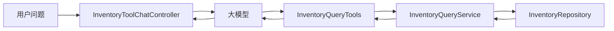

## 一、💡 一句话理解

> [!tip] 第 16 天核心结论
> 库存查询工具就是让模型从用户问题中提取商品编码，再由 Java 业务层查询真实库存，并明确区分“总库存、锁定库存和可用库存”；模型只负责选择工具和组织答案，不能自己计算或猜测商品是否还能销售。

本篇对应 [[0-学习路线]] 第 16 天，直接承接 [[15.实现物流查询工具]]。

前面已经完成：

- [[11.Function Calling、Tool Calling 原理]]：理解模型只提出工具调用申请，Java 应用才是真正执行者；
- [[12.用 Java 方法定义 Tool]]：会使用 `@Tool`、`@ToolParam` 和 `.tools(...)`；
- [[13.工具参数设计和校验]]：会校验模型生成的参数，并用 `ToolContext` 传递可信上下文；
- [[14.实现订单查询工具]]：已经完成 Tool、Service 和 Repository 分层；
- [[15.实现物流查询工具]]：已经用相同分层新增第二个只读业务工具。

今天继续保持同一套项目结构，新增一条独立库存查询链路：

```text
用户询问 SKU-1001 还有多少库存
  → 模型生成 queryInventory(skuCode = "SKU-1001")
  → InventoryQueryTools 校验参数和调用上下文
  → InventoryQueryService 查询并计算可用库存
  → InventoryRepository 读取库存数据
  → ToolResult 返回结构化结果
  → 模型根据真实结果生成中文回答
```

> [!info] 本篇严格停在第 16 天
> 本篇新建独立的 `/api/inventory-tool-chat` 接口，并且只向模型注册 `queryInventory`。暂不把订单、物流和库存工具同时交给同一次模型请求；“多个工具自动选择”是第 17 天的内容。

## 二、🧭 理论：库存查询工具是什么

### 2.1 它查询的是会变化的业务事实

大模型知道“库存”这个概念，但它不知道企业系统中某件商品此刻还有多少件可售。

用户问：

```text
SKU-1001 现在还有货吗？
```

模型最多只能识别这是库存问题，并生成类似下面的工具调用申请：

```json
{
  "name": "queryInventory",
  "arguments": {
    "skuCode": "SKU-1001"
  }
}
```

真正的库存数量必须由 Java 应用查询。根据 Spring AI 2.0.1 官方文档，模型负责决定是否调用工具并提供参数，应用负责执行工具和返回结果；模型不会直接获得库存数据库或内部接口的访问权限。

因此要记住：

```text
模型理解意图
  ≠ 模型知道实时库存
  ≠ 模型可以直接访问库存系统
```

### 2.2 总库存不等于可用库存

库存查询最容易犯的错误，是看到 `totalQuantity` 就直接回答“还能卖这么多件”。

本篇区分三个数量：

| 字段 | 白话解释 | 当前例子 |
| --- | --- | --- |
| `totalQuantity` | 系统账面上的总数量 | 仓库中共记录 120 件 |
| `reservedQuantity` | 已被订单等业务锁定、暂时不能再卖的数量 | 其中 20 件已被占用 |
| `availableQuantity` | 当前真正还能继续销售的数量 | `120 - 20 = 100` |

计算关系是：

```text
可用库存 = 总库存 - 锁定库存
```

例如：

```text
总库存：120
锁定库存：20
可用库存：100
```

用户问“还能买多少件”时，应该回答 `availableQuantity`，不能回答 `totalQuantity`。

> [!warning] 查询结果不能代替下单时的库存扣减
> 本篇只是只读查询。即使刚查到还有 1 件库存，也可能在下一毫秒被别的订单占用。真实下单仍需由库存系统执行原子扣减、幂等和并发控制，不能依赖模型回答保证一定有货。

### 2.3 为什么使用 SKU 编码

`SKU` 可以理解为“能够被单独管理库存的具体商品规格”。例如同一件衣服的黑色 M 码和黑色 L 码，通常是两个不同 SKU。

本篇使用一个明确参数：

```java
queryInventory(String skuCode, ToolContext toolContext)
```

商品名称可能重名，也可能包含规格不清的问题；SKU 编码更加稳定，适合作为库存查询键。

当前规则是：

```text
SKU- + 4～10 位数字
```

正确示例：

```text
SKU-1001
SKU-100001
```

错误示例：

```text
1001
sku-1001
商品一号
```

用户没有提供 SKU 时，模型应向用户追问，不能为了满足必填参数而编造一个编码。

### 2.4 库存状态怎样从数量得到

为了让模型稳定回答，本篇把库存状态归纳为三个枚举值：

| 状态 | 判断条件 | 含义 |
| --- | --- | --- |
| `IN_STOCK` | 可用库存大于低库存阈值 | 库存充足 |
| `LOW_STOCK` | 可用库存大于 0，且小于或等于低库存阈值 | 库存偏低 |
| `OUT_OF_STOCK` | 可用库存等于 0 | 暂时无可用库存 |

假设某个 SKU 的低库存阈值为 10：

```text
可用库存 100 → IN_STOCK
可用库存   7 → LOW_STOCK
可用库存   0 → OUT_OF_STOCK
```

低库存阈值属于企业业务规则，不应该由模型临时决定。本篇把判断放在 `InventoryQueryService` 中。

### 2.5 为什么返回结构化库存结果

不推荐让 Tool 直接拼接一段随意文字：

```text
这个商品还有一点货。
```

“一点”无法测试，也无法判断模型是否说错。推荐返回结构化结果：

```json
{
  "skuCode": "SKU-1001",
  "productName": "降噪蓝牙耳机",
  "totalQuantity": 120,
  "reservedQuantity": 20,
  "availableQuantity": 100,
  "status": "IN_STOCK",
  "statusDescription": "库存充足",
  "updatedAt": "2026-09-28T09:30:00"
}
```

结构化结果有三个直接好处：

1. 模型知道每个数字的确切含义；
2. 单元测试可以直接断言字段，不依赖模型措辞；
3. 后续替换数据库或远程库存服务时，Tool 的对外结构可以保持稳定。

## 三、⚙️ 理论：完整库存查询链路怎样工作

### 3.1 各层分别负责什么

本篇继续沿用当前项目已经建立的分层，不把库存 Map、数量计算和模型调用全部塞进一个 `@Tool` 方法。

| 层次 | 当前类 | 职责 | 不负责什么 |
| --- | --- | --- | --- |
| Tool | `InventoryQueryTools` | 描述工具、读取可信上下文、校验 SKU、统一成功和失败结果 | 不保存库存数据 |
| Service | `InventoryQueryService` | 查询库存、计算可用量、判断库存状态、转换对外结果 | 不关心 Prompt 和模型 |
| Repository 接口 | `InventoryRepository` | 定义按 SKU 查询库存的契约 | 不关心具体数据来源 |
| Repository 实现 | `InMemoryInventoryRepository` | 提供第 16 天可运行的本地数据 | 不是生产库存中心 |
| Controller | `InventoryToolChatController` | 接收自然语言、注册库存 Tool、返回模型最终回答 | 不直接读取库存 Map |



### 3.2 一次查询的执行顺序

用户发送：

```text
帮我查一下 SKU-1002 还能卖多少件
```

完整流程是：

1. `InventoryToolChatController` 把用户问题、库存工具定义和可信 `userId` 交给 Spring AI；
2. 模型识别库存意图，生成 `queryInventory` Tool Call；
3. Spring AI 将 JSON 参数绑定成 Java 的 `skuCode`；
4. `InventoryQueryTools` 检查 `ToolContext`，再使用 Bean Validation 校验 SKU 格式；
5. `InventoryQueryService` 通过 `InventoryRepository` 查询库存；
6. Service 计算可用库存并判断 `LOW_STOCK` 等状态；
7. Tool 把结果包装为 `ToolResult<InventoryQueryResult>`；
8. Spring AI 把工具结果放回对话，再让模型生成最终中文回答。

Spring AI 2.0.1 的 `ChatClient` 会自动注册 `ToolCallingAdvisor`。调用 `.call()` 后，如果模型返回 Tool Call，框架会查找对应工具、执行工具、把结果补入对话，然后继续请求模型，直到模型返回不再包含 Tool Call 的最终回答。

### 3.3 `skuCode` 和 `userId` 的来源不同

| 数据 | 来源 | 是否由模型生成 | 用途 |
| --- | --- | --- | --- |
| `skuCode` | 用户自然语言 | 是，模型负责提取 | 确定要查询哪个 SKU |
| `userId` | Java 登录上下文 | 否，通过 `ToolContext` 传入 | 标识当前调用者，后续用于权限和审计 |

Spring AI 官方文档说明，`ToolContext` 适合传递用户 ID、租户 ID和请求范围等非模型数据，而且这些数据不会发送给模型。

本篇继续使用 `demo-user` 作为学习占位值。它只演示可信数据怎样进入 Tool，不代表已经完成第 19 天的真实权限校验。

### 3.4 成功和失败必须明确区分

| 情况 | `ToolResult.code` | Tool 行为 | 模型应该怎样回答 |
| --- | --- | --- | --- |
| 查询成功 | `OK` | 返回数量、状态和更新时间 | 根据真实字段回答 |
| SKU 为空或格式错误 | `INVALID_ARGUMENT` | 不调用 Service | 告知正确格式并请用户补充 |
| 缺少可信调用上下文 | `CONTEXT_MISSING` | 不调用 Service | 说明当前无法确认调用身份 |
| SKU 不存在 | `INVENTORY_NOT_FOUND` | 返回受控失败 | 说明未找到库存记录，不编造数量 |

“库存为 0”和“没有库存记录”不是一回事：

```text
SKU-1003 → 查到了记录，可用库存为 0，状态是 OUT_OF_STOCK
SKU-9999 → 没查到记录，返回 INVENTORY_NOT_FOUND
```

前者说明系统明确知道当前没有可用库存；后者只能说明当前数据源没有这个 SKU 的库存资料。

### 3.5 本篇刻意保留的边界

为了严格遵守学习路线，本篇只完成第 16 天需要的内容：

- 使用内存 Map，不提前接 PostgreSQL；
- 使用单一逻辑库存池，不提前实现多仓库聚合；
- 只查询，不实现预占、释放、扣减或补库存；
- 不处理并发扣减、分布式锁和缓存一致性；
- 不实现 Tool 异常、超时和重试，第 18 天再集中处理；
- 不实现真实权限判断，第 19 天再学习权限校验和人工确认；
- 不同时注册订单、物流和库存工具，第 17 天再实现自动选择。

## 四、🚀 实践：实现完整库存查询工具

### 4.1 前置准备

#### 4.1.1 当前项目环境

本篇直接使用当前项目，不新建 Spring Boot 工程：

| 项目 | 当前值 |
| --- | --- |
| Java | 21 |
| Spring Boot | 4.1.1 |
| Spring AI | 2.0.1 |
| 构建工具 | Maven 3.9.16 |
| Web 技术 | 当前项目同时包含 WebMVC 和 WebFlux；本篇 Controller 使用 WebMVC 注解 |
| 模型接入 | OpenAI 兼容接口，由 `application.properties` 配置 |

Maven 路径：

```text
/Volumes/data/develop/apache-maven-3.9.16
```

本机 Java 21 路径：

```text
/Volumes/data/develop/JDK/jdk21/Contents/Home
```

当前终端默认 Java 可能仍是 Java 8。先让当前终端和 Maven 使用 Java 21：

```bash
export JAVA_HOME="/Volumes/data/develop/JDK/jdk21/Contents/Home"
export PATH="$JAVA_HOME/bin:$PATH"
java -version
/Volumes/data/develop/apache-maven-3.9.16/bin/mvn -version
```

两个版本输出都应显示 Java 21。`pom.xml` 中的 `<java.version>21</java.version>` 只规定编译目标，不能把 Maven 当前使用的旧 JDK 自动变成 JDK 21。

#### 4.1.2 沿用已有依赖

当前 `pom.xml` 已经包含本篇需要的依赖：

```xml
<!-- Bean Validation：提供 @NotBlank、@Pattern 和 Validator。 -->
<dependency>
    <groupId>org.springframework.boot</groupId>
    <artifactId>spring-boot-starter-validation</artifactId>
</dependency>

<!-- WebMVC：提供 @RestController、@PostMapping 等 HTTP 接口注解。 -->
<dependency>
    <groupId>org.springframework.boot</groupId>
    <artifactId>spring-boot-starter-webmvc</artifactId>
</dependency>

<!-- Spring AI OpenAI Starter：提供 ChatClient、@Tool 和 Tool Calling。 -->
<dependency>
    <groupId>org.springframework.ai</groupId>
    <artifactId>spring-ai-starter-model-openai</artifactId>
</dependency>
```

因此本篇不修改 `pom.xml`。

#### 4.1.3 沿用安全的模型配置

继续使用当前 `src/main/resources/application.properties`：

```properties
# API Key 从环境变量读取，不能写死后提交到 Git。
spring.ai.openai.api-key=${DEEPSEEK_API_KEY}
spring.ai.openai.base-url=https://api.deepseek.com
spring.ai.openai.chat.model=deepseek-v4-flash
```

运行应用前设置自己的密钥：

```bash
export DEEPSEEK_API_KEY="替换为你自己的密钥"
```

模型名称与 Tool Calling 能力可能变化。运行时应以当前模型服务商的官方说明为准，确认所选模型支持工具调用。

#### 4.1.4 本篇文件结构

本篇新增：

```text
src/main/java/com/afyke/ai/
├── controller/toolController/
│   └── InventoryToolChatController.java
├── inventory/
│   ├── domain/
│   │   ├── Inventory.java
│   │   └── InventoryStatus.java
│   ├── repository/
│   │   ├── InventoryRepository.java
│   │   └── InMemoryInventoryRepository.java
│   └── service/
│       ├── InventoryQueryResult.java
│       └── InventoryQueryService.java
└── tool/
    ├── InventoryQueryTools.java
    └── QueryInventoryCommand.java

src/test/java/com/afyke/ai/
├── inventory/service/
│   └── InventoryQueryServiceTests.java
└── tool/
    └── InventoryQueryToolsTests.java
```

继续复用已有文件：

```text
src/main/java/com/afyke/ai/tool/ToolResult.java
```

### 4.2 可以拿来干什么

#### 4.2.1 用自然语言查询真实可用库存

用途：用户不必调用固定格式的库存 API，可以直接问“SKU-1001 还有多少件能卖”。

前置：库存 Tool 已通过 `.tools(inventoryQueryTools)` 注册，并且 Repository 中存在对应 SKU。

```java
@Tool(
        name = "queryInventory",
        description = "根据 SKU 编码查询当前库存；用户询问是否有货、还有多少件、可售数量或库存状态时使用；只读，不预占也不扣减库存"
)
public ToolResult<InventoryQueryResult> queryInventory(
        @ToolParam(
                description = "SKU 编码，格式为 SKU- 加 4～10 位数字，例如 SKU-1001",
                required = true
        )
        String skuCode,
        ToolContext toolContext) {
    // 真正实现会先检查上下文和参数，再调用库存 Service。
    return queryInventoryInternal(skuCode);
}
```

输入：

```text
SKU-1001 还有多少件能卖？
```

处理：模型提取 `skuCode=SKU-1001`，Java 查询库存并返回 `availableQuantity`。

输出：回答应该说明可用库存，而不是只报告账面总库存。适用于客服问答、售前咨询和内部库存查询。

#### 4.2.2 区分库存充足、库存偏低和缺货

用途：把业务规则放在 Java Service 中，让所有入口得到一致状态，不让模型根据数字临时猜测“多”还是“少”。

前置：库存记录包含总量、锁定量和低库存阈值。

```java
private InventoryStatus resolveStatus(
        int availableQuantity,
        int lowStockThreshold) {

    if (availableQuantity == 0) {
        return InventoryStatus.OUT_OF_STOCK;
    }

    if (availableQuantity <= lowStockThreshold) {
        return InventoryStatus.LOW_STOCK;
    }

    return InventoryStatus.IN_STOCK;
}
```

输入：总库存 15、锁定库存 8、低库存阈值 10。

过程：可用库存是 `15 - 8 = 7`，7 大于 0 且不超过 10。

输出：`LOW_STOCK`，中文说明为“库存偏低”。适用于需要统一库存口径的多个接口。

#### 4.2.3 让普通接口和 Agent 复用库存业务层

用途：把模型相关逻辑限制在 Tool 和 Controller 中，普通 REST 接口、定时任务或其他服务仍可直接调用同一个库存 Service。

前置：调用方能够提供已经校验过的 SKU 编码。

```java
Optional<InventoryQueryResult> result =
        inventoryQueryService.queryBySkuCode("SKU-1001");
```

输入是 SKU 编码；Service 查询 Repository、计算可用数量并返回结构化结果。这个调用不需要 Prompt、模型或 API Key。

#### 4.2.4 将来替换真实库存数据源

用途：学习阶段使用内存 Map，生产阶段可以改为 PostgreSQL、Redis、RPC 或企业库存中心，而不必重写 Tool。

前置：新的数据源实现同一个 `InventoryRepository` 接口。

```java
public interface InventoryRepository {

    Optional<Inventory> findBySkuCode(String skuCode);
}
```

当前输入由 `InMemoryInventoryRepository` 处理；未来可以由数据库实现处理。Service 和 Tool 只依赖接口，不依赖具体存储方式。

### 4.3 完整实践：代码、启动和验证

#### 4.3.1 定义库存状态

文件位置：

`src/main/java/com/afyke/ai/inventory/domain/InventoryStatus.java`

```java
package com.afyke.ai.inventory.domain;

/**
 * 当前学习项目使用的库存状态。
 * 英文枚举值适合程序判断，中文说明适合交给模型组织回答。
 */
public enum InventoryStatus {

    IN_STOCK("库存充足"),
    LOW_STOCK("库存偏低"),
    OUT_OF_STOCK("暂无可用库存");

    private final String description;

    InventoryStatus(String description) {
        this.description = description;
    }

    public String getDescription() {
        return description;
    }
}
```

枚举值是稳定的程序状态，中文说明用于回答用户。不要让模型看到数量后自由创造新的状态名称。

#### 4.3.2 定义内部库存对象

文件位置：

`src/main/java/com/afyke/ai/inventory/domain/Inventory.java`

```java
package com.afyke.ai.inventory.domain;

import java.time.LocalDateTime;

/**
 * 应用内部使用的库存对象。
 * 本篇使用单一逻辑库存池，暂不引入仓库编码和多仓聚合。
 */
public record Inventory(
        // SKU 编码：唯一标识一个需要单独管理库存的商品规格。
        String skuCode,

        // 商品名称：只用于向用户解释当前 SKU 对应什么商品。
        String productName,

        // 总库存：库存系统当前记录的账面数量。
        int totalQuantity,

        // 锁定库存：已被订单等业务占用，暂时不能再次销售的数量。
        int reservedQuantity,

        // 低库存阈值：可用库存不高于这个值时标记为 LOW_STOCK。
        int lowStockThreshold,

        // 更新时间：帮助调用方判断数据的新鲜程度。
        LocalDateTime updatedAt
) {

    /**
     * availableQuantity：计算真正还能继续销售的数量。
     */
    public int availableQuantity() {
        return totalQuantity - reservedQuantity;
    }
}
```

这里不直接保存 `availableQuantity`，而是根据总库存和锁定库存计算，避免三个字段被分别修改后互相矛盾。

生产系统还应在数据写入阶段保证：总库存不能为负数、锁定库存不能为负数，并且锁定库存不能大于总库存。本篇使用受控的只读模拟数据，暂不展开库存写入校验。

#### 4.3.3 定义库存 Repository 契约

文件位置：

`src/main/java/com/afyke/ai/inventory/repository/InventoryRepository.java`

```java
package com.afyke.ai.inventory.repository;

import com.afyke.ai.inventory.domain.Inventory;

import java.util.Optional;

/**
 * 库存数据读取契约。
 * Service 只依赖接口，不关心数据来自内存、数据库还是远程库存中心。
 */
public interface InventoryRepository {

    /**
     * findBySkuCode：按照 SKU 编码查询库存。
     * 找到时返回 Optional.of(inventory)，找不到时返回 Optional.empty()。
     */
    Optional<Inventory> findBySkuCode(String skuCode);
}
```

`Optional` 在 Repository 和 Service 内部用于清楚表达“可能查不到”。Tool 层会把它转换成稳定的 `ToolResult`。

#### 4.3.4 提供可运行的内存库存数据

文件位置：

`src/main/java/com/afyke/ai/inventory/repository/InMemoryInventoryRepository.java`

```java
package com.afyke.ai.inventory.repository;

import com.afyke.ai.inventory.domain.Inventory;
import org.springframework.stereotype.Repository;

import java.time.LocalDateTime;
import java.util.Map;
import java.util.Optional;

/**
 * 第 16 天使用的本地库存数据源。
 * 它让库存查询链路无需数据库或企业库存中心即可运行。
 */
@Repository
public class InMemoryInventoryRepository implements InventoryRepository {

    private final Map<String, Inventory> inventoryBySkuCode = Map.of(
            // 可用库存 100，大于阈值 30，状态应为 IN_STOCK。
            "SKU-1001", new Inventory(
                    "SKU-1001",
                    "降噪蓝牙耳机",
                    120,
                    20,
                    30,
                    LocalDateTime.of(2026, 9, 28, 9, 30)
            ),

            // 可用库存 7，不超过阈值 10，状态应为 LOW_STOCK。
            "SKU-1002", new Inventory(
                    "SKU-1002",
                    "便携机械键盘",
                    15,
                    8,
                    10,
                    LocalDateTime.of(2026, 9, 28, 9, 35)
            ),

            // 可用库存 0，状态应为 OUT_OF_STOCK。
            "SKU-1003", new Inventory(
                    "SKU-1003",
                    "27 英寸 4K 显示器",
                    40,
                    40,
                    10,
                    LocalDateTime.of(2026, 9, 28, 9, 40)
            )
    );

    @Override
    public Optional<Inventory> findBySkuCode(String skuCode) {
        // ofNullable：Map 中没有该 SKU 时返回 Optional.empty()，不返回 null。
        return Optional.ofNullable(inventoryBySkuCode.get(skuCode));
    }
}
```

三条数据分别覆盖库存充足、库存偏低和无可用库存。`SKU-9999` 不在 Map 中，用于验证“没有库存记录”的分支。

#### 4.3.5 定义对外库存查询结果

文件位置：

`src/main/java/com/afyke/ai/inventory/service/InventoryQueryResult.java`

```java
package com.afyke.ai.inventory.service;

import java.time.LocalDateTime;

/**
 * 库存查询的只读结果。
 * 只向模型暴露回答库存问题真正需要的字段。
 */
public record InventoryQueryResult(
        String skuCode,
        String productName,
        int totalQuantity,
        int reservedQuantity,
        int availableQuantity,
        String status,
        String statusDescription,
        LocalDateTime updatedAt
) {
}
```

这里同时保留总库存、锁定库存和可用库存，让字段含义明确。生产项目若不允许普通用户看到内部锁定数量，可以根据权限进一步裁剪结果字段。

#### 4.3.6 实现库存查询 Service

文件位置：

`src/main/java/com/afyke/ai/inventory/service/InventoryQueryService.java`

```java
package com.afyke.ai.inventory.service;

import com.afyke.ai.inventory.domain.Inventory;
import com.afyke.ai.inventory.domain.InventoryStatus;
import com.afyke.ai.inventory.repository.InventoryRepository;
import org.springframework.stereotype.Service;

import java.util.Optional;

/**
 * 库存查询业务层。
 * 它不依赖 ChatClient、Prompt 或 @Tool，可以被普通接口和 Agent 共同复用。
 */
@Service
public class InventoryQueryService {

    private final InventoryRepository inventoryRepository;

    public InventoryQueryService(InventoryRepository inventoryRepository) {
        // Spring 注入当前唯一的 InMemoryInventoryRepository 实现。
        this.inventoryRepository = inventoryRepository;
    }

    public Optional<InventoryQueryResult> queryBySkuCode(String skuCode) {
        return inventoryRepository.findBySkuCode(skuCode)
                // map：只有查到 Inventory 时才转换成对外结果。
                // Repository 返回 empty 时，结果继续保持 Optional.empty()。
                .map(this::toQueryResult);
    }

    private InventoryQueryResult toQueryResult(Inventory inventory) {
        // availableQuantity：统一使用领域对象中的计算，避免拿总库存冒充可用库存。
        int availableQuantity = inventory.availableQuantity();

        // resolveStatus：根据可用库存和业务阈值生成稳定库存状态。
        InventoryStatus status = resolveStatus(
                availableQuantity,
                inventory.lowStockThreshold()
        );

        return new InventoryQueryResult(
                inventory.skuCode(),
                inventory.productName(),
                inventory.totalQuantity(),
                inventory.reservedQuantity(),
                availableQuantity,
                status.name(),
                status.getDescription(),
                inventory.updatedAt()
        );
    }

    private InventoryStatus resolveStatus(
            int availableQuantity,
            int lowStockThreshold) {

        // 没有可用库存时明确返回 OUT_OF_STOCK。
        if (availableQuantity == 0) {
            return InventoryStatus.OUT_OF_STOCK;
        }

        // 仍有库存，但已不高于预设阈值时返回 LOW_STOCK。
        if (availableQuantity <= lowStockThreshold) {
            return InventoryStatus.LOW_STOCK;
        }

        // 其余情况表示库存充足。
        return InventoryStatus.IN_STOCK;
    }
}
```

Service 才是库存业务口径所在的位置。模型、Controller 和 Tool 都不重复计算数量或判断状态。

#### 4.3.7 定义库存查询参数校验对象

文件位置：

`src/main/java/com/afyke/ai/tool/QueryInventoryCommand.java`

```java
package com.afyke.ai.tool;

import jakarta.validation.constraints.NotBlank;
import jakarta.validation.constraints.Pattern;

/**
 * Java 后端真正执行校验的库存查询命令。
 * @ToolParam 负责引导模型，这里的 Bean Validation 才负责拦截错误输入。
 */
public record QueryInventoryCommand(
        // NotBlank：同时拦截 null、空字符串和全空格字符串。
        @NotBlank(message = "SKU 编码不能为空")

        // Pattern：强制 SKU 使用当前项目约定的格式。
        @Pattern(
                regexp = "^SKU-\\d{4,10}$",
                message = "SKU 编码格式错误，应为 SKU- 加 4～10 位数字，例如 SKU-1001"
        )
        String skuCode
) {
}
```

`@ToolParam` 是给模型看的参数说明，`@Pattern` 是 Java 后端真正执行的格式边界。两处格式必须保持一致。

#### 4.3.8 复用统一 Tool 结果

项目已有：

`src/main/java/com/afyke/ai/tool/ToolResult.java`

库存 Tool 继续复用它，不创建另一套返回结构：

```java
public record ToolResult<T>(
        boolean success,
        String code,
        String message,
        T data,
        List<String> errors
) {

    public static <T> ToolResult<T> success(String message, T data) {
        return new ToolResult<>(true, "OK", message, data, List.of());
    }

    public static <T> ToolResult<T> failure(
            String code,
            String message,
            List<String> errors) {
        return new ToolResult<>(false, code, message, null, List.copyOf(errors));
    }
}
```

成功与失败都使用固定字段，模型不需要从异常堆栈或随意文本中猜测结果。

#### 4.3.9 实现 `queryInventory` Tool

文件位置：

`src/main/java/com/afyke/ai/tool/InventoryQueryTools.java`

```java
package com.afyke.ai.tool;

import com.afyke.ai.inventory.service.InventoryQueryResult;
import com.afyke.ai.inventory.service.InventoryQueryService;
import jakarta.validation.ConstraintViolation;
import jakarta.validation.Validator;
import org.springframework.ai.chat.model.ToolContext;
import org.springframework.ai.tool.annotation.Tool;
import org.springframework.ai.tool.annotation.ToolParam;
import org.springframework.stereotype.Component;

import java.util.List;

@Component
public class InventoryQueryTools {

    private final Validator validator;
    private final InventoryQueryService inventoryQueryService;

    public InventoryQueryTools(
            Validator validator,
            InventoryQueryService inventoryQueryService) {
        // Validator：校验模型生成的 skuCode。
        this.validator = validator;
        // Service：执行真正的库存查询和库存状态计算。
        this.inventoryQueryService = inventoryQueryService;
    }

    @Tool(
            name = "queryInventory",
            description = "根据 SKU 编码查询当前库存；用户询问是否有货、还有多少件、可售数量或库存状态时使用；只读，不预占也不扣减库存"
    )
    public ToolResult<InventoryQueryResult> queryInventory(
            @ToolParam(
                    description = "SKU 编码，格式为 SKU- 加 4～10 位数字，例如 SKU-1001",
                    required = true
            )
            String skuCode,
            ToolContext toolContext) {

        // ToolContext 中的数据由 Java 应用传入，不由模型生成。
        Object userIdValue = toolContext.getContext().get("userId");
        String userId = userIdValue == null ? "" : userIdValue.toString();

        if (userId.isBlank()) {
            return ToolResult.failure(
                    "CONTEXT_MISSING",
                    "缺少调用用户上下文",
                    List.of("Java 应用必须通过 ToolContext 提供 userId")
            );
        }

        // Tool 入口只处理可信上下文和输入边界，再把业务查询交给内部方法与 Service。
        return queryInventoryInternal(skuCode);
    }

    /**
     * 内部方法不依赖 ToolContext，便于确定性测试参数和业务结果。
     */
    ToolResult<InventoryQueryResult> queryInventoryInternal(String skuCode) {
        QueryInventoryCommand command = new QueryInventoryCommand(skuCode);

        // validate：显式执行 @NotBlank 和 @Pattern 约束。
        var violations = validator.validate(command);

        if (!violations.isEmpty()) {
            List<String> errors = violations.stream()
                    // getMessage：只保留受控错误信息，不把异常堆栈交给模型。
                    .map(ConstraintViolation::getMessage)
                    // sorted：让错误顺序稳定，方便测试断言。
                    .sorted()
                    .toList();

            // 参数错误时立即结束，不调用库存 Service。
            return ToolResult.failure(
                    "INVALID_ARGUMENT",
                    "工具参数校验失败",
                    errors
            );
        }

        return inventoryQueryService.queryBySkuCode(command.skuCode())
                // map：查到库存时包装成统一成功结果。
                .map(inventory -> ToolResult.success("库存查询成功", inventory))
                // orElseGet：没有记录时返回受控失败，禁止模型猜测库存数量。
                .orElseGet(() -> ToolResult.failure(
                        "INVENTORY_NOT_FOUND",
                        "未找到库存记录",
                        List.of("SKU " + command.skuCode() + " 暂无库存记录")
                ));
    }
}
```

Spring AI 默认使用 Jackson 把 `InventoryQueryResult` 序列化成模型能够接收的字符串。`@Tool` 方法不返回 `Optional`，因为 Spring AI 2.0.1 的 Method Tool 不支持把 `Optional` 作为参数或返回值。

#### 4.3.10 新建独立库存聊天接口

文件位置：

`src/main/java/com/afyke/ai/controller/toolController/InventoryToolChatController.java`

```java
package com.afyke.ai.controller.toolController;

import com.afyke.ai.tool.InventoryQueryTools;
import jakarta.validation.Valid;
import jakarta.validation.constraints.NotBlank;
import org.springframework.ai.chat.client.ChatClient;
import org.springframework.web.bind.annotation.PostMapping;
import org.springframework.web.bind.annotation.RequestBody;
import org.springframework.web.bind.annotation.RequestMapping;
import org.springframework.web.bind.annotation.RestController;

import java.util.Map;

@RestController
@RequestMapping("/api/inventory-tool-chat")
public class InventoryToolChatController {

    private final ChatClient chatClient;
    private final InventoryQueryTools inventoryQueryTools;

    public InventoryToolChatController(
            ChatClient.Builder chatClientBuilder,
            InventoryQueryTools inventoryQueryTools) {
        // build：使用 Spring AI 自动配置的 ChatModel 创建 ChatClient。
        this.chatClient = chatClientBuilder.build();
        this.inventoryQueryTools = inventoryQueryTools;
    }

    @PostMapping
    public ChatResponse chat(@Valid @RequestBody ChatRequest request) {
        String answer = chatClient.prompt()
                // system：库存实时事实必须以 Tool 结果为准，禁止模型猜测。
                .system("""
                        你是库存查询助手。
                        用户询问某个 SKU 是否有货、还有多少件、可售数量或库存状态时，必须调用 queryInventory 工具查询，不能根据常识猜测。
                        如果用户没有提供 SKU 编码，请要求用户补充，不能编造编码。
                        回答“还能销售多少件”时必须使用 availableQuantity，不能把 totalQuantity 当作可用库存。
                        如果工具返回未找到库存记录，请如实说明，不要把它说成库存为零，也不要编造商品或数量。
                        这是只读查询，不能承诺预留、锁定或扣减库存。
                        """)
                // user：本次用户的自然语言问题。
                .user(request.message())
                // tools：第 16 天只开放库存工具，不提前实现多工具自动选择。
                .tools(inventoryQueryTools)
                // toolContext：学习阶段使用占位用户；生产环境应读取认证登录态。
                .toolContext(Map.of("userId", "demo-user"))
                // call：发起同步模型调用，并由 Spring AI 驱动 Tool Calling 循环。
                .call()
                // content：取得模型结合 Tool Result 生成的最终回答。
                .content();

        return new ChatResponse(answer);
    }

    public record ChatRequest(
            // 这里只校验 HTTP 请求体；Tool 内还会再次校验模型生成的 skuCode。
            @NotBlank(message = "message 不能为空")
            String message
    ) {
    }

    public record ChatResponse(String answer) {
    }
}
```

这里保留已有订单接口和物流接口不动。第 16 天新增第三个独立入口，每个入口只注册一个工具，等第 17 天再合并。

#### 4.3.11 测试库存 Service

文件位置：

`src/test/java/com/afyke/ai/inventory/service/InventoryQueryServiceTests.java`

```java
package com.afyke.ai.inventory.service;

import com.afyke.ai.inventory.repository.InMemoryInventoryRepository;
import org.junit.jupiter.api.Test;

import static org.junit.jupiter.api.Assertions.assertEquals;
import static org.junit.jupiter.api.Assertions.assertTrue;

class InventoryQueryServiceTests {

    private final InventoryQueryService service =
            new InventoryQueryService(new InMemoryInventoryRepository());

    @Test
    void shouldReturnAvailableQuantityAndInStockStatus() {
        var result = service.queryBySkuCode("SKU-1001").orElseThrow();

        // 总库存 120 - 锁定库存 20 = 可用库存 100。
        assertEquals(100, result.availableQuantity());
        assertEquals("IN_STOCK", result.status());
    }

    @Test
    void shouldReturnLowStockStatus() {
        var result = service.queryBySkuCode("SKU-1002").orElseThrow();

        assertEquals(7, result.availableQuantity());
        assertEquals("LOW_STOCK", result.status());
    }

    @Test
    void shouldReturnOutOfStockStatus() {
        var result = service.queryBySkuCode("SKU-1003").orElseThrow();

        assertEquals(0, result.availableQuantity());
        assertEquals("OUT_OF_STOCK", result.status());
    }

    @Test
    void shouldReturnEmptyWhenSkuDoesNotExist() {
        var result = service.queryBySkuCode("SKU-9999");

        assertTrue(result.isEmpty());
    }
}
```

这些测试不启动 Spring 上下文、不调用模型，也不需要 API Key。它们直接验证库存计算和状态规则。

#### 4.3.12 测试 Tool 参数与业务边界

文件位置：

`src/test/java/com/afyke/ai/tool/InventoryQueryToolsTests.java`

```java
package com.afyke.ai.tool;

import com.afyke.ai.inventory.repository.InMemoryInventoryRepository;
import com.afyke.ai.inventory.service.InventoryQueryService;
import jakarta.validation.Validation;
import jakarta.validation.Validator;
import org.junit.jupiter.api.BeforeAll;
import org.junit.jupiter.api.Test;

import static org.junit.jupiter.api.Assertions.assertEquals;
import static org.junit.jupiter.api.Assertions.assertFalse;
import static org.junit.jupiter.api.Assertions.assertTrue;

class InventoryQueryToolsTests {

    private static Validator validator;

    @BeforeAll
    static void createValidator() {
        // buildDefaultValidatorFactory：创建 Jakarta Validation 的默认实现。
        validator = Validation.buildDefaultValidatorFactory().getValidator();
    }

    private InventoryQueryTools createTools() {
        var repository = new InMemoryInventoryRepository();
        var service = new InventoryQueryService(repository);
        return new InventoryQueryTools(validator, service);
    }

    @Test
    void shouldReturnSuccessForExistingInventory() {
        var result = createTools().queryInventoryInternal("SKU-1001");

        assertTrue(result.success());
        assertEquals("OK", result.code());
        assertEquals(100, result.data().availableQuantity());
    }

    @Test
    void shouldRejectInvalidSkuCode() {
        var result = createTools().queryInventoryInternal("1001");

        assertFalse(result.success());
        assertEquals("INVALID_ARGUMENT", result.code());
        assertTrue(result.errors().stream()
                .anyMatch(message -> message.contains("SKU 编码格式错误")));
    }

    @Test
    void shouldReturnOutOfStockAsSuccessfulQuery() {
        var result = createTools().queryInventoryInternal("SKU-1003");

        // 查到库存记录但可用量为 0，仍然是一次成功查询。
        assertTrue(result.success());
        assertEquals("OUT_OF_STOCK", result.data().status());
        assertEquals(0, result.data().availableQuantity());
    }

    @Test
    void shouldReturnControlledFailureWhenSkuDoesNotExist() {
        var result = createTools().queryInventoryInternal("SKU-9999");

        assertFalse(result.success());
        assertEquals("INVENTORY_NOT_FOUND", result.code());
    }
}
```

这里直接测试内部方法，避免单元测试依赖真实模型响应。重点验证“缺货是成功查询”和“查无记录是受控失败”这两个不同分支。

#### 4.3.13 编译并运行测试

先确认 Maven 正在使用 Java 21：

```bash
export JAVA_HOME="/Volumes/data/develop/JDK/jdk21/Contents/Home"
export PATH="$JAVA_HOME/bin:$PATH"

/Volumes/data/develop/apache-maven-3.9.16/bin/mvn -version
```

然后编译：

```bash
/Volumes/data/develop/apache-maven-3.9.16/bin/mvn clean compile
```

预期结果：

```text
BUILD SUCCESS
```

再只运行本篇的确定性测试：

```bash
/Volumes/data/develop/apache-maven-3.9.16/bin/mvn \
  -Dtest=InventoryQueryServiceTests,InventoryQueryToolsTests test
```

预期结果：8 个测试通过，不出现失败或错误。

#### 4.3.14 启动应用

当前项目还使用 Redis 保存聊天记忆。完整启动前先确认 Redis 已按项目配置运行，并设置模型 API Key：

```bash
export DEEPSEEK_API_KEY="替换为你自己的密钥"
/Volumes/data/develop/apache-maven-3.9.16/bin/mvn spring-boot:run
```

如果只验证 `InventoryQueryServiceTests` 和 `InventoryQueryToolsTests`，不需要 Redis，也不需要调用模型。

#### 4.3.15 验证库存充足

请求：

```bash
curl -X POST 'http://localhost:8080/api/inventory-tool-chat' \
  -H 'Content-Type: application/json' \
  -d '{"message":"SKU-1001 现在还有多少件能卖？"}'
```

模型措辞可能不同，但回答必须基于 Tool 结果，例如：

```json
{
  "answer": "SKU-1001 对应降噪蓝牙耳机，总库存 120 件，其中 20 件已锁定，当前可用库存为 100 件，库存充足。"
}
```

验收重点：回答“能卖多少件”时必须使用 100，不能错误地回答 120。

#### 4.3.16 验证库存偏低

```bash
curl -X POST 'http://localhost:8080/api/inventory-tool-chat' \
  -H 'Content-Type: application/json' \
  -d '{"message":"帮我查一下 SKU-1002 是否快没货了"}'
```

预期回答应说明：

- 商品是便携机械键盘；
- 可用库存为 7；
- 状态是库存偏低。

#### 4.3.17 验证无可用库存

```bash
curl -X POST 'http://localhost:8080/api/inventory-tool-chat' \
  -H 'Content-Type: application/json' \
  -d '{"message":"SKU-1003 还有货吗？"}'
```

预期：明确说明系统查到了该 SKU，但当前可用库存为 0。不能说成“没有找到商品”。

#### 4.3.18 验证没有库存记录

```bash
curl -X POST 'http://localhost:8080/api/inventory-tool-chat' \
  -H 'Content-Type: application/json' \
  -d '{"message":"查询 SKU-9999 的库存"}'
```

预期：回答“未找到库存记录”或同义内容，不能编造商品名称、总库存或可用数量。

#### 4.3.19 验证缺少或错误 SKU

缺少 SKU：

```bash
curl -X POST 'http://localhost:8080/api/inventory-tool-chat' \
  -H 'Content-Type: application/json' \
  -d '{"message":"这个商品还有库存吗？"}'
```

预期：模型要求用户补充 SKU 编码，而不是编造一个编码。

格式错误：

```bash
curl -X POST 'http://localhost:8080/api/inventory-tool-chat' \
  -H 'Content-Type: application/json' \
  -d '{"message":"查询商品 1001 的库存"}'
```

预期：说明 SKU 格式应为 `SKU-` 加 4～10 位数字，例如 `SKU-1001`。

#### 4.3.20 本日验收清单

- [ ] `queryInventory` 能被模型调用；
- [ ] Tool 参数只包含用户能够提供的 `skuCode`；
- [ ] `userId` 通过 `ToolContext` 传入，不由模型生成；
- [ ] 库存查询经过 Tool、Service 和 Repository 分层；
- [ ] 能正确区分总库存、锁定库存和可用库存；
- [ ] 能正确返回 `IN_STOCK`、`LOW_STOCK` 和 `OUT_OF_STOCK`；
- [ ] 参数错误时不进入 Service；
- [ ] 无可用库存与没有库存记录能够正确区分；
- [ ] Service 和 Tool 的 8 个确定性测试通过；
- [ ] 第 16 天接口只注册库存工具，没有提前实现多工具自动选择。

### 4.4 关键报错排查

#### 4.4.1 Maven 报 `record`、文本块或中文语法错误

先检查：

```bash
java -version
/Volumes/data/develop/apache-maven-3.9.16/bin/mvn -version
```

两处都必须显示 Java 21。当前机器可能同时安装 Java 8；如果 Maven 使用旧 JDK，会把 `record` 和 `"""` 文本块误报成语法错误。

修复当前终端：

```bash
export JAVA_HOME="/Volumes/data/develop/JDK/jdk21/Contents/Home"
export PATH="$JAVA_HOME/bin:$PATH"
```

重新检查版本后再构建。

#### 4.4.2 模型没有调用 `queryInventory`

依次检查：

1. `InventoryQueryTools` 是否带有 `@Component`；
2. Controller 是否调用 `.tools(inventoryQueryTools)`；
3. `@Tool` 描述是否明确包含“库存、有货、可售数量”等意图；
4. 当前模型和接口是否支持 Tool Calling；
5. 用户问题是否提供了能够识别的 SKU。

不要用更强硬的 Prompt 掩盖工具没有注册或模型不支持工具调用的问题。

#### 4.4.3 Tool 总是返回 `INVALID_ARGUMENT`

检查模型生成的参数是否符合：

```text
SKU-1001
```

下面三个位置必须使用同一规则：

- `@ToolParam.description`；
- `QueryInventoryCommand` 的正则；
- 测试数据和请求示例。

如果真实企业 SKU 不是这个格式，应同时修改三处，不能只改其中一处。

#### 4.4.4 返回 `CONTEXT_MISSING`

检查 Controller 是否提供：

```java
.toolContext(Map.of("userId", "demo-user"))
```

生产环境不能永远写死 `demo-user`，应从认证后的用户上下文读取。真实权限校验安排在第 19 天。

#### 4.4.5 模型把总库存当成可用库存

检查 Tool 的结构化结果是否同时包含：

```text
totalQuantity
reservedQuantity
availableQuantity
```

同时检查 System Prompt 是否明确要求回答可售数量时使用 `availableQuantity`。业务计算仍必须由 Service 完成，不能只靠 Prompt 让模型自己做减法。

#### 4.4.6 `SKU-1003` 为什么不是查询失败

`SKU-1003` 在 Repository 中有库存记录，只是：

```text
总库存 40 - 锁定库存 40 = 可用库存 0
```

因此查询本身成功，`ToolResult.code` 仍是 `OK`，业务状态为 `OUT_OF_STOCK`。

只有 Repository 完全找不到 SKU 时，才返回 `INVENTORY_NOT_FOUND`。

#### 4.4.7 库存数量出现负数

本篇模拟数据必须满足：

```text
totalQuantity >= 0
reservedQuantity >= 0
reservedQuantity <= totalQuantity
```

如果接入真实系统后出现负数，不要使用 `Math.max(0, ...)` 悄悄掩盖问题。应检查库存写入、预占和释放流程，并把数据异常记录到监控和审计日志。

#### 4.4.8 应用启动失败，但库存单元测试能通过

当前项目配置了 Redis 聊天记忆。完整应用启动失败时，检查 Redis 是否运行、端口是否为 `6379`，以及 `DEEPSEEK_API_KEY` 是否存在。

库存 Service 和 Tool 内部方法的测试不启动 Spring 上下文，因此可以先验证本篇业务代码，再处理外部依赖。

#### 4.4.9 Tool 内出现异常并暴露内部信息

本篇对参数错误和查无记录使用 `ToolResult.failure(...)`，不会故意抛异常。

不要把数据库地址、SQL、密钥、用户隐私或完整堆栈放进异常消息。Spring AI 的工具异常处理、超时和重试会在第 18 天集中学习。

## 五、📌 总结

### 5.1 快速回顾

- 库存是实时业务事实，模型必须调用 Java Tool 查询，不能靠常识猜测；
- `availableQuantity = totalQuantity - reservedQuantity`，回答可售数量时不能使用总库存；
- SKU 由用户问题提供，可信 `userId` 由 Java 应用通过 `ToolContext` 提供；
- Tool 负责边界，Service 负责库存计算和状态判断，Repository 隔离数据来源；
- 库存为 0 是成功查询，查不到 SKU 才是 `INVENTORY_NOT_FOUND`；
- 第 16 天只开放库存工具，第 17 天再把订单、物流和库存工具放到同一个入口中自动选择。

> [!tip] 一句话复述
> 模型负责听懂“用户想查哪个 SKU”，Java 库存业务层负责给出真实可用数量和库存状态，模型只能基于这个结果回答。

## 六、📚 官方资料

- [Spring AI 2.0.1：Tool Calling](https://docs.spring.io/spring-ai/reference/api/tools.html)
- [Spring AI 2.0.1：ChatClient API](https://docs.spring.io/spring-ai/reference/api/chatclient.html)
