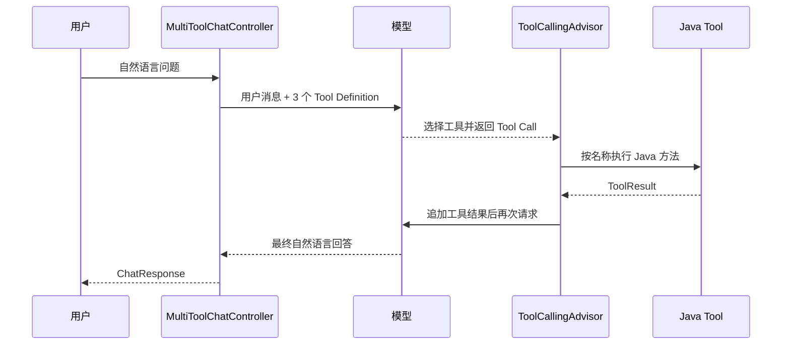

## 一、💡 一句话理解

> [!tip] 第 17 天核心结论
> 多个工具自动选择，就是把订单、物流和库存等多个 Tool 的“名称、用途说明和参数结构”同时交给模型，由模型根据用户当前问题决定不调用、调用其中一个，或在一个问题中调用多个；Java 应用仍然负责真正执行工具和返回真实业务数据。

本篇对应 [[0-学习路线]] 第 17 天，直接承接 [[16.实现库存查询工具]]。

前面已经分别完成三个只读业务工具：

- [[14.实现订单查询工具]]：`queryOrderStatus`；
- [[15.实现物流查询工具]]：`queryLogistics`；
- [[16.实现库存查询工具]]：`queryInventory`。

前 3 天的 Controller 每次只注册一个工具。今天不重写业务层，只新增一个统一入口，把三个现有工具同时注册给 `ChatClient`：

```text
用户问题
  → ChatClient 同时发送三个 Tool Definition
  → 模型判断问题属于订单、物流还是库存
  → 模型返回对应 Tool Call
  → Spring AI 找到同名 Java Tool 并执行
  → 模型根据真实 Tool Result 生成最终回答
```

> [!info] 自动选择不等于 Java 编写路由 `if/else`
> Java 负责声明“现在允许使用哪些工具”，模型负责结合语义选择工具。业务权限、参数校验和最终执行仍由 Java 控制，不能因为模型会选择工具就省略安全边界。

## 二、🧭 理论：多个工具自动选择是什么

### 2.1 注册、选择和执行是三件不同的事

理解多个工具时，最重要的是区分下面三个动作：

| 动作 | 谁负责 | 当前项目中的表现 |
| --- | --- | --- |
| 注册工具 | Java 应用 | `.tools(orderQueryTools, logisticsQueryTools, inventoryQueryTools)` |
| 选择工具 | 模型 | 根据用户问题和 Tool Definition 生成某个 Tool Call |
| 执行工具 | Spring AI 与 Java 应用 | `ToolCallingManager` 按工具名找到 Java 方法并调用 |

“注册了三个工具”只表示这三个工具在本次请求中可用，不表示三个工具都会执行。

例如用户问：

```text
A1002 的订单状态是什么？
```

模型应该只生成：

```json
{
  "name": "queryOrderStatus",
  "arguments": {
    "orderId": "A1002"
  }
}
```

此时 `queryLogistics` 和 `queryInventory` 虽然也被注册，但不应执行。

### 2.2 模型实际看到的不是 Java 源码

模型不会阅读 `OrderQueryTools.java`、`LogisticsQueryTools.java` 或 `InventoryQueryTools.java` 的方法实现。

根据 Spring AI 2.0.1 官方文档，模型主要看到每个工具的 `ToolDefinition`：

```text
工具名称 name
+ 工具说明 description
+ 参数 JSON Schema inputSchema
```

当前项目大致会向模型提供：

| 工具名 | 说明中的核心意图 | 关键参数 |
| --- | --- | --- |
| `queryOrderStatus` | 查询付款、发货、完成或取消等订单状态 | `orderId` |
| `queryLogistics` | 查询快递、包裹位置、配送进度或签收状态 | `orderId` |
| `queryInventory` | 查询是否有货、可售数量或库存状态 | `skuCode` |

模型正是通过这些信息区分工具，而不是通过 Java 类名或 Controller 路径区分。

### 2.3 为什么订单状态和物流信息要拆成两个工具

订单状态和物流信息都使用 `orderId`，但它们回答的是不同问题：

| 用户问题 | 应选工具 | 原因 |
| --- | --- | --- |
| A1001 付款了吗 | `queryOrderStatus` | 问的是订单业务状态 |
| A1001 的包裹到哪里了 | `queryLogistics` | 问的是运输轨迹和位置 |
| A1001 发货了吗，包裹现在在哪里 | 两个工具 | 同时需要订单状态和物流信息 |

参数相同并不表示工具职责相同。工具描述必须写清楚“什么时候使用”，否则模型很容易因为两个工具都接收 `orderId` 而选错。

### 2.4 自动选择允许三种结果

一次用户请求不一定只对应一个工具。模型可能做出三种合理决定：

| 决定 | 示例问题 | 预期行为 |
| --- | --- | --- |
| 不调用工具 | 你好，你能做什么 | 直接介绍能力，不查询业务数据 |
| 调用一个工具 | SKU-1002 还有多少可用库存 | 只调用 `queryInventory` |
| 调用多个工具 | 查 A1001 的订单状态和物流位置 | 调用订单与物流工具，再汇总回答 |

“多个工具自动选择”包含两层意思：

1. 多个候选工具中选出最合适的一个；
2. 一个问题确实需要多种数据时，可以调用多个工具。

模型可能在同一轮返回多个 Tool Call，也可能先调用一个工具，再根据结果进入下一轮调用另一个工具。具体形式与模型能力和问题有关，业务代码不应依赖固定调用顺序。

### 2.5 自动选择不是绝对确定的规则引擎

模型路由是基于语义判断，不是传统 Java 中完全确定的 `switch`。

下面这些因素都会影响选择结果：

- 工具名称是否清楚且唯一；
- `description` 是否明确写出用途和边界；
- 参数说明是否准确；
- System Prompt 是否告诉模型实时事实必须查询；
- 用户问题是否包含必要编号；
- 当前模型本身的 Tool Calling 能力。

因此不能只写一句模糊说明：

```java
@Tool(description = "查询信息")
```

三个工具都这样描述时，模型无法稳定区分。当前项目现有描述已经把“订单状态”“物流位置”“库存数量”分开，这正是今天能够组合注册的前提。

### 2.6 工具名必须唯一

Spring AI 官方文档要求，同一个工具集合中的工具名称必须唯一。

当前项目的名称分别是：

```text
queryOrderStatus
queryLogistics
queryInventory
```

如果两个 `@Tool` 都叫 `queryInfo`，模型返回 `queryInfo` 时，Java 应用无法得到清晰、可靠的工具映射。命名时应使用“动作 + 业务对象”，例如：

```text
query + OrderStatus
query + Logistics
query + Inventory
```

### 2.7 `.tools(...)` 和 `.defaultTools(...)` 的区别

Spring AI 2.0.1 提供两种常见注册方式：

```java
// 只对当前请求开放。
chatClient.prompt()
        .tools(orderQueryTools, logisticsQueryTools, inventoryQueryTools);
```

```java
// 对这个 ChatClient 创建的每个请求默认开放。
ChatClient client = ChatClient.builder(chatModel)
        .defaultTools(orderQueryTools, logisticsQueryTools, inventoryQueryTools)
        .build();
```

本篇选择 `.tools(...)`，原因是它让每个接口明确声明本次允许使用哪些能力，边界更容易阅读和控制。

官方文档还说明：当前请求的 `.tools(...)` 会追加到客户端的默认工具，不会替换默认工具。因此，如果以后使用 `.defaultTools(...)`，必须同时检查最终合并后的工具集合，避免无意中把高风险工具开放给所有请求。

## 三、⚙️ 理论：Spring AI 怎样完成自动选择

### 3.1 第一次模型请求携带全部候选工具定义

当 Controller 执行：

```java
.tools(orderQueryTools, logisticsQueryTools, inventoryQueryTools)
```

Spring AI 会扫描三个对象中带 `@Tool` 的方法，生成工具名称、描述和参数 Schema，再随用户消息一起发给模型。



### 3.2 `ToolCallingAdvisor` 驱动完整循环

Spring AI 2.0.1 的 `DefaultChatClient` 默认自动注册 `ToolCallingAdvisor`。

它依次完成：

1. 把候选工具定义发送给模型；
2. 读取模型返回的 Tool Call；
3. 交给 `ToolCallingManager` 查找并执行同名 Tool；
4. 把 Tool Result 追加到本轮对话；
5. 再次请求模型；
6. 直到模型返回不再包含 Tool Call 的最终文本。

所以当前代码只需要 `.call().content()`，不必自己手写 while 循环。

> [!warning] 不要同时再注册第二个工具调用 Advisor
> `DefaultChatClient` 会保证 Advisor 链中只有一个 `ToolAdvisor`。本篇使用默认自动配置，不手动再创建 `ToolCallingAdvisor`。

### 3.3 `ToolContext` 对所有被选中的工具都可用

本篇继续传入：

```java
.toolContext(Map.of("userId", "demo-user"))
```

如果模型选择订单工具，`OrderQueryTools` 可以读取这个 `userId`；选择物流或库存工具时，对应 Tool 也能读取同一份请求上下文。

`ToolContext` 不会作为模型可生成参数发送给模型，适合承载登录用户、租户、请求标识等可信数据。

这意味着：

```text
orderId、skuCode → 模型从用户问题中提取
userId           → Java 应用从可信登录上下文传入
```

### 3.4 System Prompt 负责约束，不代替 Tool Description

本篇的 System Prompt 会告诉模型：

- 实时业务事实必须调用工具；
- 不要为了调用工具编造订单号或 SKU；
- 一个问题涉及多个事实时，可以调用多个工具；
- 普通寒暄不需要调用工具。

但真正的工具用途仍应写在每个 `@Tool(description = "...")` 中。

原因是 Tool Description 与工具定义绑定，而 System Prompt 是整个助手的总体规则。两者职责不同：

| 内容 | 应放位置 |
| --- | --- |
| 这个工具查询什么、什么时候用 | `@Tool.description` |
| 某个参数的格式和含义 | `@ToolParam.description` |
| 助手整体的回答原则和禁止事项 | System Prompt |
| 参数是否真的合法 | Java Bean Validation |

### 3.5 工具注册顺序不等于选择优先级

下面的顺序：

```java
.tools(orderQueryTools, logisticsQueryTools, inventoryQueryTools)
```

不表示订单工具优先级最高，也不表示模型必须按这个顺序执行。

模型主要根据语义和工具定义决定。不要用调整参数排列顺序的方式修复误选，应该优先检查：

1. 工具描述是否重叠；
2. 名称是否表达清楚；
3. 用户问题是否缺少关键信息；
4. System Prompt 是否存在互相冲突的要求。

### 3.6 当前项目的职责边界保持不变

今天只新增统一 Controller，已有分层保持不变：

```text
MultiToolChatController
  ├── OrderQueryTools      → OrderQueryService      → OrderRepository
  ├── LogisticsQueryTools  → LogisticsQueryService  → LogisticsRepository
  └── InventoryQueryTools  → InventoryQueryService  → InventoryRepository
```

Controller 不直接判断：

```java
// 本篇不采用这种关键词路由。
if (message.contains("物流")) {
    // 手动调用物流 Service
}
```

关键词路由无法理解“包裹到哪了”“快递签收了吗”等多种自然语言表达，也无法自然处理一个问题同时涉及多个工具。今天的学习目标就是让模型使用 Tool Definition 做语义路由。

### 3.7 本篇刻意保留的边界

为了严格遵守学习路线，本篇只完成第 17 天内容：

- 继续使用三个现有只读 Tool；
- 不新增售后写工具；
- 不实现工具异常、超时和重试，第 18 天再学习；
- 不实现真实权限校验和人工确认，第 19 天再学习；
- 不修改 Repository 为数据库或 RPC；
- 不提前实现第 31 天之后的复杂 Agent 工作流；
- 工具只有 3 个，不引入面向数十或数百工具的 Tool Search。

Spring AI 官方资料指出，工具数量达到几十甚至更多时，把全部 Tool Definition 每次都发给模型会增加上下文、成本并降低准确率。当前只有三个工具，直接注册最清楚，也最符合第 17 天的学习范围。

## 四、🚀 实践：让模型在三个工具中自动选择

### 4.1 前置准备

#### 4.1.1 当前项目环境

本篇直接使用现有项目：

| 项目 | 当前值 |
| --- | --- |
| Java | 21 |
| Spring Boot | 4.1.1 |
| Spring AI | 2.0.1 |
| Maven | 3.9.16 |
| Controller 风格 | Spring WebMVC 注解 |
| 模型接口 | OpenAI 兼容接口 |

本机路径：

```text
JDK 21：/Volumes/data/develop/JDK/jdk21/Contents/Home
Maven：/Volumes/data/develop/apache-maven-3.9.16
```

启动前让当前终端使用 Java 21：

```bash
export JAVA_HOME="/Volumes/data/develop/JDK/jdk21/Contents/Home"
export PATH="$JAVA_HOME/bin:$PATH"
java -version
/Volumes/data/develop/apache-maven-3.9.16/bin/mvn -version
```

两个版本输出都应显示 Java 21。

#### 4.1.2 不新增 Maven 依赖

当前 `pom.xml` 已包含本篇需要的依赖：

```xml
<!-- 校验 HTTP 请求和 Tool 参数。 -->
<dependency>
    <groupId>org.springframework.boot</groupId>
    <artifactId>spring-boot-starter-validation</artifactId>
</dependency>

<!-- 提供 WebMVC Controller。 -->
<dependency>
    <groupId>org.springframework.boot</groupId>
    <artifactId>spring-boot-starter-webmvc</artifactId>
</dependency>

<!-- 提供 ChatClient、@Tool 和 Tool Calling。 -->
<dependency>
    <groupId>org.springframework.ai</groupId>
    <artifactId>spring-ai-starter-model-openai</artifactId>
</dependency>
```

本篇只组合现有对象，因此不修改 `pom.xml`。

#### 4.1.3 沿用模型配置

当前 `src/main/resources/application.properties` 已配置：

```properties
# 密钥只从环境变量读取，不能写入代码或提交到 Git。
spring.ai.openai.api-key=${DEEPSEEK_API_KEY}
spring.ai.openai.base-url=https://api.deepseek.com
spring.ai.openai.chat.model=deepseek-v4-flash
```

启动前提供自己的密钥：

```bash
export DEEPSEEK_API_KEY="替换为你自己的密钥"
```

模型名称与工具调用能力可能变化。本文项目版本以 2026-09-28 的当前配置为准；实际运行前应查看模型服务商最新官方说明，确认所选模型支持 Tool Calling。

#### 4.1.4 确认三个现有 Tool Bean

三个类都已有 `@Component`，Spring 启动时会创建 Bean：

```text
src/main/java/com/afyke/ai/tool/OrderQueryTools.java
src/main/java/com/afyke/ai/tool/LogisticsQueryTools.java
src/main/java/com/afyke/ai/tool/InventoryQueryTools.java
```

它们分别依赖已有 Service 和 Repository。本篇不复制、不改写这些类，只通过构造方法注入统一 Controller。

### 4.2 可以拿来干什么

#### 4.2.1 用一个入口处理不同业务问题

用途：前端或用户只面对 `/api/multi-tool-chat`，不必先判断应该请求订单、物流还是库存接口。

前置：三个 Tool Bean 都已注册到本次 `ChatClient` 请求。

```java
.tools(
        orderQueryTools,
        logisticsQueryTools,
        inventoryQueryTools
)
```

输入可以是：

```text
A1002 的订单状态是什么？
```

也可以是：

```text
SKU-1002 还有多少件可售？
```

模型读取问题语义后分别选择订单或库存工具。适用于企业客服统一入口、内部业务助手和自然语言查询台。

#### 4.2.2 在一个问题中组合多个只读结果

用途：用户一次提出多个相关问题时，不必拆成多次 HTTP 请求。

前置：问题中包含工具需要的订单编号或 SKU，并且涉及的工具都已经注册。

```text
请查 A1001 的订单状态和物流位置，再查 SKU-1002 的可用库存。
```

模型可以请求：

```text
queryOrderStatus(orderId = A1001)
queryLogistics(orderId = A1001)
queryInventory(skuCode = SKU-1002)
```

Spring AI 执行后把三个结构化结果交还模型，模型再合并成一段回答。适用于“订单状态 + 物流”“商品信息 + 库存”等复合查询。

#### 4.2.3 对普通对话保持零工具调用

用途：工具只在需要实时业务数据时执行，普通寒暄和能力说明不应查询 Repository。

输入：

```text
你好，你可以帮我做什么？
```

预期：模型直接回答可以查询订单、物流和库存，不生成 Tool Call。

这能减少无意义调用，也说明“开放工具”不等于“强制调用工具”。

#### 4.2.4 在 Java 端集中控制本次允许的能力

用途：不同接口可以开放不同工具集合，而不是让模型访问应用中的所有 `@Tool`。

```java
// 统一查询入口开放三个只读工具。
.tools(orderQueryTools, logisticsQueryTools, inventoryQueryTools)
```

如果将来存在退款、取消订单等写操作，不应因为它是 Spring Bean 就自动加入这里。高风险工具应按请求、用户权限和确认状态显式开放。

### 4.3 完整实践：代码、启动和验证

#### 4.3.1 新增统一多工具 Controller

文件位置：

`src/main/java/com/afyke/ai/controller/toolController/MultiToolChatController.java`

```java
package com.afyke.ai.controller.toolController;

import com.afyke.ai.tool.InventoryQueryTools;
import com.afyke.ai.tool.LogisticsQueryTools;
import com.afyke.ai.tool.OrderQueryTools;
import jakarta.validation.Valid;
import jakarta.validation.constraints.NotBlank;
import org.springframework.ai.chat.client.ChatClient;
import org.springframework.web.bind.annotation.PostMapping;
import org.springframework.web.bind.annotation.RequestBody;
import org.springframework.web.bind.annotation.RequestMapping;
import org.springframework.web.bind.annotation.RestController;

import java.util.Map;

/**
 * 第 17 天的统一查询入口。
 *
 * 它不自己根据关键词判断业务类型，而是把三个只读 Tool 同时注册给模型，
 * 让模型根据工具名称、描述和参数结构自动选择。
 */
@RestController
@RequestMapping("/api/multi-tool-chat")
public class MultiToolChatController {

    private final ChatClient chatClient;
    private final OrderQueryTools orderQueryTools;
    private final LogisticsQueryTools logisticsQueryTools;
    private final InventoryQueryTools inventoryQueryTools;

    public MultiToolChatController(
            ChatClient.Builder chatClientBuilder,
            OrderQueryTools orderQueryTools,
            LogisticsQueryTools logisticsQueryTools,
            InventoryQueryTools inventoryQueryTools) {

        // build：使用 application.properties 中已经配置好的 ChatModel 创建客户端。
        this.chatClient = chatClientBuilder.build();

        // 三个对象都是 @Component，由 Spring 创建并通过构造方法注入。
        this.orderQueryTools = orderQueryTools;
        this.logisticsQueryTools = logisticsQueryTools;
        this.inventoryQueryTools = inventoryQueryTools;
    }

    @PostMapping
    public ChatResponse chat(@Valid @RequestBody ChatRequest request) {
        String answer = chatClient.prompt()
                // system：规定统一助手的整体行为边界。
                // 具体每个工具“什么时候使用”，仍由各自的 @Tool description 说明。
                .system("""
                        你是企业业务查询助手，可以查询订单状态、物流信息和库存信息。

                        请根据用户问题自动选择需要的工具：
                        1. 询问付款、发货、完成或取消等订单状态时，调用 queryOrderStatus。
                        2. 询问快递、包裹位置、配送进度或签收情况时，调用 queryLogistics。
                        3. 询问商品是否有货、可售数量或库存状态时，调用 queryInventory。

                        用户的问题同时涉及多个业务事实时，分别调用需要的多个工具，
                        再根据每个工具的真实结果统一回答。

                        实时订单、物流和库存事实必须以工具返回结果为准，不能猜测。
                        用户没有提供工具所需的订单编号或 SKU 编码时，要求用户补充，不能编造。
                        普通寒暄、能力介绍或不需要实时业务数据的问题，不要调用工具。
                        所有工具都是只读查询，不能承诺修改订单、物流或库存。
                        """)
                // user：用户可以在一个消息中提出一种或多种查询意图。
                .user(request.message())
                // tools：把三个现有 Tool 对象同时开放给本次请求。
                // Spring AI 会提取对象中所有带 @Tool 的方法并生成 Tool Definition。
                .tools(
                        orderQueryTools,
                        logisticsQueryTools,
                        inventoryQueryTools
                )
                // toolContext：把可信用户上下文直接交给被选中的 Java Tool。
                // 学习阶段使用固定值；生产环境必须从真实认证登录态读取。
                .toolContext(Map.of("userId", "demo-user"))
                // call：发起同步调用。
                // ToolCallingAdvisor 会自动驱动“模型选择 → Java 执行 → 模型总结”的循环。
                .call()
                // content：循环结束后只取得模型生成的最终自然语言回答。
                .content();

        return new ChatResponse(answer);
    }

    public record ChatRequest(
            // 这里只校验 HTTP 消息不为空。
            // 模型提取出的 orderId 和 skuCode 仍由各 Tool 内部再次校验。
            @NotBlank(message = "message 不能为空")
            String message
    ) {
    }

    public record ChatResponse(String answer) {
    }
}
```

这段代码只新增一个编排入口，三个 Tool、Service、Repository 和 `ToolResult` 全部复用现有实现。

#### 4.3.2 编译项目

在项目根目录执行：

```bash
export JAVA_HOME="/Volumes/data/develop/JDK/jdk21/Contents/Home"
export PATH="$JAVA_HOME/bin:$PATH"

/Volumes/data/develop/apache-maven-3.9.16/bin/mvn clean compile
```

预期看到：

```text
BUILD SUCCESS
```

如果这里失败，先解决 Java 编译和 Spring Bean 注入问题，再调用模型。编译成功只能证明代码结构正确，不能证明模型一定选对工具。

#### 4.3.3 启动应用

```bash
export DEEPSEEK_API_KEY="替换为你自己的密钥"

/Volumes/data/develop/apache-maven-3.9.16/bin/mvn spring-boot:run
```

预期应用启动在：

```text
http://localhost:8080
```

#### 4.3.4 验证只选择订单工具

请求：

```bash
curl -X POST 'http://localhost:8080/api/multi-tool-chat' \
  -H 'Content-Type: application/json' \
  -d '{"message":"请查一下 A1002 的订单状态"}'
```

当前内存数据中，`A1002` 的订单状态是 `PAID`，中文含义是已支付。

预期结果重点：

```json
{
  "answer": "订单 A1002 当前已支付……"
}
```

自然语言措辞可以不同，但不应出现物流位置或库存数量。

#### 4.3.5 验证只选择物流工具

```bash
curl -X POST 'http://localhost:8080/api/multi-tool-chat' \
  -H 'Content-Type: application/json' \
  -d '{"message":"A1001 的包裹现在到哪里了？"}'
```

当前内存物流数据的关键事实：

```text
承运商：顺丰速运
状态：IN_TRANSIT
当前位置：上海转运中心
```

预期回答应包含真实物流信息，不应只回答订单状态 `SHIPPED`。

#### 4.3.6 验证只选择库存工具

```bash
curl -X POST 'http://localhost:8080/api/multi-tool-chat' \
  -H 'Content-Type: application/json' \
  -d '{"message":"SKU-1002 还有多少件可以卖？"}'
```

当前内存库存数据为：

```text
总库存：15
锁定库存：8
可用库存：7
状态：LOW_STOCK
```

预期回答应使用 `availableQuantity=7`，不能把总库存 15 当成还能销售的数量。

#### 4.3.7 验证一个问题调用两个工具

```bash
curl -X POST 'http://localhost:8080/api/multi-tool-chat' \
  -H 'Content-Type: application/json' \
  -d '{"message":"请同时查询 A1001 的订单状态和物流位置"}'
```

预期回答同时包含：

```text
订单状态：SHIPPED，已发货
物流状态：IN_TRANSIT，运输中
当前位置：上海转运中心
```

只有订单工具无法返回“上海转运中心”，只有物流工具也不能代替订单系统确认订单业务状态。回答同时包含两类真实字段，说明模型完成了复合查询。

#### 4.3.8 验证一个问题调用三个工具

```bash
curl -X POST 'http://localhost:8080/api/multi-tool-chat' \
  -H 'Content-Type: application/json' \
  -d '{"message":"查一下 A1001 的订单状态和物流位置，再告诉我 SKU-1002 还有多少可用库存"}'
```

预期回答至少包含：

```text
A1001 已发货
包裹正在运输，位于上海转运中心
SKU-1002 可用库存 7 件，库存偏低
```

模型可能在同一轮提出三个 Tool Call，也可能分多轮调用。第 17 天只验证最终选择是否正确，不强制固定内部调用次序。

#### 4.3.9 验证不需要工具的普通问题

```bash
curl -X POST 'http://localhost:8080/api/multi-tool-chat' \
  -H 'Content-Type: application/json' \
  -d '{"message":"你好，你能帮我做什么？"}'
```

预期：直接介绍订单、物流和库存查询能力，不应该编造编号并调用工具。

#### 4.3.10 验证缺少必要参数时追问

```bash
curl -X POST 'http://localhost:8080/api/multi-tool-chat' \
  -H 'Content-Type: application/json' \
  -d '{"message":"帮我看看包裹到哪里了"}'
```

预期：要求用户补充订单编号，不得自行生成 `A1001`。

这一步很重要。官方文档指出，如果把参数标记为必填，但模型没有办法从上下文中得到值，模型可能编造一个值。因此 Prompt 要明确禁止编造，Tool 内也必须继续保留参数校验。

#### 4.3.11 查看工具调用日志

为了学习阶段观察 Spring AI 的工具调用流程，可以临时在 `application.properties` 中加入：

```properties
logging.level.org.springframework.ai=DEBUG
```

重新启动后再发送请求，可以从调试日志辅助判断工具调用流程。

> [!warning] 生产环境不要随意记录工具参数和结果
> 订单号、用户标识和工具返回值可能包含敏感信息。Spring AI 官方文档也说明，工具参数与结果默认不会作为观测属性导出。学习完成后应关闭过量 DEBUG 日志，并按脱敏策略记录必要信息。

### 4.4 如何验证“模型真的选对了”

#### 4.4.1 单元测试和模型路由测试不是一回事

直接调用：

```java
orderQueryTools.queryOrderStatusInternal("A1001");
```

只能验证订单 Tool 的业务逻辑，不能证明模型看到自然语言后会选择 `queryOrderStatus`。

要验证自动选择，必须经过真实 `ChatClient` 和支持 Tool Calling 的模型，或者使用能够模拟 Tool Call 响应的专用测试模型。

当前学习项目最小验证方式是：

1. 保留已有 Tool 和 Service 单元测试，验证业务结果确定无误；
2. 启动应用，使用前面的测试问题调用统一接口；
3. 检查最终回答是否包含只有目标 Tool 才能得到的真实字段；
4. 开发环境结合 Spring AI DEBUG 日志确认工具调用；
5. 不把模型回答的固定中文措辞写成脆弱断言。

#### 4.4.2 建议的最小路由评测表

| 测试问题 | 预期工具 |
| --- | --- |
| A1002 付款了吗 | `queryOrderStatus` |
| A1001 的包裹在哪里 | `queryLogistics` |
| SKU-1002 还有多少可售库存 | `queryInventory` |
| A1001 的订单状态和物流位置 | `queryOrderStatus` + `queryLogistics` |
| 你好 | 无 |
| 帮我查快递，但没有订单号 | 先追问，不得编造参数 |

每次更换模型、修改 Tool Description 或调整 System Prompt 后，都重新跑这组问题。它比只验证一个“正好成功”的例子更能发现误选和乱调用。

### 4.5 关键报错排查

#### 4.5.1 模型总是选错订单和物流工具

常见原因：两个工具的 description 写得太像，只写了“根据订单号查询信息”。

检查当前描述是否明确区分：

```text
queryOrderStatus → 付款、发货、完成、取消等订单业务状态
queryLogistics   → 快递、包裹位置、配送进度、签收状态
```

不要先通过调整 `.tools(...)` 参数顺序修复，注册顺序不是可靠优先级。

#### 4.5.2 出现重复工具名

现象：启动、构建请求或执行工具时出现名称冲突、无法确定回调等错误。

处理：检查同一次请求中所有 `@Tool(name = "...")`，保证名称唯一。不要让不同类都使用 `queryInfo`。

#### 4.5.3 注册了工具但 Java 方法没有执行

依次检查：

1. 当前模型是否支持 Tool Calling；
2. 是否真的执行了 `.tools(...)`；
3. `spring.ai.chat.client.tool-calling.enabled` 是否被设置为 `false`；
4. Tool Description 是否能让模型理解使用场景；
5. 用户问题是否提供必要参数；
6. 是否误用底层 `ChatModel`，却没有自己驱动工具循环。

Spring AI 2.0.1 中，`ChatClient` 默认自动注册 `ToolCallingAdvisor`；如果显式关闭它，工具定义仍可能被发送给模型，但返回的 Tool Call 不会由框架自动执行。

#### 4.5.4 模型对普通寒暄也调用工具

处理：

- 在 System Prompt 中明确“普通寒暄和能力介绍不调用工具”；
- 避免把 Tool Description 写成“所有问题都必须使用”；
- 检查是否在别处强制设置模型必须调用工具；
- 使用“你好”“你能做什么”等反例加入路由评测集。

#### 4.5.5 用户没给编号，模型却编造编号

处理：

- System Prompt 明确缺少编号时必须追问；
- `@ToolParam` 继续准确描述参数格式；
- Tool 内保留 Bean Validation，不能只相信模型；
- 不要在 Tool Description 中暗示一个虚假的默认订单号或 SKU。

必填参数只是在 Schema 中声明必填，不会自动帮应用获取真实业务编号。

#### 4.5.6 一个复合问题只调用了一个工具

先确认用户问题是否真的清楚提出了两个意图。然后检查：

- System Prompt 是否允许并要求复合问题分别调用多个工具；
- 两个工具描述是否分别覆盖对应意图；
- 模型是否支持一次或多轮 Tool Calling；
- 第一个工具的结果是否被误认为足以回答另一个业务问题。

例如“发货了吗”在日常语言中可能既像订单状态，也像物流问题。测试多工具时应使用更清楚的问题：

```text
查询 A1001 的订单业务状态，并查询包裹当前位置。
```

#### 4.5.7 HTTP 返回 `400 Bad Request`

检查请求体是否为合法 JSON，并且 `message` 不是空字符串：

```json
{
  "message": "A1001 的订单状态是什么？"
}
```

`@Valid` 和 `@NotBlank` 校验的是 HTTP 请求体；模型提取出的 Tool 参数由各 Tool 内部的 Validator 再次校验，两层校验不能互相替代。

#### 4.5.8 返回 `401`、`403` 或模型不存在

检查：

- `DEEPSEEK_API_KEY` 是否在启动应用的同一个终端中设置；
- `spring.ai.openai.base-url` 是否正确；
- 当前模型名称是否仍可用；
- 账号是否有该模型与 Tool Calling 权限。

不要把真实 API Key 复制到 Markdown、Java 源码或 Git 提交中。

## 五、📌 总结

### 5.1 快速回顾

- 多工具自动选择的第一步，是 Java 把多个候选 Tool 显式注册到同一次请求；
- 模型依据工具名称、description 和参数 Schema 做语义选择，看不到 Java 方法实现；
- 注册不等于执行，模型可以不调用、调用一个或调用多个工具；
- Spring AI 2.0.1 的 `ToolCallingAdvisor` 默认驱动“选择、执行、回填结果、再次请求”的循环；
- 工具名必须唯一，描述必须明确区分业务意图，特别是订单和物流这种参数相同但职责不同的工具；
- `ToolContext` 继续由 Java 传递可信用户信息，不让模型生成；
- 验证自动选择必须经过真实模型调用，普通 Tool 单元测试只能证明业务逻辑正确；
- 当前只有三个工具，直接使用 `.tools(...)`；高风险工具和大规模工具集合留到后续阶段处理。

> [!tip] 一句话记忆
> Java 决定“模型能选哪些工具”，模型决定“这次该选哪些工具”，Spring AI 负责“把选中的工具跑完”，业务系统负责“给出真实结果”。

## 六、📚 官方资料

- [Spring AI 2.0.1：Tool Calling](https://docs.spring.io/spring-ai/reference/api/tools.html)
- [Spring AI 2.0.1：ChatClient API](https://docs.spring.io/spring-ai/reference/api/chatclient.html)
- [Spring AI 2.0.1：ToolCallingAdvisor](https://docs.spring.io/spring-ai/reference/api/tools/tool-calling-advisor.html)

