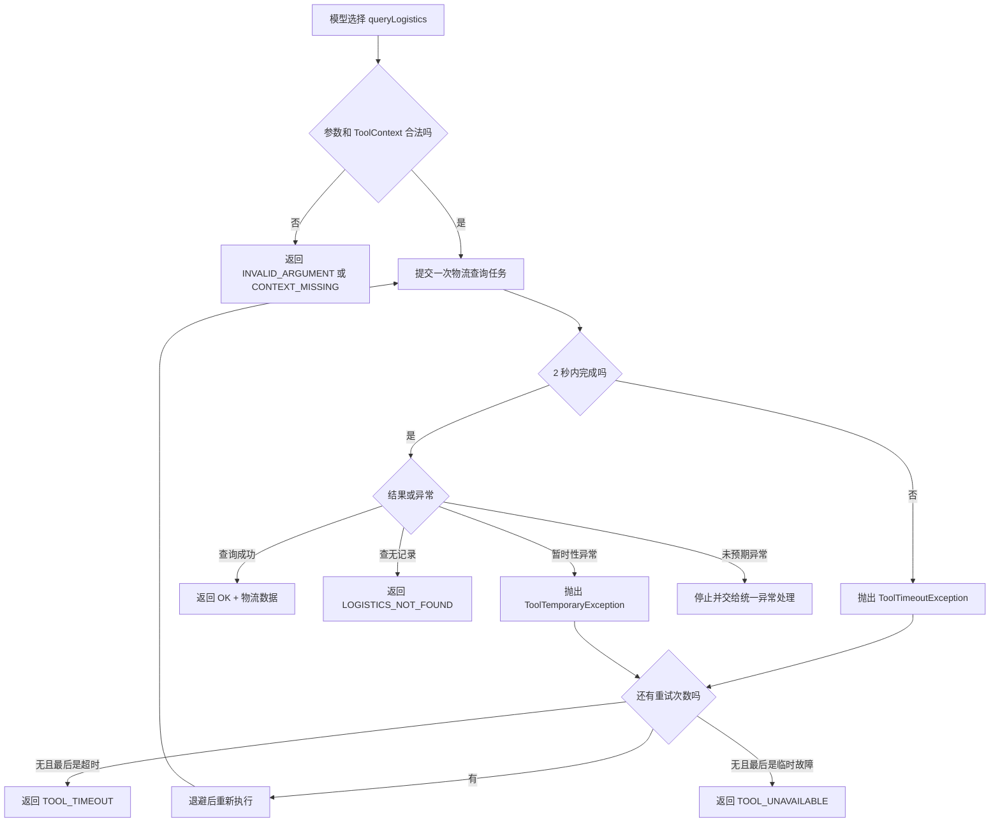

## 一、💡 一句话理解

> [!tip] 第 18 天核心结论
> Tool 不是“调用了就一定成功”的普通 Java 方法。可靠的 Tool 必须先区分业务失败和系统异常，再对暂时性故障设置单次超时与有限重试；重试耗尽后返回稳定、受控的 `ToolResult`，绝不能让模型猜测结果或看到内部异常堆栈。

本篇对应 [[0-学习路线]] 第 18 天，直接承接 [[17.多个工具自动选择]]。

前面已经完成三个只读工具：

- [[14.实现订单查询工具]]：`queryOrderStatus`；
- [[15.实现物流查询工具]]：`queryLogistics`；
- [[16.实现库存查询工具]]：`queryInventory`。

第 17 天解决“模型应该选哪个工具”，第 18 天解决“工具选对了，但执行失败怎么办”。

```text
模型选择 queryLogistics
  → Java 校验 orderId
  → 物流查询最多等待 2 秒
  → 暂时性失败才退避重试
  → 成功：返回真实物流数据
  → 重试耗尽：返回 TOOL_UNAVAILABLE
  → 每次都超时：返回 TOOL_TIMEOUT
  → 参数错误或查无记录：直接返回，不重试
```

> [!info] 本篇只处理 Tool 自身的可靠性
> `application.properties` 中的 `spring.ai.retry.*` 保护的是“Java 调用模型”的请求；本篇的 `RetryTemplate` 保护的是“模型选中 Tool 后，Java Tool 调用业务服务”的过程。两层位置不同，不能互相替代。

## 二、🧭 理论：工具异常、超时和重试是什么

### 2.1 先把失败分成业务结果和技术异常

不是所有“不成功”都应该抛异常，更不是所有异常都应该重试。

| 情况 | 当前项目示例 | 本质 | 是否重试 | 对模型的结果 |
| --- | --- | --- | --- | --- |
| 参数错误 | `orderId` 不符合 `A` 加数字的格式 | 请求本身不合法 | 否 | `INVALID_ARGUMENT` |
| 业务未命中 | 订单不存在、暂无物流记录 | 正常业务结果 | 否 | `*_NOT_FOUND` |
| 缺少可信上下文 | 没有 `userId` | 调用边界不完整 | 否 | `CONTEXT_MISSING` |
| 单次调用过慢 | 物流服务 2 秒仍未返回 | 技术性超时 | 可以，次数有限 | 最终为 `TOOL_TIMEOUT` |
| 网络瞬断、临时 `503` | 外部物流服务暂不可用 | 暂时性技术异常 | 可以，次数有限 | 最终为 `TOOL_UNAVAILABLE` |
| 认证或权限错误 | 下游返回 `401`、`403` | 配置或权限错误 | 否 | 记录日志并受控失败 |
| 代码缺陷 | `NullPointerException` | 未预期的程序错误 | 否 | 中止并交给服务端统一处理 |

当前项目已经把前三类处理成稳定的 `ToolResult.failure(...)`。本篇不会把它们改成异常，因为这些结果即使再执行一次也不会自行变好。

### 2.2 异常处理不是把所有异常都吞掉

Tool 里常见的两种错误处理方式都不理想：

```java
// 错误方式一：把所有异常都当作“查不到”。
catch (Exception exception) {
    return ToolResult.failure("LOGISTICS_NOT_FOUND", "暂无物流", List.of());
}
```

这会把“下游服务挂了”伪装成“用户确实没有物流记录”。模型会基于错误事实回答。

```java
// 错误方式二：把内部异常原文直接交给模型。
catch (Exception exception) {
    return ToolResult.failure("ERROR", exception.getMessage(), List.of());
}
```

异常消息可能包含内部地址、SQL、账号、请求参数或实现细节，不应该进入模型上下文。

正确原则是：

1. 已预期的业务失败，返回稳定业务码；
2. 已预期的暂时性技术失败，有限重试；
3. 重试后仍失败，转换为安全的工具结果码；
4. 未预期的程序异常，不冒充业务结果，也不把异常原文发给模型。

### 2.3 超时解决的是“最多等多久”

超时（Timeout）给一次工具调用设置最长等待时间。

本篇把真正的业务查询提交给专用线程池，再使用：

```java
future.get(2, TimeUnit.SECONDS);
```

它的含义是：当前线程最多等待 2 秒。2 秒内完成就取得结果；2 秒仍未完成就抛出 `TimeoutException`。

超时后会调用：

```java
future.cancel(true);
```

这表示“尝试中断本地执行线程”，不是保证远端已经停止。HTTP 请求如果已经到达下游，远端是否终止取决于 HTTP 客户端和下游服务是否响应中断。因此生产环境还应在真正的 HTTP 客户端上配置连接超时和读取超时。

### 2.4 重试解决的是“暂时失败后再给一次机会”

重试（Retry）只适合满足两个条件的操作：

1. 失败具有暂时性，再执行一次有可能恢复；
2. 重复执行不会造成不可接受的副作用。

当前订单、物流、库存 Tool 都是只读查询，适合在明确异常类型下有限重试。以后创建售后工单属于写操作，不能照搬本篇策略；写操作必须先有幂等键、执行状态查询和人工确认。

本篇使用 Spring Framework 7 自带的 `RetryTemplate` 和 `RetryPolicy`：

```java
RetryPolicy.builder()
        // 只重试我们明确标记的暂时性错误与超时。
        .includes(ToolTemporaryException.class, ToolTimeoutException.class)
        // maxRetries=2 表示第一次失败后最多再试 2 次，总执行次数最多为 3 次。
        .maxRetries(2)
        // 第一次重试前等待 200 毫秒。
        .delay(Duration.ofMillis(200))
        // 后续等待时间按 2 倍增长。
        .multiplier(2.0)
        // 单次退避最长不超过 1 秒。
        .maxDelay(Duration.ofSeconds(1))
        .build();
```

> [!warning] `maxRetries` 不是总尝试次数
> Spring Framework 7 中，总尝试次数 = 1 次首次调用 + `maxRetries`。因此 `maxRetries(2)` 最多执行 3 次。

### 2.5 退避避免故障期间连续猛打下游

如果第一次失败后立刻连续重试，下游正在过载时只会更忙。

本篇使用指数退避：

```text
第 1 次失败
  → 等待约 200ms
第 2 次失败
  → 等待约 400ms
第 3 次仍失败
  → 停止重试，返回受控失败
```

真实生产环境通常还会增加抖动（jitter），让多个请求不要在完全相同的时间再次冲向下游。本篇先保留最小配置，重点理解异常分类与重试边界。

### 2.6 Spring AI 怎样处理 Tool 抛出的异常

Spring AI 2.0.1 会把 Tool 抛出的异常包装为 `ToolExecutionException`，再交给 `ToolExecutionExceptionProcessor`。

默认处理器的行为是：

- `RuntimeException` 的消息可能被送回模型；
- checked exception 和 `Error` 会继续抛出；
- `spring.ai.tools.throw-exception-on-error=true` 时，所有工具错误都抛给调用方处理。

本项目更适合采用两层边界：

```text
可预期失败
  → Tool 内转换成安全的 ToolResult
  → 模型知道“查询失败”，但看不到内部堆栈

未预期异常
  → 继续抛出
  → Spring AI 不把原始异常消息交给模型
  → Web 层统一返回通用错误并记录服务端日志
```

因此本篇会配置：

```properties
spring.ai.tools.throw-exception-on-error=true
```

## 三、⚙️ 理论：一次可靠 Tool 调用怎样工作

### 3.1 完整执行顺序



顺序不能反过来。参数校验必须在重试之前完成，否则一个错误订单号也会被执行三次。

### 3.2 超时应该限制每次尝试

本篇设置的是“每次尝试最多 2 秒”：

```text
第 1 次：最多 2 秒
退避：200ms
第 2 次：最多 2 秒
退避：400ms
第 3 次：最多 2 秒
```

所以用户的最坏等待时间不是 2 秒，而是多次尝试时间与退避时间之和。按本篇配置，理论上约为：

```text
2s + 0.2s + 2s + 0.4s + 2s = 6.6s
```

这也是为什么“重试次数、单次超时、接口总超时”必须一起设计。不能只把每个参数单独看成很小。

### 3.3 `spring.ai.retry` 不会替 Java Tool 重试

当前项目已有：

```properties
spring.ai.retry.max-attempts=3
spring.ai.retry.on-http-codes=429,500,502,503,504
```

它保护的是下面两段模型请求：

```text
第一次模型请求：让模型判断是否调用 Tool
第二次模型请求：模型读取 Tool Result 并组织最终回答
```

它不会自动包住：

```text
LogisticsQueryTools
  → LogisticsQueryService
  → Repository 或第三方物流服务
```

因此本篇才在 Java Tool 的业务调用边界增加独立的 `ToolResilienceExecutor`。

### 3.4 只重试异常，不重试 `ToolResult.failure`

当前项目的 `ToolResult.failure(...)` 是一个正常返回值。例如：

```java
ToolResult.failure(
        "LOGISTICS_NOT_FOUND",
        "暂未查到物流记录",
        List.of("订单 A1002 暂无可用物流信息")
);
```

`RetryTemplate` 只看到“方法正常返回”，所以不会重试。这正是我们想要的行为：暂无物流不是系统崩溃，再查三次也没有意义。

暂时性故障必须先通过明确异常表达：

```java
throw new ToolTemporaryException("物流服务暂时不可用", cause);
```

这样重试策略才能只选择真正值得重试的失败。

### 3.5 多工具场景必须允许部分成功

用户可能同时问：

```text
查一下 A1001 的订单状态和物流位置。
```

订单 Tool 可能成功，物流 Tool 可能超时。此时不应该丢掉已经成功的订单结果，也不能把物流状态编出来。

System Prompt 应明确要求模型：

```text
多个工具中部分失败时，保留成功工具的真实结果；
对失败部分明确说明暂时无法查询，不得猜测或用成功结果替代。
```

## 四、🚀 实践：给物流 Tool 加上超时、重试和受控失败

### 4.1 前置准备

#### 4.1.1 当前项目环境

本篇直接使用现有项目：

| 项目 | 当前值 |
| --- | --- |
| Java | 21 |
| Spring Boot | 4.1.1 |
| Spring Framework | 7.0.9（由 Spring Boot 管理） |
| Spring AI | 2.0.1 |
| Maven | 3.9.16 |
| Tool 风格 | `@Tool` + `ToolResult<T>` |
| HTTP 入口 | `POST /api/multi-tool-chat` |

本机路径：

```text
JDK 21：/Volumes/data/develop/JDK/jdk21/Contents/Home
Maven：/Volumes/data/develop/apache-maven-3.9.16
```

#### 4.1.2 不新增 Maven 依赖

Spring Framework 7 已经在 `spring-core` 中提供：

```java
org.springframework.core.retry.RetryPolicy
org.springframework.core.retry.RetryTemplate
```

当前 Spring Boot 项目本身已经依赖 `spring-core`，所以本篇不需要添加旧版 `org.springframework.retry:spring-retry`，也不需要引入 Resilience4j。

#### 4.1.3 沿用现有模型配置

现有模型配置继续保留。再增加一项 Tool 异常边界：

文件位置：`src/main/resources/application.properties`。

```properties
# 未被 Tool 自己转换成 ToolResult 的异常继续抛给 Java 调用方，
# 不把 RuntimeException 的原始 message 直接放进模型上下文。
spring.ai.tools.throw-exception-on-error=true
```

模型 API Key 继续通过 `DEEPSEEK_API_KEY` 环境变量提供，不写入代码或 Markdown。

### 4.2 可以拿来干什么

#### 4.2.1 防止物流查询无限等待

用途：未来把内存 Repository 换成第三方物流 HTTP 接口后，即使下游一直不返回，当前 Tool 的一次尝试也最多等待 2 秒。

前置对象：

- `ExecutorService`：执行可能阻塞的物流查询；
- `Future`：代表这次异步任务的结果；
- `Duration timeout`：单次最长等待时间。

核心代码：

```java
// submit：把阻塞查询交给专用线程池，并立即得到 Future 回执。
Future<T> future = toolExecutor.submit(operation::get);

try {
    // get：最多等待 timeout；到时仍未完成就抛出 TimeoutException。
    return future.get(timeout.toMillis(), TimeUnit.MILLISECONDS);
}
catch (TimeoutException exception) {
    // cancel(true)：尝试中断本地任务，避免继续无意义占用线程。
    future.cancel(true);
    throw new ToolTimeoutException("工具单次执行超时", exception);
}
```

输入是一段返回查询结果的 `Supplier<T>`；处理过程是在线程池中执行并限时等待；输出是正常结果，或明确的 `ToolTimeoutException`。

#### 4.2.2 只对暂时性故障重试

用途：网络瞬断、下游 `429` 或 `5xx` 时，在短暂退避后再次查询；参数错误、权限错误和查无数据不重试。

真实 HTTP 适配器应先把下游错误分类。下面代码说明分类位置，`statusCode` 来自实际 HTTP 响应对象：

```java
if (statusCode == 429 || statusCode >= 500) {
    // 暂时性错误：转换为重试策略认识的异常。
    throw new ToolTemporaryException("下游物流服务暂时不可用");
}

if (statusCode == 400 || statusCode == 401 || statusCode == 403) {
    // 永久性或配置错误：不要伪装成暂时故障，也不要重试。
    throw new IllegalStateException("物流服务请求配置或权限错误");
}
```

当前项目仍使用 `InMemoryLogisticsRepository`，不会产生 HTTP 状态码；本篇通过单元测试主动抛出 `ToolTemporaryException` 验证重试，不虚构不存在的第三方接口。

#### 4.2.3 把最终失败变成模型可理解的安全结果

用途：重试已经耗尽时，让模型知道“这次物流查询暂时失败”，但不泄露异常类名、内部地址和堆栈。

```java
catch (ToolTimeoutException exception) {
    return ToolResult.failure(
            "TOOL_TIMEOUT",
            "物流查询超时",
            List.of("物流服务暂时响应较慢，请稍后重试")
    );
}
catch (ToolTemporaryException exception) {
    return ToolResult.failure(
            "TOOL_UNAVAILABLE",
            "物流查询服务暂时不可用",
            List.of("请稍后重新查询物流信息")
    );
}
```

输入是已经耗尽重试的受控异常；处理过程是映射为稳定结果码；输出会作为 Tool Result 返回给模型。异常原文只应记录在服务端日志，不进入 `errors`。

### 4.3 完整实践：代码、启动和验证

#### 4.3.1 定义两种可重试异常

文件位置：`src/main/java/com/afyke/ai/tool/resilience/ToolTemporaryException.java`。

```java
package com.afyke.ai.tool.resilience;

/**
 * 表示网络瞬断、下游限流或 5xx 等可能自行恢复的暂时性故障。
 * RetryPolicy 只会重试明确列入策略的异常，避免误伤参数和权限错误。
 */
public class ToolTemporaryException extends RuntimeException {

    public ToolTemporaryException(String message) {
        super(message);
    }

    public ToolTemporaryException(String message, Throwable cause) {
        super(message, cause);
    }
}
```

文件位置：`src/main/java/com/afyke/ai/tool/resilience/ToolTimeoutException.java`。

```java
package com.afyke.ai.tool.resilience;

/**
 * 表示一次 Tool 业务调用超过允许等待时间。
 */
public class ToolTimeoutException extends RuntimeException {

    public ToolTimeoutException(String message, Throwable cause) {
        super(message, cause);
    }
}
```

#### 4.3.2 编写通用 Tool 可靠性执行器

文件位置：`src/main/java/com/afyke/ai/tool/resilience/ToolResilienceExecutor.java`。

```java
package com.afyke.ai.tool.resilience;

import org.springframework.core.retry.RetryTemplate;

import java.time.Duration;
import java.util.concurrent.ExecutionException;
import java.util.concurrent.ExecutorService;
import java.util.concurrent.Future;
import java.util.concurrent.TimeUnit;
import java.util.concurrent.TimeoutException;
import java.util.function.Supplier;

/**
 * 为同步、可能阻塞的只读 Tool 调用统一增加“单次超时 + 有限重试”。
 *
 * 该类不知道订单、物流或库存业务，只负责执行策略，因此可以被多个 Tool 复用。
 */
public class ToolResilienceExecutor {

    private final RetryTemplate retryTemplate;
    private final ExecutorService toolExecutor;
    private final Duration timeout;

    public ToolResilienceExecutor(
            RetryTemplate retryTemplate,
            ExecutorService toolExecutor,
            Duration timeout) {
        this.retryTemplate = retryTemplate;
        this.toolExecutor = toolExecutor;
        this.timeout = timeout;
    }

    public <T> T execute(Supplier<T> operation) {
        // invoke：按照 RetryPolicy 执行 operation。
        // 只有策略 includes 中列出的异常才会进入下一次尝试；
        // 次数耗尽后，最后一个原始 RuntimeException 会继续抛给调用方。
        return retryTemplate.invoke(() -> executeOnce(operation));
    }

    private <T> T executeOnce(Supplier<T> operation) {
        // submit：把可能阻塞的业务调用交给专用 Tool 线程池。
        Future<T> future = toolExecutor.submit(operation::get);

        try {
            // get：本次尝试最多等待指定时间。
            // 正常完成返回 T；等待超时抛出 TimeoutException；
            // 业务线程抛异常时，则由 ExecutionException 包住原异常。
            return future.get(timeout.toMillis(), TimeUnit.MILLISECONDS);
        }
        catch (TimeoutException exception) {
            // 超时首先停止本地等待，并尝试中断正在运行的任务。
            future.cancel(true);
            throw new ToolTimeoutException("工具单次执行超时", exception);
        }
        catch (InterruptedException exception) {
            // 当前等待线程被外部中断时，不应该重试。
            future.cancel(true);
            // 恢复中断标记，让上层仍能感知线程已经被中断。
            Thread.currentThread().interrupt();
            throw new IllegalStateException("工具调用线程被中断", exception);
        }
        catch (ExecutionException exception) {
            // 取出业务任务真正抛出的异常，否则 RetryPolicy 只能看到 ExecutionException。
            Throwable cause = exception.getCause();

            if (cause instanceof RuntimeException runtimeException) {
                // 暂时性异常会被 RetryPolicy 识别；
                // 其他 RuntimeException 不在 includes 中，会立即向外抛出。
                throw runtimeException;
            }

            // checked exception 不属于当前受控策略，包装后交给统一异常处理。
            throw new IllegalStateException("工具执行发生未预期异常", cause);
        }
    }
}
```

这个类不返回 `ToolResult`。原因是它位于业务工具下面一层，只负责区分“成功、超时、暂时性异常、未预期异常”；最终怎样翻译成订单或物流错误码，仍由具体 Tool 决定。

#### 4.3.3 配置专用线程池和重试策略

文件位置：`src/main/java/com/afyke/ai/config/ToolResilienceConfig.java`。

```java
package com.afyke.ai.config;

import com.afyke.ai.tool.resilience.ToolResilienceExecutor;
import com.afyke.ai.tool.resilience.ToolTemporaryException;
import com.afyke.ai.tool.resilience.ToolTimeoutException;
import org.springframework.beans.factory.annotation.Qualifier;
import org.springframework.context.annotation.Bean;
import org.springframework.context.annotation.Configuration;
import org.springframework.core.retry.RetryPolicy;
import org.springframework.core.retry.RetryTemplate;

import java.time.Duration;
import java.util.concurrent.ExecutorService;
import java.util.concurrent.Executors;

@Configuration
public class ToolResilienceConfig {

    @Bean(destroyMethod = "shutdown")
    ExecutorService toolExecutor() {
        // Tool 使用独立线程池，避免与第 9 天的模型调用线程池互相占满。
        // 学习示例固定 4 个线程；生产环境应使用有界队列并结合监控调参。
        return Executors.newFixedThreadPool(4);
    }

    @Bean
    RetryTemplate toolRetryTemplate() {
        RetryPolicy retryPolicy = RetryPolicy.builder()
                // includes：只有下面两类明确的暂时性失败才能重试。
                .includes(
                        ToolTemporaryException.class,
                        ToolTimeoutException.class
                )
                // maxRetries：首次调用失败后最多再执行 2 次，总次数最多为 3。
                .maxRetries(2)
                // delay：第一次重试前等待 200 毫秒。
                .delay(Duration.ofMillis(200))
                // multiplier：之后的退避间隔按 2 倍增长。
                .multiplier(2.0)
                // maxDelay：单次退避最长不超过 1 秒。
                .maxDelay(Duration.ofSeconds(1))
                .build();

        // RetryTemplate：按上面的 RetryPolicy 执行一段 Java 逻辑。
        return new RetryTemplate(retryPolicy);
    }

    @Bean
    ToolResilienceExecutor toolResilienceExecutor(
            @Qualifier("toolRetryTemplate") RetryTemplate retryTemplate,
            @Qualifier("toolExecutor") ExecutorService toolExecutor) {

        // 每一次工具尝试最多等待 2 秒，不是整次 HTTP 请求只等 2 秒。
        return new ToolResilienceExecutor(
                retryTemplate,
                toolExecutor,
                Duration.ofSeconds(2)
        );
    }
}
```

项目中已经有名为 `aiExecutor` 的模型调用线程池，所以这里通过 `@Qualifier("toolExecutor")` 精确指定 Tool 线程池，避免 Spring 面对两个 `ExecutorService` Bean 时不知道注入哪一个。

#### 4.3.4 给物流 Tool 接入执行器

文件位置：`src/main/java/com/afyke/ai/tool/LogisticsQueryTools.java`。

用下面完整内容替换现有文件：

```java
package com.afyke.ai.tool;

import com.afyke.ai.logistics.service.LogisticsQueryResult;
import com.afyke.ai.logistics.service.LogisticsQueryService;
import com.afyke.ai.tool.resilience.ToolResilienceExecutor;
import com.afyke.ai.tool.resilience.ToolTemporaryException;
import com.afyke.ai.tool.resilience.ToolTimeoutException;
import jakarta.validation.ConstraintViolation;
import jakarta.validation.Validator;
import org.springframework.ai.chat.model.ToolContext;
import org.springframework.ai.tool.annotation.Tool;
import org.springframework.ai.tool.annotation.ToolParam;
import org.springframework.stereotype.Component;

import java.util.List;

@Component
public class LogisticsQueryTools {

    private final Validator validator;
    private final LogisticsQueryService logisticsQueryService;
    private final ToolResilienceExecutor toolResilienceExecutor;

    public LogisticsQueryTools(
            Validator validator,
            LogisticsQueryService logisticsQueryService,
            ToolResilienceExecutor toolResilienceExecutor) {
        // Validator：校验模型生成的 orderId。
        this.validator = validator;
        // Service：执行真正的物流查询。
        this.logisticsQueryService = logisticsQueryService;
        // 执行器：为业务查询增加单次超时与有限重试。
        this.toolResilienceExecutor = toolResilienceExecutor;
    }

    @Tool(
            name = "queryLogistics",
            description = "根据订单编号查询物流信息；用户询问快递、包裹位置、配送进度、是否派送或签收时使用；只读，不修改物流"
    )
    public ToolResult<LogisticsQueryResult> queryLogistics(
            @ToolParam(
                    description = "订单编号，格式为大写字母 A 加 4～10 位数字，例如 A1001",
                    required = true
            )
            String orderId,
            ToolContext toolContext) {

        // ToolContext 中的数据由 Java 应用传入，不由模型生成。
        Object userIdValue = toolContext.getContext().get("userId");
        String userId = userIdValue == null ? "" : userIdValue.toString();

        if (userId.isBlank()) {
            return ToolResult.failure(
                    "CONTEXT_MISSING",
                    "缺少调用用户上下文",
                    List.of("Java 应用必须通过 ToolContext 提供 userId")
            );
        }

        return queryLogisticsInternal(orderId);
    }

    /**
     * 先校验参数，再执行可靠性策略。
     * 参数错误不会进入线程池，更不会重试。
     */
    ToolResult<LogisticsQueryResult> queryLogisticsInternal(String orderId) {
        QueryLogisticsCommand command = new QueryLogisticsCommand(orderId);

        // validate：执行 @NotBlank 和 @Pattern 约束。
        var violations = validator.validate(command);

        if (!violations.isEmpty()) {
            List<String> errors = violations.stream()
                    // getMessage：只返回受控校验文案，不暴露异常堆栈。
                    .map(ConstraintViolation::getMessage)
                    // sorted：让结果顺序稳定，方便测试断言。
                    .sorted()
                    .toList();

            return ToolResult.failure(
                    "INVALID_ARGUMENT",
                    "工具参数校验失败",
                    errors
            );
        }

        try {
            // execute：每次查询最多等待 2 秒；仅对超时和暂时性故障有限重试。
            var queryResult = toolResilienceExecutor.execute(
                    () -> logisticsQueryService.queryByOrderId(command.orderId())
            );

            return queryResult
                    // map：查到物流时包装为统一成功结果。
                    .map(logistics -> ToolResult.success("物流查询成功", logistics))
                    // Optional 为空是正常业务结果，不抛异常，因此不会触发重试。
                    .orElseGet(() -> ToolResult.failure(
                            "LOGISTICS_NOT_FOUND",
                            "暂未查到物流记录",
                            List.of("订单 " + command.orderId() + " 暂无可用物流信息")
                    ));
        }
        catch (ToolTimeoutException exception) {
            // 只有所有允许的尝试都超时后，才会到达这里。
            // 不把 exception.getMessage() 或堆栈交给模型。
            return ToolResult.failure(
                    "TOOL_TIMEOUT",
                    "物流查询超时",
                    List.of("物流服务暂时响应较慢，请稍后重试")
            );
        }
        catch (ToolTemporaryException exception) {
            // 暂时性异常重试耗尽后，返回稳定、安全的失败结果。
            return ToolResult.failure(
                    "TOOL_UNAVAILABLE",
                    "物流查询服务暂时不可用",
                    List.of("请稍后重新查询物流信息")
            );
        }
    }
}
```

> [!info] 当前内存 Service 为什么不会触发重试
> `LogisticsQueryService` 现在只查询 `InMemoryLogisticsRepository`，通常会立即返回。可靠性层已经放在正确边界上；以后把 Service 下方换成真实 HTTP、RPC 或数据库调用时，适配器只需把可恢复故障转换为 `ToolTemporaryException`，Tool 主流程不需要重写。

#### 4.3.5 补充多工具失败规则

文件位置：`src/main/java/com/afyke/ai/controller/toolController/MultiToolChatController.java`。

在现有 `.system("""...""")` 末尾补充：

```text
工具返回 success=false 时，不得把失败结果改写成成功事实，也不得猜测数据。
错误码为 TOOL_TIMEOUT 或 TOOL_UNAVAILABLE 时，说明对应查询暂时不可用并建议稍后重试。
一个问题调用多个工具且只有部分工具失败时，保留成功部分的真实结果，并单独说明失败部分。
```

输入仍是用户原始问题；Tool 结果中的 `success` 与 `code` 告诉模型哪些数据可信；输出应该诚实区分“已查到”和“暂时无法查询”。

#### 4.3.6 防止未预期异常消息进入模型

文件位置：`src/main/resources/application.properties`。

```properties
# 预期的超时和临时故障已经在 LogisticsQueryTools 中转成安全 ToolResult。
# 其余未预期异常继续抛给 Java，不把原始异常消息直接交给模型。
spring.ai.tools.throw-exception-on-error=true
```

这项配置不会影响已经正常返回的 `ToolResult.failure(...)`；它只处理真正从 Tool 方法抛出的异常。

#### 4.3.7 编写可重复的异常、超时和重试测试

文件位置：`src/test/java/com/afyke/ai/tool/resilience/ToolResilienceExecutorTests.java`。

```java
package com.afyke.ai.tool.resilience;

import org.junit.jupiter.api.AfterEach;
import org.junit.jupiter.api.BeforeEach;
import org.junit.jupiter.api.Test;
import org.springframework.core.retry.RetryPolicy;
import org.springframework.core.retry.RetryTemplate;

import java.time.Duration;
import java.util.concurrent.ExecutorService;
import java.util.concurrent.Executors;
import java.util.concurrent.atomic.AtomicInteger;

import static org.junit.jupiter.api.Assertions.assertEquals;
import static org.junit.jupiter.api.Assertions.assertThrows;

class ToolResilienceExecutorTests {

    private ExecutorService executorService;

    @BeforeEach
    void createExecutor() {
        // 每个测试使用独立线程池，避免测试之间共享未完成任务。
        executorService = Executors.newFixedThreadPool(2);
    }

    @AfterEach
    void shutdownExecutor() {
        // shutdownNow：测试结束后中断仍在运行的模拟慢任务。
        executorService.shutdownNow();
    }

    private ToolResilienceExecutor createToolExecutor(Duration timeout) {
        RetryPolicy retryPolicy = RetryPolicy.builder()
                // 测试策略与生产一致：只重试暂时性异常和超时。
                .includes(
                        ToolTemporaryException.class,
                        ToolTimeoutException.class
                )
                // 首次执行加 2 次重试，总共最多执行 3 次。
                .maxRetries(2)
                // 测试中不增加退避，避免单元测试无意义地等待。
                .delay(Duration.ZERO)
                .build();

        return new ToolResilienceExecutor(
                new RetryTemplate(retryPolicy),
                executorService,
                timeout
        );
    }

    @Test
    void shouldReturnImmediatelyWhenFirstAttemptSucceeds() {
        AtomicInteger attempts = new AtomicInteger();
        ToolResilienceExecutor toolExecutor = createToolExecutor(Duration.ofMillis(100));

        String result = toolExecutor.execute(() -> {
            attempts.incrementAndGet();
            return "物流查询成功";
        });

        assertEquals("物流查询成功", result);
        assertEquals(1, attempts.get());
    }

    @Test
    void shouldRetryTemporaryFailureAndEventuallySucceed() {
        AtomicInteger attempts = new AtomicInteger();
        ToolResilienceExecutor toolExecutor = createToolExecutor(Duration.ofMillis(100));

        String result = toolExecutor.execute(() -> {
            int currentAttempt = attempts.incrementAndGet();

            if (currentAttempt < 3) {
                // 前两次模拟网络瞬断；第 3 次恢复。
                throw new ToolTemporaryException("模拟暂时性故障");
            }

            return "第三次查询成功";
        });

        assertEquals("第三次查询成功", result);
        assertEquals(3, attempts.get());
    }

    @Test
    void shouldStopAfterTemporaryFailureExhaustsRetries() {
        AtomicInteger attempts = new AtomicInteger();
        ToolResilienceExecutor toolExecutor = createToolExecutor(Duration.ofMillis(100));

        assertThrows(ToolTemporaryException.class, () ->
                toolExecutor.execute(() -> {
                    attempts.incrementAndGet();
                    throw new ToolTemporaryException("一直不可用");
                })
        );

        // 1 次首次调用 + 2 次重试。
        assertEquals(3, attempts.get());
    }

    @Test
    void shouldStopWaitingWhenEveryAttemptTimesOut() {
        AtomicInteger attempts = new AtomicInteger();
        ToolResilienceExecutor toolExecutor = createToolExecutor(Duration.ofMillis(30));

        assertThrows(ToolTimeoutException.class, () ->
                toolExecutor.execute(() -> {
                    attempts.incrementAndGet();

                    try {
                        // 故意超过单次 30 毫秒超时，用于稳定触发 TimeoutException。
                        Thread.sleep(300);
                    }
                    catch (InterruptedException exception) {
                        // cancel(true) 会尝试中断当前慢任务。
                        Thread.currentThread().interrupt();
                    }

                    return "不应该拿到这个结果";
                })
        );

        assertEquals(3, attempts.get());
    }

    @Test
    void shouldNotRetryUnexpectedProgrammingError() {
        AtomicInteger attempts = new AtomicInteger();
        ToolResilienceExecutor toolExecutor = createToolExecutor(Duration.ofMillis(100));

        assertThrows(IllegalArgumentException.class, () ->
                toolExecutor.execute(() -> {
                    attempts.incrementAndGet();
                    throw new IllegalArgumentException("模拟不可重试的程序错误");
                })
        );

        // IllegalArgumentException 不在 includes 中，所以只执行一次。
        assertEquals(1, attempts.get());
    }
}
```

这组测试不调用模型，也不依赖真实物流服务，因此结果可重复。它分别验证：首次成功、失败后恢复、重试耗尽、每次超时、未知异常不重试。

#### 4.3.8 更新现有物流工具测试

`LogisticsQueryTools` 新增了 `ToolResilienceExecutor` 构造参数，原有单元测试也必须显式提供该对象，否则测试编译阶段会提示构造方法参数数量不匹配。

文件位置：`src/test/java/com/afyke/ai/tool/LogisticsQueryToolsTests.java`。

用下面完整内容替换现有文件：

```java
package com.afyke.ai.tool;

import com.afyke.ai.logistics.repository.InMemoryLogisticsRepository;
import com.afyke.ai.logistics.service.LogisticsQueryService;
import com.afyke.ai.tool.resilience.ToolResilienceExecutor;
import jakarta.validation.Validation;
import jakarta.validation.Validator;
import org.junit.jupiter.api.AfterEach;
import org.junit.jupiter.api.BeforeAll;
import org.junit.jupiter.api.BeforeEach;
import org.junit.jupiter.api.Test;
import org.springframework.core.retry.RetryPolicy;
import org.springframework.core.retry.RetryTemplate;

import java.time.Duration;
import java.util.concurrent.ExecutorService;
import java.util.concurrent.Executors;

import static org.junit.jupiter.api.Assertions.assertEquals;
import static org.junit.jupiter.api.Assertions.assertFalse;
import static org.junit.jupiter.api.Assertions.assertTrue;

class LogisticsQueryToolsTests {

    private static Validator validator;
    private ExecutorService executorService;

    @BeforeAll
    static void createValidator() {
        // buildDefaultValidatorFactory：创建 Jakarta Validation 的默认实现。
        validator = Validation.buildDefaultValidatorFactory().getValidator();
    }

    @BeforeEach
    void createExecutor() {
        // 每个测试使用独立线程池，测试结束后立即关闭。
        executorService = Executors.newFixedThreadPool(2);
    }

    @AfterEach
    void shutdownExecutor() {
        executorService.shutdownNow();
    }

    private LogisticsQueryTools createTools() {
        var repository = new InMemoryLogisticsRepository();
        var service = new LogisticsQueryService(repository);

        // 原有测试只验证参数和业务结果，不专门验证重试；
        // 因此这里配置 0 次重试，失败时可以立即暴露测试问题。
        var retryTemplate = new RetryTemplate(RetryPolicy.withMaxRetries(0));
        var resilienceExecutor = new ToolResilienceExecutor(
                retryTemplate,
                executorService,
                Duration.ofMillis(100)
        );

        return new LogisticsQueryTools(
                validator,
                service,
                resilienceExecutor
        );
    }

    @Test
    void shouldReturnSuccessForExistingLogistics() {
        var result = createTools().queryLogisticsInternal("A1001");

        assertTrue(result.success());
        assertEquals("OK", result.code());
        assertEquals("SF10010001", result.data().trackingNumber());
    }

    @Test
    void shouldRejectInvalidOrderId() {
        var result = createTools().queryLogisticsInternal("1001");

        assertFalse(result.success());
        assertEquals("INVALID_ARGUMENT", result.code());
        assertTrue(result.errors().stream()
                .anyMatch(message -> message.contains("订单编号格式错误")));
    }

    @Test
    void shouldReturnControlledFailureWhenNoLogisticsExists() {
        var result = createTools().queryLogisticsInternal("A1002");

        assertFalse(result.success());
        assertEquals("LOGISTICS_NOT_FOUND", result.code());
    }
}
```

参数格式错误会在提交线程池前直接返回，存在记录与不存在记录则通过可靠性执行器完成一次查询。这样既保留原有测试目标，也适配了新的构造依赖。

#### 4.3.9 编译并运行测试

在项目根目录执行：

```bash
export JAVA_HOME="/Volumes/data/develop/JDK/jdk21/Contents/Home"
export PATH="$JAVA_HOME/bin:$PATH"

/Volumes/data/develop/apache-maven-3.9.16/bin/mvn clean test
```

预期结果：

```text
ToolResilienceExecutorTests：5 个测试全部通过
LogisticsQueryToolsTests：原有物流参数与业务结果测试继续通过
BUILD SUCCESS
```

如果 `delay(Duration.ZERO)` 在实际使用的 Spring Framework 小版本中被限制为正数，把测试退避改成 `Duration.ofMillis(1)`；生产配置仍保留正常退避时间。

#### 4.3.10 启动项目并验证正常路径

先在 IntelliJ IDEA 的 `AiApplication` 启动配置中提供：

```text
DEEPSEEK_API_KEY=你自己的真实密钥
```

然后启动 `AiApplication`，发送请求：

```bash
curl -X POST "http://localhost:8080/api/multi-tool-chat" \
  -H "Content-Type: application/json" \
  -d '{"message":"查询订单 A1001 的物流位置"}'
```

预期流程：

```text
模型选择 queryLogistics
  → 参数校验通过
  → ToolResilienceExecutor 执行内存物流查询
  → 第一次调用立即成功
  → ToolResult.code = OK
  → 模型根据真实物流数据回答
```

因为当前 Repository 是内存实现，接口正常路径不会故意制造超时。异常与重试通过 `4.3.7` 的确定性单元测试验证，避免在业务代码里加入仅供演示的随机失败。

#### 4.3.11 验证业务失败不会重试

请求一个格式正确但没有物流记录的订单：

```bash
curl -X POST "http://localhost:8080/api/multi-tool-chat" \
  -H "Content-Type: application/json" \
  -d '{"message":"查询订单 A1002 的物流位置"}'
```

预期 Tool Result：

```json
{
  "success": false,
  "code": "LOGISTICS_NOT_FOUND",
  "message": "暂未查到物流记录",
  "data": null,
  "errors": [
    "订单 A1002 暂无可用物流信息"
  ]
}
```

这条路径只执行一次。`LOGISTICS_NOT_FOUND` 是正常返回值，不属于 `RetryPolicy.includes(...)` 中的异常。

#### 4.3.12 关键报错排查

| 现象 | 常见原因 | 修复方法 |
| --- | --- | --- |
| 注入 `ExecutorService` 时提示多个 Bean | 项目同时有 `aiExecutor` 和 `toolExecutor` | 保留 `@Qualifier("toolExecutor")` |
| 参数错误也执行了三次 | 参数校验放到了 `ToolResilienceExecutor` 内部 | 先校验，再调用 `execute(...)` |
| 所有 RuntimeException 都在重试 | `RetryPolicy` 没有限定 `includes` | 只包含 `ToolTemporaryException` 与 `ToolTimeoutException` |
| `LOGISTICS_NOT_FOUND` 被误判为系统异常 | Service 把空结果抛成了异常 | 正常未命中继续使用 `Optional.empty()` |
| 超时后后台任务仍运行 | 下游调用不响应线程中断 | 同时配置 HTTP 连接/读取超时，不能只依赖 `cancel(true)` |
| 用户等待明显超过 2 秒 | 2 秒是单次尝试，且有重试与退避 | 计算整个最坏耗时，并设置接口总超时 |
| 模型看到内部异常消息 | Tool 异常仍使用默认处理器返回消息 | 配置 `spring.ai.tools.throw-exception-on-error=true`，预期失败在 Tool 内转成安全结果 |
| 一次请求产生很多下游调用 | 模型重试与 Tool 重试叠加 | 分别统计两层尝试次数，限制 Tool 总调用次数 |

## 五、📌 总结

### 5.1 快速回顾

- 参数错误、查无记录、缺少上下文是业务失败，直接返回稳定 `ToolResult`，不重试。
- 网络瞬断、下游 `429/5xx` 和单次超时才属于可重试的暂时性故障。
- `maxRetries(2)` 表示首次调用后最多再试 2 次，总共最多 3 次。
- 超时限制的是每次尝试；用户最坏等待时间还要加上重试与退避。
- `spring.ai.retry.*` 保护模型调用，本篇 `RetryTemplate` 保护 Java Tool 的业务调用。
- 预期异常最终转换为 `TOOL_TIMEOUT` 或 `TOOL_UNAVAILABLE`；未预期异常不能伪装成业务结果。
- `future.cancel(true)` 只是尝试中断本地任务，真实远程调用还要配置 HTTP 客户端超时。
- 当前三个 Tool 都是只读查询；写操作不能盲目套用自动重试。

### 5.2 一句话复述

> 可靠 Tool 的关键不是“出错就重试”，而是先判断失败能不能恢复、重复执行是否安全，再用单次超时、有限重试和受控结果把故障关在 Java 应用内部。

## 六、📚 官方资料

### 6.1 Spring AI Tool Calling

- [Spring AI 2.0.1：Tool Calling](https://docs.spring.io/spring-ai/reference/api/tools.html)
  - 本篇实际参考了 Tool Calling 循环、`ToolExecutionExceptionProcessor`、`spring.ai.tools.throw-exception-on-error` 与 Tool 调用次数限制。

### 6.2 Spring Framework 重试

- [Spring Framework 7.0.9：Resilience Features](https://docs.spring.io/spring-framework/reference/core/resilience.html)
  - 本篇实际参考了 `RetryTemplate`、`RetryPolicy`、`includes`、`maxRetries` 和指数退避配置。

### 6.3 Java 21 Future

- [Java 21：Future API](https://docs.oracle.com/en/java/javase/21/docs/api/java.base/java/util/concurrent/Future.html)
  - 本篇实际参考了 `Future#get(timeout, unit)`、`TimeoutException` 与 `cancel(true)` 的行为说明。
