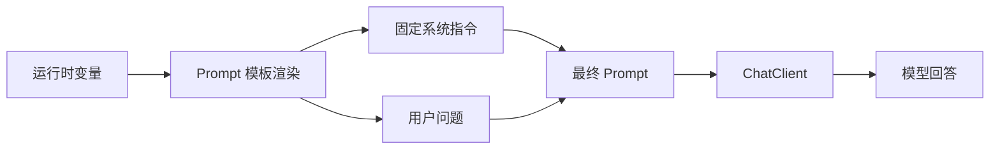

## 一、💡 一句话理解

> [!tip] 第 5 天核心结论
> `Prompt` 是交给模型的完整输入，`System Prompt` 负责规定模型在本次对话中的角色、目标和行为边界，`Prompt 模板` 则把固定指令和运行时变量分开，让同一套提示词可以反复使用。

今天只学习提示词本身，不提前学习结构化输出、SSE、会话记忆、RAG、Tool Calling 或 Agent 工作流。

把三者记成一条链：

```text
Prompt
  ├─ System Prompt：模型应该怎样工作
  └─ User Prompt：这一次具体要完成什么
       ↓
Prompt Template：把运行时变量填入固定文本
       ↓
ChatClient 调用模型
```

本文对应 [[0-学习路线]] 第 5 天，并沿用第 4 天已经跑通的 [[3.Spring AI ChatClient]] 项目。

## 二、🧭 理论：它是什么

### 2.1 Prompt 是什么

Prompt 可以先理解成“交给模型的一组输入和指令”。它不只是用户输入的一句话，也可以包含：

- 任务目标：要模型完成什么事情。
- 背景信息：模型需要知道哪些上下文。
- 输出要求：回答使用什么语言、风格或结构。
- 角色信息：模型在本次任务中应该怎样工作。
- 运行时数据：由 Java 程序动态注入的主题、问题或业务内容。

在 Spring AI 中，`Prompt` 不是简单的 `String`。官方定义中，它是多个 `Message` 和本次调用选项 `ChatOptions` 的容器。`Message` 通过角色区分用途，最常见的是 `system` 和 `user`。

| 组成 | 白话理解 | 典型内容 |
| --- | --- | --- |
| `Prompt` | 交给模型的一整份输入 | 系统指令、用户问题、上下文 |
| `System Message` | 先告诉模型“你应该怎样工作” | 角色、规则、边界、回答风格 |
| `User Message` | 告诉模型“这一次具体做什么” | 用户问题、待总结文本、待分类内容 |
| `ChatOptions` | 本次生成的调用选项 | 模型名、温度、输出长度等 |

这里的“角色”是消息在请求中的职责，不等于真实权限。比如 `system` 可以要求模型“只回答企业制度问题”，但真正的权限校验仍然必须由 Java 后端完成。

### 2.2 System Prompt 是什么

`System Prompt` 是给模型设定整体工作方式的指令。它通常放置相对稳定的内容，例如：

- 你是谁：例如“你是企业售后助手”。
- 你的任务：例如“帮助用户理解售后制度”。
- 你的回答风格：例如“使用简洁中文回答”。
- 你的边界：例如“资料中没有答案时明确说不知道”。
- 你的输出约束：例如“先给结论，再给原因”。

可以把它类比成 Java 服务里的“默认配置”，把本次用户问题类比成一次请求参数。这个类比只帮助理解：`System Prompt` 不是 Spring 的配置文件，也不是安全系统，最终仍会被转换成发给模型的消息。

`System Prompt` 和 `User Prompt` 的区别如下：

| 对比项 | System Prompt | User Prompt |
| --- | --- | --- |
| 主要作用 | 规定模型整体行为和解释方式 | 描述本次具体问题或任务 |
| 内容稳定性 | 通常相对稳定，可复用 | 通常随请求变化 |
| Spring AI 写法 | `.system(...)` | `.user(...)` 或 `.prompt("...")` |
| 示例 | “你是售后制度助手，只根据资料回答” | “退货需要满足什么条件？” |

### 2.3 Prompt 模板是什么

Prompt 模板是“固定提示词 + 占位变量”。模板把不变的指令写一次，把每次请求才知道的数据留成变量：

```text
固定部分：请以 {audience} 能理解的方式解释 {topic}。
运行时变量：audience = Java 后端开发者，topic = Prompt 模板。
最终 Prompt：请以 Java 后端开发者能理解的方式解释 Prompt 模板。
```

Spring AI 的 `PromptTemplate` 用于定义带占位符的模板，再通过变量渲染出最终文本或消息。当前官方文档中，默认变量写法是 `{变量名}`，默认使用 `StTemplateRenderer` 进行替换。

模板解决的是代码复用和参数注入问题，不会自动提升模型能力。模板写得不清楚，重复调用的仍然是不清楚的提示词。

### 2.4 三者之间的关系



在 Spring AI 中，最常见的业务代码是用 `ChatClient` fluent API 组装这份 Prompt：

```java
String answer = chatClient
        .prompt()
        .system("你是一个简洁、可靠的技术助手。")
        .user("请解释什么是 Prompt。")
        .call()
        .content();
```

## 三、⚙️ 理论：它是怎么工作的

### 3.1 `ChatClient` 如何组装 Prompt

第 4 天的最短写法是：

```java
String answer = chatClient
        .prompt("请解释什么是 Prompt。")
        .call()
        .content();
```

这里的 `.prompt(String)` 是方便写法，表示直接把这段文字作为本次用户输入。

如果要分别设置系统指令和用户问题，使用无参数的 `.prompt()` 开始构建：

```java
String answer = chatClient
        .prompt()
        .system("你是面向 Java 后端开发者的学习助手，请使用中文和短句。")
        .user("请解释什么是 Prompt。")
        .call()
        .content();
```

调用过程可以拆成：

```text
prompt()
  → 创建本次请求的 Prompt 构建过程
  → system(...) 加入系统消息
  → user(...) 加入用户消息
  → call() 调用已配置的 ChatModel
  → content() 取出文本回答
```

### 3.2 System Prompt 的作用范围

系统消息适合放“跨多个问题都成立”的规则。例如同一个售后助手的每次请求都要求：

```text
你是企业售后助手。
只根据已提供的企业制度回答。
资料不足时，明确说明“当前资料无法确认”。
不要编造订单状态、物流信息或退款结果。
```

本次用户问题再单独放在 `user` 消息中：

```text
退货商品需要满足哪些条件？
```

这样做的好处是职责清楚：系统消息控制“怎么回答”，用户消息描述“回答什么”。但系统消息并不是后端权限控制：

> [!warning] 重要边界
> 不要把“System Prompt 中写了不能查询订单”当成真正的权限校验。订单查询、文档权限和写操作确认必须在 Java 服务中判断，不能只依赖模型遵守文字规则。

### 3.3 Prompt 模板的渲染过程

模板调用模型前会先经历一次变量替换：

```text
模板文本
  → 查找 {topic}、{audience} 等占位符
  → 用 Java 运行时变量替换
  → 得到最终 system/user 文本
  → 组装 Prompt
  → 调用模型
```

最底层的 `PromptTemplate` 可以这样使用：

```java
import java.util.Map;
import org.springframework.ai.chat.prompt.PromptTemplate;

PromptTemplate template = new PromptTemplate(
        "请用 {audience} 能理解的方式解释 {topic}。"
);

String renderedText = template.render(Map.of(
        "audience", "Java 后端开发者",
        "topic", "Prompt 模板"
));
```

`renderedText` 是已经替换完成的普通字符串。它还没有调用模型；只有把它作为用户消息交给 `ChatClient` 或把模板创建成 `Prompt` 后，才会产生模型回答。

如果模板本身表示系统消息，可以使用 `SystemPromptTemplate`：

```java
import java.util.Map;
import org.springframework.ai.chat.messages.Message;
import org.springframework.ai.chat.prompt.SystemPromptTemplate;

SystemPromptTemplate systemTemplate = new SystemPromptTemplate(
        "你是一个 {role}，请使用 {style} 回答。"
);

Message systemMessage = systemTemplate.createMessage(Map.of(
        "role", "企业售后助手",
        "style", "简洁中文"
));
```

实际项目中，日常简单调用可以直接使用 `ChatClient` 的 `.system(...)`、`.user(...)` 模板写法；当模板需要单独测试、复用或从资源文件读取时，再使用 `PromptTemplate` 或 `SystemPromptTemplate`。

### 3.4 模板设计的基本原则

这一天只掌握以下最小原则：

1. 固定规则放在 System Prompt，变化的问题放在 User Prompt。
2. 一个变量只表达一个含义，例如 `{topic}` 不要同时表示主题和完整用户问题。
3. 变量名要有业务含义，不要大量使用 `{x}`、`{data1}`。
4. 模板渲染前校验输入，避免把空字符串或未授权内容直接交给模型。
5. 模板中不要写 API Key、数据库密码或内部敏感信息。
6. 修改模板时保留版本号或变更记录，方便比较回答变化。

## 四、🚀 实践：从准备到验证

### 4.1 前置准备

#### 4.1.1 沿用第 4 天的项目和模型配置

本篇不重新创建 Spring Boot 项目，也不新增模型供应商。沿用前一篇已经可以访问 `/test1` 的项目。

确认 `pom.xml` 中已有 Spring AI OpenAI Starter：

```xml
<dependency>
    <groupId>org.springframework.ai</groupId>
    <artifactId>spring-ai-starter-model-openai</artifactId>
</dependency>
```

确认 `application.properties` 使用环境变量保存 API Key：

```properties
spring.ai.openai.api-key=${DEEPSEEK_API_KEY}
spring.ai.openai.base-url=https://api.deepseek.com
spring.ai.openai.chat.model=deepseek-v4-flash
```

模型名和地址应以当前供应商文档及你项目实际配置为准。不要把真实 API Key 写入 Java 源码、配置文件或 Git 仓库。

#### 4.1.2 确认项目可以启动

使用第 4 天的方式启动 `AiApplication`，确认服务监听 `8080`。本篇使用普通同步调用，不需要添加 SSE 依赖，也不需要启动前端项目。

代码使用 Java 文本块；如果项目使用 Java 17，可以直接运行。若项目版本更低，改成普通字符串拼接或多行字符串即可，业务逻辑不变。

### 4.2 可以拿来干什么

#### 4.2.1 使用 Prompt 完成一次普通问答

用途：给模型一个明确问题，获得普通文本回答。这是最简单的 Prompt，也是后续所有调用方式的起点。

前置：已经注入第 4 天创建的 `ChatClient`。

```java
String answer = chatClient
        .prompt("用一句话解释 Prompt。")
        .call()
        .content();
```

输入是一句用户问题；处理过程是 `ChatClient` 将问题组装为用户消息并调用模型；输出是模型生成的 `String`。适合固定测试、快速验证模型是否可用，以及不需要复杂角色规则的简单问答。

#### 4.2.2 使用 System Prompt 统一回答行为

用途：让同一个接口稳定地遵守角色、语言和回答边界。

前置：需要同时使用 `.system(...)` 和 `.user(...)`；系统提示词放稳定规则，用户消息放当前问题。

```java
String answer = chatClient
        .prompt()
        .system("""
                你是面向 Java 后端开发者的学习助手。
                请使用简洁中文回答，先给结论，再解释原因。
                不确定的内容要明确说明，不要编造事实。
                """)
        .user("Spring AI 的 ChatClient 是什么？")
        .call()
        .content();
```

输入是用户问题和系统规则；处理过程是两种消息共同组成 Prompt；输出应符合系统中规定的语言、风格和回答顺序。适合客服、制度问答、技术学习助手等需要统一口径的场景。

#### 4.2.3 使用 Prompt 模板复用指令

用途：同一套提示词服务不同主题、不同用户类型或不同业务请求，避免在 Java 代码中重复拼接长字符串。

前置：模板中的 `{audience}`、`{topic}` 必须和 `.param(...)` 中的变量名完全一致。

```java
String answer = chatClient
        .prompt()
        .system(s -> s
                .text("你是面向 {audience} 的技术学习助手，请使用简洁中文回答。")
                .param("audience", "Java 后端开发者"))
        .user(u -> u
                .text("请解释主题：{topic}。先给一句话结论，再给一个最小例子。")
                .param("topic", "Prompt 模板"))
        .call()
        .content();
```

输入是运行时变量 `audience` 和 `topic`；处理过程是 Spring AI 使用默认模板渲染器替换占位符，再发送最终 system/user 消息；输出是面向指定读者解释指定主题的文本。适合把提示词从业务代码中抽出来，后续也便于做 Prompt 版本管理和 A/B 对比。

### 4.3 完整实践：实现三个 Prompt 接口

本实践目标：在当前 Spring Boot 项目中新增一个 Controller，分别验证普通 Prompt、System Prompt 和 Prompt 模板。

#### 4.3.1 新增 Controller

文件位置：

```text
src/main/java/com/afyke/ai/controller/PromptController.java
```

如果项目已有同名 Controller，请将下面三个方法合并到现有类中，不要创建两个同名 Spring Bean。

这段代码解决的问题是：用三个 HTTP 接口分别观察三种写法的差异。

```java
package com.afyke.ai.controller;

import org.springframework.ai.chat.client.ChatClient;
import org.springframework.web.bind.annotation.GetMapping;
import org.springframework.web.bind.annotation.RequestParam;
import org.springframework.web.bind.annotation.RestController;

@RestController
public class PromptController {

    private final ChatClient chatClient;

    public PromptController(ChatClient.Builder builder) {
        this.chatClient = builder.build();
    }

    /**
     * 只使用用户 Prompt，验证最基本的调用方式。
     */
    @GetMapping("/prompt")
    public String prompt() {
        return chatClient
                .prompt("用一句话解释 Prompt。")
                .call()
                .content();
    }

    /**
     * 使用 System Prompt 规定角色、语言和回答顺序。
     */
    @GetMapping("/system-prompt")
    public String systemPrompt(
            @RequestParam(defaultValue = "Spring AI 的 ChatClient 是什么？") String question) {
        return chatClient
                .prompt()
                .system("""
                        你是面向 Java 后端开发者的学习助手。
                        请使用简洁中文回答，先给结论，再解释原因。
                        不确定的内容要明确说明，不要编造事实。
                        """)
                .user(question)
                .call()
                .content();
    }

    /**
     * 使用 system/user 两个模板，把运行时变量注入最终 Prompt。
     */
    @GetMapping("/prompt-template")
    public String promptTemplate(
            @RequestParam(defaultValue = "Java 后端开发者") String audience,
            @RequestParam(defaultValue = "Prompt 模板") String topic) {
        return chatClient
                .prompt()
                .system(system -> system
                        .text("你是面向 {audience} 的技术学习助手，请使用简洁中文回答。")
                        .param("audience", audience))
                .user(user -> user
                        .text("请解释主题：{topic}。先给一句话结论，再给一个最小例子。")
                        .param("topic", topic))
                .call()
                .content();
    }
}
```

代码中的输入、处理和输出如下：

| 接口 | 输入 | 处理 | 输出 |
| --- | --- | --- | --- |
| `GET /prompt` | 代码中的固定问题 | 直接作为用户消息调用模型 | 一段普通文本 |
| `GET /system-prompt` | `question` 查询参数 | 系统规则 + 用户问题 | 遵守统一格式的回答 |
| `GET /prompt-template` | `audience`、`topic` 查询参数 | 替换模板变量后调用模型 | 面向指定读者的主题解释 |

#### 4.3.2 启动项目

使用现有项目的启动方式运行 `AiApplication`。如果使用命令行，可以在项目根目录执行：

```bash
./mvnw spring-boot:run
```

如果项目没有 Maven Wrapper，则使用 IDEA 启动按钮或项目已有的 Maven 启动方式。启动前确认 `DEEPSEEK_API_KEY` 已配置在运行环境中。

#### 4.3.3 使用 HTTP Client 验证

在项目根目录的 `request.http` 中加入：

```http
### 第 5 天：普通 Prompt
GET http://localhost:8080/prompt

### 第 5 天：System Prompt
GET http://localhost:8080/system-prompt?question=退货商品需要满足哪些条件？

### 第 5 天：Prompt 模板
GET http://localhost:8080/prompt-template?audience=Java%20后端开发者&topic=System%20Prompt
```

启动服务后，点击每个请求左侧的运行按钮。

预期结果：

- 三个请求都返回 HTTP `200`。
- `/prompt` 返回一句关于 Prompt 的普通回答。
- `/system-prompt` 返回中文、先结论后解释的回答。
- `/prompt-template` 能根据 `audience` 和 `topic` 的查询参数变化回答对象。

#### 4.3.4 观察模板替换结果

为了理解模板而不是猜测模板，可以先在断点或日志中观察传入的参数。以 `/prompt-template` 为例：

```text
audience = Java 后端开发者
topic = System Prompt
```

模型实际接收到的语义内容接近：

```text
System：你是面向 Java 后端开发者的技术学习助手，请使用简洁中文回答。
User：请解释主题：System Prompt。先给一句话结论，再给一个最小例子。
```

这里的“接近”用于帮助理解，具体请求还会经过 Spring AI 和模型供应商的消息封装。今天不需要直接打印 API 原始 JSON。

#### 4.3.5 常见问题排查

##### 4.3.5.1 启动时报 `ChatClient.Builder` 无法注入

检查：

1. `pom.xml` 是否添加了 `spring-ai-starter-model-openai`。
2. API Key、`base-url` 和模型配置是否存在。
3. 是否误删了 `ChatClient.Builder` 的自动配置。
4. 是否创建了多个冲突的 `ChatClient` Bean。

##### 4.3.5.2 模板变量没有被替换

检查模板变量名和参数名是否一致：

```java
.text("请解释 {topic}")
.param("topic", topic)
```

`{topic}` 和 `.param("topic", ...)` 必须完全同名。变量没有传入时，不要期待模型替你补全；先在 Java 代码中校验必填参数。

##### 4.3.5.3 Prompt 中包含 JSON 大括号

Spring AI 默认使用 `{变量名}` 作为模板占位符。如果以后在 Prompt 中直接写 JSON，大括号可能被当成模板变量。此时可以配置其他分隔符，例如使用 `<topic>`，但这属于模板渲染配置问题，不是结构化输出功能。

示意写法：

```java
import java.util.Map;
import org.springframework.ai.chat.prompt.PromptTemplate;
import org.springframework.ai.template.st.StTemplateRenderer;

PromptTemplate template = PromptTemplate.builder()
        .renderer(StTemplateRenderer.builder()
                .startDelimiterToken('<')
                .endDelimiterToken('>')
                .build())
        .template("请解释 <topic>。")
        .build();

String text = template.render(Map.of("topic", "Prompt"));
```

##### 4.3.5.4 System Prompt 没有阻止越权操作

这是设计问题，不是模板语法问题。涉及订单、库存、文档权限或创建售后工单时，必须在 Java 服务中执行：

- 用户身份校验。
- 业务权限校验。
- 参数校验。
- 写操作人工确认。
- 审计日志和幂等控制。

今天只学习如何组织提示词，暂不实现这些业务能力。

## 五、📌 总结

### 5.1 快速回顾

- `Prompt` 是交给模型的一整份输入，在 Spring AI 中由消息和调用选项组成。
- `System Prompt` 规定模型整体的角色、任务、风格和边界。
- `User Prompt` 描述本次具体问题，不能用它替代后端权限校验。
- `PromptTemplate` 用固定文本加占位变量，减少重复拼接并方便复用。
- Spring AI 默认使用 `{变量名}` 作为模板占位符；模板变量必须和 `.param(...)` 的名称一致。
- 第 5 天的验收是：能分别写出普通 Prompt、System Prompt 和 Prompt 模板接口，并完成 HTTP 验证。

记忆句：**System Prompt 定规则，User Prompt 提问题，Prompt Template 负责把变量填进去。**

### 5.2 第 5 天验收清单

- [ ] 能解释 Prompt、System Prompt 和 Prompt 模板的区别。
- [ ] 能使用 `chatClient.prompt().system(...).user(...)` 组装消息。
- [ ] 能使用 `.param(...)` 将运行时变量注入模板。
- [ ] 能说明 System Prompt 不是后端权限控制。
- [ ] 能运行 `/prompt`、`/system-prompt` 和 `/prompt-template` 三个接口。
- [ ] 能排查模板变量名称不一致和模板分隔符冲突问题。

### 5.3 官方资料

- [Spring AI Prompt 官方文档](https://docs.spring.io/spring-ai/reference/api/prompt.html)
- [Spring AI ChatClient 官方文档](https://docs.spring.io/spring-ai/reference/api/chatclient.html)
- [Spring AI Prompt Engineering Patterns](https://docs.spring.io/spring-ai/reference/api/chat/prompt-engineering-patterns.html)
- [Spring AI `PromptTemplate` API](https://docs.spring.io/spring-ai/docs/current/api/org/springframework/ai/chat/prompt/PromptTemplate.html)
- [Spring AI `SystemPromptTemplate` API](https://docs.spring.io/spring-ai/docs/current/api/org/springframework/ai/chat/prompt/SystemPromptTemplate.html)

相关笔记：[[3.Spring AI ChatClient]]、[[2.大模型 API、请求参数与响应结构]]、[[0-学习路线]]
