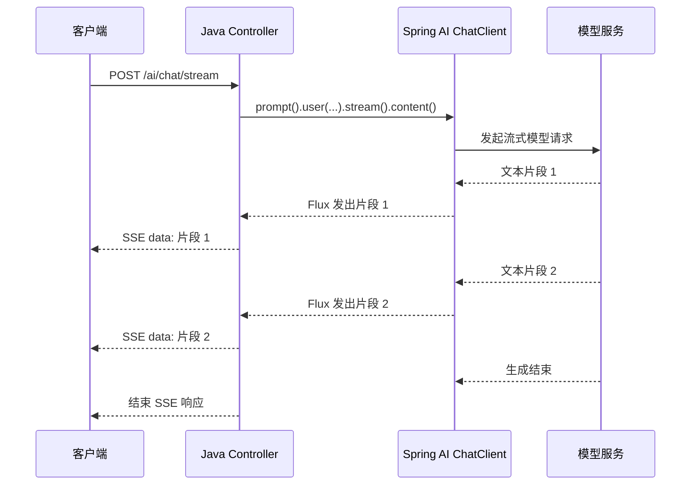

## 一、💡 一句话理解

> [!tip] 第 7 天核心结论
> SSE 流式响应就是：后端不要等大模型完整回答后再一次性返回，而是把模型生成的文本片段通过一个保持连接的 HTTP 响应，持续推送给客户端。

本篇对应 [[0-学习路线]] 第 7 天：`SSE 流式响应`。

今天完成后，你应该能做到：在现有 Spring Boot + Spring AI 项目中，接收一个问题，调用 `ChatClient.stream()`，通过 SSE 接口把模型回答逐段返回。

```text
客户端发送问题
    ↓
Java Controller 接收请求
    ↓
ChatClient.stream() 调用模型
    ↓
Flux<String> 持续产生文本片段
    ↓
HTTP SSE 持续推送给客户端
    ↓
客户端边接收边显示
```

本篇只完成“模型调用 → 流式返回”这条链路，不提前实现第 8 天的会话 ID、聊天记录和 Redis，也不加入重试、限流、降级、Tool Calling、RAG 或 Agent 工作流。

## 二、🧭 理论：SSE 是什么

### 2.1 SSE 的含义

SSE 是 `Server-Sent Events` 的缩写，中文可以理解为“服务器推送事件”。它建立在普通 HTTP 连接之上：客户端发起请求后，服务器保持连接，并在有新数据时不断写入事件。

SSE 的关键特点是：

| 特点 | 白话理解 |
| --- | --- |
| 基于 HTTP | 不需要另外设计一套通信协议 |
| 服务器到客户端 | 服务器可以连续推送，客户端不能通过同一条 SSE 连接反向推送 |
| 长连接 | 响应不会马上结束，而是持续发送多个事件 |
| 文本事件 | 数据通常使用 `text/event-stream` 和文本格式传输 |
| 适合实时展示 | 例如 AI 输出、进度通知、日志推送 |

可以把普通响应想成“等厨师把整道菜做好后一次端上来”，把 SSE 想成“菜做好一部分就先端一部分”。对于大模型回答，用户可以更早看到内容，等待感会明显降低。

这个类比只用于理解体验差异。真实实现中，模型生成的是文本片段，Spring AI 用 `Flux` 表示这些片段，Spring Web 的 SSE 编码器再把它们写成 SSE 事件。

### 2.2 普通响应和流式响应的区别

普通同步响应的流程是：

```text
发送请求
  → 等待模型生成完整回答
  → 后端拿到完整 String
  → 一次性返回 HTTP 响应
```

流式响应的流程是：

```text
发送请求
  → 模型生成第一个文本片段
  → 后端立即推送第一个片段
  → 模型继续生成
  → 后端继续推送后续片段
  → 模型结束，关闭响应
```

| 对比项 | 普通响应 | SSE 流式响应 |
| --- | --- | --- |
| 返回时机 | 完整结果生成后返回 | 生成片段后立即返回 |
| 后端结果 | `String` 或完整对象 | `Flux<String>` 或多个事件 |
| 用户体验 | 等待一段时间后看到全部内容 | 边生成边看到内容 |
| 解析方式 | 通常解析一个完整 JSON | 持续读取多个事件 |
| 适合场景 | 短回答、结构化接口、后台任务 | AI 聊天、生成长文本、实时进度 |

### 2.3 SSE 和 WebSocket 的区别

SSE 和 WebSocket 都可以做实时通信，但当前学习清单只要求先掌握 SSE。

| 对比项 | SSE | WebSocket |
| --- | --- | --- |
| 通信方向 | 服务器到客户端 | 客户端和服务器双向 |
| 基础协议 | HTTP | WebSocket 协议 |
| 数据形式 | 主要是文本事件 | 可传文本和二进制数据 |
| 使用复杂度 | 相对简单 | 通常需要管理更多连接状态 |
| AI 文本输出 | 很适合 | 也可以，但不是本篇重点 |

AI 聊天中，用户的问题仍然可以通过普通 HTTP 请求发送给后端；SSE 负责把模型回答从后端持续推回客户端。

> [!info] 官方事实
> MDN 将 SSE 描述为服务器向网页推送数据的机制，并明确指出它是单向连接。Spring Framework 的 `SseEmitter` 也用于按照 SSE 规范发送事件。本篇使用 Spring AI 返回的 `Flux`，由响应层直接输出 `text/event-stream`。

## 三、⚙️ 理论：它是怎么工作的

### 3.1 SSE 事件长什么样

SSE 响应不是把多段普通文本直接拼在一起，而是使用事件格式。最常见的字段是 `data`：

```text
data: 第一段文本

data: 第二段文本

data: 最后一段文本

```

每个事件通常以空行结束。客户端读到一个完整事件后，就可以把 `data` 内容追加到聊天窗口。

常见的 SSE 响应头是：

```http
Content-Type: text/event-stream
Cache-Control: no-cache
Connection: keep-alive
```

本篇的 Controller 使用：

```java
produces = MediaType.TEXT_EVENT_STREAM_VALUE
```

它对应的就是 `Content-Type: text/event-stream`。

### 3.2 `Flux<String>` 是什么

`Flux` 是 Reactor 提供的响应式数据流类型。这里先不把它理解成复杂的并发框架，只记住：`Flux<String>` 表示“未来会陆续产生多个 `String`”。

普通调用返回一个字符串：

```java
String answer = chatClient
        .prompt()
        .user("请解释 SSE")
        .call()
        .content();
```

流式调用返回一组会陆续产生的字符串：

```java
Flux<String> answerStream = chatClient
        .prompt()
        .user("请解释 SSE")
        .stream()
        .content();
```

两段代码的主要区别是：

| 调用 | 结果 | 含义 |
| --- | --- | --- |
| `.call().content()` | `String` | 等完整回答生成后取出文本 |
| `.stream().content()` | `Flux<String>` | 持续取得模型生成的文本片段 |

Spring AI 官方文档说明，`ChatClient` 同时支持同步和流式编程模型；流式调用的 `content()` 返回 `Flux<String>`。

### 3.3 从 `ChatClient` 到 SSE 的完整链路



这条链路中，每一层的职责不同：

1. 模型服务负责逐步生成回答。
2. Spring AI 把模型的流式结果转换成 `Flux`。
3. Controller 声明响应类型为 `text/event-stream`。
4. Spring Web 将 `Flux` 中的每个字符串编码并写入 HTTP 响应。
5. 客户端收到事件后，把文本片段追加到页面或终端。

### 3.4 为什么本篇使用响应式返回，而不是手动 `SseEmitter`

Spring MVC 提供了 `SseEmitter`，可以手动创建事件并调用 `send()`；Spring AI 的 `ChatClient.stream()` 则天然返回 `Flux`。

本篇选择直接返回 `Flux<String>`，原因是它和 Spring AI 的输出类型一致，代码更短，能够直接体现“模型片段 → SSE 事件”的关系。

`SseEmitter` 不是错误方案，但它需要自行管理：

- 后台任务如何订阅模型流；
- 每个片段如何调用 `send()`；
- 连接断开后如何处理；
- 完成和异常时如何关闭 emitter。

当前学习清单的目标是先跑通流式对话，因此先掌握 `ChatClient.stream()` + `Flux`。后续遇到需要手动控制事件名称、心跳或多个异步来源合并时，再学习 `SseEmitter` 或 `ServerSentEvent`。

## 四、🚀 实践：从准备到验证

### 4.1 前置准备

#### 4.1.1 沿用前几天的 Spring Boot 项目

本篇沿用 [[3.Spring AI ChatClient]] 中已经可以访问 `/test1` 的项目，不重新创建工程。

开始前确认：

- Java、Maven 和 Spring Boot 项目已经可以启动。
- `ChatClient.Builder` 可以被 Spring 注入。
- 模型 API Key 通过环境变量提供。
- 第 4 天的普通调用接口已经能够返回模型回答。

#### 4.1.2 添加响应式 Web 依赖

Spring AI 官方文档说明，流式 `ChatClient` 需要 Reactive stack。`pom.xml` 中确认存在以下依赖：

```xml
<dependency>
    <groupId>org.springframework.boot</groupId>
    <artifactId>spring-boot-starter-webflux</artifactId>
</dependency>
```

模型依赖继续沿用前几天的配置：

```xml
<dependency>
    <groupId>org.springframework.ai</groupId>
    <artifactId>spring-ai-starter-model-openai</artifactId>
</dependency>
```

如果项目已经存在 `spring-boot-starter-web`，先不要盲目同时修改多个 Web 组件。以当前项目的启动日志和 Spring Boot 配置为准，确保本次接口能够以响应式方式持续输出；实际项目中应统一 Web 技术栈，避免 MVC 和 WebFlux 配置互相影响。

#### 4.1.3 沿用模型配置和 API Key

沿用前几天的 `application.properties`：

```properties
spring.ai.openai.api-key=${DEEPSEEK_API_KEY}
spring.ai.openai.base-url=https://api.deepseek.com
spring.ai.openai.chat.model=deepseek-v4-flash
```

这里的模型名和地址必须以你当前使用的模型供应商文档及项目配置为准。真实 API Key 继续放在 IntelliJ IDEA 运行配置的环境变量中，不要写入 Java 源码、配置文件或 Git 仓库。

#### 4.1.4 启动项目

使用前几天相同的方式启动 `AiApplication`。如果项目端口仍为 `8080`，本篇验证地址就是：

```text
http://localhost:8080/ai/chat/stream
```

### 4.2 可以拿来干什么

#### 4.2.1 实现 AI 聊天窗口的逐字输出

用途：用户发送问题后，不必等待完整答案生成，前端可以在收到每个 SSE 事件时立即追加文本。

前置：Controller 中已经注入 `ChatClient`，并且项目已添加 `spring-boot-starter-webflux`。核心对象来源如下：

```java
private final ChatClient chatClient;

public AiController(ChatClient.Builder builder) {
    this.chatClient = builder.build();
}
```

核心流式调用：

```java
Flux<String> contentStream = chatClient
        .prompt()
        .system("你是面向 Java 后端开发者的学习助手，请使用简洁中文回答。")
        .user("请解释 SSE 流式响应。")
        .stream()
        .content();
```

输入是一个用户问题；处理过程是 `ChatClient` 调用模型并持续产生文本片段；输出是 `Flux<String>`，由 HTTP 层继续编码成 SSE 事件。

适用场景：AI 聊天、代码解释、长文本生成、文档总结和需要展示实时进度的接口。

#### 4.2.2 让后端统一控制返回协议

用途：后端不把模型供应商的原始流式格式直接暴露给前端，而是统一返回 SSE。将来更换模型供应商时，前端仍然只依赖自己的业务接口。

前置：Controller 方法需要声明 `text/event-stream`：

```java
@PostMapping(
        value = "/chat/stream",
        produces = MediaType.TEXT_EVENT_STREAM_VALUE
)
public Flux<String> chatStream(@RequestBody ChatRequest request) {
    return chatClient
            .prompt()
            .user(request.message())
            .stream()
            .content();
}
```

输入是业务请求对象，不是模型供应商的原始请求 JSON；输出是项目自己的 SSE 接口。这样可以把 Prompt 组装、供应商协议和前端展示协议隔离开。

#### 4.2.3 后续接入会话记录

用途：第 8～10 天可以在流式回答完成后，保存用户问题和完整回答，形成会话记录。

本篇只说明边界，不实现 Redis：当前 `Flux<String>` 中的片段需要先聚合成完整回答，才能保存一条完整记录。第 8 天学习会话 ID、聊天记录和 Redis 时，再设计会话表、缓存结构和保存时机。

```text
第 7 天：模型流 → SSE 返回
第 8 天：会话 ID → 聊天记录 → Redis
第 10 天：流式对话 + 会话记录的完整验收
```

不要在本篇中为了“看起来完整”而把 Redis、历史消息和重试逻辑混进来，否则会打乱学习清单的前后依赖。

### 4.3 完整实践：实现 `/ai/chat/stream`

#### 4.3.1 定义请求对象和流式接口

下面的代码解决一个完整问题：接收用户问题，调用模型，并通过 SSE 持续返回回答。

文件位置：

```text
src/main/java/com/afyke/ai/controller/AiController.java
```

如果项目中已经存在 `AiController`，请在原 Controller 中合并下面的字段、构造方法、请求对象和接口方法，不要再创建一个同名 Controller。

```java
package com.afyke.ai.controller;

import org.springframework.ai.chat.client.ChatClient;
import org.springframework.http.MediaType;
import org.springframework.web.bind.annotation.PostMapping;
import org.springframework.web.bind.annotation.RequestBody;
import org.springframework.web.bind.annotation.RequestMapping;
import org.springframework.web.bind.annotation.RestController;
import reactor.core.publisher.Flux;

@RestController
@RequestMapping("/ai")
public class AiController {

    private final ChatClient chatClient;

    public AiController(ChatClient.Builder builder) {
        this.chatClient = builder.build();
    }

    @PostMapping(
            value = "/chat/stream",
            produces = MediaType.TEXT_EVENT_STREAM_VALUE
    )
    public Flux<String> chatStream(@RequestBody ChatRequest request) {
        return chatClient
                .prompt()
                .system("你是面向 Java 后端开发者的学习助手，请使用简洁中文回答。")
                .user(request.message())
                .stream()
                .content();
    }

    public record ChatRequest(String message) {
    }
}
```

代码中的关键部分：

| 代码 | 作用 |
| --- | --- |
| `@RequestMapping("/ai")` | 给接口增加统一路径前缀 |
| `@RequestBody ChatRequest` | 接收客户端传来的问题 |
| `MediaType.TEXT_EVENT_STREAM_VALUE` | 声明响应使用 SSE 类型 |
| `.stream()` | 告诉 Spring AI 使用流式调用 |
| `.content()` | 取得 `Flux<String>` 文本片段 |
| `Flux<String>` | 让 Web 层可以持续输出多个结果 |

输入 JSON：

```json
{
  "message": "请用大白话解释 SSE 流式响应。"
}
```

处理过程：

```text
读取 request.message()
  → 组装 system message 和 user message
  → 调用 ChatClient.stream()
  → 取得 Flux<String>
  → Spring Web 按 SSE 事件持续写出
```

输出不是一个立即完成的普通 JSON，而是一串类似下面的事件：

```text
data: SSE 是服务器向客户端持续推送数据的机制。

data: 它适合 AI 聊天中的边生成边显示。

```

实际分片数量和每个分片的文字长度由模型服务和客户端实现决定，不能把一次分片固定理解成一个汉字或一个完整句子。

#### 4.3.2 启动项目

确认环境变量中存在真实 API Key 后启动：

```bash
./mvnw spring-boot:run
```

如果项目没有 Maven Wrapper，也可以使用 IntelliJ IDEA 启动 `AiApplication`。本篇沿用你前几天已经验证过的启动方式。

启动成功后，保持后端进程运行，再执行下面的请求。

#### 4.3.3 使用 `curl` 验证流式输出

在项目根目录执行：

```bash
curl -N \
  -X POST 'http://localhost:8080/ai/chat/stream' \
  -H 'Content-Type: application/json' \
  -d '{
    "message": "请用大白话解释 SSE 流式响应，并说明它和普通响应的区别。"
  }'
```

`-N` 的作用是关闭 `curl` 的输出缓冲，让终端尽量及时显示服务器推送的内容。不要只执行不带 `-N` 的请求后，再根据终端一次性打印的效果判断接口没有流式输出。

预期现象：终端会在模型生成过程中陆续出现多段 `data:` 内容，而不是等很久后只出现一整段结果。每次分片的边界不固定，这是正常现象。

#### 4.3.4 使用 HTTP Client 验证

如果你使用 IntelliJ IDEA 的 HTTP Client，可以在项目根目录的 `request.http` 中添加：

```http
### 第 7 天：SSE 流式聊天
POST http://localhost:8080/ai/chat/stream
Content-Type: application/json

{
  "message": "请解释 SSE 为什么适合 AI 聊天接口。"
}
```

点击请求左侧的运行按钮后，观察响应窗口是否持续收到事件。不同 IDE 版本对 SSE 的展示方式可能不同；如果 IDE 把响应集中显示，也可以使用上一节的 `curl -N` 复核。

#### 4.3.5 验收标准

第 7 天只需要完成以下验收：

- 项目能够启动。
- `POST /ai/chat/stream` 能接收问题。
- 接口返回 `text/event-stream` 类型。
- 模型回答能够分片返回。
- 客户端不需要等待完整回答就能看到前面的内容。
- 没有把 API Key 写入 Java 源码或提交到 Git。

今天暂不要求：

- 保存会话 ID。
- 把聊天记录写入 Redis。
- 支持多轮历史消息。
- 实现超时、重试、限流和降级。
- 接入 Tool Calling、RAG 或 Agent 工作流。

#### 4.3.6 常见报错排查

##### 4.3.6.1 `Flux` 找不到或无法返回流

检查 `pom.xml` 是否添加：

```xml
<dependency>
    <groupId>org.springframework.boot</groupId>
    <artifactId>spring-boot-starter-webflux</artifactId>
</dependency>
```

然后重新加载 Maven 依赖并重启项目。还要确认 Spring AI 版本和项目实际使用的 Spring Boot 版本匹配。

##### 4.3.6.2 接口返回后一次性出现全部文本

按顺序检查：

1. 代码是否误用了 `.call().content()`，而不是 `.stream().content()`。
2. Controller 返回值是否是 `Flux<String>`。
3. `@PostMapping` 是否声明了 `produces = MediaType.TEXT_EVENT_STREAM_VALUE`。
4. `curl` 是否使用了 `-N`。
5. 反向代理或网关是否开启了响应缓冲。

##### 4.3.6.3 返回 `401`、`403` 或模型调用失败

检查：

- 环境变量名是否与 `application.properties` 中的 `${DEEPSEEK_API_KEY}` 一致。
- IDEA 的运行配置是否真的加载了环境变量。
- API Key 是否有效，是否有余额或调用权限。
- `base-url`、模型名和模型供应商是否匹配。

不要把真实 API Key 直接粘贴到代码、日志或聊天记录中。

##### 4.3.6.4 返回 `415 Unsupported Media Type`

通常是请求头或请求体格式不正确。确认请求包含：

```http
Content-Type: application/json
```

并且请求体是合法 JSON：

```json
{
  "message": "你好"
}
```

##### 4.3.6.5 浏览器看不到流式效果

先用 `curl -N` 确认后端确实在分片输出。如果 `curl` 正常而浏览器没有效果，重点检查前端读取方式和代理缓冲。

另外，浏览器原生 `EventSource` 通常发起 GET 请求，不能像本篇的 POST 一样直接携带 JSON 请求体。真实聊天页面可以使用支持流式读取的 `fetch`，或者把接口设计成适合 `EventSource` 的 GET 形式；这属于前端接入问题，不改变后端 SSE 的核心原理。

## 五、📌 总结

- 快速回顾：SSE 是建立在 HTTP 上的服务器到客户端单向推送机制。
- 快速回顾：普通调用使用 `.call().content()` 返回 `String`，流式调用使用 `.stream().content()` 返回 `Flux<String>`。
- 快速回顾：Controller 需要声明 `MediaType.TEXT_EVENT_STREAM_VALUE`，让响应按 SSE 格式输出。
- 快速回顾：本篇只完成模型流式输出，不实现会话 ID、Redis、重试、限流和 Agent 工作流。
- 快速回顾：验证时使用 `curl -N`，观察文本是否在模型生成过程中陆续出现。

记忆句：**`stream()` 产生 `Flux`，`text/event-stream` 负责传输，客户端收到片段后立即展示。**

第 7 天之后的学习顺序：

```text
第 7 天：SSE 流式响应
  → 第 8 天：会话 ID、聊天记录、Redis
  → 第 9 天：超时、重试、限流、降级
  → 第 10 天：完成可运行聊天接口
```

官方资料：

- [Spring AI ChatClient API：Streaming Responses](https://docs.spring.io/spring-ai/reference/api/chatclient.html)
- [Spring AI Chat Model API](https://docs.spring.io/spring-ai/reference/api/chatmodel.html)
- [Spring Framework：Asynchronous Requests 与 SSE](https://docs.spring.io/spring-framework/reference/web/webmvc/mvc-ann-async.html)
- [MDN：Using server-sent events](https://developer.mozilla.org/en-US/docs/Web/API/Server-sent_events/Using_server-sent_events)
- [[0-学习路线]]
- [[3.Spring AI ChatClient]]
- [[4.Prompt、System Prompt、Prompt 模板]]
