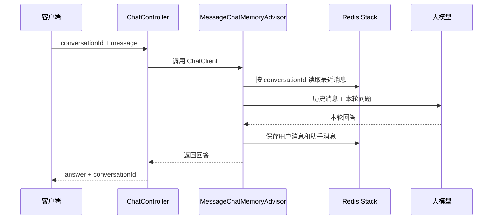

## 一、💡 一句话理解

> [!tip] 第 8 天核心结论
> 大模型本身不会记住上一轮对话。后端要用一个稳定的**会话 ID**把同一段对话归类，把消息保存为**聊天记录**，并在下一次提问前取回最近上下文；本篇用 Redis Stack 保存这份短期记忆。

本篇严格对应 [[0-学习路线]] 第 8 天：**会话 ID、聊天记录、Redis**。它接在 [[3.Spring AI ChatClient]] 和 [[7.SSE 流式响应]] 之后学习；今天先完成普通聊天接口的“记住上下文”能力，不提前学习 Tool Calling、RAG、限流或分布式锁。

完成后应能验证下面这段连续对话：

```text
第 1 次：我叫小王。
第 2 次：我叫什么？
结果：模型能回答“小王”。
```

## 二、🧭 理论：它是什么

### 2.1 会话 ID：给一段对话的“档案编号”

会话 ID（`conversationId`）是标识**一段对话**的字符串。例如：`user-42:550e8400-e29b-41d4-a716-446655440000`。

它不是用户 ID，也不应该是前端随便传来的固定值：一个用户可以有多段对话；不同用户绝不能共用同一个 ID。

| 名称 | 负责回答的问题 | 示例 |
| --- | --- | --- |
| 用户 ID | “是谁在使用系统？” | `user-42` |
| 会话 ID | “这是他的哪一段对话？” | `550e...000` |
| 实际存储键 | “Redis 到哪里找消息？” | `chat-memory:user-42:550e...000` |

Spring AI 的官方定义是：所有 `ChatMemory` 操作都按会话 ID 进行读、追加和删除。多用户系统应由服务器根据当前登录用户和会话生成 ID，避免串话。

### 2.2 聊天记录和聊天记忆不是一回事

| 概念 | 白话解释 | 本篇怎么处理 |
| --- | --- | --- |
| 聊天记录（Chat History） | 所有消息的完整留档，用于审计、翻页和展示 | 本篇不做长期归档；后续可写入 PostgreSQL。 |
| 聊天记忆（Chat Memory） | 本次请求真正放进 Prompt、让模型“看见”的上下文 | Redis 中保留一个最近消息窗口。 |

两者不能混为一谈。完整记录会越来越长，全部传给模型既增加 Token 成本，也会超过上下文窗口；而记忆只保留当前回答需要的最近几轮。

### 2.3 Redis 在这里做什么

Redis 是内存数据存储。这里不用它做“通用缓存”，而是把每个会话最近的消息存成可快速读取的短期记忆。

```text
客户端携带 conversationId 和本轮问题
          ↓
ChatClient 的 Memory Advisor 按 ID 读取 Redis 中的历史消息
          ↓
历史消息 + 本轮问题 一起交给模型
          ↓
模型回答后，用户消息和助手消息写回 Redis
```

> [!info] 官方事实
> Spring AI 的 `RedisChatMemoryRepository` 使用 Redis Stack 的 Redis Query Engine 与 RedisJSON，将消息存为 JSON 文档，可设置 TTL；它不是普通 Redis Server 的无额外模块方案。

### 2.4 为什么还要设置“最近 10 条”与 TTL

`MessageWindowChatMemory` 是一个滑动窗口：超过 `maxMessages` 的旧消息会被移出记忆，系统消息会保留。`maxMessages` 是上限，不一定恰好等于最终条数，因为 Spring AI 会按完整对话轮次裁剪，避免把一次问答截断。

本篇设置 `10` 条消息和 `24h` TTL：前者控制每次模型调用携带的上下文，后者让临时会话在 24 小时后自动过期。它们都是示例值，应根据业务对“记住多久”和 Token 成本的要求调整。

## 三、⚙️ 理论：它是怎么工作的

### 3.1 从请求到写回 Redis 的完整链路



### 3.2 Spring AI 中各组件的职责

| 组件 | 职责 | 不负责什么 |
| --- | --- | --- |
| `RedisChatMemoryRepository` | 在 Redis Stack 中读写消息 | 不决定保留多少消息。 |
| `MessageWindowChatMemory` | 按窗口策略决定哪些消息留在记忆里 | 不直接调用模型。 |
| `MessageChatMemoryAdvisor` | 调用前取历史、调用后存消息 | 不生成会话 ID。 |
| `ChatClient` | 组织 Prompt 并调用模型 | 不会自动猜测会话 ID。 |

每次带 Memory Advisor 调用 `ChatClient` 时，必须通过 `ChatMemory.CONVERSATION_ID` 传入会话 ID；省略它会在运行时抛出 `IllegalArgumentException`。

### 3.3 会话 ID 的安全边界

示例为了便于用 `curl` 验证，允许请求带入 `conversationId`。真实项目中必须改为：从 JWT 或登录态取得当前用户 ID，在服务端生成 `用户 ID + 新 UUID`，并且查询、继续和删除会话时都校验归属。

```text
错误：所有用户都使用 "default"
结果：A 的历史消息可能被送给 B 的模型请求 —— 串话与数据泄露。

正确：服务端生成 "当前用户 ID:随机会话 UUID"
结果：一人多会话，且用户之间隔离。
```

## 四、🚀 实践：从准备到验证

### 4.1 前置准备

#### 4.1.1 沿用已有模型项目

先完成 [[3.Spring AI ChatClient]] 的 Spring Boot 项目与模型 API Key 配置。本篇不重复配置模型。以下示例以 Spring AI 官方当前稳定版 `2.0.1` 文档为准；如果现有项目使用其他 Spring AI 大版本，应先以该版本的官方文档核对 starter 名称和配置项。

#### 4.1.2 启动 Redis Stack

`RedisChatMemoryRepository` 需要 Redis Stack 7.0+，不是只启动基础 Redis 镜像。开发机安装 Docker 后执行：

```bash
docker run -d --name ai-redis-stack -p 6379:6379 redis/redis-stack-server:latest
```

检查容器正在运行：

```bash
docker ps
```

预期能看到 `ai-redis-stack`，并且端口映射包含 `6379`。停止和重新启动它可分别使用 `docker stop ai-redis-stack`、`docker start ai-redis-stack`。

#### 4.1.3 在 `pom.xml` 增加 Redis 聊天记忆依赖

保留已有的模型 starter，另增加这一项：

```xml
<dependency>
    <groupId>org.springframework.ai</groupId>
    <artifactId>spring-ai-starter-model-chat-memory-repository-redis</artifactId>
</dependency>
```

它会带入官方实现所需的 Jedis 客户端。修改后在 IntelliJ IDEA 重新加载 Maven 依赖。

#### 4.1.4 配置 Redis 连接和记忆窗口

文件位置：`src/main/resources/application.properties`。不需要把密码写死；若 Redis 设置了密码，将它写为环境变量引用。

```properties
# Redis Stack 连接
spring.ai.chat.memory.repository.redis.host=localhost
spring.ai.chat.memory.repository.redis.port=6379
# spring.ai.chat.memory.repository.redis.password=${REDIS_PASSWORD}

# 会话记忆的 Redis 存储策略
spring.ai.chat.memory.repository.redis.key-prefix=chat-memory:
spring.ai.chat.memory.repository.redis.time-to-live=24h
spring.ai.chat.memory.repository.redis.initialize-schema=true
```

`initialize-schema=true` 会在启动时创建 Redis 搜索索引；生产环境应由部署流程统一管理这类结构变更，并视情况设为 `false`。

#### 4.1.5 注册 ChatMemory 和 ChatClient

这一步必须在调用聊天接口前完成：它把 Redis 记忆窗口注册给 `ChatClient`。文件位置：`src/main/java/com/afyke/ai/config/ChatMemoryConfig.java`。如果你的项目基础包名不是 `com.afyke.ai`，把 `package` 改成自己的基础包名。

```java
package com.afyke.ai.config;

import java.time.Duration;

import redis.clients.jedis.RedisClient;
import org.springframework.beans.factory.annotation.Value;
import org.springframework.ai.chat.client.ChatClient;
import org.springframework.ai.chat.client.advisor.MessageChatMemoryAdvisor;
import org.springframework.ai.chat.memory.ChatMemory;
import org.springframework.ai.chat.memory.MessageWindowChatMemory;
import org.springframework.ai.chat.memory.repository.redis.RedisChatMemoryRepository;
import org.springframework.context.annotation.Bean;
import org.springframework.context.annotation.Configuration;

@Configuration
public class ChatMemoryConfig {

    @Value("${spring.ai.chat.memory.repository.redis.host:localhost}")
    private String redisHost;

    @Value("${spring.ai.chat.memory.repository.redis.port:6379}")
    private int redisPort;

    @Value("${spring.ai.chat.memory.repository.redis.key-prefix:chat-memory:}")
    private String redisKeyPrefix;

    @Value("${spring.ai.chat.memory.repository.redis.time-to-live:24h}")
    private Duration redisTimeToLive;

    @Bean
    RedisClient redisClient() {
        return RedisClient.builder().hostAndPort(redisHost, redisPort).build();
    }

    @Bean
    RedisChatMemoryRepository redisChatMemoryRepository(RedisClient redisClient) {
        return RedisChatMemoryRepository.builder()
                .jedisClient(redisClient)
                .keyPrefix(redisKeyPrefix)
                .timeToLive(redisTimeToLive)
                .build();
    }

    @Bean
    ChatMemory chatMemory(RedisChatMemoryRepository repository) {
        return MessageWindowChatMemory.builder()
                .chatMemoryRepository(repository)
                .maxMessages(10)
                .build();
    }

    @Bean
    ChatClient chatClient(ChatClient.Builder builder, ChatMemory chatMemory) {
        return builder
                .defaultAdvisors(MessageChatMemoryAdvisor.builder(chatMemory).build())
                .build();
    }
}
```

这段配置先用 `@Value` 读取 `application.properties` 中的 Redis 地址、端口、键前缀和 TTL，再显式创建 `RedisClient` 与 `RedisChatMemoryRepository`；最后把仓库交给“最多保留 10 条消息”的 `ChatMemory`，并创建已注册 `MessageChatMemoryAdvisor` 的 `ChatClient`。

> [!warning] 为什么不能只注入 `RedisChatMemoryRepository`
> 自定义了 `ChatMemory` Bean 时，Redis 自动配置可能因“已有 ChatMemory”条件而不再创建 `RedisChatMemoryRepository`，于是出现“找不到 Bean”。此时像上例一样显式注册仓库即可，不能只依赖自动配置。

### 4.2 可以拿来干什么

#### 4.2.1 让模型记住刚刚说过的话

用途：用户分两次发送“我叫小王”“我叫什么”，第二次请求通过同一个会话 ID 取到第一次的记忆。

前置：`ChatClient` 已注册 `MessageChatMemoryAdvisor`，本次调用传入了 `ChatMemory.CONVERSATION_ID`。

```java
String answer = chatClient.prompt()
        .user("我叫什么？")
        .advisors(a -> a.param(ChatMemory.CONVERSATION_ID, conversationId))
        .call()
        .content();
```

输入是本轮问题与 `conversationId`；Advisor 自动补上历史消息；输出仍是本轮模型回答。不要手动把历史字符串拼进每一个 Prompt，这会让角色、顺序和窗口裁剪难以统一维护。

#### 4.2.2 给短期对话自动过期

用途：客服临时咨询、未登录体验等不需要永久保存的对话，可以在一段时间后由 Redis 自动清理。

前置：已配置 `spring.ai.chat.memory.repository.redis.time-to-live=24h`。24 小时内有存储的消息可用于记忆；过期后该会话不再有该部分上下文。

```properties
spring.ai.chat.memory.repository.redis.time-to-live=24h
```

TTL 不是数据合规策略的替代品。涉及用户隐私或审计时，还要明确完整聊天记录的存储地点、访问权限、删除流程和保留期限。

### 4.3 完整实践：带 Redis 记忆的聊天接口

目标：从注册 Redis 记忆到新增 `POST /api/chat` 接口，完整跑通连续对话。首次不传 `conversationId` 时，后端生成一个；之后客户端带回这个 ID，就能继续同一段对话。

#### 4.3.1 配置 ChatMemory 和 ChatClient

前面的 4.1.5 已经说明了为什么这一步必须先做；为保证本节可以从头独立完成，这里再次给出完整配置。文件位置：`src/main/java/com/afyke/ai/config/ChatMemoryConfig.java`。如果你的项目基础包名不是 `com.afyke.ai`，把 `package` 改成自己的基础包名。

```java
package com.afyke.ai.config;

import java.time.Duration;

import redis.clients.jedis.RedisClient;
import org.springframework.beans.factory.annotation.Value;
import org.springframework.ai.chat.client.ChatClient;
import org.springframework.ai.chat.client.advisor.MessageChatMemoryAdvisor;
import org.springframework.ai.chat.memory.ChatMemory;
import org.springframework.ai.chat.memory.MessageWindowChatMemory;
import org.springframework.ai.chat.memory.repository.redis.RedisChatMemoryRepository;
import org.springframework.context.annotation.Bean;
import org.springframework.context.annotation.Configuration;

@Configuration
public class ChatMemoryConfig {

    @Value("${spring.ai.chat.memory.repository.redis.host:localhost}")
    private String redisHost;

    @Value("${spring.ai.chat.memory.repository.redis.port:6379}")
    private int redisPort;

    @Value("${spring.ai.chat.memory.repository.redis.key-prefix:chat-memory:}")
    private String redisKeyPrefix;

    @Value("${spring.ai.chat.memory.repository.redis.time-to-live:24h}")
    private Duration redisTimeToLive;

    @Bean
    RedisClient redisClient() {
        return RedisClient.builder().hostAndPort(redisHost, redisPort).build();
    }

    @Bean
    RedisChatMemoryRepository redisChatMemoryRepository(RedisClient redisClient) {
        return RedisChatMemoryRepository.builder()
                .jedisClient(redisClient)
                .keyPrefix(redisKeyPrefix)
                .timeToLive(redisTimeToLive)
                .build();
    }

    @Bean
    ChatMemory chatMemory(RedisChatMemoryRepository repository) {
        return MessageWindowChatMemory.builder()
                .chatMemoryRepository(repository)
                .maxMessages(10)
                .build();
    }

    @Bean
    ChatClient chatClient(ChatClient.Builder builder, ChatMemory chatMemory) {
        return builder
                .defaultAdvisors(MessageChatMemoryAdvisor.builder(chatMemory).build())
                .build();
    }
}
```

这段代码把 Redis 记忆窗口注册给 `ChatClient`：调用前自动按会话 ID 取历史消息，调用后自动写回用户消息和模型回答。

#### 4.3.2 编写请求、响应与 Controller

文件位置：`src/main/java/com/afyke/ai/controller/ChatController.java`。

```java
package com.afyke.ai.controller;

// 校验 @RequestBody 中的字段规则。
import jakarta.validation.Valid;
// 声明字符串不能为空、不能只包含空格。
import jakarta.validation.constraints.NotBlank;
// 调用大模型的高级客户端。
import org.springframework.ai.chat.client.ChatClient;
// 读取 Spring AI 规定的会话 ID 参数名。
import org.springframework.ai.chat.memory.ChatMemory;
import org.springframework.http.HttpStatus;
import org.springframework.web.bind.annotation.PostMapping;
import org.springframework.web.bind.annotation.RequestBody;
import org.springframework.web.bind.annotation.RequestMapping;
import org.springframework.web.bind.annotation.ResponseStatus;
import org.springframework.web.bind.annotation.RestController;

import java.util.UUID;

// 声明这是 REST Controller，方法返回值会自动转成 JSON。
@RestController
// 为本类所有接口统一加上 /api/chat 路径前缀。
@RequestMapping("/api/chat")
public class ChatController {

    // 复用已注册聊天记忆 Advisor 的 ChatClient。
    private final ChatClient chatClient;

    // Spring 自动注入配置类创建的 ChatClient，无须手动 new。
    public ChatController(ChatClient chatClient) {
        this.chatClient = chatClient;
    }

    // 接收 POST /api/chat 请求。
    @PostMapping
    // 正常处理时返回 HTTP 200。
    @ResponseStatus(HttpStatus.OK)
    // @Valid 启用字段校验；@RequestBody 将请求 JSON 转为 ChatRequest。
    public ChatResponse chat(@Valid @RequestBody ChatRequest request) {
        // 先取得客户端带回的 ID；新旧两个变量分开，避免后续 Lambda 捕获一个被重新赋值的变量。
        String requestedConversationId = request.conversationId();

        // Lambda 中使用的局部变量必须是 final 或“只赋值一次”。
        final String conversationId;
        if (requestedConversationId == null || requestedConversationId.isBlank()) {
            // 新对话：生成随机 ID。实际项目应把 demo-user 替换为登录态中的用户 ID。
            conversationId = "demo-user:" + UUID.randomUUID();
        } else {
            // 继续已有对话：使用客户端带回的 ID。
            conversationId = requestedConversationId;
        }

        // 发起本轮模型调用；记忆 Advisor 会在调用前后自动处理 Redis 中的聊天记录。
        String answer = chatClient.prompt()
                // 放入用户本轮问题。
                .user(request.message())
                // 指明本轮属于哪个会话；缺少它，Advisor 无法读取或保存对应记忆。
                .advisors(a -> a.param(ChatMemory.CONVERSATION_ID, conversationId))
                // 执行同步模型调用。
                .call()
                // 从模型响应中取出纯文本回答。
                .content();

        // 把会话 ID 和回答一起返回；客户端必须保存 ID，下一次继续携带它。
        return new ChatResponse(conversationId, answer);
    }

    // 请求 JSON：conversationId 可省略（表示新建对话），message 必须非空。
    public record ChatRequest(String conversationId, @NotBlank String message) {
    }

    // 响应 JSON：返回本次会话 ID 和模型回答。
    public record ChatResponse(String conversationId, String answer) {
    }
}
```

输入 JSON 包含 `message` 和可选的 `conversationId`。首次请求生成 ID；每次调用都把 ID 交给 Advisor；返回 JSON 让客户端保存 ID。`@NotBlank` 防止空问题进入模型调用。若项目尚未有校验依赖，在 `pom.xml` 增加 `spring-boot-starter-validation`。

#### 4.3.3 启动并验证

先确认 Redis Stack 已运行，再从 IDEA 启动 Spring Boot 应用。打开新终端，第一次请求**不要**带会话 ID：

```bash
curl -X POST 'http://localhost:8080/api/chat' \
  -H 'Content-Type: application/json' \
  -d '{"message":"我叫小王，请记住。"}'
```

预期响应结构如下；其中 `conversationId` 每次新建会话都不同：

```json
{
  "conversationId": "demo-user:550e8400-e29b-41d4-a716-446655440000",
  "answer": "好的，我记住了，你叫小王。"
}
```

复制上一步的真实 `conversationId`，发起第二次请求：

```bash
curl -X POST 'http://localhost:8080/api/chat' \
  -H 'Content-Type: application/json' \
  -d '{"conversationId":"替换为上一步真实的 conversationId","message":"我叫什么？"}'
```

预期：`answer` 能识别“小王”。若换成一个全新的 `conversationId`，模型没有前一轮消息可用，不能期待它知道名字。

#### 4.3.4 常见报错排查

| 现象 | 常见原因 | 处理方式 |
| --- | --- | --- |
| 启动时连不上 Redis | Redis Stack 未运行、端口不是 `6379` | 执行 `docker ps`，核对容器和 `application.properties`。 |
| `RedisChatMemoryRepository` 找不到 Bean | 未添加 starter、Maven 未刷新，或自定义 `ChatMemory` 使自动配置退让 | 核对 4.1.3 的依赖；按 4.1.5 显式创建 `RedisClient` 与 `RedisChatMemoryRepository`。 |
| 提示缺少 `conversationId` | 调用中漏了 `.advisors(...)` 参数 | 传入 `ChatMemory.CONVERSATION_ID`，不要只在请求对象中保存它。 |
| 第二次回答不记得第一次 | 两次请求的 ID 不同、Redis 被清空或 TTL 已过 | 复制同一个真实 ID，检查 Redis 容器与 TTL。 |
| 模型没有正常回答 | 模型 API Key、模型地址或额度问题 | 回到 [[2.大模型 API、请求参数与响应结构]] 检查既有模型配置。 |

## 五、📌 总结

- 会话 ID 是同一段对话的隔离键；生产环境由服务端根据登录用户与会话生成并校验归属。
- 聊天记录是完整留档，聊天记忆是给模型的有限上下文；不要把两者混为一谈。
- Redis Stack + `RedisChatMemoryRepository` 负责消息存储，`MessageWindowChatMemory` 负责最近消息窗口。
- `MessageChatMemoryAdvisor` 在调用前取历史、调用后保存消息；每次必须传 `ChatMemory.CONVERSATION_ID`。
- 今天的验收标准是：两次请求使用同一个 ID 时，模型能记住第一轮信息。

> [!tip] 一句话复述
> 用“用户隔离的会话 ID”从 Redis 取回最近聊天记录，再随本轮问题交给模型，模型才会表现得像在持续对话。

## 六、🔗 官方资料

- [Spring AI：Chat Memory](https://docs.spring.io/spring-ai/reference/api/chat-memory.html)（本篇的概念顺序、`RedisChatMemoryRepository`、`MessageWindowChatMemory` 与 `MessageChatMemoryAdvisor`）
- [Spring AI：ChatClient API](https://docs.spring.io/spring-ai/reference/api/chatclient.html)
- [Redis：客户端 API](https://redis.io/docs/latest/develop/clients/)
- [Redis：Strings 数据类型](https://redis.io/docs/latest/develop/data-types/strings/)
