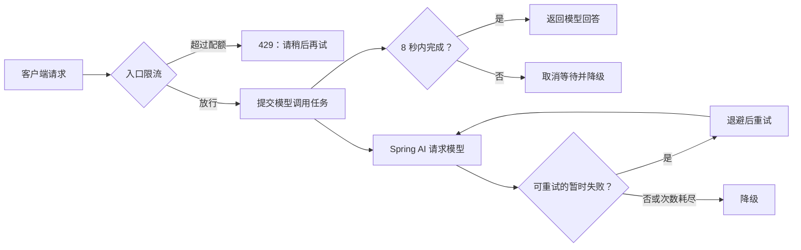

## 一、💡 一句话理解

> [!tip] 第 9 天核心结论
> 调用大模型和调用任何不稳定的远程服务一样：**超时**负责不无限等，**重试**负责给暂时性失败一次恢复机会，**限流**负责不让请求压垮自己和上游，**降级**负责失败时仍返回诚实、可用的结果。

本篇严格对应 [[0-学习路线]] 第 9 天：**超时、重试、限流、降级**。它建立在 [[3.Spring AI ChatClient]]、[[7.SSE 流式响应]] 与 [[8.会话 ID、聊天记录、Redis]] 的普通聊天接口之上。

今天的验收标准是：模型服务慢、暂时失败或请求过多时，接口会在可控时间内结束，且不会把错误伪装成模型答案。本文不提前展开熔断、分布式限流、Tool Calling 或 RAG。

## 二、🧭 理论：它是什么

### 2.1 四个保护措施分别解决什么问题

| 措施 | 白话解释 | 触发场景 | 本篇的结果 |
| --- | --- | --- | --- |
| 超时（Timeout） | 等太久就停止等待 | 上游模型迟迟未返回 | 在 8 秒内结束并返回降级提示。 |
| 重试（Retry） | 针对“可能马上恢复”的错误再试 | 网络瞬断、`429`、部分 `5xx` | Spring AI 按退避间隔再次请求。 |
| 限流（Rate limiting） | 给入口设置通行速度上限 | 同一用户短时间连续提问 | 立即返回 `429 Too Many Requests`。 |
| 降级（Fallback） | 主路径失败时换成安全的次要结果 | 重试后仍失败、发生超时 | 不编造回答，提示稍后重试。 |

它们的关系不是“谁替代谁”。可以把聊天接口想成医院分诊：限流先控制进门人数；进入后设定最长等待时间；偶发故障才重试；最终无法完成时，给用户明确的替代说明。

### 2.2 哪些错误能重试，哪些绝不能重试

重试的前提是：**同一请求再次发送，成功概率会提高，且重复调用没有额外副作用**。聊天生成是只读调用，通常满足第二点；后续创建售后工单等写操作则不能盲目重试，必须先做幂等控制。

| 错误类型 | 是否应重试 | 原因 |
| --- | --- | --- |
| 网络连接失败、连接重置 | 可以，次数有限 | 多数是暂时性故障。 |
| `429 Too Many Requests` | 可以，必须退避 | 立即连发只会让限额更严重。 |
| `500`、`502`、`503`、`504` | 可以，次数有限 | 可能是上游暂时不可用。 |
| `400 Bad Request`、参数校验失败 | 不可以 | 请求本身有问题，重试仍会失败。 |
| `401`、`403` | 不可以 | API Key 或权限错误，必须人工修复。 |
| 已执行的写操作 | 默认不可以 | 重复请求可能产生重复订单或工单。 |

### 2.3 退避：为什么不能连续按同一频率重试

退避（backoff）指每次重试前等待一段时间。指数退避会逐渐拉长等待间隔，例如 1 秒、2 秒、4 秒。这样可以给上游恢复时间，也避免大量失败请求在同一时刻再次涌入。

> [!warning] 重试不是“提高成功率的免费按钮”
> 重试会增加请求数、延迟和 Token 成本。聊天接口建议只保留少量尝试；真正的参数错误、权限错误和内容安全拒绝应直接返回，不能重试。

### 2.4 降级的底线：可用，但不假装知道

本篇的降级结果是固定提示，例如“AI 服务暂时繁忙，请稍后再试”，而不是编一段看似合理的业务答案。

对于企业售后 Agent，这一点尤其重要：不知道订单状态时，宁可请用户稍后重试，也不能猜测“订单已发货”。固定提示还应保留请求 ID，便于用户反馈和后台排查。

## 三、⚙️ 理论：它是怎么工作的

### 3.1 一次聊天请求的保护顺序



入口限流最靠前，因为被拒绝的请求不应该再占用线程、模型配额或 Token。重试位于模型客户端内部；超时保护的是本系统等待远程结果的时长；降级是主流程最终不能完成时的出口。

### 3.2 Spring AI 自带的模型重试

可以把 `spring.ai.retry` 理解为：**模型服务暂时出问题时，Spring AI 帮你自动再试，不需要你在 Java 代码里手写循环。**

例如配置了 `spring.ai.retry.max-attempts=3`：用户只发起 **1 次**聊天请求。第一次调用模型失败后，Spring AI 会根据配置继续尝试；整次用户请求最多调用模型 3 次。

```text
用户发 1 次 /api/chat
       ↓
第 1 次调用模型：503，模型服务暂时不可用
       ↓ 等待 1 秒
第 2 次调用模型：仍失败
       ↓ 等待 2 秒
第 3 次调用模型：成功，返回回答
```

`指数退避`（exponential backoff）就是“每次重试前多等一会儿”，例如等待 1 秒、2 秒、4 秒；它避免失败请求立即连发，把本来很忙的模型服务压得更忙。

| 模型返回情况 | 是否重试 | 为什么 |
| --- | --- | --- |
| `429`：模型服务说“太忙了” | 可以 | 稍等后可能恢复。 |
| `503`：模型服务暂时不可用 | 可以 | 常见的短暂服务故障。 |
| `400`：请求参数不对 | 不可以 | 原请求有问题，再发一次还是错。 |
| `401`：API Key 错误 | 不可以 | 必须修复配置，重试没有意义。 |

本篇已经通过 `application.properties` 配置这件事，因此业务代码只需要正常调用 `ChatClient`，不要再写一层“三次循环重试”。否则最坏情况下会变成：Spring AI 内部最多尝试 3 次，外部循环又执行 3 次，即一次用户请求可能发出 **3 × 3 = 9 次**模型调用，既变慢，又额外消耗 Token。

### 3.3 超时不等于取消远程服务

`Future#get(8, TimeUnit.SECONDS)` 可以直接理解成：**我们的聊天接口最多等模型 8 秒。**

```text
用户请求 /api/chat
        ↓
Java 向模型服务发出 HTTP 请求
        ↓
8 秒内拿到回答 → 正常返回
8 秒还没拿到回答 → 本接口返回“超时，请稍后再试”
```

超时时调用 `cancel(true)`，相当于告诉 Java 本地任务：“不要再等了，尽量停止。”它首先保证的是**我们的接口不会一直卡住**。

但 HTTP 请求可能已经到达模型提供方：

```text
我们的 Java 服务 ──请求已发出──> 模型服务仍在生成答案
        │
        └─ 等满 8 秒后停止等待，并向用户返回超时
```

因此，`cancel(true)` 不一定能让远端模型立即停止计算；远端是否真正取消，取决于底层 HTTP 客户端和模型提供方是否支持取消。这也意味着，模型提供方可能仍然记录这次请求。

完整系统还应设置两类更底层的 HTTP 超时：

| 超时类型 | 白话解释 | 示例 |
| --- | --- | --- |
| 连接超时 | 多久还连不上模型服务器，就放弃 | 网络异常、模型地址不可达。 |
| 响应超时 | 已经连上了，但多久没收到模型响应，就放弃 | 模型服务很慢或卡住。 |

Spring Framework 的 `WebClient` 官方文档支持配置这两类超时。可以这样理解三层保护：连接与响应超时负责尽早终止底层 HTTP 请求；`Future#get(8, ...)` 是最外层总兜底，确保不管哪个环节慢，用户最多等待 8 秒。本文先使用最外层兜底，便于第 9 天理解和验证。

远端未必真正停止会带来这些影响：

| 影响 | 在聊天接口中的表现 |
| --- | --- |
| 费用与配额 | 模型可能继续生成，仍可能消耗 Token 或请求额度；具体以模型提供方的计费规则为准。 |
| 用户体验 | 用户已收到“超时”，但模型稍后可能已经生成完；这份答案不会再返回给用户。 |
| 重复调用 | 用户或系统再次请求，可能产生两次模型调用。聊天场景通常只是增加成本。 |
| 写操作风险 | 后续创建工单、退款等写操作若直接重试，可能重复执行；必须使用幂等键并先查询确认。 |
| 排查难度 | 本地记录为超时，远端可能记录为已收到或已完成；需要请求 ID、耗时和日志协助排查。 |

> [!warning] 当前聊天示例的直接风险
> 对只读聊天问答，最直接的影响是浪费 Token 和用户重复提问，不会直接产生重复业务数据。但进入 Tool Calling 后，任何会写入订单、工单或库存的操作都不能因为“本地超时”就盲目重试。

### 3.4 限流粒度：为什么不能只按 IP

限流键就是“按谁来计数”。本篇示例从请求头读取 `X-User-Id`，例如：

```http
X-User-Id: user-1001
```

它表示“`user-1001` 这个用户一分钟只能请求 5 次”。但这只适合本地学习，因为客户端能随意伪造请求头：

```http
X-User-Id: user-1001
X-User-Id: user-1002
X-User-Id: admin
```

真实项目应从 JWT 或登录态读取已经过服务端校验的用户 ID；未登录场景再结合 IP。不要把客户端自己填写的 `X-User-Id` 当作真实身份。

本篇的计数保存在当前 Java 应用内存中，因此叫作**单实例、内存固定窗口限流**：

```text
同一用户在 1 分钟内请求 6 次
        ↓
前 5 次放行，进入 ChatController
        ↓
第 6 次返回 HTTP 429：请求过于频繁
```

它的局限也很直观：

| 场景 | 会发生什么 | 原因 |
| --- | --- | --- |
| 应用重启 | 计数立刻归零 | 数据只在内存里。 |
| 部署两台应用 | 每台各记各的次数 | 用户可能向两台机器各请求 5 次，实际发出 10 次。 |
| 用户不断改 `X-User-Id` | 可绕过学习示例 | 该请求头不是可信身份。 |

`429 Too Many Requests` 就是 HTTP 状态码，意思是“请求太多，请稍后再试”。本篇的内存实现只用于理解限流入口和 `429` 语义；生产环境通常把计数放入 Redis，或由网关统一限流，让所有应用服务器使用同一份计数。

## 四、🚀 实践：从准备到验证

### 4.1 前置准备

#### 4.1.1 沿用现有项目和模型配置

沿用 [[3.Spring AI ChatClient]] 中的 Spring Boot 项目、`spring-ai-starter-model-openai`、DeepSeek OpenAI 兼容地址及 `DEEPSEEK_API_KEY` 环境变量。本篇不新增模型账号，也不把 API Key 写进代码。

示例以路线已使用的 Spring AI `2.0.1` 为准。开始前确认普通的 `POST /api/chat` 已能返回回答；若没有，先完成第 3 天内容。

#### 4.1.2 配置 Spring AI 的重试策略

文件位置：`src/main/resources/application.properties`。保留已有模型配置，追加以下内容：

```properties
# 最多尝试 3 次；仅对明确列出的暂时性状态码重试
spring.ai.retry.max-attempts=3
# 第一次重试前等待 1 秒，后续等待时间按 2 倍增长，最长不超过 4 秒
spring.ai.retry.backoff.initial-interval=1s
spring.ai.retry.backoff.multiplier=2
spring.ai.retry.backoff.max-interval=4s
# 4xx 默认不重试，下面只单独放行 429
spring.ai.retry.on-client-errors=false
# 模型限额或服务端暂时故障，才允许重试
spring.ai.retry.on-http-codes=429,500,502,503,504
# 请求参数、认证或权限错误必须直接暴露，不能靠重试掩盖
spring.ai.retry.exclude-on-http-codes=400,401,403
```

这里的 `429` 表示模型提供方限额，不是稍后示例中我们自己接口返回的 `429`。两者状态码相同，但位置不同：前者在调用上游模型时发生，后者在用户进入本服务时发生。

#### 4.1.3 保留现有依赖

完整示例只使用 Spring Boot、Spring AI 和 JDK 并发工具，不需要新增限流框架。`pom.xml` 至少应保留已有的 Web 与 Spring AI 依赖：

```xml
<dependency>
    <groupId>org.springframework.boot</groupId>
    <artifactId>spring-boot-starter-web</artifactId>
</dependency>
<dependency>
    <groupId>org.springframework.ai</groupId>
    <artifactId>spring-ai-starter-model-openai</artifactId>
</dependency>
```

若项目同时保留第 7 天的 `spring-boot-starter-webflux` 用于 SSE，可以继续保留；本篇的普通 `POST` 接口使用 Spring MVC 的 `OncePerRequestFilter`。

### 4.2 可以拿来干什么

#### 4.2.1 让暂时性的模型故障自动恢复

用途：模型提供方短暂返回 `503` 时，Spring AI 根据 `application.properties` 退避并再次尝试；调用方不需要在每个 Controller 手写循环。

前置：已完成 `4.1.2` 的 `spring.ai.retry` 配置。业务代码仍是普通的 `ChatClient` 调用：

```java
String answer = chatClient.prompt()
        .user(message)
        .call()
        .content();
```

输入是用户问题；Spring AI 在需要时按配置处理模型请求重试；最终输出是回答，或在不可恢复时抛出异常给下面的降级分支处理。不要捕获所有异常后无条件重试。

#### 4.2.2 避免单个慢请求长期占住资源

用途：当模型一直不返回时，聊天接口在 8 秒后结束等待，把资源还给系统；同时限制“正在调用模型”的任务数量。

前置：先理解 `ExecutorService`。它是 Java 自带的**线程池管理器**接口，可以理解为“任务调度主管”：业务代码把任务交给它，它安排线程池中的工作线程执行。

```text
Controller：提交“调用模型”任务
        ↓
ExecutorService：安排一个 AI 工作线程执行
        ↓
Future<String>：返回一张结果回执，之后可等待结果或尝试取消
```

在本篇完整代码中，`ExecutorService aiExecutor` 就是专门执行模型调用的 AI 线程池；`executor.submit(...)` 是“提交任务”，不是立即在当前 Web 请求线程中直接调用模型。若想系统学习线程、线程池和 `Future`，可阅读 [[Java线程、线程池与Future]]。

下面的核心逻辑会在完整示例中出现：

```java
// 把可能阻塞的模型调用交给 AI 线程池，立即取得可跟踪结果的 Future 回执。
Future<String> task = executor.submit(() -> chatClient.prompt().user(message).call().content());
// 当前 Web 请求线程最多等待 8 秒；任务完成就取得模型回答。
String answer = task.get(8, TimeUnit.SECONDS);
```

先理解为什么这里会出现线程。用户请求 `/api/chat` 后，Spring MVC 会分配一个 **Web 请求线程** 来执行 Controller；而 `ChatClient.call()` 是阻塞调用，模型未回答时，执行它的线程就会一直等待。

```text
没有线程池：
用户请求 → Web 请求线程 → ChatClient.call() → 一直等模型回答

本篇示例：
用户请求 → Web 请求线程 → 提交任务 → AI 线程池中的工作线程调用模型
                         ↓
                  最多等待 8 秒结果
```

`executor.submit(...)` 的作用是把真正的模型调用交给专门的 **AI 线程池**。示例只创建 8 个工作线程，因此最多同时有 8 个模型调用在执行，慢请求不会无限创建新线程。

`task.get(8, TimeUnit.SECONDS)` 的作用是“最多等 8 秒”。这里的 Web 请求线程仍会等待，**但最多只等待 8 秒，并不是完全不占用 Web 请求线程**。8 秒内正常回答就返回模型结果；超时会抛出 `TimeoutException`，代码取消本地任务并返回降级结果，避免无限等待。

> [!tip] 两个措施分别解决什么
> AI 线程池负责限制“同时有多少个模型调用正在执行”；`get(8, ...)` 负责限制“单个用户请求最多等待多久”。两者一起才是本篇的资源保护。

#### 4.2.3 保护接口和模型配额

用途：同一用户一分钟最多发送 5 次聊天请求。第 6 次直接返回 `429`，不会再调用模型。

前置：请求带学习用的 `X-User-Id` 请求头；完整示例中的过滤器只拦截 `/api/chat`。

```text
前 5 次：进入 ChatController，可能调用模型
第 6 次：HTTP 429 + {"code":"RATE_LIMITED", ...}
```

这能避免明显的误操作或简单脚本耗尽模型配额。生产环境不要把这个内存实现当作多实例限流方案。

### 4.3 完整实践：受保护的聊天接口

目标：实现 `POST /api/chat`。同一 `X-User-Id` 在一分钟内可请求 5 次；模型暂时性错误由 Spring AI 重试；最终失败或超过 8 秒时，返回明确的降级内容。

#### 4.3.1 配置执行模型调用的线程池

文件位置：`src/main/java/com/afyke/ai/config/AiExecutorConfig.java`。如果项目基础包不是 `com.afyke.ai`，改成自己的包名。

```java
package com.afyke.ai.config;

import org.springframework.context.annotation.Bean;
import org.springframework.context.annotation.Configuration;

import java.util.concurrent.ExecutorService;
import java.util.concurrent.Executors;

// 告诉 Spring：这个类负责声明配置 Bean，应用启动时会读取它。
@Configuration
public class AiExecutorConfig {

    // 注册名为 aiExecutor 的线程池 Bean；Spring 关闭时自动调用 shutdown()，不再接收新任务。
    @Bean(destroyMethod = "shutdown")
    ExecutorService aiExecutor() {
        // ChatClient.call() 是阻塞调用。这里最多同时运行 8 个模型调用任务。
        // 超过 8 个的任务会先在该工厂默认的等待队列中排队；本篇用于学习，生产应改为有界队列。
        return Executors.newFixedThreadPool(8);
    }
}
```

输入是 Spring 创建的 Bean；处理过程是限制同时执行的阻塞模型任务最多为 8 个；输出是供聊天服务注入的线程池。真实生产环境应结合机器规格、连接池与监控调整这个数值，不能无限创建线程。

#### 4.3.2 编写单机固定窗口限流器和过滤器

文件位置：`src/main/java/com/afyke/ai/ratelimit/FixedWindowRateLimiter.java`。

```java
package com.afyke.ai.ratelimit;

import org.springframework.stereotype.Component;

import java.util.concurrent.ConcurrentHashMap;
import java.util.concurrent.atomic.AtomicInteger;

// 交给 Spring 管理为单例组件；Filter 会注入并复用这一份限流计数器。
@Component
public class FixedWindowRateLimiter {

    // 一个用户在一个 60 秒固定窗口内最多可通过 5 次请求。
    private static final int LIMIT_PER_MINUTE = 5;
    private static final long WINDOW_MILLIS = 60_000L;

    // key 是用户标识，value 保存“窗口从何时开始”和“本窗口已用了几次”。
    // ConcurrentHashMap 允许多个 HTTP 请求线程同时访问不同用户的计数。
    private final ConcurrentHashMap<String, Counter> counters = new ConcurrentHashMap<>();

    public boolean allow(String key) {
        long now = System.currentTimeMillis();
        // compute 让同一用户键的“创建窗口 / 增加计数”成为一次原子更新。
        Counter counter = counters.compute(key, (ignored, old) -> {
            if (old == null || now - old.windowStartedAt() >= WINDOW_MILLIS) {
                // 没有旧窗口或窗口已过期：从本次请求开始新的计数。
                return new Counter(now, new AtomicInteger(1));
            }
            // 仍在当前窗口：记录这一次访问。
            old.used().incrementAndGet();
            return old;
        });
        // 第 1 至第 5 次允许；第 6 次及以后拒绝。
        return counter.used().get() <= LIMIT_PER_MINUTE;
    }

    // windowStartedAt 用于判断 60 秒是否结束；AtomicInteger 避免并发 ++ 时丢失计数。
    private record Counter(long windowStartedAt, AtomicInteger used) {
    }
}
```

文件位置：`src/main/java/com/afyke/ai/ratelimit/AiRateLimitFilter.java`。

```java
package com.afyke.ai.ratelimit;

import jakarta.servlet.FilterChain;
import jakarta.servlet.ServletException;
import jakarta.servlet.http.HttpServletRequest;
import jakarta.servlet.http.HttpServletResponse;
import org.springframework.http.HttpStatus;
import org.springframework.stereotype.Component;
import org.springframework.web.filter.OncePerRequestFilter;

import java.io.IOException;

// OncePerRequestFilter 保证一次 HTTP 请求只执行一次这段限流逻辑。
@Component
public class AiRateLimitFilter extends OncePerRequestFilter {

    // Spring 会自动注入上面注册的单例限流器。
    private final FixedWindowRateLimiter rateLimiter;

    public AiRateLimitFilter(FixedWindowRateLimiter rateLimiter) {
        this.rateLimiter = rateLimiter;
    }

    @Override
    protected boolean shouldNotFilter(HttpServletRequest request) {
        // request.getRequestURI() 是请求路径；只保护 /api/chat，不影响健康检查和其他业务接口。
        return !"/api/chat".equals(request.getRequestURI());
    }

    @Override
    protected void doFilterInternal(HttpServletRequest request, HttpServletResponse response,
                                    FilterChain filterChain) throws ServletException, IOException {
        // 学习示例从请求头读取；真实系统必须改为从 JWT / 登录态取得可信用户 ID。
        String userId = request.getHeader("X-User-Id");
        // 没有用户标识的请求共用 anonymous 配额，避免匿名请求完全不受限制。
        String limitKey = (userId == null || userId.isBlank()) ? "anonymous" : userId;

        if (!rateLimiter.allow(limitKey)) {
            // 被拒绝的请求不进入 Controller，因此不会消耗模型调用配额。
            response.setStatus(HttpStatus.TOO_MANY_REQUESTS.value());
            // 明确按 JSON 返回，让前端可以识别 code 并提示用户稍后重试。
            response.setContentType("application/json;charset=UTF-8");
            response.getWriter().write("{\"code\":\"RATE_LIMITED\",\"message\":\"请求过于频繁，请 1 分钟后再试\"}");
            return;
        }
        // 限流通过后才交给后续过滤器与 Controller。
        filterChain.doFilter(request, response);
    }
}
```

限流器的输入是用户键，输出是“允许/拒绝”；过滤器在拒绝时直接写入 `429` JSON，放行才进入 Controller。固定窗口边界可能产生短暂突发，这是该简单算法的特性；此处的目标是学习边界与验证方式。

#### 4.3.3 编写有超时和降级的聊天服务

文件位置：`src/main/java/com/afyke/ai/service/AiChatService.java`。

```java
package com.afyke.ai.service;

import org.springframework.ai.chat.client.ChatClient;
import org.springframework.stereotype.Service;

import java.util.concurrent.ExecutionException;
import java.util.concurrent.ExecutorService;
import java.util.concurrent.Future;
import java.util.concurrent.TimeUnit;
import java.util.concurrent.TimeoutException;

// Spring 扫描到 @Service 后会创建一个聊天服务对象，Controller 可通过构造方法注入它。
@Service
public class AiChatService {

    // 这是本系统等待模型结果的总上限，不是模型提供方一定停止计算的保证。
    private static final long TIMEOUT_SECONDS = 8;

    // 封装 Spring AI 的模型调用入口。
    private final ChatClient chatClient;
    // 来自 AiExecutorConfig 的 Bean，专门执行可能阻塞的模型调用任务。
    private final ExecutorService aiExecutor;

    public AiChatService(ChatClient.Builder builder, ExecutorService aiExecutor) {
        // Spring AI 自动提供 Builder；build() 后得到可发起 Prompt 的 ChatClient。
        this.chatClient = builder.build();
        this.aiExecutor = aiExecutor;
    }

    public ChatResult chat(String message) {
        // 把“调用模型”作为任务提交给 AI 线程池；submit 立即返回 Future 回执。
        // Spring AI 会在 call() 内部先按 application.properties 的规则重试暂时性错误。
        Future<String> task = aiExecutor.submit(() -> chatClient.prompt()
                // 创建本次调用的 Prompt，并把用户输入放入 user 消息。
                .user(message)
                // 同步向模型提供方发送请求；执行这行的是 AI 工作线程，可能会阻塞。
                .call()
                // 从模型响应中取出最终文本内容，作为 Future<String> 的结果。
                .content());

        try {
            // 当前 Web 请求线程在此最多等待 8 秒；成功时取得 String 并标记 degraded=false。
            // 它仍会等待，但不会无限等待；线程池负责限制同时执行的模型调用数量。
            return new ChatResult(task.get(TIMEOUT_SECONDS, TimeUnit.SECONDS), false, null);
        }
        catch (TimeoutException exception) {
            // 超时表示本地等不到结果。true 表示尝试中断正在执行此任务的 AI 工作线程。
            // 中断本地任务只是尽力而为；远程 HTTP 请求是否取消还取决于底层客户端。
            task.cancel(true);
            return fallback("AI 响应超时，请稍后再试", "TIMEOUT");
        }
        catch (InterruptedException exception) {
            // 恢复中断标记，避免吞掉上层的取消信号。
            Thread.currentThread().interrupt();
            task.cancel(true);
            return fallback("请求已被中断，请稍后再试", "INTERRUPTED");
        }
        catch (ExecutionException exception) {
            // 任务内部抛出的异常会被 Future 包装成 ExecutionException。
            // 包含 Spring AI 重试耗尽后的异常；不把失败伪装成正常模型回答。
            return fallback("AI 服务暂时不可用，请稍后再试", "UPSTREAM_UNAVAILABLE");
        }
    }

    private ChatResult fallback(String answer, String code) {
        // degraded=true 让 Controller 能区分“模型回答”和“保护机制返回的提示”。
        return new ChatResult(answer, true, code);
    }

    // 统一封装服务层输出：answer 是给用户的文本，code 是机器可识别的降级原因。
    public record ChatResult(String answer, boolean degraded, String code) {
    }
}
```

`ChatClient` 的异常会先经过 `4.1.2` 的 Spring AI 重试策略；若重试后仍失败，任务以 `ExecutionException` 结束并走降级。超时分支只返回安全提示，不声称模型已经成功回答。

#### 4.3.4 编写请求、响应和 Controller

文件位置：`src/main/java/com/afyke/ai/controller/ChatController.java`。

```java
package com.afyke.ai.controller;

import com.afyke.ai.service.AiChatService;
import org.springframework.http.HttpStatus;
import org.springframework.http.ResponseEntity;
import org.springframework.web.bind.annotation.PostMapping;
import org.springframework.web.bind.annotation.RequestBody;
import org.springframework.web.bind.annotation.RequestMapping;
import org.springframework.web.bind.annotation.RestController;

// 声明为 REST Controller：方法返回的 Java 对象会自动序列化成 JSON。
@RestController
// 这个类中所有接口都以 /api 开头。
@RequestMapping("/api")
public class ChatController {

    // Spring 注入聊天服务；Controller 只负责 HTTP 输入输出，不直接处理线程和模型异常。
    private final AiChatService aiChatService;

    public ChatController(AiChatService aiChatService) {
        this.aiChatService = aiChatService;
    }

    // 最终接口路径是 POST /api/chat；请求体 JSON 会自动转换为 ChatRequest。
    @PostMapping("/chat")
    public ResponseEntity<ChatResponse> chat(@RequestBody ChatRequest request) {
        // 参数错误应直接返回 400，不进入模型调用，更不应触发重试。
        if (request.message() == null || request.message().isBlank()) {
            return ResponseEntity.badRequest().build();
        }

        // 服务层已经把正常、超时和上游失败统一封装为 ChatResult。
        AiChatService.ChatResult result = aiChatService.chat(request.message());
        // 只把 Controller 对外需要的字段组装成响应对象，不暴露内部 Future 或异常对象。
        ChatResponse response = new ChatResponse(result.answer(), result.degraded(), result.code());
        // 降级不是正常回答：使用 503 让调用方能识别并决定是否稍后重试。
        return ResponseEntity.status(result.degraded() ? HttpStatus.SERVICE_UNAVAILABLE : HttpStatus.OK)
                .body(response);
    }

    // 接收请求 JSON，例如：{ "message": "你好" }。
    public record ChatRequest(String message) {
    }

    // 返回响应 JSON：answer 是文本，degraded 标记是否降级，code 说明降级原因。
    public record ChatResponse(String answer, boolean degraded, String code) {
    }
}
```

输入是 `message`；正常输出为 `200` 和模型回答；模型超时或最终失败输出为 `503`、`degraded: true` 和固定提示。`429` 由前面的过滤器返回，Controller 不会被执行。

#### 4.3.5 启动并验证

在 IntelliJ IDEA 启动 Spring Boot 主类，或在项目根目录运行：

```bash
./mvnw spring-boot:run
```

先发一条正常请求：

```bash
curl -i -X POST 'http://localhost:8080/api/chat' \
  -H 'Content-Type: application/json' \
  -H 'X-User-Id: user-1001' \
  -d '{"message":"用一句话解释 Java 中的接口"}'
```

正常时预期为 `200 OK`：

```json
{"answer":"……","degraded":false,"code":null}
```

再在一分钟内用同一个 `X-User-Id` 连续请求 6 次。前 5 次可以进入模型调用；第 6 次预期为：

```text
HTTP/1.1 429
{"code":"RATE_LIMITED","message":"请求过于频繁，请 1 分钟后再试"}
```

要观察降级，可暂时把 `TIMEOUT_SECONDS` 改为 `1`，向模型发送一次请求；若模型未在 1 秒内完成，预期为：

```text
HTTP/1.1 503
{"answer":"AI 响应超时，请稍后再试","degraded":true,"code":"TIMEOUT"}
```

验证结束后把超时恢复为 `8`。不要为了测试而关闭重试配置；应通过日志确认 `429`、`5xx` 或网络问题才触发重试。

#### 4.3.6 常见问题

##### 4.3.6.1 连续第 6 次请求没有返回 429

检查 6 次请求是否带了相同的 `X-User-Id`，并确认 URL 是 `/api/chat`。不同用户键各自拥有独立窗口；超过一分钟也会自动开始新窗口。

##### 4.3.6.2 所有请求一开始就返回降级

先检查 [[3.Spring AI ChatClient]] 中的模型 `base-url`、模型名称、`DEEPSEEK_API_KEY` 与账户可用性。`401`、`403`、`400` 被本篇明确排除在重试之外，修复配置后再发起新请求。

##### 4.3.6.3 超时后模型提供方仍有请求记录

这是 `Future.cancel(true)` 只能尝试停止本地等待的表现，不代表远程 HTTP 一定已终止。应继续在实际使用的 Spring AI 模型 HTTP 客户端上配置连接和响应超时；生产系统还应记录请求 ID、耗时、重试次数和降级次数。

## 五、📌 总结

- **超时**是等待上限：先保证服务不会无限卡住，再讨论体验优化。
- **重试**只针对暂时性、可安全重放的失败；`400`、`401`、`403` 不应重试。
- **限流**应尽可能靠近入口，超额请求直接 `429`，不消耗模型配额。
- **降级**必须诚实：返回固定提示和状态码，绝不伪造业务或模型结论。
- 本篇的内存限流适合单机学习；多实例与网关场景是后续工程化内容，不在第 9 天展开。

一句话复述：**先限流挡住洪峰，调用时设置超时；遇到短暂故障有限重试，最终失败就诚实降级。**

## 六、🔗 官方资料

- [Spring AI：OpenAI Chat 的重试属性](https://docs.spring.io/spring-ai/reference/1.0/api/chat/openai-chat.html)
- [Spring AI：ChatClient API](https://docs.spring.io/spring-ai/reference/api/chatclient.html)
- [Spring Framework：WebClient 超时配置](https://docs.spring.io/spring-framework/reference/web/webflux-webclient/client-builder.html)
- [[0-学习路线]]
