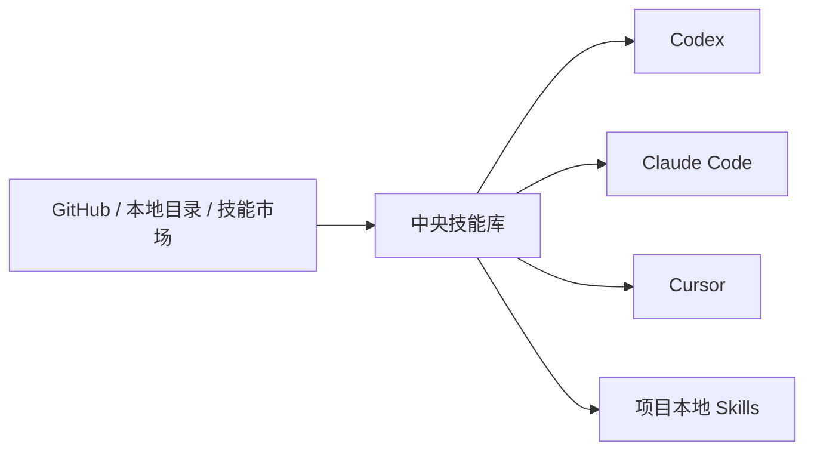

## 一、💡 一句话理解

> [!tip] 核心结论
> Skills Manager 是一个统一管理 AI Agent Skills 的工具：先把 Skills 放进中央技能库，再按需部署给 Codex、Claude Code、Cursor 等 Agent，并通过 Preset、版本备份和 CLI 进行批量管理。

它解决的不是“如何编写一个 Skill”，而是“Skill 安装在哪里、哪些 Agent 能看到、如何更新、如何备份和跨设备同步”。

## 二、🧭 理论：它是什么

### 2.1 Skill 是什么

Skill 可以理解为给 AI 编程助手使用的一组可复用工作说明。通常一个 Skill 是一个目录，里面至少有一个 `SKILL.md`，还可以包含脚本、参考资料和资源文件。

例如，一个代码审查 Skill 可以告诉 Agent：

- 先检查哪些文件；
- 按什么顺序分析问题；
- 使用哪些命令验证；
- 最终应该输出什么格式。

Skill 不是普通的聊天提示词，也不是独立运行的应用。它更像是 Agent 在特定任务中的“工作流程说明书”。

### 2.2 Skills Manager 是什么

Skills Manager 是一个本地优先的 Skill 管理器。官方 README 将它定位为“统一管理所有 AI 编码工具的 Skills”。它可以从 Git 仓库、本地目录、压缩包或 `skills.sh` 市场安装 Skill，并统一放入 `~/.skills-manager` 中管理。

它主要管理四类对象：

| 对象 / 概念 | 白话理解                      | 截图中的位置                                                   | 作用                         |
| ------- | ------------------------- | -------------------------------------------------------- | -------------------------- |
| 中央技能库   | Skill 的总仓库                | 左侧「技能库」                                                  | 保存 Skill 的来源、内容、标签和版本信息    |
| Agent   | 使用 Skill 的 AI 工具          | 左侧「全局工作区」下的「Codex」                                       | 代表当前要管理的具体工具               |
| 部署      | 从中央技能库向某个 Agent 建立 Skill 部署关系 | 进入「Codex」后，点击 Skill 卡片右下角的同步图标；顶部路径显示为 `~/.codex/skills` | 让 Skills Manager 能跟踪这个 Skill 在目标 Agent 中的部署状态 |
| 已同步     | Skill 已被 Skills Manager 纳管，并与当前 Agent 同步 | Skill 卡片底部显示绿色「已同步」 | 表示中央技能库与当前 Agent 的 Skill 目录已经建立同步关系 |
| 仅本地     | Skill 已在当前 Agent 的本地目录，但还没有纳入中央技能库 | Skill 卡片底部显示「仅本地」 | 表示 Codex 仍然可以读取，但 Skills Manager 尚未统一管理它 |
| Preset  | 一组 Skill 的组合              | 左侧「Preset」区域                                             | 用于按项目或工作流批量启用和停用           |
这里的“同步”不是“让 Codex 看见 Skill”的开关，也不是把 Skill 上传到云端，而是让中央技能库中的 Skill 与 Agent 的本地 Skills 目录建立管理关系。截图中显示的 `~/.codex/skills` 本身就是 Codex 的读取目录，所以其中标记为「仅本地」的 Skill 也已经可以被 Codex 看到。

| 状态 | Codex 能否读取 | 实际含义 |
|---|---|---|
| 已同步 | 可以 | Skill 位于当前 Agent 的实际 Skills 目录，并且已经被中央技能库纳管；例如图中的 `~/.codex/skills` |
| 仅本地 | 可以 | Skill 已经位于当前 Agent 的本地 Skills 目录，所以 Codex 可以读取；只是它还没有被纳入 Skills Manager 的中央技能库 |

因此，两者的关系是：

```text
仅本地 = Codex 已经能看到，但 Skills Manager 还没有纳管
已同步 = Codex 能看到，并且中央技能库与 Agent 目录已经关联
```

“仅本地”的 Skill 不需要为了让 Codex 读取而重新安装。如果希望 Skills Manager 统一跟踪它的来源、标签和部署状态，可以再执行导入或纳管操作；完成后才需要根据界面提示建立同步关系。

> [!warning] “已同步”不等于“已备份”
> 「已同步」只说明 Skill 已经和当前 Agent 建立了部署关系，不代表它已经上传到 GitHub，也不代表已经创建远程备份。是否备份，要看你有没有在左侧「备份」页面配置 GitHub 或其他 Git 远程仓库。

| 能力 | 具体含义 | 是否由「已同步」自动保证 |
|---|---|---|
| 管理 | Skills Manager 可以记录 Skill 的来源、标签、Preset 归属和 Agent 部署状态 | 是，前提是 Skill 已经被纳入中央技能库 |
| 更新 | 对 Git 来源的 Skill 检查远端是否有新版本，并按需要更新；纯本地 Skill 只能重新导入或手动维护 | 否，通常需要手动检查或更新 |
| 备份 | 将技能库内容和管理信息提交到 GitHub 私有仓库或其他 Git 远程仓库 | 否，必须在「备份」页面单独配置 |


### 2.3 它和直接复制 Skill 有什么区别

直接复制 Skill 的方式通常是：下载目录，然后手动复制到 `~/.agents/skills` 或某个项目的 `.agents/skills`。

这种方式简单，但容易出现以下问题：

- 不知道 Skill 来自哪个仓库；
- 多个 Agent 之间出现不同版本；
- 忘记 Skill 已经部署到哪些工具；
- 更新时需要手动找目录；
- 删除前没有备份；
- 同一个 Skill 在不同位置重复保存。

Skills Manager 将“保存 Skill”和“部署 Skill”分开，因此可以统一查看来源、状态、标签和目标 Agent。

## 三、⚙️ 理论：它是怎么工作的

### 3.1 中央技能库与 Agent 部署

Skills Manager 的基本流程是：



安装 Skill 时，默认只是把它加入中央技能库，不一定立即部署给某个 Agent。之后需要在 Agent 工作区中选择目标工具，或者使用 CLI 的 `skills deploy` 命令完成部署。

因此要区分两个状态：

| 状态 | 含义 |
|---|---|
| 已安装到中央库 | Skills Manager 已经保存了这个 Skill |
| 已部署到 Agent | 某个 Agent 的 Skills 目录中已经有它，Agent 可以读取 |

### 3.2 全局工作区、项目工作区和关联工作区

#### 3.2.1 全局工作区

全局工作区管理某个 Agent 在用户目录下的 Skills。适合所有项目都可能使用的通用 Skill，例如代码审查、Git 操作或文档生成。

#### 3.2.2 项目工作区

项目工作区管理某个项目内部的 Skills。它适合团队协作或项目专用规则，例如某个项目的接口规范、发布流程和测试约定。

#### 3.2.3 关联工作区

关联工作区可以把任意目录指定为 Skills 根目录。它适合已经存在一个独立 Skills 仓库，或者 Agent 使用了非默认目录的情况。

### 3.3 Preset 是什么

Preset 是一组命名后的 Skill 集合。

例如可以建立：

| Preset | 适合包含的 Skill |
|---|---|
| 日常开发 | 代码实现、测试、Git、代码审查 |
| 文档整理 | Markdown、PDF、架构图、知识沉淀 |
| Java 后端 | 系统分析、接口开发、数据库、编译验证 |

切换 Preset 时，Skills Manager 会根据当前 Agent 范围批量激活或停用对应 Skill。Preset 是组织和部署工具，不是实时同步机制；官方说明中明确指出，应用 Preset 属于一次性复制或部署。

### 3.4 桌面应用和 CLI 的关系

桌面应用适合人工操作，CLI 适合终端、脚本和 Agent 自动调用。

两者共用：

- 同一个 SQLite 数据库；
- 同一个中央技能库；
- 同一套同步引擎；
- 同一个仓库锁。

因此，用 CLI 修改 Skill 或部署状态后，桌面应用通常会自动刷新。如果桌面应用处于休眠状态，可能需要手动刷新一次。

## 四、🚀 实践：从准备到验证

### 4.1 前置准备

#### 4.1.1 选择安装方式

日常使用建议安装桌面应用：

1. 打开项目的 [Releases 页面](https://github.com/xingkongliang/skills-manager/releases)。
2. macOS 下载匹配 CPU 架构的 `.dmg`。
3. 将应用拖入 `Applications`。
4. 启动应用并完成首次扫描。

macOS 也可以使用 Homebrew：

```bash
# 使用 Homebrew 安装桌面应用
brew install --cask skills-manager
```

如果主要让 Codex、脚本或自动化流程管理 Skill，可以只安装独立 CLI。

先检查 Mac 架构：

```bash
# arm64 表示 Apple Silicon；x86_64 表示 Intel
uname -m
```

然后下载对应的 `skills-manager-cli-*` 文件，并放入 PATH：

```bash
# 下面以 Apple Silicon CLI 为例
# 如果文件名或下载目录不同，请替换为实际路径
chmod +x ~/Downloads/skills-manager-cli-macOS-arm64
mkdir -p ~/.local/bin
cp ~/Downloads/skills-manager-cli-macOS-arm64 ~/.local/bin/skills-manager-cli

# 将 ~/.local/bin 加入当前 Shell 的 PATH
export PATH="$HOME/.local/bin:$PATH"
```

如果希望永久生效，可以把 PATH 配置写入 `~/.zshrc`，然后重新打开终端。

> [!info] 桌面版已经包含 CLI
> 启动桌面应用后，应用会将匹配版本的 CLI 放到 `~/.skills-manager/bin/skills-manager-cli`。因此，一般不需要为了使用桌面版再额外下载 CLI。

#### 4.1.2 认识主要目录

常见目录的作用如下：

| 路径 | 作用 |
|---|---|
| `~/.skills-manager` | Skills Manager 的中央库、数据库、缓存和日志 |
| `~/.skills-manager/bin/skills-manager-cli` | 桌面应用发布的 CLI 副本 |
| `~/.agents/skills` | 多种 Agent 共同使用的 Skills 根目录之一 |
| `~/.codex/skills` | 某些 Codex 环境使用的全局 Skills 目录 |
| 项目下的 `.agents/skills` | 项目级 Skills 目录 |

实际使用哪个 Agent 目录，以 Skills Manager 的“设置”页面和当前 Agent 的官方约定为准，不要只根据目录名称猜测。

### 4.2 可以拿来干什么

#### 4.2.1 安装 GitHub 上的 Skill

在桌面应用中，可以通过“安装 Skills”选择 Git 仓库地址；也可以通过 CLI 安装：

```bash
# 从本地目录安装
skills-manager-cli skills install ./my-skill

# 从 GitHub 指定目录安装
skills-manager-cli skills install \
  https://github.com/foo/bar/tree/main/skills/baz

# 使用 owner/repo@skill-name 简写
skills-manager-cli skills install \
  vercel-labs/agent-skills@react-best-practices
```

安装完成后，Skill 会进入中央技能库，但不会自动部署到所有 Agent。这样可以避免安装一个 Skill 后，所有工具同时触发它。

#### 4.2.2 查看 Skill 并部署给 Codex

先查看中央库中的 Skill：

```bash
# 列出所有已纳管的 Skill
skills-manager-cli skills list

# 查看某个 Skill 的详细信息
skills-manager-cli skills show react-best-practices
```

再将它部署给 Codex：

```bash
# 将 Skill 部署给 Codex
skills-manager-cli skills deploy \
  react-best-practices \
  --agent codex

# 检查部署状态
skills-manager-cli skills status react-best-practices
```

如果还要部署给 Claude Code，可以追加一个 Agent：

```bash
skills-manager-cli skills deploy \
  react-best-practices \
  --agent codex \
  --agent claude_code
```

#### 4.2.3 管理项目级 Skills

项目级 Skill 只对当前项目生效，适合放置项目规范和项目专属流程。

在桌面应用中：

1. 打开“项目工作区”。
2. 选择项目目录。
3. 点击“添加 Skills”。
4. 选择 Skill 和目标 Agent。
5. 确认部署状态。

在 CLI 中，可以在项目目录或指定 Skills 仓库下操作。需要直接针对外部 Skills 仓库时，可以使用 `--skills-root`：

```bash
# 直接查看某个外部 Skills 仓库
skills-manager-cli \
  --skills-root /path/to/my-skills \
  skills list

# 使用 JSON 输出，方便脚本或 Agent 解析
skills-manager-cli \
  --skills-root /path/to/my-skills \
  --json \
  skills list
```

#### 4.2.4 批量启用和停用

当 Skill 较多时，可以使用标签或 Preset 进行批量管理。

推荐按用途建立 Preset，而不是把所有 Skill 都全局启用。Skill 越多，Agent 在匹配任务时需要考虑的说明越多，项目无关的 Skill 可能会增加触发干扰。

桌面应用中的典型操作是：

1. 创建一个 Preset。
2. 将相关 Skills 加入 Preset。
3. 进入目标 Agent 或项目工作区。
4. 部署 Preset。
5. 根据当前任务切换 Preset。

#### 4.2.5 检查远端更新和纳管已有 Skill

如果某个 Skill 原本已经手动放在 Agent 目录中，可以先预览纳管结果：

```bash
# 检查所有 Git 来源的 Skill 是否有更新
skills-manager-cli skills check --all

# 更新所有可更新的 Skill
skills-manager-cli skills update --all

# 预览把已有 Claude Code Skills 纳入中央库的结果
skills-manager-cli skills adopt ~/.claude/skills --dry-run
```

`--dry-run` 只预览，不真正写入，适合第一次操作或批量变更前确认影响范围。

#### 4.2.6 让 Codex 直接管理 Skills

Skills Manager 提供一个名为 `manage-skills` 的 Skill。启用后，Codex、Claude Code、Cursor 等 Agent 可以通过 Skills Manager 的 CLI 进行安装、部署和查询，而不是绕过中央库直接修改 Agent 目录。

桌面应用中可以在 Dashboard 里选择允许管理 Skills 的 Agent，应用会自动部署 `manage-skills`。

也可以按官方 README 的方式安装：

```bash
npx skills add xingkongliang/skills-manager
```

启用后，可以对 Codex 这样描述：

```text
查看当前 Skills Manager 中可用的 Skills，找出适合代码审查的技能，先说明来源和部署目标，再安装到 Codex。
```

第一次让 Agent 管理 Skill 时，建议要求它先列出将要执行的操作，并优先使用预览选项。

#### 4.2.7 备份和多设备同步

如果需要在多台电脑之间同步，可以使用“备份”页面：

1. 打开“备份”页面。
2. 使用 GitHub 登录，或填写自己的 Git 远程仓库。
3. 选择恢复已有备份，或创建新的备份。
4. 在其他设备登录同一个远程仓库。
5. 根据提示选择恢复或合并。

备份位置有两种：

- 使用 GitHub 登录时，应用默认创建私有仓库 `skills-manager-backup`，可以在自己的 GitHub 仓库列表中查看。
- 使用高级配置时，备份会进入你在「设置 → Git 同步配置」中填写的 Git 远程仓库，可以是 GitHub、GitLab、Gitea 或自建 Git 服务。

如果你从来没有打开「备份」页面完成连接，那么当前 Skill 只保存在本机的 `~/.skills-manager` 和 Agent 的本地 Skills 目录中，并没有远程备份。

官方说明中，备份内容包括 Skill 文件、标签、Preset 和 Agent 的开关状态；API Key、令牌、代理配置等机密信息不会上传。

### 4.3 完整实践：把一个 GitHub Skill 部署给 Codex

#### 4.3.1 目标

完成下面的完整流程：

```text
GitHub Skill
    ↓
安装到 Skills Manager 中央库
    ↓
查看来源和内容
    ↓
部署给 Codex
    ↓
检查 Codex 是否已经能看到
```

#### 4.3.2 使用桌面应用完成

1. 启动 Skills Manager。
2. 进入“安装 Skills”。
3. 选择 GitHub 仓库或技能市场。
4. 搜索并安装目标 Skill。
5. 打开“全局工作区”。
6. 选择 `Codex`。
7. 在 Skill 卡片上点击 Codex Agent 图标，或使用“添加 Skills”进行部署。
8. 打开 Skill 的 `SKILL.md`，检查其用途、触发条件和脚本。
9. 重启 Codex 或新建会话。
10. 在 Codex 中提出一个与 Skill 描述匹配的任务，确认它能够被正确调用。

#### 4.3.3 使用 CLI 完成

下面的命令假设 `skills-manager-cli` 已经在 PATH 中：

```bash
# 1. 查看当前中央技能库
skills-manager-cli skills list

# 2. 安装一个示例 Skill
skills-manager-cli skills install \
  vercel-labs/agent-skills@react-best-practices

# 3. 查看安装结果和来源
skills-manager-cli skills show react-best-practices

# 4. 部署给 Codex
skills-manager-cli skills deploy \
  react-best-practices \
  --agent codex

# 5. 检查部署状态
skills-manager-cli skills status react-best-practices

# 6. 查看全部 Agent 状态
skills-manager-cli agents
```

#### 4.3.4 预期结果

成功时应该能确认三件事：

1. `skills list` 能看到这个 Skill。
2. `skills show` 能看到 Skill 来源和内容信息。
3. `skills status` 显示它已经部署给 `codex`。

如果 Codex 没有立即显示新 Skill：

1. 关闭并重新打开 Codex，或新建一个任务。
2. 确认部署目标确实是 `codex`。
3. 确认 Skill 目录中存在 `SKILL.md`。
4. 在 Skills Manager 中刷新 Agent 状态。

#### 4.3.5 安全检查

安装第三方 Skill 前，至少检查：

- `SKILL.md` 是否要求读取不相关的敏感文件；
- 是否包含会执行删除、上传或修改系统配置的脚本；
- 是否要求 API Key、Token 或 SSH 私钥；
- 是否把任务内容发送到不明确的外部服务；
- 来源仓库是否可信，最近是否有异常提交。

Skill 本质上是 Agent 可读取的说明和可选脚本。不要因为它出现在技能市场，就默认它一定安全。

## 五、🛠️ 常见问题与排查

### 5.1 安装了 Skill，但 Codex 看不到

最常见的原因是“只安装到了中央库，没有部署给 Codex”。

依次检查：

```bash
# 检查中央库中是否存在
skills-manager-cli skills list

# 检查详细状态
skills-manager-cli skills status <skill-name>

# 重新部署给 Codex
skills-manager-cli skills deploy <skill-name> --agent codex
```

完成后新建 Codex 会话，因为当前会话的 Skills 列表可能已经在启动时加载完成。

### 5.2 桌面应用和 CLI 的状态不一致

桌面应用和 CLI 共用数据库和仓库锁。通常 CLI 执行完成后，桌面应用会通过文件监听刷新。

如果界面没有更新：

1. 手动刷新桌面应用。
2. 确认 CLI 和桌面应用使用的是同一个用户目录。
3. 检查 `~/.skills-manager` 是否被移动或替换。
4. 不要让两个进程同时执行互相冲突的删除、恢复或同步操作。

### 5.3 不确定某个命令会改什么

优先使用帮助和预览：

```bash
# 查看命令帮助
skills-manager-cli skills --help
skills-manager-cli presets --help

# 批量操作前先预览
skills-manager-cli skills adopt ~/.claude/skills --dry-run
```

官方说明中，破坏性命令支持 `--dry-run`，`remove` 还要求显式提供 `--yes`。

### 5.4 macOS 无法打开应用

优先从官方 Releases 页面重新下载较新的签名版本。项目 README 说明，从 v1.29.0 起发布版本经过 Apple Developer ID 签名和公证。

如果仍然无法打开：

1. 确认下载的架构与 Mac 匹配；
2. 确认文件来自官方仓库的 Releases 页面；
3. 在“系统设置 → 隐私与安全性”中查看是否有阻止提示；
4. 不要运行来源不明的破解包或被修改的应用。

### 5.5 误删或误更新了 Skill

如果已配置 Git 备份，进入“备份”页面查看快照并恢复。

以后进行批量删除或更新前，建议：

1. 先执行 `--dry-run`；
2. 先创建一次备份快照；
3. 一次只处理一组 Skill；
4. 操作后检查 Agent 的部署状态。

## 六、📌 总结

- Skills Manager 的核心不是写 Skill，而是统一管理 Skill 的来源、内容、部署和版本。
- “安装到中央库”和“部署给 Agent”是两件事，Skill 安装后不一定自动被 Codex 使用。
- 全局工作区适合通用 Skill，项目工作区适合项目专用 Skill，Preset 适合批量切换工作流。
- 桌面版适合人工管理，CLI 适合终端、脚本和 Agent 自动化；两者共享同一套数据。
- 批量变更前先使用 `--dry-run`，重要 Skill 再配置 GitHub 私有仓库备份。

一句话记忆：

> 中央库负责保存，Agent 工作区负责使用，Preset 负责组合，CLI 负责自动化，Git 备份负责找回。

## 七、📚 官方资料

- [Skills Manager 中文 README](https://github.com/xingkongliang/skills-manager/blob/main/README.zh-CN.md)
- [Skills Manager 更新日志](https://github.com/xingkongliang/skills-manager/blob/main/CHANGELOG-zh.md)
- [Skills Manager Releases](https://github.com/xingkongliang/skills-manager/releases)
- [Skills Manager 官方网站](https://skillsmanager.dev/)
