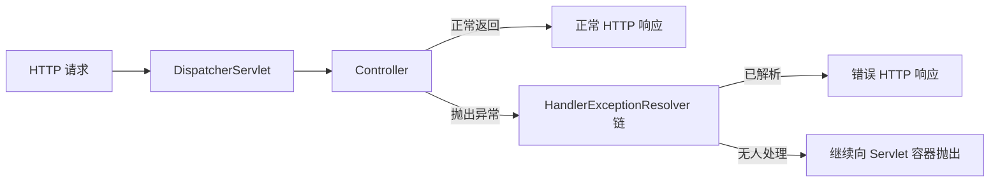

## 一、💡 一句话理解

> [!tip] 核心结论
> Spring MVC 的异常处理，本质上是：请求处理过程中抛出异常后，`DispatcherServlet` 不急着把异常交给服务器，而是依次询问一组 `HandlerExceptionResolver`：“谁能把这个异常转换成正常的 HTTP 响应？”

业务开发中通常不直接操作解析器，而是使用 `@ExceptionHandler` 和 `@RestControllerAdvice`，把异常统一转换成明确的状态码和稳定的错误 JSON。

---

## 二、🧭 理论：它是什么

### 2.1 为什么需要统一异常处理

假设“按编号查询图书”时没有找到数据，最直接的写法是在每个 Controller 里自己判断：

```java
if (book == null) {
    return ResponseEntity.status(404).body(...);
}
```

这样做能运行，但业务一多就会出现三个问题：

- 每个接口都重复拼错误响应。
- 同一种错误可能返回不同的状态码、字段和文案。
- Controller 同时承担业务流程和错误格式化，职责混在一起。

统一异常处理把这两件事拆开：

1. 业务代码只负责发现问题并抛出有含义的异常。
2. 异常处理器负责把异常翻译成 HTTP 状态码和响应体。

这里的“翻译”非常关键：Java 异常是服务端内部语言，HTTP 状态码和 JSON 才是客户端能理解的语言。

### 2.2 需要区分的三个对象

| 对象 | 白话理解 | 真实职责 |
| --- | --- | --- |
| Java 异常 | 业务执行失败的信号 | 携带异常类型、消息和调用栈 |
| 异常处理器 | 翻译员 | 决定由谁处理异常，以及如何生成响应 |
| HTTP 错误响应 | 给客户端的结果 | 包含状态码、响应头和响应体 |

> [!info] 不要把“记录日志”和“返回错误响应”混为一谈
> 日志给开发、运维人员看；错误响应给客户端看。响应中不应直接暴露堆栈、SQL、服务器路径等内部细节。

### 2.3 常用注解分别做什么

| 注解                      | 作用范围                                    | 常见用途                                             |
| ----------------------- | --------------------------------------- | ------------------------------------------------ |
| `@ExceptionHandler`     | 当前 Controller，或所在 Advice 覆盖的 Controller | 声明某个方法处理哪些异常                                     |
| `@ControllerAdvice`     | 默认覆盖所有 Controller                       | 全局处理异常；返回值可以是视图                                  |
| `@RestControllerAdvice` | 默认覆盖所有 Controller                       | 等于 `@ControllerAdvice + @ResponseBody`，通常返回 JSON |
| `@ResponseStatus`       | 异常类或处理方法                                | 声明固定 HTTP 状态码                                    |

REST API 项目最常用的组合是：

```java
@RestControllerAdvice
public class GlobalExceptionHandler {

    @ExceptionHandler(BookNotFoundException.class)
    public ProblemDetail handleBookNotFound(BookNotFoundException ex) {
        // 把业务异常翻译为 404 响应
        return ProblemDetail.forStatusAndDetail(HttpStatus.NOT_FOUND, ex.getMessage());
    }
}
```

输入是 `BookNotFoundException`，处理过程是匹配对应方法并构造错误详情，输出是 HTTP 404 和 JSON 响应体。

---

## 三、⚙️ 理论：它是怎么工作的

### 3.1 第一步：异常进入 `DispatcherServlet`

Spring MVC 使用前端控制器模式。绝大多数 MVC 请求先进入 `DispatcherServlet`，再找到 Controller 并调用相应方法。

如果请求映射或 Controller 执行期间出现异常，`DispatcherServlet` 会把异常交给 `HandlerExceptionResolver` 链处理。



类比中的“总服务台”对应真实组件 `DispatcherServlet`，“异常处理窗口”对应真实接口 `HandlerExceptionResolver`。这只是帮助理解，实际运行时是解析器对象按顺序调用。

### 3.2 第二步：解析器责任链依次尝试处理

`HandlerExceptionResolver` 是 Spring MVC 异常机制的底层扩展接口。一个解析器处理异常后会返回 `ModelAndView`；不同返回值表达不同结果：

| 返回值 | 含义 |
| --- | --- |
| 非空且包含视图的 `ModelAndView` | 异常已处理，接下来渲染错误页面 |
| 空的 `ModelAndView` | 异常已处理，但不需要渲染视图，例如响应已经写完 |
| `null` | 当前解析器不处理，继续询问后面的解析器 |

MVC 配置会提供常用的内置解析器：

| 解析器 | 主要职责 |
| --- | --- |
| `ExceptionHandlerExceptionResolver` | 查找并调用 `@ExceptionHandler` 方法 |
| `ResponseStatusExceptionResolver` | 处理带 `@ResponseStatus` 的异常，以及 `ResponseStatusException` |
| `DefaultHandlerExceptionResolver` | 把 Spring MVC 自身的标准异常映射为对应 HTTP 状态码 |
| `SimpleMappingExceptionResolver` | 把异常类名映射到错误视图，传统页面应用更常见 |

> [!tip] 业务代码通常不需要自己实现 `HandlerExceptionResolver`
> `@ExceptionHandler` 已经建立在这套机制之上。只有需要非常底层、跨处理器的定制行为时，才考虑直接实现解析器。

### 3.3 第三步：`@ExceptionHandler` 按异常类型匹配方法

`ExceptionHandlerExceptionResolver` 会从可用的处理方法中选择最匹配的一个。

推荐直接把目标异常写成方法参数：

```java
@ExceptionHandler(BookNotFoundException.class)
public ProblemDetail handleBookNotFound(BookNotFoundException ex) {
    return ProblemDetail.forStatusAndDetail(HttpStatus.NOT_FOUND, ex.getMessage());
}
```

Spring 不只检查最外层异常，也能沿着 `cause` 链查找被包装的异常。多个方法都能匹配时，在同一个 Controller 或 Advice 内，一般优先选择离实际异常类型更近的匹配。

例如：

```java
@ExceptionHandler(RuntimeException.class)
public ProblemDetail handleRuntime(RuntimeException ex) { ... }

@ExceptionHandler(BookNotFoundException.class)
public ProblemDetail handleBookNotFound(BookNotFoundException ex) { ... }
```

如果抛出 `BookNotFoundException`，第二个方法更具体，因此会被选择。

> [!warning] 兜底异常不要写在最前面思考
> 可以保留 `Exception.class` 作为最后防线，但已知业务错误应分别映射。否则所有问题都变成 500，客户端无法区分“参数错误”“资源不存在”和“服务内部故障”。

### 3.4 第四步：先找局部处理器，再找全局处理器

`@ExceptionHandler` 可以放在 Controller 内，也可以放在 Advice 中。

处理范围和优先关系如下：

1. 先查找当前 Controller 中的局部 `@ExceptionHandler`。
2. 局部没有合适方法时，再查找 `@ControllerAdvice` 或 `@RestControllerAdvice` 中的全局处理器。
3. 如果存在多个 Advice，可以使用 `@Order` 控制 Advice 的先后顺序。

这意味着：局部规则适合某个 Controller 的特殊需求，全局规则适合整个应用共同遵守的错误协议。

```java
@RestController
public class ReportController {

    @ExceptionHandler(ReportBuildingException.class)
    public ProblemDetail handleReport(ReportBuildingException ex) {
        // 只对当前 Controller 生效
        return ProblemDetail.forStatusAndDetail(
                HttpStatus.UNPROCESSABLE_ENTITY,
                "报表暂时无法生成"
        );
    }
}
```

如果多个 Advice 都可能处理同一种异常，高优先级 Advice 中的原因链匹配，可能先于低优先级 Advice 中的根异常匹配。因此，多 Advice 场景应让主要的精确映射位于高优先级 Advice，避免只凭“异常更具体”猜测最终结果。

### 3.5 第五步：把异常转换为规范的 HTTP 响应

返回错误响应时至少要回答三个问题：

- HTTP 状态码是什么？
- 客户端可以安全看到什么说明？
- 客户端如何稳定识别错误类型？

Spring Framework 支持 RFC 9457 的 Problem Details。常用对象如下：

| 类型 | 用途 |
| --- | --- |
| `ProblemDetail` | 表示标准错误响应体，也可以添加扩展字段 |
| `ErrorResponse` | 表示完整错误响应，包括状态码、响应头和 `ProblemDetail` 响应体 |
| `ErrorResponseException` | `ErrorResponse` 的基础实现，可作为自定义异常基类 |
| `ResponseEntityExceptionHandler` | 处理 Spring MVC 内置异常的 Advice 基类，并提供自定义钩子 |

`ProblemDetail` 的标准字段包括：

| 字段 | 含义 |
| --- | --- |
| `type` | 标识问题类型的 URI；默认可为 `about:blank` |
| `title` | 简短、稳定的问题标题 |
| `status` | HTTP 状态码 |
| `detail` | 本次错误的具体说明 |
| `instance` | 本次出错请求的 URI |

还可以通过 `setProperty` 添加业务错误码等非标准字段：

```java
ProblemDetail problem = ProblemDetail.forStatusAndDetail(
        HttpStatus.NOT_FOUND,
        "图书 42 不存在"
);
problem.setTitle("图书不存在");
problem.setProperty("code", "BOOK_NOT_FOUND");
```

使用 Jackson 渲染时，`properties` 中的扩展属性会展开到 JSON 顶层。`ProblemDetail.status` 决定 HTTP 状态码；如果未主动设置 `instance`，Spring 会根据当前请求路径补充它。

### 3.6 哪些异常可能不经过这套机制

`@RestControllerAdvice` 主要处理进入 Spring MVC 请求处理链后的异常，并不是整个 Web 应用的万能捕获器。

| 异常位置 | 通常由谁处理 |
| --- | --- |
| Controller、参数绑定、消息转换、MVC 请求处理 | Spring MVC 异常解析链 |
| Controller 之前的 Servlet Filter | Filter 自己处理，或交给 Servlet 容器 |
| Spring Security 认证与授权 | `AuthenticationEntryPoint`、`AccessDeniedHandler` |
| 已切换到其他线程且未正确回传的异常 | 对应异步机制或任务执行器 |

因此，“全局异常处理”里的“全局”，通常指所有受其覆盖的 Spring MVC Controller，而不是 JVM 中任何位置抛出的异常。

---

## 四、🚀 实践：从准备到验证

### 4.1 前置准备

本实践构建一个最小 REST API：查询不存在的图书时返回 404，创建图书参数不合法时返回 400，未知异常返回 500。

#### 4.1.1 环境与项目

按 2026-09-22 的官方稳定资料，本例使用以下环境：

- Java 17 或更高版本。
- Spring Boot 4.1.1。
- Maven 3.6.3 或更高版本。
- 项目依赖：Spring Web、Validation。

可以在 [Spring Initializr](https://start.spring.io/) 创建 Maven / Java 项目，加入 `Spring Web` 和 `Validation`。如果你已有 Spring Boot Web 项目，只需确认这两个依赖存在。

#### 4.1.2 Maven 依赖

文件位置：`pom.xml`

```xml
<?xml version="1.0" encoding="UTF-8"?>
<project xmlns="http://maven.apache.org/POM/4.0.0"
         xmlns:xsi="http://www.w3.org/2001/XMLSchema-instance"
         xsi:schemaLocation="http://maven.apache.org/POM/4.0.0 https://maven.apache.org/xsd/maven-4.0.0.xsd">
    <modelVersion>4.0.0</modelVersion>

    <!-- Spring Boot 管理 Spring Framework、Jackson、Validation 等依赖的兼容版本。 -->
    <parent>
        <groupId>org.springframework.boot</groupId>
        <artifactId>spring-boot-starter-parent</artifactId>
        <version>4.1.1</version>
        <relativePath/>
    </parent>

    <groupId>com.example</groupId>
    <artifactId>mvc-exception-demo</artifactId>
    <version>0.0.1-SNAPSHOT</version>
    <name>mvc-exception-demo</name>

    <properties>
        <!-- Spring Boot 4.x 最低需要 Java 17。 -->
        <java.version>17</java.version>
    </properties>

    <dependencies>
        <!-- 提供 Spring MVC、内嵌 Servlet 容器和 JSON 转换能力。 -->
        <dependency>
            <groupId>org.springframework.boot</groupId>
            <artifactId>spring-boot-starter-web</artifactId>
        </dependency>

        <!-- 提供 jakarta.validation 注解和参数校验实现。 -->
        <dependency>
            <groupId>org.springframework.boot</groupId>
            <artifactId>spring-boot-starter-validation</artifactId>
        </dependency>

        <dependency>
            <groupId>org.springframework.boot</groupId>
            <artifactId>spring-boot-starter-test</artifactId>
            <scope>test</scope>
        </dependency>
    </dependencies>

    <build>
        <plugins>
            <plugin>
                <groupId>org.springframework.boot</groupId>
                <artifactId>spring-boot-maven-plugin</artifactId>
            </plugin>
        </plugins>
    </build>
</project>
```

### 4.2 可以拿来干什么

#### 4.2.1 把业务异常映射为准确状态码

用途：查询不到资源时返回 404，而不是含糊的 500。

前置对象是业务代码抛出的 `BookNotFoundException`，处理器通过异常类型识别它：

```java
@ExceptionHandler(BookNotFoundException.class)
public ProblemDetail handleBookNotFound(BookNotFoundException ex) {
    ProblemDetail problem = ProblemDetail.forStatusAndDetail(
            HttpStatus.NOT_FOUND,
            ex.getMessage()
    );
    problem.setTitle("图书不存在");
    problem.setProperty("code", "BOOK_NOT_FOUND");
    return problem;
}
```

- 输入：`BookNotFoundException`。
- 过程：异常类型匹配处理方法，构造 `ProblemDetail`。
- 输出：404、标准问题详情和稳定业务码 `BOOK_NOT_FOUND`。
- 适用场景：资源不存在、业务状态冲突、操作不允许等可预期错误。

#### 4.2.2 统一参数校验错误

用途：把 `@Valid` 产生的字段错误整理成前端容易消费的结构。

下面的方法依赖 `ResponseEntityExceptionHandler` 基类。当请求体校验失败时，Spring MVC 会抛出 `MethodArgumentNotValidException`：

```java
@Override
protected ResponseEntity<Object> handleMethodArgumentNotValid(
        MethodArgumentNotValidException ex,
        HttpHeaders headers,
        HttpStatusCode status,
        WebRequest request) {

    Map<String, String> errors = new LinkedHashMap<>();
    ex.getBindingResult().getFieldErrors().forEach(error ->
            errors.putIfAbsent(error.getField(), error.getDefaultMessage())
    );

    ProblemDetail problem = ProblemDetail.forStatusAndDetail(
            HttpStatus.BAD_REQUEST,
            "请求参数校验失败"
    );
    problem.setTitle("参数错误");
    problem.setProperty("code", "VALIDATION_FAILED");
    problem.setProperty("errors", errors);

    return handleExceptionInternal(ex, problem, headers, status, request);
}
```

- 输入：Spring MVC 参数绑定阶段产生的校验异常。
- 过程：提取字段名和校验消息。
- 输出：400，以及 `errors` 字段错误集合。
- 适用场景：创建、修改资源时的 JSON 请求体校验。

#### 4.2.3 为未知故障提供安全兜底

用途：避免未处理异常把内部实现细节直接暴露给客户端。

```java
@ExceptionHandler(Exception.class)
public ProblemDetail handleUnexpected(Exception ex) {
    // 实际项目应在服务端记录完整异常，响应只返回安全、稳定的描述。
    log.error("未处理的服务端异常", ex);

    ProblemDetail problem = ProblemDetail.forStatusAndDetail(
            HttpStatus.INTERNAL_SERVER_ERROR,
            "服务暂时不可用，请稍后重试"
    );
    problem.setTitle("服务内部错误");
    problem.setProperty("code", "INTERNAL_ERROR");
    return problem;
}
```

- 输入：未被更具体规则处理的异常。
- 过程：服务端记录完整日志，对外隐藏堆栈和内部消息。
- 输出：500 和稳定的通用错误信息。
- 适用场景：最后一道防线，不应替代具体业务异常映射。

### 4.3 完整实践：代码、启动和验证

#### 4.3.1 创建启动类

文件位置：`src/main/java/com/example/exceptiondemo/ExceptionDemoApplication.java`

```java
package com.example.exceptiondemo;

import org.springframework.boot.SpringApplication;
import org.springframework.boot.autoconfigure.SpringBootApplication;

/**
 * 应用入口。
 * @SpringBootApplication 会启用自动配置和组件扫描，
 * 从而发现 Controller 与全局异常处理器。
 */
@SpringBootApplication
public class ExceptionDemoApplication {

    public static void main(String[] args) {
        SpringApplication.run(ExceptionDemoApplication.class, args);
    }
}
```

#### 4.3.2 定义业务异常

文件位置：`src/main/java/com/example/exceptiondemo/book/BookNotFoundException.java`

```java
package com.example.exceptiondemo.book;

/**
 * 表示“请求的图书不存在”。
 * 异常本身只表达业务事实，不负责决定 JSON 格式。
 */
public class BookNotFoundException extends RuntimeException {

    public BookNotFoundException(long id) {
        super("图书 " + id + " 不存在");
    }
}
```

#### 4.3.3 定义请求对象

文件位置：`src/main/java/com/example/exceptiondemo/book/CreateBookRequest.java`

```java
package com.example.exceptiondemo.book;

import jakarta.validation.constraints.NotBlank;
import jakarta.validation.constraints.Size;

/**
 * 创建图书时接收的 JSON 请求体。
 * @NotBlank 和 @Size 会在 Controller 的 @Valid 触发后执行。
 */
public record CreateBookRequest(
        @NotBlank(message = "书名不能为空")
        @Size(max = 100, message = "书名不能超过 100 个字符")
        String title
) {
}
```

#### 4.3.4 创建 Controller

文件位置：`src/main/java/com/example/exceptiondemo/book/BookController.java`

```java
package com.example.exceptiondemo.book;

import jakarta.validation.Valid;
import org.springframework.http.HttpStatus;
import org.springframework.web.bind.annotation.GetMapping;
import org.springframework.web.bind.annotation.PathVariable;
import org.springframework.web.bind.annotation.PostMapping;
import org.springframework.web.bind.annotation.RequestBody;
import org.springframework.web.bind.annotation.RequestMapping;
import org.springframework.web.bind.annotation.ResponseStatus;
import org.springframework.web.bind.annotation.RestController;

import java.util.Map;

@RestController
@RequestMapping("/books")
public class BookController {

    @GetMapping("/{id}")
    public Map<String, Object> findById(@PathVariable long id) {
        // 为了让示例不依赖数据库，约定只有编号 1 的图书存在。
        if (id != 1L) {
            // Controller 不拼错误 JSON，只抛出能表达业务含义的异常。
            throw new BookNotFoundException(id);
        }

        return Map.of("id", 1L, "title", "Spring MVC 入门");
    }

    @PostMapping
    @ResponseStatus(HttpStatus.CREATED)
    public Map<String, Object> create(@Valid @RequestBody CreateBookRequest request) {
        // @Valid 会先校验请求体；校验失败时，此方法体不会继续执行。
        return Map.of("id", 2L, "title", request.title());
    }

    @GetMapping("/failure")
    public void failure() {
        // 专门用于验证未知异常的 500 兜底响应。
        throw new IllegalStateException("仅用于演示的内部错误");
    }
}
```

#### 4.3.5 创建全局异常处理器

文件位置：`src/main/java/com/example/exceptiondemo/error/GlobalExceptionHandler.java`

```java
package com.example.exceptiondemo.error;

import com.example.exceptiondemo.book.BookNotFoundException;
import org.slf4j.Logger;
import org.slf4j.LoggerFactory;
import org.springframework.http.HttpHeaders;
import org.springframework.http.HttpStatus;
import org.springframework.http.HttpStatusCode;
import org.springframework.http.ProblemDetail;
import org.springframework.http.ResponseEntity;
import org.springframework.web.bind.MethodArgumentNotValidException;
import org.springframework.web.bind.annotation.ExceptionHandler;
import org.springframework.web.bind.annotation.RestControllerAdvice;
import org.springframework.web.context.request.WebRequest;
import org.springframework.web.servlet.mvc.method.annotation.ResponseEntityExceptionHandler;

import java.util.LinkedHashMap;
import java.util.Map;

/**
 * 全局 REST 异常翻译器。
 *
 * ResponseEntityExceptionHandler 已声明对 Spring MVC 内置异常的处理入口，
 * 子类可以覆盖 protected 方法来定制其中某一种响应。
 */
@RestControllerAdvice
public class GlobalExceptionHandler extends ResponseEntityExceptionHandler {

    private static final Logger log =
            LoggerFactory.getLogger(GlobalExceptionHandler.class);

    /**
     * 把“图书不存在”翻译为 404。
     * ProblemDetail 的 status 同时决定实际 HTTP 状态码。
     */
    @ExceptionHandler(BookNotFoundException.class)
    public ProblemDetail handleBookNotFound(BookNotFoundException ex) {
        ProblemDetail problem = ProblemDetail.forStatusAndDetail(
                HttpStatus.NOT_FOUND,
                ex.getMessage()
        );
        problem.setTitle("图书不存在");
        problem.setProperty("code", "BOOK_NOT_FOUND");
        return problem;
    }

    /**
     * 定制 @Valid 请求体校验失败的响应。
     * LinkedHashMap 让字段错误按读取顺序输出，便于观察和测试。
     */
    @Override
    protected ResponseEntity<Object> handleMethodArgumentNotValid(
            MethodArgumentNotValidException ex,
            HttpHeaders headers,
            HttpStatusCode status,
            WebRequest request) {

        Map<String, String> errors = new LinkedHashMap<>();
        ex.getBindingResult().getFieldErrors().forEach(error ->
                // 同一字段可能违反多条规则；最小示例只保留第一条消息。
                errors.putIfAbsent(error.getField(), error.getDefaultMessage())
        );

        ProblemDetail problem = ProblemDetail.forStatusAndDetail(
                HttpStatus.BAD_REQUEST,
                "请求参数校验失败"
        );
        problem.setTitle("参数错误");
        problem.setProperty("code", "VALIDATION_FAILED");
        problem.setProperty("errors", errors);

        // 复用基类流程，保留 Spring MVC 为该异常准备的响应头和状态码。
        return handleExceptionInternal(ex, problem, headers, status, request);
    }

    /**
     * 最后的未知异常兜底。
     * 完整原因写入服务端日志，对客户端只返回安全文案。
     */
    @ExceptionHandler(Exception.class)
    public ProblemDetail handleUnexpected(Exception ex) {
        log.error("未处理的服务端异常", ex);

        ProblemDetail problem = ProblemDetail.forStatusAndDetail(
                HttpStatus.INTERNAL_SERVER_ERROR,
                "服务暂时不可用，请稍后重试"
        );
        problem.setTitle("服务内部错误");
        problem.setProperty("code", "INTERNAL_ERROR");
        return problem;
    }
}
```

#### 4.3.6 启动应用

在项目根目录执行：

```bash
./mvnw spring-boot:run
```

如果项目没有 Maven Wrapper，但本机已经安装 Maven，可以执行：

```bash
mvn spring-boot:run
```

看到应用在 8080 端口启动后，再打开另一个终端进行验证。

#### 4.3.7 验证资源不存在

请求：

```bash
curl -i http://localhost:8080/books/42
```

预期状态码为 `404 Not Found`，响应体类似：

```json
{
  "type": "about:blank",
  "title": "图书不存在",
  "status": 404,
  "detail": "图书 42 不存在",
  "instance": "/books/42",
  "code": "BOOK_NOT_FOUND"
}
```

实际过程是：Controller 抛出业务异常 → `ExceptionHandlerExceptionResolver` 找到全局方法 → 方法返回 `ProblemDetail` → Spring 写出 404 JSON。

#### 4.3.8 验证参数校验失败

请求中的 `title` 为空字符串：

```bash
curl -i \
  -H 'Content-Type: application/json' \
  -d '{"title":""}' \
  http://localhost:8080/books
```

预期状态码为 `400 Bad Request`，响应体类似：

```json
{
  "type": "about:blank",
  "title": "参数错误",
  "status": 400,
  "detail": "请求参数校验失败",
  "instance": "/books",
  "code": "VALIDATION_FAILED",
  "errors": {
    "title": "书名不能为空"
  }
}
```

#### 4.3.9 验证成功请求

查询存在的图书：

```bash
curl -i http://localhost:8080/books/1
```

预期得到 `200 OK`：

```json
{
  "id": 1,
  "title": "Spring MVC 入门"
}
```

创建合法图书：

```bash
curl -i \
  -H 'Content-Type: application/json' \
  -d '{"title":"深入理解 Spring MVC"}' \
  http://localhost:8080/books
```

预期得到 `201 Created`。这也说明全局异常处理器只接管异常，不会干扰正常响应。

#### 4.3.10 验证未知异常兜底

```bash
curl -i http://localhost:8080/books/failure
```

预期得到 `500 Internal Server Error`，响应中只有安全文案和 `INTERNAL_ERROR`；终端日志中则保留完整异常调用栈。

### 4.4 常见报错与排查

#### 4.4.1 Advice 没有生效

检查以下几点：

- `GlobalExceptionHandler` 是否带有 `@RestControllerAdvice`。
- Advice 是否位于 `@SpringBootApplication` 所在包或其子包，能够被组件扫描发现。
- 是否存在 Controller 内的局部处理方法先匹配了该异常。
- 是否有更高优先级的其他 Advice 抢先处理。

#### 4.4.2 返回 200 而不是错误状态码

不要只返回自定义错误对象却忘记状态码。优先返回 `ProblemDetail`、`ResponseEntity`，或者在处理方法上明确使用 `@ResponseStatus`。

本例使用 `ProblemDetail.forStatusAndDetail`，其中的 `status` 会决定实际 HTTP 状态码。

#### 4.4.3 `@Valid` 没有触发

检查：

- 是否引入 `spring-boot-starter-validation`。
- Controller 参数前是否有 `@Valid`。
- 校验注解是否来自 `jakarta.validation.constraints`，而不是旧的 `javax.validation.constraints`。
- 请求头是否包含 `Content-Type: application/json`。

#### 4.4.4 500 响应泄露内部信息

不要把 `ex.getMessage()`、堆栈、SQL、文件路径直接返回给客户端。完整异常写日志，对外返回稳定文案；如果需要追踪，可额外返回由日志链路生成的请求 ID，而不是内部细节。

#### 4.4.5 Filter 中的异常没有被 Advice 捕获

这是作用范围问题，不是 Advice 失效。Filter 通常运行在 `DispatcherServlet` 之前。可以在 Filter 内捕获并写响应，或把异常转发给 Spring MVC，但要避免响应已经提交后再次写入。

---

## 五、📌 总结

- 快速回顾：`DispatcherServlet` 把请求处理异常交给 `HandlerExceptionResolver` 链。
- 快速回顾：`@ExceptionHandler` 是常用上层入口，`ExceptionHandlerExceptionResolver` 负责发现并调用它。
- 快速回顾：局部处理器优先于全局 Advice；多个 Advice 还要考虑 `@Order`。
- 快速回顾：业务异常应映射为准确的 4xx；未知故障才由 500 兜底。
- 快速回顾：REST API 优先使用 `ProblemDetail` 统一 `status`、`title`、`detail`、`instance` 和业务错误码。

> [!tip] 记忆句
> 业务代码负责“抛出什么问题”，全局异常处理器负责“把问题翻译成什么 HTTP 响应”。

---

## 六、📚 官方资料

以下资料均为本篇实际参考的一手资料；版本信息以 2026-09-22 页面显示为准：

- [Spring Framework 7.0.9：Spring MVC Exceptions](https://docs.spring.io/spring-framework/reference/web/webmvc/mvc-servlet/exceptionhandlers.html)
- [Spring Framework 7.0.9：`@ExceptionHandler` methods](https://docs.spring.io/spring-framework/reference/web/webmvc/mvc-controller/ann-exceptionhandler.html)
- [Spring Framework 7.0.9：Controller Advice](https://docs.spring.io/spring-framework/reference/web/webmvc/mvc-controller/ann-advice.html)
- [Spring Framework 7.0.9：Error Responses 与 RFC 9457](https://docs.spring.io/spring-framework/reference/web/webmvc/mvc-ann-rest-exceptions.html)
- [Spring Framework API：`HandlerExceptionResolver`](https://docs.spring.io/spring-framework/docs/current/javadoc-api/org/springframework/web/servlet/HandlerExceptionResolver.html)
- [Spring Boot：System Requirements](https://docs.spring.io/spring-boot/system-requirements.html)
- [Spring 官方入门教程：Building a RESTful Web Service](https://spring.io/guides/gs/rest-service/)
