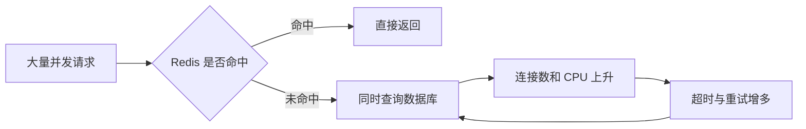

## 一、💡 一句话理解

> [!tip] 核心结论
> 三者的共同结果都是大量请求访问数据库：**穿透是查不存在的数据，击穿是一个热点 key 失效，雪崩是大量 key 同时失效或 Redis 整体不可用。**

## 二、🧭 理论：它们分别是什么

### 2.1 缓存穿透

请求的数据在 Redis 和数据库中都不存在，所以每次查询都会绕过缓存访问数据库。

例如攻击者不断请求不存在的商品 ID。因为数据库查不到结果，普通代码不会写入缓存，同一个无效请求下次还会继续查询数据库。

常用解决办法：

- 校验参数，直接拦截明显非法的 ID。
- 把“空结果”也缓存一小段时间，例如 1～5 分钟。
- 数据量很大时使用布隆过滤器，提前判断数据是否可能存在。
- 配合限流，防止恶意请求持续冲击系统。

> [!warning] 布隆过滤器的特点
> 它判断“不存在”时一定不存在；判断“可能存在”时仍可能误判，所以不能代替数据库，只能挡住大部分无效请求。

### 2.2 缓存击穿

一个访问量很高的热点 key 突然过期，大量并发请求同时发现缓存未命中，又同时查询数据库。这也常被称为 **cache stampede（缓存踩踏）**。

常用解决办法：

- 使用互斥锁或 single-flight，只允许一个请求查询数据库并重建缓存，其他请求短暂等待。
- 热点数据不设置物理过期时间，改为保存“逻辑过期时间”，后台异步更新。
- 确实长期有效的热点数据可以不过期，但必须在数据变化时主动更新或删除缓存。

### 2.3 缓存雪崩

大量 key 在同一时间过期，或者 Redis 故障导致大量缓存同时不可用，请求集中落到数据库，最终可能让数据库和应用一起被压垮。

常用解决办法：

- 给过期时间增加随机值，避免大量 key 在同一秒失效。
- 缓存预热时分批写入，不让所有 key 使用完全相同的 TTL。
- Redis 使用主从、哨兵或集群等高可用方案。
- 应用增加限流、熔断、降级和本地缓存，给数据库留出保护空间。
- 监控缓存命中率、Redis 状态、数据库连接数和慢查询。

### 2.4 三者怎么区分

| 问题   | 关键原因                  | 典型范围           | 核心解决思路          |
| ---- | --------------------- | -------------- | --------------- |
| 缓存穿透 | 数据本来就不存在              | 大量无效 key       | 参数校验、缓存空值、布隆过滤器 |
| 缓存击穿 | 一个热点 key 失效           | 单个热点 key       | 互斥重建、逻辑过期       |
| 缓存雪崩 | 大量 key 同时失效或 Redis 故障 | 大量 key 或整个缓存服务 | TTL 打散、高可用、限流降级 |

> [!info] 记忆方法
> **穿透：缓存和数据库都被穿过去；击穿：一个热点被打穿；雪崩：一大片缓存一起倒。**

## 三、⚙️ 理论：问题是怎么发生的

### 3.1 正常的 Cache Aside 查询

```text
请求 → 查询 Redis
          ├─ 命中 → 返回缓存
          └─ 未命中 → 查询数据库 → 写入 Redis → 返回结果
```

Redis 官方的 Cache Aside 示例也是先读缓存，未命中时读取主数据源，再把结果写回缓存并设置 TTL。

### 3.2 为什么数据库会被压垮



危险点不只是一次缓存未命中，而是**大量请求在同一时间未命中**。数据库变慢后，请求超时并重试，又会进一步增加数据库压力。

## 四、🚀 实践：从预防到验证

### 4.1 前置准备

本篇目标是面试表达，不搭建完整业务项目。准备一个 Redis 实例和 `redis-cli` 即可验证 TTL、空值缓存和互斥锁三个核心手段。

### 4.2 可以拿来干什么

#### 4.2.1 缓存空值，防止穿透

数据库确认商品不存在后，写入一个特殊值，并设置较短的 TTL：

```redis
SET cache:product:999999 "__NULL__" EX 120
GET cache:product:999999
TTL cache:product:999999
```

应用读到 `__NULL__` 后直接返回“商品不存在”，不用再次访问数据库。空值 TTL 不宜过长，否则数据库刚新增的数据可能暂时查不到。

#### 4.2.2 使用互斥锁，防止热点 key 被击穿

```redis
SET lock:product:1 request-123 NX EX 10
```

- 返回 `OK`：当前请求获得锁，负责查询数据库并重建缓存。
- 返回空：已有请求在重建缓存，当前请求应短暂等待后重查缓存，不能直接冲向数据库。
- `EX 10`：即使持锁应用异常退出，锁也会自动过期，降低死锁风险。

释放锁时必须先比较锁中的唯一标识，再删除锁；生产代码通常用 Lua 脚本保证“比较并删除”是一个原子操作，不能直接无条件执行 `DEL`。

#### 4.2.3 打散 TTL，降低雪崩概率

不要让一批缓存统一设置成正好 30 分钟，可以使用：

```text
实际 TTL = 基础 TTL + 随机时间
例如：1800 秒 + 0～300 秒随机值
```

这样 key 会分散在 30～35 分钟之间过期。它只能缓解“集中到期”，不能解决 Redis 整体故障，因此仍需高可用和限流降级。

### 4.3 完整实践：串起一次缓存查询

面试时可以按下面的伪代码描述实际处理流程：

```java
Product queryProduct(long id) {
    // 1. 参数校验：先拦截明显不合法的请求，减少缓存穿透。
    if (id <= 0) {
        throw new IllegalArgumentException("商品 ID 不合法");
    }

    // 2. 先查 Redis：命中正常值就直接返回；命中空值标记就返回不存在。
    String value = redis.get("cache:product:" + id);
    if (value != null) {
        return "__NULL__".equals(value) ? null : deserialize(value);
    }

    // 3. 缓存未命中时尝试加锁，保证只有一个请求负责重建热点缓存。
    String lockKey = "lock:product:" + id;
    String requestId = UUID.randomUUID().toString();
    boolean locked = redis.setIfAbsent(lockKey, requestId, 10, SECONDS);
    if (!locked) {
        // 实际项目应设置最大等待时间，短暂等待后重新查缓存，不能无限递归。
        sleepBriefly();
        return queryProduct(id);
    }

    try {
        // 4. 获得锁后再查一次缓存，防止等待加锁期间已有请求完成重建。
        value = redis.get("cache:product:" + id);
        if (value != null) {
            return "__NULL__".equals(value) ? null : deserialize(value);
        }

        Product product = database.findById(id);
        if (product == null) {
            // 5. 数据不存在时缓存空值，并使用较短 TTL 防止穿透。
            redis.set("cache:product:" + id, "__NULL__", 120, SECONDS);
            return null;
        }

        // 6. 正常数据使用“基础 TTL + 随机值”，避免大量 key 集中过期。
        long ttl = 1800 + random.nextLong(301);
        redis.set("cache:product:" + id, serialize(product), ttl, SECONDS);
        return product;
    } finally {
        // 7. 用 Lua 原子比较 requestId 后再删除，避免误删其他请求后来获得的锁。
        redis.unlockIfOwner(lockKey, requestId);
    }
}
```

验证时重点观察：

- 连续查询不存在的 ID，数据库只在第一次被访问，之后命中空值缓存。
- 并发查询同一个已过期热点 key，只有获得锁的请求访问数据库。
- 批量写入的 key 具有不同 TTL，不会集中在同一秒过期。

## 五、🎤 面试回答模板

### 5.1 一分钟回答

> 缓存穿透是查询缓存和数据库都不存在的数据，导致请求每次都访问数据库，可以用参数校验、缓存空值和布隆过滤器解决。缓存击穿是某个热点 key 过期后，大量并发同时访问数据库，可以用互斥锁或逻辑过期解决。缓存雪崩是大量 key 同时过期，或者 Redis 整体不可用，导致请求集中访问数据库，可以通过随机 TTL、缓存预热、Redis 高可用以及限流降级来处理。三者的区别主要是：穿透针对不存在的数据，击穿针对单个热点 key，雪崩影响大量 key 或整个缓存系统。

### 5.2 常见追问

**为什么缓存空值不能设置太久？**

因为数据库后续可能新增这条数据。空值还没过期时，应用仍会返回不存在，造成短时间的数据不一致。

**为什么加锁后还要再查一次缓存？**

当前请求等待锁期间，前一个请求可能已经查询数据库并写好了缓存。获得锁后再次检查，可以避免重复访问数据库。

**随机 TTL 能彻底解决雪崩吗？**

不能。它只能打散集中到期；Redis 节点故障仍要依靠高可用、限流、熔断、降级和监控处理。

## 六、📌 总结

- 穿透：数据不存在；用参数校验、缓存空值、布隆过滤器。
- 击穿：单个热点 key 失效；用互斥重建或逻辑过期。
- 雪崩：大量 key 同时失效或 Redis 不可用；用随机 TTL、高可用和限流降级。
- 所有方案都存在取舍，面试时要同时说明数据一致性、锁超时和降级策略。
- 最短记忆句：**无效数据穿透，热点过期击穿，大面积失效雪崩。**

## 七、🔗 官方资料

- [Redis Cache Aside with Jedis](https://redis.io/docs/latest/develop/use-cases/cache-aside/java-jedis/)
- [Redis Bloom filter](https://redis.io/docs/latest/data-types/probabilistic/bloom-filter/)
- [Redis SET 命令](https://redis.io/docs/latest/commands/set/)
- [Redis EXPIRE 命令](https://redis.io/docs/latest/commands/expire/)
- [Redis 错误处理与降级](https://redis.io/docs/latest/develop/clients/error-handling/)
