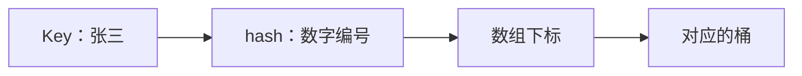
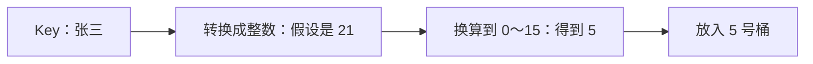
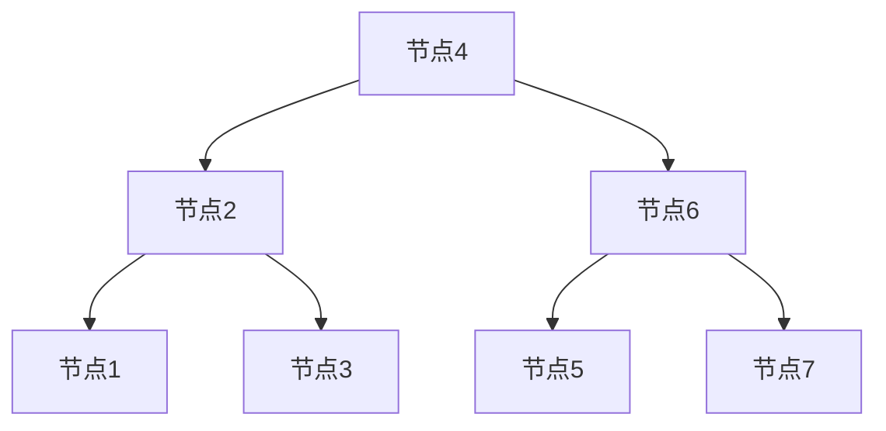
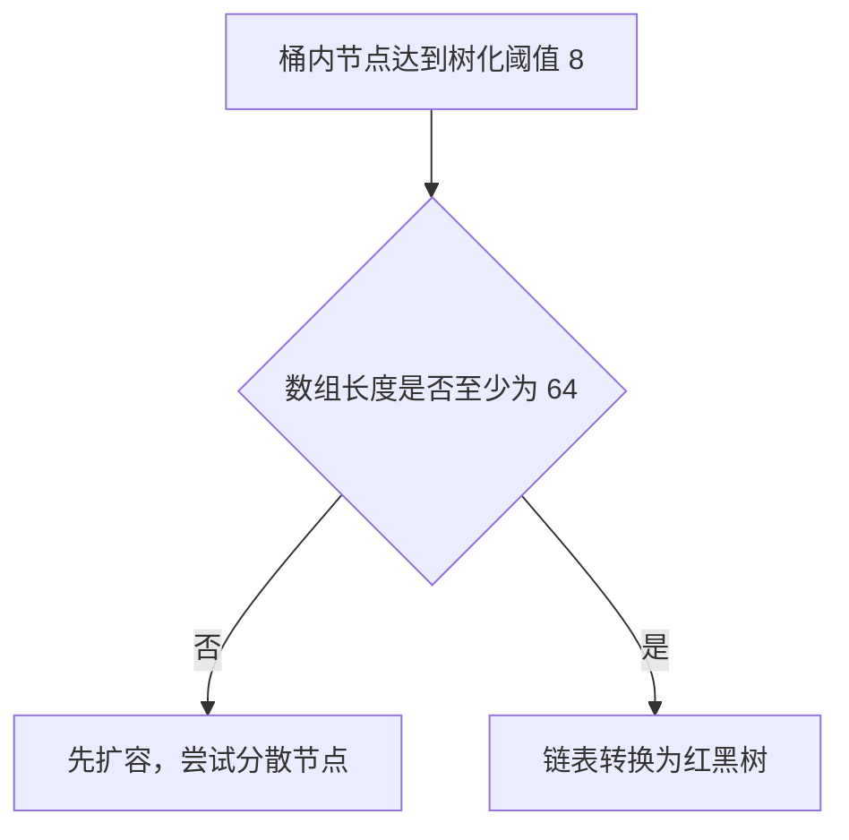
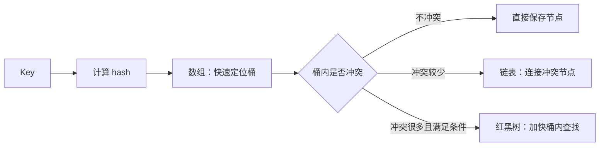
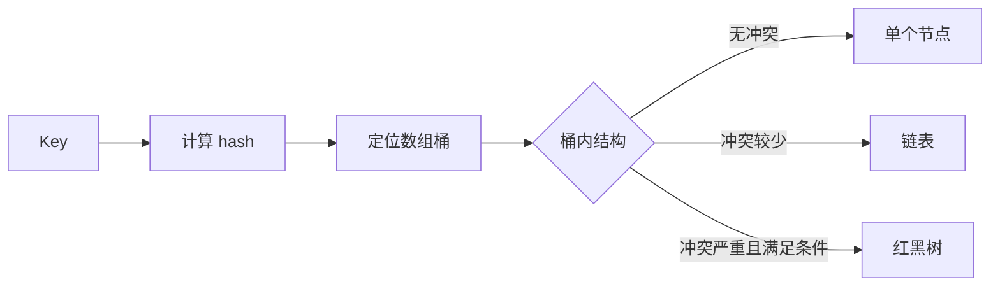
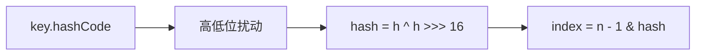
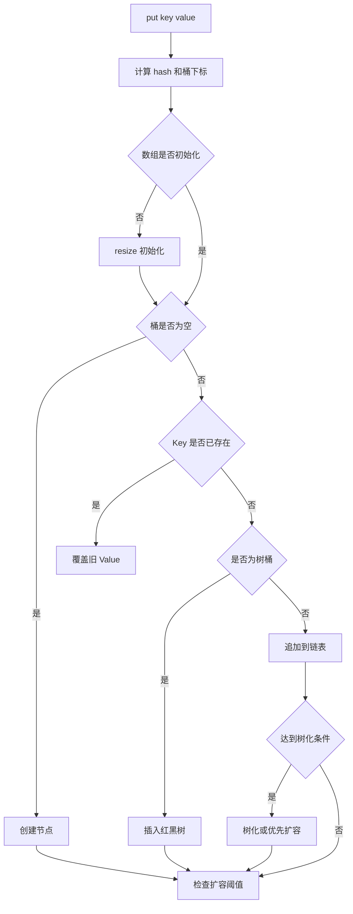
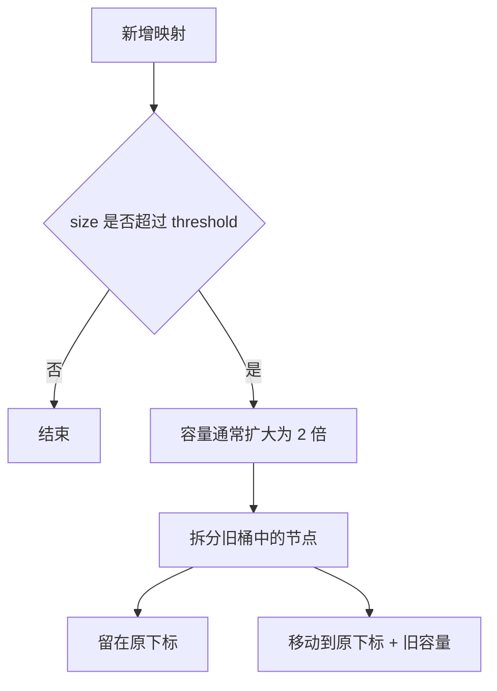

> [!tip] 面试主线
> HashMap 的面试题看起来很多，本质都围绕五个关键词：**数组、哈希定位、冲突处理、树化、扩容**。

## 00、🧭 阅读前先懂：数组、链表和红黑树是什么？

> [!tip] 先记住这句话
> **数组像一排有编号的柜子，链表像一列用挂钩连接的车厢，红黑树像一本每次都能排除一半范围的分类目录。**

### 0.1 数组：一排有编号的柜子

数组（Array）会保存一组同类型数据。创建后长度固定，每个位置都有从 `0` 开始的编号，这个编号叫作**下标（index）**。

```text
下标     0       1       2       3
      ┌──────┬──────┬──────┬──────┐
数组  │ 张三 │ 李四 │ 王五 │ 赵六 │
      └──────┴──────┴──────┴──────┘
```

想找下标为 `2` 的数据，可以直接打开 2 号柜子，不需要先查看 0 号和 1 号。因此，根据下标访问数组元素通常非常快，可以理解为 `O(1)`。

```java
// 创建一个长度固定为 4 的数组。
String[] names = {"张三", "李四", "王五", "赵六"};

// 使用下标 2，直接取得第三个元素。
System.out.println(names[2]); // 王五
```

数组的特点：

| 优点 | 缺点 |
|---|---|
| 知道下标时，可以直接找到元素 | 创建后长度固定 |
| 结构简单，访问速度快 | 中间插入或删除时，可能要移动后面的元素 |

**在 HashMap 中的作用：**数组是第一层目录。HashMap 根据 Key 算出一个下标，先快速定位到对应的数组位置，这个位置叫作“桶（bucket/bin）”。

#### 0.1.1 hash 是什么

`hash` 可以先理解成：**根据 Key 计算出来的数字编号。**

例如，我们要保存：

```java
map.put("张三", 18);
```

这里各部分的含义是：

```text
Key   = “张三”
Value = 18
hash  = 根据“张三”计算出来的一个整数
```

可以把 hash 想成机器给 Key 生成的“数字身份证”：

```text
张三 ──计算──> 假设得到 hash 21
李四 ──计算──> 假设得到 hash 37
```

HashMap 为什么需要 hash？因为数组只认识数字下标，不认识“张三”这样的文字。HashMap 先把 Key 转换成数字，后面才能继续计算应该放进哪个数组位置。



> [!tip] 现阶段只记这一句
> **Key 是原始名字，hash 是根据 Key 算出来的数字编号，下标是最终选中的数组位置。**

严格来说，Java 会先调用 Key 的 `hashCode()` 得到一个整数，HashMap 再对这个整数做一次简单处理，得到自己内部使用的 `hash`。第一次理解时，可以先把它们看成“给 Key 生成数字编号”的前后两步。

需要注意：hash 不是绝对唯一的。两个不同的 Key 可能得到相同的 hash，也可能最终得到相同的数组下标，所以 HashMap 还需要链表或红黑树处理冲突。

#### 0.1.2 HashMap 怎么根据 Key 算出数组下标

先不要看位运算公式。把 HashMap 想成一个只有 **16 个抽屉**的柜子：

```text
抽屉编号：0、1、2、3……15
```

现在要保存：

```java
map.put("张三", 18);
```

HashMap 要解决的问题是：**“张三”应该放进哪个抽屉？**

它会分两步处理：

```text
第一步：把 Key“张三”转换成一个整数
        假设得到 21

第二步：把 21 换算成 0～15 之间的抽屉编号
        21 除以 16，余数是 5

结果：“张三”放入 5 号抽屉
```



为什么不能直接使用 `21`？因为数组只有 `0～15` 号位置，没有 21 号位置，所以必须把大数字缩小到数组的合法范围。

> [!tip] 现阶段只记这一句
> **HashMap 先把 Key 变成一个整数，再把这个整数换算成数组范围内的下标。**

实际源码为了计算更快，没有真的写“除以 16 取余数”，而是使用下面的位运算：

```java
int index = (数组长度 - 1) & hash;
```

当数组长度是 2 的幂时，这个运算可以理解成“取余数”。第一次学习时先不用研究二进制，只要知道它最终负责把数字限制到合法数组下标即可。

如果“张三”和“李四”最后都算出 5，它们就都要进入 5 号桶，这叫作**哈希冲突**。HashMap 会再使用链表或红黑树把它们区分开。

### 0.2 链表：用指针串起来的车厢

继续使用刚才的抽屉例子。

假设 HashMap 算出：

```text
“张三”应该放进 5 号桶
```

于是 5 号桶里先放入张三：

```text
5号桶 → 张三
```

后来又保存“李四”，结果李四也被算到了 5 号桶：

```text
“张三” → 5号桶
“李四” → 5号桶
```

这就是**哈希冲突**：两个不同的 Key 想进入同一个桶。

HashMap 不能让李四把张三覆盖掉，于是会把它们像车厢一样连接起来：

```text
5号桶 → 张三 → 李四 → 王五 → null
```

这串连接起来的节点，就是**链表**。

每个节点内部可以先简单理解为保存三样东西：

```text
┌───────────────────┐
│ Key：张三          │
│ Value：18          │
│ next：下一个节点   │────→ 李四节点
└───────────────────┘
```

其中 `next` 的意思就是：**“下一个节点在哪里。”**

当 HashMap 查找“李四”时，会这样做：

```text
第一步：算出李四在 5 号桶
第二步：打开 5 号桶，先看到张三
第三步：张三不是李四，沿着 next 继续往后找
第四步：找到李四，返回李四对应的 Value
```


> [!tip] 现阶段只记这一句
> **链表就是把落在同一个桶里的多个数据，一个接一个串起来，防止它们互相覆盖。**

链表的问题也很明显：如果 5 号桶中串了 100 个节点，查找最后一个时，可能要从第一个一路找到第一百个。因此链表太长时，HashMap 才会考虑把它转换成红黑树。

### 0.3 红黑树：会自动保持平衡的二叉搜索树

继续看刚才的 5 号桶。

如果只有三个数据，链表还不算慢：

```text
5号桶 → 张三 → 李四 → 王五
```

但是，如果 5 号桶里串了很多数据：

```text
5号桶 → 节点1 → 节点2 → 节点3 → 节点4
       → 节点5 → 节点6 → 节点7 → 节点8……
```

假设要找最后面的节点，HashMap 只能从第一个开始，一个接一个检查。链表越长，查找越慢。

于是，HashMap 会把这一长串节点重新组织成有分支的结构：

```text
                节点4
              /       \
          节点2       节点6
          /   \       /   \
      节点1  节点3  节点5  节点7
```

这就是“树”。每个节点最多向下连接两个节点：

```text
左边一个分支 + 右边一个分支
```

查找节点7时，不再从节点1一路看到节点7，而是沿着分支走：

```text
先看节点4
→ 判断应该走右边
→ 找到节点6
→ 再走右边
→ 找到节点7
```

原来可能检查 7 次，现在只检查大约 3 次。数据越多，树相对链表的优势越明显。



普通的树也可能因为数据加入顺序不好，慢慢歪成一条链。红黑树会在插入和删除节点后，自动调整节点位置，尽量保持左右两边高度接近。这就是“自动保持平衡”。

> [!info] 为什么叫红黑树
> 每个节点内部都有一个“红色”或“黑色”标记。它们不是给人看的颜色，而是程序维持树平衡时使用的状态。具体的旋转和变色规则，第一次理解 HashMap 时可以先跳过。

> [!tip] 现阶段只记这一句
> **红黑树就是把过长的链表改造成有分支、较平衡的查找结构，避免每次都从头找到尾。**

需要注意：变成红黑树的是**某一个冲突严重的桶内部**，HashMap 最外层的数组仍然存在。

#### 0.3.1 什么情况下才会转换成红黑树

理解了红黑树的作用后，再来看它什么时候出现。HashMap 不会发现链表变长就立刻转成红黑树，它要同时检查两件事：

```text
条件一：同一个桶里的节点达到树化阈值 8
条件二：整个 HashMap 数组的长度至少是 64
```

继续用抽屉理解：

```text
桶里的节点数量 = 一个抽屉里塞了多少盒子
数组长度       = 整个柜子一共有多少个抽屉
```

如果 5 号桶里的节点已经达到阈值，但是整个数组只有 16 个桶：

```text
桶内节点很多
数组长度 16，小于 64
结果：暂时不变成红黑树，先扩容
```

扩容相当于把柜子从 16 个抽屉增加到 32 个，之后还可能增加到 64 个。抽屉变多后，原来挤在 5 号桶里的节点可能被重新分散到其他桶，链表自然就变短了。

如果同时满足：

```text
桶内节点达到树化阈值 8
数组长度已经达到 64
```

HashMap 才会把这个桶里的链表转换为红黑树。



> [!tip] 记忆口诀
> **链表到 8，数组到 64，才考虑真正树化；数组不足 64，优先扩容。**

### 0.4 三种结构在 HashMap 中如何配合



| 数据结构 | 在 HashMap 中负责什么 | 大白话 |
|---|---|---|
| 数组 | 根据 Key 算出的数字编号（hash）快速定位桶 | 先找到哪一排柜子 |
| 链表 | 保存少量哈希冲突节点 | 同一个柜子里串几个盒子 |
| 红黑树 | 管理大量哈希冲突节点 | 盒子太多时改成分类目录 |

> [!example] 最小例子
> 假设数组有 16 个桶，三个 Key 都被算到 5 号桶：数量较少时，它们在 5 号桶里组成链表；冲突节点越来越多并满足树化条件后，5 号桶内部再转换成红黑树。数组本身并不会因此消失。

## 面试题目录

1. HashMap 的底层数据结构是什么？
2. 为什么链表改为红黑树的阈值是 8？
3. 解决 Hash 冲突的办法有哪些？HashMap 用的是哪种？
4. 为什么不直接使用红黑树，而是先使用链表？
5. HashMap 默认加载因子是多少？为什么是 0.75？
6. HashMap 中 Key 的存储索引怎么计算？
7. JDK 8 为什么要让 hashCode 异或右移 16 位的值？
8. 为什么 hash 值要与 `length - 1` 相与？
9. HashMap 数组的长度为什么是 2 的幂次方？
10. HashMap 的 put 方法流程是什么？
11. HashMap 如何扩容？
12. 一般使用什么作为 HashMap 的 Key？
13. HashMap 为什么线程不安全？

---

## 01、🧱 HashMap 的底层数据结构是什么？

> [!info] 参考回答
> JDK 7 的 HashMap 由“数组 + 链表”组成；JDK 8 开始引入红黑树，底层结构变为“数组 + 链表 + 红黑树”。数组负责定位桶，链表和红黑树负责保存发生哈希冲突的节点。



链表查询的最坏时间复杂度为 `O(n)`；红黑树查询通常为 `O(log n)`。链表过长时转换成红黑树，可以改善查询性能。

树化需要关注三个常量：

| 常量 | 值 | 作用 |
|---|---:|---|
| `TREEIFY_THRESHOLD` | 8 | 触发树化检查的阈值 |
| `UNTREEIFY_THRESHOLD` | 6 | 扩容拆分时可能退化为链表的阈值 |
| `MIN_TREEIFY_CAPACITY` | 64 | 允许真正树化的最小数组容量 |

```java
// 链表达到阈值后，触发树化检查。
if (binCount >= TREEIFY_THRESHOLD - 1) {
    treeifyBin(tab, hash);
}
```

```java
// 数组容量不足 64 时，优先扩容，而不是立即树化。
final void treeifyBin(Node<K, V>[] tab, int hash) {
    int n;
    if (tab == null || (n = tab.length) < MIN_TREEIFY_CAPACITY) {
        resize();
    }
}
```

> [!warning] 常见误区
> “链表长度达到 8 就一定变成红黑树”并不严谨。如果数组容量小于 64，HashMap 会优先扩容，希望通过增加桶的数量分散冲突节点。

## 02、🌳 为什么链表改为红黑树的阈值是 8？

主要考虑两个因素：

1. **树节点更重**：源码注释指出，树节点占用的空间大约是普通节点的两倍。链表很短时，使用红黑树并不划算。
2. **长链表很少见**：哈希分布良好时，桶内节点数量近似服从泊松分布。源码估算中，桶内出现 8 个节点的概率已经非常低。

| 桶内节点数 | 源码注释中的近似概率 |
|---:|---:|
| 0 | 0.60653066 |
| 1 | 0.30326533 |
| 2 | 0.07581633 |
| 4 | 0.00157952 |
| 6 | 0.00001316 |
| 8 | 0.00000006 |

> [!tip] 面试表达
> 阈值 8 是时间、空间和冲突概率之间的折中，并不是一个脱离实现背景的“神奇数字”。

## 03、🧩 解决 Hash 冲突的办法有哪些？HashMap 用的是哪种？

| 方法 | 核心思路 | 特点 |
|---|---|---|
| 开放定址法 | 冲突后继续寻找其他空槽位 | 数据都保存在数组中，删除通常需要特殊标记 |
| 再哈希法 | 使用其他哈希函数继续计算 | 降低聚集，但增加计算成本 |
| 链地址法 | 同一桶中的冲突元素组成链表或树 | 插入、删除方便，HashMap 采用此方案 |
| 公共溢出区 | 冲突元素统一放入额外区域 | 主表和溢出表分开管理 |

**HashMap 使用链地址法**。JDK 8 之后，同一个桶内先使用链表；冲突严重且满足条件时，再转换为红黑树。

## 04、⚖️ 为什么不直接使用红黑树，而是先使用链表？

红黑树需要维护父子引用、节点颜色以及旋转平衡，结构更复杂，占用的内存也更多。

桶内元素较少时，链表创建成本低，顺序查找的实际开销也不大。只有链表较长时，红黑树的查询优势才足以覆盖维护成本。

```text
少量冲突：链表更轻量
大量冲突：红黑树查询更稳定
```

> [!info] 补充
> 红黑树的查询通常为 `O(log n)`，链表最坏为 `O(n)`；但红黑树插入时可能需要变色、左旋和右旋，因此不适合从第一个节点起就使用。

## 05、📊 HashMap 默认加载因子是多少？为什么是 0.75？

默认负载因子是 `0.75`。它是**查询性能、空间占用和扩容频率**之间的折中。

| 负载因子 | 空间占用 | 哈希冲突 | 扩容频率 |
|---|---|---|---|
| 较小 | 较高 | 较少 | 较高 |
| `0.75` | 平衡 | 平衡 | 平衡 |
| 较大 | 较低 | 较多 | 较低 |

扩容阈值通常为：

```text
threshold = capacity × loadFactor
```

默认容量为 16 时，阈值通常是 `16 × 0.75 = 12`。加入第 13 个映射后，会触发扩容。

[原稿中的延伸阅读](https://mp.weixin.qq.com/s/a3qfatEWizKK1CpYaxVBbA)

## 06、🧮 HashMap 中 Key 的存储索引怎么计算？

计算过程分为三步：



对应的核心思路：

```java
// 第一步：获取 Key 的原始 hashCode。
int h = key.hashCode();

// 第二步：将高 16 位信息混入低 16 位。
int hash = h ^ (h >>> 16);

// 第三步：根据数组长度计算桶下标。
int index = (tableLength - 1) & hash;
```

> [!tip] 一句话回答
> 先使用 Key 的 `hashCode()` 计算扰动后的 hash，再通过 `hash & (length - 1)` 得到桶下标。

[原稿中的延伸阅读](https://mp.weixin.qq.com/s/aS2dg4Dj1Efwujmv-6YTBg)

## 07、🔀 JDK 8 为什么要让 hashCode 异或右移 16 位的值？

核心代码：

```java
(h = key.hashCode()) ^ (h >>> 16)
```

数组长度通常远小于 `int` 的取值范围，计算桶下标时主要使用哈希值的低位。如果两个 Key 只有高位不同、低位相同，它们很容易落入同一个桶。

把高 16 位信息混入低 16 位，可以改善哈希分布，同时只需要一次移位和一次异或，计算成本较低。

与 JDK 7 更复杂的多次扰动相比，JDK 8 的实现是在**速度、效果和计算成本**之间做取舍。

## 08、⚡ 为什么 hash 值要与 length - 1 相与？

当数组长度 `length` 是 2 的幂时：

```text
hash & (length - 1) 等价于 hash % length
```

以数组长度 16 为例：

```text
length     = 0001 0000
length - 1 = 0000 1111
```

与运算会保留哈希值的低 4 位，结果自然落在 `0～15` 之间。位运算也非常适合 HashMap 的桶定位方式。

## 09、📐 HashMap 数组的长度为什么是 2 的幂次方？

容量保持为 2 的幂主要有三个好处：

- `length - 1` 的低位全是 `1`，可以更充分地利用哈希值低位，减少不必要的冲突和空间浪费。
- 可以使用 `(length - 1) & hash` 快速定位桶。
- 扩容为原来的两倍后，节点只会留在原下标，或移动到 `原下标 + 旧容量`。

构造方法传入的容量不是 2 的幂时，HashMap 会把它调整为大于等于该值的最小 2 次幂：

| 传入容量 | 调整后的容量 |
|---:|---:|
| 8 | 8 |
| 10 | 16 |
| 20 | 32 |

JDK 8 的容量计算核心代码：

```java
static final int tableSizeFor(int cap) {
    int n = cap - 1;
    n |= n >>> 1;
    n |= n >>> 2;
    n |= n >>> 4;
    n |= n >>> 8;
    n |= n >>> 16;
    return (n < 0) ? 1
            : (n >= MAXIMUM_CAPACITY) ? MAXIMUM_CAPACITY
            : n + 1;
}
```

先执行 `cap - 1`，是为了让本来就是 2 的幂的容量保持不变。例如输入 8，如果不先减 1，最终会被调整为 16。

## 10、🔄 HashMap 的 put 方法流程是什么？

以 JDK 8 为例：

1. 根据 Key 计算扰动后的 `hash`。
2. 如果底层数组尚未初始化，先调用 `resize()` 创建数组。
3. 使用 `(n - 1) & hash` 定位桶。
4. 桶为空时，直接创建节点。
5. 桶不为空时，判断首节点是不是相同 Key。
6. 如果桶已经是红黑树，按树结构插入或更新。
7. 否则遍历链表：Key 已存在就覆盖 Value；不存在就追加节点。
8. 链表达到阈值时触发树化检查，容量不足 64 则优先扩容。
9. 新增映射后，如果 `size` 超过阈值，再执行扩容。



> [!example] 面试精简版
> put 会先计算哈希并定位桶；桶为空就直接插入，Key 已存在就覆盖 Value，冲突时追加到链表或插入红黑树；新增后再判断是否需要树化和扩容。

## 11、📦 HashMap 如何扩容？

当新增映射后的 `size` 超过扩容阈值，HashMap 通常把数组容量和阈值扩大为原来的 2 倍。

由于容量始终是 2 的幂，旧桶中的节点只需要检查哈希值与旧容量对应的那一位：

```text
(hash & oldCapacity) == 0  → 留在原下标
(hash & oldCapacity) != 0  → 移到原下标 + oldCapacity
```



> [!warning] 实际开发建议
> 如果能预估元素数量，创建 HashMap 时应设置合适的初始容量，减少扩容和节点迁移的成本。

[原稿中的延伸阅读](https://mp.weixin.qq.com/s/0KSpdBJMfXSVH63XadVdmw)

## 12、🔑 一般使用什么作为 HashMap 的 Key？

通常优先选择 `String`、`Integer`、`Long` 等不可变类型。

原因包括：

- 这些类已经正确重写了 `equals()` 和 `hashCode()`。
- 对象创建后状态不会变化，放入 Map 后哈希值保持稳定。
- `String` 会缓存计算过的哈希值，多次使用时无需重复计算。

自定义对象作为 Key 时，应使用业务唯一字段同时重写 `equals()` 和 `hashCode()`，并尽量把这些字段设计为不可变。

> [!danger] 不要修改 Key
> Key 放入 HashMap 后，如果参与 `equals()` 和 `hashCode()` 的字段发生变化，后续查询会根据新哈希值寻找新桶，但对象仍留在旧桶中，最终可能无法找到。

## 13、🧵 HashMap 为什么线程不安全？

`HashMap` 没有为并发修改提供同步保证。多个线程同时读写时，可能出现：

- 多线程 `put` 导致更新覆盖或元素丢失。
- 一个线程修改结构时，另一个线程观察到不一致状态。
- 并发扩容或迁移节点时产生不可预测结果。
- JDK 7 的头插法在并发扩容时可能形成环形链表，导致死循环。

> [!warning] 版本化回答
> “并发扩容导致死循环”主要针对 JDK 7 的经典实现。回答当前版本的 HashMap 时，更稳妥的说法是：它没有并发安全保证，可能发生数据丢失、不可见或内部状态不一致。

并发读写场景优先使用 [[ConcurrentHashMap并发安全与计数]]。如果使用 `Collections.synchronizedMap(...)`，遍历时仍要遵循其同步要求。

---

## 🧠 十句话快速回顾

1. JDK 8 的 HashMap 是数组 + 链表 + 红黑树。
2. 哈希冲突采用链地址法解决。
3. Key 的哈希会执行 `h ^ (h >>> 16)` 扰动。
4. 桶下标通过 `(n - 1) & hash` 计算。
5. 数组容量保持为 2 的幂。
6. 默认容量是 16，默认负载因子是 0.75。
7. 树化记住 `8、6、64`，容量不足 64 时优先扩容。
8. `put` 遇到相同 Key 会覆盖旧 Value。
9. Key 最好不可变，并正确重写 `equals()` 与 `hashCode()`。
10. HashMap 不保证顺序，也不保证线程安全。

> [!tip] 推荐答题顺序
> **先给结论 → 说明数据结构 → 描述执行流程 → 补充阈值 → 说明边界与版本。**

## 🔗 参考资料

- [Dev.java：Java 数组教程](https://dev.java/learn/language/constructs/basics/arrays/)
- [Java SE 25：LinkedList API](https://docs.oracle.com/en/java/javase/25/docs/api/java.base/java/util/LinkedList.html)
- [Java SE 25：TreeMap API](https://docs.oracle.com/en/java/javase/25/docs/api/java.base/java/util/TreeMap.html)
- [Java SE 25：HashMap API](https://docs.oracle.com/en/java/javase/25/docs/api/java.base/java/util/HashMap.html)
- [OpenJDK 25：HashMap 源码](https://github.com/openjdk/jdk/blob/jdk-25%2B36/src/java.base/share/classes/java/util/HashMap.java)
- [原始整理来源：Java 面试指南（HashMap）](https://javabetter.cn/interview/java-hashmap-13.html)
