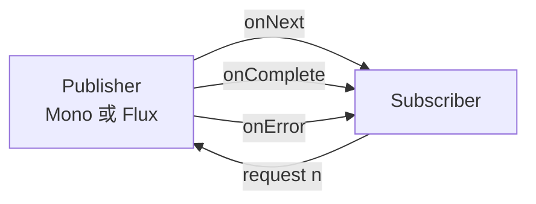

## 一、💡 一句话理解

> [!tip] 核心结论
> Reactor 不是 JDK 自带功能，而是一个基于 Reactive Streams 规范的 Java 响应式编程库。它用 `Mono` 表示 0 或 1 个异步结果，用 `Flux` 表示 0 到多个异步结果，并通过操作符组合数据处理流程。

最容易记住的比喻是“数据传送带”：

```text
生产数据 → 转换数据 → 筛选数据 → 处理结果
Publisher    Operator      Operator      Subscriber
```

这个比喻只用来帮助理解；在真实概念中，Reactor 处理的是一系列 `onNext`、`onError` 和 `onComplete` 信号。

## 二、🧭 理论：Reactor 是什么

### 2.1 Reactor 与 JDK、Spring 的关系

Reactor 是第三方库，不是 Java 语法，也不是 JDK 标准 API。

| 内容 | 归属 | 例子 | 大白话解释 |
|---|---|---|---|
| Lambda 表达式 | Java/JDK | `chunk -> send(chunk)` | `->` 是 Java 自带的简写语法。意思是：每拿到一个 `chunk`，就执行右边的 `send(chunk)`。 |
| `CompletableFuture` | JDK | 表示一个异步结果 | 可以把它想成一张“取结果的小票”：任务先去执行，结果出来后再通知你，通常最终只有一个结果。 |
| `Stream` | JDK | 处理内存中的集合数据 | 它像一条“集合加工流水线”，常用来对已经放在内存里的 `List` 做筛选、转换和统计，不是 Reactor 那种持续到达的异步数据流。 |
| `Mono`、`Flux` | Reactor | 表示异步数据序列 | 数据可能现在还没有，以后才到。`Mono` 最多等到一个结果，`Flux` 可以一段一段地收到多个结果。 |
| Spring WebFlux | Spring | 基于 Reactor 构建的响应式 Web 框架 | 它让 Spring 接口可以直接返回 `Mono` 或 `Flux`。例如 AI 每生成一段文字，服务器就可以立即发给浏览器，不用等整篇回答完成。 |
| `SseEmitter` | Spring MVC | 在 Servlet 技术栈中手动发送 SSE 事件 | 它像服务器和浏览器之间一条暂时不关闭的通道。后端每调用一次 `send`，前端就收到一次消息；它本身不属于 Reactor。 |

> [!tip] 看代码时怎么快速区分
> 看到 `->` 只能说用了 Java Lambda；看到 `Mono`、`Flux`、`subscribe` 才说明用了 Reactor；看到 `SseEmitter` 则说明代码在使用 Spring MVC 的 SSE 能力。

你没有直接引入 `reactor-core` 也可能使用到 Reactor，因为 Spring WebFlux、Spring `WebClient` 或某些 AI SDK 会间接引入它。

### 2.2 Reactor 要解决什么问题

传统同步代码往往是：调用一个方法，当前线程等待它返回，然后继续执行。

```java
// 当前线程在 remoteService.call() 返回前可能一直等待。
String result = remoteService.call();
System.out.println(result);
```

响应式代码先声明“数据到达后怎么处理”：

```java
Mono<String> result = reactiveService.call();

result
        .map(String::trim)
        .subscribe(System.out::println);
```

它尤其适合：

- AI 逐段生成文字；
- HTTP 流式响应；
- WebSocket 和 SSE 实时推送；
- 消息队列或持续事件流；
- 需要组合多个异步调用的场景。

> [!warning] 非阻塞不是自动获得的
> 把阻塞的 JDBC、`Thread.sleep()` 或同步 HTTP 调用放进 `Mono`/`Flux`，不会自动把它们变成非阻塞。

### 2.3 `Mono` 和 `Flux`

| 类型 | 数据个数 | 典型场景 | 用途 |
|---|---:|---|---|
| `Mono<T>` | 0 或 1 | 查询一个用户、一次 HTTP 响应、一个保存结果 | 用来表示“最终最多只需要一个结果”的任务。例如根据 ID 查用户：查到时发出一个用户，没查到时不发出数据，最后结束。 |
| `Flux<T>` | 0 到 N | AI 文字片段、列表数据、持续消息流 | 用来表示“结果可能有很多个，而且可以一个接一个到达”的任务。例如 AI 每生成一段文字就立即发出，直到整个回答完成。 |

> [!tip] 怎么选
> 业务结果最多一个，选 `Mono`；可能有多个或需要持续推送，选 `Flux`。不要因为 `Flux` 看起来更强就一律使用 `Flux`，类型本身应该表达真实的数据个数。

```java
// 创建一个最多只产生一个值的 Mono。
Mono<String> userName = Mono.just("小明");

// 创建一个可以连续产生多个值的 Flux。
Flux<String> answer = Flux.just("你", "好", "呀");
```

在这个例子中，`userName` 被订阅后只发出一次“小明”就结束；`answer` 被订阅后会依次发出“你”、“好”、“呀”，适合模拟 AI 逐段返回文字。

`Mono` 不是“单个值本身”，`Flux` 也不是 `List`。它们表示的是一个可能尚未执行、随时间产生信号的计算过程。

## 三、⚙️ 理论：Reactor 是怎么工作的

### 3.1 Publisher 和 Subscriber

Reactor 建立在 Reactive Streams 规范之上。理解入门代码时，先记住两个角色：

- `Publisher`：数据发布者，`Mono` 和 `Flux` 都实现了这个角色。
- `Subscriber`：订阅者，接收数据、错误和完成信号。



### 3.2 三种核心信号

一条 Reactor 流最值得记住的是三种信号：

| 信号 | 含义 | 是否结束数据流 |
|---|---|---|
| `onNext(value)` | 发出一个数据 | 否 |
| `onComplete()` | 正常结束 | 是 |
| `onError(error)` | 异常结束 | 是 |

`onComplete` 和 `onError` 互斥。一条流结束时只会走其中一条路径。

大白话理解：

- `onNext`：快递员正在一件一件送包裹，后面还可能继续送。
- `onComplete`：包裹全部正常送完，这一轮结束。
- `onError`：运送中出了无法继续的问题，立即进入失败结束，后面的包裹不再送。

对应到 `subscribe` 的三个参数：

```java
flux.subscribe(
        value -> 处理每个正常数据, // onNext
        error -> 处理异常,        // onError
        () -> 处理正常完成           // onComplete
);
```

#### 3.2.1 正常时怎么走

```java
Flux.just("你", "好", "呀")
        .subscribe(
                value -> System.out.println("收到：" + value),
                error -> System.err.println("失败：" + error.getMessage()),
                () -> System.out.println("正常结束")
        );
```

对应的信号顺序是：

```text
onNext("你")
onNext("好")
onNext("呀")
onComplete()
```

因为中间没有出错，所以先多次执行第一个回调，最后执行第三个回调。

```text
数据源
  ↓
onNext("你") → 第一个回调
  ↓
onNext("好") → 第一个回调
  ↓
onNext("呀") → 第一个回调
  ↓
onComplete()  → 第三个回调，数据流结束
```

#### 3.2.2 错误时怎么走

错误可以来自数据源，也可以是 `map`、`flatMap` 等操作符内的代码抛出异常。下面的代码在遇到 0 时会除零失败：

```java
Flux.just(10, 5, 0, 2)
        .map(number -> 100 / number)
        .subscribe(
                value -> System.out.println("收到：" + value),
                error -> System.err.println("失败：" + error.getMessage()),
                () -> System.out.println("正常结束")
        );
```

它的实际路径是：

```text
10 → 100 / 10 = 10 → onNext(10) → 第一个回调
 5 → 100 / 5  = 20 → onNext(20) → 第一个回调
 0 → 100 / 0  抛出 ArithmeticException
                         ↓
                   onError(error) → 第二个回调
                         ↓
                    数据流立即结束
```

输出类似：

```text
收到：10
收到：20
失败：/ by zero
```

这里有两个重点：

1. 0 后面的 2 不会再被处理，因为 `onError` 已经结束了原数据流。
2. 第三个 `onComplete` 回调不会执行，因为这次是异常结束，不是正常结束。

> [!warning] `onErrorResume` 不是让原数据流从出错位置继续
> 它是用一条新的兜底数据流替换已经失败的原数据流。原流中出错位置之后的数据仍然不会继续处理。

#### 3.2.3 对应到你的 AI 流式代码

你的代码中，AI 正常返回 chunk 时走第一个回调；AI 调用超时或抛异常时，会跳到第二个回调：

```text
AI 正常返回 chunk
  → onNext(chunk)
  → 向前端发送 delta

AI 服务超时或异常
  → onError(error)
  → 向前端发送 error
  → emitter.complete()
  → 本轮结束，不会再发送 done
```

如果 AI 从头到尾都没有出错，才会走 `onComplete()`，向前端发送 `done`。

### 3.3 惰性执行与订阅

惰性执行的意思是：**先把处理步骤定义好，等真正有人需要数据时再开始执行。**

可以把 Reactor 链理解成一张菜谱：

```text
创建 Flux/Mono、添加 map/filter → 只是写好菜谱
subscribe()                      → 顾客真正下单
数据开始流动                    → 厨房按菜谱开始做菜
```

这是帮助理解的类比。真实机制是：订阅者订阅 `Publisher` 后，订阅信号向上游传递，数据源才开始向下游发送信号。

#### 3.3.1 只声明流程时，`map` 还没有执行

下面的代码只创建了一条处理流程：

```java
Flux<String> pipeline = Flux.just("a", "b", "c")
        .map(value -> {
            // 只有数据真正流过 map 时，这行才会执行。
            System.out.println("正在转换：" + value);
            return value.toUpperCase();
        });

System.out.println("流程已定义，但还没有订阅");
```

这时只会输出：

```text
流程已定义，但还没有订阅
```

`map` 中的“正在转换”不会出现，因为没有数据流过它。

#### 3.3.2 `subscribe()` 做了什么

下面这行表示：“我需要这条流的数据，现在开始执行吧。”

```java
pipeline.subscribe(value -> System.out.println("收到：" + value));
```

订阅后的完整路径：

```text
subscribe()
    ↓
Flux.just 开始发出 "a"
    ↓
map 把 "a" 转换成 "A"
    ↓
订阅者收到 "A"
    ↓
继续处理 "b" 和 "c"
    ↓
数据全部发完，发出 onComplete
```

实际输出：

```text
正在转换：a
收到：A
正在转换：b
收到：B
正在转换：c
收到：C
```

`subscribe()` 不是“把数据保存起来”，而是把 `Publisher` 和一个 `Subscriber` 连接起来，从而触发整条处理链。

#### 3.3.3 为什么说“多数”是惰性的

这里先认识“冷流”和“热流”的最小概念，后面的 3.9 节会继续深入讲解。

| 类型 | 大白话理解 | 订阅者加入时会发生什么 |
|---|---|---|
| 冷流（Cold Publisher） | 像点播视频，每个人点击播放后，都从头获得属于自己的播放流程 | 每次订阅通常都会重新生成数据；没有人订阅时，数据源通常不开始生成数据 |
| 热流（Hot Publisher） | 像电视直播，节目可以按自己的时间继续播放 | 后来的订阅者可能只能看到加入之后的数据，错过前面已经发出的内容 |

> [!tip] 当前小节只需要记住
> 我们现在讲的“订阅后才执行”，主要针对冷流。例如把 HTTP 请求包在 `Mono.defer` 中，每来一个订阅者，都可能重新发起一次 HTTP 请求。

“没有订阅就什么都不执行”是学习冷流时的核心规则，但不能误解为 Java 方法参数也会自动延迟求值。

下面的 `loadUser()` 会立即执行：

```java
// Java 需要先执行 loadUser()，才能把返回值传给 Mono.just。
Mono<User> userMono = Mono.just(loadUser());
```

真正希望等到订阅时再调用方法，可以使用 `fromCallable`：

```java
Mono<User> userMono = Mono.fromCallable(() -> {
    // 只有 userMono 被订阅时，loadUser() 才会执行。
    return loadUser();
});
```

也可以使用 `defer` 延迟创建整条流：

```java
Mono<User> userMono = Mono.defer(() -> {
    // 每次有订阅者时，都会重新执行这个函数。
    User user = loadUser();
    return Mono.just(user);
});
```

> [!warning] 多次订阅可能多次执行
> 对于普通冷流，每次 `subscribe()` 都可能重新触发数据生成。如果上游是 AI 付费请求、数据库写入或发送消息，重复订阅可能造成重复调用。

#### 3.3.4 WebFlux Controller 为什么不用手动 `subscribe()`

不是 WebFlux 没有订阅，而是**订阅这件事由 Spring WebFlux 框架完成了**。

```java
@GetMapping("/names")
public Flux<String> names() {
    // Controller 只负责返回处理流程，不自己订阅。
    return Flux.just("小明", "小红")
            .map(String::toUpperCase);
}
```

一次 HTTP 请求的大致流程是：

```text
浏览器请求 /names
        ↓
Spring WebFlux 调用 Controller
        ↓
Controller 返回 Flux<String>
        ↓
Spring WebFlux 作为订阅者调用 subscribe
        ↓
Flux 开始发出数据
        ↓
Spring 把每个数据编码后写入 HTTP 响应
        ↓
onComplete：正常结束响应
onError：进入异常处理
客户端断开：取消订阅
```

因此，在 WebFlux Controller 里手动调用 `subscribe()` 通常是错误做法：

```java
@GetMapping("/wrong")
public Flux<String> wrong() {
    Flux<String> result = service.loadNames();

    // 不要在 WebFlux Controller 里抢先手动订阅。
    result.subscribe(System.out::println);

    // Spring 处理返回值时可能又订阅一次。
    return result;
}
```

这可能导致上游被执行两次，并且手动订阅的那次执行脱离了 HTTP 请求的错误处理和取消管理。

#### 3.3.5 为什么你最初的 `SseEmitter` 代码又手动订阅了

`SseEmitter` 是 Spring MVC 提供的 SSE（Server-Sent Events，服务器推送事件）工具。它可以让一次 HTTP 响应暂时不结束，后端在这条连接上分多次向浏览器发送消息。

大白话理解：普通 HTTP 响应像“一次把整个包裹交给客户”；`SseEmitter` 则像“先保持一条通道，有新内容就往里送一件”。

```text
浏览器发起 HTTP 请求
        ↓
Controller 返回 SseEmitter
        ↓
HTTP 连接暂时保持打开
        ↓
后端可多次调用 emitter.send(...)
        ↓
全部结束后调用 emitter.complete()
```

| API | 用途 | 大白话解释 |
|---|---|---|
| `new SseEmitter(timeout)` | 创建 SSE 连接对象 | 准备一条可以持续发消息的通道，`timeout` 表示最长等待时间 |
| `emitter.send(...)` | 发送一个 SSE 事件 | AI 每生成一段文字，就给前端送一次 |
| `emitter.complete()` | 正常结束请求 | 告诉 Spring：数据都发完了，可以收尾 |
| `emitter.completeWithError(error)` | 以异常结束请求 | 把错误交回 Spring MVC 的异常处理机制 |
| `onTimeout` / `onCompletion` / `onError` | 注册生命周期回调 | 超时、完成或发生错误时执行清理逻辑 |

> [!info] SSE 和 WebSocket 不是一回事
> SSE 主要是服务器单向持续向浏览器推送数据，很适合 AI 回答、日志和进度更新。WebSocket 更偏向客户端和服务器双向长时间通信。

`SseEmitter` 不是 `Flux`，也不是 Reactor 的 `Subscriber`。它只知道“如何把某个对象写入 SSE 响应”，并不会自动去消费你另外创建的 `Flux`。

你最初的代码不是把 `Flux` 作为 Controller 返回值交给框架，而是先返回 `SseEmitter`，再把 Reactor 数据流手动转发到它里面：

```text
Flux<String> 产生 AI chunk
        ↓
你的 subscribe() 消费 chunk
        ↓
send(emitter, "delta", ...)
        ↓
SseEmitter 把事件发给浏览器
```

因此，中间必须有一段“转接”代码。下面的片段假设 Controller 已经创建了 `emitter`、AI 服务已返回 `aiFlux`，并且已有 `conversationId`：

```java
aiFlux.subscribe(
        // Flux 每发出一个 chunk，就转发给 SseEmitter。
        chunk -> send(emitter, "delta", new ChatEvent(
                conversationId, chunk, null, null)),
        // Flux 异常结束时，向前端发送错误事件并收尾。
        error -> {
            send(emitter, "error", new ChatEvent(
                    conversationId,
                    null,
                    "AI_STREAM_FAILED",
                    "AI 服务暂时不可用或响应超时，请稍后重试"
            ));
            emitter.complete();
        },
        // Flux 正常结束时，向前端发送 done 并收尾。
        () -> {
            send(emitter, "done", new ChatEvent(
                    conversationId, null, null, null));
            emitter.complete();
        }
);
```

在这种“Reactor → Spring MVC `SseEmitter`”的手动桥接代码中，`subscribe()` 负责让 `Flux` 真正开始产生数据，`send()` 负责把已经产生的数据通过 SSE 发给浏览器。这和 WebFlux Controller 直接返回 `Flux` 是两种不同模式。

> [!tip] 最后只记一句
> `Flux` 是数据来源，`subscribe()` 是启动并接收这些数据，`SseEmitter.send()` 是把收到的数据发给浏览器。

### 3.4 操作符链

Reactor 通过操作符组合逻辑。每个操作符一般都返回一个新的 `Mono` 或 `Flux`：

```java
Flux<Integer> result = Flux.range(1, 6)
        // 只保留偶数。
        .filter(number -> number % 2 == 0)
        // 将保留下来的数字乘以 10。
        .map(number -> number * 10);

result.subscribe(System.out::println);
```

输出：

```text
20
40
60
```

> [!warning] 操作符需要接住返回值
> `flux.map(...)` 不会就地修改原来的 `flux`。链式调用或保存新返回值，才能得到处理后的流。

### 3.5 `map` 和 `flatMap` 的区别

`map` 用于“一个普通值变成另一个普通值”：

```java
Mono<String> upperName = Mono.just("小明")
        .map(String::toUpperCase);
```

`flatMap` 用于“一个值变成另一个 `Mono` 或 `Flux`”，它会把嵌套的响应式类型展平：

```java
Mono<User> user = Mono.just("1001")
        // findById 本身返回 Mono<User>，因此使用 flatMap。
        .flatMap(userService::findById);
```

判断方法：

```text
转换函数返回普通值      → map
转换函数返回 Mono/Flux → flatMap
```

`flatMap` 可以并发处理内部数据流，因此不必然保持原始顺序。需要严格保持顺序时，可根据场景考虑 `concatMap`。

### 3.6 错误是终止信号

在 Reactor 中，错误不是一个可以继续正常流动的普通数据。一旦出现 `onError`，当前流就结束。

```java
Flux<Integer> numbers = Flux.just(10, 5, 0, 2)
        .map(number -> 100 / number);

numbers.subscribe(
        value -> System.out.println("结果：" + value),
        error -> System.err.println("计算失败：" + error.getMessage()),
        () -> System.out.println("完成")
);
```

当数字为 0 时会进入 `onError`，后面的 2 不会继续处理，`onComplete` 也不会执行。

常用错误处理方式：

```java
Mono<String> result = callRemoteService()
        // 失败时返回一个固定兜底值。
        .onErrorReturn("暂时无法获取")
        // 无论成功、失败还是取消，都适合在这里做清理或记录。
        .doFinally(signalType -> System.out.println("结束信号：" + signalType));
```

| 操作符 | 用途 |
|---|---|
| `onErrorReturn` | 返回固定兜底值 |
| `onErrorResume` | 切换到另一条数据流 |
| `onErrorMap` | 把异常转换成另一种异常 |
| `doOnError` | 记录日志等副作用，不会自动恢复 |
| `retry` / `retryWhen` | 重新订阅上游流程 |

### 3.7 线程与 Scheduler

Reactor 不保证每个操作符都自动切换线程。如果没有指定 `Scheduler`，许多同步数据源会在发起订阅的线程中执行。

如果对线程、线程池和 `Future` 还不熟悉，可以先阅读 [[Java/基础/线程|线程]]。

```java
Mono.fromCallable(() -> blockingCall())
        // 将订阅及上游阻塞调用安排到有界弹性线程池。
        .subscribeOn(Schedulers.boundedElastic())
        .subscribe(System.out::println);
```

- `subscribeOn` 主要影响订阅和上游数据源在哪里执行。
- `publishOn` 从它所在位置开始，影响后续操作符的执行线程。
- `Schedulers.boundedElastic()` 适合必须包装的阻塞 I/O，但并不等于阻塞调用本身变成了非阻塞。

### 3.8 背压 Backpressure

背压解决的是：生产者生产得太快，消费者来不及处理怎么办。

在 Reactive Streams 中，订阅者可以通过 `request(n)` 表达需求量。不要把它简单理解为“限流注解”，它是数据流上下游之间的需求协调机制。

常见策略包括：

- 限制请求量；
- 缓冲来不及处理的数据；
- 丢弃旧数据或新数据；
- 只保留最新值。

AI 流式文字通常每个 chunk 较小，但在高并发、慢客户端或大流量时，仍需要关注队列增长和连接取消。

### 3.9 冷流与热流

- 冷流（Cold Publisher）：每个订阅者通常独立触发一次数据生成。
- 热流（Hot Publisher）：数据可能不依赖某个具体订阅者而产生，后来者可能错过早期数据。

```java
Flux<String> cold = Flux.defer(() -> {
    System.out.println("每次订阅都重新创建数据");
    return Flux.just("A", "B");
});

cold.subscribe(value -> System.out.println("订阅者1：" + value));
cold.subscribe(value -> System.out.println("订阅者2：" + value));
```

对远程 AI 请求来说，如果每次订阅都会触发一次真实调用，重试、多次 `subscribe()` 或错误的共享操作都可能造成重复计费，需要特别注意。

## 四、🧰 理论：常用 API 速查

### 4.1 创建数据流

```java
Mono<String> one = Mono.just("一个值");
Mono<String> emptyOne = Mono.empty();
Mono<String> failedOne = Mono.error(new IllegalStateException("失败"));

Flux<Integer> several = Flux.just(1, 2, 3);
Flux<Integer> range = Flux.range(1, 5);

// defer 会等到真正订阅时再执行 Supplier。
Mono<Long> lazyTime = Mono.defer(() -> Mono.just(System.currentTimeMillis()));
```

### 4.2 转换与筛选

| API | 作用 |
|---|---|
| `map` | 同步地将一个值转成另一个值 |
| `flatMap` | 将一个值转成响应式流并展平 |
| `filter` | 只保留符合条件的值 |
| `distinct` | 去重 |
| `take(n)` | 只取前 n 个 |
| `collectList` | 将 `Flux<T>` 收集为 `Mono<List<T>>` |

### 4.3 组合数据流

```java
Mono<User> userMono = findUser();
Mono<Account> accountMono = findAccount();

// 两个结果都就绪后组合。
Mono<UserProfile> profile = Mono.zip(userMono, accountMono)
        .map(tuple -> new UserProfile(tuple.getT1(), tuple.getT2()));
```

| API | 特点 |
|---|---|
| `concat` | 按顺序订阅，前一条完成后再处理下一条 |
| `merge` | 同时订阅多条流，按实际到达时间发出 |
| `zip` | 等待多个来源的对应值并组合 |

### 4.4 日志与生命周期

```java
Flux.just("A", "B")
        .doOnSubscribe(subscription -> System.out.println("已订阅"))
        .doOnNext(value -> System.out.println("流经：" + value))
        .doOnError(error -> System.err.println("异常：" + error.getMessage()))
        .doOnComplete(() -> System.out.println("正常完成"))
        .doFinally(signal -> System.out.println("最终信号：" + signal))
        .subscribe();
```

`doOnXxx` 主要用于日志、监控和调试等副作用。它们通常不改变流经的数据。

### 4.5 `block` 和 `subscribe`

- `subscribe()` 发起订阅，并通过回调接收信号。
- `block()` 阻塞当前线程，直到 `Mono` 完成。
- `blockLast()` 阻塞当前线程，直到 `Flux` 完成，并取最后一个值。

`block` 可用于命令行演示、测试或合理的同步边界。在 WebFlux 事件循环中随意 `block()` 会破坏非阻塞模型，甚至引发线程耗尽或报错。

## 五、🚀 实践：从准备到验证

### 5.1 前置准备

本教程的完整实践是一个最小 Spring WebFlux SSE 项目，它会模拟 AI 逐段返回文字。

| 项目 | 要求 |
|---|---|
| JDK | 17 或更高，本示例使用 JDK 17 |
| Maven | 3.6.3 或更高版本 |
| Spring Boot | 4.1.1，用于固定本教程的示例环境 |
| 网络 | 首次构建时需要下载 Maven 依赖 |

> [!info] 版本说明
> Reactor 本身的实际版本由 Spring Boot 依赖管理统一选择，`pom.xml` 不手动混用其他 Reactor 版本。在已有 Spring Boot 项目中，优先使用项目当前 BOM 管理的版本。

### 5.2 可以拿来干什么

#### 5.2.1 处理一个异步结果

前置：方法返回 `Mono<User>`。

```java
userService.findById("1001")
        // 把用户对象转成显示名称。
        .map(User::displayName)
        // 无数据时使用默认文字。
        .defaultIfEmpty("未知用户")
        .subscribe(System.out::println);
```

输入是用户 ID，输出是用户名称。适用于返回 0 或 1 个结果的调用。

#### 5.2.2 处理多个数据

前置：`orderRepository.findAll()` 返回 `Flux<Order>`。

```java
orderRepository.findAll()
        // 只保留已支付订单。
        .filter(Order::paid)
        // 取出订单金额。
        .map(Order::amount)
        // 累加所有金额。
        .reduce(BigDecimal.ZERO, BigDecimal::add)
        .subscribe(total -> System.out.println("已支付总额：" + total));
```

输入是订单流，输出是一个总金额，因此 `reduce` 后的类型是 `Mono<BigDecimal>`。

#### 5.2.3 推送 AI 流式回答

前置：AI SDK 返回 `Flux<String>`，每个字符串是一段 chunk。

```java
aiService.stream(prompt)
        // 将每段文字包装成 delta 事件。
        .map(chunk -> ServerSentEvent.builder(chunk)
                .event("delta")
                .build())
        // AI 正常结束后追加 done 事件。
        .concatWithValues(ServerSentEvent.builder("")
                .event("done")
                .build());
```

输入是用户问题，输出是 SSE 事件流。这是 Reactor 在 AI 聊天场景中最直观的用法。

### 5.3 完整实践：创建项目

项目目录结构：

```text
reactor-sse-demo/
├── pom.xml
└── src/
    ├── main/
    │   ├── java/com/example/reactordemo/
    │   │   ├── ReactorDemoApplication.java
    │   │   ├── ChatEvent.java
    │   │   └── ChatController.java
    │   └── resources/application.yml
    └── test/java/com/example/reactordemo/
        └── ChatControllerTest.java
```

#### 5.3.1 Maven 配置

文件位置：`reactor-sse-demo/pom.xml`

```xml
<?xml version="1.0" encoding="UTF-8"?>
<project xmlns="http://maven.apache.org/POM/4.0.0"
         xmlns:xsi="http://www.w3.org/2001/XMLSchema-instance"
         xsi:schemaLocation="http://maven.apache.org/POM/4.0.0 https://maven.apache.org/xsd/maven-4.0.0.xsd">
    <modelVersion>4.0.0</modelVersion>

    <!-- Spring Boot 父 POM 统一管理 Spring、Reactor 和测试依赖版本。 -->
    <parent>
        <groupId>org.springframework.boot</groupId>
        <artifactId>spring-boot-starter-parent</artifactId>
        <version>4.1.1</version>
        <relativePath/>
    </parent>

    <groupId>com.example</groupId>
    <artifactId>reactor-sse-demo</artifactId>
    <version>0.0.1-SNAPSHOT</version>
    <name>reactor-sse-demo</name>

    <properties>
        <java.version>17</java.version>
    </properties>

    <dependencies>
        <!-- WebFlux 会引入 reactor-core，并支持非阻塞 HTTP 和 SSE。 -->
        <dependency>
            <groupId>org.springframework.boot</groupId>
            <artifactId>spring-boot-starter-webflux</artifactId>
        </dependency>

        <!-- 提供 JUnit、WebTestClient 和 reactor-test 等测试能力。 -->
        <dependency>
            <groupId>org.springframework.boot</groupId>
            <artifactId>spring-boot-starter-test</artifactId>
            <scope>test</scope>
        </dependency>
    </dependencies>

    <build>
        <plugins>
            <!-- 支持打包和运行 Spring Boot 应用。 -->
            <plugin>
                <groupId>org.springframework.boot</groupId>
                <artifactId>spring-boot-maven-plugin</artifactId>
            </plugin>
        </plugins>
    </build>
</project>
```

#### 5.3.2 应用入口

文件位置：`src/main/java/com/example/reactordemo/ReactorDemoApplication.java`

```java
package com.example.reactordemo;

import org.springframework.boot.SpringApplication;
import org.springframework.boot.autoconfigure.SpringBootApplication;

/**
 * Spring Boot 应用入口。
 * spring-boot-starter-webflux 会配置响应式 Web 服务器。
 */
@SpringBootApplication
public class ReactorDemoApplication {

    public static void main(String[] args) {
        SpringApplication.run(ReactorDemoApplication.class, args);
    }
}
```

#### 5.3.3 SSE 事件对象

文件位置：`src/main/java/com/example/reactordemo/ChatEvent.java`

```java
package com.example.reactordemo;

/**
 * 发送给前端的聊天事件数据。
 *
 * @param conversationId 会话 ID，用于区分不同聊天
 * @param content        delta 事件中的文字片段
 * @param errorCode      error 事件中的稳定错误码
 * @param errorMessage   可以展示给用户的错误提示
 */
public record ChatEvent(
        String conversationId,
        String content,
        String errorCode,
        String errorMessage
) {
}
```

#### 5.3.4 流式接口

文件位置：`src/main/java/com/example/reactordemo/ChatController.java`

```java
package com.example.reactordemo;

import java.time.Duration;
import java.util.List;
import java.util.UUID;

import org.slf4j.Logger;
import org.slf4j.LoggerFactory;
import org.springframework.http.MediaType;
import org.springframework.http.codec.ServerSentEvent;
import org.springframework.web.bind.annotation.GetMapping;
import org.springframework.web.bind.annotation.RequestMapping;
import org.springframework.web.bind.annotation.RequestParam;
import org.springframework.web.bind.annotation.RestController;
import reactor.core.publisher.Flux;

@RestController
@RequestMapping("/api/chat")
public class ChatController {

    private static final Logger log = LoggerFactory.getLogger(ChatController.class);

    /**
     * 以 SSE 方式模拟 AI 流式回答。
     * curl 传入 prompt=fail 时会走错误分支。
     */
    @GetMapping(value = "/stream", produces = MediaType.TEXT_EVENT_STREAM_VALUE)
    public Flux<ServerSentEvent<ChatEvent>> stream(
            @RequestParam(defaultValue = "介绍Reactor") String prompt) {

        String conversationId = UUID.randomUUID().toString();

        // defer 确保每次 HTTP 订阅时再创建本次回答流。
        Flux<ServerSentEvent<ChatEvent>> answerEvents = Flux.defer(() -> {
            if ("fail".equalsIgnoreCase(prompt)) {
                // 人为制造异常，用于验证 error 事件。
                return Flux.error(new IllegalStateException("模拟 AI 服务超时"));
            }

            List<String> chunks = List.of(
                    "Reactor ",
                    "是 Java ",
                    "的响应式编程库。"
            );

            return Flux.fromIterable(chunks)
                    // 模拟 AI 每 500 毫秒返回一段文字。
                    .delayElements(Duration.ofMillis(500))
                    // 每个 chunk 都转换为 delta SSE 事件。
                    .map(chunk -> sse("delta", new ChatEvent(
                            conversationId,
                            chunk,
                            null,
                            null
                    )))
                    // 只有上游正常完成时才会追加 done。
                    .concatWithValues(sse("done", new ChatEvent(
                            conversationId,
                            null,
                            null,
                            null
                    )));
        });

        return answerEvents
                .doOnSubscribe(subscription ->
                        log.info("开始流式对话，conversationId={}", conversationId))
                .doOnNext(event ->
                        log.debug("发送 SSE，event={}", event.event()))
                // 异常时将 onError 转换成一个可被客户端识别的 error 事件。
                // 转换后的替代流只发送 error，不会伪造 done。
                .onErrorResume(error -> {
                    log.error("流式对话失败，conversationId={}", conversationId, error);
                    return Flux.just(sse("error", new ChatEvent(
                            conversationId,
                            null,
                            "AI_STREAM_FAILED",
                            "AI 服务暂时不可用或响应超时，请稍后重试"
                    )));
                })
                // 成功、失败或客户端断开都会收到最终信号，适合做清理和观测。
                .doFinally(signalType ->
                        log.info("流式对话结束，conversationId={}, signal={}",
                                conversationId, signalType));
    }

    /**
     * 统一构建 SSE 事件，避免在业务逻辑中重复 builder 代码。
     */
    private static ServerSentEvent<ChatEvent> sse(String event, ChatEvent data) {
        return ServerSentEvent.<ChatEvent>builder()
                .event(event)
                .data(data)
                .build();
    }
}
```

这里没有手动调用 `subscribe()`。Controller 返回 `Flux` 后，Spring WebFlux 负责订阅、把信号写入 HTTP 响应，并在客户端断开时传播取消信号。

#### 5.3.5 应用配置

文件位置：`src/main/resources/application.yml`

```yaml
server:
  # 演示服务监听端口。
  port: 8080

logging:
  level:
    # 调试时查看每个 SSE 事件的发送日志。
    com.example.reactordemo: DEBUG
```

#### 5.3.6 接口测试

文件位置：`src/test/java/com/example/reactordemo/ChatControllerTest.java`

```java
package com.example.reactordemo;

import org.junit.jupiter.api.Test;
import org.springframework.beans.factory.annotation.Autowired;
import org.springframework.boot.test.autoconfigure.web.reactive.AutoConfigureWebTestClient;
import org.springframework.boot.test.context.SpringBootTest;
import org.springframework.http.MediaType;
import org.springframework.test.web.reactive.server.WebTestClient;

@SpringBootTest(webEnvironment = SpringBootTest.WebEnvironment.RANDOM_PORT)
@AutoConfigureWebTestClient
class ChatControllerTest {

    @Autowired
    private WebTestClient webTestClient;

    @Test
    void shouldReturnEventStream() {
        webTestClient.get()
                .uri(uriBuilder -> uriBuilder
                        .path("/api/chat/stream")
                        .queryParam("prompt", "介绍Reactor")
                        .build())
                .accept(MediaType.TEXT_EVENT_STREAM)
                .exchange()
                .expectStatus().isOk()
                .expectHeader().contentTypeCompatibleWith(MediaType.TEXT_EVENT_STREAM)
                // 只验证流中能解析出 ChatEvent；
                // 精确验证事件顺序可在项目中再用 StepVerifier 扩展。
                .expectBodyList(ChatEvent.class)
                .hasSize(4);
    }
}
```

> [!info] 测试补充
> SSE 序列化和 `WebTestClient` 对 `ServerSentEvent` 包装的处理会随 Spring 版本及解码方式有差异。业务项目中建议把“生成事件的 `Flux`”抽成 Service，用 `StepVerifier` 直接验证 `delta → done` 和 `error` 两条路径，Controller 测试只验证 HTTP 协议。

### 5.4 启动与验证

#### 5.4.1 运行测试

在 `reactor-sse-demo` 目录执行：

```bash
mvn test
```

预期结果：Maven 显示测试成功，无 `Failures` 和 `Errors`。

#### 5.4.2 启动应用

```bash
mvn spring-boot:run
```

预期结果：日志显示应用启动完成，并监听 `8080` 端口。

#### 5.4.3 验证正常流程

`curl` 的 `-N` 参数用于关闭客户端输出缓冲，便于直接看到逐段输出：

```bash
curl -N 'http://localhost:8080/api/chat/stream?prompt=%E4%BB%8B%E7%BB%8DReactor'
```

预期会间隔约 500 毫秒收到一个事件：

```text
event:delta
data:{"conversationId":"...","content":"Reactor ","errorCode":null,"errorMessage":null}

event:delta
data:{"conversationId":"...","content":"是 Java ","errorCode":null,"errorMessage":null}

event:delta
data:{"conversationId":"...","content":"的响应式编程库。","errorCode":null,"errorMessage":null}

event:done
data:{"conversationId":"...","content":null,"errorCode":null,"errorMessage":null}
```

#### 5.4.4 验证错误流程

```bash
curl -N 'http://localhost:8080/api/chat/stream?prompt=fail'
```

预期只收到 `error` 事件，不应该再收到 `done`：

```text
event:error
data:{"conversationId":"...","content":null,"errorCode":"AI_STREAM_FAILED","errorMessage":"AI 服务暂时不可用或响应超时，请稍后重试"}
```

### 5.5 将完整实践替换为真实 AI 服务

当 AI SDK 已能返回 `Flux<String>` 时，只需用真实返回值替换示例中的 `Flux.fromIterable(chunks)`：

```java
Flux<String> chunks = aiService.stream(prompt);

return chunks
        .map(chunk -> sse("delta", new ChatEvent(
                conversationId,
                chunk,
                null,
                null
        )))
        .concatWithValues(sse("done", new ChatEvent(
                conversationId,
                null,
                null,
                null
        )))
        .onErrorResume(error -> {
            log.error("AI 流式调用失败，conversationId={}", conversationId, error);
            return Flux.just(sse("error", new ChatEvent(
                    conversationId,
                    null,
                    "AI_STREAM_FAILED",
                    "AI 服务暂时不可用或响应超时，请稍后重试"
            )));
        });
```

注意：如果 `concatWithValues(done)` 放在 `onErrorResume` 之后，错误被替换成普通数据流并正常完成后，可能继续追加 `done`。如果协议规定失败时只发 `error`，就要像示例一样明确安排操作符顺序。

## 六、🔍 你最初的 `subscribe` 代码怎么理解

### 6.1 代码中的三个回调

```java
.subscribe(
        chunk -> send(emitter, "delta", new ChatEvent(...)),
        error -> {
            send(emitter, "error", new ChatEvent(...));
            emitter.complete();
        },
        () -> {
            send(emitter, "done", new ChatEvent(...));
            emitter.complete();
        }
);
```

它等价于：

| Reactor 信号 | 你的处理 | SSE 事件 |
|---|---|---|
| `onNext(chunk)` | 发送一段 AI 文字 | `delta` |
| `onError(error)` | 发送稳定错误并关闭连接 | `error` |
| `onComplete()` | 发送完成标记并关闭连接 | `done` |

### 6.2 这种写法的技术栈

这段代码很可能是把两种模型接在一起：

```text
AI SDK 返回 Flux<String>
            ↓
      手动 subscribe
            ↓
Spring MVC SseEmitter
            ↓
          浏览器
```

这在 Spring MVC 项目中是可以理解的桥接方式，但需要自己负责：

- 客户端断开后取消 Reactor `Disposable`；
- `send` 抛出异常时正确结束连接；
- 避免 `complete()` 和 `completeWithError()` 竞态；
- 设置合理超时时间；
- 记录真实异常，但不向客户端泄露敏感细节。

一个更稳妥的思路是保存 `subscribe()` 返回的 `Disposable`，并在 emitter 超时、完成或异常时取消上游。但是否需要这样修改，要结合你的 `send` 实现、Spring MVC 版本和 AI SDK 行为判断。

### 6.3 MVC 和 WebFlux 不要混为一个概念

- Spring MVC 中可以使用 `SseEmitter`，也可以消费某个库返回的 `Flux`。
- Spring WebFlux 通常直接返回 `Flux<ServerSentEvent<T>>`。
- 使用了 `Flux` 并不能单独证明整个项目就是 WebFlux 项目。

## 七、⚠️ 常见误区与排查

### 7.1 写了操作符却没有生效

错误写法：

```java
Flux<String> flux = Flux.just("a", "b");
flux.map(String::toUpperCase);
flux.subscribe(System.out::println);
```

输出仍然是小写，因为没有使用 `map` 返回的新 `Flux`。

正确写法：

```java
Flux<String> flux = Flux.just("a", "b")
        .map(String::toUpperCase);

flux.subscribe(System.out::println);
```

### 7.2 没有订阅，代码没执行

先检查当前场景由谁订阅：

- 命令行或普通 Java 程序中，通常需要自己 `subscribe` 或在边界 `block`。
- WebFlux Controller 返回 `Mono`/`Flux` 时，不要再手动订阅。
- Service 层通常返回组合好的 `Mono`/`Flux`，把订阅权留给框架边界。

### 7.3 调用 `block()` 后性能反而更差

如果在 Netty 事件循环或 WebFlux 请求处理链中阻塞，少量线程就可能被占满。排查时搜索：

```text
.block(
.blockFirst(
.blockLast(
Thread.sleep(
```

同时检查 JDBC、同步 HTTP SDK 和文件 I/O 等隐性阻塞调用。

### 7.4 `onErrorResume` 后意外发送 `done`

错误被 `onErrorResume` 转换为替代数据流后，替代流可以正常完成。因此操作符顺序很重要：

```java
// 业务含义：正常才追加 done，异常改发 error。
source
        .concatWith(doneEvent)
        .onErrorResume(error -> errorEvent(error));
```

单元测试必须分别覆盖正常和失败路径。

### 7.5 重试导致重复调用

`retry` 的本质是重新订阅上游。如果上游是付费 AI 接口、创建订单或发送消息，必须考虑：

- 操作是否幂等；
- 是否会重复扣费或重复写入；
- 哪些异常才值得重试；
- 是否需要指数退避和最大次数。

### 7.6 日志里没有根异常

向客户端返回稳定错误码是对的，但服务端仍应记录原始异常：

```java
.doOnError(error ->
        log.error("AI 流式调用失败，conversationId={}", conversationId, error))
```

客户端获得可识别但不敏感的信息，服务端日志保留定位问题所需的堆栈。

## 八、📌 总结

- Reactor 是第三方 Java 库，不是 JDK 内置 API。
- `Mono<T>` 表示 0 或 1 个结果，`Flux<T>` 表示 0 到 N 个结果。
- Reactor 流通过 `onNext`、`onError`、`onComplete` 传递信号。
- `onError` 和 `onComplete` 都是终止信号，并且互斥。
- `map` 处理普通值转换，`flatMap` 处理返回 `Mono`/`Flux` 的异步组合。
- 使用 Reactor 不代表代码自动非阻塞，需要检查整条调用链。
- WebFlux Controller 通常直接返回 `Mono`/`Flux`，不应手动 `subscribe()`。
- 你最初的代码是在用 `subscribe` 把 Reactor 的三种信号转换为 SSE 的 `delta`、`error` 和 `done` 事件。

> [!tip] 记忆句
> Reactor 就是用 `Mono` 和 `Flux` 表达随时间到达的数据，用操作符组合处理流程，最后由订阅者处理数据、错误和完成信号。

## 九、📚 官方资料

- [Reactor Core Getting Started](https://projectreactor.io/docs/core/release/reference/gettingStarted.html)
- [Reactor Core Features](https://projectreactor.io/docs/core/release/reference/coreFeatures.html)
- [Reactor 冷流与热流](https://projectreactor.io/docs/core/release/reference/advancedFeatures/reactor-hotCold.html)
- [Reactor 错误处理](https://projectreactor.io/docs/core/release/reference/coreFeatures/error-handling.html)
- [Reactor FAQ 与最佳实践](https://projectreactor.io/docs/core/release/reference/faq.html)
- [Spring WebFlux 响应式 API](https://docs.spring.io/spring-framework/reference/web/webflux/new-framework.html)
- [Spring WebFlux 中的响应式库](https://docs.spring.io/spring-framework/reference/web/webflux-reactive-libraries.html)
- [Spring WebFlux `@ResponseBody` 响应式返回值](https://docs.spring.io/spring-framework/reference/web/webflux/controller/ann-methods/responsebody.html)
- [Spring MVC 异步请求与 `SseEmitter`](https://docs.spring.io/spring-framework/reference/web/webmvc/mvc-ann-async.html)
- [`SseEmitter` 官方 API](https://docs.spring.io/spring-framework/docs/current/javadoc-api/org/springframework/web/servlet/mvc/method/annotation/SseEmitter.html)
- [Spring Boot 当前版本与系统要求](https://docs.spring.io/spring-boot/system-requirements.html)