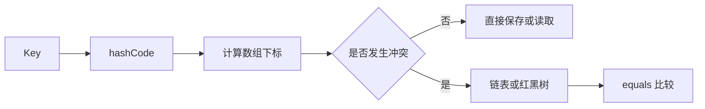

## 一、💡 一句话理解

> [!tip] 核心结论
> Java 基础面试主要考察对象、类、异常、内存和并发基础；集合面试主要考察数据结构、哈希定位、扩容、排序和线程安全。回答时要做到“先说结论，再讲原理，最后结合场景”。

## 二、🧭 理论：面试考察什么

### 2.1 Java 基础

重点包括：

- 对象与引用：`==`、`equals()`、`hashCode()`、String 不可变。
- 面向对象：重载、重写、抽象类、接口、封装和多态。
- 异常处理：受检异常、非受检异常、`try-catch-finally`。
- 运行机制：JDK、JRE、JVM、堆、栈、方法区。
- 并发基础：`volatile`、`synchronized`、可见性、原子性。

### 2.2 Java 集合

集合的本质是根据不同数据结构，解决不同的数据存储和访问问题：

| 类型 | 主要特点 | 常见实现 |
|---|---|---|
| List | 有序、允许重复 | ArrayList、LinkedList |
| Set | 通常不允许重复 | HashSet、TreeSet |
| Queue | 按队列规则处理元素 | LinkedList、PriorityQueue |
| Map | 保存键值对 | HashMap、TreeMap |

## 三、⚙️ 理论：它是怎么工作的

### 3.1 HashMap 的工作过程

HashMap 会先根据 Key 的 `hashCode()` 计算哈希值，再定位数组下标；如果多个 Key 定位到同一个位置，就通过链表或红黑树保存冲突元素；最终使用 `equals()` 判断是否是同一个 Key。



### 3.2 集合选择原则

- 查询多、按下标访问：优先考虑 `ArrayList`。
- 需要去重：优先考虑 `HashSet`。
- 需要保持插入顺序并去重：考虑 `LinkedHashSet`。
- 需要按 Key 排序：考虑 `TreeMap`。
- 多线程读写 Map：考虑 `ConcurrentHashMap`。
- 读多写少且需要线程安全 List：考虑 `CopyOnWriteArrayList`。

## 四、🚀 实践：面试答题方法

一个高质量回答可以按下面的顺序组织：

1. 先给一句结论。
2. 解释底层原理或关键数据结构。
3. 说明适用场景和复杂度。
4. 补充线程安全、空值、扩容或修改异常等边界。
5. 最后结合项目中的实际使用场景。

例如回答“ArrayList 和 LinkedList 的区别”时，不要只说“一个数组、一个链表”，还要说明随机访问、插入删除、内存占用和实际选型。

## 五、🔍 最小例子：面试题与参考答案

### 5.1 Java 基础面试题

1. **JDK、JRE、JVM 有什么区别？**  
   JDK 用于开发，包含 JRE；JRE 用于运行 Java 程序，包含 JVM；JVM 负责执行字节码。

2. **`==` 和 `equals()` 有什么区别？**  
   `==` 比较基本类型的值，引用类型比较地址；`equals()` 默认比较地址，但很多类会重写它进行内容比较。

3. **为什么重写 `equals()` 必须重写 `hashCode()`？**  
   两个对象 `equals()` 相等时，`hashCode()` 必须相等，否则放入 `HashMap`、`HashSet` 后可能查找失败或出现重复元素。

4. **String 为什么是不可变的？**  
   字符串创建后不能修改，有利于字符串常量池、线程安全和哈希值缓存，也能提高作为 Map Key 时的稳定性。

5. **String、StringBuilder、StringBuffer 的区别？**  
   `String` 不可变；`StringBuilder` 可变且非线程安全，性能较高；`StringBuffer` 可变且方法加锁，线程安全但性能较低。

6. **Java 是值传递还是引用传递？**  
   Java 只有值传递。传递对象时，传递的是对象引用的副本。

7. **重载和重写有什么区别？**  
   重载发生在同一个类中，方法名相同、参数列表不同；重写发生在父子类之间，子类重新实现父类方法。

8. **`final` 关键字可以修饰什么？**  
   修饰变量表示不能再次赋值；修饰方法表示不能被重写；修饰类表示不能被继承。

9. **`final`、`finally`、`finalize()` 有什么区别？**  
   `final` 是关键字；`finally` 用于异常处理后的收尾逻辑；`finalize()` 是对象回收前可能调用的方法，已不推荐使用。

10. **抽象类和接口有什么区别？**  
    抽象类适合表示“是一种什么东西”，可以有成员变量和构造方法；接口更适合定义能力，一个类可以实现多个接口。

11. **接口中的成员变量默认是什么修饰符？**  
    默认是 `public static final`，也就是公开、静态、不可修改的常量。

12. **Java 中有哪些访问修饰符？**  
    `public`、`protected`、默认访问权限、`private`，权限范围通常从大到小。

13. **受检异常和非受检异常有什么区别？**  
    受检异常必须显式处理或声明抛出，例如 `IOException`；非受检异常通常继承自 `RuntimeException`，例如 `NullPointerException`。

14. **`try-catch-finally` 中如果 `try` 和 `finally` 都有 `return`，返回哪个？**  
    `finally` 中的 `return` 会覆盖 `try` 中的返回结果，不建议这样写。

15. **`throw` 和 `throws` 有什么区别？**  
    `throw` 用于实际抛出一个异常对象；`throws` 用于声明方法可能抛出的异常类型。

16. **自动装箱可能产生什么问题？**

    ```java
    Integer value = null;
    int number = value;
    ```

    这里会发生自动拆箱，最终抛出 `NullPointerException`。

17. **Integer 的缓存范围是多少？**  
    默认缓存 `-128` 到 `127` 的对象，但不能依赖对象缓存判断业务逻辑，应使用 `equals()` 比较数值。

18. **Java 堆、栈、方法区分别存放什么？**  
    堆主要存放对象；栈存放方法调用、局部变量等；方法区存放类信息、常量、静态变量等。

19. **`volatile` 能保证线程安全吗？**  
    不能完全保证。它主要保证可见性和一定程度的有序性，不能保证复合操作的原子性。

20. **`synchronized` 和 `volatile` 有什么区别？**  
    `volatile` 主要解决可见性；`synchronized` 还能保证互斥和原子性。

### 5.2 Java 集合面试题

21. **Java 集合体系主要有哪些接口？**  
    `Collection` 下有 `List`、`Set`、`Queue`；`Map` 独立存在，用于键值对存储。

22. **ArrayList 和 LinkedList 有什么区别？**

    | 对比项 | ArrayList | LinkedList |
    |---|---|---|
    | 底层结构 | 动态数组 | 双向链表 |
    | 随机访问 | 快 | 慢 |
    | 中间插入 | 通常需要移动元素 | 找到位置后较快 |
    | 内存占用 | 较低 | 较高 |
    | 常用场景 | 查询多 | 频繁头尾操作 |

23. **ArrayList 扩容机制是什么？**  
    容量不足时创建更大的数组并复制旧数据。扩容会产生数组复制成本，因此可以提前设置初始容量。

24. **HashMap 的底层结构是什么？**  
    Java 8 中主要是数组、链表和红黑树。当哈希冲突较多时，链表可能转为红黑树。

25. **HashMap 的 Key 为什么要重写 `equals()` 和 `hashCode()`？**  
    `hashCode()` 用于定位桶位置，`equals()` 用于判断是否是同一个 Key，两者缺一不可。

26. **HashMap 为什么要求数组长度通常是 2 的幂？**  
    可以通过位运算快速计算数组下标，并且扩容时更容易重新分配元素。

27. **HashMap 的默认初始容量和负载因子是多少？**  
    默认初始容量通常是 `16`，默认负载因子是 `0.75`。

28. **HashMap 什么时候会扩容？**  
    元素数量超过容量乘负载因子时会扩容，例如容量为 16 时，阈值通常为 12。

29. **HashMap 链表什么时候会转成红黑树？**  
    链表长度达到一定阈值，并且数组容量达到要求时才会树化，常见阈值是 8 和 64。

30. **HashMap 为什么线程不安全？**  
    多线程同时修改时可能发生数据覆盖、结构异常或数据丢失。并发场景应使用 `ConcurrentHashMap` 等方案。

31. **HashSet 是如何保证元素不重复的？**  
    `HashSet` 底层基于 `HashMap`，元素作为 Key 保存，依赖 `hashCode()` 和 `equals()` 判断重复。

32. **TreeSet 和 HashSet 有什么区别？**  
    `HashSet` 无序，查找效率通常较高；`TreeSet` 基于红黑树，可以按照自然顺序或比较器排序。

33. **HashMap、LinkedHashMap、TreeMap 的区别？**

    | 类型 | 特点 |
    |---|---|
    | HashMap | 无序，查询效率较高 |
    | LinkedHashMap | 保持插入顺序或访问顺序 |
    | TreeMap | 按 Key 排序 |

34. **如何使用 LinkedHashMap 实现 LRU？**

    ```java
    Map<String, String> cache =
            new LinkedHashMap<>(16, 0.75f, true);
    ```

    第三个参数为 `true` 时，按照访问顺序维护元素，可以结合重写 `removeEldestEntry()` 实现最近最少使用淘汰。

35. **ConcurrentHashMap 和 HashMap 有什么区别？**  
    `ConcurrentHashMap` 支持并发访问，读操作通常不需要整体加锁，适合多线程环境。

36. **ConcurrentHashMap 为什么不允许 Key 或 Value 为 null？**  
    并发场景下，`null` 可能无法区分“没有值”和“值就是 null”，容易造成判断歧义。

37. **ArrayList、Vector、CopyOnWriteArrayList 的区别？**  
    `ArrayList` 非线程安全；`Vector` 方法级加锁，性能较低；`CopyOnWriteArrayList` 写时复制，适合读多写少场景。

38. **什么是 fail-fast？**  
    遍历集合时，如果集合被结构性修改，迭代器可能快速抛出 `ConcurrentModificationException`。

39. **遍历 ArrayList 时如何安全删除元素？**

    ```java
    Iterator<String> iterator = list.iterator();
    while (iterator.hasNext()) {
        if ("A".equals(iterator.next())) {
            iterator.remove();
        }
    }
    ```

    应使用迭代器的 `remove()`，不要直接调用集合的 `remove()`。

40. **`Arrays.asList()` 有什么坑？**  
    返回的是固定大小的 List，不能执行 `add()` 和 `remove()`，但可以执行 `set()`。

41. **`List.of()` 返回的集合有什么特点？**  
    返回不可变集合，不能添加、删除或修改元素，也不允许存放 `null`。

42. **`list.remove(1)` 删除的是下标还是对象？**  
    如果 List 的泛型是 `List<Integer>`，删除的是下标；想删除数值对象，应写：

    ```java
    list.remove(Integer.valueOf(1));
    ```

43. **Queue 和 Deque 有什么区别？**  
    `Queue` 通常是一端入队、另一端出队；`Deque` 是双端队列，两端都可以插入和删除。

44. **PriorityQueue 是什么？**  
    优先级队列，出队顺序由优先级决定，默认是最小堆，不保证遍历结果完全有序。

45. **如何统计字符串中每个字符出现的次数？**

    ```java
    Map<Character, Integer> count = new HashMap<>();

    for (char c : text.toCharArray()) {
        count.merge(c, 1, Integer::sum);
    }
    ```

46. **如何对 List 去重并保持原顺序？**

    ```java
    List<String> result = new ArrayList<>(new LinkedHashSet<>(list));
    ```

47. **如何找出数组中出现次数最多的元素？**  
    先使用 `HashMap` 统计次数，再遍历 Map 找出最大值。

48. **如何设计一个线程安全的缓存？**  
    可以使用 `ConcurrentHashMap`；如果需要过期淘汰，还要结合过期时间、定时清理或专门的缓存组件。

## 六、⚠️ 边界与常见误区

- Java 只有值传递，不要简单说成“对象传引用”。
- `==` 不适合比较包装类型的数值，应该优先使用 `equals()`。
- 重写 `equals()` 时必须同时重写 `hashCode()`。
- `volatile` 不能替代锁，也不能保证 `i++` 这类复合操作的原子性。
- ArrayList 和 LinkedList 的选型不能只看“数组还是链表”，还要看访问模式。
- HashMap 的具体实现细节可能随 JDK 版本变化，面试时应说明“以 Java 8 常见实现为例”。
- 不要在增强 `for` 循环中直接结构性修改集合，否则可能触发 `ConcurrentModificationException`。
- `CopyOnWriteArrayList` 写操作会复制数组，不适合高频写入场景。
- `Arrays.asList()` 是固定大小集合，`List.of()` 是不可变集合，两者都不是普通可变 ArrayList。
- 使用自定义对象作为 HashMap Key 时，参与 `equals()` 和 `hashCode()` 的字段不应在放入 Map 后随意变化。

## 七、📌 总结

- 快速回顾：
  - `equals()` 决定逻辑相等，`hashCode()` 负责哈希定位。
  - ArrayList 适合随机访问，LinkedList 适合特定的链表操作场景。
  - HashMap 的核心是数组、哈希、链表、红黑树和扩容。
  - HashSet 基于 HashMap，TreeSet 基于有序树结构。
  - 并发场景要区分可见性、原子性和线程安全集合。
  - 面试回答最好采用“结论 → 原理 → 场景 → 误区”的结构。

