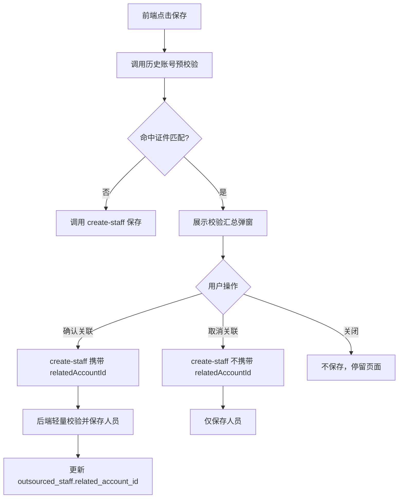
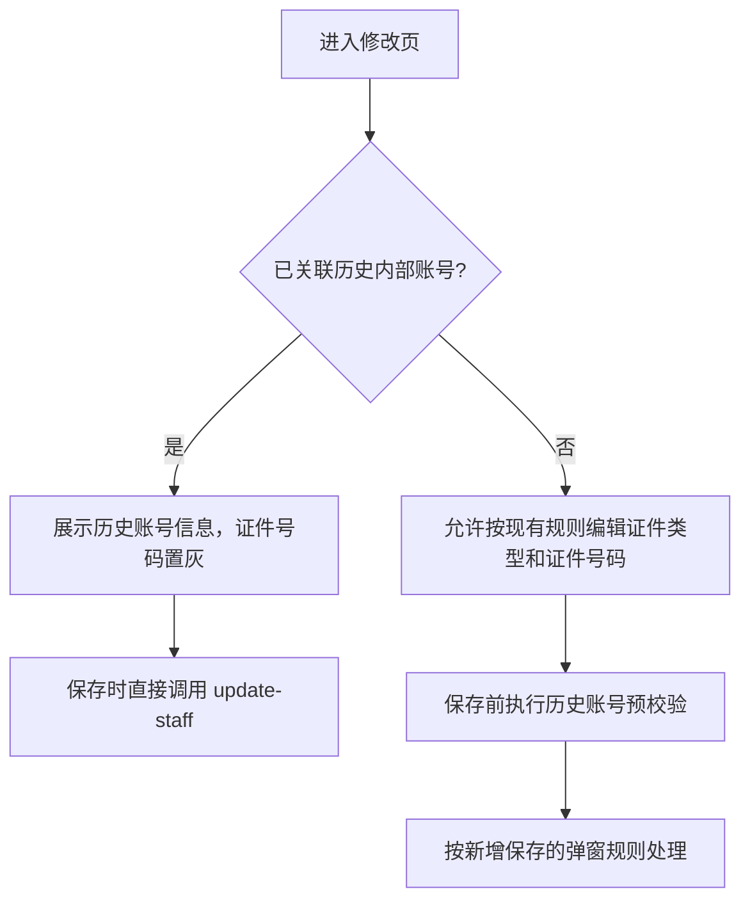

# 外包人员关联历史内部账号系分

## 1. 背景

外包人员新增、修改时，需要根据证件类型和证件号码识别是否存在历史内部账号，并由用户确认是否建立内外部账号关联。关联后，在入场审核通过创建外部账号阶段，需要复用内部账号的照片、非岗位权限和业务数据，并存储内外部账号关联关系，供账号中心和后续查询使用。

本次涉及两个现有接口：

- `POST /platform/api/aboss/hrms/staff/create-staff`
- `POST /platform/api/aboss/hrms/staff/update-staff`

## 2. 设计目标

1. 新增/修改外包人员保存前，按证件类型、证件号码匹配历史内部账号。
2. 命中内部账号后，返回校验结果给前端展示确认弹窗。
3. 用户确认关联时，保存外包人员和内部账号关联关系；用户取消关联时，仅保存外包人员。
4. 修改/详情页只读展示“历史账号信息”模块。
5. 入场审核通过后创建外部账号时，根据关联关系执行手机号、虚拟号、权限、照片和业务数据同步处理。
6. 关联处理失败时不吞异常，保留审批单失败原因并支持现有重试链路。

## 3. 页面规则

### 3.1 新增页面

- 页面初始不展示“历史账号信息”模块。
- 点击保存时先触发历史内部账号校验。
- 未命中证件匹配时，不展示弹窗，直接保存。
- 命中证件匹配时，展示校验汇总弹窗。用户点击“确认关联”后保存并关联；点击“取消关联”后保存但不关联；点击右上角关闭时不保存，停留在当前页面。

### 3.2 修改/详情页面

- 外包人员曾关联过历史内部账号时，展示“历史账号信息”模块。
- 模块只读，不允许编辑。
- 只要外包人员曾关联过历史内部账号，修改页证件号码置灰，不允许修改，避免修改后触发重新关联。
- 外包人员未关联过历史内部账号时，可以修改证件类型、证件号码；保存时必须先走历史内部账号四项校验。

## 4. 接口设计

### 4.1 保存前校验接口

建议新增独立预校验接口，避免 `create-staff` / `update-staff` 同时承担“校验弹窗”和“真实保存”两种职责。

- `POST /platform/api/aboss/hrms/staff/check-history-internal-account`

#### 4.1.1 前端调用时机

该接口只做校验和弹窗判断，不保存人员信息。

| 页面 | 调用时机 |
| --- | --- |
| 新增页面 | 用户点击保存时，先调用该接口 |
| 修改页面 | 未关联历史账号时，保存前先调用该接口，已关联则不调用 |
| 详情页面 | 不调用该接口 |

#### 4.1.2 请求字段

请求 DTO：`CheckHistoryInternalAccountCmd`

| 字段 | 类型 | 必填 | 说明 |
| --- | --- | --- | --- |
| staffId | String | 否 | 修改场景传入 |
| certificateType | String | 是 | 证件类型，非身份证同样按类型+号码匹配 |
| certificateNumber | String | 是 | 证件号码 |
| branchOrgCode | String | 是 | 外包人员归属机构 |
| picture | String | 否 | 外包人员本次上传的照片文件 ID；为空时后端校验命中的内部账号是否存在照片 |
| operationType | String | 是 | `CREATE` / `UPDATE` |

新增页面请求示例：

```json
{
  "certificateType": "ID_CARD",
  "certificateNumber": "xxx",
  "branchOrgCode": "010100",
  "picture": "外包人员上传的照片文件ID",
  "operationType": "CREATE"
}
```

修改页面请求示例：

```json
{
  "staffId": "外包人员ID",
  "certificateType": "ID_CARD",
  "certificateNumber": "xxx",
  "branchOrgCode": "010100",
  "picture": "外包人员上传的照片文件ID",
  "operationType": "UPDATE"
}
```

说明：前端未上传照片时，`picture` 可不传或传空。后端在执行四项历史账号规则前校验照片：未命中内部账号时直接提示上传照片；命中内部账号时检查内部账号 `faceId`，内外部均无照片时提示上传照片后重新关联。

#### 4.1.3 返回字段

返回 DTO：`HistoryInternalAccountCheckDTO`

| 字段                | 类型      | 说明                           |
| ----------------- | ------- | ---------------------------- |
| needPopup         | Boolean | 是否需要展示弹窗                     |
| canLink           | Boolean | 是否允许确认关联                     |
| internalAccountId | String  | 命中的内部账号；用户点击“确认关联”时，保存接口回传该值 |
| ruleResults       | List    | 四项规则命中结果                     |
| message           | String  | 前端弹窗提示语                      |

说明：内部账号姓名、机构、离职日期、已关联外包账号等信息由后端拼入 `message`，前端不需要单独解析字段。

`ruleResults` 固定返回四条规则，前端按 `hit` 展示“已命中/未命中”。

| 字段 | 类型 | 说明 |
| --- | --- | --- |
| ruleCode | String | 规则编码：`CERT_MATCH`、`ORG_MATCH`、`LINK_STATUS`、`EMP_STATUS` |
| ruleName | String | 规则名称 |
| hit | Boolean | 是否命中 |

返回示例：不需要弹窗，前端直接保存。

```json
{
  "needPopup": false,
  "canLink": false,
  "ruleResults": [
    {
      "ruleCode": "CERT_MATCH",
      "ruleName": "外包人员的证件号码与某个内部账号的证件号码一致性",
      "hit": false
    },
    {
      "ruleCode": "ORG_MATCH",
      "ruleName": "外包人员与内部账号归属机构一致性",
      "hit": false
    },
    {
      "ruleCode": "LINK_STATUS",
      "ruleName": "内部账号的关联状态",
      "hit": false
    },
    {
      "ruleCode": "EMP_STATUS",
      "ruleName": "内部账号的在职状态",
      "hit": false
    }
  ]
}
```

返回示例：只命中校验一，展示确认关联弹窗。

```json
{
  "needPopup": true,
  "canLink": true,
  "internalAccountId": "internal001",
  "message": "当前账号与匹配的内部账号【张三 - internal001】所属机构不一致，确认关联后，仅同步照片，非岗位权限、业务数据无法同步。",
  "ruleResults": [
    {
      "ruleCode": "CERT_MATCH",
      "ruleName": "外包人员的证件号码与某个内部账号的证件号码一致性",
      "hit": true
    },
    {
      "ruleCode": "ORG_MATCH",
      "ruleName": "外包人员与内部账号归属机构一致性",
      "hit": false
    },
    {
      "ruleCode": "LINK_STATUS",
      "ruleName": "内部账号的关联状态",
      "hit": false
    },
    {
      "ruleCode": "EMP_STATUS",
      "ruleName": "内部账号的在职状态",
      "hit": false
    }
  ]
}
```

返回示例：命中校验一和校验二，展示确认关联弹窗。

```json
{
  "needPopup": true,
  "canLink": true,
  "internalAccountId": "internal001",
  "message": "当前账号匹配的内部账号【张三 - internal001】，确认关联后将自动同步以下内容：非岗位权限、照片、原内部账号业务数据",
  "ruleResults": [
    {
      "ruleCode": "CERT_MATCH",
      "ruleName": "外包人员的证件号码与某个内部账号的证件号码一致性",
      "hit": true
    },
    {
      "ruleCode": "ORG_MATCH",
      "ruleName": "外包人员与内部账号归属机构一致性",
      "hit": true
    },
    {
      "ruleCode": "LINK_STATUS",
      "ruleName": "内部账号的关联状态",
      "hit": false
    },
    {
      "ruleCode": "EMP_STATUS",
      "ruleName": "内部账号的在职状态",
      "hit": false
    }
  ]
}
```

返回示例：只提示，不允许保存本次关联。

```json
{
  "needPopup": true,
  "canLink": false,
  "internalAccountId": "internal001",
  "message": "当前匹配内部账号internal001已綁定外部账号【张三-internal001】。\n若该外包人员状态为已离场时，返聘操作优先复用当前外部账号。",
  "ruleResults": [
    {
      "ruleCode": "CERT_MATCH",
      "ruleName": "外包人员的证件号码与某个内部账号的证件号码一致性",
      "hit": true
    },
    {
      "ruleCode": "ORG_MATCH",
      "ruleName": "外包人员与内部账号归属机构一致性",
      "hit": true
    },
    {
      "ruleCode": "LINK_STATUS",
      "ruleName": "内部账号的关联状态",
      "hit": true
    },
    {
      "ruleCode": "EMP_STATUS",
      "ruleName": "内部账号的在职状态",
      "hit": false
    }
  ]
}
```

返回示例：内部账号已离职，仍允许确认关联。

```json
{
  "needPopup": true,
  "canLink": true,
  "internalAccountId": "internal001",
  "message": "匹配的内部账号【张三 - internal001】已于2026-07-23离职。确认关联后，将自动同步以下内容：非岗位权限、照片、原内部账号业务数据。\n注意：若离职日期超当月月底，将无法同步非岗位权限。",
  "ruleResults": [
    {
      "ruleCode": "CERT_MATCH",
      "ruleName": "外包人员的证件号码与某个内部账号的证件号码一致性",
      "hit": true
    },
    {
      "ruleCode": "ORG_MATCH",
      "ruleName": "外包人员与内部账号归属机构一致性",
      "hit": true
    },
    {
      "ruleCode": "LINK_STATUS",
      "ruleName": "内部账号的关联状态",
      "hit": false
    },
    {
      "ruleCode": "EMP_STATUS",
      "ruleName": "内部账号的在职状态",
      "hit": true
    }
  ]
}
```

#### 4.1.4 前端处理规则

| 返回结果 | 前端处理 |
| --- | --- |
| `needPopup = false` | 直接调用保存接口 |
| `needPopup = true` 且 `canLink = true` | 展示校验结果汇总弹窗，并在确认关联弹窗中展示“确认关联”“取消”按钮 |
| `needPopup = true` 且 `canLink = false` | 展示校验结果汇总弹窗，并在账号关联提示弹窗中展示“我知道了”按钮，不调用保存接口 |

说明：`needPopup = false` 表示未命中历史内部账号，前端直接保存，等同于不关联历史账号；保存接口不传 `relatedAccountId`。

校验结果汇总弹窗展示要求：

- 弹窗中展示 `message`。
- 弹窗中展示 `ruleResults` 四条规则，并按 `hit` 标识“已命中/未命中”。
- `canLink = true` 时，弹窗按钮为“确认关联”“取消”。
- `canLink = false` 时，弹窗按钮为“我知道了“。

确认账号关联弹窗按钮：

| 用户操作 | 前端处理 |
| --- | --- |
| 确认关联 | 调用保存接口，传 `relatedAccountId = internalAccountId` |
| 取消 | 调用保存接口，不传或置空 `relatedAccountId` |

账号关联提示弹窗按钮：

| 用户操作 | 前端处理 |
| --- | --- |
| 我知道了 | 关闭弹窗，停留当前页面 |

### 4.2 详情接口改造

现有接口保持不变：

- `POST /platform/api/aboss/hrms/staff/query-staff-detail`

前端进入修改页或详情页时，继续调用该接口获取人员详情。接口返回值 `QueryStaffDetailDTO` 新增 `relatedAccountId` 字段，用于展示“历史账号信息”模块。

#### 4.2.1 前端调用时机

| 页面 | 调用时机 |
| --- | --- |
| 修改页面 | 进入页面时调用 |
| 详情页面 | 进入页面时调用 |
| 新增页面 | 不调用详情接口，不展示“历史账号信息”模块 |

#### 4.2.2 返回字段

`QueryStaffDetailDTO` 新增字段：

| 字段 | 类型 | 说明 |
| --- | --- | --- |
| relatedAccountId | String | 关联历史账号，对应员工 RPC 返回的 `employeeCode`；为空表示未关联过历史内部账号 |

#### 4.2.3 前端展示规则

| 返回结果 | 前端处理 |
| --- | --- |
| `relatedAccountId` 为空 | 不展示“历史账号信息”模块 |
| `relatedAccountId` 不为空 | 展示“历史账号信息”模块，只读显示关联历史账号 |

模块展示内容：

| 字段 | 展示文案 |
| --- | --- |
| relatedAccountId | 关联历史账号 |

返回示例：

```json
{
  "staffId": "外包人员ID",
  "displayName": "张三",
  "certificateType": "ID_CARD",
  "certificateNumber": "xxx",
  "staffStatus": "0",
  "relatedAccountId": "internal001"
}
```

### 4.3 新增员工接口改造

现有接口保持不变：

- `POST /platform/api/aboss/hrms/staff/create-staff`

新增员工仍调用原接口，不新增保存接口。前端点击保存时，先调用 4.1 预校验接口，再根据预校验结果决定是否调用 `create-staff`。

#### 4.3.1 前端页面展示规则

| 场景 | 前端处理 |
| --- | --- |
| 进入新增页面 | 不展示“历史账号信息”模块 |
| 预校验命中历史账号 | 只展示弹窗，不在新增页面常驻展示“历史账号信息”模块 |
| 用户确认关联并保存成功 | 后续进入修改/详情页时，通过详情接口展示关联历史账号 |

#### 4.3.2 前端保存流程

用户点击保存时：

1. 前端先调用 `check-history-internal-account`。
2. 如果 `needPopup = false`，直接调用 `create-staff` 保存。
3. 如果 `needPopup = true` 且 `canLink = true`，展示确认账号关联弹窗。
4. 如果 `needPopup = true` 且 `canLink = false`，展示提示弹窗，不调用 `create-staff`。

流程表：

| 预校验结果 | 前端处理 |
| --- | --- |
| `needPopup = false` | 直接调用 `create-staff` |
| `needPopup = true` 且 `canLink = true` | 弹窗让用户选择确认关联或取消关联 |
| `needPopup = true` 且 `canLink = false` | 只提示，不保存 |

#### 4.3.3 弹窗按钮处理

确认账号关联弹窗：

| 用户操作 | 前端处理 |
| --- | --- |
| 点击“确认关联” | 调用 `create-staff`，传 `relatedAccountId` |
| 点击“取消关联” | 调用 `create-staff`，不传或置空 `relatedAccountId` |
| 点击右上角关闭 | 不调用 `create-staff`，停留在当前页面 |

账号关联提示弹窗：

| 用户操作 | 前端处理 |
| --- | --- |
| 点击“我知道了” | 关闭弹窗，停留在当前页面 |
| 点击右上角关闭 | 关闭弹窗，停留在当前页面 |

#### 4.3.4 `create-staff` 请求字段

`CreateStaffCmd` 建议新增字段：

| 字段 | 类型 | 必填 | 说明 |
| --- | --- | --- | --- |
| relatedAccountId | String | 否 | 用户点击“确认关联”时，传入预校验返回的 `internalAccountId`；不传表示不关联 |

确认关联示例：

```json
{
  "displayName": "张三",
  "phone": "13800000000",
  "certificateType": "ID_CARD",
  "certificateNumber": "xxx",
  "branchOrgCode": "010100",
  "operatingOrgCode": "010000",
  "agreementNo": "AGR001",
  "projectCode": "PRJ001",
  "businessCategory": "xxx",
  "relatedAccountId": "internal001"
}
```

取消关联示例：

```json
{
  "displayName": "张三",
  "phone": "13800000000",
  "certificateType": "ID_CARD",
  "certificateNumber": "xxx",
  "branchOrgCode": "010100",
  "operatingOrgCode": "010000",
  "agreementNo": "AGR001",
  "projectCode": "PRJ001",
  "businessCategory": "xxx"
}
```

#### 4.3.5 后端处理规则

- `relatedAccountId` 有值时，后端执行确认关联轻量一致性校验；校验通过后保存到 `outsourced_staff.related_account_id`，并从账号中心查询内部账号照片 fileId 写入 `outsourced_staff.picture`。
- `relatedAccountId` 为空时，只保存外包人员，不关联历史账号。
- 如果前端绕过预校验直接传入 `relatedAccountId`，后端仍以保存时轻量一致性校验结果为准。

### 4.4 修改员工接口改造

现有接口保持不变：

- `POST /platform/api/aboss/hrms/staff/update-staff`

修改员工仍调用原接口，不新增修改接口。前端只需要在特定场景下，先调用历史账号预校验接口，再根据用户弹窗选择调用 `update-staff`。

#### 4.4.1 前端页面展示规则

进入修改页时，前端根据详情接口返回的 `relatedAccountId` 判断是否展示“历史账号信息”模块：

| 场景 | 前端处理 |
| --- | --- |
| `relatedAccountId` 为空 | 不展示“历史账号信息”模块 |
| `relatedAccountId` 不为空 | 展示“历史账号信息”模块，只读显示关联历史账号 |

证件字段编辑规则：

| 场景 | 前端处理 |
| --- | --- |
| 已关联历史内部账号 | 证件号码置灰，不允许修改 |
| 未关联历史内部账号 | 证件类型、证件号码允许编辑；保存时必须走预校验 |

#### 4.4.2 前端保存流程

用户点击保存时，前端先判断该外包人员是否已关联历史内部账号。

已关联历史内部账号时，修改页证件号码已置灰，不允许修改；保存时不再触发历史内部账号预校验，直接调用 `update-staff` 保存其他可编辑信息。

未关联历史内部账号时，证件类型、证件号码允许编辑；点击保存先调用 `check-history-internal-account` 执行四项校验，再根据预校验结果决定是否调用 `update-staff`。

| 场景 | 前端处理 |
| --- | --- |
| 已关联历史内部账号 | 证件号码置灰，不允许修改；保存时直接调用 `update-staff` |
| 未关联历史内部账号 | 点击保存先调用 `check-history-internal-account` 预校验，按四项校验规则判断 |

预校验结果处理：

| 预校验结果 | 前端处理 |
| --- | --- |
| `needPopup = false` | 直接调用 `update-staff` 保存 |
| `needPopup = true` 且 `canLink = true` | 展示确认账号关联弹窗 |
| `needPopup = true` 且 `canLink = false` | 展示账号关联提示弹窗，不调用保存接口 |

#### 4.4.3 弹窗按钮处理

确认账号关联弹窗：

| 用户操作 | 前端处理 |
| --- | --- |
| 点击“确认关联” | 调用 `update-staff`，传 `relatedAccountId` |
| 点击“取消” | 调用 `update-staff`，不传或置空 `relatedAccountId` |

账号关联提示弹窗：

| 用户操作 | 前端处理 |
| --- | --- |
| 点击“我知道了” | 关闭弹窗，停留在当前页面 |

#### 4.4.4 `update-staff` 请求字段

`UpdateStaffCmd` 继承 `CreateStaffCmd`，因此复用新增字段：

| 字段 | 类型 | 必填 | 说明 |
| --- | --- | --- | --- |
| relatedAccountId | String | 否 | 用户点击“确认关联”时，传入预校验返回的 `internalAccountId`；不传表示不关联 |

确认关联示例：

```json
{
  "staffId": "外包人员ID",
  "displayName": "张三",
  "certificateType": "ID_CARD",
  "certificateNumber": "xxx",
  "branchOrgCode": "xxx",
  "relatedAccountId": "internal001"
}
```

取消关联示例：

```json
{
  "staffId": "外包人员ID",
  "displayName": "张三",
  "certificateType": "ID_CARD",
  "certificateNumber": "xxx",
  "branchOrgCode": "xxx"
}
```

#### 4.4.5 后端处理规则

- 已关联历史内部账号时，不允许修改证件号码；后端需以数据库原值为准校验，防止前端绕过置灰直接提交。
- 未关联历史内部账号且保存接口传入 `relatedAccountId` 时，后端执行确认关联轻量一致性校验。
- 确认关联后，写入或更新关联关系，并从账号中心查询内部账号照片 fileId 写入 `outsourced_staff.picture`；取消关联后，仅保存人员基础信息。

## 5. 校验规则

校验顺序固定为：校验一 -> 校验二 -> 校验三 -> 校验四。校验一未命中时终止，不展示弹窗；校验三命中时终止，不再执行校验四，因为内部账号已被关联时不允许本次继续关联。

内部员工基础信息统一通过员工 RPC 查询：

| 项 | 内容 |
| --- | --- |
| RPC 包名 | `com.aliyun.fsi.insurance.facade.employee.rpc` |
| RPC 类名 | `EmployeeBasicRpcFacade` |
| RPC 方法 | `getEmployeeDetailByCertNumber` |
| RPC 入参 | `EmployeeCertQueryDTO` |

查询入参建议：

| 入参字段 | 取值 |
| --- | --- |
| certType | 外包人员证件类型；为空时员工 RPC 默认按 `111` 身份证查询 |
| certNumber | 外包人员证件号码 |

说明：该接口直接按证件类型、证件号码查询员工详情，适合作为校验一的数据来源。若入参 `certType` 为空，员工 RPC 默认按 `111` 身份证查询；HRMS 传参时建议显式传入外包人员证件类型，兼容非身份证场景。

RPC 返回字段使用说明：

| 返回字段 | 用途 |
| --- | --- |
| employeeCode | 内部员工账号，作为 `relatedAccountId` / `internalAccountId` |
| employeeName | 内部员工姓名，用于弹窗展示“姓名 - 账号” |
| certificateType | 内部员工证件类型，用于校验一 |
| certificateNumber | 内部员工证件号码，用于校验一 |
| branchOrgCode | 内部员工归属机构，用于校验二 |
| branchOrgName | 内部员工归属机构名称，用于弹窗展示或日志 |
| employeeStatus | 内部员工在职状态，用于校验四 |
| leaveCompanyDate | 内部员工离职日期，用于校验四和弹窗提示 |

| 规则 | 逻辑 | 前置条件 | 结果 |
| --- | --- | --- | --- |
| 校验一 | 调用 `EmployeeBasicRpcFacade#getEmployeeDetailByCertNumber`，入参传 `certType`、`certNumber` 查询证件一致的内部员工 | 无 | 未命中则不弹窗，直接保存 |
| 校验二 | 比较外包人员归属机构与 RPC 返回的 `branchOrgCode` | 命中校验一 | 不一致仍可确认关联，但只同步照片 |
| 校验三 | 使用 RPC 返回的 `employeeCode` 查询 HRMS 本地是否已有其他有效外包人员占用该关联账号 | 命中校验一、二 | 已关联则只提示，不允许保存本次关联 |
| 校验四 | 根据 RPC 返回的 `employeeStatus`、`leaveCompanyDate` 判断内部员工是否离职 | 命中校验一、二 | 已离职仍可确认关联，但提示离职日期和权限同步限制 |

说明：校验三的内部员工账号来源于 RPC 返回的 `employeeCode`，但员工基础 RPC 返回样例中不包含外部账号关联状态。由于历史内部账号关联入口在 HRMS，账号中心关联关系在后续入场创建外部账号时才建立，因此校验三只查询 HRMS 本地表：

1. 查询 HRMS `outsourced_staff.related_account_id = employeeCode` 且非当前外包人员的有效记录。
2. 如存在记录，说明该内部账号已被其他外包人员确认关联，视为校验三命中，不允许本次继续确认关联。
3. 校验三不查询账号中心；账号中心只在入场创建外部账号时根据 `relatedAccountId` 建立内外部账号关联。

弹窗场景：

| 场景 | 命中规则 | 类型 | 后端建议 |
| --- | --- | --- | --- |
| 场景一 | 仅命中校验一 | 确认账号关联 | 允许保存，允许选择关联或不关联；关联后仅同步照片 |
| 场景二 | 命中校验一、二 | 确认账号关联 | 允许保存，允许选择关联或不关联；关联后同步非岗位权限、照片和原内部账号业务数据 |
| 场景三 | 命中校验一、二、三 | 账号关联提示 | 不允许保存本次关联；提示返聘已关联的外包账号 |
| 场景四 | 命中校验一、二、四 | 确认账号关联 | 允许保存，允许选择关联或不关联；若离职日期超过当月月底，不同步非岗位权限 |

## 6. 数据设计

### 6.1 `outsourced_staff` 新增字段

本期前端只需要展示“关联历史账号”，不需要展示内部账号姓名、机构、证件等扩展信息。为降低开发复杂度，不新增独立关联表，直接在 `outsourced_staff` 增加字段。

```sql
ALTER TABLE `outsourced_staff`
  ADD COLUMN `related_account_id` varchar(64) DEFAULT NULL COMMENT '关联历史内部账号ID' AFTER `account_id`,
  ADD KEY `idx_related_account_id` (`related_account_id`);
```

字段说明：

| 字段 | 说明 |
| --- | --- |
| related_account_id | 关联历史账号，对应员工 RPC 返回的 `employeeCode`，也是账号中心 `relatedAccountId` 使用的内部账号 ID |

使用规则：

- 用户确认关联后，保存 `outsourced_staff.related_account_id = internalAccountId`。
- 用户取消关联时，`related_account_id` 置空。
- 详情页展示历史账号时，直接返回 `related_account_id`。
- 修改页判断是否已关联历史账号时，直接判断 `related_account_id` 是否为空。
- 内部账号是否已被其他外包账号关联，以 HRMS `outsourced_staff.related_account_id` 是否被其他有效外包人员占用为准。

### 6.2 查询展示

`query-staff-detail` 返回的 `QueryStaffDetailDTO` 建议新增：

| 字段 | 类型 | 说明 |
| --- | --- | --- |
| relatedAccountId | String | 关联历史账号；为空表示未关联 |

## 7. 集成设计

### 7.1 员工基础信息 RPC

历史内部账号校验使用员工基础信息 RPC，不通过账号中心查询内部员工基础信息。

| 项 | 内容 |
| --- | --- |
| RPC 包名 | `com.aliyun.fsi.insurance.facade.employee.rpc` |
| RPC 类名 | `EmployeeBasicRpcFacade` |
| RPC 方法 | `getEmployeeDetailByCertNumber` |
| RPC 入参 | `EmployeeCertQueryDTO` |

查询入参建议：

| 入参字段 | 取值 |
| --- | --- |
| certType | 外包人员证件类型；为空时员工 RPC 默认按 `111` 身份证查询 |
| certNumber | 外包人员证件号码 |

说明：员工 RPC 支持按证件类型和证件号码查询详情；HRMS 传参时建议显式传入 `certType`，避免非身份证场景按默认身份证查询。

返回样例字段映射：

| RPC 字段 | HRMS 使用字段 | 说明 |
| --- | --- | --- |
| employeeCode | relatedAccountId / internalAccountId | 关联历史账号 |
| employeeName | internalDisplayName | 弹窗展示姓名 |
| certificateType | certificateType | 证件类型 |
| certificateNumber | certificateNumber | 证件号码 |
| branchOrgCode | internalOrgCode | 内部员工归属机构 |
| branchOrgName | internalOrgName | 内部员工归属机构名称 |
| employeeStatus | internalEmployeeStatus | 内部员工状态 |
| leaveCompanyDate | internalLeaveDate | 内部员工离职日期 |

建议新增 `EmployeeIntegration` 封装该 RPC，避免领域层直接依赖 RPC Facade：

- `EmployeeIntegration#getEmployeeDetailByCertNumber(EmployeeCertQueryDTO queryDTO)`
- `EmployeeIntegration#queryByCertificate(certificateType, certificateNumber)`：集成层内部调用 `getEmployeeDetailByCertNumber`。

### 7.2 账号中心

`AccountIntegration` 当前已有：

- `accountInfoByAccId`
- `accountListByAccountIds`
- `createExternalAccount`
- `updateExternalAccount`
- `rehiredExternalAccount`
- `invalidExternalAccount`

账号中心 `AccountRpcFacade` 1.3.6-SNAPSHOT 已支持内外部账号关联：

| 接口/字段 | 用途 |
| --- | --- |
| `ExternalAccountAddCmd.relatedAccountId` | 创建外部账号时传入关联内部账号，账号中心自动建立双向关联 |
| `ExternalAccountUpdateCmd.relatedAccountId` | 修改外部账号时传入关联内部账号，账号中心自动建立双向关联 |
| `ExternalAccountUpdateCmd.accId` | 修改外部账号优先使用账号 ID，不再优先使用 `externalId` |
| `ExternalAccountInvalidCmd.accId` | 离职外部账号优先使用账号 ID |
| `ExternalAccountRehiredCmd.accId` | 返聘外部账号优先使用账号 ID |
| `UnbindExternalAccountCmd` | 解除外部账号关联关系，当前无关联时幂等返回 |

本次账号中心能力使用方式：

| 场景 | 处理 |
| --- | --- |
| 校验三：内部账号是否已被关联 | 查 HRMS 本地 `outsourced_staff.related_account_id` 是否已被其他有效外包人员占用；账号中心不参与该校验 |
| 入场审核通过创建外部账号 | 调用 `createExternalAccount` 时传 `relatedAccountId = outsourced_staff.related_account_id` |
| 确认关联保存照片 | `create-staff` / `update-staff` 确认关联时，查询内部账号照片 fileId，保存到 `outsourced_staff.picture`；入场创建外部账号时沿用现有 `picture -> ExternalAccountAddCmd.faceId` 逻辑 |


### 7.3 HR 系统推送

建立关联后，内部账号对应组织人员除离职外，不再接收 HR 系统推送的人变更数据。该规则由账号中心 support 的内部账户 MQ 消费逻辑承接：账号中心可通过外部账号 `relatedAccountId = 内部账号 ID` 判断该内部账号已被外部账号关联；员工状态为在岗/实习时跳过变更处理，离职状态仍正常处理。

## 8. 保存流程

### 8.1 新增保存

本节描述的是新增外包人员基础信息保存阶段，即调用 `create-staff` 写入 `outsourced_staff`。此阶段不创建外部账号，不调用账号中心建立 `relatedAccountId`；账号中心关联处理在入场审核通过后执行，见第 9 节。

新增保存分支：

| 场景 | 前端处理 | 后端处理 |
| --- | --- | --- |
| 未命中校验一 | 不展示确认关联弹窗，直接调用 `create-staff` | 保存外包人员基础信息，`related_account_id` 为空 |
| 只命中校验一 | 展示校验结果汇总弹窗；用户可点“确认关联”或“取消” | 确认关联时保存 `related_account_id = internalAccountId`；取消时只保存人员基础信息 |
| 命中校验一、二 | 展示校验结果汇总弹窗；用户可点“确认关联”或“取消” | 确认关联时保存 `related_account_id = internalAccountId`；取消时只保存人员基础信息 |
| 命中校验一、二、三 | 展示校验结果汇总弹窗和“我知道了”按钮 | 不调用 `create-staff`，停留当前页面 |
| 命中校验一、二、四 | 展示校验结果汇总弹窗；用户可点“确认关联”或“取消” | 确认关联时保存 `related_account_id = internalAccountId`；取消时只保存人员基础信息 |

`create-staff` 保存规则：

- 前端点击“确认关联”时，`create-staff` 请求携带 `relatedAccountId`。
- 前端点击“取消”或未命中历史账号时，`create-staff` 请求不携带 `relatedAccountId`。
- 后端收到 `relatedAccountId` 后执行确认关联轻量一致性校验，校验通过后写入 `outsourced_staff.related_account_id`。
- 后端确认关联时，同步查询内部账号照片 fileId，并写入 `outsourced_staff.picture`，后续入场创建外部账号时直接使用该 `picture` 作为 `ExternalAccountAddCmd.faceId`。
- 后端不在本阶段调用 `createExternalAccount`，也不在本阶段同步权限、虚拟手机号。

确认关联轻量一致性校验：

1. 仅在保存接口传入 `relatedAccountId` 时执行；未传时不执行该校验。
2. 校验 `relatedAccountId` 对应内部账号仍存在，且证件类型、证件号码与本次保存的外包人员证件信息一致。
3. 校验该内部账号仍未被其他外包账号关联：查 HRMS 本地是否存在其他有效外包人员占用该 `related_account_id`；如存在，本次保存失败。
4. 查询内部账号照片 fileId；照片为空或查询失败时，本次保存失败。
5. 轻量一致性校验只做保存兜底，不重新组装弹窗文案，也不返回四项规则明细。



### 8.2 修改保存



## 9. 入场审核通过后处理

触发点：`OutsourcedStaffApprovalHandler#handleOnboardApplication` 中创建或返聘外部账号成功后。

### 9.1 自动处理逻辑

| 处理项 | 规则 | 实现 |
| --- | --- | --- |
| 内部账号分配虚拟手机号 | 自动给关联的内部账号分配虚拟手机号；关联账号间手机号不冲突时，可不重新分配 | 机构 |
| 权限同步               | 岗位权限不自动同步，本期通过用户单独授权处理；非岗位权限自动同步内部账号权限给外部账号 | 权限 |
| 照片同步               | 只要用户确认关联并保存了 `related_account_id`，新增/修改保存时就查询内部账号照片并写入外包人员 `picture`；入场创建外部账号时沿用现有 `picture -> ExternalAccountAddCmd.faceId` 逻辑 | hrms |
| 关联关系存储           | 存储内部账号和外部账号的关联关系                             | hrms |
| HR 系统数据推送        | 组织人员不再接收除离职外的 HR 系统人员变更数据               | 账号 |

照片带入规则：

1. 新增/修改外包人员时，用户点击“确认关联”并调用保存接口，HRMS 根据 `relatedAccountId` 查询账号中心内部账号照片 fileId。
2. 内部账号照片 fileId 查询成功后，保存 `outsourced_staff.related_account_id`，同时将内部账号照片 fileId 写入 `outsourced_staff.picture`。
3. 用户点击“取消关联”或未命中历史账号时，不覆盖外包人员 `picture`，按用户上传照片保存。
4. 内部账号照片查询失败或照片为空时，本次 `create-staff` / `update-staff` 保存失败并提示原因；不降级使用外包人员原照片完成关联保存。
5. 入场审核通过创建外部账号时，不再临时查询内部账号照片，沿用现有 `staffEntity.getPicture()` 组装 `ExternalAccountAddCmd.faceId`。

### 9.2 MQ 消息处理

本需求涉及两类 MQ，职责不同：

| MQ | 发送方/消费方 | 触发时机 | 处理规则 |
| --- | --- | --- | --- |
| 外包人员变更 MQ | HRMS 发送，现有 `OutsourcedStaffChangeHandler` 处理发送 | 入场审核通过并创建外部账号成功后，HRMS 更新外包人员状态为已入场后发送 | 沿用现有外包人员变更消息，不新增独立 MQ；消息体为外包人员详情 DTO，用于通知下游外包人员信息变化 |

HRMS 外包人员变更 MQ 配置：

| 配置项 | 值 |
| --- | --- |
| Topic | `TP_CIC_MIDABOSS_HRMS_OUTSOURCED_STAFF` |
| Tag | `TG_CIC_MIDABOSS_HRMS_OUTSOURCED_STAFF` |
| 发送代码 | `OutsourcedStaffChangeHandler#handle` |
| 触发位置 | 入场审核通过后，`OutsourcedStaffApprovalHandler#handleOnboardApplication` 调用 `outsourcedStaffChangeHandler.handle(staffEntity)` |

HRMS 外包人员变更 MQ 消息体新增字段：

| 字段 | 类型 | 说明 | 来源 |
| --- | --- | --- | --- |
| relatedAccountId | String | 关联历史内部账号 ID | `outsourced_staff.related_account_id` |
| creator | String | 外包人员创建人 | `outsourced_staff.creator` |

说明：外包人员变更 MQ 仍沿用现有 Topic/Tag 和发送链路，只是在消息体 DTO 中补充 `relatedAccountId`、`creater` 两个字段，保证和 HRMS 详情接口字段命名一致。账号中心侧仍使用 `relatedAccountId` 写入 `t_abs_sso_account.related_account_id` 并在账号中心查询接口中返回。
