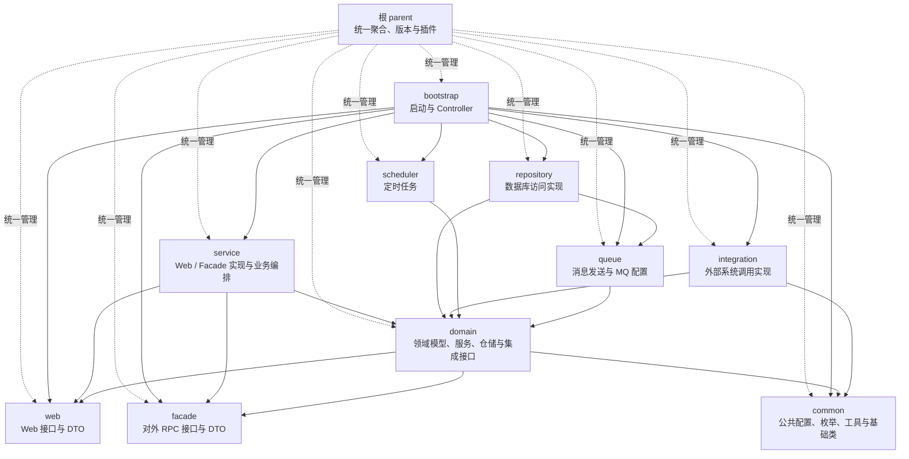
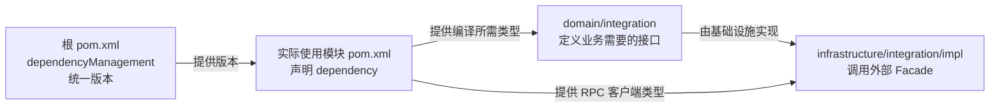
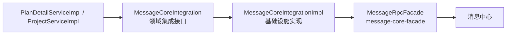

# HRMS Maven 模块与依赖说明

> 项目：`aboss-property-hrms`  
> 依据：根 `pom.xml`、10 个子模块 `pom.xml` 及主要源码目录  
> 整理日期：2026-07-31

## 一、先看结论

HRMS 是一个 Maven 聚合项目。根 `pom.xml` 主要负责：

1. 聚合 10 个子模块；
2. 在 `dependencyManagement` 中统一管理内部模块和第三方依赖的版本；
3. 统一 Maven 编译、源码打包等插件配置。

需要特别注意：`dependencyManagement` **只管理版本，不会自动把依赖引入模块**。真正使用某个依赖时，仍要在对应子模块的 `<dependencies>` 中声明。

## 二、模块依赖总图

箭头含义：`A --> B` 表示 **A 的 `pom.xml` 直接依赖 B**。



`bootstrap` 同时直接依赖多个模块，是因为它是最终运行和打包入口，需要把各层实现装配进同一个应用。部分依赖虽然可以传递获得，但当前项目选择了显式声明。

## 三、每个模块放什么

| 目录 | Maven artifactId | 主要内容 | 直接依赖的 HRMS 模块 |
|---|---|---|---|
| 根目录 | `aboss-property-hrms-parent` | 聚合模块、统一版本、BOM、构建插件 | 管理全部模块，不是业务实现模块 |
| `bootstrap` | `aboss-property-hrms-bootstrap` | `HrmsApplication`、HTTP Controller、配置文件、静态资源、最终打包 | service、repository、integration、scheduler、queue、web、facade、common |
| `common` | `aboss-property-hrms-common` | 公共配置、枚举、常量、异常、基础类、线程池、通用工具 | 无 |
| `domain` | `aboss-property-hrms-domain` | 领域模型、领域服务、仓储接口、外部集成接口、业务规则、PDF/Excel 领域处理 | web、facade、common |
| `web` | `aboss-property-hrms-web` | 面向 Controller 的 Web 接口，以及请求/响应 DTO | 无 |
| `facade` | `aboss-property-hrms-facade` | 提供给其他系统使用的 RPC 接口、事件和 DTO；使用独立版本号 | 无 |
| `service` | `aboss-property-hrms-service` | Web 接口实现、Facade 实现、业务编排、监听器、操作模板 | web、facade、domain |
| `infrastructure/repository` | `aboss-property-hrms-repository` | Entity、Mapper、Mapper XML、Converter、Repository 实现 | domain、queue |
| `infrastructure/integration` | `aboss-property-hrms-integration` | `domain` 中外部集成接口的实现，封装 RPC/外部服务调用 | domain、common |
| `infrastructure/scheduler` | `aboss-property-hrms-scheduler` | 协议、项目、人员状态等定时任务 Handler | domain |
| `infrastructure/queue` | `aboss-property-hrms-queue` | MQ 配置、消息发送服务实现 | domain |

## 四、各模块源码内容

### 1. bootstrap：应用入口和接口接入

主要内容：

- 启动类：`HrmsApplication`
- Controller：外包人员、协议、供应商、项目、项目计划、业务线、数据保障等
- 资源：`application.properties`、环境配置、静态文件、模板和字体
- 打包插件：Spring Boot、Docker、Smart Doc

典型调用入口：

```text
Controller -> web 接口 -> service 实现
```

### 2. common：跨模块公共能力

主要内容：

- `config`：线程池、MyBatis-Plus、日志 AOP 等配置
- `enums`、`constant`：业务枚举和常量
- `exception`、`base`：异常和基础对象
- `util`：日期、ID、Excel、集合、Spring 上下文等工具
- `context`：用户上下文

这里适合放真正会被多个模块复用、且不属于具体业务领域的代码。

### 3. domain：核心业务规则

主要目录：

- `model`：人员、协议、供应商、组织、消息等领域模型
- `service`：领域服务及其实现
- `repository`：仓储接口，只定义领域需要的数据能力
- `integration`：外部系统集成接口，只定义领域需要的外部能力
- `dataobject`、`pdf`：业务数据对象及协议 PDF 相关处理

外包人员、项目计划、协议、供应商、业务线等核心规则主要在这里。

### 4. web：系统内部 Web 契约

主要内容：

- `OutsourcedStaffWeb`、`HrmsAgreementWeb`、`HrmsSupplierWeb`
- `ProjectWeb`、`PlanDetailWeb`、`BusinessLineWeb`
- 各业务请求 DTO、响应 DTO、分页对象

它定义 Controller 可以调用什么，不负责业务实现。

### 5. facade：提供给其他系统的 RPC 契约

主要内容：

- `OutsourcedStaffFacade`
- 外包人员查询 DTO
- `OutsourcedStaffEvent`

该模块是其他系统的编译依赖，因此保持轻量，并通过 `${aboss.hrms.facade.version}` 使用独立版本。

### 6. service：应用编排和接口实现

主要内容：

- `*WebImpl`：实现 `web` 模块接口
- `OutsourcedStaffFacadeImpl`：实现对外 RPC Facade
- `listener`：流程、组织、协议、人员变化等事件监听器
- `template`：`AbossOperateTemplateBuilder` 操作模板
- `converter`：Web DTO 与领域对象转换

典型流程：

```text
WebImpl -> Domain Service -> Repository / Integration
```

### 7. repository：数据库访问

主要内容：

- `entity`：数据库实体
- `mapper`：MyBatis Mapper 接口
- `resources/mapper`：Mapper XML
- `converter`：Entity 与领域对象/DTO 转换
- `impl`：实现 `domain` 模块定义的 Repository 接口

数据库驱动、MyBatis、MyBatis-Plus 等依赖放在该模块。

### 8. integration：外部系统调用

主要内容：

- `OrganizationIntegrationImpl`
- `FlowIntegrationImpl`
- `AgreementIntegrationImpl`
- `AccountIntegrationImpl`
- `DocumentIntegrationImpl`
- `MessageCoreIntegrationImpl`
- 代码中心、权限、文件、供应商、用户搜索等集成实现

外部 RPC 的调用、参数转换和异常处理主要放在这里；`domain/integration` 放接口，`infrastructure/integration/impl` 放实现。

### 9. scheduler：定时任务入口

主要内容：

- 协议进入宽限期、到期终止、到期前通知
- 人员状态更新
- 项目初始化、项目关系通知、项目状态处理
- Redis 项目编码重置

任务入口负责触发，具体业务继续调用 `domain` 服务。

### 10. queue：消息队列能力

主要内容：

- MQ 配置和属性：`ProducerConfig`、`MqNormalProperties`、`PropertiesMq`
- 消息发送：`SendMessageService`、`SendMessageServiceImpl`

该模块负责消息基础设施，不承载核心业务规则。

## 五、外部依赖放在哪里

外部依赖通常涉及四个位置：



职责分别是：

1. **根 `pom.xml`**：统一维护版本，避免每个模块重复写版本号；
2. **子模块 `pom.xml`**：真正声明使用该依赖；
3. **`domain/integration`**：定义 HRMS 业务需要什么能力；
4. **`infrastructure/integration/impl`**：调用外部 RPC Facade 并实现领域接口。

当前项目中，不少外部 Facade 直接声明在 `domain/pom.xml`，原因是领域接口或领域模型直接引用了外部 Facade 的 DTO 类型。`infrastructure/integration` 依赖 `domain` 后，可以传递获得这些依赖。另有 `file-facade` 直接声明在 `infrastructure/integration/pom.xml`。

## 六、`message-core-facade` 实际路径

你给出的依赖：

```xml
<dependency>
    <groupId>com.aliyun.fsi.insurance</groupId>
    <artifactId>message-core-facade</artifactId>
    <version>1.2.0-RELEASE</version>
</dependency>
```

在 HRMS 中实际分为以下几处：

### 1. 根 `pom.xml`：管理版本

```xml
<dependencyManagement>
    <dependencies>
        <dependency>
            <groupId>com.aliyun.fsi.insurance</groupId>
            <artifactId>message-core-facade</artifactId>
            <version>1.2.0-RELEASE</version>
        </dependency>
    </dependencies>
</dependencyManagement>
```

### 2. `domain/pom.xml`：真正引入依赖

```xml
<dependency>
    <groupId>com.aliyun.fsi.insurance</groupId>
    <artifactId>message-core-facade</artifactId>
</dependency>
```

这里不再写版本，因为版本由根 `pom.xml` 统一管理。

### 3. `domain`：定义消息能力和业务模型

```text
domain/integration/MessageCoreIntegration.java
domain/model/message/SendMessageQueryModel.java
domain/service/impl/PlanDetailServiceImpl.java
domain/service/impl/ProjectServiceImpl.java
```

`domain` 中的接口和模型目前直接使用了 `message-core-facade` 的 `TemplateBO`、`LinkBO`、`MarkDownBO`、`TextBO` 等类型，所以 `domain/pom.xml` 必须能编译到该依赖。

### 4. `infrastructure/integration`：实现真正的 RPC 调用

```text
infrastructure/integration/impl/MessageCoreIntegrationImpl.java
```

该实现通过 `MessageRpcFacade` 调用消息中心。

完整调用链：



## 七、主要业务外部依赖分布与逐项示例

| 外部依赖 | 根 POM 版本 | 实际声明模块 | 主要用途/实现位置 |
|---|---:|---|---|
| `message-core-facade` | `1.2.0-RELEASE` | domain | 消息中心；`MessageCoreIntegrationImpl` |
| `customer-adapter-facade` | `1.3.9-SNAPSHOT` | domain | 客户/员工信息集成 |
| `aboss-sso-client` | `1.3.6-SNAPSHOT` | domain | 账号、单点登录相关集成 |
| `organization-facade` | `1.5.1-RELEASE` | domain | 组织架构；`OrganizationIntegrationImpl` |
| `agreement-facade` | `1.3.6-SNAPSHOT` | domain、web | 协议系统；`AgreementIntegrationImpl` |
| `flow-center-facade` | `1.1.0-SNAPSHOT` | domain | 审批流程；`FlowIntegrationImpl` |
| `user-search-facade` | `1.1.1-RELEASE` | domain | 用户搜索；`UserSearchIntegrationImpl` |
| `aboss-acl-facade` | `1.0.6-RELEASE` | domain | 权限能力；`AclCoreIntegrationImpl` |
| `aboss-code-client` | `1.4.2-RELEASE` | domain | 编码中心；`CodeIntegrationImpl` |
| `aboss-document-facade` | `2.4.3-RELEASE` | domain | 文档服务；`DocumentIntegrationImpl` |
| `file-facade` | `2.0.3-RELEASE` | infrastructure/integration | 文件服务；`FileIntegrationImpl` |

下面每个依赖都按“声明位置 → HRMS 接口 → 基础设施实现 → 外部客户端 → 业务调用示例”展开。表中的 `domain` 等模块名均指对应模块的 `pom.xml`。

### 1. `customer-adapter-facade`：客户适配器

- 版本管理：根 `pom.xml`，`1.3.9-SNAPSHOT`
- 实际声明：`domain/pom.xml`
- HRMS 接口：`SupplierIntegration`、`EmployeeIntegration`
- 实现示例：`SupplierIntegrationImpl` 调用 `OrganizationQueryServiceFacade`
- 另一实现：`EmployeeIntegrationImpl` 调用 `EmployeeBasicRpcFacade`
- 业务示例：`SupplierServiceImpl` 查询供应商组织、联系人和关联关系；`HistoryInternalAccountCheckService` 查询员工证件信息

```text
SupplierServiceImpl
  -> SupplierIntegration
  -> SupplierIntegrationImpl
  -> OrganizationQueryServiceFacade
```

### 2. `aboss-sso-client`：账号与单点登录

- 版本管理：根 `pom.xml`，`1.3.6-SNAPSHOT`
- 实际声明：`domain/pom.xml`
- HRMS 接口：`AccountIntegration`
- 基础设施实现：`AccountIntegrationImpl`
- 外部客户端：`AccountRpcFacade`
- 业务示例：外包人员入离场时创建、更新、失效或重新启用外部账号；项目、协议和业务线查询中补充账号详情

```text
OutsourcedStaffOperationService 等领域服务
  -> AccountIntegration
  -> AccountIntegrationImpl
  -> AccountRpcFacade
```

`OrganizationIntegrationImpl` 也会使用 `AccountRpcFacade` 根据账号查询人员信息。

### 3. `organization-facade`：组织架构

- 版本管理：根 `pom.xml`，`1.5.1-RELEASE`
- 实际声明：`domain/pom.xml`
- HRMS 接口：`OrganizationIntegration`
- 基础设施实现：`OrganizationIntegrationImpl`
- 外部客户端：`OrganizationRpcFacade`、`PositionRpcFacade`
- 业务示例：`BusinessLineServiceImpl`、`ProjectServiceImpl`、`PlanDetailServiceImpl` 查询机构、条线负责人和工作岗位

```text
PlanDetailServiceImpl
  -> OrganizationIntegration
  -> OrganizationIntegrationImpl
  -> OrganizationRpcFacade / PositionRpcFacade
```

### 4. `agreement-facade`：协议系统

- 版本管理：根 `pom.xml`，`1.3.6-SNAPSHOT`
- 实际声明：`domain/pom.xml`、`web/pom.xml`
- HRMS 接口：`AgreementIntegration`
- 基础设施实现：`AgreementIntegrationImpl`
- 外部客户端：`AgreementFacade`
- 业务示例：`AgreementServiceImpl` 保存、送审和查询协议
- Web 模块示例：`GetAgreementResDTO` 直接引用外部的 `AgreementDTO`，因此 `web` 也必须声明该依赖

```text
HrmsAgreementWebImpl
  -> AgreementServiceImpl
  -> AgreementIntegration
  -> AgreementIntegrationImpl
  -> AgreementFacade
```

### 5. `flow-center-facade`：审批流程中心

- 版本管理：根 `pom.xml`，`1.1.0-SNAPSHOT`
- 实际声明：`domain/pom.xml`
- HRMS 接口：`FlowIntegration`
- 基础设施实现：`FlowIntegrationImpl`
- 外部客户端：`FlowInstanceRpcFacade`、`FlowInstanceDataRpcFacade`
- 业务示例：`ProjectServiceImpl` 发起项目审批并查询流程全局变量；`AgreementServiceImpl` 发起协议审批

```text
ProjectServiceImpl
  -> FlowIntegration.start(...)
  -> FlowIntegrationImpl
  -> FlowInstanceRpcFacade.start(...)
```

### 6. `user-search-facade`：用户搜索

- 版本管理：根 `pom.xml`，`1.1.1-RELEASE`
- 实际声明：`domain/pom.xml`
- HRMS 接口：`UserSearchIntegration`
- 基础设施实现：`UserSearchIntegrationImpl`
- 外部客户端：`UserSearchFacade`
- 业务示例：`UserServiceImpl` 根据查询条件搜索用户

```text
UserServiceImpl
  -> UserSearchIntegration
  -> UserSearchIntegrationImpl
  -> UserSearchFacade
```

### 7. `aboss-acl-facade`：权限中心

- 版本管理：根 `pom.xml`，`1.0.6-RELEASE`
- 实际声明：`domain/pom.xml`
- HRMS 接口：`AclCoreIntegration`
- 基础设施实现：`AclCoreIntegrationImpl`
- 外部客户端：`AccountPermissionRpcFacade`、`FunctionRpcFacade`
- 业务示例：`BusinessLineServiceImpl`、`PlanDetailServiceImpl` 判断当前用户角色和数据权限

```text
BusinessLineServiceImpl
  -> AclCoreIntegration
  -> AclCoreIntegrationImpl
  -> AccountPermissionRpcFacade / FunctionRpcFacade
```

### 8. `aboss-code-client`：码表中心

- 版本管理：根 `pom.xml`，`1.4.2-RELEASE`
- 实际声明：`domain/pom.xml`
- HRMS 接口：`CodeIntegration`
- 基础设施实现：`CodeIntegrationImpl`
- 外部客户端：`CodeRPCFacade`
- 业务示例：`OutsourcedStaffBatchService`、`OutsourcedStaffEnrichHelper`、`OutsourcedStaffExportService` 查询并转换码值

```text
OutsourcedStaffExportService
  -> CodeIntegration.queryByType(...)
  -> CodeIntegrationImpl
  -> CodeRPCFacade.queryByType(...)
```

### 9. `aboss-document-facade`：文档转换与在线预览

- 版本管理：根 `pom.xml`，`2.4.3-RELEASE`
- 实际声明：`domain/pom.xml`
- HRMS 接口：`DocumentIntegration`、`FileCenterExternalIntegration`
- 基础设施实现：`DocumentIntegrationImpl`、`FileCenterExternalIntegrationImpl`
- 外部客户端：`WpsFacade`、`FileFormatConverFacade`
- 业务示例：`OutsourcedStaffExportService`、`SupplierServiceImpl` 通过 `FileCenterExternalIntegration` 处理文件转换、在线预览或文件查询

```text
OutsourcedStaffExportService
  -> FileCenterExternalIntegration
  -> FileCenterExternalIntegrationImpl
  -> WpsFacade / FileFormatConverFacade
```

`DocumentIntegrationImpl` 已实现 `WpsFacade` 接入，但当前扫描未发现生产业务类调用 `DocumentIntegration`；目前实际业务主要走 `FileCenterExternalIntegration`。

### 10. `file-facade`：文件与 OSS 服务

- 版本位置：直接写在 `infrastructure/integration/pom.xml`，`2.0.3-RELEASE`
- 实际声明：`infrastructure/integration/pom.xml`
- HRMS 接口：`FileIntegration`、`FileCenterExternalIntegration`
- 基础设施实现：`FileIntegrationImpl`、`FileCenterExternalIntegrationImpl`
- 外部客户端：`OssFacade`、`FileCenterService`
- 业务示例：`FileIoServiceImpl`、`PlanDetailServiceImpl`、`AgreementServiceImpl` 上传文件、获取文件地址；人员和供应商导出也会使用文件中心

```text
FileIoServiceImpl
  -> FileIntegration
  -> FileIntegrationImpl
  -> OssFacade
```

这是当前业务外部依赖中一个例外：版本没有放入根 `dependencyManagement`，而是直接写在 `infrastructure/integration/pom.xml`。

### 11. `message-core-facade`：消息中心（重点）

完整 POM 配置、领域类型引用、RPC 实现和调用链见上一节。业务示例包括：

- `PlanDetailServiceImpl`：项目计划相关消息；
- `ProjectServiceImpl`：项目流程相关消息；
- `OutsourcedStaffApprovalHandler`：人员审批消息；
- `AgreementPreExpiryNotifyJobHandler`：协议到期前定时提醒。

```text
AgreementPreExpiryNotifyJobHandler
  -> MessageCoreIntegration
  -> MessageCoreIntegrationImpl
  -> MessageRpcFacade
  -> 消息中心
```

## 八、各 Maven 模块的依赖示例

下面展示每个模块在本项目中的一个直接依赖例子，便于把总图和实际 POM 对上：

| 模块 | 直接依赖示例 | 为什么需要 |
|---|---|---|
| bootstrap | `aboss-property-hrms-service` | 装配 Web/Facade 实现并启动应用 |
| common | `mybatis-plus-boot-starter` | 提供 MyBatis-Plus 公共配置和基础实体能力 |
| domain | `message-core-facade` | 领域消息接口和模型直接引用消息中心类型 |
| web | `agreement-facade` | `GetAgreementResDTO` 直接包含 `AgreementDTO` |
| facade | `insurance-shared-facade` | 对外 RPC DTO 使用统一返回和基础 Facade 类型 |
| service | `aboss-property-hrms-domain` | Web/Facade 实现编排领域服务 |
| infrastructure/repository | `aboss-property-hrms-domain` | 实现领域层声明的 Repository 接口 |
| infrastructure/integration | `file-facade` | 通过 `OssFacade`、`FileCenterService` 调用文件中心 |
| infrastructure/scheduler | `aboss-property-hrms-domain` | 定时任务触发领域服务 |
| infrastructure/queue | `insurance-shared-msgsupport` | 提供 MQ 消息发送基础能力 |

## 九、业务代码阅读路径

### HTTP 请求

```text
bootstrap/Controller
  -> web/接口与 DTO
  -> service/*WebImpl
  -> domain/service
  -> domain/repository 接口
  -> infrastructure/repository/impl
  -> Mapper / Mapper XML / 数据库
```

### 外部 RPC 调用

```text
domain/service
  -> domain/integration 接口
  -> infrastructure/integration/impl
  -> 外部系统 Facade
```

### 定时任务

```text
infrastructure/scheduler/Handler
  -> domain/service
  -> Repository / Integration
```

### 对外 RPC 服务

```text
facade/接口与 DTO
  -> service/*FacadeImpl
  -> domain/service
```

## 十、添加新外部依赖时怎么放

最小做法：

1. 在根 `pom.xml` 的 `dependencyManagement` 中锁定版本；
2. 只在真正需要编译该类型的子模块 `pom.xml` 中声明依赖；
3. 在 `domain/integration` 定义 HRMS 所需的业务接口；
4. 在 `infrastructure/integration/impl` 实现外部调用；
5. 不要为了“以后可能使用”把依赖加入所有模块。

如果领域接口完全使用 HRMS 自己的模型，不暴露外部 Facade DTO，那么外部 Facade 依赖可以只放在 `infrastructure/integration`；如果领域接口直接引用外部 DTO，则 `domain` 也必须声明该依赖。
