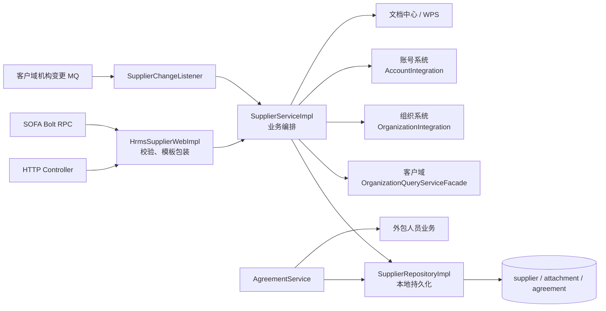
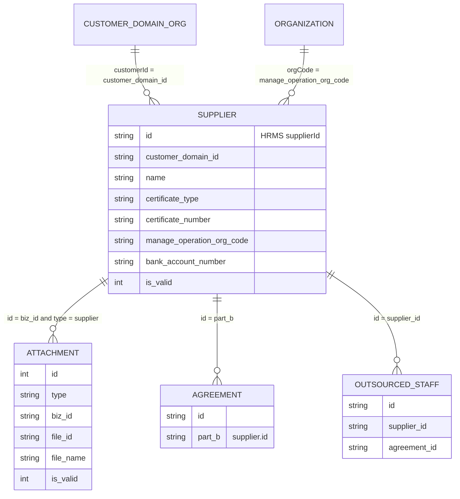
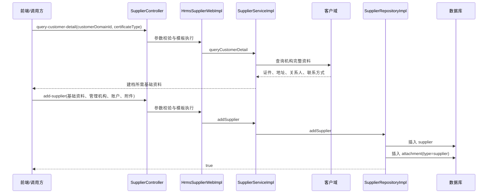
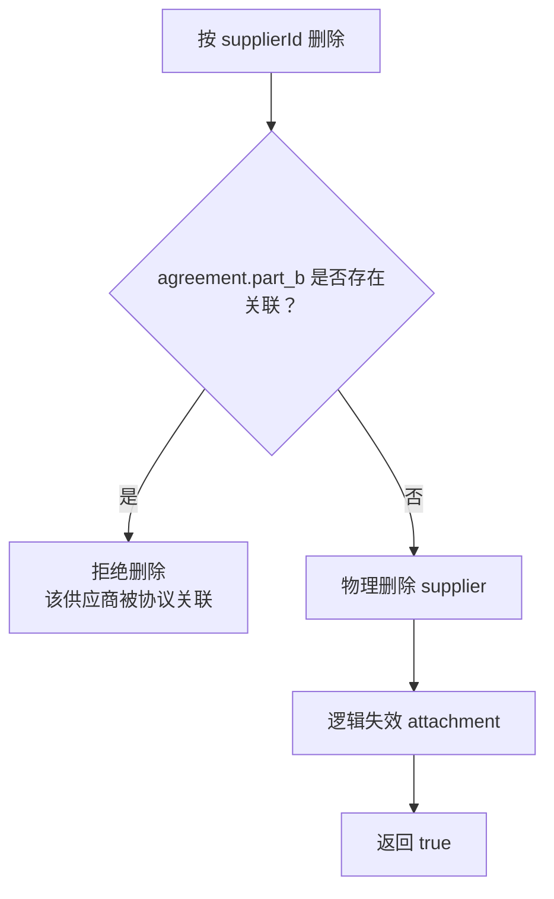
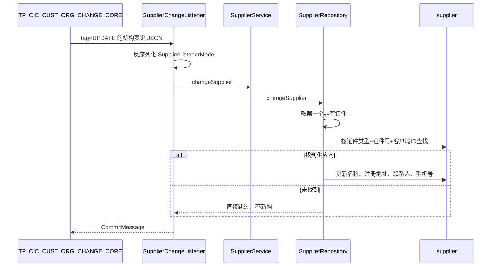

# 供应商模块学习笔记

> 整理日期：2026-07-23  
> 项目：ABOSS Property HRMS  
> 代码基线：`bd0c3765`  
> 范围：供应商建档、查询、修改、删除、客户域资料回填与变更同步、协议/外包人员关联、供应商附件预览  
> 说明：本文以当前仓库实现为准。仓库中未找到 `supplier` 表的 DDL，因此数据库索引、唯一约束和外键情况不作推断。

## 1. 一句话理解

供应商模块是 HRMS 中的“外包服务主体主数据”：它把客户域中的机构身份和联系人资料，以本地快照形式与管理机构、结算账户、附件绑定，再作为协议乙方被协议与外包人员业务引用。

最简业务主线：

```text
客户域机构
→ 查询并回填名称、证件、地址、联系人
→ HRMS 建立供应商档案
→ 配置管理机构、银行账户和附件
→ 作为协议乙方 partB
→ 外包人员通过协议获得 supplierId
→ 客户域资料发生变化
→ MQ 通知 HRMS 更新本地供应商快照
```

## 2. 模块职责与边界

### 2.1 核心职责

供应商模块当前承担六类能力：

1. 供应商新增、修改、删除、详情和分页查询。
2. 根据客户域账号 ID 查询机构资料，辅助供应商建档。
3. 接收客户域机构变更消息，更新 HRMS 中的名称、注册地址和联系人快照。
4. 为管理端列表和详情补充管理机构名称、最后操作人名称。
5. 为开放接口补充客户域联系地址、法定代表人和邮箱。
6. 管理供应商附件，并通过文档中心完成 WPS/Excel 转 PDF 和在线预览。

### 2.2 数据来源与本地职责

| 信息 | 当前来源/维护方式 | HRMS 中的作用 |
|---|---|---|
| 客户域账号 ID | 客户域 | 连接 HRMS 供应商与客户域机构的关键 ID |
| 名称、证件、地址、联系人、手机号 | 建档时由请求写入；其中名称、注册地址、联系人、手机号会随客户域 MQ 更新 | 本地业务查询快照 |
| 管理机构 | HRMS 保存机构代码，查询时从组织系统补名称 | 管理归属与展示 |
| 支付及银行账户 | HRMS 本地维护 | 协议、结算等业务使用 |
| 附件 | HRMS `attachment` 表保存文件 ID 和名称 | 供应商资料留档与预览 |
| 最后操作人 | HRMS 保存账号 ID，查询时从账号系统补姓名 | 审计展示 |

需要特别注意：当前代码没有在新增接口内部调用客户域校验。`query-customer-detail` 是一个独立的资料查询/回填接口，前端是否先调用它属于业务交互约定，不是后端新增流程的强制步骤。

## 3. 总体架构



### 3.1 分层代码位置

| 层 | 关键文件 | 主要职责 |
|---|---|---|
| Controller | `bootstrap/.../controller/supplier/SupplierController.java` | 供应商 7 个 HTTP 接口 |
| Controller | `bootstrap/.../controller/WPS2PDFController.java` | 附件转换和预览 3 个 HTTP 接口 |
| Web 接口 | `web/.../supplier/HrmsSupplierWeb.java` | HTTP/RPC 共用契约 |
| Web 实现 | `service/.../impl/HrmsSupplierWebImpl.java` | 参数校验、模板执行、结果包装、SOFA 服务发布 |
| Domain Service | `domain/.../service/supplier/SupplierServiceImpl.java` | 查询编排、外部信息补充、业务入口 |
| Repository 接口 | `domain/.../repository/supplier/SupplierRepository.java` | 供应商持久化能力定义 |
| Repository 实现 | `infrastructure/repository/.../impl/supplier/SupplierRepositoryImpl.java` | CRUD、附件处理、客户域变更落库 |
| Entity/Mapper | `infrastructure/repository/.../entity/SupplierEntity.java`、`.../mapper/SupplierMapper.java` | MyBatis-Plus 表映射 |
| Integration | `infrastructure/integration/.../SupplierIntegrationImpl.java` | 查询客户域机构详情 |
| MQ Listener | `service/.../listener/SupplierChangeListener.java` | 消费客户域机构变更消息 |

`SupplierMapper.xml` 只有空的 mapper 声明，当前供应商 SQL 都由 MyBatis-Plus `BaseMapper` 和条件 Wrapper 生成。

### 3.2 当前实现与标准 DDD 的差异

项目整体采用 DDD 分层，但供应商模块是偏“事务脚本”的实现：

- Domain Service 和 Repository 接口直接依赖 Web 层的 Cmd/DTO。
- Repository 会直接返回 Web DTO。
- 协议服务绕过 `SupplierService`，直接调用 `SupplierRepository`。
- `SupplierDO` 与 `SupplierModel` 字段重复，其中 `SupplierDO` 当前没有实际引用。

学习和排查时应以实际调用链为准，不要只按理想分层推测代码位置。

## 4. 关键 ID 与逻辑关系

### 4.1 supplierId

```text
supplierId = supplier.id
```

它是 HRMS 本地供应商主键，由 `IdUtils.getId()` 生成雪花 ID。

它同时被用作：

- `agreement.part_b`：协议乙方。
- `outsourced_staff.supplier_id`：外包人员所属供应商。
- `attachment.biz_id`：当 `attachment.type = supplier` 时关联供应商附件。
- OpenAPI 返回字段 `supplierId`。

### 4.2 customerDomainId

```text
customerDomainId = supplier.customer_domain_id
```

它是客户域机构账号 ID，用于调用客户域查询机构、证件、地址、关系人和联系方式。

```text
supplierId       = HRMS 中“这个供应商档案是谁”
customerDomainId = 客户域中“对应的机构客户是谁”
```

### 4.3 管理机构代码

`manageOperationOrgCode` 只在本地保存代码。列表和详情查询时，通过组织系统补充机构名称。

### 4.4 逻辑数据关系

以下是代码层面的逻辑关系，不代表数据库一定配置了外键：



## 5. 核心业务流程

### 5.1 建档流程



新增仓储方法带事务，供应商主表和附件写入失败时应一起回滚。

### 5.2 管理端列表和详情

管理端分页：

```text
supplier 表分页查询
→ 批量查询组织系统，补 manageOperationOrgName
→ 批量查询账号系统，补 modifier 展示名
→ 返回 PageResult<QuerySupplierPageDTO>
```

详情查询：

```text
supplier.id + is_valid=1 查询主表
→ attachment.biz_id + type=supplier + is_valid=1 查询附件
→ 组织系统补管理机构名称
→ 账号系统补最后操作人姓名
→ 返回 QuerySupplierDetailDTO
```

供应商不存在时，当前实现返回 `null` 数据，并由模板包装成成功 `ResultModel`，不会抛“供应商不存在”。

### 5.3 开放接口分页

```text
customerOrgName
→ 映射为本地 name 模糊条件
→ 分页查询 supplier
→ 对当前页每个供应商逐条查询客户域
→ 补联系地址、法定代表人、邮箱
→ 返回供应商及银行账户信息
```

本地字段负责基础资料和账户信息，客户域负责开放接口中的扩展机构资料。任意一条供应商的客户域账号查不到时，当前页整体失败。

### 5.4 修改与附件替换

```text
按 supplierId 查询主表
→ 不存在则抛“供应商不存在”
→ 更新供应商主信息
→ 将该供应商的旧附件全部置为 is_valid=0
→ 插入本次请求中的附件作为新版本
```

附件采用“整组替换”而不是差量更新：如果修改请求的附件列表为空，旧附件仍会全部失效，之后不会插入新附件。

当前更新代码不会修改 `customerDomainId`，虽然 `UpdateSupplierCmd.customerDomainId` 被标记为必填。从代码效果看，供应商与客户域的绑定在新增后不可通过该接口变更；这是业务设计还是遗漏，需要结合需求确认。

### 5.5 删除流程



供应商主表采用物理删除，附件采用逻辑删除。协议关联检查没有附加协议状态或 `isValid` 条件。

### 5.6 客户域变更同步



同步筛选规则：

- 证件：证件列表中第一个非空元素。
- 地址：`addressTypeCd = 0701205`，即注册地址。
- 联系人：`customerRelationCd = 05`。
- 手机号：`contactTypeCd = 0700602`。
- 消息中缺少某类数据时，对应本地旧字段保持不变。
- 同步不会更新银行账户、管理机构、附件，也不会自动创建本地供应商。
- 当前事件模型没有接收客户域对象的 `isValid`、`priority` 等字段，因此“第一个非空”不等同于“当前有效且优先级最高”。

### 5.7 协议与外包人员如何使用供应商

```text
supplier.id
→ agreement.part_b（协议乙方）
→ 创建或批量导入外包人员时，从协议取得 partB
→ outsourced_staff.supplier_id
```

协议列表和详情会按 `partB` 查询供应商并补充乙方名称。供应商因此是协议和外包人员之间的重要主数据节点。

协议表自身还保存支付方式和银行账户字段，属于协议记录的时点数据。供应商账户发生修改时，当前供应商模块不会自动回写已经存在的协议。

## 6. HTTP 与 RPC 接口

HTTP 基础路径：

```text
/platform/api/aboss/hrms/supplier/
```

`HrmsSupplierWebImpl` 同时通过 `@SofaService` 发布 Bolt RPC，所以 HTTP 与 RPC 复用相同的参数校验和业务实现。

### 6.1 供应商核心接口

| HTTP 接口 | Web/RPC 方法 | 入参 | 返回数据 | 用途 |
|---|---|---|---|---|
| `POST query-supplier-page-openapi` | `querySupplierPageOpenapi` | `QuerySupplierPageOpenApiCmd` | `PageResult<QuerySupplierPageOpenApiDTO>` | 对外分页查询供应商及客户域扩展信息 |
| `POST query-supplier-page` | `querySupplierPage` | `QuerySupplierPageCmd` | `PageResult<QuerySupplierPageDTO>` | 管理端分页查询 |
| `POST query-supplier-detail` | `querySupplierDetail` | `QuerySupplierDetailCmd` | `QuerySupplierDetailDTO` | 查询供应商和附件详情 |
| `POST add-supplier` | `addSupplier` | `AddSupplierCmd` | `Boolean` | 新增供应商 |
| `POST update-supplier` | `updateSupplier` | `UpdateSupplierCmd` | `Boolean` | 修改供应商并整体替换附件 |
| `POST delete-supplier-by-id` | `deleteSupplier` | `DeleteSupplierCmd` | `Boolean` | 删除未被协议关联的供应商 |
| `POST query-customer-detail` | `queryCustomerDetail` | `QueryCustomerDetailCmd` | `QueryCustomerDetailDTO` | 从客户域提取建档资料 |

### 6.2 附件转换和预览接口

| HTTP 接口 | Web/RPC 方法 | 入参 | 返回数据 |
|---|---|---|---|
| `POST wps2pdf-taskid` | `wps2pdfGetTaskId` | `WPS2PDFCmd` | 转换任务 `taskId` |
| `POST wps2pdf-fileid` | `wps2pdfGetFileId` | `WPS2PDFTaskIdCmd` | 转换后的 `fileId` |
| `POST wps2pdf-online-preview-links` | `wps2pdfGetOnlinePreviewLinks` | HTTP 为 `WPS2PDFLinkCmd`；Web 接口为原始 `String` | 在线预览地址 |

转换调用顺序：

```text
原始文件 ossId
→ 提交格式转换，得到 taskId
→ 用 oriOssId + taskId 查询转换后的 fileId
→ 用 fileId 获取 WPS 在线预览地址
```

这些能力放在供应商 URL 和 Web 接口下，但本质上是供应商附件使用的跨领域文件能力，不是供应商主数据本身。

## 7. 请求参数与查询规则

### 7.1 公共分页参数

分页请求继承 `PageRequest`：

| 字段 | 规则 |
|---|---|
| `current` | 必填，最小值 1 |
| `pageSize` | 必填，范围 1～100 |

### 7.2 管理端分页条件

`QuerySupplierPageCmd` 支持：

- `name`：供应商名称模糊匹配。
- `certificateNumber`：证件号码模糊匹配。
- `modifier`：最后操作人账号模糊匹配，不是展示姓名。
- `startTime`：`gmtModified >= startTime`。
- `endTime`：代码扩展到所选日期当天 `23:59:59.999999999` 后执行 `gmtModified <= endOfDay`。
- 固定条件：`isValid = 1`。
- 排序：`gmtModified DESC`。

日期 JSON 格式是 `yyyy-MM-dd`，时区 `GMT+8`。

### 7.3 新增和修改必填项

新增必填字段：

```text
name
certificateType
certificateNumber
supplierPersonName
supplierPhoneNumber
supplierAddress
manageOperationOrgCode
customerDomainId
paymentMethod
bankAccountName
bankAccountNumber
```

修改在以上字段基础上额外要求 `id`。

可选字段包括卡折类型、银行、省、市、开户行、对公对私标识和附件列表。

### 7.4 客户域资料提取规则

`query-customer-detail` 根据 `customerDomainId` 查询客户域，再按 `certificateType` 选取证件：

| 目标字段 | 客户域选择规则 |
|---|---|
| 名称、证件类型、证件号 | `certTypeCd = 请求 certificateType` |
| 供应商地址 | `addressTypeCd = 0701205` |
| 联系人姓名 | `customerRelationCd = 05` |
| 联系人手机号 | `contactTypeCd = 0700602` |

客户域账号不存在时抛出 `PARAMETER_ERROR / 该客户域账号id不存在`。

## 8. 数据模型

### 8.1 supplier 表实体

`SupplierEntity` 映射表 `supplier`，继承 `BaseEntity`。

| 字段 | 含义 | 备注 |
|---|---|---|
| `id` | HRMS 供应商 ID | 雪花 ID，主键 |
| `name` | 供应商名称 | 客户域变更时可同步 |
| `certificate_type` | 证件类型 | 同步定位键之一 |
| `certificate_number` | 证件号码 | 同步定位键之一 |
| `supplier_person_name` | 联系人姓名 | 本地快照 |
| `supplier_phone_number` | 联系人手机号 | 本地快照 |
| `supplier_address` | 供应商地址 | 客户域注册地址快照 |
| `manage_operation_org_code` | 管理机构代码 | 名称查询时动态补充 |
| `customer_domain_id` | 客户域账号 ID | 同步定位键之一 |
| `payment_method` | 支付方式 | 必填，但模块内无专属枚举 |
| `bank_account_type` | 卡折类型 | 允许更新为 `null` |
| `bank_account_name` | 银行账户名 | 必填 |
| `bank_account_number` | 银行账号 | 必填 |
| `bank_name` | 银行名称 | 可选 |
| `bank_account_province` | 账户省份 | 可选 |
| `bank_account_city` | 账户城市 | 可选 |
| `bank_issuing` | 开户行 | 可选 |
| `bank_corporate_account` | 对公/对私标识 | Entity 为 `Integer`，请求和详情 DTO 为 `String` |
| `gmt_create` | 创建时间 | 插入自动填充 |
| `gmt_modified` | 修改时间 | 插入/更新自动填充 |
| `creator` | 创建人账号 ID | 插入自动填充 |
| `modifier` | 修改人账号 ID | 插入/更新填充或显式设置 |
| `tenant_code` | 租户 | 默认 `cic` |
| `is_valid` | 有效标识 | `1` 有效，`0` 无效 |

`bankAccountType`、`bankName`、省、市、开户行、对公对私字段配置了 `FieldStrategy.IGNORED`，更新时允许把数据库旧值覆盖为 `null`。

### 8.2 attachment 表

| 字段 | 含义 |
|---|---|
| `id` | 自增主键 |
| `type` | 业务类型；供应商固定为 `supplier` |
| `biz_id` | 供应商 ID |
| `file_id` | 文档中心文件 ID |
| `file_name` | 文件名称 |
| 通用审计字段 | 继承自 `BaseEntity` |

附件删除是逻辑失效：`is_valid = 0`。

### 8.3 领域与事件模型

- `SupplierModel`：协议等领域服务批量读取供应商时使用。
- `SupplierDO`：与供应商字段高度重复，当前无实际引用。
- `SupplierListenerModel`：客户域 MQ 消息的最小投影，只保留地址、证件和关系人信息。
- `CertificateModel`：客户名称、客户 ID、证件类型、证件号。
- `AddressModel`：完整地址和地址类型。
- `RelationDetailAdapterModel`：关系类型和联系人完整资料。
- `CustomerAllInfoModel`：联系人主体和联系方式。

供应商没有独立的生命周期状态枚举；当前只有通用 `isValid` 标识。

## 9. 关键码值

| 码值 | 当前代码语义 | 使用位置 |
|---|---|---|
| `1` | 有效 | 本地查询固定过滤 `isValid=1` |
| `0` | 无效 | 附件逻辑删除 |
| `supplier` | 供应商附件类型 | `attachment.type` |
| `0701205` | 注册地址 | 客户域建档回填、MQ 同步 |
| `0700602` | 手机号 | 客户域建档回填、MQ 同步 |
| `05` | 联系人关系 | 客户域建档回填、MQ 同步 |
| `0701204` | 开放接口使用的联系地址 | OpenAPI 扩展字段 `permanentAddress` |
| `04` | 法定代表人关系 | OpenAPI 扩展字段 `agent` |
| `0700621` | 电子邮箱 | OpenAPI 扩展字段 `email` |

后三个值在 `SupplierServiceImpl` 中是硬编码字符串，没有复用 `HrmsConstant`。

## 10. 外部依赖

| 依赖 | 调用目的 | 调用方式 |
|---|---|---|
| 客户域 `OrganizationQueryServiceFacade` | 按 `customerDomainId` 查询机构完整资料 | SOFA Bolt |
| `OrganizationIntegration` | 按管理机构代码补机构名称 | 批量 RPC |
| `AccountIntegration` | 按账号 ID 补最后操作人姓名 | 单个或批量 RPC |
| 文档中心/WPS | 文件格式转换、查询结果、在线预览 | SOFA Bolt |
| SOFAMQ | 接收客户域机构变更 | Topic + Tag 消费 |

客户域 MQ 配置：

```text
topic   = TP_CIC_CUST_ORG_CHANGE_CORE
groupId = GID_TP_CIC_HRMS_ORG_CHANGE_CORE_GROUP
tag     = UPDATE
```

## 11. 校验、异常与事务

### 11.1 Web 模板

所有 Web 方法使用：

```text
check
→ execute
→ afterExecute
→ ResultModel
```

- `check` 使用 `ValidationTool` 执行 Bean Validation。
- 校验失败抛 `BizRuntimeException(PARAMETER_ERROR, message)`。
- 模板捕获业务异常并保留业务错误码。
- 其他异常统一包装为 `SYSTEM_ERROR`。
- 供应商 Web 实现的 `afterExecute` 当前全部为空。
- 供应商方法都没有调用模板的 `withTransaction()`。

### 11.2 事务边界

| 操作 | 当前事务位置 |
|---|---|
| 新增供应商和附件 | `SupplierRepositoryImpl.addSupplier` 有 `@Transactional` |
| 修改供应商和附件 | 未看到事务注解 |
| 删除供应商和失效附件 | `SupplierRepositoryImpl.deleteSupplier` 有 `@Transactional` |
| 客户域 MQ 同步 | 未看到事务注解；当前只更新单张供应商表 |

### 11.3 明确的业务异常

| 场景 | 错误码/消息 |
|---|---|
| 客户域账号不存在 | `PARAMETER_ERROR / 该客户域账号id不存在` |
| 修改的供应商不存在 | `NO_DATA_AVAILABLE / 供应商不存在` |
| 删除已被协议关联的供应商 | `PARAMETER_ERROR / 该供应商被协议关联,无法删除` |
| 文件转换未生成 taskId | `UNKNOWN_SYSTEM_ERROR / 文件转换失败,未生成taskId` |

## 12. 当前实现中需要重点关注的问题

以下内容是基于当前代码的维护风险提示，不代表已确认的线上故障。

### 12.1 新增缺少显式唯一性校验

新增前没有查询同一 `customerDomainId`、证件号码或名称是否已存在。仓库也没有 DDL，无法确认数据库是否有唯一索引。重复建档风险需要结合数据库约束和业务需求核实。

### 12.2 更新请求与实际字段不一致

`UpdateSupplierCmd.customerDomainId` 必填，但 `updateSupplier` 不会把它写回实体。这可能表示客户域绑定不允许修改，也可能是遗漏；接口契约应明确。

### 12.3 修改供应商缺少整体事务

修改过程包括：

```text
更新 supplier
→ 失效全部旧 attachment
→ 插入新 attachment
```

该方法没有事务。如果中途失败，可能出现主表已更新但附件只完成部分替换的状态。

### 12.4 删除规则可能过严

协议关联检查只按 `agreement.part_b` 查询，没有过滤协议状态或 `isValid`。历史上无效、终止或待删除的协议是否也应阻止供应商删除，需要业务确认。

### 12.5 主表与附件删除语义不一致

供应商是物理删除，附件是逻辑失效；而正常查询仍固定过滤供应商 `isValid=1`。这说明通用有效字段与供应商真实删除策略并不统一。

### 12.6 MQ 失败后仍确认消息

监听器无论 JSON 解析失败还是业务处理异常，最终都返回 `CommitMessage`。消息不会自动重试，临时数据库或远程故障可能造成供应商快照漏同步，除非另有补偿机制。

### 12.7 MQ 匹配键无法覆盖证件变更

同步使用事件中的“证件类型 + 证件号 + 客户域 ID”定位本地记录。如果事件代表证件号本身发生变化，而消息只带新证件，本地旧记录可能无法匹配，因此不会更新。

同步查询还没有过滤 `supplier.isValid=1`；如果存在重复数据，则无明确排序地取第一条。再加上事件模型忽略 `isValid` 和 `priority`，可能选中客户域中已失效或非首选的证件、地址、手机号。

### 12.8 开放接口存在 N+1 远程调用

开放分页对每个供应商单独查询一次客户域。页面越大，远程调用越多；任意一条客户域数据缺失还会让整页失败。

### 12.9 空集合和空字段边界不足

- 详情查询取得组织列表后直接 `get(0)`，组织系统返回空列表时可能越界。
- 查询客户详情时，找到联系人关系后直接对 `contactList.stream()`，列表为 `null` 时可能空指针。
- 按供应商 ID 集合批量查询没有先处理空列表，调用方传空集合时需关注 MyBatis-Plus `in` 条件行为。

### 12.10 参数与类型约束不足

- `bankCorporateAccount` 请求类型为 `String`，落库前直接 `Integer.parseInt`；非法字符串会变成系统异常。
- 支付方式、卡折类型、证件类型、对公对私没有供应商专属枚举校验。
- 附件列表没有 `@Valid` 级联校验，`fileId` 和 `fileName` 也没有字段约束。
- 在线预览接口把 `WPS2PDFLinkCmd.fileId` 拆成原始 `String` 后才进入 Web 校验，DTO 上的 `@NotBlank` 可能失效。

### 12.11 返回契约存在不一致

- 详情未查到供应商时返回成功结果，数据为 `null`。
- 转换 taskId 为空时抛业务异常。
- 查询转换后的 fileId 或预览地址失败时，底层可能返回 `null`，Web 层仍包装为成功结果。
- 管理端列表把操作人展示为“姓名-账号”，详情只展示“姓名”。

### 12.12 分层与重复模型增加维护成本

- Domain/Repository 直接依赖 Web DTO，修改接口对象容易影响领域和持久化层。
- `SupplierDO` 当前未使用。
- `SupplierDO`、`SupplierModel`、`SupplierEntity`、`SupplierListDTO` 字段高度重复，主要依靠 `BeanUtils` 手工转换。
- 协议模块直接依赖供应商仓储，领域边界较弱。
- 项目新增、修改、变更、续延 DTO 复用了供应商包中的 `AttachmentDTO`，公共附件模型反向依赖供应商包。

### 12.13 配置密钥需要外部化管理

多个环境配置包含 MQ 访问凭据字段。具体值不应进入学习笔记、日志或排障截图，并应优先通过密钥管理或环境注入提供，而不是长期保存在项目配置文件中。

### 12.14 缺少供应商专项自动化测试

当前仓库未找到供应商 Controller、Web、Service、Repository、MQ Listener 的专项测试。高价值测试场景包括：

1. 重复供应商建档与数据库唯一约束。
2. 修改附件中途失败时的事务一致性。
3. 已关联不同状态协议时的删除规则。
4. 客户域返回空证件、空联系人、空联系方式。
5. MQ 重复消息、解析失败和数据库临时失败。
6. 开放接口单个客户域账号缺失时的降级策略。
7. 证件号变更后的供应商匹配与同步。

## 13. 排查问题时的检查顺序

### 13.1 “供应商列表查不到”

```text
1. supplier 是否存在
2. is_valid 是否为 1
3. 名称/证件号/modifier 模糊条件是否匹配
4. startTime/endTime 是否过滤掉 gmt_modified
5. PageHelper 分页参数是否正确
6. 组织系统或账号系统补充信息时是否异常
```

### 13.2 “客户域资料没有回填”

```text
1. customerDomainId 是否正确
2. 客户域 RPC 是否返回机构详情
3. certificateType 是否能匹配 certTypeCd
4. 地址是否存在 0701205
5. 关系人是否存在 05
6. 关系人的联系方式是否存在 0700602
```

### 13.3 “客户域已修改，HRMS 没同步”

```text
1. MQ topic/group/tag 是否正确
2. Listener 是否启动
3. 消息是否能反序列化为 SupplierListenerModel
4. certificateList 是否为空
5. 第一个非空证件的三元组是否匹配本地供应商
6. 日志是否出现处理异常后仍 CommitMessage
7. 本地记录是否实际更新但查询被缓存或条件过滤
```

### 13.4 “供应商无法删除”

```text
1. agreement 表是否存在 part_b = supplierId
2. 关联协议是否属于仍应阻止删除的业务状态
3. 是否需要保留供应商供历史协议展示
```

### 13.5 “附件看不到或预览失败”

```text
1. attachment.biz_id 是否等于 supplierId
2. attachment.type 是否为 supplier
3. attachment.is_valid 是否为 1
4. fileId 是否存在于文档中心
5. 转换 taskId 是否生成
6. 转换后的 fileId 是否已就绪
7. WPS 预览接口是否返回 URL
```

## 14. 推荐代码阅读顺序

1. `SupplierController`：先看 7 个业务入口。
2. `HrmsSupplierWeb`：看 HTTP/RPC 共用契约。
3. `HrmsSupplierWebImpl`：理解校验、模板和异常包装。
4. `SupplierServiceImpl`：理解查询编排和外部系统补数。
5. `SupplierRepositoryImpl`：掌握 CRUD、附件、删除约束和 MQ 落库规则。
6. `SupplierEntity`、`AttachmentEntity`、`AgreementEntity`：理解表关系。
7. `SupplierIntegrationImpl`：理解客户域 RPC。
8. `SupplierChangeListener` 与 supplier 事件模型：理解客户域变更同步。
9. `AgreementServiceImpl`：理解协议如何把供应商作为乙方。
10. `OutsourcedStaffBaseRepositoryImpl`、`OutsourcedStaffBatchSaveHandler`：理解外包人员如何从协议继承供应商。
11. `WPS2PDFController` 与 `FileCenterExternalIntegrationImpl`：理解附件转换和预览。

## 15. 最终记忆模型

```text
supplier.id
= HRMS 本地供应商主键
= agreement.part_b
= outsourced_staff.supplier_id

supplier.customer_domain_id
= 客户域机构账号 ID
= 查询客户域资料的连接键

证件类型 + 证件号 + 客户域 ID
= 当前 MQ 同步定位本地供应商的三元组

supplier
= 供应商当前业务快照和结算信息

attachment(type=supplier, biz_id=supplier.id)
= 供应商附件

agreement.part_b
= 协议乙方供应商

客户域 MQ
= 更新名称、注册地址、联系人、手机号
!= 自动新增供应商
!= 更新银行账户、管理机构、附件
```
