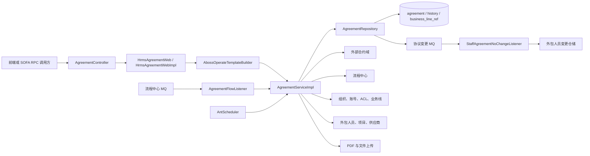
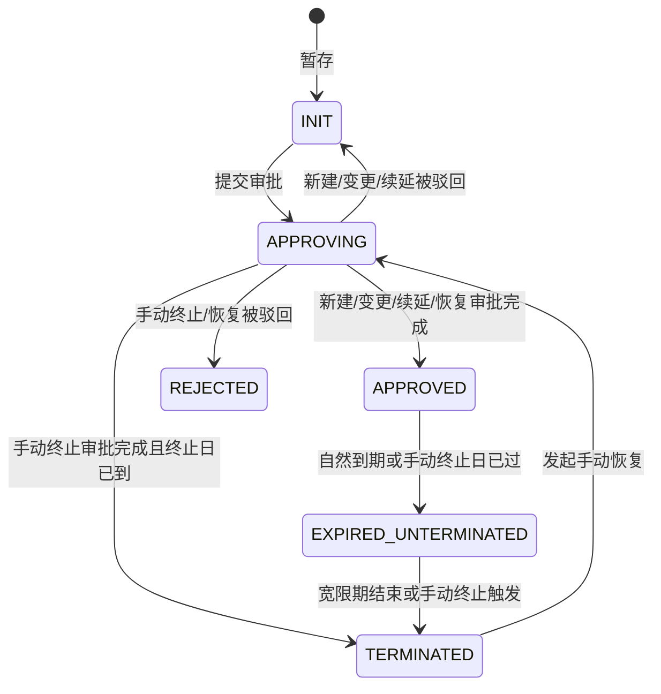
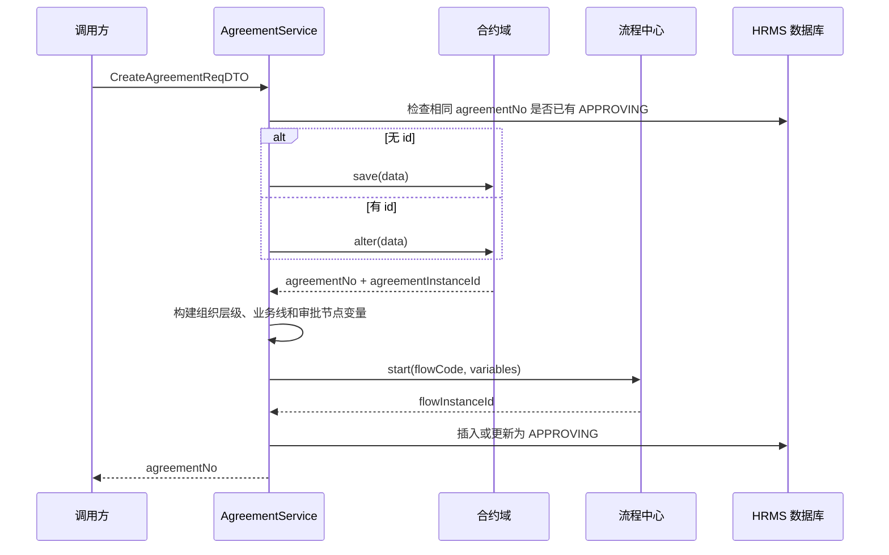
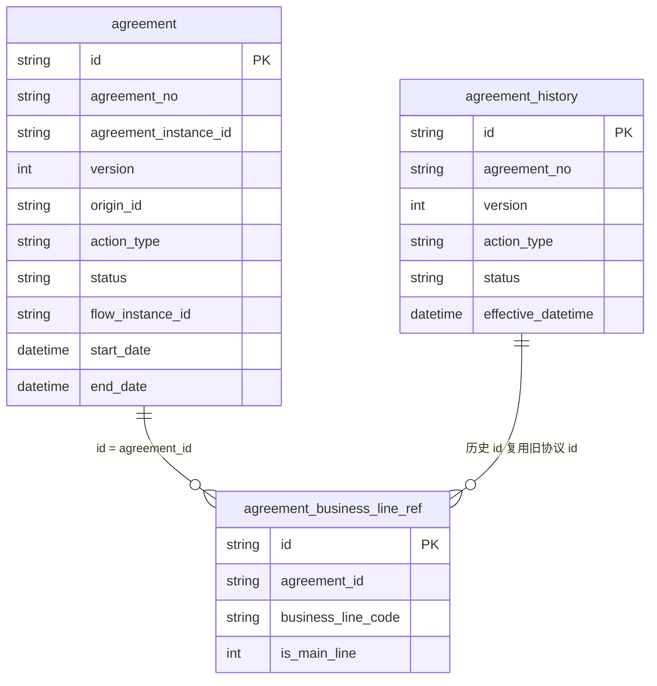
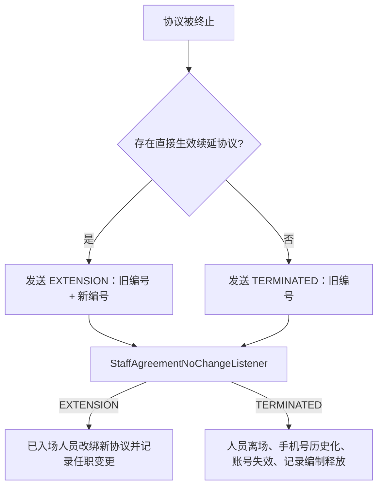

# HRMS 协议管理模块学习笔记

> 生成日期：2026-07-23  
> 代码基线：分支 `ECI10009588_20260710`，提交 `bd0c3765`  
> 分析范围：本仓库协议相关 Controller、Web、领域服务、仓储、集成、监听器、定时任务、DTO、实体与外包人员联动代码。  
> 边界说明：合约域依赖包中的完整协议数据结构、数据库 DDL、AntScheduler 的 Cron 配置不在本仓库中；对应结论以当前可见代码为准。

## 1. 一句话理解协议模块

HRMS 协议模块不是完整协议内容的唯一存储方，而是协议业务的**编排与管理侧**：

- 完整协议内容由外部“合约域”保存，HRMS 通过 `AgreementFacade` 调用它。
- HRMS 本地保存协议摘要、状态、版本、业务线、审批实例和银行账户等管理字段。
- 审批由流程中心执行，HRMS 通过流程 MQ 接收审批完成或驳回事件。
- 协议到期、续延和终止会进一步影响外包人员协议归属、离场状态和 SSO 账号。
- 协议临期提醒、报销凭证生成也由本模块串联消息中心、圈人服务、人员、项目和文件服务完成。

因此，理解本模块的关键不是只看一张 `agreement` 表，而是同时理解：

```text
合约域数据 + HRMS 本地状态 + 审批流程 + 定时任务 + MQ 人员联动
```

## 2. 模块位置与总体架构

### 2.1 主调用链



### 2.2 各层职责

| 层次 | 关键类 | 当前职责 |
|---|---|---|
| HTTP 入口 | `AgreementController` | 暴露协议接口；大部分请求转给 Web 层，两个测试接口直接调用领域服务 |
| Web 契约 | `HrmsAgreementWeb` | 定义应用接口，同时作为 SOFA Bolt 服务契约 |
| 应用编排 | `HrmsAgreementWebImpl` | 参数校验、统一异常包装、少量 DTO 转换 |
| 领域服务 | `AgreementServiceImpl` | 暂存、审批、查询、权限、终止、恢复、续延、凭证等核心编排 |
| 领域仓储接口 | `AgreementRepository` | 隔离领域层与持久化实现 |
| 持久化实现 | `AgreementRepositoryImpl` | 当前表、历史表、业务线关系、到期批处理和 MQ 发送 |
| 外部集成 | `AgreementIntegrationImpl` 等 | 合约域、流程中心、组织、账号、消息、文件等 RPC |
| 异步入口 | `AgreementFlowListener`、三个协议 Job | 审批回调、临期提醒、进入宽限期、自动终止 |
| 人员联动 | `StaffAgreementNoChangeListener` | 消费协议终止/续延消息，更新外包人员与账号 |

### 2.3 Web 层统一模板

除两个直接调用领域服务的测试接口外，协议接口通常执行：

```text
check() 参数校验
  → execute() 调用 AgreementService
  → afterExecute() 后置操作（当前协议实现均为空）
  → 包装 ResultModel
```

- `BizRuntimeException` 被转换为业务失败结果。
- 其他异常被转换为 `SYSTEM_ERROR`。
- 当前协议 Web 方法都没有调用 `withTransaction()`，因此模板走无事务分支。
- 真正的局部事务主要位于部分 Repository 方法中。

## 3. 核心概念与数据标识

### 3.1 五个容易混淆的 ID

| 字段 | 含义 | 典型来源/用途 |
|---|---|---|
| `id` | HRMS 本地协议记录主键 | `IdUtils.getId()`；详情、删除、流程变量 `agreement_id` 都使用它 |
| `agreementNo` | 合约域生成的业务协议编号 | 版本查询、人员绑定、历史查询、续延关系的核心业务编号 |
| `agreementInstanceId` | 合约域协议实例 ID | 调用合约域详情、删除、审核接口 |
| `flowInstanceId` | 流程中心审批实例 ID | 审批 MQ 回调定位 HRMS 待审批记录 |
| `originId` | 来源关联字段 | 当前代码中语义不统一：续延保存旧 `agreementNo`，手动终止/恢复保存旧本地 `id` |

学习和排查时不要把 `agreementNo` 与 `agreementInstanceId` 混为一谈：前者更接近业务编号，后者是合约域实例标识。

### 3.2 一次请求中的两份协议数据

`CreateAgreementReqDTO` 同时携带：

- `data`：完整的合约域 JSON，转换成合约域的 `SaveAgreementRequest`。
- `bizData`：HRMS 自己需要的摘要，包括名称、起止日期、归属组织、甲乙方、银行账户和业务线。

这两份数据没有看到显式的一致性校验。调用方需要保证同一字段在 `data` 与 `bizData` 中表达一致，否则外部合约详情与 HRMS 本地列表可能不一致。

### 3.3 协议状态

| 状态码 | 中文含义 | 当前代码中的典型场景 |
|---|---|---|
| `INIT` | 待提交/草稿 | 暂存；普通审批被驳回后回草稿 |
| `APPROVING` | 审批中 | 新建、变更、终止、恢复、续延已发起流程 |
| `APPROVED` | 生效 | 审批完成；未来日期的手动终止审批完成后也可能暂处于此状态 |
| `REJECTED` | 无效 | 手动终止或手动恢复被驳回 |
| `EXPIRED_UNTERMINATED` | 到期未终止 | 自然到期进入宽限期；手动终止日期到达后也会经过该状态 |
| `TERMINATED` | 终止 | 手动终止立即生效、自然到期自动终止、已有续延时终止旧协议 |

### 3.4 操作类型

| 操作码 | 中文含义 | 是否创建新本地记录 |
|---|---|---|
| `NEW` | 新建 | 通常是 |
| `CHANGE` | 变更 | 编辑生效协议时先复制为新草稿，后续更新该草稿 |
| `MANUAL_TERMINATE` | 手动终止 | 是，与原协议使用相同 `agreementNo` |
| `MANUAL_RECOVERY` | 手动恢复 | 是，与原协议使用相同 `agreementNo` |
| `EXPIRED_TERMINATE` | 到期终止 | 通常由定时任务直接更新原记录 |
| `EXTENSION` | 续延 | 是，合约域生成新的 `agreementNo` |

### 3.5 简化状态图



这张图是状态层面的简化视图。续延会生成另一个协议编号，新旧协议在一段时间内同时存在，不是同一行上的简单状态替换。

## 4. 核心业务流程

### 4.1 暂存协议

入口：`POST staging-agreement`

#### 新建草稿

```text
合约域 save(data)
  → 返回 agreementNo、agreementInstanceId
  → HRMS 构造 NEW + INIT 的 AgreementModel
  → 插入 agreement
  → 插入 agreement_business_line_ref
  → 返回本地 id、协议编号、合约域实例 ID
```

#### 更新草稿

请求带本地 `id` 时：

1. 先查询当前记录。
2. 如果该记录已经 `APPROVED`，会把请求 `id` 清空，按“复制为新草稿”处理，避免直接覆盖生效版本。
3. 普通草稿调用合约域 `alter`，再更新 HRMS 当前行和业务线关联。
4. 暂存状态统一为 `INIT`。

这意味着“编辑生效协议”的预期前置步骤是先暂存，从而得到一个新的本地草稿 ID；后续再用该 ID 提交审批。

### 4.2 提交审批

入口：`POST submit-approval`



关键规则：

- Web 层额外校验协议结束时间不能早于当前时间。
- 同一 `agreementNo` 已存在 `APPROVING` 记录时禁止重复发起。
- 无 `id` 时按新建插入；有 `id` 时最终将操作类型改为 `CHANGE` 并更新草稿。
- 当前实现中，全新协议若“先暂存、再携带暂存 ID 提交”，也会进入有 ID 分支并标记为 `CHANGE`；这是代码实际行为，需结合产品口径理解。

### 4.3 审批变量如何生成

审批流程码来自：

```properties
agreement.flow.code=P010068225792
```

审批变量的构建步骤：

1. 根据 `permissionOrgCode` 查询组织路径。
2. 识别总公司、分公司或中支层级，形成 `cic_org_level`。
3. 保存对应层级的总公司、分公司、中支组织编码。
4. 根据主、子业务线从 DRM 的 `approvalMaps`、`chargerApprovalMaps` 获取经办人与负责人标签。
5. 遍历 DRM 的 `agreementApprovalMaps`，生成 `cic_sys_var_节点名称` 变量，内容包括 `orgCodeList` 与 `groupTagList`。
6. 追加本地协议主键 `agreement_id`。

流程实例名称会区分“新建协议”“变更协议”“手动终止协议”“手动恢复协议”“续延协议”。

### 4.4 审批 MQ 回调与版本归档

`AgreementFlowListener` 订阅流程中心 Topic，并以协议流程码作为 Tag。当前只处理：

- `PROCESS_FINISH`：转为审批通过。
- `PROCESS_REJECT`：转为审批驳回。

审批通过时，Repository 在本地事务中执行：

1. 按 `flowInstanceId` 找到待审批行。
2. 按相同 `agreementNo` 查找旧的 `APPROVED` 或 `TERMINATED` 行。
3. 新版本号取旧版本 `+1`，无旧版本时取 `1`。
4. 设置 `effectiveDatetime` 为当前时间。
5. 普通操作变为 `APPROVED`。
6. 手动终止且终止日期为空或已经到达时，直接变为 `TERMINATED`。
7. 对 `NEW`、`CHANGE`、`MANUAL_TERMINATE`、`MANUAL_RECOVERY`，将旧当前行完整复制到 `agreement_history`，再删除旧当前行。
8. `EXTENSION` 不归档、删除旧协议，因为新旧协议编号不同。

审批驳回时：

- 手动终止、手动恢复记录变为 `REJECTED`。
- 其他审批记录回到 `INIT`。

需要特别知道：审批完成后调用合约域审核接口的代码目前在监听器中被注释，因此当前可见主链路只更新 HRMS 本地状态。虽然存在 `updateExternalAgreementEffectiveByFlow()`，但仓库中没有生效调用，而且其操作类型固定为 `CREATE`。

### 4.5 变更协议

典型完整链路：

```text
旧协议 APPROVED
  → 点击编辑并暂存
  → 创建新本地草稿 INIT（旧协议仍生效）
  → 提交后新草稿变为 CHANGE + APPROVING
  → 审批完成
  → 旧生效行复制到 agreement_history 后删除
  → 新行成为 APPROVED，版本号递增
```

业务线历史详情能够继续查询，是因为归档时旧 `id` 被历史快照沿用，且旧业务线关联没有被删除。

### 4.6 协议续延

入口：`POST extension-agreement`

1. 从完整合约 JSON 的 `relationships[0].fromAgreementNo` 取得原协议编号。
2. 调合约域 `save`，得到新的协议编号与实例 ID。
3. 查询原协议，构造 `EXTENSION + APPROVING` 新记录。
4. `originId` 保存原协议编号，不是原本地 ID。
5. 发起审批并插入新记录。
6. 审批通过后，新协议生效，旧协议暂时继续保留。
7. 旧协议到期时，定时任务识别到生效续延协议，直接终止旧协议并发送 `EXTENSION` 消息。
8. 员工侧收到消息后，把仍绑定旧协议的已入场人员改绑到新协议。

因此，“续延审批通过”与“人员改绑新协议”不是同一个时点；人员改绑发生在旧协议的到期处理链路。

### 4.7 手动终止

入口：`POST manual-terminate-agreement`

前置规则：

- 原协议必须存在。
- 同协议编号不能已经有审批中流程。
- 不能已有 `APPROVING + MANUAL_TERMINATE` 记录。

处理方式：复制原协议基础信息、银行信息和业务线，创建同 `agreementNo` 的新审批记录：

```text
actionType = MANUAL_TERMINATE
status = APPROVING
originId = 原协议本地 id
manualTerminateDate = 指定终止日
actionRemark = 终止原因
```

审批完成后：

- 终止日期为空或已经到达：立即 `TERMINATED`，并触发人员消息。
- 终止日期在未来：先成为 `APPROVED`，后续由定时任务按日期处理。
- 审批驳回：新终止记录为 `REJECTED`，原生效协议保留。

### 4.8 手动恢复

入口：`POST manual-recovery-agreement`

当前规则：

- 仅允许 `actionType=MANUAL_TERMINATE` 的协议发起恢复。
- 当前日期超过协议原结束日期时不允许恢复。
- 同协议编号不能有审批中流程。
- 当前表中已经存在 `MANUAL_RECOVERY` 记录时不允许再次恢复。

恢复同样复制原协议，生成 `MANUAL_RECOVERY + APPROVING` 新记录。审批完成后，原终止版本归档，新版本变为 `APPROVED`。

当前协议恢复链路中没有看到对应的“恢复外包人员状态/恢复 SSO 账号”消息，因此恢复的业务边界目前主要是协议本身，人员是否需要另行处理应结合业务确认。

### 4.9 删除协议

入口：`POST delete-agreement`

顺序是：

```text
查询本地协议
  → 先按 agreementInstanceId 删除合约域协议
  → 再删除本地业务线关联
  → 删除本地 agreement 行
```

当前领域逻辑没有看到基于状态的删除限制。

## 5. HTTP 接口速查

统一前缀：`/platform/api/aboss/hrms/agreement/`

| 方法与相对路径 | 作用 | 关键请求/返回 |
|---|---|---|
| `POST staging-agreement` | 暂存新建或编辑协议 | `CreateAgreementReqDTO` → 本地 ID、协议编号、实例 ID |
| `POST submit-approval` | 提交新建/变更审批 | 创建请求 → 协议编号 |
| `POST get-agreement` | 查询当前或历史详情 | 本地协议 ID → 完整详情 |
| `POST query-agreement-page` | 后台分页列表 | 权限组织、筛选条件、分页 → 协议列表 |
| `POST openapi/query-agreement-page` | OpenAPI 分页列表 | 与后台列表共用请求 DTO，但组织范围算法不同 |
| `POST manual-terminate-agreement` | 手动终止 | ID、权限组织、终止日、原因 |
| `POST manual-recovery-agreement` | 手动恢复 | ID、权限组织、备注 |
| `POST extension-agreement` | 协议续延 | 继承创建请求；完整 JSON 中需有来源关系 |
| `POST delete-agreement` | 删除协议 | 本地协议 ID → Boolean |
| `POST query-agreement-history` | 分页查看历史版本 | 当前协议 ID、分页参数 |
| `POST get-reimbursement-voucher` | 获取报销凭证数据 | ID、结算起止日 → 凭证结构 |
| `POST export-reimbursement-voucher` | 生成并上传 PDF | ID、结算起止日 → 文件地址 |
| `POST update-agreement-status` | 测试更新合约域状态 | 无参数；内部使用硬编码协议编号 |
| `GET testUpdateAgreementStatusExpiredUnterminated` | 测试进入宽限期 | 直接执行状态批处理 |
| `GET testUpdateAgreementStatusAutoTerminate` | 测试自动终止 | 直接执行状态批处理 |

### 5.1 参数校验现状

- Controller 没有使用 `@Valid`，校验集中在 `HrmsAgreementWebImpl` 的 `ValidationTool`。
- 分页要求 `current >= 1`，`pageSize` 介于 `1` 与 `100`。
- 详情、删除要求协议 ID。
- 列表要求 `permissionOrgCode`。
- 手动终止和恢复要求 ID、权限组织；终止日期、原因/备注没有字段级必填注解。
- 报销凭证要求 ID、结算开始日期和结束日期。
- `CreateAgreementReqDTO`、`AgreementBizData` 本身缺少大部分字段约束，上层字段也未标记 `@Valid`；嵌套校验是否生效依赖自定义 `ValidationTool`。
- 提交审批直接读取 `bizData.agreementEndTime`，空值可能变成系统异常，而不是明确参数错误。
- 没有看到“结算开始日期不得晚于结束日期”等跨字段校验。

### 5.2 主要响应

- `StagingAgreementResDTO`：本地 `id`、`agreementNo`、`agreementInstanceId`。
- `QueryAgreementResDTO`：基础信息、组织、状态、修改人以及前端操作按钮标识。
- `GetAgreementResDTO`：本地摘要、版本、合约域 `AgreementDTO`、银行账户和业务线。
- `QueryAgreementHistoryResDTO`：历史 ID、版本、状态、生效时间、操作人。
- `GetReimbursementVoucherResDTO`：协议、甲乙方、结算方式、项目与人员明细。

## 6. 查询、权限与页面操作标识

### 6.1 列表筛选

当前仓储支持：

- 甲方、乙方精确匹配。
- 协议编号或名称模糊匹配。
- 协议开始日期 `>=` 查询开始日期。
- 协议结束日期 `<=` 查询结束日期。
- 归属组织范围。
- 状态集合。
- 修改人。
- 最后操作日期范围。
- 业务线关联。
- 按 `gmtModified DESC, id DESC` 排序。

协议起止日期条件表达的是“落在筛选边界内”，不是“与筛选时间段有重叠”。

### 6.2 组织权限范围

根组织编码在代码中硬编码为 `210000000000`。

| 用户机构层级 | 默认可见范围 |
|---|---|
| 总公司 | 自身、所有直接分公司、这些分公司的直接中支 |
| 分公司 | 自身及直接下属中支 |
| 中支 | 自身及上级分公司 |
| 根组织 | 空列表表示不限制 |

当请求带筛选组织时：

- 非根用户的筛选组织必须位于权限范围中。
- `includeChildren=true` 时追加筛选组织的直接子组织。
- 当前实现不是任意深度递归查询。

需要留意：组织查询失败时，部分分支也会返回空列表；仓储又把空列表理解为“不添加组织条件”，存在“权限计算失败却放开查询”的风险。

### 6.3 业务线权限

- 超级管理员或 HR 角色不加业务线限制。
- 普通用户先查询自己管理的业务线，再反查协议 ID。
- 请求显式业务线筛选得到的协议 ID，与用户权限业务线得到的协议 ID，当前使用 `addAll` 合并，形成并集而非交集；这应重点确认是否符合权限设计。

### 6.4 OpenAPI 列表的不同点

`openApiAgreementPage()` 没有复用后台列表的 `buildFilterScope()`：

- 若调用人组织层级字段为中支，则查询中支自身与上级分公司。
- 其他层级只查本机构。

因此，两个列表接口虽然复用同一个请求 DTO，但组织可见范围并不完全相同。

### 6.5 页面按钮标识

列表响应按当前状态计算：

- `nearlyRenewal`：生效协议距离结束日 0～30 天，或已是 `EXPIRED_UNTERMINATED`。
- `manualTerminate`：状态为 `APPROVED` 且当前操作类型不是手动终止。
- `recover`：状态为 `TERMINATED`、操作类型为手动终止，并且协议结束日仍在未来。
- `operate`：协议主业务线属于当前用户业务线。

当前代码只为普通用户加载业务线集合，超管/HR 的集合保持空，因而 `operate` 可能被计算为 `false`；需确认前端是否另有角色兜底。

### 6.6 详情与历史查询

详情查询顺序：

1. 先按 ID 查询 `agreement`。
2. 当前表没有时，再按 ID 查询 `agreement_history`。
3. 补充归属组织、甲方组织名称。
4. 补充乙方供应商名称。
5. 补充修改人姓名。
6. 按 `agreementInstanceId` 查询合约域完整 `AgreementDTO`。

历史列表先用当前 ID 找到协议编号，再按 `agreementNo` 查询历史表。历史查询没有显式排序，分页顺序依赖数据库返回顺序。

## 7. 数据模型与版本关系

### 7.1 表关系



这里展示的是代码逻辑关系；仓库未发现对应 DDL，不能据此断言数据库存在物理外键。

### 7.2 `agreement` 当前表

主要字段分组：

- 标识：`id`、`agreementNo`、`agreementInstanceId`。
- 版本链：`version`、`originId`。
- 操作与状态：`actionType`、`actionRemark`、`status`。
- 日期：开始、结束、手动终止、生效日期。
- 主体：归属组织、甲方组织、乙方供应商。
- 流程：`flowInstanceId`。
- 结算账户：支付方式、卡折类型、账户名、账号、银行、省市、开户行、对公对私。
- 通用审计：创建/修改时间、创建/修改人、租户、有效标志。

实体仍保留 `associatedProjectCode`、`businessLineCode` 字段，但 `AgreementModel` 没有对应字段；当前业务线关系主要使用独立关联表。

### 7.3 `agreement_history` 历史表

历史实体基本保存当前协议的完整快照。生效新版本时，旧实体经 MapStruct 转换后插入历史表，并保留旧 ID。

### 7.4 `agreement_business_line_ref`

- `isMainLine=1` 表示主业务线，`0` 表示子业务线。
- 更新协议时先删除该协议全部关联，再批量插入。
- 删除协议时同时删除关联。
- 当前构造逻辑只有在“子业务线非空”时，才会同时插入子业务线和主业务线；只有主业务线而没有子业务线时，主线也不会落库。

### 7.5 `originId` 的现实语义

| 场景 | `originId` 实际保存值 |
|---|---|
| 手动终止 | 原协议本地 `id` |
| 手动恢复 | 原协议本地 `id` |
| 续延 | 原协议 `agreementNo` |

实体注释把它称为“原主键 ID”，但续延识别逻辑把它当协议编号使用。后续开发修改续延链时必须先确认这一区别。

## 8. 定时任务、MQ 与人员联动

### 8.1 三个定时任务

| Job 名称 | 作用 | 当前命中规则 |
|---|---|---|
| `AGREEMENT_PRE_EXPIRY_NOTIFY_JOB` | 到期前提醒 | `APPROVED` 且结束时间精确等于今日零点 +20 天或 +30 天 |
| `AGREEMENT_ENTER_GRACE_PERIOD_JOB` | 进入宽限期 | 自然结束日或手动终止日早于今日零点 |
| `AGREEMENT_EXPIRED_TERMINATE_JOB` | 宽限期自动终止 | 自然结束日早于今日-30天，或手动终止日早于今日 |

仓库只定义 Job 名称，没有 Cron；执行频率和先后顺序由外部 AntScheduler 平台配置。

### 8.2 临期通知

处理步骤：

1. 查询 20 天和 30 天后到期的生效协议。
2. 以主业务线、归属组织和 `agreement.strategy.code` 调用圈人服务。
3. 优先通知业务线经办人；未找到时回退业务线负责人。
4. 用消息模板发送剩余天数、协议名称、结束日期和详情链接。

注意：仓储使用结束时间精确相等。如果数据库中的 `endDate` 不是零点，可能无法命中提醒。

### 8.3 进入宽限期

实际筛选条件可概括为：

```text
(status = APPROVED OR actionType = MANUAL_TERMINATE)
AND (endDate < 今日零点 OR manualTerminateDate < 今日零点)
AND status != EXPIRED_UNTERMINATED
```

- 没有生效续延：变为 `EXPIRED_UNTERMINATED`；非手动终止还会把操作类型改成 `EXPIRED_TERMINATE`。
- 已有生效续延：旧协议不进入宽限期，直接 `TERMINATED` 并发送人员协议变更消息。
- Job 返回的数量只统计进入宽限期的数据，不包括“因已有续延而直接终止”的数量。

这个查询以 `actionType=MANUAL_TERMINATE` 作为 OR 条件，没有同时限制该记录必须为生效状态，因此被驳回的手动终止记录理论上也可能进入到期处理范围，需重点验证。

### 8.4 自动终止

只处理 `EXPIRED_UNTERMINATED`：

- 自然到期：`endDate < 今日减 30 天的零点`。
- 手动终止：`manualTerminateDate < 今日零点`，不等待 30 天。

命中后统一改为 `EXPIRED_TERMINATE + TERMINATED`，并发送人员处理消息。条件使用严格小于，边界日是否符合业务口径需要结合 Job 执行时间验证。

### 8.5 人员消息决策



Topic/Tag：

```properties
spring.sofamq.normal.agreement.topic=TP_CIC_MIDABOSS_HRMS_AGREEMENT
spring.sofamq.normal.agreement.tag=TG_CIC_MIDABOSS_HRMS_AGREEMENT_CHANGE
```

人员侧只处理仍处于 `ADMITTED` 的人员：

- `EXTENSION`：把 `agreementId` 从旧协议编号替换为新协议编号，并写任职变更。
- `TERMINATED`：改为已离场，保存历史手机号、替换当前手机号、设置离场时间、写任职变更、尝试让 SSO 外部账号失效，并按项目记录编制释放。

## 9. 报销凭证链路

### 9.1 获取与导出

两个入口共用 ID 与结算起止日期：

- `get-reimbursement-voucher`：返回结构化凭证数据。
- `export-reimbursement-voucher`：生成 PDF、上传文件服务并返回地址。

主流程：

```text
查询协议详情
  → 构建协议基础信息
  → 从合约域补充描述、来源协议、甲乙方联系人、签署日期、结算与开票方式
  → 查询协议相关人员任职变更记录
  → 按结算周期过滤
  → 按项目分组并补充项目、业务线信息
  → 生成 PDF
  → 上传文件服务/OSS
```

PDF 文件名为“协议名称-报销凭证.pdf”，报销编码为“协议编号-当前时间戳”。

### 9.2 人员过滤规则

以下人员不进入凭证：

- 状态为待入场、入场审核中、审核通过待入场。
- 人员协议结束日早于结算开始日。
- 人员协议开始日晚于结算结束日。
- 入场日晚于结算结束日。
- 离场日早于结算开始日。

底层当前实际从 `outsourced_staff_movement` 查询协议相关记录，按账号分组，并对“项目、协议、起止日期完全相同”的记录只保留创建时间最新的一条。类注释中提到同时查询人员主表，但当前实现没有使用主表查询结果；连续任职时间段合并逻辑也处于注释状态。

## 10. 外部依赖与关键配置

| 依赖 | 协议模块用途 |
|---|---|
| `AgreementFacade` | 保存、变更、删除、查询完整协议、审核协议 |
| `FlowIntegration` | 发起审批流程 |
| `OrganizationIntegration` | 组织路径、机构层级、组织名称、子组织范围 |
| `AccountIntegration` | 操作人信息；人员终止后失效 SSO 账号 |
| `AclCoreIntegration` | 判断超管、HR 角色 |
| `BusinessLineService` / DRM | 业务线权限、审批标签、消息接收人标签 |
| `SupplierRepository` | 乙方供应商名称 |
| `OutsourcedStaffService` | 报销凭证人员数据 |
| `MessageCoreIntegration` | 协议临期模板消息 |
| `UserService` / 圈人服务 | 根据业务线、组织和策略查询通知人 |
| `FileIntegration` | 上传生成的报销凭证 PDF |

主要配置键：

```properties
agreement.flow.code
spring.sofamq.flow.center.agreement.topic
spring.sofamq.flow.center.agreement.group
spring.sofamq.flow.center.agreement.tag
spring.sofamq.normal.agreement.topic
spring.sofamq.normal.agreement.tag
spring.sofamq.staff.agreement.topic
spring.sofamq.staff.agreement.group
staff.agreement.change.tag
agreement.appId
agreement.channelCode
agreement.templateId.nearlyRenewal
agreement.strategy.code
agreement.url
```

DRM 动态配置：

- `approvalMaps`：业务线 → 经办人标签。
- `chargerApprovalMaps`：业务线 → 负责人标签。
- `agreementApprovalMaps`：协议审批节点 → 固定或动态标签。

## 11. 事务、一致性与幂等边界

以下内容是基于当前代码的静态阅读结论，适合在联调、测试和后续改造时重点确认。

### 11.1 跨系统不是同一事务

一次提交会依次涉及：

```text
合约域保存/更新 → 流程中心启动 → HRMS 本地落库
```

三者无法处于同一本地数据库事务中。当前补偿也不完整：

- 合约域保存成功、流程启动失败时，没有删除外部协议。
- 流程启动成功、本地保存异常时，没有撤销已启动流程。
- 只有本地 Repository 正常返回空值时，部分代码才尝试删除外部协议；直接抛异常会跳过该分支。
- 删除协议是先删外部、后删本地，本地失败可能造成单边删除。

### 11.2 本地事务范围

- 审批状态更新、进入宽限期、自动终止标注了本地事务。
- `stagingAgreement()`、`updateAgreement()` 同时写协议表与业务线表，但 Repository 方法没有事务注解。
- Web 统一模板默认没有启用事务。
- 定时状态事务中同步发送 MQ，数据库回滚无法撤回已经发出的消息。

### 11.3 流程消息可靠性

- `AgreementFlowListener` 捕获所有异常后仍返回 `CommitMessage`，解析或数据库失败不会重试。
- 当前回调没有显式幂等记录或状态前置保护；重复 `PROCESS_FINISH` 可能再次触发版本处理。
- 监听器只校验 `flowCode` 非空，没有在业务代码中再次比较它是否等于协议流程码。
- `PROCESS_WITH_DRAW` 等其他流程事件没有状态处理。

### 11.4 人员消息可靠性

- 员工续延消息没有显式校验 `newAgreementNo` 非空。
- 人员、任职历史、申请记录、项目额度与 SSO 调用不在同一事务中。
- SSO 账号失效失败只记录日志，消息仍可能被确认。
- 定时任务并发执行没有看到行锁、版本条件或事件去重表，可能重复更新或重复发消息。

### 11.5 其他值得确认的实现点

1. `originId` 混用本地 ID 和协议编号。
2. `filterMultiLevelRenewals()` 当前未被调用；`hasRenewalInAnyLevel()` 名称称任意层级，实际查询的是直接续延关系。
3. 业务线筛选与用户权限目前取并集。
4. 只有主业务线、没有子业务线时，主业务线也不会写入关联表。
5. 历史详情不存在时，Repository 的空值处理不完整。
6. 临期查询使用结束时间精确相等，且没有发送记录，同日重跑可能重复通知。
7. 两个 MQ Listener 的 `access.key` 与 `secret.key` 字段注入命名看起来相反，应核对实际配置。
8. Controller 暴露了三个会改变状态的测试入口，其中外部状态测试使用硬编码协议编号。
9. 仓库没有发现协议模块专属单元测试或集成测试。

## 12. 常见问题排查路径

### 12.1 协议一直停在审批中

依次检查：

1. `agreement.flow_instance_id` 是否已保存。
2. 流程中心是否真正完成，事件是否为精确的 `PROCESS_FINISH` 或 `PROCESS_REJECT`。
3. Topic、Group、Tag 与 `agreement.flow.code` 是否一致。
4. `AgreementFlowListener` 的 `hrmsFlowEventListener` 日志。
5. 回调异常是否被捕获后仍确认了消息。
6. 是否存在同一协议编号的多条生效/终止记录导致查询异常。

### 12.2 详情有本地数据，但完整协议内容为空

检查：

1. `agreementInstanceId` 是否正确。
2. 合约域 `getAgreementInstance` 是否返回数据。
3. 本地 `agreementNo` 与合约域实例是否来自同一次保存。
4. `data` 与 `bizData` 是否不一致。

### 12.3 列表看不到或看到范围异常

检查：

1. `permissionOrgCode` 与组织层级字段。
2. 是否命中硬编码根组织逻辑。
3. `buildPermissionScope()` 返回空列表的真实原因。
4. 当前账号是否为超管/HR。
5. 当前账号管理业务线与 `agreement_business_line_ref`。
6. 请求业务线与权限业务线的并集合并行为。
7. 后台列表与 OpenAPI 列表是否用了不同组织算法。

### 12.4 续延成功，但员工没有改绑

检查：

1. 新协议是否为 `APPROVED + EXTENSION`。
2. 新协议 `originId` 是否等于旧 `agreementNo`。
3. 旧协议是否已经到期并执行进入宽限期 Job。
4. 是否发出 `EXTENSION` 消息，`newAgreementNo` 是否正确。
5. Staff Listener 是否消费。
6. 员工是否仍是 `ADMITTED` 且绑定旧协议编号。

### 12.5 到期提醒未发送

检查：

1. 协议状态是否为 `APPROVED`。
2. `endDate` 是否精确为今日零点 +20/+30 天，而不只是同一天。
3. 协议是否保存了主业务线关联。
4. DRM 标签是否配置。
5. 圈人策略是否查到经办人或负责人。
6. 消息模板、渠道和详情 URL 是否正确。

### 12.6 报销凭证缺少人员

检查：

1. `outsourced_staff_movement` 中是否存在该 `agreementNo` 的记录。
2. 人员协议起止日期是否与结算周期重叠。
3. 入场/离场日期是否与结算周期重叠。
4. 人员是否处于三个被排除的待入场状态之一。
5. 人员是否有项目编码，项目详情是否存在。
6. 去重键“项目 + 协议 + 起止时间”是否使记录被合并。

## 13. 建议优先掌握和验证的场景

| 场景 | 重点观察 |
|---|---|
| 新协议直接提交并通过 | `NEW → APPROVING → APPROVED`、版本 1、合约域与本地一致 |
| 新协议先暂存再提交 | 当前是否被标记为 `CHANGE`，是否符合产品口径 |
| 生效协议编辑并通过 | 新草稿、旧生效行、历史归档、业务线历史详情 |
| 普通审批驳回 | 回到 `INIT`，能否再次编辑提交 |
| 手动终止立即生效 | 原版本归档、新版本终止、人员离场 MQ |
| 手动终止未来生效 | 审批后状态、边界日期、两个到期 Job 的先后 |
| 手动恢复 | 协议恢复后人员与账号是否需要额外恢复 |
| 一次续延与多次续延 | `originId` 链、旧协议终止时点、人员逐级改绑 |
| 重复流程完成消息 | 是否重复归档、删除或发消息 |
| 组织/业务线权限 | 根组织、总/分/中支、普通/HR/超管、筛选并集问题 |
| 20/30 天临期提醒 | 时间精度、收件人回退、任务重跑重复通知 |
| 报销凭证 | 人员时间交集、状态过滤、项目分组、PDF 上传 |

## 14. 代码阅读索引

### 入口与应用层

- `bootstrap/src/main/java/com/aliyun/fsi/insurance/hrms/controller/agreement/AgreementController.java`
- `web/src/main/java/com/aliyun/fsi/insurance/hrms/web/agreement/HrmsAgreementWeb.java`
- `web/src/main/java/com/aliyun/fsi/insurance/hrms/web/agreement/dto/req/`
- `web/src/main/java/com/aliyun/fsi/insurance/hrms/web/agreement/dto/res/`
- `service/src/main/java/com/aliyun/fsi/insurance/hrms/service/impl/HrmsAgreementWebImpl.java`
- `service/src/main/java/com/aliyun/fsi/insurance/hrms/service/converter/AgreementDTOConverter.java`
- `service/src/main/java/com/aliyun/fsi/insurance/hrms/service/template/AbossOperateTemplateBuilder.java`

### 领域层

- `domain/src/main/java/com/aliyun/fsi/insurance/hrms/domain/service/agreement/AgreementService.java`
- `domain/src/main/java/com/aliyun/fsi/insurance/hrms/domain/service/agreement/AgreementServiceImpl.java`
- `domain/src/main/java/com/aliyun/fsi/insurance/hrms/domain/model/agreement/`
- `domain/src/main/java/com/aliyun/fsi/insurance/hrms/domain/repository/agreement/AgreementRepository.java`
- `domain/src/main/java/com/aliyun/fsi/insurance/hrms/domain/integration/AgreementIntegration.java`
- `common/src/main/java/com/aliyun/fsi/insurance/enums/AgreementStatusEnum.java`
- `common/src/main/java/com/aliyun/fsi/insurance/enums/AgreementTypeEnum.java`

### 持久化与集成

- `infrastructure/repository/src/main/java/com/aliyun/fsi/insurance/hrms/repository/impl/agreement/AgreementRepositoryImpl.java`
- `infrastructure/repository/src/main/java/com/aliyun/fsi/insurance/hrms/repository/entity/AgreementEntity.java`
- `infrastructure/repository/src/main/java/com/aliyun/fsi/insurance/hrms/repository/entity/AgreementHistoryEntity.java`
- `infrastructure/repository/src/main/java/com/aliyun/fsi/insurance/hrms/repository/entity/AgreementBusinessLineEntity.java`
- `infrastructure/repository/src/main/java/com/aliyun/fsi/insurance/hrms/repository/converter/AgreementConverter.java`
- `infrastructure/integration/src/main/java/com/aliyun/fsi/insurance/hrms/integration/impl/AgreementIntegrationImpl.java`

### 监听器、任务与人员联动

- `service/src/main/java/com/aliyun/fsi/insurance/hrms/service/listener/AgreementFlowListener.java`
- `service/src/main/java/com/aliyun/fsi/insurance/hrms/service/listener/StaffAgreementNoChangeListener.java`
- `infrastructure/scheduler/src/main/java/com/aliyun/fsi/insurance/hrms/scheduler/agreement/AgreementPreExpiryNotifyJobHandler.java`
- `infrastructure/scheduler/src/main/java/com/aliyun/fsi/insurance/hrms/scheduler/agreement/AgreementEnterGracePeriodJobHandler.java`
- `infrastructure/scheduler/src/main/java/com/aliyun/fsi/insurance/hrms/scheduler/agreement/AgreementExpiredTerminateJobHandler.java`
- `infrastructure/repository/src/main/java/com/aliyun/fsi/insurance/hrms/repository/impl/staff/OutsourcedStaffAgreementChangeRepositoryImpl.java`
- `infrastructure/repository/src/main/java/com/aliyun/fsi/insurance/hrms/repository/impl/staff/OutsourcedStaffAgreementRepositoryImpl.java`

### 报销凭证

- `domain/src/main/java/com/aliyun/fsi/insurance/hrms/domain/model/agreement/AgreementExportModel.java`
- `domain/src/main/java/com/aliyun/fsi/insurance/hrms/domain/model/other/AgreementPdfExporter.java`
- `domain/src/main/java/com/aliyun/fsi/insurance/hrms/domain/model/other/PdfDocumentBuilder.java`

## 15. 最后总结

协议模块可以用四条主线记忆：

1. **数据双写主线**：完整内容在合约域，摘要与状态在 HRMS。
2. **审批版本主线**：新记录审批，旧生效记录归档；续延因新编号而保留新旧两条链。
3. **到期人员主线**：定时任务终止旧协议，再通过 MQ 决定人员改绑还是离场。
4. **权限与外围主线**：组织、业务线、消息、人员、项目和文件服务共同决定列表可见性、审批人、通知人和凭证内容。

后续维护时，最应谨慎处理的是跨系统一致性、流程消息幂等、`originId` 的双重语义，以及定时任务与人员 MQ 的边界日期和重复执行问题。
