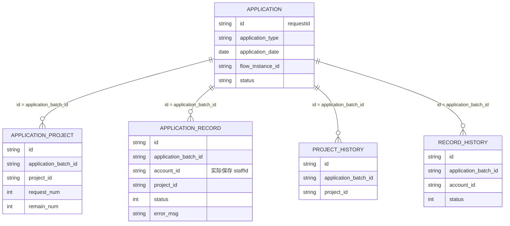
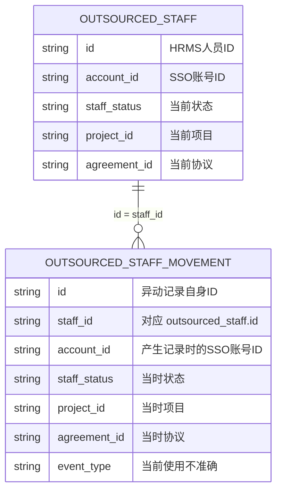
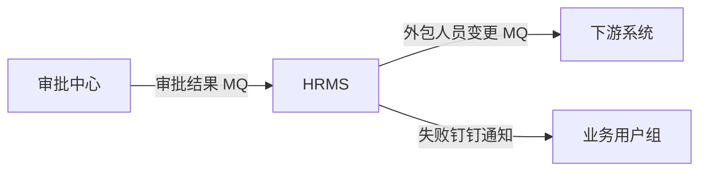
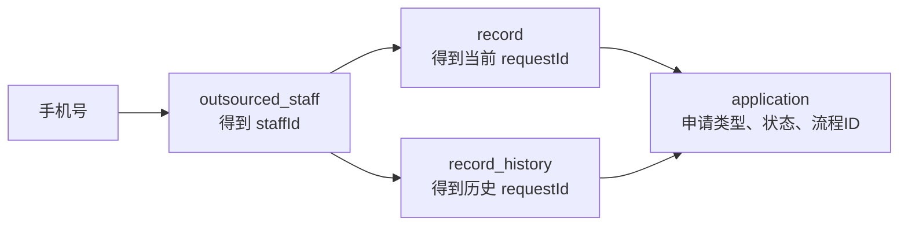
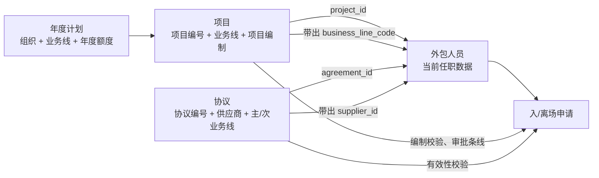
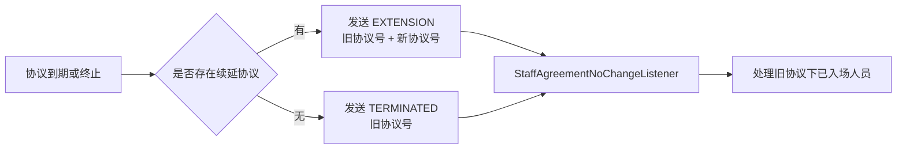
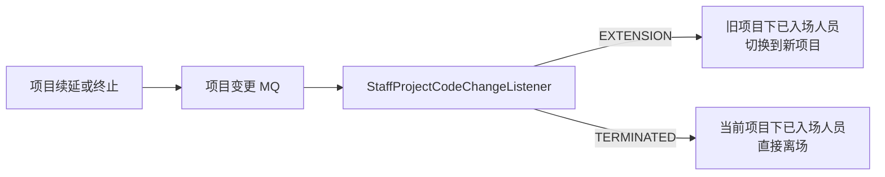

# 外包人员入离场审批与人员异动流程

> 整理日期：2026-07-31
> 项目：ABOSS Property HRMS  
> 范围：外包人员创建、入离场申请、审批、生效、异动记录、人员变更消息及历史申请排查

## 1. 整体认知

外包人员入离场并不是一个接口完成的，而是分成两个阶段：

1. **申请阶段**：选择人员、校验条件、创建草稿、提交审批。
2. **审批结果执行阶段**：接收审批结果，等待生效日期，实际创建/失效账号，更新人员状态，记录异动并通知下游。

最简主线：

```text
创建待入场人员
→ 初始化入场/离场申请
→ 生成 requestId
→ 保存人员申请明细；入场同时保存项目编制占用明细
→ 正式提交审批
→ 生成 flowInstanceId
→ 审批结果 MQ
→ 审批拒绝：明细转入历史表
→ 审批通过：立即执行或等待生效日
→ 实际创建/失效账号
→ 更新人员状态
→ 写人员异动快照
→ 发送外包人员变更 MQ
→ 申请成功或失败
→ 失败后重试
```

## 2. 完整流程图

```mermaid
flowchart TD
    START["前端选择外包人员"] --> INIT{"初始化申请类型"}

    INIT -->|入场| ONBOARD_INIT["onboard-request"]
    INIT -->|离场| OFFBOARD_INIT["offboard-request"]

    ONBOARD_INIT --> CHECK["校验人员、项目、协议、权限和编制"]
    OFFBOARD_INIT --> CHECK

    CHECK --> RID["生成 requestId<br/>即 application.id"]
    RID --> APP["写申请主表<br/>status = init"]
    RID --> RECORD["写人员明细<br/>application_batch_id = requestId<br/>status = 0"]
    APP --> PROJECT_INIT{"初始化时的项目编制处理"}
    RECORD --> PROJECT_INIT
    PROJECT_INIT -->|入场| PROJECT_ON["写项目申请明细<br/>request_num = -申请人数<br/>status=init 时计入 pendingNum"]
    PROJECT_INIT -->|离场| PROJECT_OFF["暂不写项目申请明细"]

    PROJECT_ON --> CONFIRM["按 requestId 查询人员和项目编制进行确认"]
    PROJECT_OFF --> CONFIRM

    CONFIRM --> APPLY{"正式提交"}
    APPLY -->|入场| ONBOARD_APPLY["onboard-request-apply"]
    APPLY -->|离场| OFFBOARD_APPLY["offboard-request-apply"]

    ONBOARD_APPLY --> FLOW["调用流程中心发起审批"]
    OFFBOARD_APPLY --> FLOW
    FLOW --> FID["流程中心返回 flowInstanceId"]
    FID --> APPROVING["申请单 status = approving<br/>人员进入审批中状态<br/>入场 -人数改计入 usedNum"]

    APPROVING --> FLOW_CENTER["审批中心处理"]
    FLOW_CENTER --> RESULT_MQ["审批中心发送结果 MQ"]
    RESULT_MQ --> LISTENER["StaffOnOffboardFlowListener"]
    LISTENER --> RESULT{"审批结果"}

    RESULT -->|REJECT| REJECTED["主表 status = rejected"]
    REJECTED --> MOVE_PROJECT["项目明细移入 project_history"]
    REJECTED --> MOVE_RECORD["人员明细移入 record_history"]

    RESULT -->|FINISH| APPROVED{"入场还是离场"}
    APPROVED -->|入场| ON_DATE{"入场日期 ≤ 今天？"}
    APPROVED -->|离场| OFF_DATE{"离场日期 ＜ 今天？"}

    ON_DATE -->|否| WAIT_ON["申请 approved<br/>人员 -2 审批通过待入场"]
    OFF_DATE -->|否| WAIT_OFF["申请 approved<br/>人员 3 审批通过待离场"]
    WAIT_ON --> SCHEDULER["UPDATE_STAFF_STATUS_HANDLER<br/>定时任务扫描"]
    WAIT_OFF --> SCHEDULER
    SCHEDULER --> DUE{"查询 status = approved<br/>且申请日期已到的申请"}
    DUE -->|application_type = onboard<br/>日期 ≤ 今天| EXEC_ON
    DUE -->|application_type = offboard<br/>日期 < 今天| EXEC_OFF

    ON_DATE -->|是| EXEC_ON["创建账号或返聘<br/>人员状态改为 0 已入场<br/>项目侧不再新增明细"]
    OFF_DATE -->|是| EXEC_OFF["账号失效<br/>人员状态改为 1 已离场"]

    EXEC_ON --> EXEC_RESULT{"单个人员处理结果"}
    EXEC_OFF --> EXEC_RESULT
    EXEC_RESULT -->|成功| RECORD_SUCCESS["申请人员明细 status = 1"]
    RECORD_SUCCESS --> MOVEMENT["写 outsourced_staff_movement"]
    MOVEMENT --> CHANGE_MQ["发送外包人员变更 MQ"]
    CHANGE_MQ --> BATCH_RESULT{"整批人员是否全部成功"}

    EXEC_RESULT -->|失败| RECORD_FAIL["人员明细 status = 2<br/>保存 errorMsg"]
    RECORD_FAIL --> NOTICE["发送钉钉失败通知"]
    NOTICE --> BATCH_RESULT

    BATCH_RESULT -->|是| APP_SUCCESS["申请 status = success"]
    BATCH_RESULT -->|否| APP_FAIL["申请 status = fail"]
    APP_SUCCESS --> PROJECT_EFFECT{"项目编制结果"}
    APP_FAIL --> PROJECT_EFFECT
    PROJECT_EFFECT -->|入场| PROJECT_KEEP["保留初始化时的 -申请人数记录<br/>项目已入场人数继续占用"]
    PROJECT_EFFECT -->|离场| PROJECT_RELEASE["整批处理后新增项目明细<br/>request_num = +申请人数<br/>抵消原入场记录，释放编制"]

    APP_FAIL --> RETRY["retry-on-offboard-request<br/>只重试明细 status = 0/2 的人员"]
    RETRY --> RETRY_TYPE{"重试入场还是离场"}
    RETRY_TYPE -->|入场| RETRY_ON["重试创建账号/返聘<br/>成功后写异动并发送人员变更 MQ"]
    RETRY_TYPE -->|离场| RETRY_OFF["重试账号失效和人员离场<br/>成功后写异动，不重复释放项目编制"]
    RETRY_ON --> RETRY_RESULT["全部成功则 success<br/>仍有失败则 fail"]
    RETRY_OFF --> RETRY_RESULT
```



## 3. 关键 ID 的含义

### 3.1 staffId

HRMS 外包人员主键：

```text
staffId = outsourced_staff.id
```

它回答的是：**这是 HRMS 里的哪一个人？**

### 3.2 accountId

账号中心/SSO 的外部账号 ID：

```text
accountId = outsourced_staff.account_id
```

它回答的是：**这个人在账号中心使用哪个账号？**

需要注意，申请人员明细表的 `account_id` 字段命名具有误导性。创建明细时实际执行：

```java
recordEntity.setAccountId(staff.getId());
```

因此真实关系是：

```text
application_record.account_id = outsourced_staff.id = staffId
```

而不是 SSO 的 `accountId`。

### 3.3 requestId

`requestId` 是 HRMS 入场/离场申请单 ID：

```text
requestId
= applicationId
= application.id
= 明细表.application_batch_id
```

它回答的是：**这是哪一次入场或离场申请？**

### 3.4 flowInstanceId

流程中心创建审批流程后返回的流程实例 ID。

```text
requestId      = HRMS 业务申请单 ID
flowInstanceId = 流程中心审批实例 ID
```

两者属于不同系统，但通常是一一对应关系。

### 3.5 flowReqId

按名称应表示“发起流程请求 ID”，但当前实现把同一个 `flowInstanceId` 同时写入：

```java
applicationEntity.setFlowReqId(flowInstanceId);
applicationEntity.setFlowInstanceId(flowInstanceId);
```

所以当前代码中二者实际没有区别。

## 4. 申请相关五张表



| 表 | 作用 |
|---|---|
| `outsourced_staff_onoffboard_application` | 申请主表，一行代表一张入/离场申请 |
| `outsourced_staff_onoffboard_application_project` | 当前申请影响的项目编制快照 |
| `outsourced_staff_onoffboard_application_record` | 当前申请包含的人员及每个人的处理结果 |
| `outsourced_staff_onoffboard_application_project_history` | 被拒申请的项目编制历史 |
| `outsourced_staff_onoffboard_application_record_history` | 被拒申请的人员明细历史 |

核心外键式关系：

```text
明细表.application_batch_id
= outsourced_staff_onoffboard_application.id
= requestId
```

## 5. 核心接口的业务分组

### 5.1 初始化申请

- `onboardRequest`：选择人员、校验入场条件、创建入场草稿。
- `offboardRequest`：选择人员、校验离场条件、创建离场草稿。

初始化阶段会生成 `requestId`，但还没有真正发起审批。

### 5.2 正式提交

- `onboardRequestApply`：填写入场日期、备注、附件并发起入场审批。
- `offboardRequestApply`：填写离场日期、备注、附件并发起离场审批。

流程中心返回 `flowInstanceId` 后：

```text
申请状态 = approving
入场人员状态 = -3 入场审批中
离场人员状态 = 2 离场审批中
```

### 5.3 查询

- `queryOnOffboardRequest`：查询申请涉及的项目编制。
- `queryOnOffboardRequestStaff`：分页查询申请包含的人员。
- `queryOnOffboardApproveDetail`：查询申请人、日期、流程、备注、附件等审批头信息。
- `queryStaffApplyProject(s)`：项目编制辅助查询。

### 5.4 取消和重试

- `cancelOnOffboardRequest`：只允许取消 `init` 草稿，直接删除主表及当前明细，不写历史表。
- `retryOnOffboardRequest`：只允许重试 `fail` 申请，只处理人员明细状态为 `0/2` 的人员。

## 6. 三套状态

### 6.1 申请单状态

字段：`application.status`

| 状态 | 含义 |
|---|---|
| `init` | 草稿 |
| `approving` | 审批中 |
| `approved` | 审批通过，等待生效 |
| `rejected` | 审批拒绝 |
| `processing` | 处理中 |
| `success` | 实际业务全部处理成功 |
| `fail` | 至少有一名人员实际处理失败 |

### 6.2 人员状态

字段：`outsourced_staff.staff_status`

| 状态 | 含义 |
|---:|---|
| `-3` | 入场审批中 |
| `-2` | 审批通过待入场 |
| `-1` | 待入场 |
| `0` | 已入场 |
| `1` | 已离场 |
| `2` | 离场审批中 |
| `3` | 审批通过待离场 |

### 6.3 申请人员明细状态

字段：`application_record.status`

| 状态 | 含义 |
|---:|---|
| `0` | 实际业务待处理 |
| `1` | 实际业务处理成功 |
| `2` | 实际业务处理失败 |

例如未来日期的入场申请已经审批通过：

```text
application.status = approved
staff.status        = -2
record.status       = 0
```

含义是审批已通过，但真正的账号创建和人员入场尚未执行。

## 7. 审批结果执行

### 7.1 审批结果从哪里来

流程中心通过 MQ 发送：

- `FINISH`：审批通过。
- `REJECT`：审批拒绝。

HRMS 监听入口：`StaffOnOffboardFlowListener`。

### 7.2 入场审批通过

如果 `applicationDate <= 今天`：

1. 有历史账号则调用 SSO 返聘。
2. 无账号则调用 SSO 创建外部账号。
3. 人员状态更新为 `0 已入场`。
4. 人员明细更新为 `1 成功`。
5. 写人员异动快照。
6. 发送外包人员变更 MQ。
7. 全部成功则申请状态更新为 `success`，否则为 `fail`。

如果日期尚未到：

```text
申请状态 = approved
人员状态 = -2 审批通过待入场
```

等待定时任务到期后执行实际入场。

### 7.3 离场审批通过

如果 `applicationDate < 今天`：

1. 查询账号状态，必要时调用 SSO 使账号失效。
2. 保存历史手机号，当前手机号替换为随机 ID。
3. 人员状态更新为 `1 已离场`。
4. 人员明细更新为 `1 成功`。
5. 写人员异动快照。
6. 发送外包人员变更 MQ。
7. 全部成功则申请状态更新为 `success`，否则为 `fail`。
8. 整批人员处理后，按申请明细的项目和人数新增一条 `request_num = +申请人数` 的项目申请明细，用于抵消入场时的负数记录并释放项目编制。

如果日期尚未到或等于今天：

```text
申请状态 = approved
人员状态 = 3 审批通过待离场
```

等待定时任务处理。

### 7.4 定时任务到期后的完整处理

定时任务入口是 `UPDATE_STAFF_STATUS_HANDLER`，每次执行时只扫描已审批但尚未生效的申请：

```text
入场：application_type = onboard
     且 application.status = approved
     且 application_date <= 当前时间

离场：application_type = offboard
     且 application.status = approved
     且 application_date < 当前时间
     实际业务判断仍以“离场日期 < 今天”为准
```

扫描到申请后，定时任务使用申请的 `flowInstanceId` 重新进入 `confirmOnOffboardRequest(..., approved)`，与审批 MQ 立即生效时共用同一套账号、人员、异动和通知逻辑。

项目侧不会直接更新项目主表，而是汇总 `outsourced_staff_onoffboard_application_project.request_num`：

| 场景 | 项目申请明细 | 对项目的结果 |
|---|---|---|
| 入场初始化 | 写 `-申请人数` | `init` 时计入待申请人数；提交后计入已入场人数，占用编制 |
| 入场到期实际执行 | 不新增项目明细 | 继续沿用初始化时的负数记录 |
| 离场初始化、审批和等待到期 | 不写项目明细 | 编制仍被原入场记录占用 |
| 离场到期实际执行 | 整批处理后写 `+申请人数` | 抵消原入场负数记录，项目已入场人数减少，编制被释放 |
| 离场失败后重试 | 不再新增 | 不重复释放编制 |

**当前代码边界：**离场的 `+申请人数` 是按整张申请的人员明细数量写入，不是按实际成功人数写入。因此即使存在单人离场失败，申请状态变为 `fail` 时也会先释放整批项目编制，失败人员后续由 `retry-on-offboard-request` 重试。

## 8. 审批拒绝与历史表

审批拒绝后并不是删除全部申请：

```text
申请主表继续保留，status = rejected
当前项目明细删除并复制到 project_history
当前人员明细删除并复制到 record_history
```

拒绝后的结构：

```text
application（保留）
├── status = rejected
├── project_history
└── record_history
```

这样做的意图是让拒绝数据退出当前业务处理，同时保留审计历史。

## 9. 人员表与异动表关系



字段映射：

```text
movement.id         = 异动记录自己的主键
movement.staff_id   = outsourced_staff.id
movement.account_id = 记录产生时 outsourced_staff.account_id 的快照
```

一名人员可以拥有多条异动记录：

```text
outsourced_staff：保存人员当前状态
outsourced_staff_movement：保存人员各个时间点的任职快照
```

## 10. 人员异动记录什么时候写

任职记录表为 `outsourced_staff_movement`。它保存的是产生记录时的人员完整快照，当前更接近“人员任职信息快照表”，而不是严格的“异动事件流水表”。

### 10.1 入场、离场实际执行成功

以下时点会新增一条记录：

- 入场审批通过且入场日期已到，账号创建或返聘成功，人员状态已更新为 `0 已入场`。
- 离场审批通过且离场日期已到，账号失效成功，人员状态已更新为 `1 已离场`。
- 入场失败后重试成功。
- 离场失败后重试成功。

审批通过但生效日期未到时，只会把人员更新为 `-2 审批通过待入场` 或 `3 审批通过待离场`，此时不写任职记录；等待定时任务实际执行成功后才写。

入场记录的任职开始、结束日期取人员表中的 `onboard_date`、`offboard_date`。离场时会先把最近一条相同账号、相同协议、`event_type = AGREEMENT` 的记录结束日期更新为申请离场日期，再新增一条离场状态快照。

### 10.2 人工修改人员信息

人员修改成功后，只有以下字段至少一个发生变化才新增任职记录：

| 字段 | 含义 |
|---|---|
| `project_id` | 所属项目 |
| `branch_org_code` | 归属组织/部门 |
| `work_position_code` | 工作范围/岗位 |
| `with_permission` | 是否配置权限 |

如果上面四个字段都未变化，但 `agreement_id` 发生变化，则按“仅协议变更”处理：

1. 查找原账号、原协议下最近一条 `event_type = AGREEMENT` 的记录。
2. 如果找到，把上一条记录的任职结束日期更新为当前时间。
3. 按新协议新增一条记录，任职开始日期为当前时间，结束日期沿用人员原离场日期。

人员修改存在两个明确的不记录条件：

- 原人员状态为 `-1 待入场`，并且不存在审批中或已批准的入场申请。
- 原人员状态为 `1 已离场`。

因此，只修改姓名、性别、邮箱、学历、手机号、用工类型等普通字段不会新增任职记录。

注意：如果项目、组织、岗位或权限与协议同时变化，代码优先进入“四个核心字段变化”分支，不再执行“仅协议变更”分支；仍会新增快照，但不会关闭原协议对应的上一条记录，而且该新增记录没有显式设置 `event_type`。

### 10.3 批量导入更新

批量导入只对匹配到已有 `staffId` 的人员执行任职记录判断，判断规则与人工修改完全相同：

- 待入场且没有审批中/已批准申请时不写。
- 已离场时不写。
- 项目、组织、岗位、权限任一变化时写。
- 上述字段未变化但协议变化时写。

批量导入中的新增人员不会在该处理路径直接生成任职记录，后续仍需实际入场成功才会生成。

### 10.4 协议续延与终止

协议续延只查询旧协议下状态为 `0 已入场` 的人员。对每个人：

1. 人员表的协议编号更新为新协议。
2. 原协议最近一条任职记录的结束日期更新为当前时间。
3. 新增一条新协议快照，开始日期为当前时间，结束日期沿用上一条记录原来的结束日期。

协议终止也只处理状态为 `0 已入场` 的人员。人员会被改为 `1 已离场`，离场日期设为当前时间，然后更新上一条记录并新增一条离场快照。

### 10.5 项目续延与终止

项目续延只处理旧项目下状态为 `0 已入场` 的人员。人员切换到新项目后，代码更新旧项目最近一条任职记录的结束日期，并新增一条新项目快照。

项目终止只处理该项目下状态为 `0 已入场` 的人员。人员会被改为 `1 已离场`，离场日期设为当前时间，然后更新上一条记录并新增一条离场快照。

### 10.6 数据保障接口补数据

手工调用：

```text
POST /platform/api/aboss/hrms/data/refreshOutsourcedStaffCreator2
```

会扫描人员状态为以下值的数据：

```text
0 已入场
1 已离场
2 离场审批中
3 审批通过待离场
```

对每个人按 `staff_id` 查询最近一条任职记录：

- 没有任职记录：根据人员当前数据新增一条，协议开始、结束日期取人员的入场、离场日期，`event_type = AGREEMENT`。
- 已有任职记录：不新增，只更新最近一条记录的协议开始日期、结束日期和 `event_type`。

该接口名称和注释仍写着刷新人员 `creator`，但实际执行的是任职记录补数，名称与行为不一致。

### 10.7 场景汇总

| 场景 | 是否新增任职记录 | 补充条件 |
|---|---:|---|
| 创建待入场人员 | 否 | 创建人员本身不写 |
| 初始化或提交入离场申请 | 否 | 只写申请相关表 |
| 审批通过但生效日未到 | 否 | 实际执行成功后才写 |
| 实际入场成功 | 是 | 正常处理及重试均写 |
| 实际离场成功 | 是 | 正常处理及重试均写，并更新上一条记录 |
| 修改项目、组织、岗位、权限 | 是 | 受人员状态和申请条件限制 |
| 仅修改协议 | 是 | 同时关闭原协议最近一条记录 |
| 只修改普通资料字段 | 否 | 如姓名、邮箱、学历等 |
| 批量导入更新已有人员 | 视字段变化而定 | 规则与人工修改相同 |
| 批量导入新增人员 | 否 | 后续实际入场成功才写 |
| 协议续延、终止 | 是 | 只处理已入场人员 |
| 项目续延、终止 | 是 | 只处理已入场人员 |
| 手工执行数据保障接口 | 可能 | 无记录则新增，有记录则只更新 |

## 11. 消息机制



### 11.1 审批结果 MQ

方向：

```text
审批中心 → HRMS
```

用于通知 HRMS 审批通过或拒绝，携带 `flowInstanceId`。

### 11.2 外包人员变更 MQ

方向：

```text
HRMS → 下游系统
```

它发送的是人员最新完整快照，不是明确事件。消息中没有：

```text
eventType
requestId
flowInstanceId
changedFields
```

当前发送场景：

| 场景 | 是否发送 |
|---|---:|
| 实际入场成功 | 是 |
| 实际离场成功 | 是 |
| 人工修改人员信息 | 是 |
| 符合条件的批量导入更新 | 是 |
| 入场重试成功 | 是 |
| 离场重试成功 | 当前未发送 |
| 初始化/提交/审批中 | 否 |
| 审批拒绝 | 否 |
| 审批通过但生效日未到 | 否 |

### 11.3 失败通知

实际创建账号、返聘、账号失效或后续人员处理失败时：

1. 人员申请明细标记为 `2`。
2. 保存 `errorMsg`。
3. 申请单标记为 `fail`。
4. 通过消息中心向业务用户组发送钉钉 Markdown 通知。

## 12. 历史申请查询方法

### 12.1 第一步：手机号查人员

```sql
SELECT
    id,
    staff_name,
    account_id,
    contact_number,
    history_contact_number,
    staff_status
FROM outsourced_staff
WHERE contact_number = :phone
   OR history_contact_number = :phone;
```

需要同时查询当前手机号和历史手机号，因为离场后当前手机号可能已经被替换。

### 12.2 第二步：staffId 查当前申请明细

```sql
SELECT
    id,
    application_batch_id,
    account_id,
    project_id,
    agreement_id,
    status,
    error_msg,
    gmt_create,
    gmt_modified
FROM outsourced_staff_onoffboard_application_record
WHERE account_id = :staffId
ORDER BY gmt_create DESC;
```

这里的：

```text
account_id = staffId
application_batch_id = requestId
```

### 12.3 第三步：staffId 查历史申请明细

```sql
SELECT
    id,
    application_batch_id,
    account_id,
    project_id,
    agreement_id,
    status,
    error_msg,
    gmt_create,
    gmt_modified
FROM outsourced_staff_onoffboard_application_record_history
WHERE account_id = :staffId
ORDER BY gmt_create DESC;
```

用于补齐审批被拒后转入历史表的申请。

### 12.4 第四步：requestId 查申请主表

```sql
SELECT
    id,
    application_type,
    application_date,
    status,
    flow_req_id,
    flow_instance_id,
    remark,
    gmt_create,
    gmt_modified
FROM outsourced_staff_onoffboard_application
WHERE id IN (:requestIds)
ORDER BY gmt_create DESC;
```

判断“什么时候发起申请”优先看 `gmt_create`，而不是 `application_date`：

```text
gmt_create       = 申请单创建时间
application_date = 计划入场/离场生效日期
```

### 12.5 查询链路



## 13. 当前代码存在的主要问题

### 13.1 flowReqId 与 flowInstanceId 未实际区分

两个字段保存同一个值，字段语义不清晰。

### 13.2 application_record.account_id 命名错误或误导

实际保存的是 `staffId`，不是 SSO `accountId`。

### 13.3 异动类型不可靠

虽然异动表存在 `event_type`，但当前代码中：

- 入场写 `AGREEMENT`。
- 离场写 `AGREEMENT`。
- 协议变更写 `AGREEMENT`。
- 项目变化也写 `AGREEMENT`。
- 普通修改可能没有明确设置。

因此无法根据 `event_type` 判断真实异动类型。

建议的业务事件类型包括：

```text
ONBOARD
REHIRE
OFFBOARD
PROJECT_CHANGE
AGREEMENT_CHANGE
ORG_CHANGE
POSITION_CHANGE
PERMISSION_CHANGE
PROJECT_TERMINATION
AGREEMENT_TERMINATION
IMPORT_UPDATE
```

### 13.4 异动记录无法直接关联业务来源

异动表缺少：

```text
application_id
flow_instance_id
change_source
changed_fields
before_data
after_data
```

因此无法直接知道一条异动来自哪张申请或具体修改了什么。

### 13.5 离场重试成功未发送人员变更 MQ

正常离场成功会发送，入场重试成功也会发送，但离场重试路径当前没有调用人员变更消息处理器，疑似遗漏。

### 13.6 离场日期边界需要确认

当前判断：

```text
入场：applicationDate <= 今天时执行
离场：applicationDate < 今天时执行
```

所以离场日期等于今天时通常要等到第二天定时任务处理。需要确认是否符合“离场日当天仍有效”的业务定义。

### 13.7 历史明细搬迁存在一致性风险

拒绝处理代码大体是：

```text
删除当前明细
→ 插入历史明细
```

相关处理方法没有看到明确事务，理论上存在删除成功、历史插入失败导致数据丢失的风险。

### 13.8 当前表和历史表语义不统一

只有 `rejected` 明细搬入历史表：

- `success` 继续保留在当前表。
- `fail` 继续保留在当前表。
- `rejected` 存放在历史表。

所以当前表并不等于“进行中数据”，历史表也不等于“全部已结束数据”。

### 13.9 人员列表可能隐藏已结束流程入口

人员列表只补充 `approving/approved/fail` 申请的 `requestId` 和 `flowInstanceId`。`success/rejected` 不会返回原流程 ID，因此业务人员可能感觉“之前的审批流程不见了”，但申请记录未必被删除。

### 13.10 跨系统一致性与幂等问题

实际入离场涉及：

```text
SSO账号中心
HRMS人员表
申请主表
申请人员明细
人员异动表
人员变更MQ
钉钉通知
```

需要进一步确认：

- 审批结果 MQ 重复投递是否会重复创建账号或异动记录。
- 定时任务与审批结果 MQ 是否可能同时处理一张申请。
- 数据库成功但 MQ 发送失败如何补偿。
- SSO 成功但 HRMS 更新失败如何补偿。
- 下游如何处理重复或乱序的人员快照消息。

### 13.11 部分协议、项目处理依赖上一条任职记录

协议终止、项目续延和项目终止逻辑在查询上一条任职记录后，部分代码没有完整处理查询结果为空的情况，随后会直接读取上一条记录的开始或结束日期。

因此，如果历史任职记录缺失，可能出现空指针异常：人员表已经更新，但新任职记录没有成功写入。协议续延虽然允许上一条记录为空，但此时新记录的结束日期会退化为当前时间。

### 13.12 项目终止查询上一条记录的参数疑似错误

项目终止处理调用“按账号和项目编号查询最近记录”时，实际传入的是人员的 `agreement_id`，不是 `project_id`。这可能导致查不到上一条记录，并进一步触发空指针异常。

## 14. 推荐代码阅读顺序

1. `OutsourcedStaffBaseRepositoryImpl`：人员创建、修改、删除。
2. `OutsourcedStaffApplicationHandler`：入离场初始化和正式提交。
3. `StaffOnOffboardFlowListener`：接收审批结果 MQ。
4. `OutsourcedStaffApprovalHandler`：审批通过后的实际入离场、失败和重试。
5. `OutsourcedStaffMovementRepositoryImpl`：人员异动快照。
6. `OutsourcedStaffChangeHandler`：外包人员变更 MQ。
7. `UpdateStaffStatusHandler`：未来生效日期的定时处理。
8. `OutsourcedStaffQueryHandler`：申请人员、编制和审批详情查询。

## 15. 人员、业务线、协议、项目的联动关系

### 15.1 先记住一条主线

对人员管理来说，四者不是一条简单的父子链，而是人员同时保存多组业务关联：



人员表中直接保存：

| 人员字段 | 来源 | 当前含义 |
|---|---|---|
| `project_id` | 用户选择的项目 | 人员当前占用哪个项目编制 |
| `business_line_code` | 根据项目查询后带出 | 人员当前归属的业务线快照 |
| `agreement_id` | 用户选择的协议编号 | 本次任职使用哪个协议 |
| `supplier_id` | 根据协议的 `part_b` 带出 | 人员归属的供应商快照 |

所以最准确的理解是：

```text
人员 → 项目 → 业务线、项目编制
人员 → 协议 → 供应商
协议 ↔ 业务线：协议自身另有主业务线、次业务线配置
```

### 15.2 项目与业务线、计划编制的关系

一个项目只保存一个 `business_line_code`，同时保存归属组织、起止年度和 `project_quota`。项目额度来源于年度计划：

```text
plan_detail
按 计划年度 + 归属组织 + 业务线 分配额度
        ↓
project_detail
从计划额度中划出项目编制 project_quota
        ↓
outsourced_staff
人员通过 project_id 占用该项目编制
```

入场初始化会按项目统计人数，并在 `outsourced_staff_onoffboard_application_project` 保存负数项目编制快照；离场初始化不写该表，实际离场处理后才写正数释放记录。明细包括项目总编制、申请变动数和剩余数量。

同一张入场或离场申请要求所有人员属于同一个项目。发起审批时，流程变量中的业务线也取该项目的 `business_line_code`，因此人员申请的审批路由实际上由项目条线决定。

### 15.3 协议与业务线、供应商的关系

协议主表保存乙方供应商 `part_b`。协议还通过 `agreement_business_line_ref` 关联业务线：

```text
agreement.id
    ↓
agreement_business_line_ref.agreement_id
    ├── is_main_line = 1：主业务线
    └── is_main_line = 0：次业务线
```

协议主、次业务线主要用于：

- 协议列表和权限过滤。
- 协议新建、变更、续延时的审批路由。
- 判断用户是否有权操作该协议。

人员选择协议时，系统查询的是状态为 `APPROVED` 的协议，并把协议乙方 `part_b` 写入人员 `supplier_id`。

### 15.4 创建人员时怎样联动

创建人员时，代码按以下顺序处理：

1. 根据 `agreementNo` 查询已生效协议；查不到则提示“协议不存在”。
2. 从协议读取 `part_b`，写入人员 `supplier_id`。
3. 根据 `projectCode` 查询项目；查不到则提示“项目不存在”。
4. 把项目编号写入人员 `project_id`。
5. 从项目读取业务线，写入人员 `business_line_code`。
6. 人员以 `-1 待入场` 保存，此时不占用实际入场编制，也不写任职记录。

这里的“协议存在”和“项目存在”是两次独立校验。当前代码没有继续检查：

```text
项目.business_line_code
是否属于
协议的主业务线或次业务线
```

也没有检查协议是否明确关联当前项目。也就是说，从当前代码看，人员可能选择一个有效协议和一个有效项目，但二者业务线并不一致。

另外，项目查询方法会返回 `APPROVED` 和 `TERMINATED` 状态的项目，因此“项目存在”不完全等于“项目当前可用于新人员”，终止项目也可能通过这层查询。

### 15.5 修改人员时怎样联动

修改人员时会重新查询协议和项目，并重新覆盖：

```text
supplier_id        ← 新协议.part_b
project_id         ← 新项目.project_code
business_line_code ← 新项目.business_line_code
agreement_id       ← 新协议编号
```

项目修改受人员状态限制：只有 `-1 待入场` 或 `1 已离场` 可以人工切换项目。已入场、入场审批中、待离场等状态不能通过普通人员修改接口切换项目。

协议修改没有同样的人员状态限制，只要求新协议是 `APPROVED`。如果协议编号变化，会按第 10 节的规则记录任职快照。

### 15.6 入场申请时怎样联动

入场初始化会重新检查每名人员：

| 检查项 | 规则 |
|---|---|
| 人员状态 | 只能是待入场或已离场返聘；不能已在入场、离场流程中 |
| 项目 | `project_id` 必须能查到项目 |
| 协议 | `agreement_id` 必须能查到 `APPROVED` 协议 |
| 批次项目 | 同一批人员必须属于同一个项目 |
| 条线权限 | 当前用户必须有项目所属业务线权限 |
| 机构权限 | 人员经营组织必须在申请人的机构权限范围内 |
| 项目编制 | 按项目统计本次入场人数并计算剩余编制 |

申请人员明细会同时快照保存人员当时的：

```text
staffId（写在 application_record.account_id）
project_id
agreement_id
```

因此申请提交后，即使人员主表后来发生变化，申请明细中仍保留初始化申请时的项目和协议编号。

当前入场校验仍然没有检查“人员项目的业务线”和“人员协议的主/次业务线”是否一致；条线权限判断只使用项目的业务线。

### 15.7 离场申请时怎样联动

离场只允许状态为 `0 已入场` 的人员。系统同样检查项目、协议、业务线权限和机构权限，但离场查询协议时不限制协议必须为 `APPROVED`，这是为了允许已经到期或终止协议下的在场人员继续办理离场。

离场成功后：

- 人员状态变为 `1 已离场`。
- 项目释放相应编制。
- 人员当前 `project_id`、`agreement_id` 不会清空，用于保留最后一次任职归属。
- 任职表新增离场快照。

### 15.8 协议变化如何反向影响人员

协议状态变化不是直接调用人员服务，而是通过协议变更 MQ 联动：



只处理 `agreement_id = 旧协议号` 且状态为 `0 已入场` 的人员：

- 协议续延：把人员 `agreement_id` 换成新协议号，并新增任职记录。
- 协议终止且没有续延：人员直接变为 `1 已离场`，账号失效，并新增任职记录。

协议联动不会修改人员的 `project_id` 或 `business_line_code`。协议续延代码也没有根据新协议重新计算 `supplier_id`；如果续延协议更换了乙方供应商，人员仍可能保留旧供应商。

协议终止后，会按这些人员原来的 `project_id` 分组，生成项目编制释放记录，但不会终止项目本身。

### 15.9 项目变化如何反向影响人员

项目按年度续延或到期终止后，通过项目变更 MQ 联动人员：



- 项目续延：只处理旧项目下已入场人员，把 `project_id` 更新为新项目，同时把 `business_line_code` 更新为新项目的业务线，并新增任职记录。
- 项目终止且没有续延：只处理该项目下已入场人员，人员直接变为已离场，账号失效，并新增任职记录。

项目联动不会修改人员的 `agreement_id` 或 `supplier_id`。所以项目续延之后，人员仍继续使用原协议；代码也不会重新校验新项目业务线是否属于原协议的主/次业务线。

### 15.10 四类变化分别会改什么

| 变化场景 | 人员项目 | 人员条线 | 人员协议 | 人员供应商 | 人员状态 |
|---|---|---|---|---|---|
| 人工改项目 | 改 | 随新项目改 | 不一定改 | 随所选协议重算 | 通常不变 |
| 人工改协议 | 不一定改 | 随所选项目重写 | 改 | 随新协议改 | 不变 |
| 协议续延 MQ | 不改 | 不改 | 换成新协议 | **不重算** | 保持已入场 |
| 协议终止 MQ | 不改 | 不改 | 保留旧协议 | 不改 | 改为已离场 |
| 项目续延 MQ | 换成新项目 | 随新项目改 | 不改 | 不改 | 保持已入场 |
| 项目终止 MQ | 保留原项目 | 保留原条线 | 不改 | 不改 | 改为已离场 |

### 15.11 数据一致性边界

代码层面，人员表保存的 `project_id`、`agreement_id`、`business_line_code`、`supplier_id` 是独立字符串字段，关联关系主要由业务代码查询和回填维护，不是 ORM 对象关联。从仓库现有代码无法确认数据库是否另有外键约束。

当前需要特别留意：

1. 人员项目条线与协议主/次业务线没有强制一致性校验。
2. 项目查询包含已终止项目，创建、修改和入场场景可能把“查得到”误当成“可使用”。
3. 协议续延没有同步新协议供应商。
4. 项目续延不会重新校验原协议是否覆盖新项目条线。
5. MQ 消费失败或重复消费可能导致人员主表、任职记录和项目编制快照不同步，需要结合日志和数据共同排查。

排查某个人的联动关系时，建议按以下顺序查：

```text
outsourced_staff
→ 用 project_id 查 project_detail，确认项目状态、条线、年度和编制
→ 用 business_line_code 查业务线配置和当前用户权限
→ 用 agreement_id 查 agreement，确认协议状态、供应商和有效期
→ 用 agreement.id 查 agreement_business_line_ref，确认协议主/次业务线
→ 查 application_record / application_project，确认申请时的项目协议快照和编制变化
→ 查 outsourced_staff_movement，确认历史上何时切换项目或协议
```

## 16. 最终记忆模型

```text
staffId
= HRMS 中“这个人是谁”

accountId
= 账号中心中“这个人的外部账号是什么”

requestId / application.id
= HRMS 中“这是哪一次入场/离场申请”

application_batch_id
= “这条人员/项目明细属于哪张申请”

flowInstanceId
= 流程中心中“这是哪一条审批流程”

outsourced_staff
= 人员当前状态

人员.project_id
= 当前占用的项目；项目带出人员.business_line_code

人员.agreement_id
= 当前使用的协议；协议带出人员.supplier_id

项目.business_line_code
= 人员入离场的条线权限和审批路由依据

协议主/次业务线
= 协议自身的权限和审批配置；当前未与人员项目条线做强一致性校验

outsourced_staff_movement
= 人员历史任职快照

application_record
= 人员在某次申请中的执行状态
```
