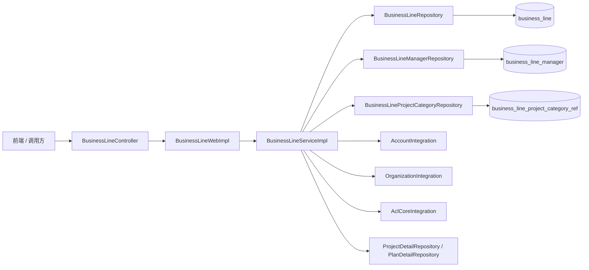
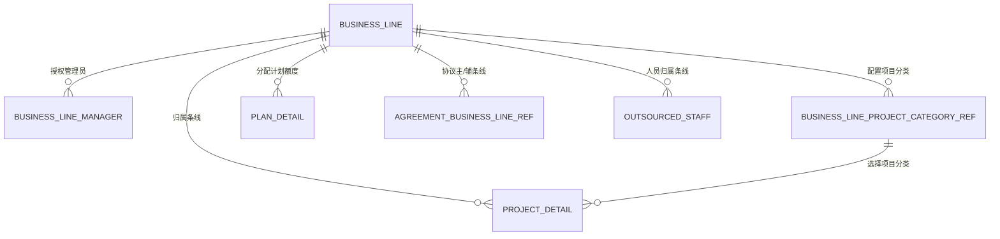
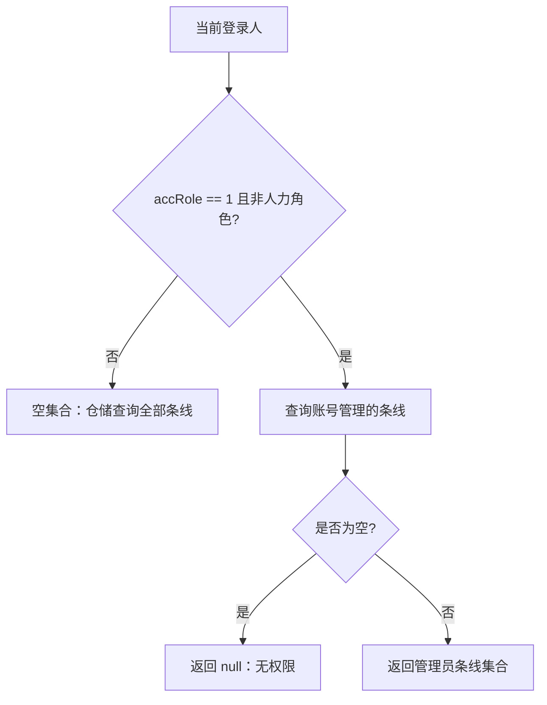

# 条线模块系统分析

> 分析日期：2026-07-23  
> 分析范围：ABOSS Property HRMS 当前代码，分支 `ECI10009588_20260710`，提交 `bd0c3765`  
> 名词说明：代码主要使用 `BusinessLine` 和“业务线”，部分页面、注释及提示语使用“条线”；本文统一称“条线”。

## 1. 模块定位

条线模块是 HRMS 的基础业务配置和数据权限支撑模块，核心职责包括：

1. 维护条线编码、条线名称等主数据。
2. 为条线增量授权或取消授权管理员。
3. 维护各条线可使用的项目分类。
4. 根据当前登录人、账号角色和人力角色，计算可见条线范围。
5. 为项目计划、项目、外包人员、协议等模块提供条线名称、条线集合和条线权限。

该模块不负责组织、账号、ACL 权限本身的维护，而是通过集成接口获取账号、组织和角色信息；也不负责项目、计划、协议的完整生命周期，只为这些模块提供条线维度的数据和权限能力。

## 2. 业务对象与职责边界

| 业务对象 | 代码对象 | 主要职责 |
| --- | --- | --- |
| 条线 | `BusinessLineDO` | 保存条线编码、名称及审计字段 |
| 条线管理员 | `BusinessLineManagerDO` | 建立条线与管理员账号的一对多关系 |
| 条线项目分类 | `BusinessLineProjectCategoryRefDO` | 维护条线下可选的项目分类 |
| 条线权限 | `BusinessLineService#getBusinessLinePermission` | 根据登录人角色、管理员关系和查询条件计算条线编码集合 |
| 组织数据权限 | `AclCoreIntegration#getCurrentAccIdDataPermission` | 根据页面资源和账号查询 ACL 中的组织权限编码；该能力虽暴露在条线 Controller 中，但不是条线主数据 |

## 3. 分层结构



调用链遵循项目现有分层：

```text
HTTP Controller
  → BusinessLineWeb（SOFA RPC 接口）
  → BusinessLineWebImpl（参数校验、统一结果封装）
  → BusinessLineServiceImpl（业务规则、事务、数据组装）
  → Repository
  → MyBatis-Plus Mapper / MyBatis XML
```

关键代码位置：

| 层次 | 文件 |
| --- | --- |
| Controller | `bootstrap/src/main/java/com/aliyun/fsi/insurance/hrms/controller/business/BusinessLineController.java` |
| Web 接口 | `web/src/main/java/com/aliyun/fsi/insurance/hrms/web/bussiness/BusinessLineWeb.java` |
| Web 实现 | `service/src/main/java/com/aliyun/fsi/insurance/hrms/service/impl/BusinessLineWebImpl.java` |
| 领域服务 | `domain/src/main/java/com/aliyun/fsi/insurance/hrms/domain/service/BusinessLineService.java` |
| 领域实现 | `domain/src/main/java/com/aliyun/fsi/insurance/hrms/domain/service/impl/BusinessLineServiceImpl.java` |
| 仓储实现 | `infrastructure/repository/src/main/java/com/aliyun/fsi/insurance/hrms/repository/impl/BusinessLine*RepositoryImpl.java` |
| 条线列表 SQL | `infrastructure/repository/src/main/resources/mapper/BussinessLineMapper.xml` |

`BusinessLineWebImpl` 使用 `AbossOperateTemplateBuilder` 统一执行 `check → execute → afterExecute`，成功时包装为 `ResultModel`，业务异常转换为失败结果，其他异常转换为 `SYSTEM_ERROR`。写操作的事务主要由 `BusinessLineServiceImpl` 上的 `@Transactional` 提供。

## 4. 数据模型

### 4.1 `business_line`

对应 `BusinessLineDO`，条线编码是主键。

| 字段 | Java 类型 | 说明 |
| --- | --- | --- |
| `code` | `String` | 条线编码，`@TableId` |
| `name` | `String` | 条线名称 |
| `gmt_create` | `Date` | 创建时间 |
| `gmt_modified` | `Date` | 修改时间 |
| `creator` | `String` | 创建人账号 ID |
| `modifier` | `String` | 最后修改人账号 ID |

### 4.2 `business_line_manager`

对应 `BusinessLineManagerDO`，每条记录表示一个账号是某条线的管理员。

| 字段 | Java 类型 | 说明 |
| --- | --- | --- |
| `id` | `Integer` | 自增主键 |
| `business_line_code` | `String` | 条线编码 |
| `account_id` | `String` | 管理员账号 ID |
| `gmt_create` | `Date` | 创建时间 |
| `gmt_modified` | `Date` | 修改时间 |
| `creator` | `String` | 授权操作人 |
| `modifier` | `String` | 最后修改人 |

### 4.3 `business_line_project_category_ref`

对应 `BusinessLineProjectCategoryRefDO`，保存条线下的项目分类。

| 字段 | Java 类型 | 说明 |
| --- | --- | --- |
| `id` | `String` | 主键字段；DO 中未显式标注 `@TableId` |
| `business_line_code` | `String` | 条线编码 |
| `project_category_name` | `String` | 项目分类名称 |
| `gmt_create` | `Date` | 创建时间 |
| `gmt_modified` | `Date` | 修改时间 |
| `creator` | `String` | 创建人 |
| `modifier` | `String` | 最后修改人 |

### 4.4 关联关系



以上是根据实体字段和代码调用得到的逻辑关系。三个条线实体都没有 `@TableLogic` 或删除标志，当前仓储删除调用均表现为物理删除。当前仓库未检索到上述三张条线表的建表 DDL，因此数据库外键、唯一索引及字段长度仍需以实际数据库为准。

## 5. HTTP 接口清单

统一前缀：`/platform/api/aboss/hrms/business/`。当前接口全部使用 `POST`。

| 接口路径 | 请求对象 | 返回数据 | 作用 |
| --- | --- | --- | --- |
| `query-business-line` | `BusinessLineQueryDTO` | `ResultModel<PageResult<BusinessLineListDTO>>` | 分页查询条线 |
| `query-business-line-by-accountId` | 无 | `ResultModel<List<BusinessLineListDTO>>` | 查询当前登录人可见条线 |
| `query-all-business-line` | 无 | `ResultModel<List<BusinessLineListDTO>>` | 查询全部条线，不套用条线权限 |
| `add-business-line` | `BusinessLineSaveDTO` | `ResultModel<Boolean>` | 新增条线 |
| `update-business-line` | `BusinessLineUpdateDTO` | `ResultModel<Boolean>` | 修改条线名称 |
| `delete-business-line` | `BusinessLineGetDTO` | `ResultModel<Boolean>` | 删除条线及其管理员、项目分类 |
| `get-business-line` | `BusinessLineGetDTO` | `ResultModel<BusinessLineDetailDTO>` | 查询条线详情 |
| `authorize-business-line-manager` | `BusinessLineManagerAuthorizeDTO` | `ResultModel<Boolean>` | 增量授权管理员 |
| `remove-business-line-manager` | `BusinessLineManagerRemoveDTO` | `ResultModel<Boolean>` | 取消指定管理员授权 |
| `get-business-line-manager` | `BusinessLineManagerGetDTO` | `ResultModel<List<BusinessLineManagerDTO>>` | 查询并筛选条线管理员 |
| `get-business-line-project-category` | `BusinessLineProjectCategoryQueryDTO` | `ResultModel<PageResult<BusinessLineProjectCategoryListDTO>>` | 分页查询项目分类 |
| `save-business-line-project-category` | `BusinessLineProjectCategorySaveDTO` | `ResultModel<Boolean>` | 新增项目分类 |
| `update-business-line-project-category` | `BusinessLineProjectCategoryUpdateDTO` | `ResultModel<Boolean>` | 修改项目分类 |
| `delete-business-line-project-category` | `BaseIdReqDTO` | `ResultModel<Boolean>` | 按 ID 删除项目分类 |
| `get-current-accId-data-permission` | `BaseIdReqDTO` | `List<String>` | 查询当前账号在当前页面下的 ACL 组织权限编码 |

最后一个接口由 Controller 直接调用 `AclCoreIntegration`，未经过 `BusinessLineWeb`，也未包装 `ResultModel`；请求中的 `id` 当前未被使用。

## 6. 主要请求与返回字段

### 6.1 条线主数据

| DTO | 字段与约束 |
| --- | --- |
| `BusinessLineQueryDTO` | `businessLineName` 可选、模糊匹配；`businessLineCode` 可选、精确匹配；`accountId` 可选；`current`、`pageSize` 为空时默认 1、10，但没有最小值或最大值注解 |
| `BusinessLineSaveDTO` | `businessLineCode` 必填，最长 32，只允许字母、数字、下划线；`businessLineName` 必填，最长 32 |
| `BusinessLineUpdateDTO` | `businessLineCode`、`businessLineName` 必填且最长 32；编码只作为定位条件，不允许通过该接口换码 |
| `BusinessLineGetDTO` | `businessLineCode` 必填 |
| `BusinessLineListDTO` | `businessLineCode`、`businessLineName`、`gmtModified`、`modifier`、`creator` |
| `BusinessLineDetailDTO` | `businessLineCode`、`businessLineName`、`businessLineManagerList`；当前详情实现只赋值前两个字段 |

新增 DTO 的编码正则提示语写的是“用户名只能包含英文字母、数字和下划线”，实际校验对象是条线编码。

### 6.2 条线管理员

| DTO | 字段与约束 |
| --- | --- |
| `BusinessLineManagerAuthorizeDTO` | `businessLineCode` 必填且最长 32；`businessLineManagerList` 非空，但列表元素没有非空约束 |
| `BusinessLineManagerRemoveDTO` | 字段及约束与授权 DTO 相同 |
| `BusinessLineManagerGetDTO` | `businessLineCode` 必填；可按 `accountId`、`displayName`、`branchOrgCode`、`includeChildren` 筛选 |
| `BusinessLineManagerDTO` | `accountId`、`displayName`、`branchOrgCode`、`branchOrgName`、`gmtCreate`、`gmtModified`、`creator` |

### 6.3 项目分类

| DTO | 字段与约束 |
| --- | --- |
| `BusinessLineProjectCategoryQueryDTO` | `businessLineCode` 非 null；`projectCategoryName` 可选、模糊匹配；`current` ≥ 1；`pageSize` 为 1～100 |
| `BusinessLineProjectCategorySaveDTO` | 条线编码必填、最长 32、只允许字母/数字/下划线；分类名称必填、最长 32 |
| `BusinessLineProjectCategoryUpdateDTO` | `id`、条线编码、分类名称必填；领域实现只使用 `id` 和分类名称 |
| `BusinessLineProjectCategoryListDTO` | `id`、`businessLineCode`、`projectCategoryName`、`gmtCreate`、`gmtModified` |

## 7. 核心业务流程

### 7.1 分页查询条线

1. Web 层检查分页参数；`current` 或 `pageSize` 任一为空时，会同时重置为 `1` 和 `10`。
2. SQL 支持条线名称模糊查询、条线编码精确查询和管理员账号精确查询。
3. 传入 `accountId` 时，SQL 关联 `business_line_manager`；最终按条线编码分组，按修改时间倒序。
4. 领域服务批量调用账号集成接口，把创建人、修改人的账号 ID 转换为展示名称。
5. 使用 PageHelper 组装 `PageResult`。

### 7.2 查询当前登录人可见条线

`query-business-line-by-accountId` 的实际调用链为：

```text
BusinessLineWebImpl.queryBusinessLineListByAccountId
  → BusinessLineService.queryBusinessLineListByCode
  → getBusinessLinePermission
  → BusinessLineRepository.queryAllBusinessLineList
```

权限集合的含义：

| 返回值 | 仓储层行为 |
| --- | --- |
| `null` | 明确无条线权限，调用方通常返回空结果 |
| 空集合 | 不添加 `IN` 条件，即查询全部条线 |
| 非空集合 | 仅查询集合中的条线 |

当前规则是：当 `accRole == "1"`（普通用户）且当前登录人不是人力角色时，只取 `business_line_manager` 中配置给该账号的条线；若一条也没有，则返回 `null`。`accRole == "2"` 表示超管。其他角色值或人力角色得到空权限集合，最终可查询全部条线。

领域服务中另有 `queryBusinessLineListByAccountId()`，它始终直接按当前账号查询管理员关系，主要被协议和人员权限相关逻辑调用。两个名称相近的方法语义并不相同。

### 7.3 新增条线

1. 校验编码、名称格式。
2. 按编码查询条线；存在则提示“业务线编码已存在!”。
3. 保存编码、名称及创建/修改审计字段。
4. 整个领域方法在事务中执行。

条线名称当前没有唯一性校验，同名不同编码可被保存。

### 7.4 修改条线

1. 按条线编码查询；不存在则提示“业务线不存在!”。
2. 仅更新名称、修改时间和修改人。
3. 条线编码作为主键和关联键，不在修改流程中变更。

### 7.5 删除条线

删除方法按以下顺序执行，并处于同一事务：

1. 查询该条线是否存在项目明细；存在则提示“该条线关联了编制和项目，无法删除”。
2. 查询该条线是否存在计划明细；存在则提示“该条线关联了计划，无法删除”。
3. 物理删除 `business_line` 中的条线记录。
4. 物理删除该条线的全部管理员关系。
5. 物理删除该条线的全部项目分类。

当前删除前没有单独校验条线本身是否存在，也没有显式检查协议条线关系、人员条线字段等其他引用；是否由数据库外键兜底需要结合生产库表结构确认。

### 7.6 授权与取消授权管理员

授权流程：

1. 校验条线存在性。
2. 查询该条线已有管理员账号。
3. 仅插入请求列表中尚不存在的账号，并记录授权人和时间。
4. 已存在账号跳过，不重复插入。

因此授权接口是“增量添加”，不是“以请求列表整体覆盖”。若要移除管理员，必须调用取消授权接口。取消授权按“条线编码 + 账号 ID”逐个物理删除。

### 7.7 查询条线管理员

1. 按条线编码查询全部管理员关系，按创建时间倒序。
2. 收集管理员账号和授权创建人账号，批量查询账号中心。
3. 回填管理员名称、归属组织编码、组织名称，以及创建人展示名称。
4. 在内存中按账号 ID、展示名称和组织范围筛选。

组织筛选规则：

| 条件 | 行为 |
| --- | --- |
| 未传 `branchOrgCode` | 不按组织过滤 |
| 总公司编码 `210000000000`，`includeChildren=false` | 仅保留总公司账号 |
| 总公司编码 `210000000000`，`includeChildren=true` | 不设置组织过滤，相当于全部组织 |
| 其他组织，`includeChildren=false` | 仅本组织 |
| 其他组织，`includeChildren=true` | 本组织 + `OrganizationIntegration` 返回的下级组织 |

该接口当前不分页。若账号中心没有返回任何账号信息，方法直接返回空列表，即使本地管理员关系表中存在数据。

### 7.8 条线项目分类

查询：按条线编码精确匹配，分类名称可模糊匹配，按创建时间倒序并分页。

新增：先校验条线存在，再按“条线编码 + 分类名称”做完全相等的重复校验，重复时提示“当前业务线该项目分类已存在!”。

修改：按分类 ID 更新分类名称和审计字段。请求中的条线编码当前未参与查询或更新。

删除：直接按分类 ID 物理删除。项目明细通过 `project_category_id` 引用该分类，但当前删除方法没有检查分类是否已被项目使用。

## 8. 权限模型

### 8.1 条线权限

条线管理员关系既用于后台维护，也用于项目、人员、协议等业务数据的可见范围。



当项目查询请求中携带 `businessLineCode` 时，当前实现会直接把该编码加入已有权限集合。这是“并集”而不是“与可管理条线求交集”。项目仓储最终组合为 `IN（授权条线 ∪ 请求条线）` 和 `= 请求条线`，因此受限用户传入未授权条线编码时仍可命中该条线。外包人员权限辅助类复制了同样的集合算法，也会把显式传入的未授权编码加入查询范围。

### 8.2 ACL 组织权限

`get-current-accId-data-permission` 根据以下信息查询 ACL：

1. `UserInfoContext` 中的当前账号 ID。
2. HTTP Referer 对应的功能资源标识。
3. ACL 返回的账号在该功能下的组织权限列表。

返回值是去重后的组织权限编码列表，不是条线编码列表。该接口与条线管理员权限是两套维度，调用方通常需要同时考虑条线范围和组织范围。

## 9. 跨模块使用

| 模块 | 条线能力的使用方式 |
| --- | --- |
| 项目计划 | 按条线分配、汇总可用额度；展示条线名称；导入时校验条线编码 |
| 项目管理 | 项目保存 `businessLineCode` 和 `projectCategoryId`；列表查询套用条线权限；详情回填条线和分类名称 |
| 外包人员 | 人员及入离场申请保存条线编码；列表、导出、批量导入按条线权限过滤或校验 |
| 协议管理 | 通过 `agreement_business_line_ref` 保存主条线、辅条线；非超级/非人力角色按当前账号管理的条线限制协议查询 |
| 协议到期通知 | 取协议主条线并结合归属组织，查询通知用户组后发送消息 |
| 项目历史 | 通过条线仓储补充历史项目的条线名称 |

条线编码是多个模块长期保存的业务键。修改条线名称不会破坏关联；直接删除条线或在数据库中改码会影响项目、计划、人员、协议和历史数据的名称回填及权限判断。

需要区分“条线管理员”和“通知/审批用户组”：当前通知与审批路由没有直接读取 `business_line_manager`，而是先通过动态配置把条线编码映射为经办人或负责人用户组标签，再结合组织查询具体账号。协议临期通知只使用协议主条线；项目、计划和人员通知分别使用各自业务记录上的条线编码。

## 10. 事务与异常处理

| 操作 | 事务情况 | 主要业务异常 |
| --- | --- | --- |
| 新增条线 | `@Transactional` | 编码已存在 |
| 修改条线 | `@Transactional` | 条线不存在 |
| 删除条线 | `@Transactional` | 已关联项目或计划 |
| 授权管理员 | `@Transactional` | 条线不存在 |
| 取消管理员 | `@Transactional` | 无显式不存在校验 |
| 项目分类增删改 | 未标注事务 | 新增时校验条线不存在、分类重复；修改/删除无显式业务校验 |

Web 层捕获 `BizRuntimeException` 后返回失败 `ResultModel`，不会继续向 HTTP 层抛出；其他异常统一返回 `SYSTEM_ERROR`。`get-current-accId-data-permission` 不经过该模板，异常和响应格式与其余条线接口可能不同。

## 11. 当前实现注意事项

以下内容是基于当前代码的静态分析，适合作为后续测试和改造的核对清单：

1. **项目和人员查询存在条线权限并集问题。** 受限用户传入未授权 `businessLineCode` 时，该编码会被加入权限集合，现有仓储条件允许命中未授权条线；应改为权限交集或在查询前验证包含关系。
2. **协议查询存在同类并集问题。** 当前逻辑先保留请求条线对应的协议 ID，再追加账号授权条线对应的协议 ID，并未求交集；显式请求未授权条线时，前一批协议 ID 不会被移除。
3. **写接口自身未见角色校验。** 所查 Controller、WebImpl、领域服务中没有条线维护、管理员维护和分类维护的显式 HR/超管判断或方法级权限注解，实际安全性依赖上游 ACL 或网关配置。
4. **“查询全部条线”明确绕过条线权限。** `query-all-business-line` 传入空集合，仓储不生成 `IN` 条件；需要由接口级功能权限控制调用范围。
5. **项目分类修改缺少归属和重复校验。** `businessLineCode` 虽为必填，但领域实现忽略该字段；分类改名也不会检查同条线重名。
6. **项目分类删除缺少引用检查。** 已被 `project_detail.project_category_id` 使用的分类仍可直接删除，随后项目详情中的分类名称会静默变为 `null`。
7. **条线删除的引用检查不完整。** 当前只显式检查项目和计划，没有检查协议、人员、历史记录等引用，也没有先校验条线存在。
8. **条线详情未组装管理员列表。** `BusinessLineDetailDTO` 声明了 `businessLineManagerList`，但 `getBusinessLine` 只设置编码和名称。
9. **部分字段校验调用值得复核。** 条线详情和删除在 Web 层对字符串字段调用 `validationTool.validate`，而不是校验 DTO；DTO 上的 `@NotBlank` 是否生效取决于 `ValidationTool` 对普通字符串的处理。
10. **管理员授权的唯一性依赖数据库。** 当前逻辑是先查后插，存在并发竞态；同一请求列表内的重复账号也可能被重复插入，因为循环插入后没有更新已存在账号集合。仓库中没有 DDL，无法确认唯一索引是否兜底。
11. **账号集成影响查询完整性。** 条线列表需要账号中心转换审计人名称；管理员查询在账号中心返回空时会整体返回空列表。
12. **角色值采用放行式默认。** 条线权限只限制 `accRole == "1"` 的非人力用户；空值或其他异常角色值会进入不受限分支。若登录上下文本身为空，当前代码还可能触发空指针。
13. **命名存在历史拼写。** 包路径使用 `web.bussiness`，XML 文件名为 `BussinessLineMapper.xml`；新增代码应沿用现有路径，避免误建平行目录或重复 Mapper。
14. **独立管理员服务尚未落地。** `BusinessLineManagerService` 是空接口，管理员逻辑实际集中在 `BusinessLineServiceImpl` 和仓储中。
15. **未发现缓存或条线模块专项测试。** 当前条线服务每次查询数据库及外部账号/组织服务，也未检索到覆盖 Controller、WebImpl 或领域实现的单元/集成测试。
16. **分页查询缺少边界校验。** `BusinessLineQueryDTO` 没有继承分页基类，非空的 0、负数或过大 `pageSize` 会进入 PageHelper。
17. **新增和修改的编码规则不一致。** 新增 DTO 限制编码只能包含字母、数字和下划线，修改 DTO 没有相同正则；虽然修改逻辑不换码，但接口层约束不对称。
18. **简表接口只组装编码和名称。** 当前登录人可见条线及全量条线接口返回的 `BusinessLineListDTO` 不会填充审计字段，与分页接口的同名返回对象内容不同。
19. **分页列表的审计人回填存在条件耦合。** 当前仅在 `modifier` 非空时同时回填 `creator`；若历史数据只有创建人、没有修改人，创建人会保留为账号 ID。
20. **各业务的角色判定口径不完全一致。** 项目和人员主要按 `accRole == "1" && !checkHrRole()` 限制，协议按 `!hasSuperRole() && !checkHrRole()` 限制；同一账号在不同模块可能得到不同的条线边界。
21. **协议主/辅条线构造存在边界条件。** 当前协议关联实体的构造逻辑只在“辅条线列表非空”时连同主条线一起生成；仅选择主条线、没有辅条线时，该构造方法不会生成 `agreement_business_line_ref` 记录。

## 12. 建议测试清单

### 12.1 条线主数据

- 新增合法条线成功，审计字段正确。
- 重复编码新增失败；同名不同编码行为符合产品预期。
- 修改不存在条线失败；修改后所有下游模块展示新名称。
- 有项目、有计划时分别禁止删除。
- 无项目、无计划但存在协议或人员引用时，确认数据库和产品期望行为。

### 12.2 管理员与权限

- 重复授权不产生重复关系。
- 增量授权不会删除请求列表以外的原管理员。
- 取消指定管理员后，其他管理员不受影响。
- 普通受限账号、人力角色、其他角色分别得到正确条线范围。
- 受限账号显式查询非授权条线时不能越权。
- 总公司、本级组织、包含下级组织的管理员筛选符合预期。
- 账号中心超时、部分账号缺失、创建人账号失效时返回结果可接受。

### 12.3 项目分类

- 同一条线同名分类不能重复新增；不同条线可使用同名分类。
- 修改不存在的分类、修改后重名、请求条线与分类实际归属不一致时有明确处理。
- 删除已被项目引用的分类时有明确约束。
- 空字符串条线编码不能绕过 `@NotNull` 校验。

### 12.4 接口一致性

- 分页参数只缺一个时，确认同时回退到 1/10 是否符合前端预期。
- `BusinessLineDetailDTO.businessLineManagerList` 的返回约定明确为组装或不组装。
- ACL 组织权限接口与其他接口的响应封装、空参和异常格式保持一致。

## 13. 总结

条线模块表面上是三组配置 CRUD，实际上还是 HRMS 项目、人员和协议数据权限的重要基础。其核心稳定点是“条线编码不可变、管理员关系决定受限账号可见范围、项目分类从属于条线”。后续改造应优先保护条线编码的引用完整性，并重点验证显式查询条件与权限集合的组合方式、分类删除引用校验，以及全量条线接口的调用权限。
