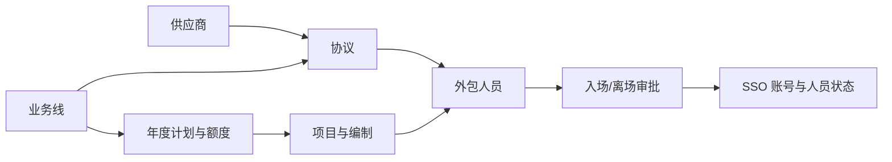
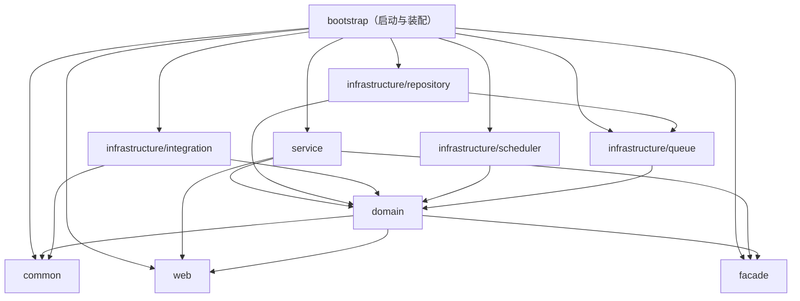
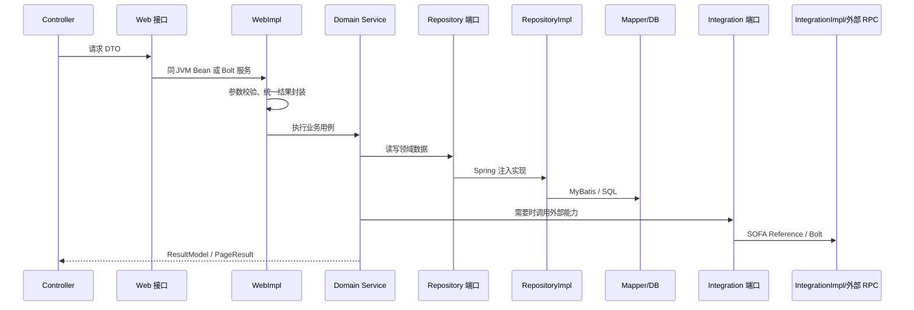

# ABOSS Property HRMS 项目模块学习笔记

> 生成日期：2026-07-23  
> 项目目录：`/Volumes/data/ideaWorkSpace/aboss-property-hrms`  
> 内容依据：当前代码、各模块 `pom.xml`、启动配置及主要业务调用链  
> 阅读目标：快速建立模块边界、业务关系、同步/异步链路和代码定位能力

## 1. 项目一句话定位

ABOSS Property HRMS 是一个面向外包人力管理的多模块 Maven 系统：以业务线和年度计划为额度基础，以项目和协议为人员入场约束，通过审批、账号、组织、客户、消息和文档等外部系统，完成外包人员从录入、入场、任职变更到离场的全生命周期管理。

核心业务关系可以先记成：



理解项目时，建议把“模块分层”和“业务模块”分开看：

- 模块分层回答代码放在哪里，例如 `service`、`domain`、`repository`。
- 业务模块回答代码解决什么问题，例如外包人员、项目、协议。
- 一个完整业务通常会横跨多个分层模块，而不是只位于一个 Maven 模块中。

## 2. 技术基线

| 类别 | 当前技术 | 说明 |
|---|---|---|
| 运行环境 | Java 8 | 根 POM 的 `java.version=1.8` |
| 基础框架 | Spring Boot 2.1.13.RELEASE | 应用启动、依赖注入、事务等 |
| 企业框架 | SOFA Boot 3.4.20 | Bolt RPC、调度、消息等能力 |
| 数据访问 | MyBatis-Plus 3.5.3.1、MyBatis 2.1.4 | 注解、Wrapper、Mapper XML 混合使用 |
| 数据源 | HikariCP | `application.properties` 中明确指定 |
| 对象转换 | MapStruct 1.5.5.Final | 主要用于 Repository 层转换器 |
| 文件处理 | EasyExcel 3.0.5、OpenPDF 1.3.32 | Excel 导入导出和 PDF 生成 |
| 消息 | SOFAMQ / OpenMessaging | 业务事件、审批回调和变更通知 |
| 调度 | AntScheduler `ISimpleJobHandler` | Cron 在外部调度平台配置 |
| 动态配置 | DRM | 审批标签、初始化数据等动态参数 |
| 缓存/序列 | Redis | 项目编号年度自增等场景 |

父级 Maven 链为：

```text
insurance-parent:1.0.0
└── aboss-property-hrms-parent:1.0.1-SNAPSHOT
    └── 10 个业务子模块
```

`facade` 使用独立版本 `1.0.3-SNAPSHOT`，其他模块继承项目版本 `1.0.1-SNAPSHOT`。这意味着调整对外 Facade 契约时，需要单独考虑兼容性和发版版本。

## 3. 十个 Maven 模块

根 `pom.xml` 直接聚合 10 个模块。`infrastructure` 只是目录分组，本身没有独立的聚合 POM。

| 模块 | 核心职责 | 主要内容 | 直接内部依赖 |
|---|---|---|---|
| `bootstrap` | 应用启动和最终装配 | `HrmsApplication`、REST Controller、环境配置、可执行包 | 除 `domain` 外的各应用/基础设施模块，`domain` 由其他模块传递引入 |
| `common` | 横向公共能力 | 基类、枚举、异常、用户上下文、线程池、MyBatis 配置、工具类 | 无 |
| `web` | 应用 Web 服务契约 | Web 接口、请求/响应 DTO、分页与附件基础对象 | 无 |
| `facade` | 面向其他系统的稳定 RPC 契约 | 当前主要是外包人员查询 Facade、DTO 和事件 | 无 |
| `domain` | 核心业务规则和端口 | Domain Service、Model、DO、Repository 接口、Integration 接口 | `web`、`facade`、`common` |
| `service` | 应用编排与服务发布 | Web/Facade 实现、校验器、模板、MQ 消费监听器 | `web`、`facade`、`domain` |
| `infrastructure/repository` | 数据库适配 | RepositoryImpl、Entity、Mapper、Converter、XML SQL | `domain`、`queue` |
| `infrastructure/integration` | 外部系统适配 | 各 Domain Integration 接口的 SOFA RPC 实现 | `common`、`domain` |
| `infrastructure/scheduler` | 定时任务接入 | 协议、项目、计划、人员的 9 个任务 Handler | `domain` |
| `infrastructure/queue` | MQ 出站适配 | Producer 配置、同步/异步发送实现 | `domain` |

### 3.1 POM 中的实际依赖关系



箭头表示 Maven 编译依赖。运行时则通过依赖倒置形成另一层关系：`domain` 定义 Repository/Integration 端口，基础设施模块提供实现，Spring 在 `bootstrap` 启动时把它们装配起来。

### 3.2 `web` 与 `facade` 的区别

这是项目中最容易混淆的一组模块：

- `web`：应用内部的 Web/SOFA 服务契约。REST Controller 注入这些接口，DTO 数量较多，覆盖外包人员、项目、计划、协议、供应商和业务线。
- `facade`：提供给其他系统依赖的对外 RPC 契约，独立版本管理；当前主要发布 `OutsourcedStaffFacade`。
- `service`：同时实现上述两类接口，并通过 `@SofaService(..., bindingType = "bolt")` 发布。

因此，新增页面接口通常改 `web`；新增跨系统稳定契约才考虑 `facade`。

## 4. 一次请求如何穿过系统

### 4.1 同步 HTTP/RPC 主链路



代表性查询链路：

```text
POST /platform/api/aboss/hrms/project/query-project
→ ProjectController
→ ProjectWeb
→ ProjectWebImpl
→ ProjectServiceImpl
→ ProjectDetailRepository
→ ProjectDetailRepositoryImpl
→ ProjectDetailMapper
→ project_detail
```

### 4.2 `AbossOperateTemplateBuilder`

`service` 中的大部分 WebImpl 使用该模板统一执行：

```text
check() → execute() → afterExecute() → ResultModel.success
          └─ 异常 → ResultModel.fail
```

主要作用是参数校验、统一异常转换和响应包装。外包人员模块又用 `buildTemplate(Runnable, Supplier)` 对这一模式做了二次简化。

当前代码没有调用 `withTransaction()`；实际事务主要声明在 Domain Service 或 RepositoryImpl 的 `@Transactional` 方法上。新增事务场景时，应先确认 Spring 代理边界，不要仅根据模板方法名推断事务已经生效。

### 4.3 审批与 MQ 异步闭环

```text
业务提交
→ Domain Service 组装流程变量
→ FlowIntegration 发起审批
→ 流程中心执行
→ SOFAMQ 发布审批事件
→ service/listener 消费
→ Domain Service / Repository 更新状态、归档历史、联动账号或通知
```

项目、协议、人员入离场都采用这一思路，但各自的状态机和回调处理类不同。

## 5. 核心业务模块

### 5.1 外包人员管理

外包人员是系统中业务范围最广、链路最复杂的模块。

主要能力：

- 人员查询、创建、修改、删除和任职异动。
- 历史内部账号检查与关联。
- Excel 批量导入、校验、暂存、批量保存与错误清理。
- 人员信息导出及导出历史。
- 入场、离场申请，取消、重试和审批详情。
- 关联协议、项目、业务线、组织、岗位和 SSO 外部账号。
- 对外提供外包人员查询 Facade。

核心入口：

- Controller：`bootstrap/.../controller/staff/OutsourcedStaffController.java`
- Web 契约：`web/.../staff/OutsourcedStaffWeb.java`
- 应用实现：`service/.../impl/OutsourcedStaffWebImpl.java`
- 领域门面：`domain/.../service/staff/OutsourcedStaffServiceImpl.java`
- 对外 RPC：`facade/.../staff/OutsourcedStaffFacade.java`
- 持久化实现：`infrastructure/repository/.../impl/staff/`

`OutsourcedStaffServiceImpl` 本身主要充当领域门面，再拆给以下专用服务：

| 服务 | 职责 |
|---|---|
| `OutsourcedStaffQueryService` | 人员、任职、项目维度查询 |
| `OutsourcedStaffOperationService` | 创建、修改、删除等基础操作 |
| `OutsourcedStaffBatchService` | 批量导入、暂存和保存 |
| `OutsourcedStaffExportService` | 同步/异步导出与记录 |
| `OutsourcedStaffOnOffboardService` | 入离场申请与查询 |
| `HistoryInternalAccountCheckService` | 历史内部账号校验 |

创建人员的典型链路：

```text
/staff/create-staff
→ OutsourcedStaffWebImpl
→ OutsourcedStaffServiceImpl
→ OutsourcedStaffOperationService
→ 校验证件、码表、组织、岗位和历史账号
→ OutsourcedStaffBaseRepositoryImpl
→ OutsourcedStaffMapper
→ outsourced_staff
```

入场审批的典型链路：

```text
/staff/onboard-request-apply
→ OutsourcedStaffOnOffboardService
→ OutsourcedStaffOnOffboardRepositoryImpl
→ Application Handler 保存申请、人员和项目明细
→ FlowIntegration 发起流程

审批事件
→ StaffOnOffboardFlowListener
→ Approval Handler
→ 更新申请/员工状态
→ AccountIntegration 操作 SSO 外部账号
→ 记录人员异动并发送通知
```

### 5.2 业务线管理

业务线是计划、项目、协议和数据权限共同使用的基础维度。

主要能力：

- 业务线增删改查。
- 业务线管理员授权与取消授权。
- 维护业务线下的项目分类。
- 根据账号角色、组织和管理员关系计算数据权限。
- 删除前检查项目和计划引用。

主要代码从 `BusinessLineController → BusinessLineWebImpl → BusinessLineServiceImpl` 展开，仓储接口包括：

- `BusinessLineRepository`
- `BusinessLineManagerRepository`
- `BusinessLineProjectCategoryRepository`

### 5.3 项目计划管理

计划是“组织 + 业务线 + 年度”的额度底座，项目在计划额度上消耗编制。

主要能力：

- 创建、复制和启用计划年度。
- 管理各层组织的可分配额度和可用额度。
- 汇总已分配项目额度、申请额度和实际入场人数。
- Excel 导入导出及结果记录。
- 年度切换、到期处理和额度异常通知。

主要入口：

- `PlanDetailController`
- `PlanDetailWebImpl`
- `PlanDetailServiceImpl`
- `PlanDetailRepository`、`PlanYearRepository`、`PlanImExportResultRepository`

注意：代码中的实际 URL 前缀是 `/platform/api/aboss/hrms/play/`，类名和业务含义使用 `Plan`，这是需要沿用的历史命名。

额度修改链路：

```text
/play/update-play-manage
→ PlanDetailServiceImpl.updatePlayManage()
→ 判断登录组织和目标组织层级
→ 区分 allocableQuota / usableQuota
→ 校验下级已分配数不超过上级总数
→ PlanDetailMapper 批量更新或插入
→ plan_detail
```

### 5.4 项目管理

主要能力：

- 项目新增、暂存、修改、变更、续延、终止、删除。
- 项目编号生成和历史版本管理。
- 计算年度计划剩余额度和已入场人数。
- 发起审批并处理通过、拒绝、撤回。
- 项目额度超限、到期提醒和人员解绑通知。

主要入口：

- `ProjectController`
- `ProjectWebImpl`
- `ProjectServiceImpl`
- `ProjectDetailRepository`、`ProjectHistoryRepository`
- `ProjectFlowListener`

新增项目链路：

```text
/project/add-project
→ ProjectWebImpl 参数校验
→ ProjectServiceImpl.addProject()
→ IdGenerator 使用 Redis 生成“XM + 年份 + 流水号”
→ 查询计划额度和已入场人数
→ 校验项目编制不超过剩余额度
→ 保存 project_detail 与 attachment
→ 组装组织/业务线审批变量
→ FlowIntegration 发起审批
→ 项目进入 APPROVING
```

审批事件由 `ProjectFlowListener` 转给 `ProjectServiceImpl.callbackProject()`，再根据事件更新项目状态、版本和历史；终止等场景还会通过 MQ 通知人员模块解绑项目。

### 5.5 协议管理

主要能力：

- 协议暂存、提交审批、续延和版本管理。
- 手动终止、恢复、到期、宽限期和自动终止。
- 关联甲方组织、乙方供应商、主/次业务线。
- 对接外部合约域。
- 根据协议、项目和人员生成报销凭证 PDF。

主要入口：

- `AgreementController`
- `HrmsAgreementWebImpl`
- `AgreementServiceImpl`
- `AgreementRepositoryImpl`
- `AgreementIntegrationImpl`
- `AgreementFlowListener`

提交审批链路：

```text
/agreement/submit-approval
→ AgreementServiceImpl.submitApproval()
→ 检查是否已有审批中流程
→ AgreementIntegration 调用合约域保存/变更
→ 组装本地 AgreementModel
→ 根据组织层级和业务线生成审批变量
→ FlowIntegration 发起审批
→ AgreementRepository 保存本地协议及业务线关系
```

审批回调主要更新本地协议状态、版本和历史。当前 `AgreementFlowListener` 中“审批通过后同步合约域生效状态”的调用处于注释状态，排查跨系统状态时需特别留意。

### 5.6 供应商管理

主要能力：

- 供应商增删改查和附件管理。
- 银行账户、联系人、地址、归属组织等信息维护。
- 从客户域查询供应商资料。
- 消费客户域变更事件并更新本地快照。
- 提供 WPS 转 PDF、在线预览等文件能力。
- 删除前检查是否已被协议引用。

主要入口为 `SupplierController → HrmsSupplierWebImpl → SupplierServiceImpl → SupplierRepositoryImpl`。`SupplierChangeListener` 负责客户域同步，`SupplierIntegrationImpl` 负责查询外部客户/组织资料。

## 6. 数据访问与主要表

### 6.1 Repository 结构

```text
domain/repository/                         # 领域仓储接口
infrastructure/repository/
├── impl/                                  # 仓储实现及复杂处理器
├── mapper/                                # MyBatis Mapper
├── entity/                                # 数据库实体
├── converter/                             # MapStruct 转换器
└── src/main/resources/mapper/             # XML SQL
```

启动类通过以下包扫描 Mapper：

```java
@MapperScan("com.aliyun.fsi.insurance.hrms.repository")
```

常用实现方式：

- 普通 CRUD：MyBatis-Plus `BaseMapper`、`LambdaQueryWrapper`。
- 复杂查询：Mapper 注解 SQL 或 XML SQL。
- 批量写入：`CustomSqlInjector` 扩展 `InsertBatchSomeColumn`。
- 公共字段：`BaseEntity` 配合 `MyMetaObjectHandler` 自动填充租户、操作人、时间和有效标识。
- 对象转换：重点查看 `OutsourcedStaffConverter`、`AgreementConverter`、`OrganizationConverter`、`OperationRecordConverter`。

### 6.2 按业务分组的主要表

| 业务 | 主要表 |
|---|---|
| 外包人员 | `outsourced_staff`、`outsourced_staff_movement` |
| 批量导入 | `outsourced_staff_import_batch`、`outsourced_staff_import_batch_record` |
| 入离场 | `outsourced_staff_onoffboard_application`、申请人员/项目明细及历史表 |
| 协议 | `agreement`、`agreement_history`、`agreement_business_line_ref` |
| 项目 | `project_detail`、`project_history`、`attachment` |
| 计划 | `plan_year`、`plan_detail`、`plan_imexport_result` |
| 业务线 | `business_line`、`business_line_manager`、`business_line_project_category_ref` |
| 供应商 | `supplier`、`attachment` |
| 公共 | `t_abs_org_basic`、`operation_record`、`attachment` |

当前持久化模型位置并不完全统一：外包人员、协议等主要使用 Repository 模块中的 `Entity`；项目、计划、业务线等表对象仍位于 `domain/dataobject/`，并直接带有 `@TableName`。阅读时应以实际 Mapper/Repository 使用的类型为准。

## 7. 外部系统集成

领域层在 `domain/integration/` 定义本系统需要的能力，`infrastructure/integration/impl/` 通过 `@SofaReference` 调用外部 Facade。这是项目中最清晰的依赖倒置边界。

| Integration 实现 | 外部能力 |
|---|---|
| `OrganizationIntegrationImpl` | 组织、岗位、组织路径、下级机构和账号信息 |
| `AccountIntegrationImpl` | SSO 账号查询、创建、更新、失效和返聘 |
| `FlowIntegrationImpl` | 发起审批、查询流程全局变量 |
| `AgreementIntegrationImpl` | 合约域保存、修改、删除、查询和审核状态 |
| `SupplierIntegrationImpl` | 客户域组织详情和供应商资料 |
| `EmployeeIntegrationImpl` | 按证件查询内部员工，并转换为内部 DTO |
| `CodeIntegrationImpl` | 字典码表查询 |
| `AclCoreIntegrationImpl` | 角色、功能和组织数据权限 |
| `UserSearchIntegrationImpl` | 按策略、标签和机构圈选用户 |
| `MessageCoreIntegrationImpl` | 模板消息、钉钉和站内信 |
| `FileIntegrationImpl` | OSS 上传、下载和 URL |
| `FileCenterExternalIntegrationImpl` | OSS、WPS 预览和格式转换 |
| `DocumentIntegrationImpl` | 已接入 `WpsFacade`，当前接口暂无实际方法 |

不同适配器的失败语义并不完全一致：有的抛业务异常，有的返回空集合或 `null`，消息发送还可能只记录异常。调用外部能力时必须查看具体实现，不能只看接口签名。

## 8. 定时任务

定时任务都位于 `infrastructure/scheduler`，实现 AntScheduler 的 `ISimpleJobHandler`。代码中没有 `@Scheduled` Cron；真正的执行周期由外部调度平台根据 Handler 的 `getName()` 配置。

| 分类 | Handler | 作用 |
|---|---|---|
| 人员 | `AbandonStaffOnOffboardRequestHandler` | 清理长时间停留在草稿态的入离场申请 |
| 人员 | `UpdateStaffStatusHandler` | 让已审批且到期的入离场申请正式生效 |
| 协议 | `AgreementEnterGracePeriodJobHandler` | 到期未终止协议进入宽限期 |
| 协议 | `AgreementPreExpiryNotifyJobHandler` | 发送协议临期提醒 |
| 协议 | `AgreementExpiredTerminateJobHandler` | 宽限期结束后自动终止 |
| 项目/计划 | `UpdateApprovedTerminateProjectStatusHandler` | 处理已审批终止项目和到期计划 |
| 项目 | `InitProjectDataHandler` | 从 DRM 动态配置初始化项目 |
| 项目 | `ProjectCodeRedisResetHandler` | 重置项目编号 Redis 自增值 |
| 项目/计划 | `ProjectRelationNoticeHandler` | 项目人数、到期和计划额度通知 |

排查任务时先确认：调度平台是否触发、Handler 返回值、调用的 Domain Service、最终数据变化与消息发送。

## 9. MQ：出站与入站的位置不同

### 9.1 出站生产者

`infrastructure/queue` 负责出站发送：

```text
domain/integration/MessageQueueIntegration
→ SendMessageServiceImpl
→ ProducerSelector
→ SOFAMQ Producer
```

`SendMessageServiceImpl` 同时提供同步和异步发送。常见出站场景包括人员变更、项目续延/终止、人员解绑、协议终止/续延。

### 9.2 入站消费者

消费者实际位于 `service/listener/`，而不是 `infrastructure/queue`：

| Listener | 事件 |
|---|---|
| `StaffOnOffboardFlowListener` | 人员入离场审批结果 |
| `ProjectFlowListener` | 项目审批结果 |
| `AgreementFlowListener` | 协议审批结果 |
| `OrganizationEventListener` | 组织信息变更 |
| `SupplierChangeListener` | 客户域/供应商变更 |
| `StaffProjectCodeChangeListener` | 人员关联项目续延或终止 |
| `StaffAgreementNoChangeListener` | 人员关联合同续延或终止 |
| `Staff4SsoDepartedListener` | 账号中心被动离职事件；当前业务处理仍为 TODO |

多数 Listener 在解析或业务处理异常后仍返回 `Action.CommitMessage`，通常不会依赖 MQ 自动重试。修改消费逻辑时，需要同时设计幂等、补偿和失败可观测性。

## 10. 启动与配置

启动类：

```text
bootstrap/src/main/java/com/aliyun/fsi/insurance/hrms/HrmsApplication.java
```

启动时会：

- 扫描 `com.aliyun.fsi.insurance` 下的 Spring Bean。
- 开启异步执行。
- 开启并暴露 AspectJ 代理。
- 扫描 `com.aliyun.fsi.insurance.hrms.repository` 下的 Mapper。

默认配置：

| 配置 | 默认值/位置 |
|---|---|
| 应用名 | `aboss-property-hrms` |
| HTTP 端口 | `8990` |
| 默认 Profile | `innerprojectstable` |
| SOFA RPC REST 端口 | `8769` |
| 数据源 | HikariCP |
| Mapper XML | `classpath:mapper/*.xml` |
| 日志 | Log4j2 |

环境文件包括：

- `application-innerdailytest.properties`
- `application-innerprojecttest.properties`
- `application-innerprojectstable.properties`
- `application-uat.properties`
- `application-innernewprod.properties`

这些文件覆盖数据库、Redis、MQ、SOFA、OSS、外部地址和日志等参数，并包含凭证类敏感配置。学习笔记、日志和代码评审内容中只记录配置名称，不复制具体密码或密钥。

审批标签、HR 角色、项目初始化数据和 Redis 序列重置值等运行参数位于 `DynamicConfig`，通过 DRM 动态下发。

常用构建命令：

```bash
mvn clean compile
mvn test
mvn clean package -DskipTests
mvn test -Dtest=TestClassName
```

## 11. 推荐学习顺序

### 第一步：掌握装配和模块边界

依次阅读：

1. 根 `pom.xml`
2. `bootstrap/pom.xml`
3. `HrmsApplication.java`
4. `application.properties`

完成标准：能说明 10 个模块为什么都由 `bootstrap` 装进同一个应用。

### 第二步：沿简单 CRUD 走一遍

从供应商或业务线查询开始：

```text
Controller → Web → WebImpl → Domain Service → Repository → Mapper
```

完成标准：能独立找到一个接口的请求 DTO、校验、业务实现和 SQL。

### 第三步：理解“计划 → 项目”的额度关系

重点阅读：

- `PlanDetailServiceImpl`
- `ProjectServiceImpl.addProject()`
- `PlanDetailRepositoryImpl`
- `ProjectDetailRepositoryImpl`

完成标准：能解释项目编制为何不能超过“组织 + 业务线 + 年度”的计划剩余额度。

### 第四步：理解审批闭环

先读项目，再读协议：

```text
提交 → FlowIntegration → MQ Listener → 状态/历史更新
```

完成标准：能根据一个流程实例 ID 找到发起位置、Topic/Tag、监听器和最终状态更新位置。

### 第五步：攻克外包人员模块

按“查询 → 单人操作 → 批量导入 → 入离场”顺序阅读，不要一开始就从最大的 RepositoryImpl 通读。

完成标准：能说明人员、协议、项目、账号和任职异动如何联动。

### 第六步：补齐异步和外围能力

最后阅读：

- `service/listener/`
- `infrastructure/queue/`
- `infrastructure/scheduler/`
- `infrastructure/integration/`

完成标准：能画出某个变更事件从生产到消费、再到数据库或外部系统的完整链路。

## 12. 按需求类型定位改动

| 需求类型 | 通常需要检查的路径 |
|---|---|
| 新增/修改页面接口 | `bootstrap/controller` → `web` DTO/接口 → `service/impl` → `domain/service` |
| 修改参数校验 | Web DTO 校验注解、WebImpl/Validator、Domain 业务校验 |
| 修改数据库字段或查询 | Domain Repository 接口 → Entity/DO → Mapper/XML → RepositoryImpl |
| 新增外部 RPC | `domain/integration` 接口 → `infrastructure/integration/impl` → Facade 依赖和配置 |
| 修改对外 RPC 契约 | `facade` → `service` FacadeImpl → 独立 Facade 版本 |
| 新增 MQ 出站 | `MessageQueueIntegration` → `infrastructure/queue` → Topic/Tag 配置 |
| 新增 MQ 消费 | `service/listener` → Topic/Group/Tag 配置 → 幂等和补偿策略 |
| 新增定时任务 | `infrastructure/scheduler` Handler → Domain 方法 → 外部调度平台注册 |
| 修改审批规则 | `DynamicConfig`、审批变量构建、`FlowIntegration`、对应 Listener |

## 13. 阅读代码时要特别留意的现状

1. **这是务实型 DDD，而非纯 DDD。** 基础设施实现依赖领域端口，依赖倒置是成立的；但 `domain` 同时依赖 `web`、`facade`，并复用其 DTO，部分持久化 DO 也位于领域模块。
2. **Repository 层不全是简单 CRUD。** 协议和外包人员相关 RepositoryImpl/Handler 含状态机、历史迁移、事务和 MQ 联动，排查业务时不能只看 Domain Service。
3. **存在 `repository → queue` 的跨基础设施依赖。** 例如协议仓储会直接使用消息发送服务；当前无循环，但边界比标准分层更宽。
4. **MQ 生产与消费不在同一模块。** 生产封装在 `infrastructure/queue`，消费者在 `service/listener`。
5. **命名需要遵循现状。** Web 包使用 `bussiness`，计划 URL 使用 `play`，Facade 根包为 `com.aliyunfsi...`；检索和新增代码时不要自行纠正后造成不兼容。
6. **事务边界应看实际代理方法。** 当前模板的 `withTransaction()` 没有调用点，核心事务主要在 Domain Service 与 RepositoryImpl。
7. **外部失败策略不统一。** Integration 有抛异常、返回空值和仅记录日志等不同做法，调用方必须确认语义。
8. **调度周期不在源码。** 任务是否按时执行要到 AntScheduler 平台核对。
9. **测试覆盖较集中。** 当前源码树约有 455 个主 Java 文件、5 个测试类；修改复杂审批、状态机和异步链路时，应补充针对性测试并做端到端验证。
10. **配置文件含敏感信息。** 不要把环境凭证复制到笔记、工单、日志或提交信息中。

## 14. 快速索引

| 想了解什么 | 首选入口 |
|---|---|
| 应用如何启动 | `bootstrap/.../HrmsApplication.java` |
| HTTP 接口有哪些 | `bootstrap/.../controller/` |
| 请求/响应 DTO | `web/src/main/java/.../web/` |
| 对外 RPC 契约 | `facade/src/main/java/` |
| 应用编排和统一校验 | `service/.../impl/`、`service/.../template/` |
| 核心业务规则 | `domain/.../service/` |
| 数据库端口 | `domain/.../repository/` |
| 数据库实现和 SQL | `infrastructure/repository/` |
| 外部系统端口 | `domain/.../integration/` |
| 外部 RPC 实现 | `infrastructure/integration/.../impl/` |
| MQ 消费 | `service/.../listener/` |
| MQ 发送 | `infrastructure/queue/` |
| 定时任务 | `infrastructure/scheduler/` |
| 动态审批配置 | `domain/.../config/DynamicConfig.java` |

## 15. 最终记忆模型

可以用下面四句话记住整个项目：

1. `bootstrap` 负责把所有模块装配成一个可运行应用。
2. `web/facade → service → domain` 负责接收请求、编排用例和执行规则。
3. `domain` 定义 Repository/Integration 端口，`infrastructure` 负责数据库、外部 RPC、MQ 和调度适配。
4. 业务上以“业务线与计划 → 项目与协议 → 外包人员 → 审批、账号和异动”为主轴。
