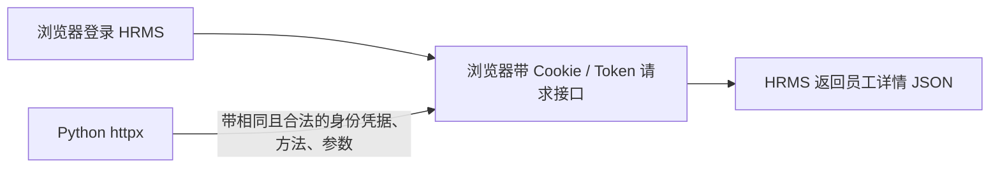

## 一、💡 一句话理解

> [!tip] 核心结论
> 调用网页背后的接口，本质上是用 Python 按浏览器相同的请求方式、地址、请求头和参数发送 HTTP 请求。对这个 HRMS 人员详情接口，先从浏览器开发者工具确认实际请求，再用 `httpx` 做受权限控制的查询。

## 二、🧭 理论：它是什么

### 2.1 接口调用不是“爬页面”

网页通常是前端界面，数据则由后端接口返回。这个地址看起来是 HRMS 的员工详情查询接口：

`http://platform.cic.inter/api/innernewprod-aboss-hrms/platform/api/aboss/hrms/staff/query-staff-detail`

Python 不需要解析 HTML；它只需像浏览器一样发送 HTTP 请求，接收 JSON 响应，再提取需要的字段。

### 2.2 一个请求由什么组成

| 部分 | 作用 | 当前接口的状态 |
|---|---|---|
| 请求方法 | `GET`、`POST` 等，决定如何传数据 | 待从浏览器确认 |
| URL | 要访问的接口地址 | 已知 |
| 请求头 Headers | Cookie、Token、`Content-Type` 等身份与格式信息 | 待确认 |
| 请求参数 | 查询哪位员工的编号、工号等 | 待确认 |
| 响应 JSON | 后端返回的数据或错误信息 | 待实际查看 |

> [!warning] 不要猜测请求方式或字段
> 接口名含 `query` 不代表一定是 `GET`。很多企业内部系统会使用 `POST + JSON` 查询；应以浏览器 Network 面板中实际请求为准。

## 三、⚙️ 理论：它是怎么工作的

### 3.1 浏览器和 Python 做的是同一件事



`httpx.Client` 适合持续调用同一系统：它能复用连接，并保存客户端级别的请求头和 Cookie。HTTPX 官方文档说明，它支持同步与异步调用、Cookie 持久化和连接复用。

### 3.2 鉴权与 CSRF

内网系统常见的身份方式有：

- `Cookie`：浏览器登录后由服务端下发的会话标识。
- `Authorization: Bearer <token>`：请求头携带访问令牌。
- CSRF Token：网页为防止跨站请求伪造额外校验的令牌。

代码中不要硬编码真实 Cookie、Token 或人员数据；通过环境变量传入，并且仅使用自己被授权的账号。

### 3.3 读取与修改要分开

本篇接口名称是 `query-staff-detail`，按名称判断它应是读取用途，但这仍需以实际请求为准。

对于修改接口，必须先读取确认目标，再用明确的 `POST`、`PUT` 或 `PATCH` 调用；保存操作日志，并避免对非幂等写请求做自动重试。

## 四、🚀 实践：从准备到验证

### 4.1 前置准备

1. 在已获授权的内网环境中登录 HRMS。
2. 打开浏览器开发者工具的 **Network（网络）** 面板。
3. 在网页里查询一名你有权限查看的测试员工。
4. 找到 `query-staff-detail` 请求，记录以下信息：
   - Request Method；
   - Request Headers 中必需的 `Content-Type`、Cookie、Token、CSRF Token；
   - Payload 或 Query String 中的参数名；
   - 响应 JSON 的实际结构。
5. 安装依赖：

```bash
python3 -m pip install httpx
```

> [!info] 当前待确认项
> 仅凭接口地址，无法可靠得知它是 `GET` 还是 `POST`，也不能确定员工标识字段到底叫 `staffId`、`staffCode` 还是其他名称。

### 4.2 可以拿来干什么

在确认请求规则后，可以：

- 查询单个员工的详情；
- 把响应中的必要字段导出为 JSON；
- 为后续有权限的修改接口建立统一的超时、错误处理和审计框架。

下面代码中的 `payload` 是示意结构。请以浏览器 Network 面板的真实 Request Payload 替换，不能直接假设字段名。

```python
# 查询参数示例：字段名必须以浏览器实际请求为准。
payload = {
    "staffId": "测试员工标识",
}
```

### 4.3 完整实践：代码、启动和验证

新建文件：`query_staff_detail.py`

```python
"""受权限控制地查询 HRMS 员工详情接口。"""

import json
import os
from datetime import datetime, timezone

import httpx


# 已知的 HRMS 查询接口地址。
API_URL = (
    "http://platform.cic.inter/api/innernewprod-aboss-hrms/"
    "platform/api/aboss/hrms/staff/query-staff-detail"
)

# 必须以浏览器 Network 面板显示的 Request Method 为准。
REQUEST_METHOD = os.getenv("HRMS_REQUEST_METHOD", "POST").upper()

# 必须以浏览器实际 Payload 为准；staffId 仅是占位示例。
REQUEST_BODY = {
    "staffId": os.getenv("HRMS_STAFF_ID", "请填写测试员工标识"),
}


def build_headers() -> dict[str, str]:
    """从环境变量组装请求头，避免把敏感凭据写进代码。"""
    headers = {
        "Accept": "application/json, text/plain, */*",
        "Content-Type": "application/json",
    }

    # 仅在系统确实使用 Bearer Token 时设置此变量。
    token = os.getenv("HRMS_BEARER_TOKEN")
    if token:
        headers["Authorization"] = f"Bearer {token}"

    # 仅在系统确实使用 CSRF 校验时设置；请求头名称以实际请求为准。
    csrf_token = os.getenv("HRMS_CSRF_TOKEN")
    if csrf_token:
        headers["X-CSRF-Token"] = csrf_token

    return headers


def query_staff_detail() -> dict:
    """发送查询并返回 JSON；HTTP 状态异常或非 JSON 响应会明确报错。"""
    if REQUEST_BODY["staffId"] == "请填写测试员工标识":
        raise ValueError("请先设置 HRMS_STAFF_ID，并将请求体字段改为实际字段名。")

    # 显式设置连接和读取超时，避免请求长期挂起。
    timeout = httpx.Timeout(timeout=15.0, connect=5.0)

    # Cookie 只在系统需要且账号具备权限时传入。
    cookies = {}
    session_cookie = os.getenv("HRMS_SESSION_COOKIE")
    if session_cookie:
        # Cookie 名也必须以浏览器实际请求为准。
        cookies["SESSION"] = session_cookie

    with httpx.Client(
        timeout=timeout,
        headers=build_headers(),
        cookies=cookies,
        follow_redirects=False,
    ) as client:
        if REQUEST_METHOD == "GET":
            # GET 参数放在 URL Query String 中。
            response = client.get(API_URL, params=REQUEST_BODY)
        elif REQUEST_METHOD == "POST":
            # POST 查询参数通常以 JSON 请求体发送。
            response = client.post(API_URL, json=REQUEST_BODY)
        else:
            raise ValueError(
                f"暂不支持的请求方法：{REQUEST_METHOD}；请按 Network 面板填写 GET 或 POST。"
            )

    # 4xx/5xx 会抛出异常，避免把业务错误当成正常结果。
    response.raise_for_status()

    try:
        result = response.json()
    except json.JSONDecodeError as error:
        raise RuntimeError(
            f"接口未返回 JSON，Content-Type={response.headers.get('content-type')}"
        ) from error

    # 只记录操作时间、HTTP 状态和顶层字段，不记录 Token、Cookie 或完整人员信息。
    audit = {
        "time": datetime.now(timezone.utc).isoformat(),
        "method": REQUEST_METHOD,
        "status_code": response.status_code,
        "top_level_keys": list(result.keys()) if isinstance(result, dict) else None,
    }
    print("查询审计：", json.dumps(audit, ensure_ascii=False))

    return result


if __name__ == "__main__":
    try:
        data = query_staff_detail()
        # 首次验证时仅打印格式化 JSON；确认字段后再按需导出。
        print(json.dumps(data, ensure_ascii=False, indent=2))
    except httpx.TimeoutException:
        print("请求超时：请确认已连接公司内网、地址可达，并检查超时设置。")
    except httpx.HTTPStatusError as error:
        print(
            f"接口返回错误：HTTP {error.response.status_code}；"
            "请检查请求方法、权限、Cookie/Token、CSRF Token 和参数。"
        )
    except (ValueError, RuntimeError) as error:
        print(f"配置或响应处理错误：{error}")
```

运行前，在终端设置变量。下面的值都是占位符，必须替换为浏览器实际请求中的合法信息：

```bash
export HRMS_REQUEST_METHOD="POST"
export HRMS_STAFF_ID="测试员工标识"
export HRMS_BEARER_TOKEN="仅在系统使用 Bearer Token 时填写"
export HRMS_CSRF_TOKEN="仅在系统需要 CSRF Token 时填写"
export HRMS_SESSION_COOKIE="仅在系统需要 Cookie 时填写"

python3 query_staff_detail.py
```

验证成功时，终端会先输出一条不含敏感数据的查询审计记录，再输出接口返回的 JSON。

如果出现 `401` 或 `403`，通常是登录态、权限、Cookie、Token 或 CSRF Token 不完整；如果出现 `422` 或业务提示参数错误，则应逐项比对浏览器请求的字段名、类型和嵌套结构。

## 五、📌 总结

- 接口调用的关键是复现**已授权浏览器请求**，不是解析网页。
- 先在 Network 面板确认方法、请求头和参数，不猜字段。
- `httpx` 适合这类企业内部 API 的查询和后续受控调用。
- 凭据用环境变量保存，不写进源码、笔记或 Git。
- 修改接口先查询核对目标；写操作要有审批、日志和小范围验证。

## 六、📚 官方资料

- [HTTPX QuickStart](https://www.python-httpx.org/quickstart/)
- [HTTPX Clients](https://www.python-httpx.org/advanced/clients/)
- [HTTPX Timeouts](https://www.python-httpx.org/advanced/timeouts/)
- [HTTPX Authentication](https://www.python-httpx.org/advanced/authentication/)
