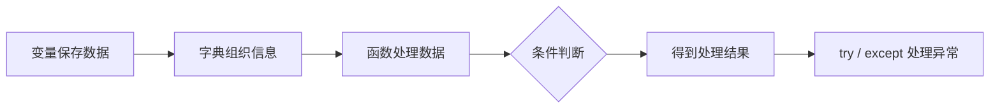

## 一、💡 一句话理解

> [!tip] 核心结论
> 学 Python 不必一次复习完所有语法。先掌握“变量和字典 → 函数 → 判断 → 异常处理 → JSON → 异步”这条链，就能写出结构清晰的小程序。

## 二、🧭 理论：它是什么

### 2.1 Python 程序就是“按顺序处理数据”

可以把一个小程序理解为一条流水线：



这篇笔记只复习这条链上真正会用到的基础语法。所有示例都使用本地模拟数据。

### 2.2 缩进是 Python 的花括号

Java 用 `{}` 表示代码块，Python 用**统一的缩进**表示代码块。通常使用 4 个空格。

```python
if True:
    # 缩进的代码属于 if 分支
    print("条件成立")

print("这一行不在 if 内")
```

冒号 `:` 表示一个代码块即将开始；冒号后面的代码必须缩进。

## 三、⚙️ 理论：每个语法怎么理解

### 3.1 变量、字符串与 f-string

变量可以看成一个有名字的标签，用来引用一个值。Python 不需要先声明类型。

```python
name = "小李"                # 字符串 str
score = 88                   # 整数 int
is_passed = True             # 布尔值 bool

# f-string：把变量值插入字符串；比字符串拼接更好读。
print(f"学生：{name}，分数：{score}，是否及格：{is_passed}")
```

输出：

```text
学生：小李，分数：88，是否及格：True
```

### 3.2 `dict`：用名字组织数据

字典（dictionary）是一组“键 → 值”的映射，类似 Java 的 `Map<String, Object>`。适合保存一条有多个字段的信息。

```python
# 一名学生的信息。
student = {
    "name": "小李",
    "score": 88,
}

# 1. 确定键一定存在：使用 [] 读取。
print(student["name"])  # 小李

# 2. 不确定键是否存在：使用 get 读取。
print(student.get("name"))        # 小李
print(student.get("class_name"))  # None

# 3. 键不存在时，也可以指定一个更友好的默认值。
print(student.get("class_name", "未填写班级"))  # 未填写班级

# 4. 如果用 [] 读取不存在的键，会抛出 KeyError。
# print(student["class_name"])  # KeyError: 'class_name'
```

记忆方式：

- `data["key"]` 是“我确定它存在，缺少就是数据有问题”。键不存在时会抛出 `KeyError`，适合读取必填字段。
- `data.get("key")` 是“它可能没有，没有也可以继续运行”。键不存在时返回 `None`，适合读取选填字段。
- `data.get("key", 默认值)` 是“它可能没有，没有就用备用值”。适合页面展示、配置读取等需要兜底的场景。

可以简单记成：**必填用 `[]`，选填用 `get()`，选填且要兜底用 `get(key, 默认值)`。**

### 3.3 `list`：一批数据

列表（list）是有顺序的一组值，类似 Java 的 `List`。它适合保存一批同类数据。

```python
names = ["小李", "小王", "小陈"]

for name in names:
    print(f"你好，{name}")
```

`for` 会逐个取出列表里的元素。不要用下标也能完成绝大多数遍历。

### 3.4 函数：把重复步骤装进一个名字里

函数用 `def` 定义。括号里是输入（参数），`return` 是输出。

记忆方式：`def` 是制作工具，括号里是工具需要的材料，`->` 是工具做出的结果，`return` 是把结果交出来。

```python
def build_student(name: str, score: int) -> dict:
    """根据姓名和分数创建一条学生信息。"""
    return {"name": name, "score": score}


student = build_student("小李", 88)
print(student)
```

`staff_id: str` 和 `-> dict` 是类型标注：它们帮助阅读和编辑器检查，不会替代运行时校验。

### 3.5 `if / elif / else`：根据条件走不同分支

条件判断让程序根据不同数据做不同的事。

```python
score = 88

if score >= 90:
    print("优秀")
elif score >= 60:
    print("及格")
else:
    print("需要继续努力")
```

注意：比较两个值是否相等用 `==`；单个等号 `=` 是赋值。

### 3.6 `try / except`：预期会出错的地方要接住

异常（exception）是程序运行中发生的问题。比如把不能转成数字的文字传给 `int()`，就会产生 `ValueError`。

```python
def parse_score(value: str) -> int:
    """把字符串分数转成整数；示例只用于理解异常。"""
    return int(value)


try:
    score = parse_score("不是数字")
    print(score)
except ValueError:
    # 只处理预期的 ValueError；不要用空 except 吞掉所有错误。
    print("分数不是纯数字，无法转换。")
```

### 3.7 `with`：用完自动收尾

`with` 适合管理需要关闭的资源。最常见的是打开文件：离开缩进块后，文件会自动关闭。

```python
with open("hello.txt", "w", encoding="utf-8") as file:
    file.write("你好，Python！")
```

### 3.8 环境变量：把敏感配置放在代码外

`os.getenv()` 从操作系统环境读取值。它适合读取 Token、Cookie 或测试账号等不应写进源码的配置。

```python
import os

# 第二个参数是默认值；未设置环境变量时不会返回 None。
user_name = os.getenv("USER_NAME", "访客")
print(f"当前用户名：{user_name}")
```

### 3.9 JSON：文本和 Python 字典之间的转换

JSON 是一种文本格式；`json.loads()` 把 JSON 文本转成 Python 字典，`json.dumps()` 则反过来。

```python
import json

json_text = '{"name": "小李", "score": 88}'
student = json.loads(json_text)

print(student.get("name", "未知"))

# ensure_ascii=False 让中文正常显示；indent=2 让结果更容易阅读。
print(json.dumps(student, ensure_ascii=False, indent=2))
```

### 3.10 `async / await`：等待网络时先做别的事

同步代码会在一个任务完成前等待；异步代码遇到 `await` 时可以暂时让出执行权，等待多个任务时更有效率。

> [!info] 先后顺序
> 先把函数、循环和异常处理写明白，再学习 `async / await`。异步不是更高级的同步写法，而是另一种组织等待任务的方式。

可以把程序想成一个店员：同步方式是等第一位顾客办完所有事情，再接待第二位顾客；异步方式是在第一位顾客等待时，先去接待其他顾客。

下面用 `asyncio.sleep()` 模拟网络请求的等待时间：

```python
import asyncio


async def query_student(name: str, wait_seconds: int) -> None:
    """模拟查询一名学生的信息。"""
    print(f"开始查询：{name}")

    # await 表示当前任务需要等待。
    # 等待期间，程序可以继续执行其他异步任务。
    await asyncio.sleep(wait_seconds)

    print(f"查询完成：{name}")


async def main() -> None:
    # 同时安排两个查询任务，并等待它们全部完成。
    await asyncio.gather(
        query_student("小李", 2),
        query_student("小王", 1),
    )


asyncio.run(main())
```

输出顺序大致如下：

```text
开始查询：小李
开始查询：小王
查询完成：小王
查询完成：小李
```

小李等待 2 秒时，小王的查询没有傻等，而是同时开始了。两个任务总共约需 2 秒；如果依次等待，则约需 3 秒。

记忆方式：`async` 表示“这个函数里可能需要等待”，`await` 表示“我先等这里，让其他任务继续做事”。异步适合网络、数据库和文件等等待较多的任务，不会让普通计算自动变快。

### 3.11 `__init__.py`：包的入口文件

`__init__.py` 的 `init` 前后各有两个下划线。它可以把一个存放 Python 文件的目录变成普通的 Python 包。最简单时，这个文件可以完全为空。

```text
school/
├── __init__.py
└── student.py
```

它主要有三个用途：

- 表明当前目录是一个普通的 Python 包。
- 第一次导入这个包时，执行包的初始化代码。
- 把常用功能放到包的入口处，简化外部的导入写法。

假设 `student.py` 中定义了一个函数：

```python
def build_student(name: str) -> dict:
    """根据姓名创建一条学生信息。"""
    return {"name": name}
```

如果 `__init__.py` 是空文件，需要从具体模块导入：

```python
from school.student import build_student
```

也可以在 `school/__init__.py` 中把常用函数放到包的入口处：

```python
# 点号表示当前 school 包。
from .student import build_student
```

外部代码就可以简化为：

```python
from school import build_student

student = build_student("小李")
print(student)
```

> [!info] 不要混淆
> `__init__.py` 是负责初始化整个包的文件；类中的 `__init__()` 是负责初始化一个对象的方法，它们不是同一个东西。

记忆方式：文件夹是商场，`__init__.py` 是商场入口。它告诉 Python“这里是一整个包”，还可以把常用功能摆到入口处。

现代 Python 也支持不含 `__init__.py` 的命名空间包，但初学和普通项目中保留这个文件更直观。

## 四、🚀 实践：从准备到验证

### 4.1 前置准备

本练习只需要 Python 3.9 或更高版本，不会访问外部网络。

检查版本：

```bash
python3 --version
```

### 4.2 可以拿来干什么

这段练习会把前面学到的语法串起来：创建字典、条件判断、从 JSON 中提取字段、处理错误，并演示异步批量执行的写法。

先理解每一步的输入、处理过程和输出，再进入更具体的项目练习。

### 4.3 完整实践：代码、启动和验证

新建文件：`python_basics_practice.py`

```python
"""Python 基础语法练习：所有数据都在本地生成。"""

import asyncio
import json
import os


def build_student(name: str, score: int) -> dict:
    """根据姓名和分数创建一条学生信息。"""
    return {"name": name, "score": score}


def get_level(score: int) -> str:
    """根据分数返回等级，用于练习 if、elif 和 else。"""
    if score >= 90:
        return "优秀"
    elif score >= 60:
        return "及格"
    else:
        return "需要继续努力"


async def complete_one_task(task_name: str) -> str:
    """模拟一个异步任务：await 表示程序暂时等待任务完成。"""
    await asyncio.sleep(0.1)
    return f"已完成：{task_name}"


async def practice_async() -> None:
    """并发执行三个模拟任务，并逐条打印结果。"""
    tasks = ["阅读", "练习", "复盘"]
    results = await asyncio.gather(*(complete_one_task(item) for item in tasks))

    for result in results:
        print(result)


def main() -> None:
    """按同步 → 异步的顺序执行本次练习。"""
    # 环境变量不存在时使用“访客”，不依赖任何外部配置。
    name = os.getenv("USER_NAME", "访客")
    score_text = "88"

    try:
        score = int(score_text)
        student = build_student(name, score)
        student["level"] = get_level(score)

        # 使用 get 安全读取字典中的值。
        print(f"姓名：{student.get('name', '未知')}")
        print(json.dumps(student, ensure_ascii=False, indent=2))
    except ValueError as error:
        print(f"分数格式错误：{error}")

    # asyncio.run 负责创建并运行异步事件循环。
    asyncio.run(practice_async())


if __name__ == "__main__":
    main()
```

运行：

```bash
python3 python_basics_practice.py
```

预期会看到学生信息的格式化 JSON，以及三行 `已完成`。如果想练环境变量，可以先运行：

```bash
export USER_NAME="小张"
python3 python_basics_practice.py
```

此时模拟 JSON 中的 `name` 会变为 `小张`。

## 五、📌 总结

- 变量保存值，字典组织有关联的数据，列表组织一批数据。
- 函数把重复逻辑封装起来；`return` 把结果交给调用处。
- `if / elif / else` 按条件分支；`try / except` 处理可预期的失败。
- `with` 管理需要关闭的资源，`os.getenv` 读取代码外的配置。
- 先同步、后异步：把函数、循环和异常写明白后再学 `async / await`。

## 六、📚 官方资料

- [Python 官方教程](https://docs.python.org/3/tutorial/)
- [模块与包](https://docs.python.org/zh-cn/3/tutorial/modules.html#packages)
- [控制流与函数](https://docs.python.org/3/tutorial/controlflow.html)
- [数据结构](https://docs.python.org/3/tutorial/datastructures.html)
- [输入输出与 JSON](https://docs.python.org/3/tutorial/inputoutput.html)
- [错误与异常](https://docs.python.org/3/tutorial/errors.html)
