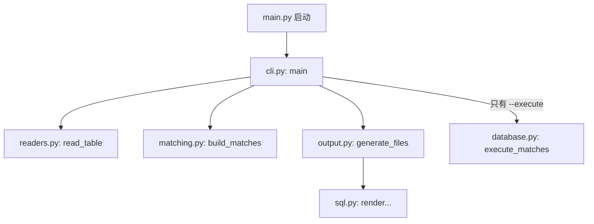

## 一、💡 一句话理解

> [!tip] 核心结论
> 阅读 Python 项目不要从第一个文件第一行一直读到最后一行。先找到程序入口和主流程，再沿着函数调用一层一层往下看。

这篇教程使用下面这个真实项目作为教材：

```text
/Volumes/data/pycharmProject/zhScripts/demos/hrms_account_linker
```

它要完成的事情可以先压缩成一句话：

> 读取 SSO 和 HRMS 文件，按照姓名匹配人员，生成修改 SQL 和回滚 SQL；只有明确指定时才连接数据库。

如果变量、列表、字典和函数还不熟，可以先看 [[03.Python基础语法]]。不需要全部背完，遇到不懂的语法再回去查即可。

## 二、🧭 理论：Python 代码应该怎么看

### 2.1 先看地图，不要马上研究每一行

现在的项目结构如下：

```text
hrms_account_linker/
├── main.py                    # 程序入口
├── account_linker/
│   ├── cli.py                 # 把完整流程串起来
│   ├── readers.py             # 读取 CSV 和 Excel
│   ├── matching.py            # 按姓名匹配人员
│   ├── sql.py                 # 生成 SQL 字符串
│   ├── output.py              # 把结果写入文件
│   ├── database.py            # 数据库预检和执行
│   ├── models.py              # 数据结构和字段要求
│   ├── text.py                # 文本清洗
│   └── __init__.py            # 对外提供统一入口
├── examples/                  # 示例输入文件
└── tests/                     # 自动测试
```

可以把每个 `.py` 文件理解成一个部门。每个部门只负责一类工作：读取文件的部门不负责拼 SQL，拼 SQL 的部门也不负责连接数据库。

Python 官方把这样的 `.py` 文件称为**模块（module）**。程序变长后拆成多个模块，主要目的就是方便维护和复用。

### 2.2 阅读一个函数时，只问四个问题

看到任何函数，先不要逐字分析。按顺序回答：

| 问题 | 在哪里找答案 | 例子 |
| --- | --- | --- |
| 输入是什么？ | 函数名后面的括号 | `read_table(path, required)` 接收路径和必填字段 |
| 做了什么？ | 函数体中的关键调用 | 根据扩展名读取 CSV 或 Excel |
| 返回什么？ | `return` | 返回多行数据组成的列表 |
| 失败会怎样？ | `raise`、`except` | 文件不存在时抛出 `LinkerError` |

例如：

```python
def clean_text(value: Any) -> str:
    """把 None 转为空字符串，其他值转为字符串并删除首尾空格。"""
    return "" if value is None else str(value).strip()
```

用四个问题阅读：

1. 输入：一个值 `value`。
2. 处理：判断它是不是 `None`，否则转成字符串并清除首尾空格。
3. 返回：字符串，`-> str` 正是在提示这一点。
4. 失败：这个简单函数没有主动抛出异常。

### 2.3 先认识调用关系

程序运行时不是在文件之间乱跳，而是从入口开始调用函数：



阅读时沿着箭头走即可。第一遍只看每个方框的作用；第二遍才进入函数内部。

### 2.4 初学者常见符号速查

| 写法 | 白话解释 |
| --- | --- |
| `def read_table(...):` | 定义一个叫 `read_table` 的函数 |
| `path: Path` | 提示 `path` 应该是一个路径对象 |
| `-> list[...]` | 提示函数会返回列表 |
| `rows = read_table(...)` | 调用函数，把返回结果交给 `rows` |
| `if condition:` | 条件成立才执行缩进部分 |
| `for row in rows:` | 从 `rows` 中逐条取出数据 |
| `return result` | 把结果返回给调用者 |
| `raise LinkerError(...)` | 发现问题，立即报告错误并中断当前流程 |
| `try / except` | 尝试执行；遇到指定错误时进行处理 |
| `from .models import Match` | 从同一个包的 `models.py` 导入 `Match` |
| `item.name` | 读取 `item` 对象中的 `name` 字段 |
| `row.get("name", "")` | 从字典取 `name`，不存在时使用空字符串 |

> [!info] 类型标注不是强制转换
> `name: str` 是给人和编辑器看的提示，并不表示 Python 会自动把任何内容转换成字符串。

## 三、⚙️ 理论：这个项目是怎么工作的

### 3.1 第一站：`main.py` 为什么这么短

文件位置：

```text
demos/hrms_account_linker/main.py
```

最重要的是：

```python
if __name__ == "__main__":
    raise SystemExit(main())
```

可以先这样理解：

- 直接运行 `python3 main.py` 时，条件成立。
- 程序调用前面导入的 `main()`。
- `main()` 返回 `0` 表示成功，返回 `2` 表示数据或安全检查失败。

`if __name__ == "__main__"` 是 Python 脚本常见的启动开关。这个文件被其他代码导入时，不会自动开始处理文件。

### 3.2 第二站：去 `cli.py` 找总流程

文件位置：

```text
demos/hrms_account_linker/account_linker/cli.py
```

先折叠其他代码，只看 `main()` 中的关键语句：

```python
sso_rows = read_table(args.sso_file, SSO_COLUMNS)
hrms_rows = read_table(args.hrms_file, HRMS_COLUMNS)

matches, issues = build_matches(sso_rows, hrms_rows)

output = generate_files(matches, issues, args.output_dir)
```

把它翻译成白话：

1. 读取 SSO 文件，结果放进 `sso_rows`。
2. 读取 HRMS 文件，结果放进 `hrms_rows`。
3. 把两批数据交给匹配函数。
4. 匹配函数一次返回两个结果：成功列表 `matches` 和问题列表 `issues`。
5. 最后生成匹配报告、执行 SQL 和回滚 SQL。

这就是整套程序的骨架。第一遍读到这里，已经掌握了程序的主要工作方式。

### 3.3 第三站：数据读取后的样子

CSV 中的一行进入 Python 后，可以理解成一个字典：

```python
{
    "account_id": "zhex02888800543",
    "external_id": "1890285467536351233",
    "display_name": "公估13华圣吕奇政",
}
```

多行数据就是“字典组成的列表”：

```python
rows = [
    {"account_id": "账号1", "display_name": "张三"},
    {"account_id": "账号2", "display_name": "李四"},
]
```

因此看到下面的代码：

```python
for row in rows:
    print(row.get("display_name", ""))
```

就可以读成：“逐条取出人员，然后读取姓名”。

### 3.4 第四站：`read_table()` 怎样分配任务

在 `readers.py` 中找到：

```python
def read_table(path: Path, required: set[str]) -> list[dict[str, str]]:
    if not path.is_file():
        raise LinkerError(f"文件不存在：{path}")
    if path.suffix.lower() == ".csv":
        return read_csv(path, required)
    if path.suffix.lower() == ".xlsx":
        return read_xlsx(path, required)
    raise LinkerError(f"仅支持 .csv 和 .xlsx：{path}")
```

从上往下读判断条件：

1. 文件不存在：直接报错。
2. 后缀是 `.csv`：交给 `read_csv()`。
3. 后缀是 `.xlsx`：交给 `read_xlsx()`。
4. 其他格式：提示只支持 CSV 和 Excel。

这类函数自己不做所有工作，只负责把任务交给更具体的函数，常被称为“分发”。

### 3.5 第五站：`build_matches()` 是核心业务

`matching.py` 最值得仔细看，但仍然不要一次研究全部细节。先找到开头和结尾：

```python
matches: list[Match] = []
issues: list[Issue] = []

# 中间进行姓名分组和安全检查

return matches, issues
```

核心思想是准备两个篮子：

- `matches`：可以安全处理的人员。
- `issues`：不能自动处理的人员及原因。

中间最重要的判断是：

```python
if len(sso_items) != 1 or len(hrms_items) != 1:
    issues.append(...)
    continue
```

翻译成白话：

> 如果这个姓名在 SSO 或 HRMS 中不是恰好一条，就记录问题，然后跳过这个人。

这里的 `continue` 表示结束当前这一次循环，直接检查下一个姓名。

### 3.6 `Match` 和 `Issue` 是固定格式的结果

在 `models.py` 中可以看到：

```python
@dataclass(frozen=True)
class Issue:
    name: str
    issue_type: str
    detail: str
```

可以把 `Issue` 看成一张固定格式的问题登记表：

```python
Issue(
    name="张三",
    issue_type="NOT_ONE_TO_ONE",
    detail="SSO 2 条，HRMS 1 条",
)
```

`@dataclass` 会帮我们生成保存这些字段所需的基础代码。现在不需要研究它的实现，先知道对象里有哪些字段即可。

### 3.7 SQL 是怎样生成的

`sql.py` 接收一条 `Match`，把其中的数据放进 SQL 模板：

```python
def sso_forward_sql(item: Match) -> str:
    return f"""UPDATE t_abs_sso_account
SET external_source = {sql_literal(item.new_external_source)}
WHERE account_id = {sql_literal(item.new_account_id)};"""
```

这里需要认识两个点：

- `f"...{value}..."`：把变量值放进字符串。
- `sql_literal(...)`：先处理引号和反斜杠，避免生成损坏的 SQL。

这个函数只是**生成字符串**，并不会连接数据库，也不会执行 SQL。

### 3.8 输出文件和执行数据库是两件不同的事

`output.py` 使用 `write_text()` 把 SQL 字符串保存为文件：

```python
(target / "hrms_execute.sql").write_text(
    render_hrms_execute_sql(matches),
    encoding="utf-8",
)
```

而真正可能修改数据库的代码位于 `database.py`。只有命令带有 `--execute` 时，`cli.py` 才会调用它：

```python
if args.execute:
    execute_matches(matches)
```

> [!warning] 初学阶段不要使用 `--execute`
> 默认运行只生成文件，不会写数据库。阅读和练习时保持默认安全模式即可。

### 3.9 怎样看懂 `try / except`

`cli.py` 中的结构可以先理解成：

```python
try:
    # 尝试完成读取、匹配和输出
except LinkerError as exc:
    # 如果遇到预期的业务错误，就显示原因并返回失败状态
```

官方教程将运行过程中检测到的问题称为“异常（exception）”。`try` 中没有异常时会跳过 `except`；出现匹配类型的异常时，程序会执行对应的 `except`。

看到报错时，优先阅读错误信息最后一行，再根据其中的文件名和行号向上追踪。不要一看到一大片红字就从第一行开始慌着修改。

### 3.10 第一遍可以暂时跳过什么

下面内容不会妨碍你理解主流程，可以留到以后：

- `__all__` 的作用。
- `Sequence`、`Any` 等更细的类型标注。
- 列表推导式的简写细节。
- 数据库游标、事务和双连接提交。
- `__pycache__` 目录。
- `# noqa` 这类代码检查工具标记。

## 四、🚀 实践：跟着程序走一遍

### 4.1 前置准备

进入项目目录：

```bash
cd /Volumes/data/pycharmProject/zhScripts/demos/hrms_account_linker
```

检查 Python：

```bash
python3 --version
```

项目自带示例文件：

```text
examples/sso.csv
examples/hrms.csv
```

这次练习不需要配置数据库环境变量，也不要添加 `--execute`。

### 4.2 实践一：先运行，再对照代码

执行安全模式：

```bash
python3 main.py \
  --sso-file examples/sso.csv \
  --hrms-file examples/hrms.csv
```

预期看到类似结果：

```text
匹配成功：1 人；异常：0 项
输出目录：.../output/时间
安全模式：只生成文件，没有执行数据库写操作
```

然后回到 `cli.py` 的 `main()`，按照终端输出寻找对应的 `print()`。这样能把“代码文字”和“实际效果”连接起来。

### 4.3 实践二：用打印观察中间数据

如果想知道变量里面到底是什么，可以临时在 `cli.py` 中加入：

```python
sso_rows = read_table(args.sso_file, SSO_COLUMNS)
hrms_rows = read_table(args.hrms_file, HRMS_COLUMNS)

# 临时观察读取结果；看完后可以删除。
print("第一条 SSO 数据：", sso_rows[0])
print("第一条 HRMS 数据：", hrms_rows[0])

matches, issues = build_matches(sso_rows, hrms_rows)

# 观察匹配数量，不需要立刻研究 Match 的所有字段。
print("匹配数量：", len(matches))
print("异常数量：", len(issues))
```

再次运行相同命令，就能看到：

- CSV 每一行进入 Python 后是什么样子。
- 两份数据经过匹配后得到多少成功项和异常项。

这叫观察中间状态，是初学者理解程序最直接的方法之一。

### 4.4 实践三：在 PyCharm 中打断点

如果使用 PyCharm，可以在 `cli.py` 的这一行左侧空白处单击：

```python
matches, issues = build_matches(sso_rows, hrms_rows)
```

出现红点就是断点。然后使用 Debug 运行并配置相同参数：

```text
--sso-file examples/sso.csv --hrms-file examples/hrms.csv
```

程序停下来后重点观察：

- `sso_rows`：SSO 数据列表。
- `hrms_rows`：HRMS 数据列表。
- 按 Step Over 后观察 `matches` 和 `issues`。

第一遍只使用 **Step Over**，意思是“执行当前这一行，但先不钻进函数内部”。主流程看明白后，再使用 **Step Into** 进入 `build_matches()`。

### 4.5 实践四：用测试理解规则

运行自动测试：

```bash
python3 -m unittest discover -s tests -v
```

测试名称本身就在描述规则，例如：

```text
test_unique_name_is_matched
test_duplicate_name_is_rejected
test_missing_column_is_rejected
```

它们分别表示：

- 唯一姓名应该成功匹配。
- 重名应该被拒绝。
- 缺少必填列应该被拒绝。

读不懂业务代码时，可以先看 `tests/test_main.py` 中准备了什么输入，又断言了什么输出。测试通常比正式实现更容易看懂。

### 4.6 一次完整的阅读练习

不要修改代码，按照下面清单走一遍：

1. 在 `main.py` 找到真正调用的 `main()`。
2. 跳到 `cli.py`，用中文复述其中五个主要步骤。
3. 找到 `read_table()`，说出 CSV、Excel 和不支持格式分别走哪个分支。
4. 找到 `build_matches()`，确认成功和异常分别放在哪个列表。
5. 找到 `generate_files()`，说出最终生成了哪五个文件。
6. 找到 `if args.execute`，确认为什么默认不会写数据库。
7. 运行测试，确认所有规则仍然通过。

如果能独立完成这七步，就已经不是“完全看不懂项目”，而是能够顺着调用链阅读真实代码了。

### 4.7 常见问题排查

#### 4.7.1 `ModuleNotFoundError`

先确认终端位于项目目录：

```bash
pwd
```

预期目录：

```text
/Volumes/data/pycharmProject/zhScripts/demos/hrms_account_linker
```

#### 4.7.2 不知道函数来自哪里

在 PyCharm 中按住 Command，再单击函数名，例如 `build_matches`，即可跳到定义。也可以使用“Find Usages”查看谁调用了它。

#### 4.7.3 看到很长的类型标注

例如：

```python
Sequence[dict[str, str]]
```

第一遍只读成“一批字典数据”即可。类型的每个细节以后再补。

#### 4.7.4 看到一大段 SQL

先折叠三引号字符串，把整个 SQL 当成函数的输出模板。优先看函数名、输入参数和 `return`，不要一开始逐字段研究 SQL。

## 五、📌 总结

- 先找入口，再看主流程，不要从第一行盲读到最后一行。
- 每读一个函数，只问：输入、处理、返回、失败方式。
- 这个项目的主调用链是：读取 → 匹配 → 生成 SQL → 输出 → 可选执行。
- `cli.py` 是地图，`matching.py` 是核心业务，`database.py` 最后再看。
- 遇到抽象代码时，用示例数据、临时 `print()`、断点和测试观察真实结果。
- 初学练习只使用默认安全模式，不添加 `--execute`。

> [!tip] 记忆句
> 看项目像查地图：先看目的地和主干道，再进入具体街道；不要在第一条小巷里就研究每块砖。

## 六、🔗 官方资料

- [Python 官方教程：控制流工具](https://docs.python.org/zh-cn/3/tutorial/controlflow.html)
- [Python 官方教程：数据结构](https://docs.python.org/zh-cn/3/tutorial/datastructures.html)
- [Python 官方教程：模块](https://docs.python.org/zh-cn/3/tutorial/modules.html)
- [Python 官方教程：输入与输出](https://docs.python.org/zh-cn/3/tutorial/inputoutput.html)
- [Python 官方教程：错误和异常](https://docs.python.org/zh-cn/3/tutorial/errors.html)
