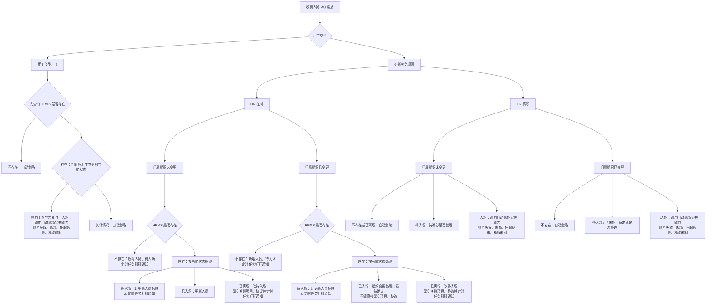
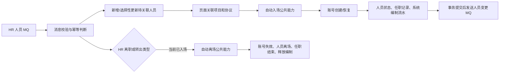

# 内部人员转外包用工系统需求-系分

## 1. 目标与范围

运营支撑域收到 HR 系统半小时同步的人员数据后，实时广播人员消息；HRMS 监听该消息，对用工类型为“6-新劳务规则”的人员自动新增、更新或离场，不走现有入场/离场审批。

本次设计 HRMS 的人员消息消费、`outsourced_staff` 数据维护，以及 org 同步待入场人员的项目/协议关联权限。提醒任务、项目和协议到期规则按需求另行实施；本次不保存消息中的全量人员、岗位及任职明细。

## 2. 现状与改造结论

已确认：

- `outsourced_staff` 已具备用工类型、在职状态、外部账号 ID、历史内部账号关联及本次消息处理所需的基础字段；HR 人员工号应映射到历史内部账号关联还是新增来源工号字段，仍需确认，不能直接复用外部账号 ID。
- 本次 MQ 处理使用的在职状态码为：`-1` 待入场、`0` 已入场、`1` 已离场；`-1` 转 `0` 仅由 HRMS 页面完成关联项目、关联协议操作触发，MQ 消息本身不触发该转换；自动新增、状态变更和离场均不走审批流。
- 本次消费运营支撑 org（组织机构）的人员新增/修改广播消息。
- 现有 `employment_category` 中的 `6` 表示 HRMS 原有“劳务外包”，运营支撑消息中的 `6` 表示“新劳务规则”。改造前先将 HRMS 存量的 `6` 统一迁移为 `7`；迁移完成后，`employment_category=7` 表示原有劳务外包，运营支撑推送的 `6` 直接写入同一字段表示新劳务规则。

设计结论：用工类型不新增物理字段，复用 `outsourced_staff.employment_category`。人员匹配字段优先复用 `related_account_id`，前提是确认 `personCode=employeeCode`；若口径不一致则仍需新增独立 HR 来源工号字段。必须先完成存量数据及码表口径切换、再启用 org 消息监听，避免新旧 `6` 混存而无法区分。自动新增、自动更新及自动离场均以消息写入后的 `employment_category` 是否为 `6` 判断。

数据展示结论：HRMS 页面展示全量人员数据，包含 org 同步的 `employment_category=6` 人员；对外 RPC 不透出该类人员数据。

## 3. 消息消费与字段落库

### 3.1 消息入口

运营支撑在人员新增或修改时向以下 SOFAMQ Topic 广播 `PersonMessageModel` JSON；HRMS 新增一个消费者订阅该消息。消费者必须监听该 Topic 的全部人员新增/修改消息，不按用工类型在 MQ 订阅层过滤；收到消息后先按 `personCode` 对应的 HR 来源匹配字段查询 HRMS 人员，再依据消息用工类型、HR 在岗状态、组织是否变化、原用工类型和 HRMS 当前状态决定新增、更新、离场或忽略。

|配置项|配置值|
|---|---|
|消费者 Group|`GID_CIC_MIDABOSS_SSO_ACCOUNT_MODIFY`|
|Topic|`TP_CIC_MIDABOSS_AAAS_PERSONNEL`|
|Tag|`TG_CIC_MIDABOSS_AAAS_PERSONNEL`|

配置键如下，新增在 `bootstrap` 配置中：

```properties
# org mq 人员新增/修改 MQ
spring.sofamq.org.account.group-id=GID_CIC_MIDABOSS_SSO_ACCOUNT_MODIFY
spring.sofamq.org.account.topic=TP_CIC_MIDABOSS_AAAS_PERSONNEL
spring.sofamq.org.account.tag=TG_CIC_MIDABOSS_AAAS_PERSONNEL
```

消费者接收 `PersonMessageModel` JSON 后反序列化处理。成功处理后确认消息；参数缺失、无法识别的用工类型或数据处理异常应记录消息 ID、人员工号和原因，并返回失败以使用运营支撑的既有补偿能力。

### 3.1.1 MQ 消息监听分支图



图中“待确认”分支不实施处理逻辑，待业务确认后再补充。

图中“定时任务钉钉通知”统一指：定时任务通过消息中心发送钉钉提醒，提示关联项目、关联协议。**待确认：实际接收人是机构业务部门经办人、人力部门经办人、部门负责人，还是其他角色；无人经办时的兜底接收人也需明确。**

人员唯一识别键为 `personCode`（需求明确为 10 位工号）。该值不能写入 `outsourced_staff.account_id`：现有代码把 `account_id` 作为账号中心创建外部账号后返回的账号 ID，字段非空时会直接进入“返聘恢复账号”分支。若 `personCode` 与现有内部员工 `employeeCode` 为同一口径，应写入 `related_account_id` 并按该字段查询；若不是同一口径，则必须新增独立的 HR 来源人员工号字段。实施前需确认两者口径，并核对最终匹配字段的唯一索引。

#### 3.1.1.1 不走审批流的现有逻辑兼容评估

结论：**改造量中等偏大，不是只新增一个 MQ 消费者。**消息分支判断本身不复杂，主要改造来自“跳过审批但仍要完整复用现有入/离场结果”。当前账号创建/失效、人员状态更新、任职记录、人员变更 MQ 和项目编制流水集中在 `OutsourcedStaffApprovalHandler`，并依赖入/离场申请单及申请人员、申请项目实体；不能直接把人员状态改为 `0` 或 `1`，也不能直接调用 `confirmOnOffboardRequest`。

推荐改造方式：保留“审批入口”和“HR 自动入口”两个入口，把审批通过后的实际生效动作抽成公共人员生命周期能力。人工流程仍在审批回调后调用；HR 自动入/离场不调用流程中心，直接调用同一公共能力。为兼容现有编制统计及审计，无审批不等于不留流水：自动入/离场仍生成 `creator=system`、无流程实例 ID、状态直接为成功的系统申请单、申请人员明细和申请项目编制明细，但不向审批中心发起流程。申请列表和审批详情需过滤或明确标识这类系统流水，避免被误认为人工审批单。

按代码调用关系，需要调整以下部分：

|序号|改造位置|现状限制|本次需要修改|
|---|---|---|---|
|1|`service/listener` 与 `bootstrap` 配置|当前没有运营支撑人员广播消费者|新增人员 MQ Listener、Group/Topic/Tag 配置、报文反序列化、基础参数校验和失败重试返回；Listener 只负责收消息，业务分支下沉到领域服务。|
|2|人员唯一标识与 Mapper 查询|`account_id` 是外部账号 ID，入场时由账号中心返回；不能同时保存 HR 工号|确认 `personCode=employeeCode` 后改用 `related_account_id` 做 HR 消息匹配，并增加等值查询及唯一性校验；若口径不一致则新增独立来源工号字段、Entity/Mapper/索引。|
|3|HR 消息字段归一化|现有人工创建要求的资料多于当前 3.2 节落库字段|新增消息 DTO/转换器及“仅更新 HR 权威字段”的合并规则；不得用消息中的空值覆盖 HRMS 已补充的项目、协议、照片、岗位等信息。|
|4|自动新增/更新 Repository|人工 `createStaff` 强制校验项目、协议和完整人员资料，不能创建待关联人员|增加 HR 来源人员专用的按匹配键查询、插入和选择性更新能力；自动新增写 `staff_status=-1`、`employment_category=6`、`account_id=null`，不调用人工 `CreateStaffCmd`。|
|5|关联项目和协议接口|通用 `updateStaff` 会保留原状态，不会把 `-1` 变为 `0`，且校验完整人工资料|新增专用关联接口，在一个本地事务内校验权限、项目、协议和入场必需资料，写入项目、协议、供应商、业务线后触发“自动入场生效”。|
|6|入/离场公共生效能力|`OutsourcedStaffApprovalHandler` 的账号、状态和失败处理多为私有方法，并与审批申请实体绑定|从审批处理器抽取公共生命周期组件（设计建议），至少提供自动入场和自动离场两个内部方法；`OutsourcedStaffApprovalHandler` 与 HR 消息处理服务共同调用，禁止复制两套账号和状态逻辑。|
|7|账号中心调用|现有逻辑以 `account_id` 是否为空判断创建还是返聘，并要求姓名、手机号、组织、业务分类、照片等数据|自动入场前校验账号创建必需字段；`account_id` 为空时创建外部账号并回写返回 ID，已离场且已有外部账号时才允许返聘；自动离场复用账号状态查询及失效逻辑。|
|8|任职记录|`handleStaffMovementForApproval` 依赖 `OutsourcedStaffOnOffboardApplicationEntity` 的申请类型和生效日期|将任职记录写入改为接收“入场/离场类型 + 生效日期”的公共上下文，或传入系统来源成功申请实体；自动入场新增记录，自动离场关闭上一条记录并新增离场记录，重复消息不得重复写。|
|9|项目编制流水|现有编制统计汇总申请项目表的 `request_num`；入场为负数、离场为正数|自动入场生成系统成功编制流水并写负数，自动离场仅在首次由已入场变为已离场时写正数释放；不能只改 `staff_status`，否则项目和计划人数/剩余编制口径不一致。|
|10|人员变更 MQ|`OutsourcedStaffChangeHandler.handle` 会查询项目和协议，待关联人员或已入场但项目被清空的人员直接调用会失败|待入场新增/普通 HR 更新不发送现有外包人员变更 MQ；自动入场或自动离场本地数据成功后再发送。发送失败不能回滚账号中心操作，需记录并进入既有补偿或新增重试记录。|
|11|查询、权限和 RPC|现有列表按业务线过滤，待关联人员业务线为空；对外 RPC 默认可能返回全部人员|同步修改列表、详情、导出、关联接口的数据权限；HRMS 页面展示 `employment_category=6`，对外 RPC 统一排除该类人员。|
|12|幂等、事务和重试|现有审批处理不是账号 RPC、数据库和 MQ 的全局事务；批量处理允许部分成功|HR 消息按“匹配键 + 目标状态”做结果幂等；本地人员、任职、系统申请及编制流水放在同一事务内，账号/MQ 失败记录明确阶段并允许重试，避免重复创建账号、重复释放编制。|
|13|码表、存量迁移与测试|现有批量创建及历史迁移代码仍硬编码用工类型 `6`|同步修改人工新增、批量导入、历史迁移默认值及码表，将原劳务外包切换为 `7`；补齐消息分支、自动入/离场、账号失败、重复消息、权限和 RPC 过滤测试。|

改造后调用顺序如下：



因此，本次不是重写整套入离场流程，但必须做一次公共能力拆分。若不拆分而在 HR 消费服务中直接复制 `OutsourcedStaffApprovalHandler` 的代码，短期文件修改看似更少，后续人工审批与自动流程会形成两套不一致逻辑，不建议采用。

另有一处现有逻辑冲突必须先定业务口径：分支图要求“已入场人员组织变更后状态不变，但清空项目和协议”。现有已入场逻辑默认项目、协议存在，人员变更 MQ、任职记录及编制统计也依赖这些数据；直接清空会形成“已入场但无项目、无协议”的不完整状态。建议二选一：按旧项目先自动离场并释放编制，再改为待入场等待重新关联；或保留旧项目、协议直到新关联一次性替换并同步任职、编制。未确认前不能按图中分支直接实施。

### 3.2 必要字段映射

| 运营支撑消息字段               | HRMS 落点/用途            | 是否落库  | 说明                                    |
| ---------------------- | --------------------- | ----- | ------------------------------------- |
| `personCode`           | `related_account_id`  | 是     | 10 位工号；按 `personCode=employeeCode` 设计为新增/更新匹配键，实施前确认两者口径；不得写入 `account_id`。若口径不一致则改为新增独立来源工号字段。 |
| `personName`           | `staff_name`          | 是     | 查询、详情展示                               |
| `personContactNumber`  | `contact_number`      | 是     | 查询、详情展示                               |
| `personEmploymentType` | `employment_category` | 是     | 运营支撑用工类型；切换后 `6` 表示新劳务规则，`7` 表示原有劳务外包 |
| `personStatus`         | 驱动 `staff_status`     | 否（原值） | 仅决定已入场/已离场；不单独保存 HR 原始状态              |
| `branchOrgCode`        | `branch_org_code`     | 是     | 归属组织                                  |
| `operatingOrgCode`     | `operating_org_code`  | 是     | 所属经营组织                                |
| `personJoinCompDt`     | 仅展示/新增日期候选            | 否     | 需求未要求保存为 HRMS 入场日期；不可替代本次用工类型变更日期     |
| `personLeaveCompDt`    | 仅用于来源参考               | 否     | 离场日期按接收广播消息日期写入，不能直接使用该字段             |

`personCertTypeCd`、`personCertNumber`、`personSexCd`、`personBirthDt`、学历、政治面貌、邮箱、岗位、任职关系、扩展信息等字段默认不落库。照片和业务分类虽然不是消息分支判断字段，但现有账号创建需要使用；若 HR 报文不能提供，必须在“关联项目和协议并自动入场”页面补录，或从已确认关联的内部账号及明确的业务规则补齐，不能在缺失时直接入场。

消息同时存在 `personEmploymentType` 与 `employmentType` 两个用工类型字段。本文暂以字段注释更明确的 `personEmploymentType` 为拟采用字段；运营支撑需确认实际报文的权威字段及“6-新劳务规则”的准确码值后实施。

## 4. 核心处理规则

|场景|条件|HRMS 处理|
|---|---|---|
|自动新增|消息用工类型为 6、HR 在岗、按 HR 来源匹配字段未查到人员|插入必要字段并写 `employment_category=6`、`staff_status=-1`（待入场）、`account_id=null`；定时任务经消息中心发送钉钉，通知机构业务部门/人力部门关联项目、协议。|
|在岗更新|消息用工类型为 6、HR 在岗、人员已存在|选择性更新 HR 权威字段；待入场人员通过定时任务钉钉通知关联项目、协议，已离场人员改待入场并清空关联项目、协议。已入场人员组织变更时，不直接清空项目和协议，按 3.1.1.1 的待确认口径处理。|
|离职处理|消息用工类型为 6、HR 离职，或消息用工类型非 6|先按 HR 来源匹配字段查询 HRMS 人员；仅原用工类型为 6 且已入场的人员进入自动离场公共能力，离场时间为消息接收时间，并完成账号失效、释放项目编制和任职记录更新；不存在、已离场或非目标类型的记录自动忽略。|
|非目标新增|消息用工类型非 6 且 HRMS 不存在人员|忽略消息，不创建外包人员。|

同一人员的重复消息应按上述状态结果幂等处理：已离场人员再次收到满足自动离场条件的消息，不重复释放项目额度；已入场人员再次收到普通在岗消息，不重复修改入场日期。消息事件顺序、事件版本或发送时间未在报文中提供，因此无法判断乱序消息，需运营支撑确认是否保证同一人员有序投递。

## 5. 数据、额度与代码改造范围

### 5.1 数据库

用工类型不新增物理字段；人员匹配字段是否新增按 `personCode` 与 `employeeCode` 的口径确认结果决定。上线前须先完成码表和存量数据迁移，再部署或启用消息消费者，顺序不可颠倒：

1. 码表将 HRMS 原“劳务外包”的值由 `6` 调整为 `7`，并在界面、导入及人工新增/编辑校验中同步使用 `7`。
2. 对目标库 `outsourced_staff` 执行以下一次性数据迁移（仅迁移上线前的存量数据）：

```sql
UPDATE `outsourced_staff`
SET `employment_category` = '7'
WHERE `employment_category` = '6';
```

3. 核对影响行数与迁移前 `employment_category='6'` 的统计数量一致后，启用 org 消息监听；此后消息中的 `6` 直接写入 `employment_category`。

上述 SQL 仅为实施方案，本文未执行任何数据库操作。实施时应在目标数据库确认表名、码值含义、影响行数及回退方案，并取得明确执行确认。

代码不新增 `sourceEmploymentType` 字段。若确认 `personCode=employeeCode`，消息处理按 `related_account_id` 查询，自动新增时保持 `account_id` 为空，待自动入场创建外部账号后再回写账号中心返回值；实施前需只读核对 `related_account_id` 的索引/唯一约束。若两者口径不一致，则本节“不新增物理字段”的结论失效，需新增独立 HR 来源工号字段及唯一索引。

### 5.2 最小代码改造

- `service`：新增运营支撑人员广播监听器和配置项，沿用现有 SOFAMQ `Consumer` 创建方式。
- `domain`：新增消息处理服务，封装“查询人员—判断用工类型/状态—新增、更新或自动离场”的业务规则；从审批处理器抽取可同时供人工审批和 HR 自动流程调用的入/离场公共生效能力。
- `infrastructure/repository`：在 `OutsourcedStaffBaseRepository` 及实现中增加按 HR 来源匹配字段查询、按指定字段更新/插入的最小数据访问能力；复用 `employmentCategory` 的实体映射。新增场景不能复用要求项目和协议必填的人工 `CreateStaffCmd` 流程，也不能把 `personCode` 写入外部账号字段 `account_id`。
- HRMS 页面：人员列表、详情、导出等页面查询展示全量 `outsourced_staff` 数据，包含 org 同步的 `employment_category=6` 人员，不增加排除条件。
- 对外 RPC：所有外包人员列表与详情查询均排除 `employment_category=6` 的 org 同步人员，不向 RPC 调用方透出该类数据；按人员 ID 查询命中该类人员时按“未查询到数据”处理。
- 项目额度：现有统计依赖入/离场申请项目表的 `request_num`，自动入场/离场必须写系统来源成功流水，分别以负数占用、正数释放；不得只修改人员状态，也不得调用人工离场审批接口。
- 任职记录：需求页面要求展示自动入/离场记录。将现有依赖审批申请实体的写入方法改为可接收类型和生效日期的公共能力，或复用系统来源成功申请实体；普通同步更新不新增任职记录。

### 5.3 待关联人员的数据权限与关联操作

本节仅约束 `employment_category=6` 的 org 同步人员在“未关联项目和协议”到“已关联项目和协议”之间的可见与可操作范围。机构范围与业务条线范围是两个独立维度：先校验操作人是否具有该人员所属机构层级的数据权限，再按操作人角色判断业务条线范围。

|操作人|未关联项目且未关联协议|已关联项目且已关联协议|
|---|---|---|
|同层级业务部门经办人|可查看该机构层级下全部业务条线的待关联人员；可执行“关联项目和协议”一次性操作|仅可查看和操作其被授权业务条线的数据|
|同层级人力部门经办人|可查看和操作该机构层级下全部业务条线的数据|可查看和操作该机构层级下全部业务条线的数据|

“未关联”必须同时满足 `project_id` 和 `agreement_id` 均为空；关联操作必须在一个事务中同时写入项目和协议，不允许出现只关联其中一项的中间状态。项目确定后，人员的 `business_line_code` 取项目所属业务条线，作为关联完成后的数据归属依据。

现有人员列表和导出查询已按业务条线编码过滤。业务部门经办人查询待关联人员时，不能继续直接套用该过滤条件，否则 `business_line_code` 为空的待关联人员会被排除。应改为：在机构范围内，业务部门经办人可查询“项目、协议均未关联”的人员，或查询 `business_line_code` 属于本人授权业务条线的已关联人员；人力部门经办人不限制业务条线。列表、导出、详情、批量详情及任职信息查询必须使用同一数据范围规则。

不能仅根据列表是否展示操作按钮控制权限。所有按员工 ID 的写操作均应在后端重新校验目标人员的数据范围，至少包括关联项目和协议、普通修改、删除、入场、离场及重试申请；详情查询同样应校验，避免通过直接构造员工 ID 越权读取或操作。前端传入的 `permissionOrgCode` 仅可作为筛选条件，不能单独作为授权依据。

现有通用 `updateStaff` 接口继承人工新增的完整人员资料校验，不适合 org 消息仅同步了基础资料的待关联人员。因此新增专用的“关联项目和协议并自动入场”接口。若 HR 消息能够补齐账号创建所需资料，最小请求为 `staffId`、`projectCode`、`agreementNo`；按当前 3.2 节字段范围，消息不能保证 `businessCategory` 和 `picture` 完整，因此接口还需接收这两个字段，或在进入该页面前提供专用资料补录能力。接口处理规则如下：

1. 查询人员并校验其为本次 org 同步的待关联人员，且当前操作人具有该机构层级权限。
2. 业务部门经办人仅在人员尚未关联时可跨业务条线发起关联；人力部门经办人可关联全部业务条线。
3. 校验项目有效、协议有效，并校验项目、协议的所属机构及业务条线可以匹配；不匹配时拒绝保存。
4. 重新校验自动入场创建账号所需的姓名、手机号、归属组织、经营组织、业务分类和照片。当前消息字段映射不能保证业务分类和照片完整；缺失时人员保持待入场并提示补齐，不能直接把状态改为已入场。
5. 账号资料完整后，调用自动入场公共能力：先幂等创建或复用外部账号并取得 `account_id`，再在同一本地事务内写入 `account_id`、`project_id`、`agreement_id`、供应商、业务线、入场日期、人员状态、任职记录及系统来源编制流水。
6. 本地事务提交后发送现有外包人员变更 MQ；不向流程中心创建审批实例。

项目和协议的候选列表也需支持首次关联场景：业务部门经办人在其同层级机构范围内可选择全部业务条线的有效项目和协议；关联完成后，人员的后续查询和操作恢复为本人被授权业务条线范围。候选列表的放宽仅用于待关联人员的关联页面，不能影响项目、协议日常管理页面的既有权限。

## 6. 事务、下游通知与测试

人员状态、入/离场日期、系统来源申请及编制流水、任职记录必须在同一数据库事务内完成。为兼容现有下游，数据库提交后沿用现有外包人员变更 MQ，不新增独立 Topic；待关联新增及普通 HR 信息更新不发送该 MQ。

账号中心 RPC、HRMS 数据库和 MQ 之间不存在全局事务。自动入场应先以人员主键作为外部业务标识调用账号创建，并确认账号中心是否支持同一业务标识幂等；账号成功但本地事务失败时，重试应查询或复用已创建账号，禁止重复开户。自动离场账号失效成功但本地事务失败时，同样允许重试并把“账号已失效”视为可继续状态。MQ 在数据库提交后发送，发送失败进入补偿，不回滚已生效的人员状态。

最小验证：

1. 数据迁移：迁移前所有 `employment_category=6` 的存量人员迁移为 `7`；迁移后不存在历史劳务外包人员保留 `6` 的情况。
2. 运营支撑用工类型为 6 的在岗人员首次消息：新增、写入 `employment_category=6`、状态待入场，并产生关联项目/协议提醒。
3. 已存在人员收到 6/在岗消息：按待入场、已入场、已离场及组织变更规则更新；涉及清空项目、协议时同步产生提醒。
4. HR 离职或用工类型由 6 变更为非 6：仅已入场人员自动离场；验证离场时间、额度释放和任职记录更新。
5. `employment_category=7` 的历史劳务外包人员：不触发本次自动离场逻辑；非 6 的不存在人员不新增数据；重复消息无重复副作用。
6. HRMS 页面查询：展示 `employment_category=6` 的 org 同步人员；对外 RPC 列表和详情查询：不返回该类人员。
7. 同层级业务部门经办人查询：可查询本机构层级下未关联项目、协议的全部业务条线人员；关联完成后，仅可查询本人授权业务条线的人员，且不能通过员工 ID 详情、导出或任职查询绕过限制。
8. 同层级业务部门经办人关联：可对未关联人员选择其他业务条线的有效项目、协议；保存后同时写入项目、协议和项目所属业务条线。项目、协议不匹配或仅传一项时保存失败。
9. 同层级人力部门经办人：可查询并操作本机构层级下全部业务条线的未关联和已关联人员。
10. `personCode` 不写入 `account_id`；自动入场前 `account_id` 为空，账号创建成功后保存账号中心返回值；重复关联或重复 HR 消息不重复创建账号。
11. 自动入场写系统成功编制流水并占用额度，自动离场仅首次释放额度；重复离职消息不重复写任职记录和编制流水。
12. 自动入/离场发送现有人员变更 MQ；账号 RPC、本地事务或 MQ 任一阶段失败后重试不会造成重复账号、重复任职记录或重复额度变化。

## 7. 待确认项

1. 报文是否存在外层包装、同一人员的消息顺序及失败重试约定。
2. 两个用工类型字段中，`personEmploymentType` 与 `employmentType` 哪一个为权威值，以及“6-新劳务规则”的实际码值和码表变更上线顺序。
3. `personStatus` 的“在岗/离职”实际码值；需求只描述语义，未给出报文码值。
4. `personCode` 是否与现有内部员工 `employeeCode` 完全同义；若是则复用 `related_account_id`，若不是则新增独立 HR 来源工号字段和唯一索引。
5. 自动新增时消息未提供项目、协议、供应商等人工创建必填数据，是否允许这些字段为空（按需求“未关联项目和协议”理解为允许，实施前需确认数据库非空约束）。
6. 自动入场所需的业务分类和照片由 HR 消息补充、由页面补录，还是分别从码表默认值及内部账号查询；未明确前不能保证关联项目和协议后可立即创建外部账号。
7. 账号中心按外部人员主键重复创建账号是否幂等，以及“账号创建成功但 HRMS 本地事务失败”的查询和补偿接口。
8. 待入场人员关联项目、协议的钉钉提醒接收人：机构业务部门经办人、人力部门经办人、部门负责人或其他角色；无人经办时的兜底接收规则。
9. “同层级机构”的权威口径：以当前登录账号的 ACL 数据权限、账号归属机构，还是页面传入的 `permissionOrgCode` 为准。实现建议以 ACL 返回的授权机构为准，页面参数只用于筛选；需确认 ACL 是否能返回当前账号可操作的机构集合及层级关系。
10. 关联校验口径：项目与协议是否必须属于同一业务条线、同一经营机构，以及协议是否存在可关联项目范围；上述规则需由项目/协议业务确认后固化。
11. 已入场人员组织变更后的目标状态：先自动离场并改待入场，还是保留旧关联直到新项目、协议一次性替换；不能采用“状态仍为已入场但直接清空项目、协议”的中间状态。
