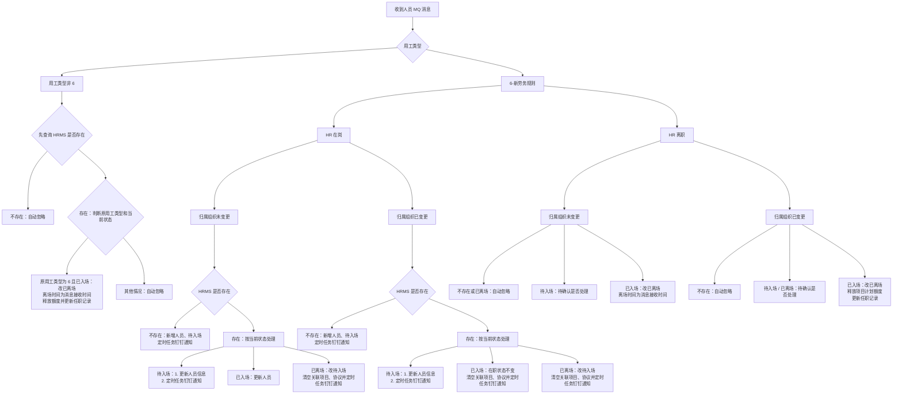

# 内部人员转外包用工系统需求-系分

## 1. 目标与范围

运营支撑域收到 HR 系统半小时同步的人员数据后，实时广播人员消息；HRMS 监听该消息，对用工类型为“6-新劳务规则”的人员自动新增、更新或离场，不走现有入场/离场审批。

本次仅设计 HRMS 的人员消息消费及 `outsourced_staff` 数据维护。页面权限、批量关联项目/协议、提醒任务、项目和协议到期规则按需求另行实施；本次不新增前端 HTTP 接口，也不保存消息中的全量人员、岗位及任职明细。

## 2. 现状与改造结论

已确认：

- `outsourced_staff` 已具备用工类型、在职状态、人员工号及本次消息处理所需的基础字段。
- 本次 MQ 处理使用的在职状态码为：`-1` 待入场、`0` 已入场、`1` 已离场；`-1` 转 `0` 仅由 HRMS 页面完成关联项目、关联协议操作触发，MQ 消息本身不触发该转换；自动新增、状态变更和离场均不走审批流。
- 本次消费运营支撑 org（组织机构）的人员新增/修改广播消息。
- 现有 `employment_category` 中的 `6` 表示 HRMS 原有“劳务外包”，运营支撑消息中的 `6` 表示“新劳务规则”。改造前先将 HRMS 存量的 `6` 统一迁移为 `7`；迁移完成后，`employment_category=7` 表示原有劳务外包，运营支撑推送的 `6` 直接写入同一字段表示新劳务规则。

设计结论：不新增物理字段，复用 `outsourced_staff.employment_category`。必须先完成存量数据及码表口径切换、再启用 org 消息监听，避免新旧 `6` 混存而无法区分。自动新增、自动更新及自动离场均以消息写入后的 `employment_category` 是否为 `6` 判断。

数据展示结论：HRMS 页面展示全量人员数据，包含 org 同步的 `employment_category=6` 人员；对外 RPC 不透出该类人员数据。

## 3. 消息消费与字段落库

### 3.1 消息入口

运营支撑在人员新增或修改时向以下 SOFAMQ Topic 广播 `PersonMessageModel` JSON；HRMS 新增一个消费者订阅该消息。消费者必须监听该 Topic 的全部人员新增/修改消息，不按用工类型在 MQ 订阅层过滤；收到消息后先按 `personCode` 查询 HRMS 人员，再依据消息用工类型、HR 在岗状态、组织是否变化、原用工类型和 HRMS 当前状态决定新增、更新、离场或忽略。

|配置项|配置值|
|---|---|
|消费者 Group|`GID_CIC_MIDABOSS_SSO_ACCOUNT_MODIFY`|
|Topic|`TP_CIC_MIDABOSS_AAAS_PERSONNEL`|
|Tag|`TG_CIC_MIDABOSS_AAAS_PERSONNEL`|

配置键如下，新增在 `bootstrap` 配置中：

```properties
# org mq 人员新增/修改 MQ
spring.sofamq.org.account.group-id=GID_CIC_MIDABOSS_SSO_ACCOUNT_MODIFY
spring.sofamq.org.account.topic=TP_CIC_MIDABOSS_AAAS_PERSONNEL
spring.sofamq.org.account.tag=TG_CIC_MIDABOSS_AAAS_PERSONNEL
```

消费者接收 `PersonMessageModel` JSON 后反序列化处理。成功处理后确认消息；参数缺失、无法识别的用工类型或数据处理异常应记录消息 ID、人员工号和原因，并返回失败以使用运营支撑的既有补偿能力。

### 3.1.1 MQ 消息监听分支图



图中“待确认”分支不实施处理逻辑，待业务确认后再补充。

图中“定时任务钉钉通知”统一指：定时任务通过消息中心发送钉钉提醒，提示关联项目、关联协议。**待确认：实际接收人是机构业务部门经办人、人力部门经办人、部门负责人，还是其他角色；无人经办时的兜底接收人也需明确。**

人员唯一识别键为 `personCode`（需求明确为 10 位工号），对应 `outsourced_staff.account_id`。数据库需确保该字段可按等值查询；是否已有唯一约束需在实施前核对。

### 3.2 必要字段映射

|运营支撑消息字段|HRMS 落点/用途|是否落库|说明|
|---|---|---|---|
|`personCode`|`account_id`|是|10 位工号，新增/更新匹配键|
|`personName`|`staff_name`|是|查询、详情展示|
|`personContactNumber`|`contact_number`|是|查询、详情展示|
|`personEmploymentType`|`employment_category`|是|运营支撑用工类型；切换后 `6` 表示新劳务规则，`7` 表示原有劳务外包|
|`personStatus`|驱动 `staff_status`|否（原值）|仅决定已入场/已离场；不单独保存 HR 原始状态|
|`branchOrgCode`|`branch_org_code`|是|归属组织|
|`operatingOrgCode`|`operating_org_code`|是|所属经营组织|
|`personJoinCompDt`|仅展示/新增日期候选|否|需求未要求保存为 HRMS 入场日期；不可替代本次用工类型变更日期|
|`personLeaveCompDt`|仅用于来源参考|否|离场日期按接收广播消息日期写入，不能直接使用该字段|

`personCertTypeCd`、`personCertNumber`、`personSexCd`、`personBirthDt`、学历、政治面貌、邮箱、照片、岗位、任职关系、扩展信息等字段不属于本需求驱动流程所必需，均不落库。若后续要求详情页展示或人工编辑校验，再按页面字段增量补充。

消息同时存在 `personEmploymentType` 与 `employmentType` 两个用工类型字段。本文暂以字段注释更明确的 `personEmploymentType` 为拟采用字段；运营支撑需确认实际报文的权威字段及“6-新劳务规则”的准确码值后实施。

## 4. 核心处理规则

|场景|条件|HRMS 处理|
|---|---|---|
|自动新增|消息用工类型为 6、HR 在岗、按 `account_id` 未查到人员|插入必要字段并写 `employment_category=6`、`staff_status=-1`（待入场）；定时任务经消息中心发送钉钉，通知机构业务部门/人力部门关联项目、协议。|
|在岗更新|消息用工类型为 6、HR 在岗、人员已存在|更新人员信息；待入场人员通过定时任务钉钉通知关联项目、协议，已离场人员改待入场并清空关联项目、协议；组织变更时，已入场人员清空关联项目、协议并定时任务钉钉通知。|
|离职处理|消息用工类型为 6、HR 离职，或消息用工类型非 6|先按 `account_id` 查询 HRMS 人员；仅原用工类型为 6 且已入场的人员改为已离场，离场时间为消息接收时间。组织变更离职及类型变更场景释放项目计划额度、更新任职记录；不存在、已离场或非目标类型的记录自动忽略。|
|非目标新增|消息用工类型非 6 且 HRMS 不存在人员|忽略消息，不创建外包人员。|

同一人员的重复消息应按上述状态结果幂等处理：已离场人员再次收到满足自动离场条件的消息，不重复释放项目额度；已入场人员再次收到普通在岗消息，不重复修改入场日期。消息事件顺序、事件版本或发送时间未在报文中提供，因此无法判断乱序消息，需运营支撑确认是否保证同一人员有序投递。

## 5. 数据、额度与代码改造范围

### 5.1 数据库

不新增物理字段。上线前须先完成码表和存量数据迁移，再部署或启用消息消费者，顺序不可颠倒：

1. 码表将 HRMS 原“劳务外包”的值由 `6` 调整为 `7`，并在界面、导入及人工新增/编辑校验中同步使用 `7`。
2. 对目标库 `outsourced_staff` 执行以下一次性数据迁移（仅迁移上线前的存量数据）：

```sql
UPDATE `outsourced_staff`
SET `employment_category` = '7'
WHERE `employment_category` = '6';
```

3. 核对影响行数与迁移前 `employment_category='6'` 的统计数量一致后，启用 org 消息监听；此后消息中的 `6` 直接写入 `employment_category`。

上述 SQL 仅为实施方案，本文未执行任何数据库操作。实施时应在目标数据库确认表名、码值含义、影响行数及回退方案，并取得明确执行确认。

代码不新增 `sourceEmploymentType` 字段；消息处理新增按 `account_id` 查询、按指定字段更新/插入、自动离场的最小数据访问能力。实施前还需只读核对 `account_id` 的索引/唯一约束；如不存在可用索引，另行评审增加索引。

### 5.2 最小代码改造

- `service`：新增运营支撑人员广播监听器和配置项，沿用现有 SOFAMQ `Consumer` 创建方式。
- `domain`：新增消息处理服务，封装“查询人员—判断用工类型/状态—新增、更新或自动离场”的业务规则。
- `infrastructure/repository`：在 `OutsourcedStaffBaseRepository` 及实现中增加按 `account_id` 查询、按指定字段更新/插入、自动离场的最小数据访问能力；复用 `employmentCategory` 的实体映射。新增场景不能复用要求项目和协议必填的人工 `CreateStaffCmd` 流程。
- HRMS 页面：人员列表、详情、导出等页面查询展示全量 `outsourced_staff` 数据，包含 org 同步的 `employment_category=6` 人员，不增加排除条件。
- 对外 RPC：所有外包人员列表与详情查询均排除 `employment_category=6` 的 org 同步人员，不向 RPC 调用方透出该类数据；按人员 ID 查询命中该类人员时按“未查询到数据”处理。
- 项目额度：复用现有“人员离场释放项目计划额度”的领域能力；若代码中没有可复用的无审批入口，应在同一事务内补充最小的额度释放调用。自动离场不得调用人工离场审批接口。
- 任职记录：需求页面要求展示自动入/离场记录。本次消息处理在状态首次变为已入场或已离场时，调用现有 `outsourced_staff_movement` 记录能力或补充最小记录写入；普通同步更新不新增任职记录。

## 6. 事务、下游通知与测试

人员状态、入/离场日期、项目额度释放及任职记录必须在同一数据库事务内完成。数据库提交后，是否继续发送现有外包人员变更 MQ 需确认下游是否需要感知这类自动变更；当前需求未明确，不新增独立通知 Topic。

最小验证：

1. 数据迁移：迁移前所有 `employment_category=6` 的存量人员迁移为 `7`；迁移后不存在历史劳务外包人员保留 `6` 的情况。
2. 运营支撑用工类型为 6 的在岗人员首次消息：新增、写入 `employment_category=6`、状态待入场，并产生关联项目/协议提醒。
3. 已存在人员收到 6/在岗消息：按待入场、已入场、已离场及组织变更规则更新；涉及清空项目、协议时同步产生提醒。
4. HR 离职或用工类型由 6 变更为非 6：仅已入场人员自动离场；验证离场时间、额度释放和任职记录更新。
5. `employment_category=7` 的历史劳务外包人员：不触发本次自动离场逻辑；非 6 的不存在人员不新增数据；重复消息无重复副作用。
6. HRMS 页面查询：展示 `employment_category=6` 的 org 同步人员；对外 RPC 列表和详情查询：不返回该类人员。

## 7. 待确认项

1. 报文是否存在外层包装、同一人员的消息顺序及失败重试约定。
2. 两个用工类型字段中，`personEmploymentType` 与 `employmentType` 哪一个为权威值，以及“6-新劳务规则”的实际码值和码表变更上线顺序。
3. `personStatus` 的“在岗/离职”实际码值；需求只描述语义，未给出报文码值。
4. 自动新增时消息未提供项目、协议、供应商等人工创建必填数据，是否允许这些字段为空（按需求“未关联项目和协议”理解为允许，实施前需确认数据库非空约束）。
5. 自动入/离场是否需要向现有账号、权限或外包人员下游 MQ 发通知；本需求未明确，默认不新增。
6. 待入场人员关联项目、协议的钉钉提醒接收人：机构业务部门经办人、人力部门经办人、部门负责人或其他角色；无人经办时的兜底接收规则。
