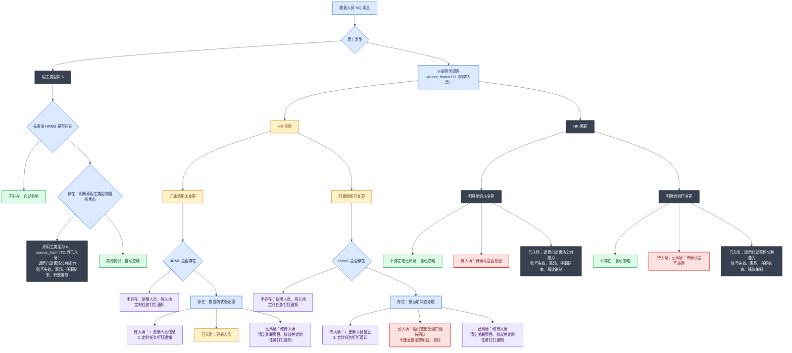
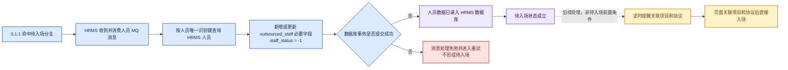
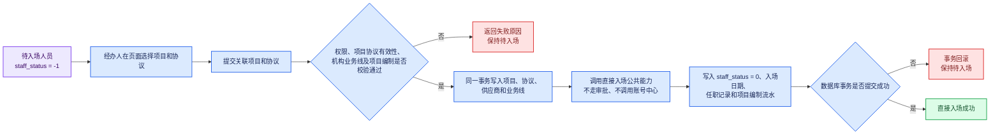
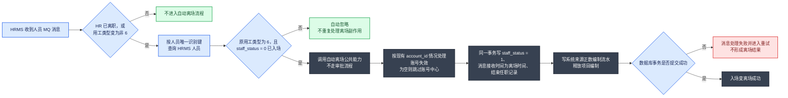

## 1. 目标与范围

运营支撑域收到 HR 系统半小时同步的人员数据后，实时广播人员消息；HRMS 监听该消息，对用工类型为 `6` 且来源为内转外包（`ITO`，Internal-to-Outsourced）的人员自动新增、更新或离场，不走现有入场/离场审批。

本次设计 HRMS 的人员消息消费、`outsourced_staff` 数据维护，以及 org 同步待入场人员的项目/协议关联权限。提醒任务、项目和协议到期规则按需求另行实施；人员基本信息按 3.2 字段映射写入，不新增岗位、任职明细或扩展信息存储。

## 2. 现状与改造结论

已确认：

- `outsourced_staff` 已具备用工类型、在职状态及本次消息处理所需的基础字段。待入场人员直接将消息 `personCode` 同时写入 `id` 和 `account_id`，分别作为内部工号和内部账号。
- 本次 MQ 处理使用的在职状态码为：`-1` 待入场、`0` 已入场、`1` 已离场；`-1` 转 `0` 仅由 HRMS 页面完成关联项目、关联协议操作触发，MQ 消息本身不触发该转换；自动新增、状态变更和离场均不走审批流。
- 内包账户的入场、修改和离场结果仅保存在 HRMS 本地，不发送现有外包人员变更 MQ。
- 本次消费运营支撑 org（组织机构）的人员新增/修改广播消息。
- `employment_category` 的 `6` 统一表示劳务外包用工类型，既包括 HRMS 原有“劳务外包”，也包括运营支撑消息中的“新劳务规则”；不再使用 `7` 区分两者。`source_from` 用于区分人员来源：`DEFAULT` 表示存量及普通外包人员，`ITO`（Internal-to-Outsourced，内部人员转外包）表示 HR 同步的内转人员。

设计结论：用工类型不新增物理字段，复用 `outsourced_staff.employment_category`；人员来源复用已有 `outsourced_staff.source_from`。人员新增、更新和离场均按 `personCode` 匹配 `outsourced_staff.id`，待入场新增时同时将 `personCode` 写入 `outsourced_staff.account_id`。上线前先将存量数据的 `source_from` 统一刷为 `DEFAULT`，再启用 org 消息监听；HR 同步命中内转人员处理分支时写入 `source_from=ITO`。自动新增、自动更新及自动离场需同时结合 `employment_category` 和 `source_from` 判断，不能仅凭 `employment_category=6` 区分内转人员。

数据展示结论：内包页面仅展示 HR 同步的 `employment_category=6 AND source_from=ITO` 人员，账户字段展示其内部账号（`account_id`）；原外包页面展示 `source_from=DEFAULT` 的普通外包人员，不能仅按 `employment_category` 过滤。内、外包页面的数据范围相互隔离；对外 RPC 不透出内包账户数据。

## 3. 消息消费与字段落库

### 3.1 消息入口

运营支撑在人员新增或修改时向以下 SOFAMQ Topic 广播 `PersonMessageModel` JSON；HRMS 新增一个消费者订阅该消息。消费者必须监听该 Topic 的全部人员新增/修改消息，不按用工类型在 MQ 订阅层过滤；收到消息后先按 `personCode` 查询 `outsourced_staff.id`，再依据消息用工类型、HR 在岗状态、组织是否变化、原用工类型、`source_from` 和 HRMS 当前状态决定新增、更新、离场或忽略。

| 配置项       | 配置值                                      |
| --------- | ---------------------------------------- |
| 消费者 Group | `GID_CIC_MIDABOSS_HRMS_PERSONNEL_MODIFY` |
| Topic     | `TP_CIC_MIDABOSS_AAAS_PERSONNEL`         |
| Tag       | `TG_CIC_MIDABOSS_AAAS_PERSONNEL`         |

配置键如下，新增在 `bootstrap` 配置中：

```properties
# org mq 人员新增/修改 MQ
spring.sofamq.org.account.group-id=GID_CIC_MIDABOSS_HRMS_PERSONNEL_MODIFY
spring.sofamq.org.account.topic=TP_CIC_MIDABOSS_AAAS_PERSONNEL
spring.sofamq.org.account.tag=TG_CIC_MIDABOSS_AAAS_PERSONNEL
```

消费者直接将消息内容按 `PersonMessageModel` 反序列化，不存在外层包装。成功处理后确认消息；参数缺失、无法识别的用工类型或数据处理异常应记录消息 ID、`personCode` 和原因，并返回失败触发运营支撑重试。

消息重试或同一人员的重复消息不依赖消息顺序：每次消费均按 `personCode` 查询 HRMS 当前数据，再根据当前用工类型和 `staff_status` 执行新增、更新、离场或忽略。已离场人员的重复离场消息仅忽略，不重复写任职记录、项目编制流水等离场副作用。

该 Group 为 HRMS 人员消息消费者独立使用，不与 SSO 账号消费者共用，避免同一 Group 内的消息负载均衡导致 HRMS 无法收到全部人员广播消息。

#### `PersonMessageModel` 消息体示例

以下示例来自运营支撑员工对接资料，示例值为测试数据，按原报文保留。

```json
{
  "branchOrgCode": "225204000400",
  "branchOrgName": "中华联合财产保险股份有限公司安顺中心支公司理赔服务中心",
  "eventType": "2",
  "operatingOrgCode": "215204000000",
  "operatingOrgName": "中华联合财产保险股份有限公司安顺中心支公司",
  "personBirthDt": "1990-01-19 00:00:00",
  "personCertNumber": "522424199001190836",
  "personCertTypeCd": "111",
  "personCode": "5204100010",
  "personContactNumber": "15285644378",
  "personEducationCd": "31",
  "personEmploymentSource": "1",
  "personEmploymentType": "0",
  "personExtendInfo": "{\"personPosition\":\"ZZ04\",\"personEmploymentType\":\"0\",\"oldPostTypeCd\":\"0\",\"oldJobSequenceCd\":\"A11\",\"personEmploymentSource\":\"1\",\"personPhoto\":\"5a206796f98d41b8bee1035cca30d6fe\"}",
  "personJoinCompDt": "2024-06-06 00:00:00",
  "personJoinPoliticalDt": "2011-04-19 00:00:00",
  "personLeaveCompDt": "9999-12-31 23:59:59",
  "personMaritalStatus": "2",
  "personName": "张从杰",
  "personNationCd": "01",
  "personNationality": "156",
  "personNativePlace": "520500",
  "personOrgRelationList": [
    {
      "branchOrgInCode": "225204000400",
      "branchOrgInName": "中华联合财产保险股份有限公司安顺中心支公司理赔服务中心",
      "branchOrgType": 1,
      "operatingOrgCode": "215204000000",
      "operatingOrgName": "中华联合财产保险股份有限公司安顺中心支公司"
    }
  ],
  "personPoliticalOutlookCd": "01",
  "personRegResidenceAddress": "520500",
  "personSexCd": "1",
  "personStatus": "0"
}
```

#### 消息体字段说明

| 字段名称                        | 中文含义      | 类型                           | 字段说明                                                        |
| --------------------------- | --------- | ---------------------------- | ----------------------------------------------------------- |
| `eventType`                 | 事件类型      | `String`                     | `0` 入职、`1` 所属机构变更、`2` 基本信息变更、`3` 离职；新增或更新应以 HRMS 是否已存在该人员为准 |
| `personCode`                | 员工编码      | `String`                     | 人员唯一识别键                                                     |
| `personName`                | 员工姓名      | `String`                     | -                                                           |
| `personCertTypeCd`          | 证件类型      | `String`                     | -                                                           |
| `personCertNumber`          | 证件号码      | `String`                     | 对接资料注明身份证数据可能为空                                             |
| `personSexCd`               | 性别        | `String`                     | `1` 男、`2` 女、`0` 未知、`9` 未说明                                  |
| `personNationCd`            | 民族        | `String`                     | -                                                           |
| `personBirthDt`             | 出生日期      | `String`                     | 示例格式：`yyyy-MM-dd HH:mm:ss`                                  |
| `personPoliticalOutlookCd`  | 政治面貌      | `String`                     | -                                                           |
| `personContactNumber`       | 手机号       | `String`                     | -                                                           |
| `personPhoto`               | 员工照片      | `String`                     | HR 数据；示例中放在 `personExtendInfo` 内                            |
| `personJoinPoliticalDt`     | 参加政党日期    | `String`                     | 示例格式：`yyyy-MM-dd HH:mm:ss`                                  |
| `personEducationCd`         | 学历        | `String`                     | -                                                           |
| `personProTechQuaCd`        | 专业技术资格    | `String`                     | 示例未返回时可为空                                                   |
| `personJoinCompDt`          | 入司日期      | `String`                     | 示例格式：`yyyy-MM-dd HH:mm:ss`                                  |
| `personLeaveCompDt`         | 离司日期      | `String`                     | `9999-12-31 23:59:59` 表示尚未离司                                |
| `personEmploymentType`      | 用工类型      | `String`                     | HRMS 使用顶层字段判断是否为 `6-新劳务规则`                                  |
| `personEmploymentSource`    | 用工来源      | `String`                     | -                                                           |
| `personEmploymentNature`    | 用工性质      | `String`                     | 示例未返回时可为空                                                   |
| `personSalesChannelType`    | 销售渠道类型    | `String`                     | 示例未返回时可为空                                                   |
| `personStatus`              | 员工状态      | `String`                     | `0` 在岗、`1` 离职、`2` 退休、`4` 实习、`5` 实习结束                        |
| `personExtendInfo`          | 员工扩展信息    | `String`                     | JSON 字符串，不是顶层 JSON 对象                                       |
| `branchOrgCode`             | 归属部门/团队编码 | `String`                     | 顶层归属组织编码                                                    |
| `branchOrgName`             | 归属部门/团队名称 | `String`                     | -                                                           |
| `operatingOrgCode`          | 所属经营组织编码  | `String`                     | -                                                           |
| `operatingOrgName`          | 所属经营组织名称  | `String`                     | -                                                           |
| `personMaritalStatus`       | 婚姻状况      | `String`                     | 示例中存在                                                       |
| `personNationality`         | 国籍        | `String`                     | 示例中存在                                                       |
| `personNativePlace`         | 籍贯        | `String`                     | 示例中存在                                                       |
| `personRegResidenceAddress` | 户籍地址      | `String`                     | 示例中存在                                                       |
| `personOrgRelationList`     | 人员-机构关系集合 | `List<PersonOrgRelationDTO>` | JSON 实际字段名为 `personOrgRelationList`                         |

`personOrgRelationList` 元素字段：

| 字段名称 | 中文含义 | 类型 | 字段说明 |
| --- | --- | --- | --- |
| `branchOrgInCode` | 关联归属组织编码 | `String` | - |
| `branchOrgInName` | 关联归属组织名称 | `String` | - |
| `branchOrgType` | 组织关系类型 | `Integer` | 示例值为 `1`，具体码值含义以运营支撑码表为准 |
| `operatingOrgCode` | 所属经营组织编码 | `String` | - |
| `operatingOrgName` | 所属经营组织名称 | `String` | - |

对接资料的字段表使用了 `personOrgRelationDTO` 名称，但实际 JSON 示例的顶层字段为 `personOrgRelationList`。HRMS 消费 DTO 和反序列化应以实际 JSON 字段名为准。

### 3.1.1 MQ 消息监听分支图

本图颜色按业务分支分类，不表示是否属于本次代码改造：<span style="color:#2563EB">■ 蓝色：消息入口与条件判断</span>　<span style="color:#D97706">■ 橙色：在岗更新</span>　<span style="color:#7C3AED">■ 紫色：进入或恢复待入场</span>　<span style="color:#16A34A">■ 绿色：自动忽略</span>　<span style="color:#374151">■ 深灰色：自动离场</span>　<span style="color:#DC2626">■ 红色：待确认</span>。



图中“待确认”分支不实施处理逻辑，待业务确认后再补充。

图中“定时任务钉钉通知”统一指：定时任务通过消息中心发送钉钉提醒，提示关联项目、关联协议。**待确认：实际接收人是机构业务部门经办人、人力部门经办人、部门负责人，还是其他角色；无人经办时的兜底接收人也需明确。**

人员唯一识别键为 `personCode`（需求明确为内部工号）。待入场落库时，同一个 `personCode` 同时写入 `outsourced_staff.id` 和 `outsourced_staff.account_id`；后续新增、更新和离场均按 `outsourced_staff.id` 匹配人员，不新增独立的 HR 来源工号或账号字段。


### 3.1.2 待入场时需要做什么

待入场不是审批中的临时状态。对 3.1.1 命中“新增人员、待入场”或“改待入场”分支的人员，HRMS 消费人员 MQ 消息并将人员必要字段成功写入 `outsourced_staff`，同时将 `staff_status` 写为 `-1`，即视为进入待入场状态。关联项目、关联协议、钉钉提醒和账号创建均不是进入待入场的前置条件。



图中虚线之后为待入场形成后的后续处理。只要 MQ 人员数据落库成功且状态写为 `-1`，人员即为待入场；无需等待项目、协议关联或提醒任务执行完成。

### 3.1.3 页面关联项目和协议后直接入场

待入场人员在页面一次性选择项目和协议并提交。HRMS 校验通过后，在同一本地事务内完成项目、协议关联和直接入场，不发起审批流程，也不调用账号中心；任一步骤失败均回滚并保持待入场状态。



项目、协议关联与直接入场必须作为一个整体成功，不允许形成“已关联项目和协议但人员仍为待入场”或“人员已入场但项目、协议未完整关联”的中间状态。内包账户的直接入场结果仅保存在 HRMS 本地，不发送现有外包人员变更 MQ。

### 3.1.4 入场变离场

人员 MQ 表示 HR 已离职，或 HR 同步的用工类型由 `6` 变为非 `6` 时，HRMS 先查询人员当前数据。仅来源为 `ITO`、原用工类型为 `6` 且当前为已入场状态（`staff_status=0`）的人员执行自动离场；普通外包的 `source_from=DEFAULT` 记录不进入本次内转人员自动离场流程。人员不存在、处于待入场/已离场状态或原用工类型非 `6` 时自动忽略，不重复结束任职或释放项目编制。



自动离场必须按目标状态幂等处理：同一内转人员重复收到离职或转出用工类型消息时，已离场记录直接忽略，不重复写任职记录、不重复执行账号失效，也不重复写项目编制流水；`source_from=ITO` 全流程保留，不因自动离场清空。内包账户的自动离场结果仅保存在 HRMS 本地，不发送现有外包人员变更 MQ。


### 3.2 必要字段映射

除离场日期外，以下标记“是”的字段在新增或更新消息中写入 `outsourced_staff`；报文未提供或值为空时不覆盖 HRMS 已有非空值。项目、协议、供应商、业务条线、入场日期和离场日期仍由 HRMS 业务流程维护，不从本消息直接覆盖。

#### 顶层字段映射

| 运营支撑消息字段                    | 类型           | HRMS 落点/用途            | 是否落库      | 处理说明                                                    |
| --------------------------- | ------------ | --------------------- | --------- | ------------------------------------------------------- |
| `personCode`                | `String`     | `id`                  | 是         | 写入内部工号；作为新增、更新和离场的唯一匹配键。                                |
| `personCode`                | `String`     | `account_id`          | 是         | 与 `id` 取同一值，写入内部账号。                                     |
| `personName`                | `String`     | `staff_name`          | 是         | 人员姓名。                                                   |
| `personCertTypeCd`          | `String`     | `certificate_type`    | 是         | 证件类型。                                                   |
| `personCertNumber`          | `String`     | `certificate_number`  | 是         | 证件号码；上游未提供时不覆盖已有值。                                      |
| `personSexCd`               | `String`     | `gender`              | 是         | 性别码原样保存：`1` 男、`2` 女、`0` 未知、`9` 未说明。                     |
| `personNationCd`            | `String`     | `ethnic`              | 是         | 民族码原样保存。                                                |
| `personBirthDt`             | `String`     | `birth_date`          | 是         | 按报文日期值写入；展示格式由现有页面统一处理。                                 |
| `personPoliticalOutlookCd`  | `String`     | `political_status`    | 是         | 政治面貌码原样保存。                                              |
| `personContactNumber`       | `String`     | `contact_number`      | 是         | 手机号；本期不直接从消息写入 `history_contact_number`。                |
| `personEducationCd`         | `String`     | `education`           | 是         | 最高学历码原样保存。                                              |
| `personEmploymentType`      | `String`     | `employment_category` | 是         | 顶层字段为权威值；劳务外包和新劳务规则统一按 `6` 写入，不再使用 `7` 区分。                  |
| ==`personStatus`==          | ==`String`== | ==驱动 `staff_status`== | ==否（原值）== | ==`0` 在岗、`1` 离职、`2` 退休、`4` 实习、`5` 实习结束；不单独保存 HR 原始状态。== |
| `branchOrgCode`             | `String`     | `branch_org_code`     | 是         | 归属组织编码。                                                 |
| `operatingOrgCode`          | `String`     | `operating_org_code`  | 是         | 所属经营组织编码。                                               |
| `personJoinCompDt`          | `String`     | `work_start_date`     | 是         | 入司日期；不作为 HRMS 入场日期。                                     |
| `personLeaveCompDt`         | `String`     | 仅用于来源参考               | 否         | HRMS 离场日期以消息接收时间写入 `offboard_date`，不直接使用该字段。            |
| `branchOrgName`             | `String`     | 组织名称展示                | 否         | 名称由现有组织集成按组织编码补全，不冗余存储。                                 |
| `operatingOrgName`          | `String`     | 组织名称展示                | 否         | 名称由现有组织集成按组织编码补全，不冗余存储。                                 |
| `personEmploymentSource`    | `String`     | -                     | 否         | 不直接映射；`source_from` 由 HRMS 消息消费场景统一写入 `ITO`。            |
| HRMS 消息消费场景            | -            | `source_from`          | 是         | 本次内转人员新增、更新及离场记录统一写入 `ITO`（Internal-to-Outsourced）；不从报文的 `personEmploymentSource` 取值。 |
| `personEmploymentNature`    | `String`     | -                     | 否         | 当前无明确业务落点。                                              |
| `personSalesChannelType`    | `String`     | -                     | 否         | 当前无明确业务落点。                                              |
| `personJoinPoliticalDt`     | `String`     | -                     | 否         | 当前无对应字段。                                                |
| `personProTechQuaCd`        | `String`     | -                     | 否         | 当前无明确业务落点。                                              |
| `personMaritalStatus`       | `String`     | -                     | 否         | 当前无对应字段。                                                |
| `personNationality`         | `String`     | -                     | 否         | 当前无对应字段。                                                |
| `personNativePlace`         | `String`     | -                     | 否         | 当前无对应字段。                                                |
| `personRegResidenceAddress` | `String`     | -                     | 否         | 户籍地址不等同于 `mailing_address`，本期不映射。                       |

#### 扩展信息与人员-机构关系

| 运营支撑消息字段 | 类型 | HRMS 落点/用途 | 是否落库 | 处理说明 |
| --- | --- | --- | --- | --- |
| `personExtendInfo` | `String` | 扩展 JSON 字符串 | 否 | 本期不整体落库，也不将其中字段作为人员新增、更新或离场判断依据。 |
| `personExtendInfo.personPosition` | `String` | `work_position_code` 候选来源 | 否 | 字段业务含义及是否可作为工作岗位编码尚未确认，暂不写入。 |
| `personExtendInfo.personPhoto` | `String` | `picture` 候选来源 | 否 | 不为内包账户创建外部账号，本期不解析或写入照片。 |
| `personExtendInfo.personEmploymentType` | `String` | - | 否 | 不使用内嵌值；以顶层 `personEmploymentType` 为准。 |
| `personExtendInfo.personEmploymentSource` | `String` | - | 否 | 本期不使用内嵌值。 |
| `personExtendInfo.oldPostTypeCd` | `String` | - | 否 | 历史岗位类型，本期不使用。 |
| `personExtendInfo.oldJobSequenceCd` | `String` | - | 否 | 历史职级/序列信息，本期不使用。 |
| `personOrgRelationList` | `List<PersonOrgRelationDTO>` | 机构关系校验候选数据 | 否 | 本期以顶层 `branchOrgCode`、`operatingOrgCode` 为落库来源；集合不单独存储。 |
| `personOrgRelationList[].branchOrgInCode` | `String` | 归属组织关系参考 | 否 | 不覆盖顶层 `branch_org_code`。 |
| `personOrgRelationList[].branchOrgInName` | `String` | 组织名称参考 | 否 | 不单独存储。 |
| `personOrgRelationList[].branchOrgType` | `Integer` | 组织关系类型参考 | 否 | 具体码值未确认，本期不使用。 |
| `personOrgRelationList[].operatingOrgCode` | `String` | 经营组织关系参考 | 否 | 不覆盖顶层 `operating_org_code`。 |
| `personOrgRelationList[].operatingOrgName` | `String` | 组织名称参考 | 否 | 不单独存储。 |

本期不从人员消息写入项目、协议、供应商、业务条线、业务分类、岗位、任职记录或外部账号信息。待入场人员仅在 HRMS 成功落库后形成待入场状态；项目和协议由页面操作关联，入场、离场及任职记录按 3.1 后续流程处理。

本次对接资料的 JSON 顶层用工类型字段为 `personEmploymentType`，未出现顶层 `employmentType`。HRMS 消费时以顶层 `personEmploymentType` 为权威值，不从 `personExtendInfo` 内嵌字符串取值；劳务外包和新劳务规则统一使用 `6`，内转人员来源统一写入 `source_from=ITO`。

## 4. 数据改动

### 4.1 数据库

用工类型和人员匹配均不新增物理字段；内部工号复用 `outsourced_staff.id`，内部账号复用 `outsourced_staff.account_id`，人员来源复用 `outsourced_staff.source_from`。上线前须先完成码表口径统一和存量来源初始化，再部署或启用消息消费者，顺序不可颠倒：

1. 码表统一约定：HRMS 原“劳务外包”和运营支撑“新劳务规则”均使用 `6`；界面、导入及人工新增/编辑校验不再使用 `7` 区分两者。
2. 对目标库 `outsourced_staff` 执行以下一次性来源初始化（仅处理上线前的存量数据）：

```sql
UPDATE `outsourced_staff`
SET `source_from` = 'DEFAULT';
```

3. 核对 `source_from` 更新影响行数与上线前存量总数一致后，启用 org 消息监听；HR 同步的内转人员将 `employment_category=6`、`source_from=ITO` 一并写入或更新。
4. 内转人员完成页面直接入场或自动离场后，仍保留 `source_from=ITO`；普通外包人员的新增、编辑等现有流程统一写入 `source_from=DEFAULT`，不得将来源置空。


## 5. 内包账户接口文档

### 5.1 分页查询内包账户

**Description：** 根据内包页面查询条件分页查询内部转外包人员，仅返回 `employment_category=6 AND source_from=ITO` 的内包账户。账户名称为内部账号（新一代工号），在本接口中复用请求及响应字段 `accountId`，实际查询和返回值均取 `outsourced_staff.account_id`。

**OpenAPI：** `POST /platform/api/aboss/hrms/staff/query-internal-outsourced-staff-page`

**请求对象：** `QueryInternalOutsourcedStaffPageCmd`（内包专用请求对象，不复用普通外包查询请求对象）

**响应类型：**

- 响应元素：`QueryStaffPageDTO`
- 返回：`PageResult<QueryStaffPageDTO>`

原接口 `POST /platform/api/aboss/hrms/staff/query-staff-page` 保持不变。本接口只复用响应 DTO 结构，不复用普通外包查询请求对象、查询入口和 Repository 查询方法。

#### Body-parameters

| Parameter           | Type           | Description                                   | Required | Since |
| ------------------- | -------------- | --------------------------------------------- | -------- | ----- |
| `current`           | `integer`      | 当前页码，从 1 开始                                   | true     | -     |
| `pageSize`          | `integer`      | 每页条数，取值范围 1～100                               | true     | -     |
| `accountId`         | `string`       | 内包账户名称，即内部账号（新一代工号）；支持模糊查询，本接口映射 `account_id` | false    | -     |
| `displayName`       | `string`       | 用户名称，即员工姓名；支持模糊查询                             | false    | -     |
| `phone`             | `string`       | 员工手机号；支持模糊查询                                  | false    | -     |
| `operatingOrgCode`  | `string`       | 页面选择的归属组织编码                                   | false    | -     |
| `includeChildren`   | `boolean`      | 是否包含所选归属组织的下级机构；未传按 `false` 处理                | false    | -     |
| `businessLineCode`  | `string`       | 归属业务条线编码                                      | false    | -     |
| `projectCode`       | `string`       | 关联项目编码                                        | false    | -     |
| `agreementNo`       | `string`       | 关联协议编码                                        | false    | -     |
| `staffStatusList`   | `List<string>` | 内包人员状态集合：仅支持 `-1` 待入场、`0` 已入场、`1` 已离场         | false    | -     |
| `permissionOrgCode` | `string`       | 当前页面机构权限编码，沿用现有机构权限校验                         | true     | -     |

内包请求对象不包含普通外包查询中的 `standardPositionCode`、`supplierId` 等不适用字段。请求中不增加 `employmentCategory`；内包范围必须由后端固定控制。`staffStatusList` 仅允许 `-1`、`0`、`1`，不支持普通外包审批过程中的 `-3`、`-2`、`2`、`3`。

#### Request-example

```bash
curl -X POST \
  -H 'Content-Type: application/json; charset=utf-8' \
  -i '/platform/api/aboss/hrms/staff/query-internal-outsourced-staff-page' \
  --data '{
    "current": 1,
    "pageSize": 20,
    "accountId": "10001234",
    "displayName": "张三",
    "phone": "1380000",
    "operatingOrgCode": "330000000000",
    "includeChildren": true,
    "businessLineCode": "BL001",
    "staffStatusList": ["-1", "0"],
    "permissionOrgCode": "330000000000"
  }'
```


#### Response-parameters

分页外壳沿用现有 `PageResult`，列表元素沿用 `QueryStaffPageDTO`。下表列出内包页面使用的主要响应字段；DTO 中其他字段未赋值时按现有序列化规则返回空值，无需特殊处理。

| Parameter | Type | Description |
| --- | --- | --- |
| `current` | `integer` | 当前页码 |
| `pageSize` | `integer` | 每页条数 |
| `total` | `long` | 符合条件的内包账户总数 |
| `staffId` | `string` | 内部工号；待入场数据取 `outsourced_staff.id` |
| `accountId` | `string` | 内包账户名称，即内部账号（新一代工号）；本接口从 `outsourced_staff.account_id` 赋值 |
| `displayName` | `string` | 员工姓名 |
| `phone` | `string` | 员工手机号 |
| `branchOrgCode` | `string` | 归属部门/团队编码 |
| `branchOrgName` | `string` | 归属部门/团队名称 |
| `operatingOrgCode` | `string` | 所属经营组织编码 |
| `operatingOrgName` | `string` | 所属经营组织名称 |
| `branchCompanySimpleName` | `string` | 归属分公司简称 |
| `branchCenterSimpleName` | `string` | 归属中支公司简称 |
| `branchSimpleName` | `string` | 归属支公司简称 |
| `projectCode` | `string` | 关联项目编码 |
| `projectName` | `string` | 关联项目名称 |
| `agreementNo` | `string` | 关联协议编码 |
| `agreementName` | `string` | 关联协议名称 |
| `businessLineCode` | `string` | 归属业务条线编码 |
| `businessLineName` | `string` | 归属业务条线名称 |
| `supplierId` | `string` | 归属供应商标识 |
| `supplierName` | `string` | 归属供应商名称 |
| `staffStatus` | `string` | 在职状态：`-1` 待入场、`0` 已入场、`1` 已离场 |
| `modifier` | `string` | 最后操作人；沿用现有补全逻辑，格式为“姓名-新一代账号” |
| `gmtModified` | `datetime` | 最后操作时间，格式 `yyyy-MM-dd HH:mm:ss` |

#### Response-example

```json
{
  "data": {
    "current": 1,
    "pageSize": 20,
    "total": 1,
    "list": [
      {
        "staffId": "1000123400",
        "accountId": "10001234",
        "displayName": "张三",
        "phone": "13800001234",
        "branchOrgCode": "330100010000",
        "branchOrgName": "理赔服务部",
        "operatingOrgCode": "330100000000",
        "operatingOrgName": "浙江分公司",
        "branchCompanySimpleName": "浙江分公司",
        "branchCenterSimpleName": null,
        "branchSimpleName": null,
        "projectCode": null,
        "projectName": null,
        "agreementNo": null,
        "agreementName": null,
        "businessLineCode": null,
        "businessLineName": null,
        "supplierId": null,
        "supplierName": null,
        "staffStatus": "-1",
        "modifier": "系统同步-system",
        "gmtModified": "2026-08-31 10:30:00"
      }
    ]
  }
}
```

无符合条件数据时，`total` 返回 `0`，`list` 返回空数组，不返回 `null`。

### 5.2 查询内包账户详情

**Description：** 内包详情页面专用查询接口，根据人员内部工号一次返回基本信息、岗位信息、工作信息和任职记录分页数据。接口只允许查询 `outsourced_staff.employment_category='6' AND source_from='ITO'` 且当前登录人具有数据权限的人员；普通外包人员即使使用合法 `staffId` 直接请求也不返回。

**OpenAPI：** `POST /platform/api/aboss/hrms/staff/query-internal-outsourced-staff-detail`

**接口类型：**

- 请求：新增 `QueryInternalOutsourcedStaffDetailCmd`
- 响应：新增 `QueryInternalOutsourcedStaffDetailDTO`
- 岗位元素：复用现有 `com.aliyun.fsi.insurance.hrms.web.staff.dto.resp.StaffWorkPositionDTO`，不新增 `InternalOutsourcedStaffPositionDTO`；岗位编码和岗位类型来自 `outsourced_staff_work_position`，岗位名称通过现有岗位服务按编码批量补全。
- 任职记录分页：复用 `PageResult<QueryStaffDetailDTO>` 的分页及元素字段结构

现有 `POST /platform/api/aboss/hrms/staff/query-staff-detail` 和 `POST /platform/api/aboss/hrms/staff/query-staff-movement-page` 保持不变。本接口可复用两者的 Repository 查询与名称补全能力，但不能直接复用原 Controller 入口：现有详情查询未强制过滤 `employment_category=6 AND source_from=ITO`，也没有内包页面的数据权限校验；现有任职查询还需要前端再次请求，不能一次返回需求 2.5 的完整页面数据。

#### Body-parameters

| Parameter | Type | Description | Required | Since |
| --- | --- | --- | --- | --- |
| `staffId` | `string` | 人员内部工号，对应 `outsourced_staff.id` | true | - |
| `permissionOrgCode` | `string` | 当前页面右上角切换的权限机构编码，用于校验详情数据权限 | true | - |
| `current` | `integer` | 任职记录当前页码，从 1 开始；未传默认 `1` | false | - |
| `pageSize` | `integer` | 任职记录每页条数，取值范围 1～100；未传默认 `10` | false | - |

#### Request-example

```bash
curl -X POST \
  -H 'Content-Type: application/json; charset=utf-8' \
  -i '/platform/api/aboss/hrms/staff/query-internal-outsourced-staff-detail' \
  --data '{
    "staffId": "1000123400",
    "permissionOrgCode": "330000000000",
    "current": 1,
    "pageSize": 10
  }'
```

#### Response-parameters

| Parameter | Type | Description |
| --- | --- | --- |
| `staffId` | `string` | 人员内部工号，取 `outsourced_staff.id` |
| `accountId` | `string` | 内部账号（新一代工号），取 `outsourced_staff.account_id` |
| `displayName` | `string` | 人员姓名 |
| `phone` | `string` | 手机号 |
| `employmentCategory` | `string` | 用工类型，内包详情固定为 `6` |
| `branchOrgCode` | `string` | 归属部门/团队编码 |
| `branchOrgName` | `string` | 归属部门/团队名称 |
| `operatingOrgCode` | `string` | 所属经营组织编码 |
| `operatingOrgName` | `string` | 所属经营组织名称 |
| `workPositions` | `List<StaffWorkPositionDTO>` | 岗位信息列表，复用现有人员详情岗位元素；无数据时返回空数组 |
| `workPositions[].workPositionCode` | `string` | 工作岗位编码，取 `outsourced_staff_work_position.work_position_code` |
| `workPositions[].workPositionName` | `string` | 工作岗位名称，由现有岗位服务按岗位编码补全；岗位服务未返回时为空 |
| `workPositions[].positionType` | `string` | 岗位类型码值：`1` 主岗位、`2` 兼职岗位，取 `outsourced_staff_work_position.position_type` |
| `projectCode` | `string` | 关联项目编码，未关联时为空 |
| `projectName` | `string` | 关联项目名称，未关联时为空 |
| `agreementNo` | `string` | 关联协议编码，未关联时为空 |
| `agreementName` | `string` | 关联协议名称，未关联时为空 |
| `businessLineCode` | `string` | 归属业务条线编码，由项目带出 |
| `businessLineName` | `string` | 归属业务条线名称 |
| `supplierId` | `string` | 归属供应商标识，由协议带出 |
| `supplierName` | `string` | 归属供应商名称 |
| `staffStatus` | `string` | 在职状态：`-1` 待入场、`0` 已入场、`1` 已离场 |
| `onboardDate` | `string` | 入场日期，格式 `yyyy-MM-dd`；未入场时为空 |
| `offboardDate` | `string` | 离场日期，格式 `yyyy-MM-dd`；未离场时为空 |
| `movementPage.current` | `integer` | 任职记录当前页码 |
| `movementPage.pageSize` | `integer` | 任职记录每页条数 |
| `movementPage.total` | `long` | 任职记录总数 |
| `movementPage.list` | `List<QueryStaffDetailDTO>` | 任职记录列表，字段按下表返回；无数据时为空数组 |

任职记录页面使用字段：

| Parameter | Type | Description |
| --- | --- | --- |
| `gmtModified` | `datetime` | 更新时间，取任职记录 `gmt_create`，格式 `yyyy-MM-dd HH:mm:ss` |
| `staffStatus` | `string` | 当次任职状态：`-1` 待入场、`0` 已入场、`1` 已离场 |
| `displayName` | `string` | 当次记录中的人员姓名 |
| `phone` | `string` | 当次记录中的手机号 |
| `onboardDate` | `date` | 当次记录中的入场日期，格式 `yyyy-MM-dd` |
| `offboardDate` | `date` | 当次记录中的离场日期，格式 `yyyy-MM-dd` |
| `projectName` | `string` | 当次记录关联项目名称 |
| `agreementName` | `string` | 当次记录关联协议名称 |
| `businessLineName` | `string` | 当次记录归属业务条线名称 |
| `supplierName` | `string` | 当次记录归属供应商名称 |
| `branchOrgName` | `string` | 当次记录归属部门/团队名称 |
| `operatingOrgName` | `string` | 当次记录所属经营组织名称 |
| `workPositionName` | `string` | 当次记录工作岗位名称 |
| `employmentCategory` | `string` | 当次记录用工类型 |

#### Response-example

```json
{
  "data": {
    "staffId": "1000123400",
    "accountId": "10001234",
    "displayName": "张三",
    "phone": "13800001234",
    "employmentCategory": "6",
    "branchOrgCode": "330100010000",
    "branchOrgName": "理赔服务部",
    "operatingOrgCode": "330100000000",
    "operatingOrgName": "浙江分公司",
    "workPositions": [
      {
        "workPositionCode": "POSITION001",
        "workPositionName": "理赔岗",
        "positionType": "1"
      }
    ],
    "projectCode": "PRJ20260001",
    "projectName": "2026年理赔外包项目",
    "agreementNo": "AGR20260001",
    "agreementName": "2026年理赔服务协议",
    "businessLineCode": "BL001",
    "businessLineName": "理赔条线",
    "supplierId": "SUP001",
    "supplierName": "示例供应商",
    "staffStatus": "0",
    "onboardDate": "2026-08-31",
    "offboardDate": null,
    "movementPage": {
      "current": 1,
      "pageSize": 10,
      "total": 1,
      "list": [
        {
          "gmtModified": "2026-08-31 10:30:00",
          "staffStatus": "0",
          "displayName": "张三",
          "phone": "13800001234",
          "onboardDate": "2026-08-31",
          "offboardDate": null,
          "projectName": "2026年理赔外包项目",
          "agreementName": "2026年理赔服务协议",
          "businessLineName": "理赔条线",
          "supplierName": "示例供应商",
          "branchOrgName": "理赔服务部",
          "operatingOrgName": "浙江分公司",
          "workPositionName": "理赔岗",
          "employmentCategory": "6"
        }
      ]
    }
  }
}
```

#### 主要失败场景

| 场景                                  | 处理                       |
| ----------------------------------- | ------------------------ |
| `staffId` 或 `permissionOrgCode` 为空  | 参数校验失败，不执行查询             |
| `current`、`pageSize` 超出允许范围         | 参数校验失败                   |
| 人员不存在、`employment_category` 不为 `6` 或 `source_from` 不为 `ITO` | 按未查询到内包账户处理              |
| 当前登录人无该人员的机构或业务条线权限                 | 拒绝查询                     |
| 组织、项目、协议或岗位名称补全接口返回空                | 对应名称返回空值，人员主数据和任职记录仍正常返回 |

### 5.3 批量关联内包账户项目和协议

**Description：** 内包查询页面批量关联弹窗的提交接口。用户在页面列表勾选人员，再在弹窗中选择统一关联的项目和协议；前端直接传入勾选的人员内部工号集合、项目编码和协议编码。后端完成内包人员、机构层级、数据权限、项目协议状态和项目实际剩余数量校验后，整批更新项目、协议、业务条线、供应商及任职记录。待入场人员同时直接入场，已入场人员保持状态不变。

**OpenAPI：** `POST /platform/api/aboss/hrms/staff/batch-associate-internal-outsourced-staff`

**接口类型：**

- 请求：新增 `BatchAssociateInternalOutsourcedStaffCmd`
- 返回：`Boolean`

页面交互：用户在内包账户列表勾选人员后，点击【批量关联】，在弹窗中选择项目和协议并提交。后端直接按页面提交的 `staffIds` 校验并更新 `outsourced_staff`。

#### Body-parameters

| Parameter | Type | Description | Required | Since |
| --- | --- | --- | --- | --- |
| `staffIds` | `List<string>` | 勾选的人员内部工号集合，对应 `outsourced_staff.id`；数量 1～100，不能重复 | true | - |
| `projectCode` | `string` | 本次页面操作统一关联的项目编码 | true | - |
| `agreementNo` | `string` | 本次页面操作统一关联的协议编码 | true | - |
| `permissionOrgCode` | `string` | 当前页面右上角切换的权限机构编码 | true | - |

`businessLineCode` 和 `supplierId` 不由前端传入。后端分别根据 `projectCode`、`agreementNo` 查询并统一写入全部人员，避免同一次页面提交中出现项目与业务条线、协议与供应商不一致。

#### Request-example

```bash
curl -X POST \
  -H 'Content-Type: application/json; charset=utf-8' \
  -i '/platform/api/aboss/hrms/staff/batch-associate-internal-outsourced-staff' \
  --data '{
    "staffIds": [
      "1000123400",
      "1000123401",
      "1000123402"
    ],
    "projectCode": "PRJ20260001",
    "agreementNo": "AGR20260001",
    "permissionOrgCode": "330000000000"
  }'
```

#### 处理规则

1. 后端对 `staffIds` 去重并校验原集合不存在重复值，再按 ID 集合批量查询 `outsourced_staff`。查询必须强制追加 `employment_category='6' AND source_from='ITO'`，且查询结果数量必须与请求人数一致；任一人员不存在或不是内包账户时整批拒绝。
2. 全部人员必须为 `staff_status=-1`（待入场）或 `staff_status=0`（已入场）。存在已离场或其他审批中状态时整批拒绝，不能只处理其中状态合法的人员。
3. 后端按人员的 `operating_org_code` 和组织层级路径校验“同一家机构或同一机构及其下级机构”：必须能从所选人员的归属组织中确定一个共同根机构，其他所选人员均为该机构本级或下级。校验失败时返回“员工归属机构不为同一机构及下级机构，请重新选择”。
4. 对全部人员执行与 5.1 一致的机构和业务条线数据权限校验。关联完成前的待入场人员按未关联数据权限判断；已入场人员按当前业务条线权限判断。任一人员超出当前登录人权限时整批拒绝。
5. 项目必须为 `ProjectStatusEnum.APPROVED`（生效）；协议状态必须为 `AgreementStatusEnum.APPROVED`（生效）或 `AgreementStatusEnum.EXPIRED_UNTERMINATED`（到期未终止）。项目、协议还必须位于当前登录人的可选范围：中支可选择所属分公司和本中支的数据，分公司可选择本分公司的数据。
6. 后端根据项目带出统一的 `business_line_code`，根据协议带出统一的 `supplier_id`。是否还要求项目与协议属于同一业务条线、同一经营机构，沿用第 6 章待确认项第 7 条，未确认前不增加文档之外的关联限制。
7. 项目实际剩余数量沿用现有项目编制口径，根据项目编制数以及 `outsourced_staff_onoffboard_application_project` 中审批中、已生效的 `request_num` 计算。按需求使用去重后的勾选人数 `selectedCount` 校验：`selectedCount <= actualRemainNum` 才允许提交；否则返回“项目计划额度不足，实际剩余数量XX，当前选择人员数量XX，请先申请计划数量”。
8. 额度校验和保存必须在同一事务内完成。事务内先锁定目标项目数据并重新计算实际剩余数量，避免两个批量请求同时校验通过后造成超额占用；重新计算不通过时整批回滚。
9. 对待入场人员，在同一事务内写入项目、协议、业务条线、供应商，按 3.1.3 直接将 `staff_status` 从 `-1` 更新为 `0`，写入入场信息、任职记录和系统来源负数项目编制流水；不发起审批，不调用账号中心，`id` 和 `account_id` 保持不变。
10. 对已入场人员，保持 `staff_status=0` 和原入场日期不变，更新项目、协议、业务条线、供应商并写任职记录。项目发生变化时，向原项目写正数流水释放一个编制，并向目标项目写负数流水占用一个编制；原项目与目标项目相同时不重复写编制流水。
11. 全部人员及项目编制作为一个事务整体提交。任一人员更新、任职记录或编制流水写入失败时整批回滚，不返回部分成功结果。
12. 批量关联及直接入场结果仅保存在 HRMS 本地，不按人员发送现有外包人员变更 MQ。

#### Response-parameters

| Parameter | Type | Description |
| --- | --- | --- |
| `data` | `boolean` | `true` 表示全部人员批量关联成功；失败时按统一异常结构返回原因 |

#### Response-example

```json
{
  "data": true
}
```

#### 主要失败场景

| 场景 | 处理 |
| --- | --- |
| `staffIds` 为空、超过 100 条或包含重复值 | 参数校验失败，不执行保存 |
| `projectCode`、`agreementNo` 或 `permissionOrgCode` 为空 | 参数校验失败，不执行保存 |
| 任一人员不存在、用工类型不为 `6` 或状态不允许操作 | 整批拒绝 |
| 任一人员超出当前登录人的机构或业务条线权限 | 整批拒绝 |
| 所选人员不属于同一机构或同一机构及其下级机构 | 返回“员工归属机构不为同一机构及下级机构，请重新选择” |
| 项目非生效状态，或协议非生效、到期未终止状态 | 整批拒绝 |
| 项目或协议超出当前登录人的可选范围 | 整批拒绝 |
| `selectedCount > actualRemainNum` | 返回“项目计划额度不足，实际剩余数量XX，当前选择人员数量XX，请先申请计划数量” |
| 并发提交导致事务内复核额度不足 | 整批回滚并返回最新实际剩余数量 |
| 任一人员、任职记录或编制流水保存失败 | 整批回滚，不产生部分成功数据 |


## 6. 待确认项

1. 对接资料已确认顶层 `personEmploymentType` 为用工类型字段；本次统一约定劳务外包和新劳务规则使用 `6`，内转人员来源使用 `source_from=ITO`。
2. `personStatus` 已明确 `0` 在岗、`1` 离职、`2` 退休、`4` 实习、`5` 实习结束；需运营支撑确认 `2`、`4`、`5` 在本流程中应按在岗、离职还是忽略处理。
3. 自动新增时消息未提供项目、协议、供应商等人工创建必填数据，是否允许这些字段为空（按需求“未关联项目和协议”理解为允许，实施前需确认数据库非空约束）。
4. HR 直接入场的实际入场日期取关联成功时间，还是由页面选择计划日期；若允许未来日期，是否需要新增独立待生效状态和定时任务。
5. 待入场人员关联项目、协议的钉钉提醒接收人：机构业务部门经办人、人力部门经办人、部门负责人或其他角色；无人经办时的兜底接收规则。
6. “同层级机构”的权威口径：以当前登录账号的 ACL 数据权限、账号归属机构，还是页面传入的 `permissionOrgCode` 为准。实现建议以 ACL 返回的授权机构为准，页面参数只用于筛选；需确认 ACL 是否能返回当前账号可操作的机构集合及层级关系。
7. 关联校验口径：项目与协议是否必须属于同一业务条线、同一经营机构，以及协议是否存在可关联项目范围；上述规则需由项目/协议业务确认后固化。
8. 已入场人员组织变更后的目标状态：先自动离场并改待入场，还是保留旧关联直到新项目、协议一次性替换；不能采用“状态仍为已入场但直接清空项目、协议”的中间状态。
9. 详情页岗位信息的数据来源。现有 `outsourced_staff` 只保存一个 `work_position_code`，可通过现有组织集成补充一个岗位名称，但没有多岗位集合和“主岗位/兼职岗位”字段；若页面必须展示多条岗位及岗位类型，需运营支撑明确 MQ 对应字段，并确定新增岗位明细存储还是查询时调用上游获取。
