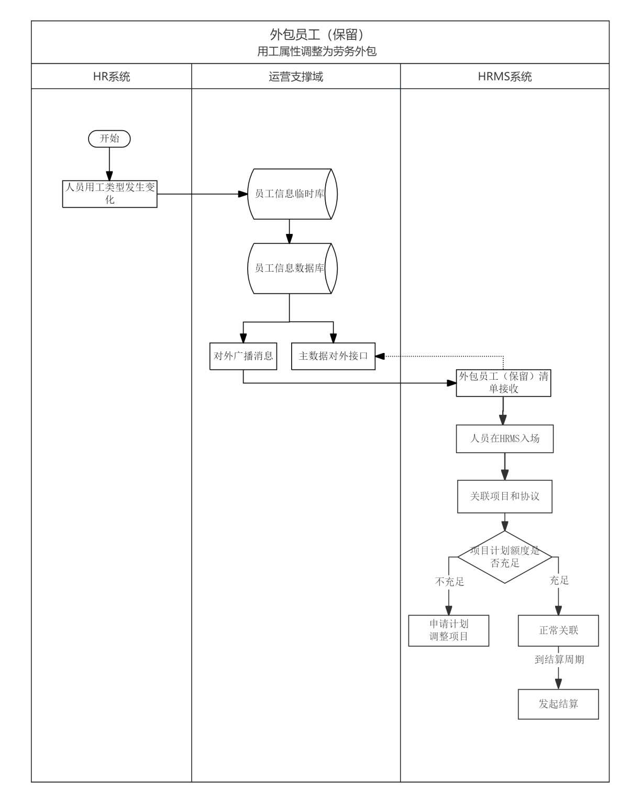
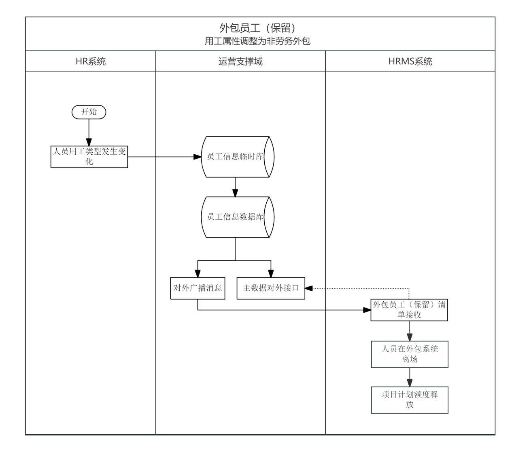

**内部人员转外包用工系统需求**

# 1. 业务背景

为落实公司工资总额管控要求，保障各业务条线用人需求与业务持续发展，公司各业务条线逐步推广外包用工模式，优化用工结构，外包用工已成为现有用工体系的重要补充形式。目前公司内部合同制、劳务派遣人员由HR系统统一管理，外包人员由HRMS系统进行全生命周期管理；两套人事体系分别对接新一代核心系统运营支撑域，实现账号、权限的统一管控。

随着外包用工覆盖范围持续扩大，逐步延伸至销售、理赔、客服、运营等多个条线岗位，在用工形式调整过程中，面临人员身份切换衔接不畅、账号与业务数据断层、执业注册冲突、绩效统计口径不一致、跨系统身份校验缺失等问题，同时需满足监管报送、内部审计的合规要求，对系统适配能力提出了更高要求。

为保障用工形式优化平稳落地，实现人员身份平滑切换、业务数据连续可追溯、权限管理规范统一、合规风险可控，特制定本系统适配方案，明确各系统改造范围、流程规则与落地路径。

## 2. 外包员工（保留）

存量部分内部员工用工属性增加“6-新劳务规则”，但不脱离HR系统管理体系，属于过渡类身份形态，随人员自然流失逐步消亡，核心满足“用工统计口径归为外包，但业务操作、账号权限无感知切换”的管理需求。

### 2.1. 流程图
 

(1) 内部转外包保留工号的，HR系统用工类型要用6-新劳务规则

	1) **原来HRMS的用工类型为6-劳务外包的，现在需要申请码表变更**

	2) HR系统用工类型转换要增加轨迹（必须加）

		原因：报表和监管报送是没有单独存储人员信息的，如果不增加轨迹就不知道人员用工类型发生了变更

(2) 数据同步（现有流程）：

	①　HR系统每隔半小时会同步一次人员信息，每次运营支撑收到消息后，会实时转发广播消息，HRMS系统需要监听消息

	②　数据同步失败的可以在运营支撑进行消息补偿

(3)HRMS监听运营支撑域的广播消息后，根据用工类型做数据新增或更新处理：

	1) 用工类型调整为6-新劳务规则时，判断人员在HRMS系统是否存在：

		①　不存在（10位工号），将数据插入到系统中，查看HR的在职状态：HR为在职，HRMS在职状态为“已入场”；HR为离职，HRMS在职状态为“已离场”

		②　已存在（10位工号），判断人员在HRMS系统的在职状态：

			已入场，更新人员信息并更新在职状态

			已离场，更新在职状态

	2) 用工类型由6-新劳务规则变为其他类型，或用工类型为6-新劳务规则，但是HR的在岗状态为“离职”，需要将人员在职状态变更为“已离场”，离场日期为接收到广播消息的日期，需要释放项目计划额度；

### 2.2. **数据权限**

(1) 未关联项目和协议时，同层级业务部门经办人可以查看所有业务条线的数据，并可以进行关联项目和协议

(2) 关联项目和协议后，同层级业务部门经办人仅可以查看和操作自己归属业务条线的数据

(3) 同层级人力部门经办人可以查看所有业务条线的数据并可以操作所有业务条线的数据

### 2.3. **查询页面**

#### 2.3.1. 页面原型

#### 2.3.2. 页面要素

##### 2.3.2.1.查询页面

|   |   |   |   |   |
|---|---|---|---|---|
|**字段名称**|**字段描述**|**是否必填**|**格式**|**备注**|
|**查询条件**|   |   |   |   |
|账户名称|新一代工号|-|文本框|支持模糊搜索或精确查询|
|用户名称|员工姓名|-|文本框|支持模糊搜索或精确查询|
|手机号|员工手机号|-|文本框|支持模糊搜索或精确查询|
|归属组织+包含下级|员工归属组织|-|下拉框+复选框|详见2.2.3相关规则|
|归属业务条线|员工归属业务条线|-|下拉框|数据来源：外包管理系统的业务条线管理|
|关联项目|员工关联的项目|-|下拉框|①　支持通过项目名称/项目编码进行模糊搜索，选择关联项目，显示项目下的人员  ②　增加枚举无关联项目|
|关联协议|员工关联的协议|-|下拉框|①　支持通过协议名称/协议编码进行模糊搜索，选择关联协议，显示协议下的人员  ②　增加枚举无关联协议|
|在职状态|员工的在职状态|-|下拉框|枚举：已入场、已离场  详见2.2.3相关规则|
|**按钮**|   |   |   |   |
|查询||-|按钮|① 根据查询条件获取查询结果；  ② 未输入查询条件时，点击该按钮，获取全部结果；  ③ 若查询不到数据，提示暂无数据；|
|重置||-|按钮|清空查询条件，不清空查询结果|
|批量操作||-|按钮|①　未勾选任何记录时，本按钮置灰，不可点击  ②　勾选人员信息后，点击打开批量操作弹窗|
|导出||-|按钮|点击导出当前查询结果的所有数据|
|查看导出结果||-|按钮|点击打开导出文件列表弹窗|
|**查询结果**|   |   |   |   |
|复选框||-|复选框||
|序号||-|文本|从1开始|
|账号名称|新一代工号|-|文本|同HR系统的人员工号|
|用户名称|员工姓名|-|文本||
|手机号|员工手机号|-|文本||
|归属部门/团队|员工归属的部门/团队|-|文本|显示简称，没有可以显示为空|
|归属分公司|员工归属的分公司|-|文本|显示简称，没有可以显示为空|
|归属中支公司|员工归属的中心支公司|-|文本|显示简称，没有可以显示为空|
|归属支公司|员工归属的支公司|-|文本|显示简称，没有可以显示为空|
|归属业务条线|员工归属业务条线|-|文本||
|关联项目|员工关联的项目|-|文本||
|关联协议|员工关联的协议|-|文本||
|在职状态|员工的在职状态|-|文本||
|最后操作人|最后操作本条数据的人员|-|文本|格式：操作人姓名-新一代账号|
|最后操作时间|最后操作本条数据的时间|-|文本|①　格式：YYYY-MM-DD HH:MM:SS  ②　按最后操作时间倒序（最新操作的排在最前）|
|操作列-详情||-|按钮|点击跳转到员工信息详情页面|
|操作列-修改||-|按钮|点击跳转到员工信息编辑页面|

##### 2.3.2.2.批量操作弹窗

|   |   |   |   |   |
|---|---|---|---|---|
|**字段名称**|**字段描述**|**是否必填**|**格式**|**备注**|
|提示语||-|文本|本次已勾选X人|
|关联项目|员工关联的项目|是|下拉框|①　支持通过项目名称/项目编码进行模糊搜索  ②　项目状态为有效|
|关联协议|员工关联的协议|是|下拉框|①　支持通过协议名称/协议编码进行模糊搜索  ②　协议状态为有效、到期未终止|
|归属业务条线|员工归属的业务条线|-|文本|根据关联项目自动带出|
|**按钮**|   |   |   |   |
|确定||-|按钮|点击[确定]，需要校验勾选的人数≤项目的实际剩余数量  详见规则2.2.3相关规则|
|取消||-|按钮|点击[取消]，关闭弹窗|

##### 2.3.2.3.查看导出结果-导出记录弹窗

|   |   |   |   |   |
|---|---|---|---|---|
|**字段名称**|**字段描述**|**是否必填**|**格式**|**备注**|
|序号||-|文本|从1开始|
|文件名|导出的文件名称|-|文本|导出文件命名：  人员数据导出【导出时间】.xlsx|
|操作人|操作数据导出的人员|-|文本|操作人员名称|
|操作时间|操作数据导出的时间|-|文本|①　格式：YYYY-MM-DD HH:MM:SS  ②　按最后操作时间倒序（最新操作的排在最前）|
|状态|成功、失败|-|文本|成功：导出完成后无异常数据  失败：导出数据失败|
|操作列-下载||-|按钮|点击[下载]按钮，可查看错误信息列表或导出的表格  **导出数据下载：**  **（模板样式）**|

#### 2.3.3. 相关规则

1. **查询页面相关规则：**

	(1) 归属组织查询规则：

		1) 总公司：右上角切换机构选择“中华财险”，进入查询页面：

			①　页面初始化：默认查询中华财险本级及所有下级机构数据

			②　手动选择归属组织：

				l 未勾选【包含下级】，仅可查询所选归属组织本级机构的数据

				l 勾选【包含下级】，可查询出所选择归属组织本级及所有下级机构数据

		2) 各分公司：右上角切换机构选择分公司（例如：浙江分公司），进入查询页面：

			①　页面初始化：默认查询出当前分公司本级及所有下级机构数据

			②　手动选择归属组织：

				l 未勾选【包含下级】，仅查询所选归属组织本级机构的数据

				l 勾选【包含下级】，可查询出所选择归属组织本级及下级机构的所有数据

		3) 中心支公司：右上角切换机构选择中心支公司（例如：杭州中心支公司），进入查询页面：

			①　页面初始化：默认查询出当前中心支公司及对应上级分公司的数据（即查询出杭州中心支公司和浙江分公司的数据）

			②　手动选择归属组织：仅查询所选归属组织本级机构的数据  

	(2) 关联项目和关联协议查询规则：

		1) 当前登录人所属的经营组织是中支时，关联项目可以查询出分公司的项目及中支公司的项目；关联协议能查询出中支的协议

		2) 当前登录人所属的经营组织是总公司/分公司，关联项目和关联协议，可以查询出本级及下级机构的项目和协议  

	(3) 在职状态：

		1) HR系统推送的员工用工类型为6-新劳务规则，人员状态为在岗时，在HRMS系统在职状态标记为“已入场”

		2) HR系统推送的员工用工类型为6-新劳务规则，人员状态为离职时，在HRMS系统在职状态标记为“已离场”

		3) HR系统员工的用工类型由6-新劳务规则，变更为其他类型，在HRMS系统在职状态标记为“已离场”

不用走入场/离场审批流程，自动入场或离场  

	(4) 批量操作按钮操作规则：

		1) 未勾选人员列表数据时，批量操作按钮置灰，不可点击；勾选人员列表数据后，按钮可点击，点击后显示“批量操作弹窗”

		2) 勾选的人员列表数据中包含“已离场”人员时，点击批量操作按钮时，给出提示“包含离场人员，是否继续操作？”确定/取消

		3) 勾选的人员列表数据需要为同一家机构或同一机构及下级机构的员工，点击批量操作按钮时，否则给出提示“员工归属机构不为同一机构及下级机构，请重新选择”  

2. **批量操作弹窗相关规则：**

	(1) 项目计划额度校验规则

		1) 勾选的人数≤项目的实际剩余数量，可以关联成功

		2) 勾选的人数＞项目的实际剩余数量，不可以关联并给出提示“项目计划数量额度不足，剩余XX，当前选择人员数量XX，请先申请计划数量”  

	(2) 关联项目和关联协议可选范围

		1)根据当前登录人的权限来判断：

			①　中支，可以选择分公司和中支的项目协议

			②　分公司，可以选择分公司的项目协议

### 2.4. 修改页面

#### 2.4.1. 页面原型

#### 2.4.2. 页面要素

|   |   |   |   |   |
|---|---|---|---|---|
|**字段名称**|**字段描述**|**是否必填**|**格式**|**备注**|
|**基本信息**|   |   |   |   |
|人员工号|新一代工号|-|文本||
|人员姓名|员工姓名|-|文本||
|手机号|员工手机号|-|文本||
|用工类型||-|文本||
|归属组织编码||-|文本||
|归属组织名称||-|文本||
|归属经营组织编码||-|文本||
|所属经营组织名称||-|文本||
|入司日期||-|文本||
|离司日期||-|文本||
|人员状态||-|文本||
|**岗位信息**|   |   |   |   |
|序号||-|文本||
|工作岗位编码||-|文本||
|工作岗位名称||-|文本||
|所属标准岗位||-|文本||
|工作岗位类型||-|文本||
|人员在岗状态||-|文本||
|任职组织名称||-|文本||
|任职经营组织名称||-|文本||
|**工作信息**|   |   |   |   |
|关联项目|员工关联的项目|是|下拉框||
|关联协议|员工关联的协议|是|下拉框||
|归属业务条线|员工归属的业务条线|-|文本|根据关联项目自动带出，不可编辑|
|在职状态|员工的在职状态|-|文本|已入场、已离场|
|入场日期||-|文本|①　用工类型变为6的时间  ②　格式：YYYY-MM-DD|
|离场日期||-|文本|①　用工类型由6变为其他的时间或人员实际离职的时间  ②　格式：YYYY-MM-DD|
|**任职记录**|   |   |   |   |
|更新时间|更新任职记录的时间|-|文本|格式：YYYY-MM-DD HH:MM:SS|
|入场时间||-|文本|①　用工类型变为6的时间  ②　格式：YYYY-MM-DD|
|离场时间||-|文本|①　用工类型由6变为其他的时间或人员实际离职的时间  ②　格式：YYYY-MM-DD|
|关联项目|项目名称|-|文本||
|关联协议|协议名称|-|文本||
|归属业务条线|业务条线名名称|-|文本||
|**按钮**|   |   |   |   |
|提交||-|按钮|①　提交数据，返回查询列表页  ②　校验所有必填字段，未填时无法保存|
|返回||-|按钮|不保存数据，返回查询列表页|

#### 2.4.3. 相关规则

(1) 关联项目和关联协议可选范围

	1)根据当前登录人的权限来判断：

		①　中支，可以选择分公司和中支的项目协议

		②　分公司，可以选择分公司的项目协议

(2) 看项目的实际剩余数量：如果有项目有实际剩余数量，可以关联成功；如果项目的实际剩余数量小于等于0，不可以关联并给出提示“项目计划数量额度不足，剩余XX，当前选择XX，请先申请计划数量”  

### 2.5. 详情页面

|   |   |   |   |   |
|---|---|---|---|---|
|**字段名称**|**字段描述**|**是否必填**|**格式**|**备注**|
|**基本信息**|   |   |   |   |
|人员工号|新一代工号|-|文本||
|人员姓名|员工姓名|-|文本||
|手机号|员工手机号|-|文本||
|用工类型||-|文本||
|归属组织编码||-|文本||
|归属组织名称||-|文本||
|归属经营组织编码||-|文本||
|所属经营组织名称||-|文本||
|入司日期||-|文本||
|离司日期||-|文本||
|人员状态||-|文本||
|**岗位信息**|   |   |   |   |
|序号||-|文本||
|工作岗位编码||-|文本||
|工作岗位名称||-|文本||
|所属标准岗位||-|文本||
|工作岗位类型||-|文本||
|人员在岗状态||-|文本||
|任职组织名称||-|文本||
|任职经营组织名称||-|文本||
|**工作信息**|   |   |   |   |
|关联项目|员工关联的项目|-|文本||
|关联协议|员工关联的协议|-|文本||
|归属业务条线|员工归属的业务条线|-|文本|根据关联项目自动带出，不可编辑|
|在职状态|员工的在职状态|-|文本|已入场、已离场|
|入场日期||-|文本|格式：YYYY-MM-DD|
|离场日期||-|文本|格式：YYYY-MM-DD|
|**任职记录**|   |   |   |   |
|更新时间|更新任职记录的时间|-|文本|格式：YYYY-MM-DD HH:MM:SS|
|入场时间||-|文本|格式：YYYY-MM-DD|
|离场时间||-|文本|格式：YYYY-MM-DD|
|关联项目|项目名称|-|文本||
|关联协议|协议名称|-|文本||
|归属业务条线|业务条线名名称|-|文本||
|**按钮**|   |   |   |   |
|返回||-|按钮|不保存数据，返回查询列表页|

### 2.6. 其他相关内容

1. **其他相关规则：**

	(1) 未关联项目和未关联协议提醒规则：（钉钉消息）

		1) 筛选出未关联项目和关联协议的人员数量，每天下午4点，要提醒给机构业务部门经办人和人力部门经办人；如果没有业务部门经办人或人力部门经办人就提醒给业务部门负责人或人力部门负责人

		2) HRMS关联项目和关联协议消息模板

			关联项目和关联协议提醒：XX机构下有XX人未关联项目，有XX人未关联协议，请及时登录系统查看并处理相关事宜。

	(2) 关联项目和关联协议并保存成功后的联动内容

		1) 项目管理页面中的项目人员数量中要增加这部分人数

		2) 项目管理页面的项目人员列表弹窗中，也要显示这部分人

		3) 协议管理的报销凭证中，也要显示这部分人

	(3) 项目到期提醒规则：

		1) 项目到期前（项目结束年度的12月1日）要提醒给机构的业务部门经办人，去续延项目或更换项目；没有经办人就提醒给业务部门负责人

		2) HRMS项目临期消息模板

			项目到期提醒：您有一份项目将于 **${dayCount}** 天后到期，请及时处理！

			- **项目名称**：${name}
			- **到期时间**：${time}

			请及时登录系统查看并处理相关事宜。

		3) 项目到期后未查询到续延项目或未重新关联项目的，也需要提醒给机构的业务部门经办人，去更换项目，人员在职状态仍为“已入场”权限也不受影响；没有经办人就提醒给业务部门负责人

		4) HRMS项目到期消息模板

			项目到期提醒：您有一份项目已到期，请及时处理！

			- **项目名称**：${name}
			- **到期时间**：${time}

			请及时登录系统查看并处理相关事宜。

		5) 如果有续延的项目已入场状态下的人员自动转到续延项目

	(4) 协议到期提醒规则：

		1) 协议到期前（协议止期前30天）要提醒给机构的业务部门经办人，去续延协议或更换协议；没有经办人就提醒给业务部门负责人

		2) 协议到终止日期未进行续延的，协议会自动在止期的基础上续延30天，协议状态变更为“到期未终止”

		3) HRMS协议临期消息模板

			协议到期提醒：您有一份协议将于 **${dayCount}** 天后到期，请及时处理！

			- **协议名称**：${name}
			- **到期时间**：${time}

			请及时登录系统查看并处理相关事宜。[点击此处查看协议详情](${url})

		4) 协议到期后未查询到续延的协议或未重新关联协议的，也需要提醒给机构的业务部门经办人，去更换协议，人员在职状态仍为“已入场”权限也不受影响；没有经办人就提醒给业务部门负责人

		5) HRMS协议到期消息模板

			协议到期提醒：您有一份协议已到期，请及时处理！

			- **协议名称**：${name}
			- **到期时间**：${time}

			请及时登录系统查看并处理相关事宜。[点击此处查看协议详情](${url})

		6) 如果有续延的协议已入场状态下的人员自动转到续延协议
