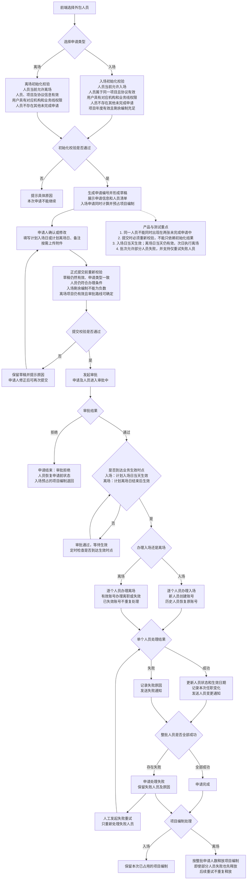

> 阅读建议：本流程同时涉及外包人员、项目、协议、业务线、年度计划、项目编制和审批等模块。建议先理解这些模块的概念，再阅读下面的完整流程图。这样更容易看懂人员为什么需要校验、项目编制如何变化，以及申请在审批、生效和失败重试之间如何流转。------------本文是该项目的核心。

# 1. 业务流程图（产品和测试版，不含数据库读写）

> 本图隐藏表名、字段、状态码和系统接口，仅呈现用户操作、业务校验、审批、生效、异常及重试流程，供产品和测试理解、评审及设计用例。



# 2. 完整流程图（含数据库读写）

> 图中“查”表示读取本地 HRMS 数据库，“写”包含新增、更新、删除和归档；流程中心、SSO、ACL、消息中心属于外部系统调用，不对应 HRMS 本地表。

```mermaid
%%{init: {"flowchart": {"htmlLabels": true, "wrappingWidth": 650}}}%%
flowchart TD
    START["前端选择外包人员"] --> TYPE{"申请类型"}
    TYPE -->|入场| ONBOARD_INIT["onboard-request"]
    TYPE -->|离场| OFFBOARD_INIT["offboard-request"]

    subgraph INIT_PHASE["一、初始化申请"]
        ONBOARD_INIT --> READ_STAFF
        OFFBOARD_INIT --> READ_STAFF
        READ_STAFF["查人员表：outsourced_staff<br/>条件：id IN staffIds<br/>staff_status：判断能否办理入场或离场<br/>project_id：校验同批项目并查询项目编制<br/>agreement_id：校验关联协议是否存在、入场协议是否生效<br/>id：作为 staffId 写入申请人员明细.account_id<br/>account_id：判断实际入场时创建新账号还是返聘历史账号"]
        READ_STAFF --> READ_VALIDATE["查校验数据<br/>项目：查 project_detail，project_code = project_id<br/>用途：确认项目存在，取得项目编制、业务线和项目年度<br/>协议：查 agreement，agreement_no = agreement_id<br/>用途：确认协议存在；入场时还要求协议已生效<br/>机构：查 t_abs_org_basic<br/>用途：比较人员机构和操作机构的管理路径，校验机构权限<br/>业务线：查 business_line，并调用 ACL 判断用户角色<br/>用途：确认当前用户有权操作项目所属业务线<br/>以上校验全部通过后，人员才能进入本次申请"]
        READ_VALIDATE --> READ_LOCK["查当前人员申请明细：outsourced_staff_onoffboard_application_record<br/>条件：account_id IN staffId、status = 0<br/>排除本次 requestId，防止人员重复申请<br/>核心目的：避免同一个人同时存在于两张未完成的申请中<br/>防止两条审批流程同时修改人员状态、账号和项目编制"]
        READ_LOCK --> RID["生成 requestId<br/>requestId = outsourced_staff_onoffboard_application.id"]
        RID --> APP_INIT["写申请主表：outsourced_staff_onoffboard_application<br/>首次申请：id = requestId、application_type = onboard / offboard、status = init<br/>继续编辑草稿：按 id = requestId 查主表并校验 status = init"]
        RID -.->|用途说明| RID_USAGE["requestId 是整张入场/离场申请的业务申请单编号<br/>1. 申请主表主键：outsourced_staff_onoffboard_application.id = requestId<br/>一张入场或离场申请对应一个 requestId<br/>2. 关联人员明细：outsourced_staff_onoffboard_application_record.application_batch_id = requestId<br/>用于查询这张申请包含哪些人员<br/>3. 关联项目编制明细：outsourced_staff_onoffboard_application_project.application_batch_id = requestId<br/>用于查询这张申请占用或释放的项目编制<br/>4. 关联附件：attachment.biz_id = requestId<br/>用于查询这张申请上传的附件<br/>5. 支持后续查询、继续编辑、正式提交、取消申请和失败重试<br/>前端通过 requestId 定位申请单<br/>6. 关联审批中心：businessNum = requestId、审批变量 request_id = requestId<br/>使流程中心的审批记录能够反查 HRMS 业务申请"]
        APP_INIT --> RECORD_INIT["写人员申请明细：outsourced_staff_onoffboard_application_record<br/>application_batch_id = requestId<br/>account_id = staffId<br/>project_id、agreement_id 取人员快照<br/>status = 0，error_msg = null<br/>继续编辑草稿时先删除该 requestId 的旧明细再重建"]
        RECORD_INIT --> PROJECT_TYPE{"是否入场申请"}
        PROJECT_TYPE -->|是| READ_QUOTA["查项目基础编制：project_detail<br/>project_code = project_id<br/>读取 project_quota、business_line_code、起止年度<br/>查 outsourced_staff_onoffboard_application_project<br/>按 project_id 汇总全部 request_num"]
        READ_QUOTA -.->|编制计算说明| QUOTA_EXPLAIN["project_detail.project_quota 是项目总编制<br/>outsourced_staff_onoffboard_application_project.request_num 是编制变动流水<br/>入场 1 人：request_num = -1，表示占用一个编制<br/>离场 1 人：request_num = +1，表示释放一个编制<br/>本次申请前可用编制 available_num = project_quota + 已有 request_num 汇总值<br/>本次申请后剩余编制 remain_num = available_num + 本次 request_num<br/>示例：总编制 10，历史入场 6 人、离场 1 人，已有汇总为 -5<br/>当前 available_num = 10 - 5 = 5<br/>本次再入场 2 人，request_num = -2，remain_num = 3<br/>如果 remain_num 小于 0，正式提交入场审批时阻止提交"]
        READ_QUOTA -.->|业务线说明| BUSINESS_LINE_NOTE["business_line_code 表示项目所属业务线<br/>用途一：校验当前用户是否有该业务线的操作权限<br/>用途二：提交审批时传给流程中心，确定对应业务线的审批人员<br/>用途三：写入项目申请明细，保存发起申请时的业务线快照<br/>示例：项目 P001 属于车险业务线<br/>当前用户有车险权限才能办理，提交后由车险业务线相关人员审批<br/>它不参与项目编制数量计算<br/>简单理解：负责判断谁能办理、谁来审批"]
        READ_QUOTA -.->|年度说明| PROJECT_YEAR_NOTE["start_year、end_year 表示项目允许覆盖的年度范围<br/>用途：在该范围内寻找启用计划年度，并写入项目申请明细.project_year<br/>1. 范围内存在启用年度：取启用年度<br/>示例：项目范围为 2025—2027，2026 是启用年度<br/>则本次申请 project_year = 2026，表示申请归属于 2026 计划年度<br/>2. 范围内存在年度记录但全部停用：当前代码使用 start_year 兜底<br/>3. 范围内没有任何年度计划：直接报错<br/>project_year 是年度归属标签，不会重置 project_quota<br/>简单理解：负责说明本次申请记在哪个计划年度"]
        READ_QUOTA --> WRITE_PROJECT_NEG["写项目申请明细：outsourced_staff_onoffboard_application_project<br/>application_batch_id = requestId<br/>request_num = -申请人数<br/>写 project_num、available_num、remain_num、project_year<br/>继续编辑草稿时先删除该 requestId 的旧项目明细再重建"]
        PROJECT_TYPE -->|否| NO_PROJECT_INIT["离场初始化不写项目申请明细"]
    end

    WRITE_PROJECT_NEG --> CONFIRM
    NO_PROJECT_INIT --> CONFIRM

    subgraph APPLY_PHASE["二、页面确认并正式提交"]
        CONFIRM["<span id='request-confirm-flowchart'></span>页面按 requestId 确认<br/>查主表：outsourced_staff_onoffboard_application<br/>查人员明细：outsourced_staff_onoffboard_application_record<br/>查项目明细：outsourced_staff_onoffboard_application_project<br/>并按明细 account_id 回查 outsourced_staff<br/>点击本框查看四张表的查询作用"]
        CONFIRM --> APPLY_TYPE{"正式提交类型"}
        APPLY_TYPE -->|入场| ONBOARD_APPLY["onboard-request-apply"]
        APPLY_TYPE -->|离场| OFFBOARD_APPLY["offboard-request-apply"]
        ONBOARD_APPLY --> APPLY_CHECK
        OFFBOARD_APPLY --> APPLY_CHECK
        APPLY_CHECK["提交前再查并校验<br/>主表：id = requestId、application_type 匹配、status = init<br/>人员明细：application_batch_id = requestId<br/>人员表：id IN 明细.account_id<br/>入场另查项目明细：remain_num >= 0<br/>离场另查项目：project_detail<br/>条件：project_code = 人员明细.project_id<br/>用途：确认项目仍存在，并取得 business_line_code<br/>用于生成审批变量、确定离场审批路由<br/>不参与离场编制校验"]
        APPLY_CHECK --> ATTACHMENT["有附件则写 attachment<br/>biz_id = requestId<br/>type = outsourced_staff"]
        ATTACHMENT --> FLOW["调用流程中心发起审批<br/>businessNum = requestId"]
        FLOW --> FID["流程中心返回 flowInstanceId"]
        FID --> WRITE_APPROVING["写申请主表：outsourced_staff_onoffboard_application<br/>application_date、remark<br/>flow_req_id = flow_instance_id = flowInstanceId<br/>status = approving"]
        WRITE_APPROVING --> WRITE_STAFF_APPROVING["写人员表：outsourced_staff<br/>入场 staff_status = -3（入场审批中）<br/>离场 staff_status = 2（离场审批中）"]
    end

    WRITE_STAFF_APPROVING --> FLOW_CENTER["审批中心处理"]
    FLOW_CENTER --> RESULT_MQ["审批中心发送结果 MQ"]

    subgraph RESULT_PHASE["三、审批结果回调"]
        RESULT_MQ --> LISTENER["StaffOnOffboardFlowListener"]
        LISTENER --> LOAD_RESULT["按 flowInstanceId 查申请主表<br/>outsourced_staff_onoffboard_application.flow_req_id = flowInstanceId<br/>再查人员明细：application_batch_id = requestId、status IN (0,2)<br/>再查人员表：outsourced_staff.id = 明细.account_id"]
        LOAD_RESULT --> RESULT{"审批结果"}

        RESULT -->|REJECT| REJECT_APP["写申请主表：outsourced_staff_onoffboard_application<br/>status = rejected"]
        REJECT_APP --> REJECT_RECORD["查并删除当前人员明细：outsourced_staff_onoffboard_application_record<br/>写历史人员明细：outsourced_staff_onoffboard_application_record_history"]
        REJECT_RECORD --> ROLLBACK_STAFF["写人员表：outsourced_staff<br/>入场拒绝：有 account_id 则 staff_status = 1，否则 = -1<br/>离场拒绝：staff_status = 0"]
        ROLLBACK_STAFF --> REJECT_PROJECT["查并删除当前项目明细：outsourced_staff_onoffboard_application_project<br/>写历史项目明细：outsourced_staff_onoffboard_application_project_history"]

        RESULT -->|FINISH / APPROVED| APPROVED_TYPE{"申请类型"}
        APPROVED_TYPE -->|入场| ON_DATE{"application_date ≤ 今天？"}
        APPROVED_TYPE -->|离场| OFF_DATE{"application_date ＜ 今天？"}

        ON_DATE -->|否| WAIT_ON["写申请主表：status = approved<br/>写 outsourced_staff.staff_status = -2<br/>审批通过待入场"]
        OFF_DATE -->|否| WAIT_OFF["写申请主表：status = approved<br/>写 outsourced_staff.staff_status = 3<br/>审批通过待离场"]
    end

    WAIT_ON --> SCHEDULER
    WAIT_OFF --> SCHEDULER

    subgraph SCHEDULE_PHASE["四、到期扫描"]
        SCHEDULER["UPDATE_STAFF_STATUS_HANDLER 定时任务"]
        SCHEDULER --> DUE["查申请主表：outsourced_staff_onoffboard_application<br/>status = approved<br/>入场：application_type = onboard 且 application_date ≤ 当前时间<br/>离场：application_type = offboard 且 application_date ＜ 当前时间"]
        DUE --> REENTER["取 flow_instance_id<br/>重新进入 confirmOnOffboardRequest(..., approved)<br/>复用审批通过执行链"]
    end

    ON_DATE -->|是| EXEC_ON
    OFF_DATE -->|是| EXEC_OFF
    REENTER --> LOAD_RESULT

    subgraph EFFECT_PHASE["五、实际入场或离场"]
        EXEC_ON["外部账号处理<br/>outsourced_staff.account_id 有值：调用 SSO 返聘<br/>无值：调用 SSO 创建账号"]
        EXEC_OFF["外部账号离职处理<br/>按 outsourced_staff.account_id 查询 SSO 账号状态<br/>账号已离职或已失效：跳过，不再重复调用<br/>账号仍然有效：调用 SSO 账号失效接口<br/>将账号置为离职/失效状态<br/>查询账号状态异常：仍尝试调用账号失效接口"]
        EXEC_ON --> EXEC_RESULT{"单个人员处理结果"}
        EXEC_OFF --> EXEC_RESULT

        EXEC_RESULT -->|成功| RECORD_SUCCESS["写人员申请明细：outsourced_staff_onoffboard_application_record<br/>status = 1，error_msg = null"]
        RECORD_SUCCESS --> STAFF_SUCCESS{"入场还是离场"}
        STAFF_SUCCESS -->|入场| STAFF_ON["写人员表：outsourced_staff<br/>account_id = SSO 返回值（新建账号时）<br/>onboard_date = application_date<br/>offboard_date = 9999-12-31<br/>staff_status = 0"]
        STAFF_SUCCESS -->|离场| STAFF_OFF["写人员表：outsourced_staff<br/>history_contact_number = 原手机号<br/>contact_number = 随机 ID<br/>offboard_date = application_date<br/>staff_status = 1"]
        STAFF_ON --> MOVEMENT_ON["写任职快照表：outsourced_staff_movement<br/>新增入场快照，event_type = AGREEMENT<br/>点击本框查看 AGREEMENT 的用途说明"]
        STAFF_OFF --> MOVEMENT_OFF["查任职快照表：outsourced_staff_movement<br/>按 account_id、agreement_id、event_type = AGREEMENT 查最近一条并更新结束日<br/>再新增离场快照"]
        MOVEMENT_ON --> CHANGE_MQ["发送外包人员变更 MQ"]
        MOVEMENT_OFF --> CHANGE_MQ
        CHANGE_MQ --> BATCH_RESULT{"整批人员是否全部成功"}

        EXEC_RESULT -->|失败| RECORD_FAIL["写人员申请明细：outsourced_staff_onoffboard_application_record<br/>status = 2<br/>error_msg = 失败原因"]
        RECORD_FAIL --> NOTICE["调用消息中心发送钉钉失败通知<br/>本地不新增业务表"]
        NOTICE --> BATCH_RESULT

        BATCH_RESULT -->|全部成功| APP_SUCCESS["写申请主表：outsourced_staff_onoffboard_application<br/>status = success"]
        BATCH_RESULT -->|存在失败| APP_FAIL["写申请主表：outsourced_staff_onoffboard_application<br/>status = fail"]
        APP_SUCCESS --> PROJECT_EFFECT{"项目编制处理"}
        APP_FAIL --> PROJECT_EFFECT
        PROJECT_EFFECT -->|入场| PROJECT_KEEP["不再写项目明细<br/>继续保留初始化时 request_num = -申请人数 的记录"]
        PROJECT_EFFECT -->|离场| PROJECT_RELEASE["查 project_detail<br/>查 outsourced_staff_onoffboard_application_project 并按 project_id 汇总 request_num<br/>写 outsourced_staff_onoffboard_application_project<br/>request_num = +整批申请人数<br/>即使部分人员失败也会先释放整批编制"]
    end

    APP_FAIL --> RETRY

    subgraph RETRY_PHASE["六、失败重试"]
        RETRY["retry-on-offboard-request"]
        RETRY --> RETRY_READ["查申请主表：id = requestId、status = fail<br/>查人员明细：application_batch_id = requestId、status IN (0,2)<br/>查人员表：outsourced_staff.id = 明细.account_id"]
        RETRY_READ --> RETRY_TYPE{"重试类型"}
        RETRY_TYPE -->|入场| RETRY_ON["重试 SSO 创建账号/返聘<br/>成功：写明细 status = 1、写 outsourced_staff、写 outsourced_staff_movement、发送人员变更 MQ<br/>失败：写明细 status = 2、error_msg"]
        RETRY_TYPE -->|离场| RETRY_OFF["重试 SSO 账号失效<br/>成功：写明细 status = 1、写 outsourced_staff、写 outsourced_staff_movement<br/>不重复写 +申请人数 的项目明细<br/>失败：写明细 status = 2、error_msg"]
        RETRY_ON --> RETRY_RESULT["写申请主表：全部成功 status = success<br/>仍有失败 status = fail"]
        RETRY_OFF --> RETRY_RESULT
    end

    click CONFIRM href "#request-confirm-query-explanation" "点击查看四张表的查询作用"
    click MOVEMENT_ON href "#agreement-movement-explanation" "点击查看 event_type = AGREEMENT 的用途说明"
```




## 2.1 查校验数据的用途
项目：project_detail，project_code = project_id  
协议：agreement，agreement_no = agreement_id  
机构：t_abs_org_basic  
业务线：business_line；角色权限另查 ACL 外部系统 

这些数据主要用于校验“当前人员是否有资格发起这次申请”，不是单纯为了页面展示。

|查询对象|查出来的用途|
|---|---|
|`project_detail`|根据人员的 `project_id` 确认项目存在；取得项目额度、业务线和项目年度；入场时计算申请后剩余编制|
|`agreement`|根据 `agreement_id` 确认人员关联的协议存在；入场申请还要求协议状态为已生效；协议编号同时写入人员申请明细作为快照|
|`t_abs_org_basic`|查询人员所属机构和本次操作机构的管理路径，判断当前用户是否有权操作该机构下的人员|
|`business_line`|取得项目所属业务线信息，并与当前用户可管理的业务线进行比较|
|ACL 外部系统|判断当前账号是否属于 HR 等特殊角色；如果不是，则限制其只能操作有权限的业务线|

整体校验逻辑可以理解为：

```
人员关联的项目是否存在？
→ 人员关联的协议是否有效？
→ 当前操作人是否有人员所属机构的权限？
→ 当前操作人是否有项目所属业务线的权限？
→ 全部通过后，人员才能进入本次入场/离场申请
```

其中：

- 项目和协议属于“业务数据有效性校验”。
- 机构、业务线和 ACL 属于“操作权限校验”。
- `project_detail.project_quota` 还用于入场编制计算，并非只做存在性校验。


## 2.2 为什么要防止人员重复申请

查询条件实际表示：

```
account_id IN (本次选择的 staffId 集合)
AND application_batch_id != 本次 requestId
AND status = 0
```

各条件含义：

- `account_id IN staffIds`：查本次选中的这些人员。这里的 `account_id` 实际保存的是 `outsourced_staff.id`，也就是 `staffId`。
- `status = 0`：该人员申请明细仍处于“待处理”，还没有实际入场或离场完成。
- `application_batch_id != 本次 requestId`：排除当前正在编辑的这张申请，避免把自己误判为重复申请。

例如：

```
人员：张三，staffId = S001
已有申请：requestId = R001，status = 0
当前新申请：requestId = R002
```

系统查询到张三已经在 `R001` 中待处理，就不会再把他加入 `R002`，并提示：

```
已在入场申请流程中
```

如果当前只是在继续编辑 `R001`，因为查询排除了本次 `requestId = R001`，所以不会误报重复。

核心目的就是：**避免同一个人同时存在于两张未完成的申请中，防止两条审批流程同时修改人员状态、账号和项目编制。**


## 2.3 requestId 的用途

`requestId` 是 HRMS 为这一次入场或离场申请生成的**业务申请单编号**，用于把整张申请涉及的数据关联起来。

它的主要用途有：

1. 作为申请主表主键

```
outsourced_staff_onoffboard_application.id = requestId
```

一张入场或离场申请对应一个 `requestId`。

2. 关联人员申请明细

```
outsourced_staff_onoffboard_application_record.application_batch_id
= requestId
```

通过它可以知道这张申请包含哪些人员。

3. 关联项目编制明细

```
outsourced_staff_onoffboard_application_project.application_batch_id
= requestId
```

通过它可以知道这张申请占用或释放了多少项目编制。

4. 关联附件

```
attachment.biz_id = requestId
```

用于查询这张申请上传的附件。

5. 支持后续操作

前端后续查询、继续编辑、正式提交、取消申请和失败重试，都通过 `requestId` 定位申请单。

6. 关联审批中心

正式提交时，将它传给流程中心：

```
businessNum = requestId
审批变量 request_id = requestId
```

这样流程中心的审批记录可以反查 HRMS 业务申请。

例如：

```
requestId = R001

申请主表
└── id = R001

人员明细
├── 张三，application_batch_id = R001
└── 李四，application_batch_id = R001

项目编制明细
└── application_batch_id = R001，request_num = -2

附件
└── biz_id = R001
```

简单理解：**`requestId` 就是整张入场或离场申请的“订单号”，负责串联申请主表、人员明细、项目编制、附件和审批流程。**

它和 `flowInstanceId` 不一样：

```
requestId      = HRMS 业务申请编号，初始化申请时生成
flowInstanceId = 流程中心审批实例编号，正式提交审批后生成
```


## 2.4 project_quota 的用途
这一步是在计算：**项目总编制是多少、已经占用了多少、本次入场后还剩多少。**

系统没有直接修改 `project_detail.project_quota`，而是使用项目申请明细表中的正负数流水计算编制。

### 2.4.1 查询项目总编制

```
project_detail.project_code = 人员的 project_id
```

读取：

- `project_quota`：项目总编制。
- `business_line_code`：所属业务线，用于权限校验和确定审批业务线。
- 起止年度：确定本次申请对应的项目年度。

例如：

```
project_code = P001
project_quota = 10
```

表示项目 `P001` 总共允许配置 10 人。

### 2.4.2 汇总项目已有的编制变动

查询：

```
outsourced_staff_onoffboard_application_project
WHERE project_id = P001
```

然后汇总：

```
SUM(request_num)
```

`request_num` 使用正负数表示编制变化：

|场景|`request_num`|含义|
|---|---|---|
|入场 1 人|`-1`|占用一个编制|
|入场 3 人|`-3`|占用三个编制|
|离场 1 人|`+1`|释放一个编制|
|离场 2 人|`+2`|释放两个编制|

### 2.4.3 计算本次申请前后的剩余编制

计算方式：

```
本次申请前可用编制
= project_quota + 已有 request_num 汇总值

本次申请后剩余编制
= 本次申请前可用编制 + 本次 request_num
```

例如项目总编制为 10 人：

```
历史入场 6 人：request_num = -6
历史离场 1 人：request_num = +1

已有 request_num 汇总
= -6 + 1
= -5
```

当前可用编制：

```
available_num
= 10 + (-5)
= 5
```

现在又申请入场 2 人：

```
本次 request_num = -2

remain_num
= 5 + (-2)
= 3
```

最终写入本次项目申请明细：

```
project_num  = 10   项目总编制
available_num = 5   本次申请前可用编制
request_num  = -2   本次占用两个编制
remain_num   = 3    本次申请后剩余编制
```

核心目的就是：**把 `project_detail.project_quota` 作为总额度，通过汇总项目申请明细的 `request_num`，计算本次入场是否会超出项目编制。**

如果计算结果：

```
remain_num < 0
```

正式提交入场审批时就会报错：

```
本次申请后剩余编制小于 0
```


## 2.5 business_line_code 和项目起止年度的用途
可以把 `business_line_code` 理解成：**项目属于哪个业务条线的标签**。

比如公司可能有：

```
车险业务线
非车险业务线
农险业务线
健康险业务线
```

某个外包项目属于“车险业务线”，那么项目表中可能保存：

```
project_id = P001
business_line_code = CAR
```

办理人员入场时，系统主要用它做两件事。

### 2.5.1 判断当前用户是否有权办理

例如：

```
项目 P001 属于车险业务线
当前用户只能管理非车险业务线
```

那么系统会阻止当前用户为这个项目办理人员入场。

如果当前用户拥有车险业务线权限，才能继续申请。

### 2.5.2 决定申请由谁审批

正式提交后，系统把项目的 `business_line_code` 传给流程中心。

流程中心根据业务线找到对应的审批人：

```
车险项目
→ 走车险业务线审批人员

农险项目
→ 走农险业务线审批人员
```

所以它并不负责计算编制人数，而是负责：

```
business_line_code
├── 判断当前用户能不能操作这个项目
└── 告诉流程中心应该由哪条业务线的人审批
```

一句话理解：**`business_line_code` 就像项目的“所属部门标签”，既用来限制操作权限，也用来找到正确的审批人。**


关键点是：**“启用年度”和 `start_year` 不是两个同等优先级的选择。启用年度是首选，`start_year` 只是当前代码的兜底值。**

### 2.5.3 什么是启用年度

`plan_year` 表保存公司已经创建的年度计划：

```
2025，status = 0，停用
2026，status = 1，启用
2027，status = 0，停用
```

`status = 1` 表示当前公司正在使用、正在核算编制的计划年度。

可以把它理解成：

```
启用年度 = 当前打开使用的年度账本
```

系统设计上通常只有一个启用年度。启用新年度时，会先把原来的启用年度改成停用。

### 2.5.4 正常情况下为什么取启用年度

假设项目有效期是：

```
start_year = 2025
end_year   = 2027
```

当前启用年度是 2026：

```
2025—2027 包含 2026
→ 本次人员申请归入 2026 年度
→ project_year = 2026
```

意思是：

**虽然项目跨了三年，但这次入场申请发生在当前启用的 2026 年度，所以给申请标记 2026。**

### 2.5.5 为什么又能取 `start_year`

假设年度表是：

```
2025，status = 0
2026，status = 0
2027，status = 0
```

项目范围内有年度计划，但是没有任何年度处于启用状态。

当前代码没有报错，而是兜底：

```
project_year = start_year = 2025
```

这里并不表示 2025 已经启用，也不表示 2025 一定是正确的业务年度。

它只是表示：

```
没有找到启用年度
→ 为了保证 project_year 有值
→ 暂时使用项目开始年度
```

### 2.5.6 三种情况对比

|年度表情况|最终取值|原因|
|---|---|---|
|2026 是启用年度，并且位于项目起止范围内|`2026`|正常归入当前启用年度|
|项5—2027 年度都存在，但全部停用|`2025`|没有启用年度，代码用 `start_year` 兜底|
|2025—2027 一个年度计划都没有创建|报错|项目范围内没有任何年度计划|

### 2.5.7 这个兜底合理吗

从代码上看，它能保证程序继续执行；但从业务语义上看，有一点不严谨：

```
没有启用年度
却把申请记录到已经停用的 start_year
```

因此它不是“启用年度和开始年度都可以随便选”，而是：

```
优先：项目范围内的启用年度
兜底：项目 start_year
完全没有年度计划：报错
```

如果业务要求“人员申请必须属于当前启用年度”，更严格的处理应该是：

```
项目起止范围内没有启用年度
→ 直接报错
→ 提示先启用计划年度
```

而不是回退到 `start_year`。

另外，当前入离场流程计算剩余编制时只按 `project_id` 汇总，没有按 `project_year` 分年度计算。因此这里的 `project_year` 更像一个**年度归属标签或快照字段**，不会因为取了 2025 或 2026 就重新生成一套项目编制。


## [2.6 申请确认页为什么要查四张表](#request-confirm-flowchart)

```
这是什么申请？
申请里有哪些人？
人员详细信息是什么？
本次申请占用多少编制？
申请后还剩多少编制？
```

所以需要查询多张表。

### 2.6.1 四张表分别负责什么

|查询表|回答的问题|
|---|---|
|申请主表|这是一张什么申请？|
|人员申请明细|这张申请选了哪些人？|
|人员表|这些人的详细资料是什么？|
|项目申请明细|这次申请占用多少编制？|

#### 1. 申请主表

```
outsourced_staff_onoffboard_application
```

根据 `requestId` 查询：

```
application_type：入场还是离场
status：草稿、审批中、成功还是失败
application_date：计划入场或离场日期
remark：申请备注
flow_instance_id：对应哪个审批流程
```

它回答的是：

```
这是一张什么申请，目前进行到哪一步？
```

#### 2. 人员申请明细

```
outsourced_staff_onoffboard_application_record
```

查询条件：

```
application_batch_id = requestId
```

它保存：

```
这张申请包含哪些 staffId
人员申请处理成功还是失败
失败原因是什么
申请时所属的项目和协议
```

它回答的是：

```
这张申请选了哪些人？
```

只查询 `outsourced_staff` 不够，因为人员表里没有 `requestId`，无法判断某个人属于哪张申请。

#### 3. 人员表

```
outsourced_staff
```

人员申请明细里主要只有 `staffId`，没有完整的人员资料，所以还要回查人员表，取得：

```
姓名
手机号
人员状态
所属机构
所属项目
所属协议
工作地点
其他人员信息
```

两张表的分工是：

```
申请人员明细
→ 确定这张申请选了哪些 staffId

人员表
→ 根据 staffId 查询这些人的完整资料
```

#### 4. 项目申请明细

```
outsourced_staff_onoffboard_application_project
```

它保存这张申请生成时的编制快照：

```
project_num：项目总编制
available_num：本次申请前可用编制
request_num：本次申请人数
remain_num：本次申请后剩余编制
project_year：归属计划年度
business_line_code：所属业务线
```

它回答的是：

```
这次申请会占用或释放多少项目编制？
```

仅查询人员名单，只能知道申请了几个人，不能直接还原发起申请时的总编制和剩余编制。

### 2.6.2 举个例子

```
requestId = R001
申请类型 = 入场
```

申请主表告诉系统：

```
R001 是一张入场申请
当前状态是 init
```

人员申请明细告诉系统：

```
R001 包含 S001、S002 两个人
```

人员表告诉系统：

```
S001 = 张三
S002 = 李四
```

项目申请明细告诉系统：

```
项目总编制 = 10
申请前可用 = 5
本次申请 = 2
申请后剩余 = 3
```

确认页最终展示的是：

```
入场申请 R001
├── 人员：张三、李四
├── 本次申请：2 人
├── 项目总编制：10 人
├── 申请前可用：5 人
└── 申请后剩余：3 人
```

### 2.6.3 最简单的理解

```
申请主表
→ 查“什么申请”

人员申请明细
→ 查“申请选了谁”

人员表
→ 查“这些人是谁”

项目申请明细
→ 查“用了多少编制”
```

因此，不是所有页面都必须查这么多表。如果页面只展示人员名单，确实只需要：

```
人员申请明细 → 人员表
```

当前流程图把它们放在一起，是因为描述的是完整的申请确认页面，而不只是人员名单查询。

## 2.7 为什么入场是 application_date ≤ 今天，离场是 application_date ＜ 今天

因为当前代码把两个日期理解成不同的边界：

```text
入场日期 = 第一天
离场日期 = 最后一天
```

### 2.7.1 入场：application_date ≤ 今天

到入场日期当天，人员就应该生效。

例如：

```text
入场日期：9 月 10 日
今天：9 月 10 日
```

当天就创建或返聘账号，并把人员状态修改为“已入场”。

### 2.7.2 离场：application_date ＜ 今天

离场日期被当作人员的“最后有效日”。离场日期当天人员仍然有效，等这一天结束、日期过去后，才真正执行离场。

例如：

```text
离场日期：9 月 10 日
9 月 10 日：仍是在场状态
9 月 11 日：离场日期已经小于今天，执行账号失效并改为“已离场”
```

因此可以简单理解为：

```text
入场日期：从这一天开始生效
离场日期：到这一天结束为止
```

这不是技术上必须如此，而是当前代码采用的业务口径。如果产品定义的“离场日期”表示“当天一到就离场”，判断条件就应该改成 `application_date ≤ 今天`；但按照当前实现，它表示最后工作日或最后有效日。

<a id="agreement-movement-explanation"></a>

## 2.8 为什么入场任职快照的 event_type = AGREEMENT

这里的 `AGREEMENT` 不是说“本次入场发生了协议变更”，而是表示：**这条任职快照记录的是人员使用某份协议的任职区间。**

人员入场后，系统会形成一段关系：

```text
某个人
在某个项目下
使用某份协议
从入场日期开始任职
```

因此，入场时会向 `outsourced_staff_movement` 写入：

```text
event_type = AGREEMENT
agreement_id = 当前协议编号
agreement_start_date = 入场日期
agreement_end_date = 离场日期，入场时通常为 9999-12-31
```

例如：

```text
人员：张三
协议：A001
入场日期：2026-09-10
```

写入的任职快照相当于：

```text
张三使用协议 A001
任职开始：2026-09-10
任职结束：9999-12-31
event_type：AGREEMENT
```

以后张三离场时，系统会按照以下条件找到这条协议任职记录：

```text
account_id
+ agreement_id
+ event_type = AGREEMENT
```

找到记录后，再把 `agreement_end_date` 修改为实际离场日期。

这类记录还有一个重要用途：后续按协议结算或查询人员时，可以根据以下信息判断某个人在结算周期内是否使用过这份协议：

```text
agreement_id
+ event_type = AGREEMENT
+ agreement_start_date / agreement_end_date
```

所以它的实际含义更接近：

```text
AGREEMENT = 协议任职区间记录
```

而不是：

```text
AGREEMENT = 本次发生了协议变更
```

流程图中的这一步可以理解为：

```text
写任职快照表：outsourced_staff_movement

新增人员本次协议任职区间：
event_type = AGREEMENT
agreement_id = 当前协议
agreement_start_date = 入场日期
agreement_end_date = 默认离场日期

用途：
后续按协议查询任职历史
离场时找到并结束当前协议任职区间
```

需要注意：实体注释虽然定义了 `DEFAULT / AGREEMENT / PROJECT`，但当前代码中多个场景都写成了 `AGREEMENT`，包括部分项目续延和终止处理。因此，当前实现中的 `AGREEMENT` 已经带有“协议维度任职记录”的泛化含义，并不完全是严格的事件来源。

## 2.9 为什么部分人员离场失败仍释放整批编制

核心原因是：**当前代码按“整张离场申请”释放编制，而不是按“实际离场成功人数”释放编制。**

执行过程是：

```text
逐个人员办理离场
├── 成功：人员明细 status = 1
└── 失败：人员明细 status = 2

全部人员处理结束
→ 不判断是否全部成功
→ 仍然调用项目编制处理
→ 按申请人员明细总数写入 request_num
```

代码统计的是申请内全部人员：

```text
按 project_id 对所有申请人员明细计数
```

离场时：

```text
request_num = +申请人员总数
```

它没有先过滤：

```text
人员明细.status = 1
```

例如，一张离场申请有 3 人：

```text
张三：离场成功
李四：离场成功
王五：SSO 账号失效失败
```

当前代码仍然写入：

```text
request_num = +3
```

而不是：

```text
request_num = +2
```

可能的设计意图是：

- 离场申请已经审批通过并到达生效日，业务上认为整批人员都应退出项目；
- 单个人员失败通常被当成 SSO、消息或数据处理异常，不改变其应该离场的业务决定；
- 编制只在首次离场执行时统一释放一次；
- 后续失败重试不会再次增加 `request_num`，避免重复释放编制。

因此，目前的口径是：

```text
编制释放依据 = 已生效的离场申请人数
不是 = 技术处理成功人数
```

但这里存在一个风险：

```text
人员实际离场失败
但项目编制已经释放
```

如果失败人员一直没有重试成功，就会出现：

```text
人员仍未完成离场
项目却已经可以使用这个空出的编制
```

所以，这只能说明“当前代码为什么这么执行”，不能证明业务规则一定合理。如果实际要求是“人员真正离场成功后才能释放编制”，当前实现需要调整为：

```text
首次处理：只释放 status = 1 的成功人数
失败重试成功：再释放本次新增成功人数
同时增加防重复释放控制
```

流程图中的这一步可以理解为：

```text
当前实现：按整张离场申请释放项目编制

查 project_detail
查 outsourced_staff_onoffboard_application_project
并按 project_id 汇总 request_num

写项目申请明细：
request_num = +申请人员总数

不按人员处理结果过滤
部分人员失败时仍释放整批编制
失败重试不再重复释放

注意：
如果业务要求实际离场成功后才释放编制，
当前实现存在提前释放风险，需要进一步确认
```
