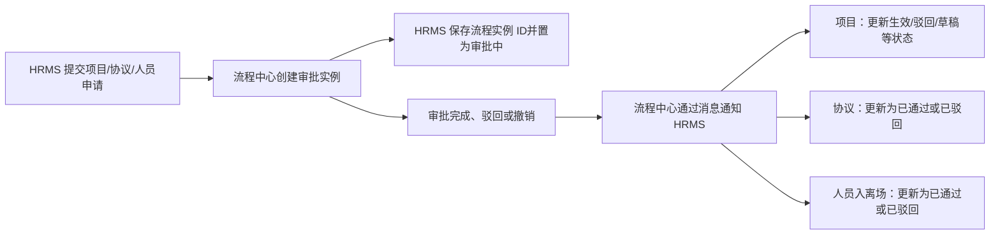

# 流程中心模块说明

## 1. 模块有什么用

流程中心是 HRMS 对接的外部审批服务。可以把它理解成“审批事务处理台”：HRMS 把需要审批的业务交给它处理；审批结束后，流程中心再通知 HRMS 更新业务状态。

它不保存项目、协议或人员本身的业务规则，HRMS 才是这些数据的归属方。

## 2. HRMS 如何使用流程中心

HRMS 在下列业务提交时发起流程，并保存返回的“流程实例 ID”，以便后续回调准确找到对应业务记录：

- 项目：新建、变更、续延、手动终止等项目操作；
- 协议：新建、变更、续延、手动恢复、手动终止；
- 外包人员：入场、离场申请。

发起流程时，HRMS 会传入申请人、流程编码、流程名称、业务编号，以及组织层级、业务线等审批变量。流程中心据此匹配审批配置；具体审批人如何计算、流程节点如何编排，当前 HRMS 代码无法确认。

## 3. 审批结果如何影响业务

| 业务 | 审批完成 | 审批驳回 | 审批撤销 |
| --- | --- | --- | --- |
| 项目 | 根据操作类型生效、续延或终止；部分变更会归档原项目记录 | 标记为已驳回 | 回到草稿状态 |
| 协议 | 标记为已通过 | 标记为已驳回 | 当前监听代码未见专门处理 |
| 人员入场/离场 | 申请标记为已通过 | 申请标记为已驳回 | 当前监听代码未见专门处理 |

项目在“审批中”状态下，还会从流程中心读取流程变量中的计划剩余人数、已入场人数和原计划人数，用于展示审批期间的项目数据。

## 4. 简单例子

假设业务人员提交“某业务线的新项目”：

1. HRMS 先创建项目的审批中记录，并把项目编号、业务线、计划人数等信息交给流程中心。
2. 流程中心返回流程实例 ID，HRMS 将它保存到该项目记录。
3. 审批完成后，流程中心发送一条带有该实例 ID 和完成事件的消息。
4. HRMS 依据实例 ID 找到项目，将项目变为已通过；如果是终止申请，还会按终止日期决定立即终止还是保留至到期。

这样，审批过程由流程中心统一处理，项目最终生效及后续人员解绑等业务后果仍由 HRMS 执行。

## 5. 维护注意事项

- 流程编码、消息标签和 HRMS 监听配置必须一致，否则会出现“已审批但 HRMS 状态未更新”。
- 流程实例 ID 是审批结果与业务记录的关键关联字段，不能丢失或错误覆盖。
- 项目、协议监听器捕获异常后仍确认消费消息；若落库失败，消息不会自动重试，需通过日志和人工补偿排查。
- 当前代码只明确处理完成、驳回，以及项目的撤销事件；其他事件是否需要业务动作，应与流程中心配置共同确认。
- 账号、组织、业务线被作为审批变量传递给流程中心，但这不等同于 HRMS 已在本模块中完整实现审批权限规则。

## 6. 总结

流程中心负责“谁来审批、审批进行到哪里”；HRMS 负责“审批结果到底让项目、协议和人员数据发生什么变化”。两者通过流程实例 ID 和消息回调协作，任何一端的编码、配置或消息处理异常，都会直接影响业务状态同步。
