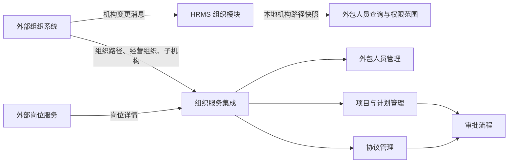

## 1. 先了解五个概念

“机构”就是公司内部为了管理业务而划分出来的单位，不是建筑物或办事地点。可以把它理解为公司这棵大树上的一个分支：总公司管分公司，分公司管中心支公司，中心支公司下面还会有部门。

第一次看这个模块时，先记住下面这组关系：

> 总公司 → 分公司 → 中心支公司 → 部门

- **机构**：公司内部的一个管理单位，例如总公司、分公司、中心支公司、支公司或部门。它说明业务由哪个单位负责。
- **组织**：系统把公司里的各个机构，按照“谁管理谁”的关系连起来后形成的整体。例如，总公司管理分公司、分公司管理中心支公司，这套上下级关系就是组织。
- **组织编码**：机构的唯一标识，可以理解为机构的身份证号。机构名称可能变化，系统用编码准确识别它。
- **经营组织**：实际承担经营和管理责任的机构，例如总公司、分公司或中心支公司。部门通常不是经营组织，它更像经营组织下面的具体办事单位。系统以外部组织主数据的类型为准：代码只把 `branchOrgType = 0` 的机构按经营组织处理。
- **归属经营组织**：系统给人员、项目、计划或协议标注的“由哪家分公司或中心支公司负责”。它不是人员每天工作的具体部门。比如小明在“南京中心支公司理赔部”工作，系统会把小明归到“南京中心支公司”名下；以后统计这个中心支公司有多少外包人员时，就会把小明算进去。

例如，外包人员小明在“南京中心支公司理赔部”工作：理赔部是他的**工作部门**，南京中心支公司是他的**归属经营组织**。前者说明“人在哪里做事”，后者说明“这项业务由哪一级公司机构负责”。HRMS 以归属经营组织作为人员统计、计划额度、协议归属和部分数据查询范围的组织依据。

## 2. 模块有什么用

可以把组织模块理解为 HRMS 使用的“公司机构地图”。它回答的不是“某个人属于哪个部门”，而是“这个部门属于哪一家分公司、这家分公司又归谁管理”。这张地图让系统知道公司内部各个机构之间的上下级关系。

例如，公司有总公司、某省分公司、某市中心支公司和一个具体部门。一名外包人员实际在这个部门工作，但人员、项目、计划和协议在系统中往往需要按其所属的经营机构统计和管理。组织模块就帮助系统沿着机构关系向上找到合适的经营机构，避免把部门、分公司和中心支公司混在一起使用。

组织模块本身不提供“新建分公司、调整部门归属”这类功能。这些组织主数据由外部组织系统维护；HRMS 负责接收并使用它们。它主要做三件事：

- 记录机构之间的上下级关系，方便查出“某机构及其下级机构”。
- 为人员、项目、计划和协议找到归属机构，并补充可展示的机构名称。
- 根据登录账号所在的机构，帮助各业务模块圈定可查询的数据范围。

## 3. 核心业务逻辑

### 3.1 组织主数据从哪里来

HRMS 通过 SOFA MQ 订阅外部组织系统的机构变更消息。消息必须包含机构编码、名称、行政管理维度的父机构编码和完整路径；校验通过后，系统把这四项内容写入本地 `t_abs_org_basic` 表。

本地写入采用“按机构编码替换”的方式：同一个机构再次收到变更消息时，会以最新名称、父级和路径覆盖旧快照，而不是新增一条重复记录。

本地快照主要服务于按路径查询“本机构及全部下级机构”。机构的详细资料、经营组织判断、机构路径与岗位信息，仍主要实时调用外部组织服务和岗位服务获取。

### 3.2 如何识别归属经营组织

这一段想说明的是：系统知道人员在**哪个部门工作**后，还要继续确认这个部门属于**哪家分公司或中心支公司**。因为部门通常不是经营组织，系统不能直接把部门当作人员的归属单位。

例如，公司内部关系如下：

> 总公司 → 江苏分公司 → 南京中心支公司 → 理赔部

小明在“理赔部”工作。系统从理赔部开始往上查：理赔部不是经营组织，继续往上是南京中心支公司；南京中心支公司是经营组织，于是系统记录：

- 小明的工作部门：理赔部
- 小明的归属经营组织：南京中心支公司

这里的“组织路径”只是指这条从部门一路往上的关系：`理赔部 → 南京中心支公司 → 江苏分公司 → 总公司`。“找最近的经营组织”就是从小明所在的理赔部开始，往上找到的第一家分公司或中心支公司；在这个例子中就是南京中心支公司。

这样做的结果是：系统既保留小明具体在哪个部门工作，也能把小明计入南京中心支公司的人员、计划或协议相关业务中。若江苏分公司查询人员时选择“包含下级机构”，小明也会出现在该分公司的查询结果中。

### 3.3 组织范围与数据查询

这一节涉及三个容易混淆的问题，可以先用一个例子理解：

> 总公司 → 江苏分公司 → 南京中心支公司 → 理赔部

小明在南京中心支公司的理赔部工作，所以小明的**归属经营组织**是“南京中心支公司”。这只是给小明贴上的归属标签，说明小明算在哪家机构名下；它不代表谁都能查看小明。

假设李经理的账号权限组织是“江苏分公司”。他进入外包人员列表时，系统会先用这个权限组织确定李经理可以看的大范围，再根据他有没有选择具体机构、有没有勾选“包含下级机构”决定实际显示什么：

| 李经理的操作                | 实际查询范围                          | 能否看到小明                |
| --------------------- | ------------------------------- | --------------------- |
| 不指定具体机构               | 江苏分公司及其下级机构                     | 能看到，因为南京中心支公司在江苏分公司下面 |
| 选择“江苏分公司”，不勾选“包含下级机构” | 只查江苏分公司本级                       | 看不到，因为小明归属南京中心支公司     |
| 选择“江苏分公司”，勾选“包含下级机构”  | 江苏分公司及其下级机构                     | 能看到                   |
| 选择“南京中心支公司”，不勾选“包含下级机构” | 只查归属南京中心支公司的人员，例如小明 | 能看到 |
| 选择“南京中心支公司”，勾选“包含下级机构” | 除了小明，还查南京中心支公司下面各机构的人员；如果没有下级机构，结果与上一行相同 | 能看到 |

其中：

- **归属经营组织**：数据算在哪家机构名下。例如小明归属南京中心支公司。
- **权限组织**：系统给登录账号划定的“最大查看范围从哪里开始”。例如李经理负责江苏分公司，账号的权限组织是江苏分公司，因此他可以按规则查看江苏分公司及其下级机构的数据；如果张经理的权限组织是南京中心支公司，他通常不能因为自己在江苏分公司下面，就查看江苏分公司其他中心支公司的数据。权限组织说的是“这个账号有权看哪里”，不是“人员或项目归属哪里”。
- **查询范围**：本次页面实际查哪些机构，由权限组织、用户选择的机构和“包含下级机构”共同决定。

> **待确认：权限组织从哪里来。** 外包人员查询请求要求前端传入权限组织编码，HRMS 再据此查询该机构及下级机构。当前代码未显示该编码是在页面上由用户选择，还是由账号/ACL 权限系统自动带出；后续需要查看前端实现或权限系统配置确认。

因此，归属经营组织是“这条数据属于谁”，权限组织是“这个人最多能看多大范围”，查询范围是“这一次实际查哪里”。三者不是同一个概念。

不同模块计算查询范围的方式并不完全一样：

| 查询场景 | 范围怎么确定 | 例子 |
| --- | --- | --- |
| 外包人员查询 | 根据权限组织、用户选中的机构和“包含下级机构”开关，从本地组织快照查下级 | 李经理权限在江苏分公司，选择“包含下级机构”后，可以查到归属南京中心支公司的人，例如小明 |
| 项目查询 | 部分场景先取当前登录账号所属经营组织，再向下取下级机构范围 | 账号所属江苏分公司时，查询范围可包含该分公司下的南京中心支公司 |
| 协议查询 | 按账号权限组织所在层级，使用单独的可见范围规则 | 同样是江苏分公司账号，协议页面的范围要按下表计算，不能直接套用外包人员查询规则 |

协议查询可以继续用同一组机构理解：

> 总公司 → 江苏分公司 → 南京中心支公司

| 账号的权限组织 | 协议查询可见范围 | 例子 |
| --- | --- | --- |
| 总公司 | 不额外限制组织范围 | 可以查询各分公司和中心支公司的协议 |
| 江苏分公司 | 江苏分公司本身，以及它直接下属的中心支公司 | 可以查询江苏分公司和南京中心支公司的协议 |
| 南京中心支公司 | 南京中心支公司本身，以及它的上级江苏分公司 | 可以查询南京中心支公司和江苏分公司的协议；不能据此查看其他分公司的协议 |

无论哪个模块，用户在页面上选择的筛选机构都必须处于该账号允许查看的范围内，不能跨范围查询。例如，李经理权限在江苏分公司时，不能直接筛选广东分公司。

### 3.4 对计划与审批的作用

这一部分其实是在说两件事：**计划该按哪些机构来算**，以及**审批该找谁处理**。

### 3.4.1 计划：决定哪些机构参与计算

计划可以先理解为“某一年、某家机构可以使用多少外包人员额度”的安排。系统会识别一家经营组织属于总公司、省级分公司、直辖市公司、计划单列市公司还是中心支公司，再决定计划初始化、汇总或导入时应该按哪些机构处理。

例如，系统在生成某年度计划时，不会把所有机构都当成同一种层级处理：江苏分公司和南京中心支公司的计划数据，可能分别参与不同层级的汇总。读这篇笔记时，只需要知道组织模块负责告诉计划模块“这家机构属于哪一类、它和谁是上下级”；额度如何计算是计划模块自己的规则。

### 3.4.2 审批：决定到哪一级机构、找什么角色

审批可以理解为“把待办交给合适的人”。系统需要同时知道两件事：

| 系统需要的信息 | 它解决的问题 | 例子 |
| --- | --- | --- |
| 组织层级和组织编码 | 审批人应当在总公司、分公司还是中心支公司 | 一项业务归属南京中心支公司时，流程可以知道南京中心支公司和上级江苏分公司分别是谁 |
| 业务线标签 | 在该机构中应找哪类业务角色 | 如果业务属于理赔条线，流程应找理赔相关的负责人，而不是该机构中的任意负责人 |

可以把它想成“地址 + 职责”：组织层级和组织编码提供审批人的**地址**，业务线标签提供审批人的**职责**。例如，一项归属南京中心支公司、属于理赔条线的项目需要审批时，流程可根据组织信息找到南京中心支公司或江苏分公司的审批范围，再根据理赔标签找到该范围内对应的理赔业务人员。

组织模块只负责提供机构层级、机构编码和组织路径等依据；具体审批节点、审批顺序以及每个标签对应谁，由项目、协议和流程配置共同决定。

## 4. 与其他模块的关系

| 关联对象 | 组织模块提供的能力 | 关联目的 |
| --- | --- | --- |
| 外包人员管理 | 校验人员归属组织、补充组织名称、按机构及下级筛选 | 防止人员挂到不存在的组织，并控制查询范围 |
| 项目与计划管理 | 识别经营组织、地域类型和下级范围 | 按机构维度编制、汇总和维护计划或项目数据 |
| 协议管理 | 计算组织权限范围、补充甲方和归属组织名称、识别审批层级 | 控制协议可见范围，并为审批选择相应机构层级 |
| 业务线 | 与组织层级共同参与部分审批路由 | 组织确定处理机构，业务线确定该机构内的业务角色 |
| 外部组织/岗位/账号服务 | 组织主数据、组织路径、岗位信息、账号所属经营组织 | HRMS 不拥有这些主数据，以外部服务为准 |

## 5. 使用与维护注意事项

- 组织变更消息必须带完整行政路径。路径缺失或错误会直接影响“包含下级”的查询结果，可能造成少查或多查数据。
- 本地机构表是同步快照，不等同于外部组织系统的完整主数据。出现组织名称、层级或范围不一致时，应优先核对消息消费是否成功，再核对外部组织服务返回结果。
- 人员、项目、计划、协议对组织层级的使用方式不同。调整组织层级或权限逻辑前，应分别评估这几类场景，不宜只验证一个列表查询。
- 消息处理代码记录异常后仍确认消费成功，未见自动重试或死信处理逻辑；若消息格式或落库失败，需要依靠日志和运维手段发现并补偿。这是从当前代码可见的风险，补偿流程是否另有平台保障待确认。
- 本地落库使用替换写入，适合保存最新快照；代码未显示组织删除或失效消息的处理规则，组织撤销后的本地数据如何清理待确认。

## 6. 总结

组织模块是 HRMS 跨业务使用的基础能力：外部系统维护组织，HRMS 保留可快速查下级的本地快照，并实时获取组织路径和经营组织信息。它既提供业务归属的共同坐标，也为不同模块的查询范围和审批路由提供依据；但具体权限规则由外包人员、项目和协议等模块各自实现。
