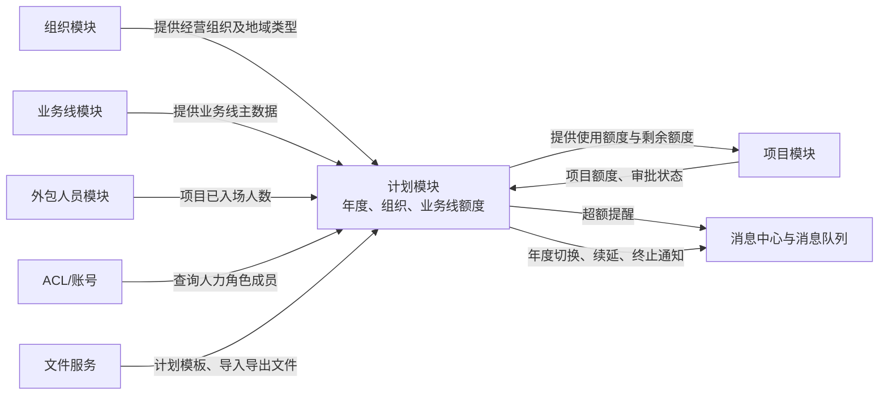

## 1. 了解概念

这篇内容默认把“外包人员名额”当作一种年度编制：它不是某个具体的人，也不是工资预算，而是一个经营机构在某条业务线上最多可使用多少名外包人员的数量限制。

- **年度**：计划按自然年管理，例如“2027 年的名额”不能直接当作 2028 年使用。  
  数据库：`plan_detail.plan_year`
- **经营组织**：公司内部承担经营管理职责的机构，例如总公司、省分公司、市级机构。  
  数据库：机构编码为 `plan_detail.operation_org_code`；机构名称为 `t_abs_org_basic.branch_org_name`。
- **业务线**：经营机构开展的一类业务，例如“95585 客服”。同一个经营机构不同业务线的名额分别管理，不能混用。  
  数据库：业务线编码为 `plan_detail.business_line_code`；业务线名称为 `business_line.name`。
- **项目**：机构使用外包人员前，需要先发起外包项目申请，并填写计划使用的人数。项目审批中或审批通过后，会占用该机构的可用名额。  
  数据库：`project_detail`
- **项目额度**：一个项目申请使用的外包人员人数，例如项目申请 10 人，项目额度就是 10 人。  
  数据库：`project_detail.project_quota`
- **分配额度**：一个机构可以向下属机构统筹分配的名额总量；下属机构收到后，再用于自己的业务。  
  数据库：`plan_detail.allocable_quota`
- **使用额度（也称可用额度）**：当前机构本级可以直接拿来申请外包项目的名额上限，是计算还能申请多少人的基础。  
  数据库：`plan_detail.usable_quota`
- **计划剩余额度**：当前机构还可以继续申请项目的人数。计算方式为“使用额度－已占用的项目额度”；例如使用额度为 100 人，已审批或审批中项目合计占用 10 人，剩余额度就是 90 人。它不单独存储。  
  数据库：根据 `plan_detail.usable_quota` 和 `project_detail.project_quota` 实时计算。

阅读时只需记住这句话：**先确定“哪一年、哪个经营机构、哪条业务线”，再看该机构还能使用多少外包人员名额。**

## 1. 模块有什么用

计划模块用于记录和管理各单位每年可使用的外包人员数量。

系统会按照“年度、经营组织、业务线”三个维度维护人员名额。例如，2026 年上海分公司电话销售业务可使用 100 名外包人员，就是一条计划额度记录。

上级机构先分配名额，下级机构再在名额范围内申请外包项目和安排人员入场。系统会自动计算剩余名额；如果项目申请人数超过可用名额，会提醒相关人力人员。

### 先用一个名额分配的例子理解

以 UAT 数据库中的一条真实计划记录为例：2027 年，中华联合财产保险股份有限公司山东分公司（经营组织编码 `213700000000`）的 95585 客服业务线（业务线编码 `TX_KF`），计划分配额度为 200 人，其中使用额度（可用额度）为 100 人。

该组织和业务线下已有 1 个已审批项目，占用了 10 个外包人员名额。因此，系统计算出的剩余可用名额为：

`100（使用额度）- 10（已审批项目额度）= 90 人`

也就是说，中华联合财产保险股份有限公司山东分公司在 95585 客服业务线下，还可以继续申请最多 90 名外包人员的项目额度；如果新项目申请人数超过 90 人，系统就会提示额度不足。

这条计划数据来自 `plan_detail` 表；项目已占用名额来自 `project_detail` 表。系统按“年度、经营组织、业务线”匹配两类数据，并用使用额度减去审批中或已审批项目的项目额度，得出剩余名额。

## 2. 核心业务逻辑

可以把计划模块的工作理解为四步：先准备新一年的名额，再向下分配名额，然后用名额申请项目，最后检查是否超额。

1. **先准备新年度**：例如要开始管理 2027 年时，可以直接复制 2026 年各机构、各业务线的额度；也可以先生成全部为 0 的空白记录，再逐条填写。
2. **再分配名额**：上级机构把分配额度下发给下级机构。下级机构获得的名额合计不能超过上级给出的总量。例如上级可分配 200 人，那么所有下级机构拿到的名额相加不能超过 200 人。
3. **机构申请项目时占用名额**：机构本级申请项目时，使用额度才是项目人数的上限。项目处于“审批中”或“已审批”状态时，项目额度都会被算作已占用；人员是否已经入场是另一项统计，不会改变项目申请额度。
4. **系统每天检查是否超额并提醒**：
   - 下级机构拿到的名额总和超过上级可分配的名额时，属于“分配超额”。
   - 审批中和已审批项目的申请人数合计超过机构使用额度时，属于“项目超额”。

   发现上述情况后，系统会通知对应的人力人员处理。

另外，启用新年度后，系统会同步处理当年到期项目：没有续延关系的项目会被标记为终止；已续延的项目会发送“项目编码替换”通知给外包人员管理模块。

## 3. 与其他模块的关系

| 关联对象     | 与计划模块的实际关系                                                     |
| -------- | -------------------------------------------------------------- |
| 组织模块     | 计划记录归属到经营组织；组织地域类型影响“分配额度”还是“使用额度”的维护方式。组织不是计划的父子数据，而是计划的一个维度。 |
| 业务线模块    | 提供业务线名称和编码；每个组织、每个年度分别按业务线维护额度。                                |
| 项目模块     | 创建或查看项目时计算计划剩余额度；审批中和已审批项目会占用计划。                               |
| 外包人员模块   | 按项目汇总已入场人数，用于展示计划实际使用情况。                                       |
| ACL、消息中心 | 超额时按组织和角色找到人力人员并发送提醒。                                          |
| 文件服务     | 支持计划 Excel 模板下载、导入、导出，以及导入结果回查。                                |

## 4. 简单例子

假设某省分在 2026 年的某业务线计划总量为 100 人，已向下属机构分配 70 人。

- 下属机构再分配时，合计不能超过 100 人。
- 机构已审批或审批中的项目共申请 65 人，则剩余可申请量按 `100 - 65` 计算。
- 若下属机构分配总和变为 105 人，系统不会将这当作正常状态，而会在每日检查中向相应人力人员发送提醒。
- 已入场人数是从外包人员项目记录汇总而来，它反映实际到岗使用情况，不等同于项目申请额度。

## 5. UAT 真实数据示例

以下为 UAT 查询时快照，使用了 `plan_detail`（计划明细）和 `project_detail`（项目明细）两张表；未展示人员或账号等敏感字段。

在 2026 年，经营组织 `215100000000`、业务线 `TX_XK` 的一条计划明细记录显示：分配额度为 200、使用额度为 500。与它的组织、业务线和年度范围相匹配的有效项目中，按项目编号去重后，项目 `XM202600000153` 处于审批中，项目额度为 457。

### 这条记录能直接看到什么

- 该组织和业务线在 2026 年确实存在计划额度记录。
- 该项目在年度范围内且处于审批中，符合计划模块计算项目额度占用时纳入统计的状态。
- 依照当前代码“同一项目编号取最大项目额度”的规则，这个项目会占用 457 个额度；以使用额度 500 计算，剩余额度为 43。

### 这条记录看不到什么

- 无法仅凭该记录判断 200 的分配额度与 500 的使用额度为何存在差异，需结合该组织的地域类型及上级分配过程确认。
- 无法证明项目最终会审批通过，也无法证明已存在 457 名人员入场；人员入场数量来自外包人员项目记录，不等同于项目额度。
- 这是一条 UAT 数据快照，不代表所有组织、业务线或年度都遵循相同数值。

## 6. 使用与维护注意事项

- 计划主数据的关键组合是“计划年度、经营组织、业务线”；代码按这一组合查询、更新和导入。数据库是否存在对应唯一约束，需通过表结构进一步确认。
- 启用年度会触发项目终止和续延通知，属于会影响下游外包人员数据的操作，应先确认当年项目续延信息完整。
- 导入支持部分成功、部分失败；应下载失败结果文件逐条修正后再导入。
- 当前代码会根据请求中的权限组织范围筛选可导入组织；请求方是否确实拥有该权限，仍需结合网关、登录态或 ACL 的上游校验确认，不能仅由本模块代码证明。
- “计划总量”“已分配数”“项目申请额度”“已入场人数”是不同口径，分析超额时不能混用。

## 7. 总结

计划模块是项目和外包人员管理之间的“年度编制额度控制层”。它自身不负责审批项目或办理人员入场，但通过额度校验、使用情况汇总、年度切换和超额通知，约束这些业务在可用编制范围内运行。
