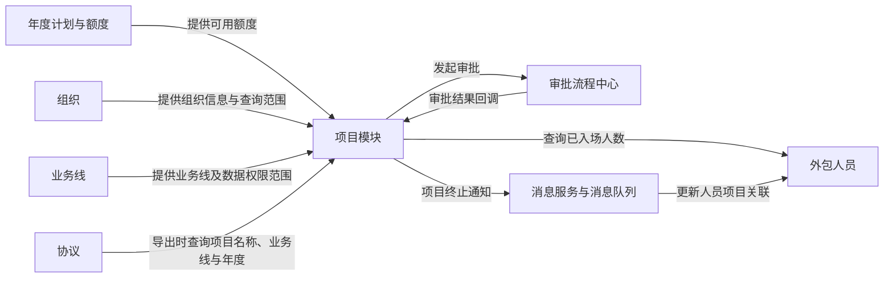

# 项目模块

> 内容依据：HRMS 当前项目模块、计划、外包人员、协议及审批回调相关代码。本文只说明“项目”这一个业务模块；外包人员、协议和年度计划的具体规则留在各自笔记中。

## 1. 项目模块有什么用

项目模块可以理解成一张“外包人员安排单”：它告诉系统，哪些外包人员要做哪项工作，以及这项工作最多能安排多少人。

一条项目记录主要写清四件事：

- 谁负责：哪个机构使用这批外包人员。
- 做什么：属于哪类业务。这里的“业务线”就是公司内部给业务做的分类。
- 用多久：从哪一年到哪一年有效。
- 用多少人：最多可以安排多少名外包人员，这个数量叫“项目编制”。

例如（UAT 查询快照：2026-08-25）：查询 `project_detail` 表（项目明细表）后，可以看到一个“浙江分公司电融服务外包项目”，项目编号是 `XM202600000116`。它的使用期限是 2025—2028 年，最多安排 15 名外包人员，当前状态为“已生效”。

这就是一张已经批准的外包人员安排单：这项工作可以在 2025—2028 年期间使用，最多可安排 15 人。数据库显示它是一条“变更”记录，说明它不是单纯的新建记录。此次只查询了项目本身，未查询人员明细，所以不能据此判断现在已经安排了多少人、还剩多少个名额。

系统还会给每个项目生成一个唯一编号，例如以 `XM` 开头的编号。日常理解项目时，先看项目名称、有效年份、最多人数和是否已生效即可；项目编号主要用于系统准确识别这条记录。

## 2. 核心业务逻辑

### 2.1 项目人数不能超过计划总名额

你暂时不用先看计划模块。这里先把“计划”理解成公司提前定好的**总人数上限**即可。

项目要安排外包人员时，系统会先看这个项目还能申请多少人。例如，计划只剩 15 个名额，项目就不能申请 20 人。

- 没有找到对应的计划总名额，项目不能提交。
- 项目申请的人数超过剩余名额，项目不能提交。
- 系统还会统计这个项目已经关联了多少外包人员，供审批和详情页面查看。

所以你现在只要记住：**项目人数不能超过计划给它的总名额。** 至于这个总名额是怎么制定和分配的，等阅读计划模块时再深入了解。

### 2.2 新建、暂存与审批

新建项目会生成项目编号，状态先进入“审批中”，并发起项目审批流程。暂存时状态为“待提交/草稿”，不会直接生效。

审批回调会按结果更新项目：

- 审批通过：项目生效；如属于修改、变更或终止类申请，原生效版本会转入项目历史。
- 审批拒绝：申请记录标记为无效。
- 撤回审批：项目回到草稿状态。

因此，项目详情中的“审批中”记录不是已经生效的项目，不能把它与正式可用项目混为一谈。

### 2.3 变更、续延和终止

这三种操作可以简单理解为：**改一改、接着用、提前结束**。

- 变更（改一改）：项目名称、最多人数等信息要调整时，重新提交审批。审批通过后，系统使用修改后的内容；原来的内容会保留在历史记录中，方便以后查看。
- 续延（接着用）：项目快到期但还要继续使用时，创建一个新的项目编号，继续安排后面的年份。新项目必须从原项目结束后的年份开始；如果已经有一条续延申请在审批中，就不能再重复申请。
- 终止（提前结束）：项目还没到期，但不再需要了，就申请提前结束。审批通过后，如果终止日期已经到了，项目立即结束；如果终止日期还没到，项目会继续有效，直到这个日期再结束。

代码还会定时检查已批准的到期终止项目，并把终止消息发送给外包人员关联处理。

### 2.4 UAT 真实项目示例

> UAT 查询快照：2026-08-25。以下仅来自 `project_detail` 的单条项目记录，不包含人员或计划明细。

项目 `XM202600000116` 的名称为“浙江分公司电融服务外包项目”，归属组织编码为 `213300000000`，业务线编码为 `TX_XK`，有效期为 2025—2028 年，项目编制为 15 人，状态为“已生效”，操作类型为“变更”。

从这条项目记录里，可以直接看到：

- 这个项目可以用到哪几年：2025—2028 年。
- 最多可以安排多少人：15 人。
- 它现在能不能用：可以，因为状态是“已生效”。
- 它是不是后来改过：是，操作类型是“变更”。

但这张项目表看不到两件事：现在实际安排了多少人、还剩多少个名额。这两件事要分别查看人员数据和计划数据才能知道。

## 3. 项目与其他模块怎样协作

| 关联对象 | 关系类型 | 项目模块中的作用 |
| --- | --- | --- |
| 年度计划 | 额度来源 | 项目申请需校验可用额度，项目编制会占用额度。 |
| 组织 | 业务归属与查询范围 | 项目记录归属组织；查询时会根据组织范围筛选。 |
| 业务线 | 业务归属与数据权限 | 项目绑定业务线；查询结果先按用户拥有的业务线权限过滤。 |
| 审批流程中心 | 审批路由 | 项目新增、变更、续延、终止提交审批，并接收流程回调。 |
| 外包人员 | 业务引用 | 人员记录使用项目编号；项目模块据此统计已入场人数。项目终止后，通过消息处理人员项目关联。 |
| 协议 | 查询引用 | 协议导出按人员的项目编号读取项目名称、业务线和年度，不由项目模块维护协议内容。 |
| 组织、账号、消息服务 | 外部支撑 | 分别补充组织名称、创建/修改人信息，以及超编和到期提醒。 |

## 4. 权限与查询边界

项目列表查询同时受到两类范围限制：

- 业务线范围：系统根据当前用户可访问的业务线过滤；没有可用业务线权限时，返回空列表。
- 组织范围：系统按传入的权限组织和操作组织构建查询范围；部分按组织查询的场景还会根据组织层级扩展到管理分支。

这是“数据可见范围”，不等同于“谁能新增、修改或终止项目”的操作授权。当前阅读范围内未确认各操作入口是否还有独立的按钮权限或 ACL 校验，需结合权限平台配置进一步确认。

## 5. 使用与维护注意事项

- 新建项目之前先确认对应组织、业务线和计划年度已经准备好，否则会因找不到计划或额度不足而无法提交。
- 不要把审批中的项目当作已生效项目使用；它会参与剩余额度计算，但其业务结果仍取决于审批回调。
- 续延会创建新的项目编号，不是简单修改原项目的结束年度。代码中存在人员项目续延消息的消费处理，但当前项目服务的发送链路未在本次阅读范围内确认。
- 终止项目会影响人员项目关联。涉及大量在岗人员时，应先核实终止日期和影响人员范围。
- 项目历史用于保留被替换的生效版本。查询当前项目和查询历史项目应分开理解，避免把历史记录误作当前有效数据。

## 6. 总结

项目模块是 HRMS 中连接“计划额度”和“外包人员安排”的枢纽：它将组织、业务线、年度和编制组合成可审批、可追溯的项目，并在变更、续延和终止时通过审批、历史和消息机制保持关联数据一致。维护项目时，最关键的是同时关注额度、审批状态和人员影响范围。
