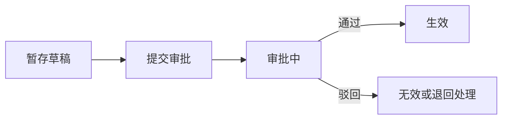
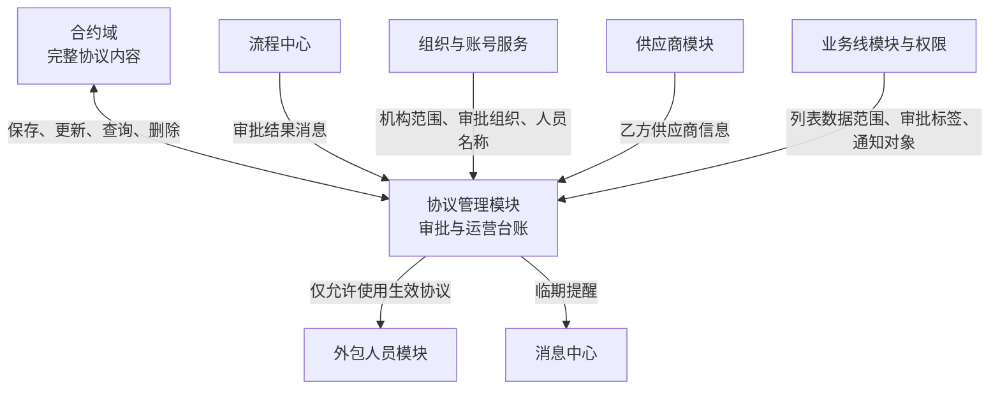

## 1. 这个模块有什么用

先用一句大白话说：**协议就是公司和供应商之间的一份合作约定。**

比如，公司想找一家外包公司提供人员服务，双方会约定：

- 由谁提供服务；
- 服务从什么时候开始，到什么时候结束；
- 服务费用怎么结算；
- 哪个机构、哪个业务部门使用这些人员；
- 合作提前结束时怎么处理。

这份约定，就是“协议”。

HRMS 里的协议管理模块，不是用来保存整份合同原文的，而是用来管理这份协议在日常工作中是否能使用。

它主要关心几件事：

- 这份协议是谁和谁签的；
- 它归哪个机构、服务哪条业务线；
- 它是否已经审批通过；
- 它什么时候到期；
- 之后有没有修改、续签或提前终止。

可以把系统想成有两个地方共同管理协议：

- **合约域**：像存放正式合同内容的档案室，负责保存协议的详细内容。
- **HRMS**：像协议使用登记簿，负责记录协议能不能用、审批到哪一步、哪些人员可以关联这份协议。

举个例子：某分公司准备从“甲供应商”引入一批外包人员。双方先形成一份合作协议，详细条款由合约域保存。HRMS 再记录这份协议属于哪个分公司、服务什么业务、审批是否通过。

只有审批通过、处于“生效”状态的协议，后续才能被外包人员业务使用。简单说，**协议是外包人员进入系统办理业务前的一张“合作凭证”。**

## 2. 核心业务逻辑

### 2.1 从草稿到生效

一份协议可以先暂存为草稿，再提交审批。提交时，系统会先检查同一协议编号是否已经存在“审批中”的记录，避免同一协议并行走多个审批流程。

审批通过或驳回后，流程中心通过消息通知 HRMS，HRMS 按流程实例编号更新本地协议状态：



“生效”是后续人员业务的重要前提。代码中，人员导入和人员信息校验都会查询状态为 `APPROVED` 的协议。

### 2.2 变更、续延、终止与恢复

协议不是修改一条记录就结束，而是要留下“这次做了什么”的业务痕迹：

- **变更**：修改已有协议后重新走审批；本地记录标记为变更。
- **续延**：原协议临近结束但合作继续时，创建一份新协议，并记录它来源于原协议。
- **手动终止**：提前结束合作时，复制原协议的管理信息，形成一条待审批的终止记录，并保留终止原因和终止日期。
- **手动恢复**：对已终止协议申请恢复时，同样生成一条待审批的恢复记录。
- **到期处理**：定时任务会把到期但尚未终止的协议置为“到期未终止”，后续再执行自动终止处理。

这意味着协议的变更链和续延链需要被保留，不能把旧记录直接覆盖掉；历史记录用于查看同一协议编号的过往版本。

### 2.3 临近到期提醒

系统会找出距离结束日期 30 天和 20 天的已生效协议，并通过消息中心通知对应人员。收件人由协议的主业务线和归属机构共同确定。

这里的业务线和机构是两种并列维度：业务线用于确定负责团队，机构用于确定业务归属；它们不是上下级关系。

## 3. 协议数据放在哪里

协议模块在 HRMS 内部主要使用三张表。可以把它们理解为：一张放“现在正在使用的协议”，一张放“过去的版本”，一张放“协议服务哪些业务线”。

| 表名 | 大白话作用 | 最值得理解的字段 |
|---|---|---|
| `agreement` | 当前协议台账。一份协议当前最新、可操作的记录放在这里。 | `id` 是 HRMS 内部编号；`agreementNo` 是业务上的协议编号；`agreementInstanceId` 是合约域中完整协议的档案编号；`status` 记录草稿、审批中、生效、终止等状态；`actionType` 说明本次是新建、变更、续延、终止还是恢复。 |
| `agreement_history` | 协议旧版本档案。协议发生替换后，旧记录会保留在这里，供历史查询。 | 字段和当前协议台账基本相同；`version` 表示版本，`originId` 用于保留它与原协议或前一条记录的关联。 |
| `agreement_business_line_ref` | 协议与业务线的对照表。一份协议可以服务多条业务线，因此单独记录关联关系。 | `agreementId` 对应 `agreement.id`；`businessLineCode` 是业务线编码；`isMainLine=1` 表示主业务线，`0` 表示子业务线。 |

它们的关系可以这样理解：

```text
agreement（当前协议）
    ├── agreement_business_line_ref（这份协议服务哪些业务线）
    └── agreement_history（这份协议以前的版本）
```

### 3.1 UAT 数据示例：一份正在生效的协议

以下是对 `agreement`（当前协议台账）和 `agreement_business_line_ref`（协议与业务线关联）进行只读查询时的快照。该记录为测试数据；按确认范围，以下保留该样例的完整字段值。

| 看到的内容 | UAT 查询结果 | 用大白话解释 |
|---|---|---|
| 协议编号 | `H260709000000000000000121` | 这是业务上用来识别这份协议的编号；外包人员等下游业务会用它关联协议。 |
| 协议名称 | 客服+理赔协议测试 | 这是一份用于客服和理赔场景的测试协议。 |
| 当前状态 | `APPROVED` | 代码将其解释为“生效”，说明它已通过 HRMS 本地状态校验，可作为需要有效协议的人员业务前提。 |
| 本次操作 | `NEW` | 这条记录是按“新建协议”保存的，不是续延、终止或恢复记录。 |
| 有效期 | 2026-07-09 至 2026-09-30 | 这是协议约定的开始和结束日期。 |
| 生效时间 | 2026-07-09 16:55:23 | 表示系统记录的生效时间。 |
| 归属机构 | `213700000000` | 这是机构编码；其具体机构名称需要再向组织服务查询，不能仅凭编码猜测。 |
| 业务线关联 | 主业务线：`TX_LP`；子业务线：`TX_LP`、`TX_KF` | 这些记录来自关联表，说明该协议配置了主、子业务线。编码的业务含义需以业务线主数据为准。 |
| 历史版本数 | 0 | 在本次查询时，`agreement_history` 中没有查到同协议编号的有效历史记录。 |

这条记录能直接证明：数据库中存在一份处于生效状态的协议，并且这份协议存在业务线关联记录。

这条记录不能证明：协议完整条款是什么、机构编码对应的机构名称是什么、业务线编码的中文名称是什么，以及该协议是否已经完成合约域状态同步；这些信息需要分别查询合约域、组织服务和业务线主数据，或通过联调确认。

#### 完整字段快照

`agreement` 表中该测试协议的完整记录如下。空白表示本次查询结果为空值。

| 字段 | 值 |
|---|---|
| `id` | `7480906449502674944` |
| `agreement_no` | `H260709000000000000000121` |
| `agreement_instance_id` | `202607091010050001165100200000000048910` |
| `version` | `1` |
| `origin_id` | 空 |
| `name` | 客服+理赔协议测试 |
| `action_type` | `NEW` |
| `action_remark` | 空 |
| `status` | `APPROVED` |
| `start_date` | `2026-07-09` |
| `end_date` | `2026-09-30` |
| `manual_terminate_date` | 空 |
| `belong_operation_org_code` | `213700000000` |
| `part_a` | `213700000000` |
| `part_b` | `7440582992244318208` |
| `associated_project_code` | 空 |
| `business_line_code` | 空 |
| `flow_instance_id` | `PS2026077480906449584549888` |
| `effective_datetime` | `2026-07-09 16:55:23` |
| `payment_method` | `INTERNETBANKTRANSFER` |
| `bank_account_type` | 空 |
| `bank_account_name` | `11111112` |
| `bank_account_number` | `22222222223` |
| `bank_name` | 空 |
| `bank_account_province` | 空 |
| `bank_account_city` | 空 |
| `bank_issuing` | 空 |
| `bank_corporate_account` | `0` |
| `creator` | `1010001114` |
| `modifier` | `1010001114` |
| `gmt_create` | `2026-07-09 16:51:26` |
| `gmt_modified` | `2026-07-09 16:55:23` |
| `tenant_code` | `cic` |
| `is_valid` | `1` |

同一协议在 `agreement_business_line_ref` 表中有 3 条关联记录：

| `id` | `agreement_id` | `business_line_code` | `is_main_line` | `creator` / `modifier` | 创建、修改时间 | `tenant_code` | `is_valid` |
|---|---|---|---:|---|---|---|---:|
| `7480906450773549058` | `7480906449502674944` | `TX_LP` | 1 | `1010001114` / `1010001114` | 2026-07-09 16:51:26 / 2026-07-09 16:51:26 | `cic` | 1 |
| `7480906450773549056` | `7480906449502674944` | `TX_KF` | 0 | `1010001114` / `1010001114` | 2026-07-09 16:51:26 / 2026-07-09 16:51:26 | `cic` | 1 |
| `7480906450773549057` | `7480906449502674944` | `TX_LP` | 0 | `1010001114` / `1010001114` | 2026-07-09 16:51:26 / 2026-07-09 16:51:26 | `cic` | 1 |

当前协议台账中的常见信息，用日常语言解释如下：

- `partA`：甲方，也就是公司侧的签约机构编码。
- `partB`：乙方，也就是供应商 ID；供应商名称需要再到供应商模块查询。
- `belongOperationOrgCode`：这份协议归哪个业务机构管理。
- `startDate` / `endDate`：协议从哪天开始、到哪天结束。
- `manualTerminateDate`：提前终止时，计划在哪一天停止合作。
- `flowInstanceId`：这次审批流程的编号；流程中心返回审批结果时，HRMS 用它找到对应协议。
- `effectiveDatetime`：协议真正开始生效的时间。
- `associatedProjectCode`：预留的关联项目编号；代码能够确认它会被保存，完整使用规则仍需结合项目模块确认。
- `paymentMethod`、`bankAccountName`、`bankAccountNumber`、`bankName` 等：协议约定的收款信息，属于敏感数据，展示和导出时应注意权限与脱敏。

外包人员表不属于协议模块本身，但会通过 `agreement_id` 保存协议编号来引用协议。人员导入、校验等需要有效协议的场景，只接受状态为“生效”的协议。

需要注意：`agreement` 表中也保留了 `businessLineCode` 字段，但当前代码实际通过 `agreement_business_line_ref` 保存和读取主、子业务线。理解业务线关系时，应以关联表为主。

## 4. 它和其他模块怎样协作



| 协作方       | 关系类型      | 当前模块怎样使用它                                      |
| --------- | --------- | ---------------------------------------------- |
| 合约域       | 业务数据协作    | 保存、修改、查询和删除完整协议内容；HRMS 保存其返回的协议编号和实例标识。        |
| 流程中心      | 审批路由      | 协议新建、变更、续延、终止、恢复均会发起审批；审批消息按流程实例定位本地记录。        |
| 组织与账号服务   | 查询与审批路由   | 获取机构名称、机构层级和审批所需的组织范围，也补充维护人的显示名称。             |
| 供应商模块     | 业务数据引用    | 协议乙方保存的是供应商 ID；展示详情或列表时再查询供应商名称。               |
| 业务线模块、ACL | 数据权限与审批路由 | 普通用户的协议列表会被限定在其有权限的业务线内；业务线还会参与审批标签和临期通知对象的确定。 |
| 外包人员模块    | 下游业务约束    | 人员导入、查询和校验会按协议编号关联协议；需要有效协议的场景只接受已生效记录。        |
| 消息中心      | 通知路由      | 对临近到期的协议发送提醒，不承载协议主数据。                         |

## 5. 使用与维护时要注意什么

- **区分三个标识。** HRMS 本地 ID 用于本地详情、终止、恢复和删除；协议编号用于业务关联及查询；合约域实例标识用于取得或删除完整协议内容。流程实例标识只用于接收审批结果。
- **删除影响两边。** 删除会先调用合约域删除完整协议，再删除 HRMS 的本地记录及业务线关联。删除前应确认该协议没有被人员等下游业务继续使用；当前代码未能证明数据库层面存在外键保护。
- **列表权限不等于业务数据归属。** 列表会结合机构筛选范围和业务线权限过滤数据；这说明存在查询权限控制，但不能据此推断协议一定只属于某一个业务线或机构。
- **审批回调的边界需要关注。** 当前监听器在收到通过或驳回消息后，会更新 HRMS 本地状态。代码中虽有“审批通过后同步合约域状态”的实现，但该调用在监听器内被注释掉。合约域最终状态是否由其他系统或流程完成同步，仍需联调或产品规则确认。
- **续延关联的语义。** 续延记录通过原协议编号建立来源关系。它表达“新协议接续哪一份旧协议”，不是两份协议完全相同的证明。

## 6. 总结

协议管理模块连接了外包合作的“合同内容、审批过程和人员使用”三件事：合约域管正文，HRMS 管状态和运营动作，流程中心管审批，外包人员模块只使用符合条件的生效协议。维护时最重要的是保持这几方标识和状态的一致，并谨慎处理续延、终止和删除带来的下游影响。
