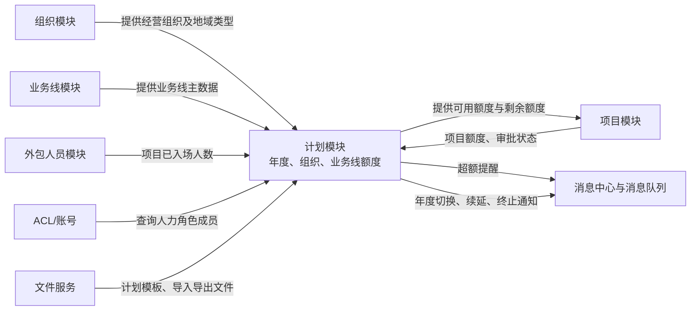

# 4.计划模块

## 1. 模块有什么用

计划模块用来按“年度 × 经营组织 × 业务线”维护外包人员编制额度。

它相当于一套年度额度台账：总公司或上级机构分配额度，下级机构在额度范围内申请项目、安排人员入场；系统据此展示剩余量，并在超额时提醒相关人力人员。

## 2. 核心业务逻辑

- 新建计划年度时，可以复制上一年度的额度，也可以为全部经营组织和业务线生成额度为 0 的空白记录。
- 启用年度后，系统会处理当年到期项目：没有续延关系的项目被标记为终止，并通知外包人员管理模块；续延项目会发送“项目编码替换”通知。
- 额度分为两类：
  - **分配额度**：上级给下级或机构的计划总量。
  - **使用额度**：机构实际可用于项目的额度。
- 修改或导入额度时，系统会校验：下级已分配的合计不能大于上级计划总量。
- 项目在“审批中”或“已审批”状态时会占用额度；计划页面会汇总已申请项目额度和已入场人数。
- 每日任务检查两类超额：
  - 下级已分配额度超过上级计划总量；
  - 项目已申请额度超过机构可用额度。

  发现后向对应人力角色发送消息提醒。

## 3. 与其他模块的关系

| 关联对象     | 与计划模块的实际关系                                                     |
| -------- | -------------------------------------------------------------- |
| 组织模块     | 计划记录归属到经营组织；组织地域类型影响“分配额度”还是“使用额度”的维护方式。组织不是计划的父子数据，而是计划的一个维度。 |
| 业务线模块    | 提供业务线名称和编码；每个组织、每个年度分别按业务线维护额度。                                |
| 项目模块     | 创建或查看项目时计算计划剩余额度；审批中和已审批项目会占用计划。                               |
| 外包人员模块   | 按项目汇总已入场人数，用于展示计划实际使用情况。                                       |
| ACL、消息中心 | 超额时按组织和角色找到人力人员并发送提醒。                                          |
| 文件服务     | 支持计划 Excel 模板下载、导入、导出，以及导入结果回查。                                |

## 4. 简单例子

假设某省分在 2026 年的某业务线计划总量为 100 人，已向下属机构分配 70 人。

- 下属机构再分配时，合计不能超过 100 人。
- 机构已审批或审批中的项目共申请 65 人，则剩余可申请量按 `100 - 65` 计算。
- 若下属机构分配总和变为 105 人，系统不会将这当作正常状态，而会在每日检查中向相应人力人员发送提醒。
- 已入场人数是从外包人员项目记录汇总而来，它反映实际到岗使用情况，不等同于项目申请额度。

## 5. UAT 真实数据示例

以下为 UAT 查询时快照，使用了 `plan_detail`（计划明细）和 `project_detail`（项目明细）两张表；未展示人员或账号等敏感字段。

在 2026 年，经营组织 `215100000000`、业务线 `TX_XK` 的一条计划明细记录显示：分配额度为 200、使用额度为 500。与它的组织、业务线和年度范围相匹配的有效项目中，按项目编号去重后，项目 `XM202600000153` 处于审批中，项目额度为 457。

### 这条记录能直接看到什么

- 该组织和业务线在 2026 年确实存在计划额度记录。
- 该项目在年度范围内且处于审批中，符合计划模块计算项目额度占用时纳入统计的状态。
- 依照当前代码“同一项目编号取最大项目额度”的规则，这个项目会占用 457 个额度；以使用额度 500 计算，剩余额度为 43。

### 这条记录看不到什么

- 无法仅凭该记录判断 200 的分配额度与 500 的使用额度为何存在差异，需结合该组织的地域类型及上级分配过程确认。
- 无法证明项目最终会审批通过，也无法证明已存在 457 名人员入场；人员入场数量来自外包人员项目记录，不等同于项目额度。
- 这是一条 UAT 数据快照，不代表所有组织、业务线或年度都遵循相同数值。

## 6. 使用与维护注意事项

- 计划主数据的关键组合是“计划年度、经营组织、业务线”；代码按这一组合查询、更新和导入。数据库是否存在对应唯一约束，需通过表结构进一步确认。
- 启用年度会触发项目终止和续延通知，属于会影响下游外包人员数据的操作，应先确认当年项目续延信息完整。
- 导入支持部分成功、部分失败；应下载失败结果文件逐条修正后再导入。
- 当前代码会根据请求中的权限组织范围筛选可导入组织；请求方是否确实拥有该权限，仍需结合网关、登录态或 ACL 的上游校验确认，不能仅由本模块代码证明。
- “计划总量”“已分配数”“项目申请额度”“已入场人数”是不同口径，分析超额时不能混用。

## 7. 总结

计划模块是项目和外包人员管理之间的“年度编制额度控制层”。它自身不负责审批项目或办理人员入场，但通过额度校验、使用情况汇总、年度切换和超额通知，约束这些业务在可用编制范围内运行。
