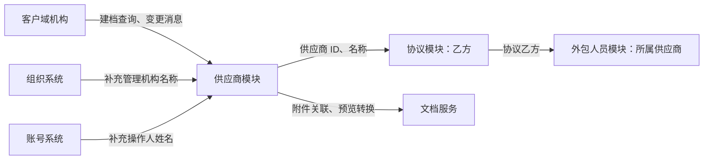

## 1. 模块有什么用

供应商模块是 HRMS 的“外包公司名册”。它为每家合作外包公司建立一条本地档案，供协议把该公司选作乙方、供外包人员记录所属公司，也便于查看联系人、管理归属和留档材料。

这里的“供应商”不是客户域账号本身。HRMS 新建自己的供应商 ID，并把客户域机构 ID 一并保存，用于识别同一个外部机构和同步部分基础资料。

## 2. 一条供应商档案包含什么

系统保存的内容可分为四类：

- **主体与联系信息**：公司名称、证件类型和号码、地址、联系人及手机号。
- **HRMS 内部管理信息**：负责管理的机构代码、支付方式和银行账户资料。
- **留档材料**：与该供应商 ID 关联的附件；系统可调用文档服务完成文件格式转换或获取预览链接。
- **操作痕迹**：创建人、最后修改人、修改时间和有效标识。列表或详情展示时，管理机构名称由组织系统补充，操作人姓名由账号系统补充。

## 3. 核心业务逻辑

### 3.1 建档与维护

管理员可以先按客户域机构 ID 查询资料。系统会按指定证件类型取名称和证件信息，并尝试取注册地址、联系人和手机号，作为建档时的参考和回填结果；随后由 HRMS 保存供应商主档、管理机构、支付资料及附件。

编辑会更新主档和管理资料。附件采用“旧附件失效、再新增本次附件”的方式处理。当前实现中，编辑请求即使带有客户域机构 ID，也不会更新已保存的关联 ID；如需更换到另一个客户域机构，应先确认业务上是否允许，代码未提供专门的变更规则。

### 3.2 客户域资料同步

客户域机构变更消息会被 HRMS 消费。系统使用“客户域 ID + 证件类型 + 证件号码”寻找本地供应商；找到后更新公司名称，并在消息含有相应内容时更新注册地址、联系人和手机号。

管理机构、支付资料、银行账户和附件不在这条同步逻辑中，仍由 HRMS 维护。消息中没有证件信息或找不到匹配供应商时，系统会跳过本次更新。

### 3.3 删除规则

如果供应商已经被协议作为乙方引用，系统明确拒绝删除。未被协议引用时，供应商主档会被删除，关联附件会被标为无效。

代码只看到对“协议引用”的删除保护；外包人员等其他历史记录是否也会阻止删除，当前实现未见校验，属于使用时需要特别核实的风险。

### 3.4 简单例子（假设场景）

例如，外包公司“甲公司”已在客户域存在。管理员查询其资料后，在 HRMS 建立供应商档案，并补充“由某管理机构负责”和收款账户。之后创建协议时，甲公司可被选为乙方；通过该协议录入的外包人员会带出甲公司的供应商 ID。此后甲公司在客户域更新联系人手机号，消息同步会更新 HRMS 档案中的手机号，但不会改写收款账户。

## 4. 与其他模块怎样协作

| 关系对象 | 真实关系 | 供应商模块在其中的作用 |
| --- | --- | --- |
| 客户域机构 | 基础资料来源与同步来源 | 查询机构资料；接收变更消息后刷新部分本地快照。 |
| 组织系统 | 查询补充 | 供应商仅保存管理机构代码，展示名称时查询组织系统；这不是供应商与组织的上下级关系。 |
| 账号系统 | 查询补充 | 供应商保存操作账号，展示时补充账号显示名。 |
| 协议模块 | 业务数据引用 | 协议将供应商 ID 作为乙方；这也是供应商删除前会检查的引用。 |
| 外包人员模块 | 业务归属引用 | 人员档案、导入批次和异动记录会保存所属供应商 ID，通常由协议乙方带出。 |
| 文档服务 | 文件能力 | 供应商附件的格式转换和在线预览由外部文档能力完成。 |

## 5. 权限与维护注意事项

- 在供应商自身的服务代码中，只能确认参数校验，未发现按管理机构、组织或 ACL 对供应商列表、详情、新增、修改、删除做数据范围拦截的实现；实际页面权限或网关权限需另行确认。
- 供应商 ID 是 HRMS 本地业务 ID，不能与客户域机构 ID 混用；协议和人员关联的是前者。
- 删除前除协议校验外，还应人工确认是否有人员、导入批次或异动历史引用，避免造成历史数据无法正确展示。
- 客户域同步依赖证件和客户域 ID 的组合匹配。若建档时证件资料不一致，后续消息可能无法命中本地档案。
- 银行账户和联系方式属于敏感业务资料，导出或开放查询时应按调用方的权限要求控制范围；本模块代码未展示这部分授权规则。

## 6. 总结

供应商模块负责维护外包公司的可引用业务档案：客户域提供部分基础资料，HRMS 维护内部管理、支付和附件信息；协议以它作为乙方，外包人员以它标记所属公司。最重要的维护原则是区分两套 ID、谨慎处理已被引用的供应商，并确认客户域同步能稳定命中本地记录。
