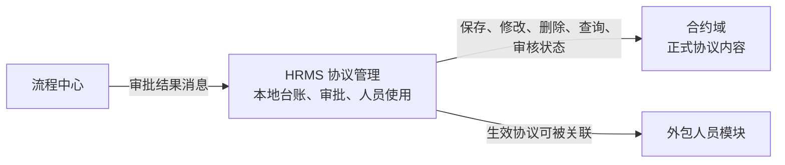

## 1. 这个模块有什么用

合约域可以理解为公司的“正式协议档案室”。它保存协议本身的完整内容，并为其他系统提供创建、修改、查询、删除和审核协议的能力。

HRMS 不直接替代合约域保存完整协议。HRMS 在外包人员管理中只保留一份便于日常使用的协议台账，例如协议编号、协议有效期、归属机构、供应商、审批状态，以及合约域返回的协议实例标识。

简单说：**合约域管协议正文，HRMS 管这份协议在外包人员业务中能否被使用。**

## 2. HRMS 如何使用合约域

从 HRMS 的实际集成代码可以确认，HRMS 通过远程服务调用合约域完成以下动作：

- 新建协议：HRMS 将协议数据提交给合约域保存，并取得协议编号和协议实例标识。
- 修改协议：HRMS 将修改后的协议内容提交给合约域。
- 查询协议：HRMS 按协议实例标识取得合约域中的协议详情，用于补充本地详情展示。
- 删除协议：HRMS 删除本地协议前，先请求合约域删除对应协议。
- 审核状态：HRMS 可将审核信息提交给合约域，使其接收审批结论。

例如，某机构要与供应商新签一份外包服务协议时，HRMS 先让合约域保存正式协议，再把合约域返回的协议实例标识记录到自己的协议台账。以后查看详情时，HRMS 可凭该标识找到正式协议；删除时也会先处理合约域中的协议。

## 3. 与 HRMS 的职责边界

| 协作方 | 关系 | 能从代码确认的作用 |
| --- | --- | --- |
| HRMS 协议管理模块 | 业务数据协作 | 调用合约域维护正式协议，并保存合约域返回的标识。 |
| 流程中心 | 审批路由 | 流程中心先把审批结果通知 HRMS；HRMS 更新本地状态。 |
| 外包人员模块 | 下游业务使用 | 外包人员业务引用 HRMS 本地协议台账，并在需要有效协议的场景校验其状态。 |

这里要特别注意：流程中心的审批结果会更新 HRMS 本地状态。现有监听代码中，“审批通过后同步合约域生效状态”的调用被注释掉，因此合约域最终状态由谁完成同步，单凭当前 HRMS 代码无法确认，需要联调或查看合约域自身实现。

## 4. 使用与维护注意事项

- 不要混淆两个标识：协议编号用于业务关联；协议实例标识用于定位合约域中的正式协议。
- 删除是跨系统动作。HRMS 代码会先删除合约域协议，再删除本地台账；若下游人员仍在引用该协议，应先确认影响范围。当前代码不能证明数据库层面有外键保护。
- 协议中的收款账户等内容属于敏感信息，展示、导出和日志记录应遵守权限与脱敏要求。
- 本笔记依据 HRMS 对合约域的调用代码整理，不代表已经覆盖合约域内部的条款管理、版本规则、权限模型或数据库设计；这些内容待取得合约域代码或接口文档后再确认。

## 5. 总结

合约域是协议正式内容的提供者，HRMS 是外包业务中的协议使用者和运营台账维护者。两者通过协议实例标识衔接；维护时最关键的是确保跨系统的创建、删除和审批状态不会出现不一致。
