# 外包人员模块：把“人”接入外包用工体系

外包人员模块管理的是**具体哪位外包人员、当前能否在场、归属哪个项目、使用哪份协议**。它不是项目、协议或供应商的附属页面，而是把这些业务条件落实到每个人身上的执行模块。

可以把它理解为“人员在场台账”：项目给出可用名额和业务归属，协议给出用工依据，人员模块据此办理入场、离场和变更，并把实际在场人数反馈给项目与计划。

## 1. 它自己负责什么

人员模块保存人员档案及其任职变化，主要负责：

- 建立、修改、查询和批量导入外包人员档案；新建档案默认进入待入场状态；
- 记录人员关联的项目、协议、组织、岗位等业务信息；
- 发起入场、离场申请，接收审批结果后更新人员状态；
- 入场审批通过且到达入场日期后请求账号中心创建外部账号，并在人员变更、返聘和离场时同步账号；
- 保留人员在项目和协议之间的任职变动记录；
- 按项目计算已入场人数、申请人数和剩余名额，供其他模块展示或校验；
- 对外提供按账号、组织或人员编号查询人员及任职记录的接口。

这里的“人员档案”是当前信息；“任职变动记录”是历史信息。例如李四从项目 A 调到项目 B，档案展示当前归属 B，历史记录保留曾在 A 任职的事实。

### 外包人员模块协作与数量口径图

先看模块间实际调用、回调与消息通知：[查看模块协作时序图](/archify/outsourced-staff-module-collaboration.html)。

项目编制、待审批人数、已入场人数及离场释放的加减规则见：[查看人员数量与项目编制增减图](/archify/outsourced-staff-quota-count-flow.html)。

入／离场申请的内部处理链路见：[查看申请、生效与重试流程图](/archify/outsourced-staff-on-offboard-flow.html)。

## 2. 与各模块的关系

先看总览。这里不再用一张总图，避免把“主动查询”和“对方主动通知”误画成同一种箭头。

| 关联模块    | 人员模块如何协作                      | 人员模块实际取得或输出什么                  |
| ------- | ----------------------------- | ------------------------------ |
| 项目模块    | 人员模块主动查询；项目到期或终止时也会发消息通知人员模块。 | 查询项目、业务线和编制；处理项目终止后受影响的人员。     |
| 协议模块    | 人员模块主动查询协议信息；协议终止或编号变更时会发消息。  | 补齐协议名称、期限和协议乙方（供应商）信息；处理受影响人员。 |
| 组织与权限   | 人员模块主动查询或调用权限能力。              | 机构名称、可查询的组织范围、业务线数据范围。         |
| 账号中心    | 人员模块主动发起创建、更新、返聘、失效和详情查询。     | 创建时返回账号 ID；查询时返回账号详情。          |
| 审批流程中心  | 人员模块主动发起入/离场审批；审批中心回传结果。      | 审批通过或驳回结果。                     |
| 计划/编制模块 | 计划模块主动向人员模块查询。                | 人员模块按项目返回已入场人数。                |
| 其他系统    | 其他系统主动向人员模块查询。                | 人员详情和任职历史。                     |

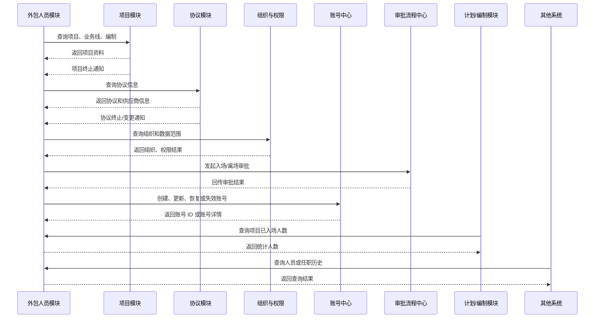

供应商信息通过协议模块进入人员模块，因此未写成“供应商直接向人员模块提供数据”。项目终止和协议终止对人员状态的影响，在后续对应小图中说明。

### 2.1 项目模块：项目是人员实际工作的落点

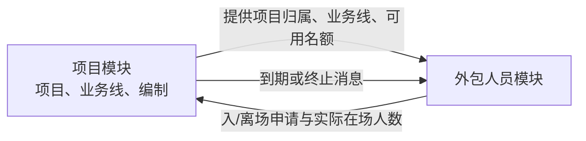

人员模块在办理入场或离场时，主动向项目模块查询项目编号对应的业务线、项目编制和计划年度。同一批申请人员必须归属同一个项目；查不到项目则不能继续办理。入场申请会把本次人数记为编制占用，并计算“项目编制 + 已申请占用 + 本次申请”后的剩余数；提交审批前剩余数小于零就不能提交。

项目详情反过来会主动查询人员模块：按项目编号取得已入场人数和申请中人数，其中已入场人数用于展示项目实际入场人数。也就是说，不是人员模块定时把人数推给项目模块，而是项目模块需要展示时来查询。

项目到期或终止时，项目模块会发送项目变更消息。人员模块监听到终止消息后，查询该项目下已入场人员，依次更新为离场、写入任职历史，并请求账号中心使其外部账号失效。

#### 代码如何实现

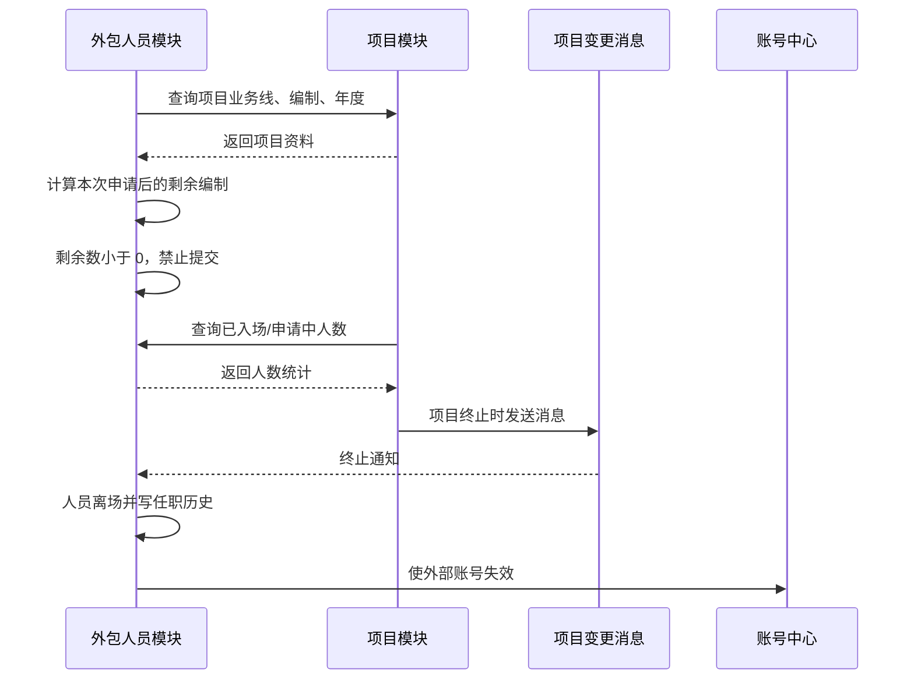

对应的关键代码位置：

- 人员申请按项目校验和查询项目编制：`OutsourcedStaffApplicationHandler`；
- 项目详情查询人员统计人数：`ProjectServiceImpl` 调用 `queryStaffApplyProject`；
- 人员统计已入场/申请中人数：`OutsourcedStaffQueryHandler`；
- 项目终止消息消费与人员离场处理：`StaffProjectCodeChangeListener`、`OutsourcedStaffProjectChangeRepositoryImpl`。

#### UAT 真实数据示例

以下是 2026-08-26 的 UAT 查询快照，查询使用了 `project_detail`（项目）、`outsourced_staff`（人员档案）两张表；未读取姓名、账号、联系方式或证件信息。

- 项目编号：`XM202600000153`；项目名称：**四川分公司线上渠道服务外包**；已审批版本的项目额度：442 人；项目年度：2024 至 2028。
- 当前人员档案中，关联该项目的记录有 442 名状态为 `0`（已入场）、7 名状态为 `-1`（未入场）、16 名状态为 `1`（已离场）。

通俗地说，这个项目相当于有 442 个已审批的在场名额；UAT 快照中恰好查到 442 名当前已入场人员。若再为该项目新增人员入场，系统会在申请阶段重新按项目编制和已有申请占用计算剩余数；剩余数不足时就不允许提交。

这条快照能直接证明项目额度和当前人员状态确实有关联；它**不能单独证明**某一时刻的“申请中人数”或每一次入场审批时的剩余名额，因为这两项由入离场申请记录计算，本次 UAT 未查询到对应表。

**关系要点：**项目管理“能招多少人、归哪个业务线”，人员模块管理“名额最终被谁占用”。项目并不保存每个人的完整档案。

### 2.2 计划/编制模块：用人员在场结果衡量计划执行

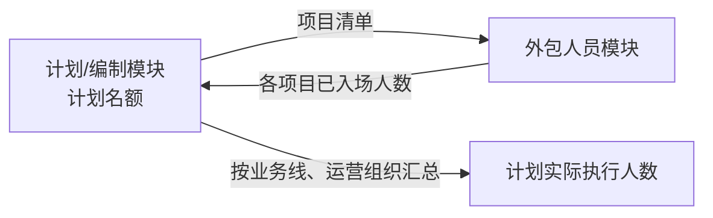

计划模块会按项目批量向人员模块查询已入场人数，再按业务线和运营组织汇总，展示计划对应的实际入场人数。

因此，计划模块不是直接逐个管理人员；它使用人员模块提供的统计结果回答“计划编制是否已经落地为真实在场人员”。

#### 代码如何实现

计划模块先查询某个计划年度下的项目清单，并按“业务线 + 运营组织”把这些项目分组；随后把所有项目编号一次性传给人员模块的批量查询方法。人员模块逐个项目统计已入场人数和申请中人数，返回项目维度的统计结果。计划模块最后只取每个项目的已入场人数，按原来的“业务线 + 运营组织”分组汇总并展示。

也就是说，计划模块并不保存人员名单，也不会自己根据档案逐条计算人数；它保存计划和项目的对应关系，人员模块保存入离场申请和人员状态，二者在查询时组合出“计划实际入场人数”。

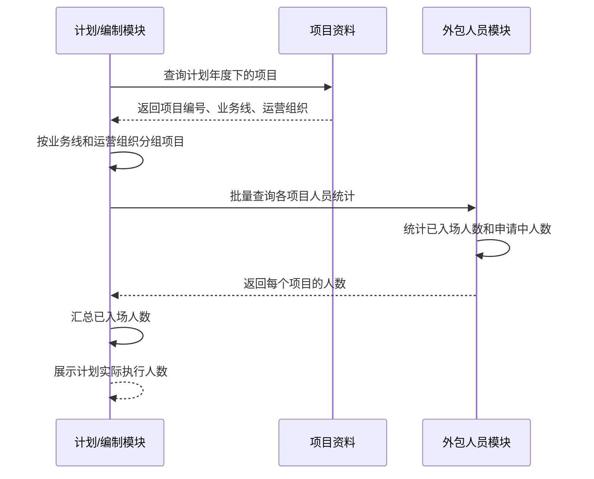

对应的关键代码位置：

- 计划模块批量调用人员统计：`PlanDetailServiceImpl` 调用 `outsourcedStaffService.queryStaffApplyProjects(projectIds)`；
- 人员模块按项目逐个返回统计：`OutsourcedStaffQueryHandler.queryStaffApplyProjects`；
- 单个项目的已入场/申请中人数来源：`OutsourcedStaffQueryHandler.queryStaffApplyProject` 查询入离场申请项目记录。

#### UAT 真实数据示例

以下是 2026-08-26 的 UAT 查询快照，查询使用了 `plan_detail`（计划明细）、`project_detail`（项目）和 `outsourced_staff`（人员档案）三张表；未读取个人信息。

- 2026 年计划明细中，业务线 `TX_XK`、运营组织 `215100000000` 的记录显示：分配额度为 200、使用额度为 500。
- 上述“**四川分公司线上渠道服务外包**”项目也属于同一业务线和运营组织；其已审批项目额度为 442，当前人员档案中有 442 名已入场人员。

通俗地说：计划明细先规定某个“业务线 + 运营组织”这一组可以使用多少编制；项目落在这个组里；人员再实际入场到项目中。页面需要看计划执行情况时，会先找到该组下的项目，再向人员模块查询各项目的人数并汇总，而不是直接拿计划额度当作已入场人数。

这条快照能直接证明计划、项目和人员能够通过相同的业务线与运营组织对应起来；它**不能单独证明**计划页面最终展示的“实际入场人数”必然是 442，因为代码中的该统计来自入离场申请项目记录，本次 UAT 未查询到对应表。计划额度字段的业务口径也应以计划模块说明为准，不能仅凭字段名推断为可用或已使用人数。

### 2.3 协议模块：协议是人员用工和结算的依据

人员档案记录协议编号及协议使用期间。人员详情查询时，系统会用协议模块的协议信息补齐协议名称、协议归属机构和供应商名称；按协议查询人员时，也会以人员的协议使用期间筛选。

协议发生终止或编号变更时，人员模块会接收相关消息并调整受影响的人员关系与历史记录。这里要区分两件事：

- 协议模块管理协议本身，例如协议期限和签约主体；
- 人员模块管理某个人在某段时间内实际使用该协议的事实。

#### 代码如何实现

人员详情查询时，人员模块先从人员档案取出协议编号，再批量调用协议服务查询协议详情；随后把协议名称、协议归属机构和协议乙方名称补到人员详情中。这是人员模块**主动查询协议**，不是协议模块主动把资料推给人员模块。

协议相关业务需要找人员时，则由协议编号和结算期间查询人员模块保存的任职变动记录。只有“人员实际使用该协议的期间”与结算期间重叠的记录才会保留，再按项目和协议期间去重。因此，协议模块使用的是人员模块维护的实际任职事实，而不是仅看当前人员档案。

协议续延或终止时，协议模块发送协议变更消息。人员模块监听后：续延会把仍在场人员的协议编号换成新协议编号，并写入任职变动；终止会把该协议下仍在场的人员改为离场、写入任职历史，并请求账号中心使外部账号失效。

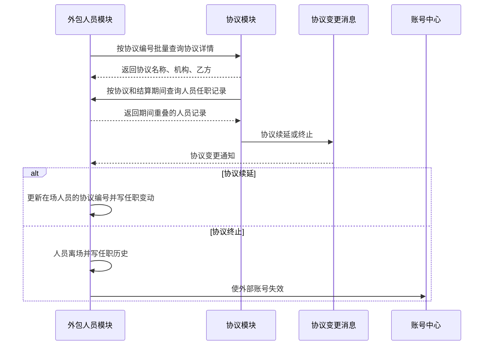

对应的关键代码位置：

- 人员详情批量查询并补齐协议信息：`OutsourcedStaffRPCServiceImpl`；
- 按协议和期间筛选人员任职记录：`OutsourcedStaffAgreementRepositoryImpl.queryBatchStaffDetailByAgreement`；
- 协议变更消息消费：`StaffAgreementNoChangeListener`；
- 协议续延、终止后的人员和账号处理：`OutsourcedStaffAgreementChangeRepositoryImpl`。

#### UAT 真实数据示例

以下是 2026-08-26 的 UAT 查询快照，查询使用了 `agreement`（协议）、`outsourced_staff_movement`（人员任职变动）和 `project_detail`（项目）三张表；未读取人员姓名、联系方式、证件号或账号。

- 协议编号：`H260709000000000000000121`；协议名称：**客服+理赔协议测试**；状态：`APPROVED`；协议期限：2026-07-09 至 2026-09-30。
- 项目编号：`XM202600000217`；项目名称：**理赔外包测试**；项目额度：10 人。
- 查到 1 条任职变动记录：状态 `0`（已入场），变动类型 `AGREEMENT`，入场日期为 2026-07-09；该记录同时关联上述协议和项目。

通俗地说：系统里已经有一名**不展示身份信息的外包人员**，在 2026-07-09 入场后，被安排到“理赔外包测试”项目，并使用“客服+理赔协议测试”这份协议。假设现在结算 **2026 年 8 月** 的服务费用：8 月处于该协议的有效期内，且这名人员的任职记录从 7 月 9 日起已生效，因此按协议和期间查询人员时，这条记录会落入该协议的人员范围，可继续按项目归集到“理赔外包测试”。

这条数据能直接证明“协议—人员任职记录—项目”三者存在实际关联；它**不能单独证明**某次结算已经生成、金额是多少，或该项目实际已使用了多少个名额。这些需要结合结算记录和完整申请数据另行确认。

### 2.4 供应商模块：供应商不是人员档案的直接控制方

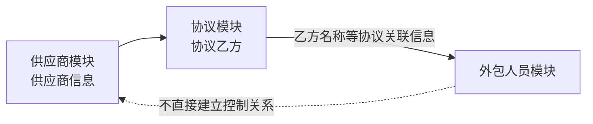

从现有代码可确认，人员详情中的供应商名称来自人员关联协议的乙方信息。也就是说，人员与供应商的业务联系通过**协议**建立：供应商信息先进入协议，再由协议供人员展示和使用。

因此不能简单理解为“一个供应商直接拥有一批人员”。人员是否能在场，仍由其项目归属、协议使用情况和入离场审批共同决定。

### 2.5 审批流程中心：决定申请能否生效

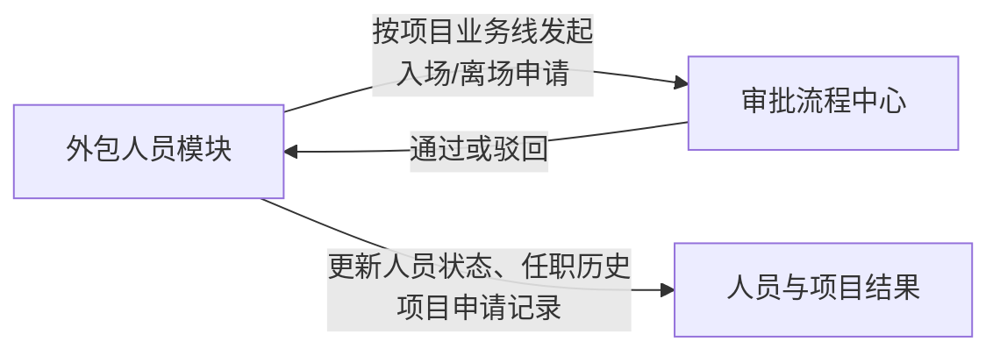

人员模块按项目所属业务线发起“外包人员入场申请”或“外包人员离场申请”。审批流程中心只负责流程处理并回传通过或驳回结果；人员模块才据此更新人员状态、保存任职变动，并同步项目申请记录。

日常说，审批中心负责“批不批准”，人员模块负责“批准后这批人到底入场还是离场”。

### 2.6 组织、权限与账号中心：分别决定“能看谁”和“能否登录”

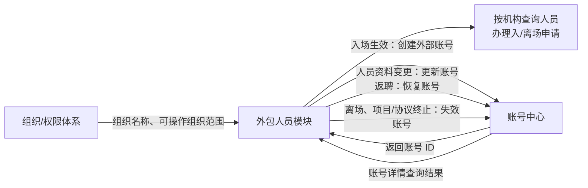

组织信息用于补齐人员所属机构、运营机构和工作地点等名称，并支持按机构向下查询人员。人员查询还会按照运营机构范围和业务线范围过滤；入离场申请也携带可操作的组织范围。具体的组织与角色授权由权限体系维护，人员模块只使用其结果。

账号中心负责外包人员的外部账号（可理解为工号/登录账号）。新人员在**入场审批通过且到达申请入场日期后**，人员模块带着人员姓名、手机、机构、照片等信息请求账号中心创建外部账号，并保存返回的账号 ID；如果入场日期还未到，人员先处于“审批通过待入场”状态，账号会在后续定时处理时创建。已离场人员返聘时，人员模块请求恢复账号；在场人员资料变更时，会同步更新账号资料；正常离场，以及项目或协议终止导致的离场时，会请求账号中心将账号失效。

代码中确实存在“账号中心账号变更消息”的监听配置，但实际处理逻辑仍标注为 `TODO`，且无人员状态更新。因此，目前只能确认人员模块会接收这类消息，**不能确认账号中心已能反向自动触发人员被动离场**。账号中心也不管理人员的项目归属、协议归属或项目编制。

### 2.7 其他系统：把人员模块作为人员与任职信息的查询来源

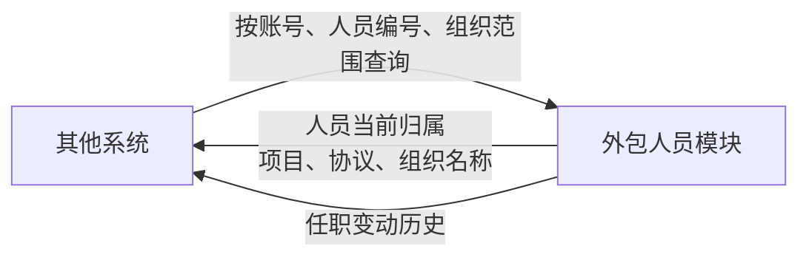

人员模块发布对外查询能力，可按账号、人员编号、组织范围或条件分页查询人员详情，也可查询任职变动历史。返回内容会补齐项目、协议和组织的可读名称，供调用方使用。

这说明人员模块是“外包人员当前归属和历史任职”的查询出口；调用方通常读取结果，不应绕过它自行拼接人员状态。

## 3. 外包人员入离场流程：按阶段和代码顺序

创建外包人员不是“直接入场”。系统先保存人员档案，并将人员状态固定为 **待入场**（状态码 `-1`）。此时人员已经具备项目、协议和组织等归属信息，但还没有占用已入场人数、没有外部账号，也不会生成任职变动记录；只有后续入场申请真正生效后，才会形成在场事实。

### 3.1 待入场时需要做什么

这一阶段对应创建人员档案，代码按以下顺序执行：

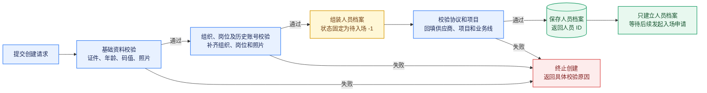

会议上可以把这张图概括成一句话：**先完成资料和业务归属校验，再以待入场状态建立人员档案；此时只是“建档”，还没有真正入场。**

1. 校验创建请求及登录信息；未关联历史内部账号时，照片不能为空。
2. 校验证件号码与年龄是否匹配。
3. 校验学历、政治面貌、业务分类、民族等码值是否合法。
4. 校验并补齐归属部门、经营组织等组织信息。
5. 校验工作岗位，并补齐工作地点、自动授权标识和标准岗位编码。
6. 如果确认关联历史内部账号，重新校验账号与本次证件是否一致、账号是否已被其他外包人员占用；未上传照片时，从内部账号补充照片。
7. 将请求转换成人员档案实体，并把人员状态固定为 **待入场**（`-1`）。
8. 查询已审批协议；协议不存在时终止创建，存在时将协议乙方回填为供应商。
9. 查询项目；项目不存在时终止创建，存在时回填项目编号和业务线。
10. 保存人员档案并返回人员 ID。

保存成功后只代表人员档案已建立：此时**不创建外部账号、不写任职变动、不计入已入场人数，也不能办理离场**。人员资料可以继续修改；没有未完成入场申请时可以删除。

### 3.2 入场前需要做什么

这一阶段从选择待入场人员发起申请开始，到申请提交审批结束，代码按以下顺序执行：

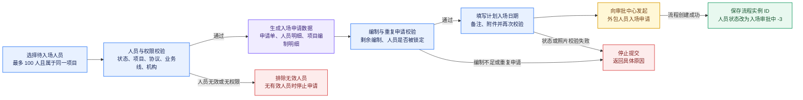

会议上可以把这张图概括成一句话：**入场前先筛出符合条件的待入场人员，生成并校验入场申请和项目编制，再提交审批；提交成功后只是进入审批中，还没有真正入场。**

1. 根据人员 ID 查询人员；人员不存在则终止。同一批最多选择 100 人，而且必须归属同一个项目。
2. 查询人员关联的项目、已审批协议、业务线权限和组织管理路径。
3. 逐人校验状态、项目、协议、业务线权限和机构权限；入场审批中、审批通过待入场、已入场或离场流程中的人员会被排除。
4. 只保留待入场人员；返聘场景同时允许已离场人员。
5. 为有效人员创建状态为初始化的入场申请单。
6. 再次查询项目编制，排除项目不存在的人员，并检查人员是否已被其他未完成的入场申请锁定。
7. 生成申请人员明细，记录人员、项目、协议和待处理状态。
8. 生成申请项目编制明细：记录项目总编制、既有申请占用、本次申请人数和本次申请后的剩余编制。
9. 业务人员填写计划入场日期、备注和附件后提交审批。
10. 提交时重新校验申请单状态，并读取申请人员明细和项目编制明细。
11. 校验本次申请后的剩余编制不能小于 0。
12. 再次逐人校验照片和人员状态，防止人员资料或状态在发起申请后发生变化。
13. 保存附件，按项目业务线向审批中心发起“外包人员入场申请”。
14. 保存审批流程实例 ID，将申请单改为审批中，并把人员状态从待入场改为“入场审批中”（`-3`）。

如果申请被驳回、取消或放弃，人员会恢复为待入场，可以补充资料后重新申请。

### 3.3 入场审批通过后需要做什么

这一阶段从入场审批通过开始，到人员正式入场生效结束，代码按以下顺序执行：

```mermaid
flowchart LR
    A[审批中心回传通过] --> B{计划入场日期<br/>是否已经到达}
    B -->|未到| C[人员状态改为<br/>审批通过待入场 -2]
    C --> D[定时任务等待并扫描<br/>已批准且日期已到的申请]
    D --> E[开始正式入场生效<br/>写实际入场和默认离场日期]
    B -->|已到| E
    E --> F[创建外部账号<br/>返聘人员恢复已有账号]
    F -->|账号处理成功| G[申请人员明细改为成功<br/>人员状态改为已入场 0]
    G --> H[新增任职变动记录<br/>保存项目、协议和任职期间]
    H --> I[发送人员变更消息<br/>更新入场申请最终状态]

    F -->|账号处理失败| X[记录失败原因<br/>发送失败通知]
    G -->|单个人员处理失败| X

    classDef action fill:#E8F1FF,stroke:#3B82F6,color:#172554,stroke-width:1.5px;
    classDef pending fill:#FFF7D6,stroke:#D99A00,color:#713F12,stroke-width:1.5px;
    classDef success fill:#E8F8EF,stroke:#22A06B,color:#14532D,stroke-width:1.5px;
    classDef message fill:#F0ECFF,stroke:#7C5CFC,color:#3B2677,stroke-width:1.5px;
    classDef fail fill:#FDECEC,stroke:#DC4C4C,color:#7F1D1D,stroke-width:1.5px;
    class A,E,F action;
    class B,C,D pending;
    class G,H success;
    class I message;
    class X fail;
```

会议上可以把这张图概括成一句话：**审批通过后先判断计划入场日期；日期到达后才创建或恢复账号，并把人员状态、任职记录和下游消息一次处理到正式入场结果。**

1. 读取入场申请、申请人员明细和人员档案，判断计划入场日期是否已经到达。
2. 如果日期未到，将人员状态改为“审批通过待入场”（`-2`），将申请单改为已批准，等待定时任务。
3. 定时任务查询“已批准且计划入场日期小于等于当前日期”的入场申请，并重新进入入场处理。
4. 日期已到时，写入实际入场日期，并设置人员的默认离场日期。
5. 人员没有外部账号时，请求账号中心创建账号并保存账号 ID；已有账号的返聘人员请求账号中心恢复账号。
6. 将申请人员明细更新为处理成功。
7. 将人员状态更新为“已入场”（`0`）。
8. 新增任职变动记录，保存本次实际生效的项目、协议和任职期间。
9. 发送外包人员变更消息，通知下游人员已经正式入场。
10. 全部人员处理完成后，更新入场申请单最终状态；单个人员失败时记录失败原因并发送失败通知。

完成以上处理后，项目和计划模块再次查询人数时，该人员才会按“已入场”口径计入项目实际在场人数和计划实际执行人数。

### 3.4 离场审批通过后需要做什么

这一阶段从离场审批通过开始，到人员正式离场并释放项目编制结束，代码按以下顺序执行：

```mermaid
flowchart LR
    A[离场审批通过] --> B{计划离场日期<br/>是否早于当前日期}
    B -->|否，包含等于当天| C[人员状态改为<br/>审批通过待离场 3]
    C --> D[定时任务等待并扫描<br/>已批准且日期早于当天的申请]
    D --> E[开始正式离场处理]
    B -->|是| E

    E --> F{查询外部账号状态}
    F -->|已经失效| G[账号处理完成]
    F -->|仍有效或查询异常| H[请求账号中心<br/>使外部账号失效]
    H -->|处理成功| G
    G --> I[明细改为成功<br/>保存历史手机号并替换当前手机号]
    I --> J[写实际离场日期<br/>人员状态改为已离场 1]
    J --> K[新增离场任职记录<br/>发送人员变更消息]
    K --> L[更新离场申请结果<br/>写正数编制明细释放名额]

    H -->|账号失效失败| X[记录失败原因并通知<br/>离场申请最终标记失败]
    I -->|单个人员处理失败| X

    classDef action fill:#E8F1FF,stroke:#3B82F6,color:#172554,stroke-width:1.5px;
    classDef pending fill:#FFF7D6,stroke:#D99A00,color:#713F12,stroke-width:1.5px;
    classDef success fill:#E8F8EF,stroke:#22A06B,color:#14532D,stroke-width:1.5px;
    classDef message fill:#F0ECFF,stroke:#7C5CFC,color:#3B2677,stroke-width:1.5px;
    classDef fail fill:#FDECEC,stroke:#DC4C4C,color:#7F1D1D,stroke-width:1.5px;
    class A,E,F,H,I action;
    class B,C,D pending;
    class G,J success;
    class K,L message;
    class X fail;
```

会议上可以把这张图概括成一句话：**离场审批通过后不会立即离场，只有计划离场日期早于当天才正式失效账号、更新人员和任职状态、通知下游并释放项目编制。**

1. 读取离场申请、申请人员明细和人员档案，判断计划离场日期是否已经满足生效条件。
2. 如果计划离场日期尚未早于当前日期，将人员状态改为“审批通过待离场”（`3`），将申请单改为已批准，等待定时任务。
3. 定时任务查询“已批准且计划离场日期早于当前日期”的离场申请，并重新进入离场处理。按当前代码，计划离场日期等于当天时仍属于待离场，到下一次满足“早于当前日期”后才正式生效。
4. 查询账号中心的账号状态：账号已经失效则跳过；账号仍有效时请求账号中心使外部账号失效；查询账号状态异常时也会继续尝试失效，避免离场流程被查询异常卡住。
5. 账号处理完成后，将申请人员明细更新为处理成功。
6. 保存原手机号到历史手机号，并用新的占位值替换当前手机号；写入实际离场日期，将人员状态更新为“已离场”（`1`），同时清除人员来源标识。
7. 新增离场任职变动记录，结束本次项目、协议和任职期间。
8. 发送外包人员变更消息，通知下游人员已经离场。
9. 全部人员处理完成后，将离场申请单更新为成功；单个人员失败时记录失败原因并发送失败通知，申请单最终标记为失败。
10. 按项目新增离场编制明细，本次离场人数以正数写入，用于释放此前占用的项目编制。

离场生效后，人员不再按“已入场”口径计入项目和计划的实际在场人数；历史任职记录和原手机号仍保留，用于后续查询及返聘处理。

## 4. 一次入场，关系如何串起来

假设“客服外包项目”还有 1 个可用名额，王某的档案已关联该项目和一份有效协议。

1. 人员模块读取王某的项目归属，确认同批申请人员都属于该项目。
2. 它根据项目给出的业务线发起入场审批，并检查照片、人员当前状态和剩余编制。
3. 审批中心回传通过后，如入场日期已到，人员模块创建或恢复外部账号、把王某更新为已入场并写入任职变动记录；如日期未到，则先保留为审批通过待入场，待日期到达后再生效。
4. 项目模块查询时，看到该项目的已入场人数增加；计划模块汇总时，也把这 1 人计入对应业务线和组织的实际入场人数。
5. 协议模块在按协议查询人员或进行相关处理时，可以识别王某实际使用该协议的期间。

这个例子里，项目、协议、审批各自没有被人员模块替代：人员模块只是把它们共同作用的结果落实到了王某身上。

## 5. 使用与维护注意事项

- 修改人员项目或协议时，要同时关注任职历史，不能只看当前档案；历史记录用于还原人员曾在哪个项目、使用哪份协议。
- 新建人员默认是待入场，不代表已占用项目实际在场名额；必须经入场申请、审批和日期生效后才成为已入场人员。
- 项目编制是入场校验的重要前提。项目可用名额不足时，不能仅靠修改人员状态绕过入场流程。
- 协议终止、项目到期或终止会影响已关联人员，应检查消息处理和人员状态是否完成同步。
- 组织范围用于查询和办理申请时的范围控制；它与“人员属于哪个项目”“协议属于哪个供应商”是不同维度，不能混为同一种关系。
- 当前代码能确认人员模块接收项目、协议和账号变更消息；这些消息的跨系统投递可靠性及数据库外键约束，需结合运行配置和数据库结构另行确认。

## 6. 总结

外包人员模块是外包用工链路的执行台账：

- **项目**给名额和业务归属；
- **协议**给用工和结算依据；
- **审批**决定入离场申请是否生效；
- **人员模块**保存每个人最终的在场状态、项目/协议归属和任职历史；
- **项目与计划**再使用这些结果观察编制的实际占用。

所以它既是项目、协议等主数据的使用者，也是“实际在场人数”和“人员任职事实”的提供者。
