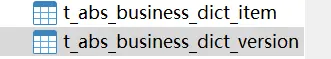

https://cic_irc.yuque.com/tyl581/ggwv9w/zq2bvyf7m8edkkli



# pom坐标

```
<dependency>
  <groupId>com.aliyun.fsi.insurance</groupId>
  <artifactId>aboss-code-client</artifactId>
  <version>1.4.0-RELEASE</version>
</dependency>
```

# 1.根据业务码表获取版本列表

**URL:** `/platform/api/aboss/basic-code/front/query-dict-version-list`

**Type:** `POST`

**Author:** zhanghua

**Content-Type:** `application/json; charset=utf-8`

**Description:** com.aliyun.fsi.insurance.dict.api.BusinessCodeRPCFacade#queryDictVersionList(com.aliyun.fsi.insurance.dict.dto.request.code.BusinessDictVersionListQry)

  

  

**Body-parameters:**

|   |   |   |   |   |
|---|---|---|---|---|
|Parameter|Type|Description|Required|Since|
|typeCode|string|码表|true|-|

**Request-example:**

```
curl -X POST -H 'Content-Type: application/json; charset=utf-8' -i /platform/api/aboss/basic-code/front/query-dict-version-list --data '{
  "typeCode": "38985"
}'
```

**Response-fields:**

|   |   |   |   |
|---|---|---|---|
|Field|Type|Description|Since|
|typeCode|string|业务码表|-|
|version|string|业务码表版本号|-|
|versionDesc|string|业务码表版本号描述|-|
|isLatest|int32|是否最新版本(0:不是，1：是)|-|
|ossUrl|string|oss地址|-|

**Response-example:**

```
[
  {
    "typeCode": "38985",
    "version": "0.37",
    "versionDesc": "qttwb1",
    "isLatest": 999,
    "ossUrl": "www.herta-rempel.info"
  }
]
```

# 2.根据业务码表获取版本详情（不传版本号将获取最新版本详情）

  

**URL:** `/platform/api/aboss/basic-code/front/query-dict-detail`

**Type:** `POST`

**Author:** zhanghua

**Content-Type:** `application/json; charset=utf-8`

**Description:** com.aliyun.fsi.insurance.dict.api.BusinessCodeRPCFacade#queryDictDetail(com.aliyun.fsi.insurance.dict.dto.request.code.BusinessDictQry)

**Body-parameters:**

|   |   |   |   |   |
|---|---|---|---|---|
|Parameter|Type|Description|Required|Since|
|typeCode|string|码表|true|-|
|version|string|版本号|false|-|

  

**Request-example:**

```
curl -X POST -H 'Content-Type: application/json; charset=utf-8' -i /platform/api/aboss/basic-code/front/query-dict-detail --data '{
  "typeCode": "83509",
  "version": "6.94"
}'
```

  

**Response-fields:**

|   |   |   |   |
|---|---|---|---|
|Field|Type|Description|Since|
|typeCode|string|业务码表|-|
|version|string|业务码表版本号|-|
|versionDesc|string|业务码表版本号描述|-|
|isLatest|int32|是否最新版本(0:不是，1：是)|-|
|ossUrl|string|oss地址|-|

  

**Response-example:**

```
{
  "typeCode": "83509",
  "version": "6.94",
  "versionDesc": "wal9wo",
  "isLatest": 835,
  "ossUrl": "www.arthur-effertz.net"
}
```

  

# 3.根据标准码值查询业务码值

**URL:** `/platform/api/aboss/basic-code/front/query-dict-item-by-standard-code`

**Type:** `POST`

**Author:** zhanghua

**Content-Type:** `application/json; charset=utf-8`

**Description:** com.aliyun.fsi.insurance.dict.api.BusinessCodeRPCFacade#queryDictItemByStandardCode(com.aliyun.fsi.insurance.dict.dto.request.code.StandardCodeQry)

  

**Body-parameters:**

|   |   |   |   |   |
|---|---|---|---|---|
|Parameter|Type|Description|Required|Since|
|typeCode|string|码表|true|-|
|standardCode|string|标准码值code|true|-|
|version|string|版本号|true|-|

  

**Request-example:**

```
curl -X POST -H 'Content-Type: application/json; charset=utf-8' -i /platform/api/aboss/basic-code/front/query-dict-item-by-standard-code --data '{
  "typeCode": "83509",
  "standardCode": "83509",
  "version": "6.94"
}'
```

  

**Response-fields:**

|   |   |   |   |
|---|---|---|---|
|Field|Type|Description|Since|
|code|string|业务码值|-|
|name|string|业务码值名称|-|
|parentCode|string|父级业务码值|-|
|standardCode|string|标准码值|-|
|externalInfo|Map<String,Object>|业务拓展信息(json格式)|-|

  

**Response-example:**

```
{
  "code": "83509",
  "name": "sol.douglas",
  "parentCode": "83509",
  "standardCode": "83509",
  "externalInfo": {"riskLevel":"1"}
}
```

  

# 4.根据业务码值查询标准码值

**URL:** `/platform/api/aboss/basic-code/front/query-dict-item-by-business-code`

**Type:** `POST`

**Author:** zhanghua

**Content-Type:** `application/json; charset=utf-8`

**Description:** com.aliyun.fsi.insurance.dict.api.BusinessCodeRPCFacade#queryDictItemByBusinessCode(com.aliyun.fsi.insurance.dict.dto.request.code.BusinessDictItemQry)

  

**Body-parameters:**

|   |   |   |   |   |
|---|---|---|---|---|
|Parameter|Type|Description|Required|Since|
|typeCode|string|码表|true|-|
|businessCode|string|业务码值code|true|-|
|version|string|版本号|true|-|

  

**Request-example:**

```
curl -X POST -H 'Content-Type: application/json; charset=utf-8' -i /platform/api/aboss/basic-code/front/query-dict-item-by-business-code --data '{
  "typeCode": "83509",
  "businessCode": "83509",
  "version": "6.94"
}'
```

  

**Response-fields:**

|   |   |   |   |
|---|---|---|---|
|Field|Type|Description|Since|
|code|string|业务码值|-|
|name|string|业务码值名称|-|
|parentCode|string|父级业务码值|-|
|standardCode|string|标准码值|-|
|externalInfo|Map<String,Object>|业务拓展信息(json格式)|-|

  

**Response-example:**

```
{
  "code": "83509",
  "name": "sol.douglas",
  "parentCode": "83509",
  "standardCode": "83509",
  "externalInfo": {"riskLevel":"1"}
}
```

# 5.根据业务码表获取业务码值信息集合

**URL:** `/platform/api/aboss/basic-code/front/query-dict-items`

**Type:** `POST`

**Author:** zhanghua

**Content-Type:** `application/json; charset=utf-8`

**Description:** com.aliyun.fsi.insurance.dict.api.BusinessCodeRPCFacade#queryDictItems(com.aliyun.fsi.insurance.dict.dto.request.code.BusinessDictItemsQry)

  

**Body-parameters:**

|   |   |   |   |   |
|---|---|---|---|---|
|Parameter|Type|Description|Required|Since|
|typeCode|string|码表|true|-|
|version|string|版本号|true|-|

  

**Request-example:**

```
curl -X POST -H 'Content-Type: application/json; charset=utf-8' -i /platform/api/aboss/basic-code/front/query-dict-items --data '{
  "typeCode": "83509",
  "version": "6.94"
}'
```

  

**Response-fields:**

|   |   |   |   |
|---|---|---|---|
|Field|Type|Description|Since|
|code|string|业务码值|-|
|name|string|业务码值名称|-|
|parentCode|string|父级业务码值|-|
|standardCode|string|标准码值|-|
|externalInfo|Map<String,Object>|业务拓展信息(json格式)|-|

  

**Response-example:**

```
[
  {
    "code": "83509",
    "name": "sol.douglas",
    "parentCode": "83509",
    "standardCode": "83509",
    "externalInfo": {"riskLevel":"1"}
  }
]
```
