https://cic_irc.yuque.com/tyl581/ggwv9w/gg0w87ex0pgmxp2t


## 依赖信息

---

```
<dependency>
  <groupId>com.aliyun.fsi.insurance</groupId>
  <artifactId>message-core-facade</artifactId>
  <version>1.2.0-RELEASE</version>
</dependency>
```

  

## API

---

### 消息发送

##### API

`com.aliyun.fsi.insurance.messagecore.facade.api.MessageRpcFacade#send`

|   |   |   |
|---|---|---|
|参数|含义|是否必填|
|receiverList|接收人列表，最多100个工号|是|
|appId|应用Id，在应用管理平台查看应用|是|
|channelCode|渠道code，消息中心渠道的code|是|
|bizId|业务id|是|
|messageType|消息类型(IMAGE,LINK,TEMPLATE,TEXT，<br><br>ACTION_CARD,MARKDOWN)|是|
|content|消息的内容|是|
|templateCd|消息模板code|消息类型为模板的时候必须|
|linkUrl|消息链接|消息类型为链接消息时候必须|
|text|消息文本|消息类型为文本消息，链接消息时候必须 500 字符之内|
|title|消息标题|是，除了模板消息，都是必须的 100字符之内|
|context|消息上下文，用于替换消息占位符|否|

建议使用如下示例代码进行消息发送

##### 示例

使用 MessageBuilder 进行消息入参的设定

###### 站内信文本消息发送示例

```

//文本消息BO
TextBO textBO = new TextBO();
//消息上下文信息，用于存储变量，用于替换占位符${}信息,如果消息内容没有占位符信息，那么就不用msgContext
Map<String, Object> msgContext = new HashMap<>();
msgContext.put("myMsg","第一个消息发送");
textBO.setContext(msgContext);
textBO.setText("这是我的第一个消息,消息内容是${myMsg}");
textBO.setTitle("消息标题");
MessageRequest<TextBO> request = MessageBuilder.internalTextMessage(textBO, "应用平台的APPID,在应用管理可以看到", "自己业务的唯一单号");
//接收人
ArrayList<String> accIds = new ArrayList<>();
accIds.add("100010501");
request.setReceiverList(accIds);        
messageRpcFacade.send(request);
```

  

  

###### 站内信链接消息发送示例

```
//链接消息BO
LinkBO linkBO = new LinkBO();
linkBO.setText("这是我的第一个消息");
linkBO.setTitle("link消息标题");
linkBO.setLinkUrl("http://www.baidu.com");
MessageRequest<LinkBO> request = MessageBuilder.internalLinkMessage(linkBO, "应用平台的APPID,在应用管理可以看到", "自己业务的唯一单号");
//接收人
ArrayList<String> accIds = new ArrayList<>();
accIds.add("zhex2023121400001510");
request.setReceiverList(accIds);
messageRpcFacade.send(request);
```

  

###### 站内信模板消息发送示例

```

//模板消息BO
TemplateBO templateBO = new TemplateBO();
//消息上下文信息，用于存储变量
//消息上下文信息，用于存储变量，用于替换占位符${}信息,如果消息内容没有占位符信息，那么就不用msgContext
Map<String, Object> msgContext = new HashMap<>();
msgContext.put("myMsg","第一个消息发送");
templateBO.setContext(msgContext);
templateBO.setTemplateCd("模板ID,在消息中心进行配置的ID");
//如果模版里配置的调用方传入，则需要给LinkUrl赋值
//如果模版里配置的是固定链接，则不需要给LinkUrl赋值
templateBO.setLinkUrl("http://ww.xs.ds?id=${myId}");
templateBO.setTitle("消息标题");
MessageRequest<TemplateBO> request = MessageBuilder.internalTemplateMessage(templateBO, "应用平台的APPID,在应用管理可以看到", "自己业务的唯一单号");
//接收人
ArrayList<String> accIds = new ArrayList<>();
accIds.add("100010501");
request.setReceiverList(accIds);       
messageRpcFacade.send(request);
```

  

  

  

  

###### 其他渠道文本消息发送示例（钉钉）

```
//文本消息BO
TextBO textBO = new TextBO();
//消息上下文信息，用于存储变量，用于替换占位符${}信息,如果消息内容没有占位符信息，那么就不用msgContext
Map<String, Object> msgContext = new HashMap<>();
msgContext.put("myMsg","第一个消息发送");
textBO.setContext(msgContext);
textBO.setText("这是我的第一个消息,消息内容是${myMsg}");
textBO.setTitle("消息标题");
MessageRequest<TextBO> request = MessageBuilder.text(textBO,"MC10001消息中心配置的渠道","应用平台的APPID,在应用管理可以看到", "自己业务的唯一单号");
//接收人
ArrayList<String> accIds = new ArrayList<>();
accIds.add("100010501");
request.setReceiverList(accIds);        
messageRpcFacade.send(request);
```

  

###### 其他渠道模板消息发送示例（钉钉消息）

```
TemplateBO templateBO = new TemplateBO();
//消息上下文信息，用于存储变量
//消息上下文信息，用于存储变量，用于替换占位符${}信息,如果消息内容没有占位符信息，那么就不用msgContext
Map<String, Object> msgContext = new HashMap<>();
msgContext.put("myId","10086110");
templateBO.setContext(msgContext);
templateBO.setTemplateCd("模板ID,在消息中心进行配置的ID");
//如果模版里配置的调用方传入，则需要给LinkUrl赋值
//如果模版里配置的是固定链接，则不需要给LinkUrl赋值
templateBO.setLinkUrl("http://www.baidu.com?search=${myId}");
templateBO.setTitle("消息标题");
MessageRequest<TemplateBO> request = MessageBuilder.template(templateBO, "MC10001消息中心配置的渠道","应用平台的APPID,在应用管理可以看到", "自己业务的唯一单号");
//接收人
ArrayList<String> accIds = new ArrayList<>();
accIds.add("100010501");
request.setReceiverList(accIds);
messageRpcFacade.send(request);
```

###### 其他渠道图片消息发送示例（钉钉消息）

```
//图片消息BO
ImageBO imageBO = new ImageBO();
//消息上下文信息，用于存储变量，用于替换占位符${}信息,如果没有${}，那么就不用msgContext
Map<String, Object> msgContext = new HashMap<>();
msgContext.put("myMsg", "第一个消息发送");
imageBO.setContext(msgContext);
imageBO.setImageUrl("http://xinyidai-static-oss-nonprod.oss-cn-dalian-cic-d01-a.ops.cloud.cic.inter/public/2024-07-25/172918693/banner%E5%85%A5%E5%8F%A3%402x.png");
imageBO.setTitle("消息标题${myMsg}");
MessageRequest<ImageBO> request = MessageBuilder.image(imageBO,"MC10001消息中心配置的渠道","应用平台的APPID,在应用管理可以看到","自己业务的唯一单号");
//接收人
ArrayList<String> accIds = new ArrayList<>();
accIds.add("zhex2023121400001510");
request.setReceiverList(accIds);
messageRpcFacade.send(request);
```

  

  

###### 其他渠道卡片消息发送示例（钉钉消息）

```
void send() {
    ActionCardBO actionCardBO = new ActionCardBO();
    actionCardBO.setMarkdown("标题  \n   # 一级标题  \n   ## 二级标题  \n   ### 三级标题  \n   #### 四级标题  \n   ##### 五级标题  \n   ###### 六级标题  \n  > A man who stands for nothing will fall for anything.  \n  **bold**  *italic*  \n  [this is a link](http://www.baidu.com)");
    actionCardBO.setTitle("是透出到会话列表和通知的文案");
    actionCardBO.setSingleTitle("查看详情");
    actionCardBO.setSingleUrl("https://open.dingtalk.com");
    MessageRequest<ActionCardBO> request = MessageBuilder.actionCard(actionCardBO,"MC10001消息中心配置的渠道","应用平台的APPID,在应用管理可以看到","自己业务的唯一单号");
    //接收人
    ArrayList<String> accIds = new ArrayList<>();
    accIds.add("zhex2023121400001510");
    request.setReceiverList(accIds);
    messageRpcFacade.send(request);
}
```

  

###### 其他渠道markdown消息发送示例（钉钉消息）

```
   void send() {
        MarkDownBO markDownBO = new MarkDownBO();
        markDownBO.setText("标题  \n   # 一级标题  \n   ## 二级标题  \n   ### 三级标题  \n   #### 四级标题  \n   ##### 五级标题  \n   ###### 六级标题  \n  > A man who stands for nothing will fall for anything.  \n  **bold**  *italic*  \n  [this is a link](http://www.baidu.com)");
        markDownBO.setTitle("首屏会话透出的展示内容");
        MessageRequest<MarkDownBO> request = MessageBuilder.markDown(markDownBO,"MC10001消息中心配置的渠道","应用平台的APPID,在应用管理可以看到","自己业务的唯一单号");
        //接收人
        ArrayList<String> accIds = new ArrayList<>();
        accIds.add("zhex2023121400001510");
        request.setReceiverList(accIds);
        messageRpcFacade.send(request);
    }
```

  

## 接入步骤

##### 1. 钉钉消息

1.消息渠道管理 建立渠道

MC2466176 MC3190784 没有消息渠道暂时使用俩个code，后续会将新增渠道附上说明

没有该菜单找 孙快快 老师开权限

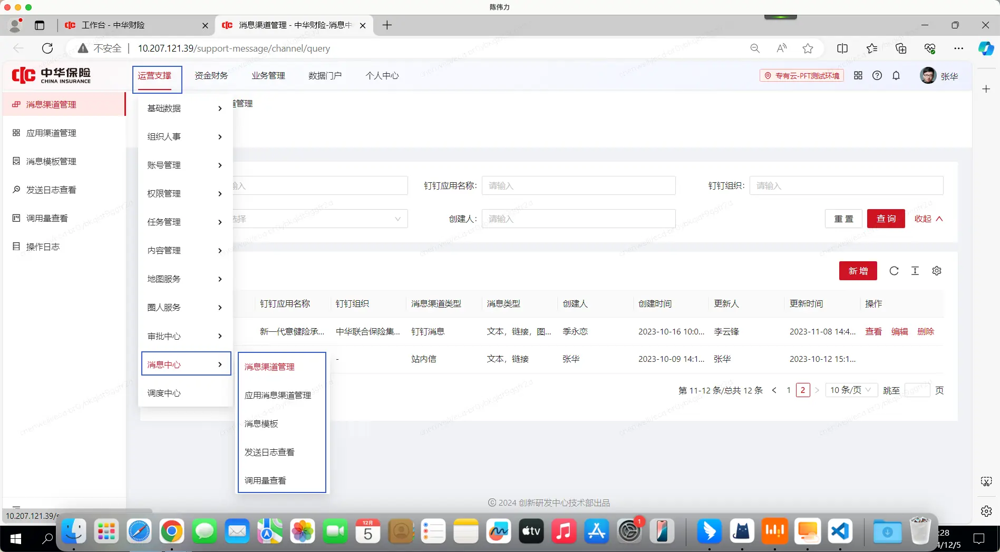

选择消息渠道管理

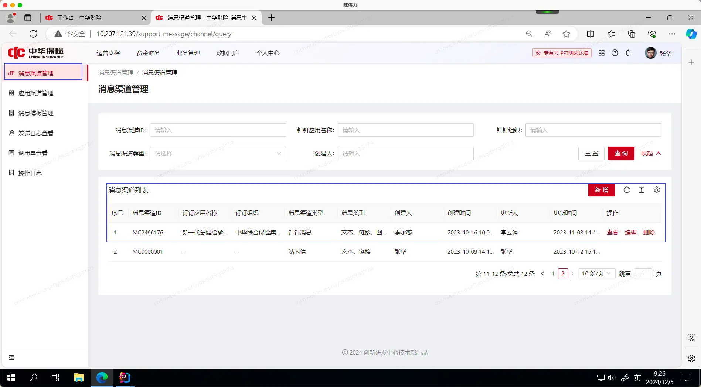

  

2.应用消息渠道管理 进行（appid）应用与渠道的关联，不关联会报（无有效的消息渠道，请核对后再进行消息发送）

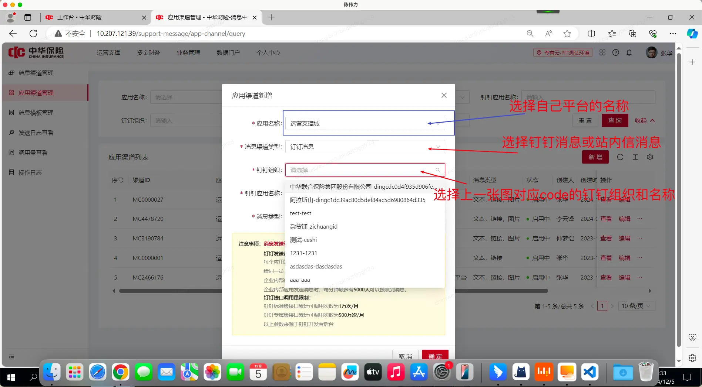

  

选择自己配制好的 应用渠道，点击发送测试

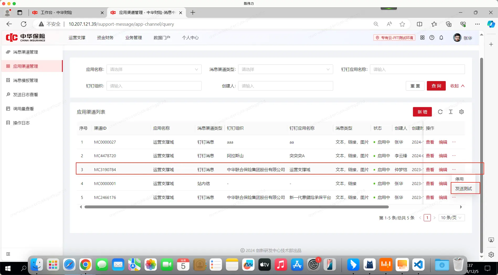

  

根据上面的信息填写你需要发送的消息

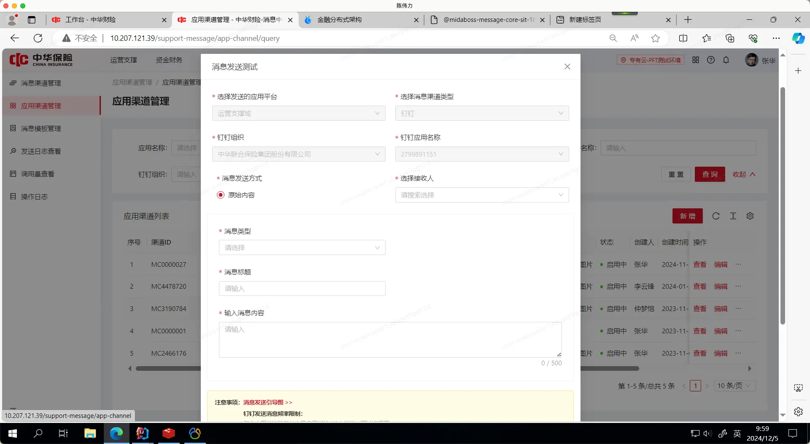

  

  

如果发送的是模版消息，先配置模版，页面消息发送暂时只支持（站内信模版文本消息和站内信模版链接消息）

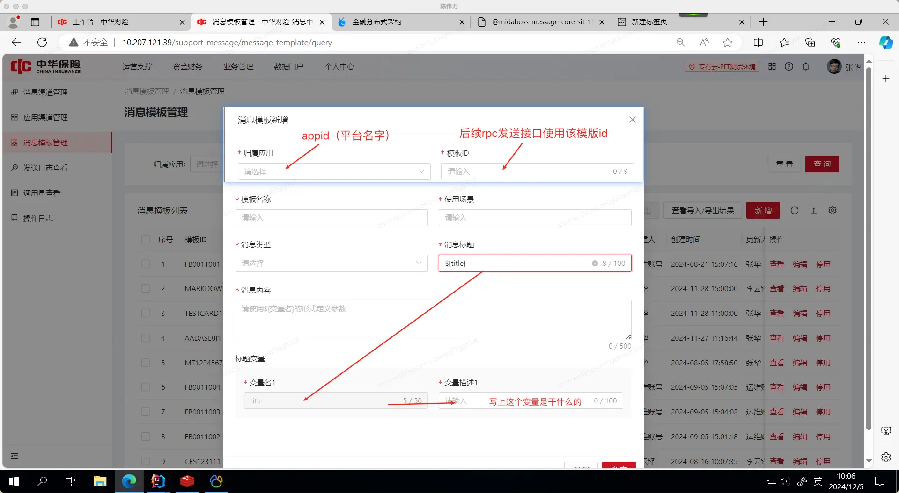

##### 2.站内信（消息中心内置的渠道）

1.应用消息渠道管理 进行应用（APPID）与渠道的关联。

站内信统一渠道id为 MC0000001

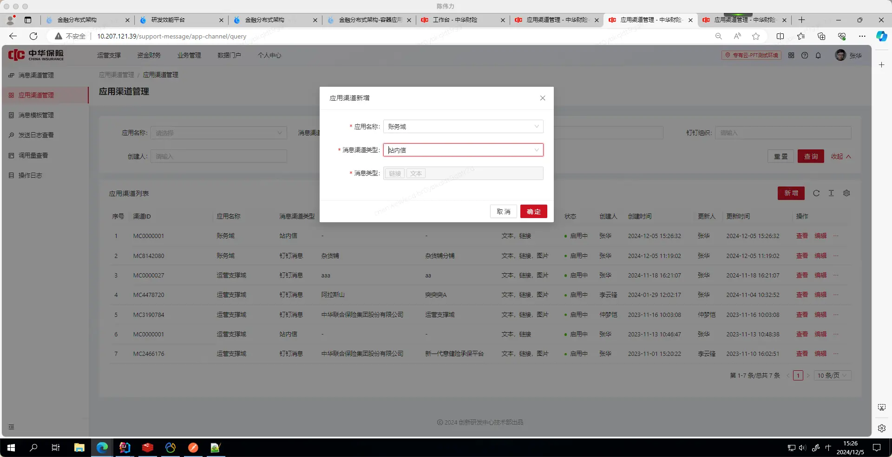

  

## FAQ

###### APPID 在哪里获取

如下为APPID 与应用的映射关系

|   |   |
|---|---|
|APPID|应用名称|
|D010001|数据大学|
|D010002|标签运营管理平台|
|D010003|统一数据服务平台|
|D010004|智慧决策平台|
|D010005|自助分析平台|
|D010006|数据门户|
|D010007|数据标准平台|
|D010008|经营分析平台|
|D010009|高管驾驶舱平台|
|M010001|客户域|
|M010002|履约域|
|M010003|标的域|
|M010004|账务域|
|M010005|支付结算域|
|M010006|合作开放域|
|M010007|单证域|
|M010008|运营支撑域|
|M010009|产品域|
|M010010|交易域|
|M010011|承保域|
|M010012|客户接触域|
|M010013|合约域|
|M010014|批改域|
|M010015|营销域|
|M010016|安全域|
|M010017|生态合作域|
|M010018|客户服务域|
|M010019|保单服务域|
|P010001|服务计费|
|P010002|费用中心|
|P010003|资金系统|
|P010004|产品运营平台|
|P010005|税务平台|
|P010006|新销管平台|
|P010007|综合对账平台|
|P010008|意健险平台|
|P010009|智能一体化平台|
|P010010|增值税平台|
|P010011|车承保平台|
|P010012|渠道适配平台|
|P010013|线上运营平台|
|P010014|车型查询平台|
|P010015|服务履约平台|
|P010016|送修平台|
|P010017|监管接入平台|
|P010018|扫码保|
|P010019|风控平台|
|P010020|车损运管平台|
|P010021|再保管理平台|
|P010022|再保前置平台|
|P010023|核保平台|
|P010024|OCR平台|
|P010025|集成架构|
|P010026|事件中心|
|P010027|客户信息系统|
|P010028|调查平台|
|P010029|合作伙伴服务平台|
|P010030|文档中心|
|P010031|回溯平台|
|P010032|关联交易平台|
|P010033|共享保平台|
|P010034|分期中心|
|P010035|农险承保平台|
|P010036|车损处理平台|
|P010037|财责险承保平台|
|P010038|智能一体化团客|
|P010039|财务通用后台|
|P010040|联保中心|

  

###### 无有效的消息渠道，请核对后在进行消息发送 怎么解决

在运营支撑->消息中心->应用消息渠道管理 里进行应用与渠道的绑定，需要使用自己域的应用管理员账号,如果找不到菜单需要联系 仲梦恺 进行权限的开通,测试环境可以联系对应开发同学。

  

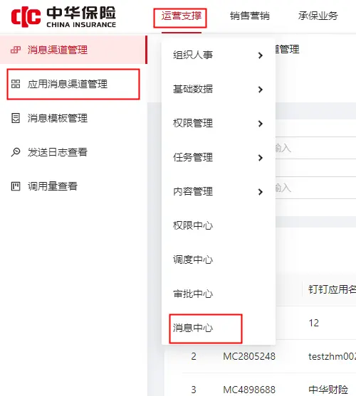

选择自己的应用 和需要 绑定的消息渠道类型

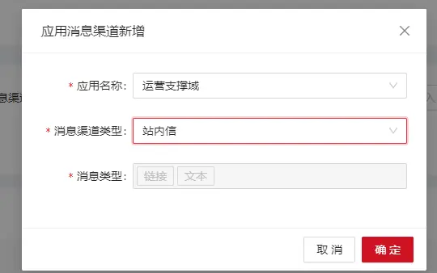

  

###### 未知系统异常

rpc接口调用，请使用示例，调用消息发送接口，不然会出现泛型解析失败导致报（未知系统异常）的错误

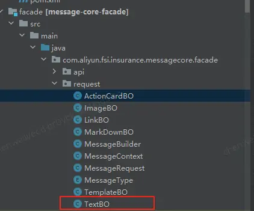

  

###### channelCode是什么

  

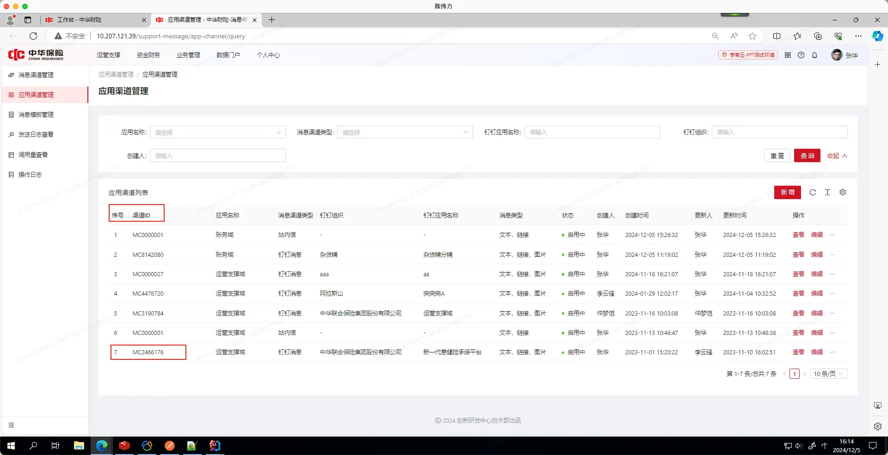

渠道id（channelCode）所有环境不是统一的！！！！！

###### bizId是什么

bizid是调用方的业务id，如果后期你的这条消息有问题，我们可以拿的这个id去查询，最好不唯一

  

###### receiverList是什么

发送的账号是新一代的账号，可以直接发送给内部人员，外部人员 测试环境需要找孙快快老师创建账号

生产环境需要找仲梦凯老师创建账号

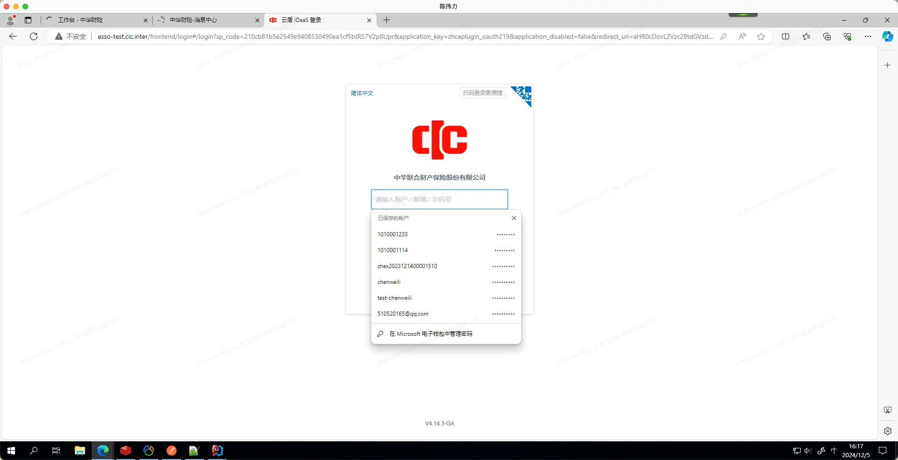

  

## 内部数据组装-供接口维护人员参考

```
//钉钉模板链接消息
{
    "appId": "M010008",
    "bizId": "NT72350969379148188885678",
    "channelCode": "MC3190784",
    "content": {
        "context": {
            "personName": "刘阳",
            "nodeName": "抄送节点",
            "flowInstanceName": "销售方案新增审批",
            "flowName": "扫码保审批流程",
            "content": "刘阳发起销售方案新增审批 内容: 销售方案新增审批"
        },
        "linkUrl": "//10.207.121.39/support-operation/feedback/detail/7239471199524999168",
        "templateCd": "MT5971712"
    },
    "messageType": "TEMPLATE",
    "receiverList": [
        "1010001233"
    ]
}
GET http://localhost:8080/msg/consume/202410227254377813448638464 测试发送


//钉钉模板文本消息
{
    "appId": "M010008",
    "bizId": "NT72350969379148188885650",
    "channelCode": "MC3190784",
    "content": {
        "templateCd": "MA3612983"
    },
    "messageType": "TEMPLATE",
    "receiverList": [
        "1010001233"
    ]
}
http://localhost:8080/msg/consume/202410237254793941519761408 测试发送


//钉钉模板卡片消息
{
  "appId": "M010008",
  "bizId": "NT72350969379148188885601",
  "channelCode": "MC3190784",
  "content": {
    "context": {
      "name": "testname",
      "day": "testday",
      "title": "testtitle",
      "actionCardTitle": "testactioncardtitle"
    },
    
    "templateCd": "TESTCARD1"
  },
  "messageType": "TEMPLATE",
  "receiverList": [
    "zhex2023121400001510"
  ]
}

//钉钉模板markdown消息
{
  "appId": "M010008",
  "bizId": "NT72350969379148188885601",
  "channelCode": "MC3190784",
  "content": {
    "context": {
      "name": "testname",
      "day": "testday",
      "title": "testtitle"
    },
    "templateCd": "MARKDOWN1"
  },
  "messageType": "TEMPLATE",
  "receiverList": [
    "zhex2023121400001510"
  ]
}

//钉钉文本消息
{
    "appId": "M010008",
    "bizId": "NT72350969379148188885652",
    "channelCode": "MC3190784",
    "content": {
        "title":"测试标题",
        "text":"测试内容"
    },
    "messageType": "TEXT",
    "receiverList": [
        "1010001233"
    ]
}
http://localhost:8080/msg/consume/202410237254822744489000960


//钉钉链接消息
{
    "appId": "M010008",
    "bizId": "NT72350969379148188885653",
    "channelCode": "MC3190784",
    "content": {
        "context": {
            "personName": "刘阳"
        },
         "title": "测试标题${personName}",
        "text": "测试内容${personName}",
        "linkurl": "//www.baidu.com"
    },
   
    "messageType": "LINK",
    "receiverList": [
        "1010001233"
    ]
}
http://localhost:8080/msg/consume/202410237254827431414005760


//钉钉图片消息
{
    "appId": "M010008",
    "bizId": "NT72350969379148188885653",
    "channelCode": "MC3190784",
    "content": {
         "title": "测试标题",
        "imageUrl": "http://xinyidai-static-oss-nonprod.oss-cn-dalian-cic-d01-a.ops.cloud.cic.inter/public/2024-07-25/172918693/banner%E5%85%A5%E5%8F%A3%402x.png"
    },
   
    "messageType": "IMAGE",
    "receiverList": [
        "1010001233"
    ]
}

//钉钉卡片消息
{
    "appId": "M010008",
    "bizId": "NT72350969379148188885652",
    "channelCode": "MC3190784",
    "content": {
        "title": "是透出到会话列表和通知的文案",
        "markdown": "标题  \n   # 一级标题  \n   ## 二级标题  \n   ### 三级标题  \n   #### 四级标题  \n   ##### 五级标题  \n   ###### 六级标题  \n  > A man who stands for nothing will fall for anything.  \n  **bold**  *italic*  \n  [this is a link](http://www.baidu.com)",
        "single_title": "查看详情",
        "single_url": "https://open.dingtalk.com"
    },
    "messageType": "ACTION_CARD",
    "receiverList": [
        "zhex2023121400001510"
    ]
}

//钉钉markdown消息
{
    "appId": "M010008",
    "bizId": "NT72350969379148188885652",
    "channelCode": "MC3190784",
    "content": {
        "title": "首屏会话透出的展示内容",
        "text": "# 这是支持markdown的文本 <br> ## 标题2 <br> * 列表1 <br> "
    },
    "messageType": "MARKDOWN",
    "receiverList": [
        "zhex2023121400001510"
    ]
}


-------------------------------------------------------------------------------------

//站内信链接消息
{
    "appId": "M010008",
    "bizId": "NT72350969379148188885653",
    "channelCode": "MC0000001",
    "content": {
        "context": {
            "personName": "刘阳"
        },
         "title": "测试标题${personName}",
        "text": "测试内容${personName}",
        "linkurl": "//www.baidu.com"
    },
   
    "messageType": "LINK",
    "receiverList": [
        "1010001233"
    ]
}
http://localhost:8080/msg/consume/202410247255031131151597568

//站内信文本消息
{
    "appId": "M010008",
    "bizId": "NT72350969379148188885656",
    "channelCode": "MC0000001",
    "content": {
        "context": {
            "personName": "刘阳"
        },
        "title": "测试标题${personName}",
        "text": "测试内容${personName}"
    },
    "messageType": "TEXT",
    "receiverList": [
        "1010001233"
    ]
}
http://localhost:8080/msg/consume/202410247255036109152911360


//站内信模板链接消息
{
    "appId": "M010008",
    "bizId": "NT72350969379148188885678",
    "channelCode": "MC0000001",
    "content": {
        "context": {
            "personName": "刘阳",
            "nodeName": "抄送节点",
            "flowInstanceName": "销售方案新增审批",
            "flowName": "扫码保审批流程",
            "content": "刘阳发起销售方案新增审批 内容: 销售方案新增审批"
        },
        "linkUrl": "//10.207.121.39/support-operation/feedback/detail/7239471199524999168",
        "templateCd": "MT5971712"
    },
    "messageType": "TEMPLATE",
    "receiverList": [
        "1010001233"
    ]
}
http://localhost:8080/msg/consume/202410247255043732526923776

//站内信模板链接消息
{
    "appId": "M010008",
    "bizId": "NT72350969379148188885678",
    "channelCode": "MC0000001",
    "content": {
        "context": {
            "test": "测试",
        },
        "linkUrl": "//10.207.121.39/support-operation/feedback/detail/7239471199524999168",
        "templateCd": "MT5971712"
    },
    "messageType": "TEMPLATE",
    "receiverList": [
        "1010001233"
    ]
}
http://localhost:8080/msg/consume/202410247255043732526923776


//站内信模板文本消息
{
    "appId": "M010008",
    "bizId": "NT72350969379148188885660",
    "channelCode": "MC0000001",
    "content": {
        "templateCd": "MA3612983"
    },
    "messageType": "TEMPLATE",
    "receiverList": [
        "1010001233"
    ]
}
http://localhost:8080/msg/consume/202410247255046502982156288
```

  

  

  

## 各消息类型发送效果图

消息类型(IMAGE,LINK,TEMPLATE,TEXT，ACTION_CARD,MARKDOWN)

  

### 模版消息（TEMPLATE）

支持给钉钉的文本、链接、卡片、markdown的消息 加模版，现在只支持rpc方式使用模版

支持给站内信的文本、链接 加模版，现在支持rpc与页面调用

### 站内信文本消息（小铃铛内观看）

  


### 站内信链接消息（小铃铛内观看）


### 钉钉文本消息（TEXT）


  

### 钉钉链接消息（LINK）

  


  

### 钉钉图片消息（IMAGE）


  

### 钉钉markdown消息（MARKDOWN）


  

  

### 钉钉卡片消息（ACTION_CARD）


  

  

## 卡片消息中的markdown语法

有些markdown语法，低版本钉钉客户端不支持

钉钉客户端升级到至少7.6开头的


钉钉官网下载页面

[https://www.dingtalk.com/download?spm=a213l2.13146415.0.0.7f153146MAkQoI#/](https://www.dingtalk.com/download?spm=a213l2.13146415.0.0.7f153146MAkQoI#/)

```
标题
# 一级标题
## 二级标题
### 三级标题
#### 四级标题
##### 五级标题
###### 六级标题
 
引用
> A man who stands for nothing will fall for anything.
 
文字加粗、斜体
**bold**
*italic*
 
链接
[this is a link](http://name.com)
 
图片

 
无序列表
- item1
- item2
 
有序列表
1. item1
2. item2

换行
  \n  (建议\n前后分别加2个空格)
```

  

## **markdown语法**

[**https://open.dingtalk.com/document/isvapp/markdown-variable-new**](https://open.dingtalk.com/document/isvapp/markdown-variable-new)
