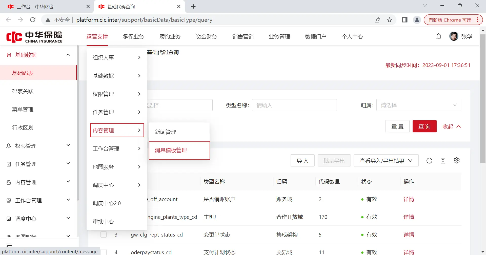
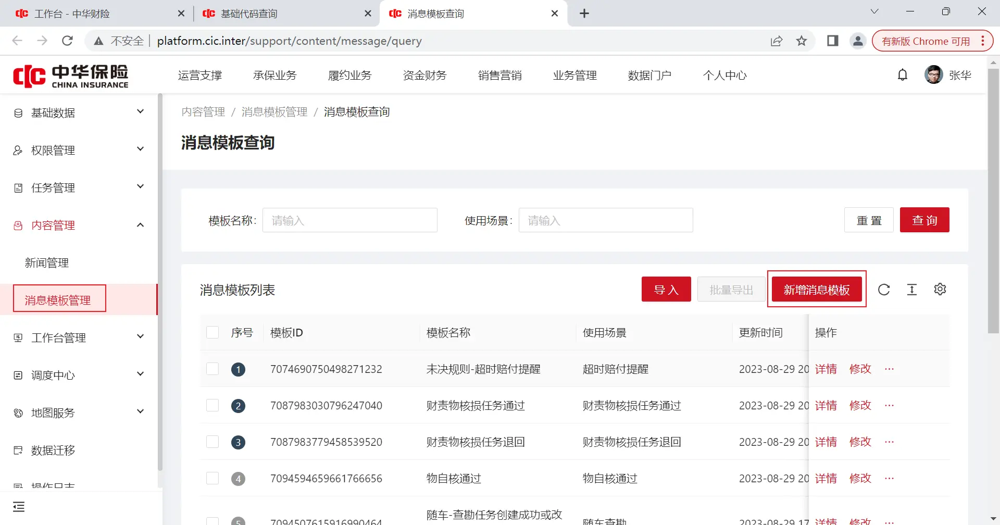
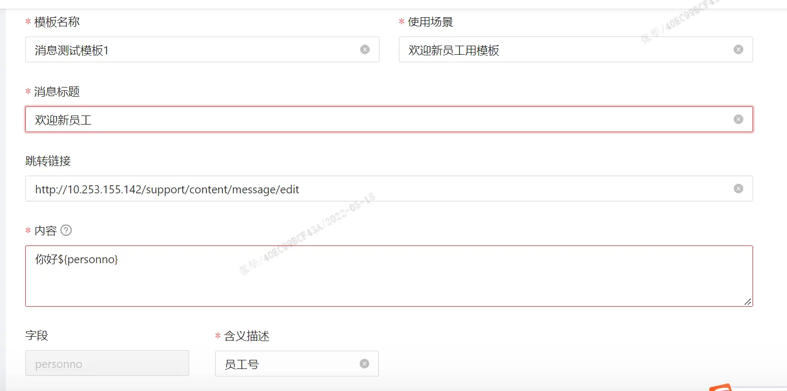
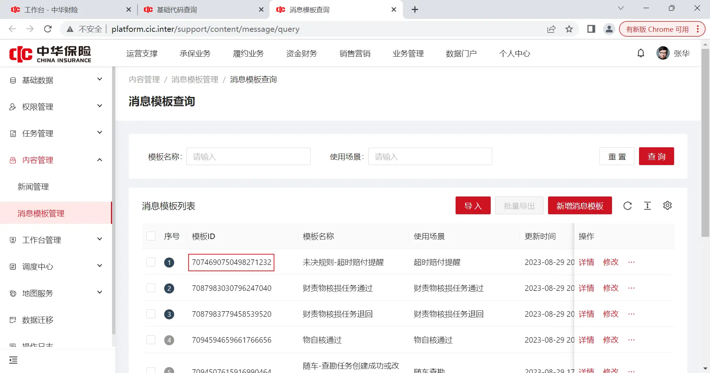
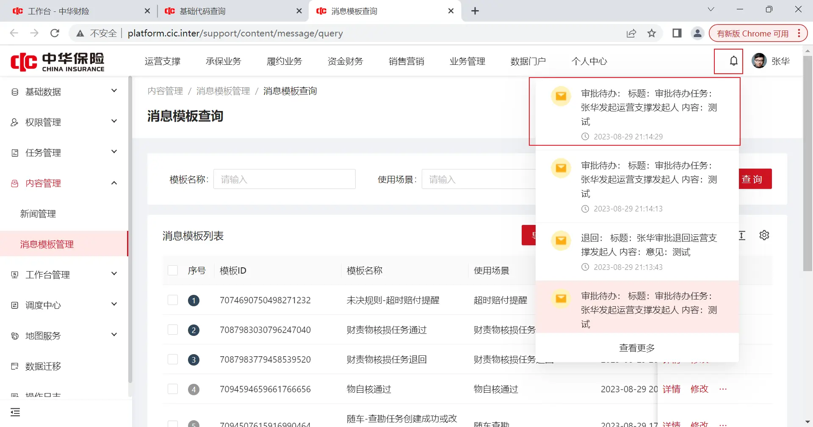
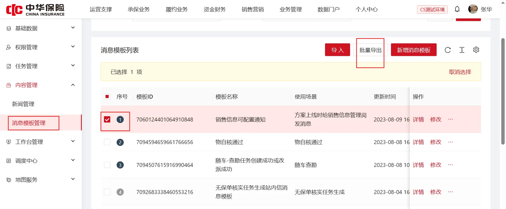
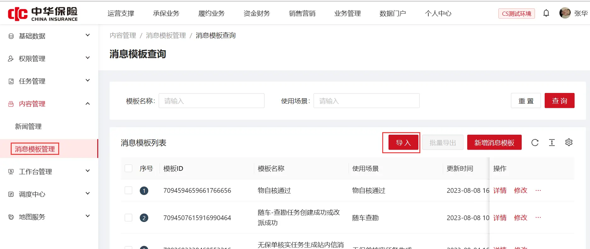
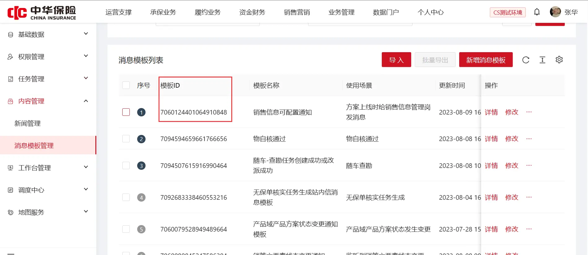

https://cic_irc.yuque.com/tyl581/ggwv9w/xcztd9u5z1n66cn2
# 一、创建模板

## 1. 登录中台，进入消息模板配置页面

## 2. 配置模板

## 3. 配置完模板后，会生成id

Tips:账号找罗世威

# 二、发送消息

## 1. rpc接口对接

参见[https://cic_irc.yuque.com/tyl581/ggwv9w/nqxrpiuyh1d4ygyb](https://cic_irc.yuque.com/tyl581/ggwv9w/nqxrpiuyh1d4ygyb) 的'2.1.发送站内信消息-依赖消息模板'接口

## 2. 发送完成后，可用发送接收人账户登录查看消息

  

  

# 三、不同环境同步消息模

## 1. 从创建好的环境导出消息模板文件

  

## 2. 将1导出的模板导入到需要的环境

## 3. 模板导入成功后，能在消息模板管理页面找到创建模板时相同的id

Tips:生产环境请将导出的模板文件发给杨昌旭同步即可
