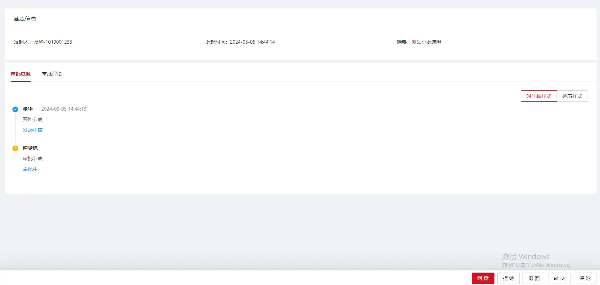
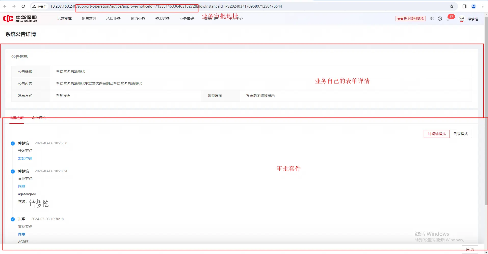
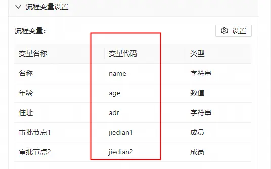
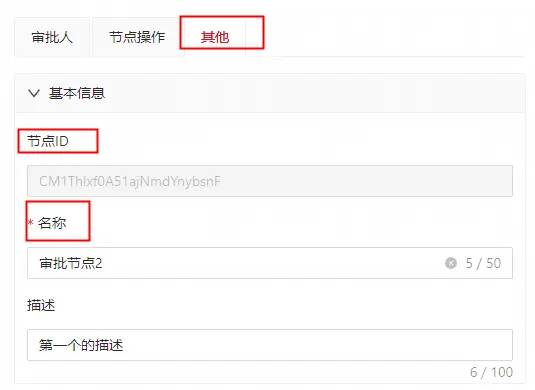
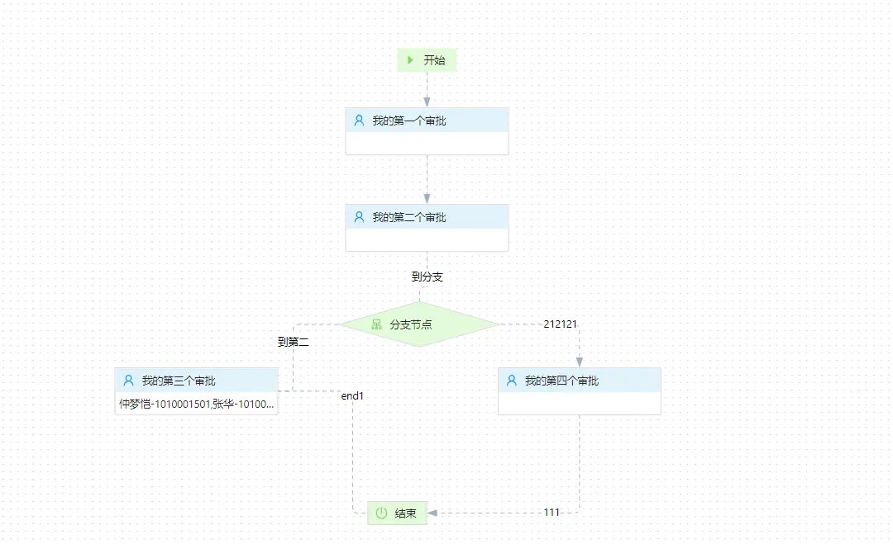

https://cic_irc.yuque.com/tyl581/ggwv9w/ps05h854372kthwe


### 1. 业务接入姿势

---

###### 1.1. 不使用运营支撑提供的审批页面以及审批组件能力

启动流程(start)

--> 业务保存好启动后的流程实例ID

--> 查询流程正在运行的任务(activity)

-->同意(agree)，拒绝(reject), 转交(redirect)，退回(back)，撤销(withdraw)

--> 查询流程正在运行的任务(activity) ;

-->同意(agree)，拒绝(reject), 转交(redirect)，退回(back)，撤销(withdraw)

--> 查询流程正在运行的任务(activity) ;

--> loop

***** 业务接入使用中，每进行一次任务的操作就进行一次 activity 接口的触发获取正在运行的任务，并不是依赖MQ 等回调通知进行后续任务的获取（会存在任务数据缺失情况）。*******

  

###### 1.2. 使用运营支撑提供的审批页面以及审批组件能力

1. 启动流程(start)。
2. 监听MQ回调。
3. 前端接入审批组件，如不使用默认跳转运营支撑默认的审批页面。

### 2. 运营支撑审批组件如何使用接入

---

运营支撑已经将审批的相关能力封装成 前端组件 供接入方系统使用，也就是说 接入方可以很轻量以及很方便的将 审批套件 嵌入到自己的 审批页面 中，无需再次进行开发对接，审批套件见下图，包含审批按钮 审批轨迹，审批的基本信息。



###### 2.1. 接入：

1. 审批流设计阶段配置自己业务的详情页,审批页 或者流程启动通过 businessProcessUrl 参数指定审批详情页面。
2. 前端将接入审批组件接入到自己业务的审批页或者详情页中（涉及前端开发接入,比较简单）。
3. 启动完成之后，通过个人中心-我的审批 进入个人审批中心进行审批操作。
4. 点击操作会跳转到审批配置的业务详情页或审批页(没有配置则会跳转默认的审批详情页)，组件会展示出来供业务操作（组件展示出来需要第2步前端对接完成）。
5. 审批中心在跳转过程中，会自动将审批的业务关键id 信息 flowInstanceId jobId 附带到配置的页面 url 地址上。

###### 2.2. 接入实践



### 3. 业务如何触发审批人规则为非人工的任务

---

使用固定账号为system 的账号进行审批 如下：

```
FlowAgreeDTO flowAgreeDTO = new FlowAgreeDTO();
//任务ID
flowAgreeDTO.setJobId("J1244114151241");
//账号固定为system 小写
flowAgreeDTO.setOperator("system");
//agree
flowInstanceRpcFacade.agree(flowAgreeDTO);
```

### 4. 审批人规则为 成员变量 ,业务如何使用

---

1. 在流程启动的或者审批操作中,传入变量代码

```
FlowInstanceStartBO flowInstanceStartBO = new FlowInstanceStartBO();
flowInstanceStartBO.setCreator("1008611");
Map<String,Object> variable = new HashMap();
//审批人工号
List<String> accIds = new ArrayList()
accIds.add("10086110")
variable.put("变量代码",accIds);
flowInstanceStartBO.setVariable(variable);
flowInstanceRpcFacade.start(flowInstanceStartBO);
```




  

2 . 运行态传入

查看审批中心接口文档 成员变量指定人 API

### 5. 审批人规则为找人策略，业务如何使用接入

---

1. 在流程启动的或者审批操作中,传入约定好的 变量key 信息

```
FlowInstanceStartBO flowInstanceStartBO = new FlowInstanceStartBO();
flowInstanceStartBO.setCreator("1008611");
Map<String,Object> variable = new HashMap();
//找人策略信息
DynamicsWorkGroupDTO strategyGroup = ProcessHelper.strategyGroup(Arrays.asList("机构编码，可以为空"), Arrays.asList("工作组标签，可以为空"));
variable.put( ProcessHelper.genProcessVariableKey("流程节点的id或者节点名字，二选一"),  strategyGroup);
flowInstanceStartBO.setVariable(variable);
flowInstanceRpcFacade.start(flowInstanceStartBO);
```

  



### 6. 审批中心幂等

---

1. 在流程启动中，传入puid 业务唯一id (见审批中心接口文档 start),同一个puid 的流程只会启动一次，只会有一个流程实例id

puid 是业务的唯一编码，起到幂等的作用，也就是说同一个puid 无论启动多少次返回的都是第一次启动的流程实例，如果想要实现一个业务编码启动多次的效果，建议加上 PUID.customCode 随机字段。

```
FlowInstanceStartBO flowInstanceStartBO = new FlowInstanceStartBO();
//业务PUID
flowInstanceStartBO.setPuid(PUID.builder().appName("XXXXX自己的应用名字,自己的业务含义随便起").businessNum("R0314112133自己的业务编号哪怕是时间戳").build());
flowInstanceStartBO.setCreator("10131314231");
flowInstanceStartBO.setDigest("digest");
flowInstanceStartBO.setFlowCode("M01008131自己的流程编码");
flowInstanceStartBO.setVariable(new JSONObject());
flowInstanceStartBO.setFlowInstanceName("自己业务的流程名字");
flowInstanceFacade.start(flowInstanceStartBO);
```

2.在进行任务操作时候，传入业务操作的 幂等id (见审批中心接口文档 ),同一个 幂等id 操作下的结果都是一致的。

```
       FlowAgreeDTO flowAgreeDTO = new FlowAgreeDTO();
        flowAgreeDTO.setOperator("131241241");
        flowAgreeDTO.setJobId("JB20234141526765785674563423");
        flowAgreeDTO.setIdempotentId("1131自己的幂等id");
        flowAgreeDTO.setComment("comment");
        flowInstanceFacade.agree(flowAgreeDTO);
```

  

### 7. MQ 回调的 puid 如何拿取到 流程启动传入的业务编号

---

puid 是由 应用名字 + 业务编码 + 自定义编码 中间加上分隔符 "_" 组成的，这三部分都是由调用方自定义传入进来的，可以通过分割_的方式获取到自己业务传进来的这三部分信息。

### 8. 关于变量范围

---

1. 流程启动传入的变量统一为全局变量，全局变量作用于流程生命周期的开始到结束,在后续条件变量的都可以使用到。
2. 同意 转交 退回 传入的变量为局部变量,局部变量只作用于一个执行范围, 如下,流程任务能否达到我的第三个审批或者我的第四个审批 是由我的第二个审批变量 以及全局变量决定的，我的第一个审批变量不会影响到三个审批以及我的第四个审批。
3. 局部变量 > 全局变量，如果流程上的变量判断清晰且不混乱，建议使用全局变量


