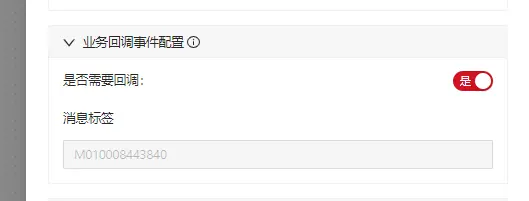

https://cic_irc.yuque.com/tyl581/ggwv9w/yg1g3rp2bh64zaws
### 前言

---

##### 业务回调：

由 “审批中心应用”将审批中的一些事件 主动 推送给“业务平台”的操作；

如在一个“权限审批”的流程，应用方需要在最终审批完成后 进行最终的权限码授权的操作，这时候应用方只需要关注审批中心 对应的事件，在事件回调中进行自己 权限码授权的操作；

  

  

### 约定

---

审批中心发送的事件提供了“流程级”,“节点级” 业务侧无法感知事件;

审批中心不会发送 “任务级”的事件,因为是没有必要的,冗余的，意义不大的，因为业务应用在每次进行一次节点操作后，可以通过触发 “activity” 接口 获取到目前正在需要进行审批的任务；

#### 配置

在流程设计中-> 流程设置 进行开启回调事件配置开关



#### 事件类型

|   |   |   |
|---|---|---|
|事件类型Code|级别|含义|
|PROCESS_CREATE|流程级|流程创建时候的事件|
|PROCESS_WITH_DRAW|流程级|流程撤销时候的事件|
|PROCESS_REJECT|流程级|流程驳回时候的事件|
|PROCESS_FINISH|流程级|流程完成时候的事件|
|NODE_JOB_TRANSFER|节点级别|任务改派事件，因为某种原因，流程管理员进行了任务的改派。操作人进行了变更|
|NODE_JOB_CREATE|节点级别|节点任务创建的事件|
|NODE_JOB_FINISH|节点级别|节点任务完成的事件，比如一个节点下有一个需要4个人完成的会签任务，只有在这4个人完成之后会发送此事件消息|

#### 消息格式

###### 流程级别

```
{
  "flowInstanceId":"PS2023067831454245436324",
  "event":"PROCESS_REJECT",
  "flowCode":"M01008131421",
  "puid":"midAboss_businessId_customeCode",
  "comment":"流程备注意见信息"
}
```

###### 节点级别

```
{
  "flowInstanceId":"PS2023067831454245436324",
  "event":"NODE_JOB_FINISH",
  "flowCode":"M01008131421",
  "nodeId":"dfefe-fefwe-wefwegwef-wefw",
  "nodeName":"第一个节点",
  "jobInstanceId":"PJ2023061231241213534654433",
  "puid":"midAboss_businessId_customeCode",
  "comment":"流程备注意见信息"
}
```

  

注意： 可以通过 puid 分割_的方式获取业务 id

### 回调

---

目前回调的方式 支持MQ 的事件回调，需要支持其他回调方式请联系产品。

#### 消息格式

审批中心的 jar 包 提供了 消息的解析格式模型，

|   |   |
|---|---|
|模型|含义|
|CallbackEventEnum|回调事件|
|MultiNodeCallbackEvent|节点级别事件模型|
|MultiProcessCallbackEvent|流程级别事件模型|

#### MQ

###### 配置：

Topic : TP_CIC_FLOW_CENTER_MULTI_EVENT

Tag : 业务平台自己的流程编码

###### 注意：

消费端严格 消费自己 应用的流程编码 的Tag，使用自己的groupId，不然会 死人；
