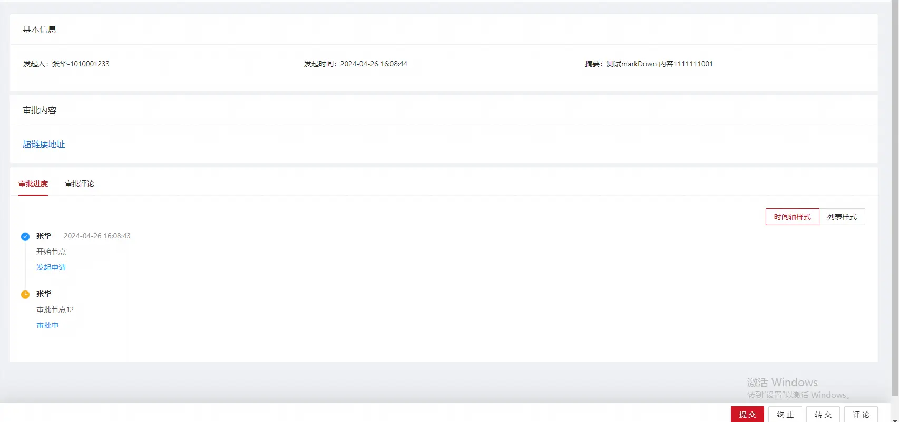

https://cic_irc.yuque.com/tyl581/ggwv9w/ue19pg10d137eigg

### 接口清单

---

|   |   |
|---|---|
|接口列表|功能描述|
|启动流程|用于启动一条配置好的流程配置|
|流程视图|查看流程在各个审批节点的操作明细|
|流程详情|查看启动流程的详细信息|
|任务详情|查询某一个任务的详情以及可操作的动作|
|流程正在运行的任务|查看流程实例下正在运行等待审批的任务|
|任务回退列表|查看任务支持的回退节点|
|同意|流程审批：同意|
|拒绝|流程审批：拒绝 ,流程终止，不会再继续进行流转|
|转交|流程审批：转交|
|退回|流程审批：退回|
|撤销|发起人撤销发起的流程 ,流程终止，不会再继续进行流转|
|撤回|撤回已经审批的任务(如果下一个任务还未进行操作)|
|加签|前加签 后加签|
|成员变量指定人|在审批规则为成员变量的时候指定处理人|
|查询流程全局变量信息|查询流程全局变量信息|

### 接口依赖

---

```
 <dependency>
	<groupId>com.aliyun.fsi.insurance</groupId>
    <artifactId>flow-center-facade</artifactId>
    <version>1.3.4-RELEASE</version>
   </dependency>
```

### 接口文档

---

#### 启动流程

###### API

com.aliyun.fsi.insurance.flow.center.rpc.FlowInstanceRpcFacade#start

###### 入参

|   |   |   |
|---|---|---|
|参数|含义|是否必填|
|creator|流程发起者|是(人员id)|
|flowCode|流程编码|是|
|flowInstanceName|流程业务自定义标题|是（如：XXX发起的报销申请），30个字符之内|
|digest|业务自定义摘要信息|是（如：报销申请的详细描述）300字符之内|
|businessProcessUrl|业务url /a/b/c?aaa=gggg,<br><br>审批操作会跳转到该url上，不通过运营支撑自己的审批页面进行审批,在待我审批我已处理 详情上url 后面会自动附带jobId flowInstanceId 参数，,在抄送我的，我发起的 详情上url 后面会自动附带flowInstanceId 参数|否，建议在流程画布配置中进行配置|
|puid|PUID，由如下3个字段组成|业务唯一id, 一个puid 的流程只会启动一次|
|PUID.appName|业务应用名字，业务自己控制，没限制|是，最好英文 比如：midAboss-gw|
|PUID.businessNum|业务编码，业务自己的编码|是，业务编号 比如：R23123821341121233413|
|PUID.customCode|自定义的编码后缀|否，可以为空，如果涉及到一个业务编号会启动多次<br><br>流程，建议加上随机自定义编码起到唯一的作用。|
|variable|流程变量信息|否 (流程上下文变量,为全局变量，作用于整个流程)|
|files|文件信息List<FlowFileDTO>|否|
|content|流程内容，Markdown 内容格式|否|

  

注意 ：puid 是业务的唯一编码，起到幂等的作用，也就是说同一个puid 无论启动多少次返回的都是第一次启动的流程实例，如果想要实现一个业务编码启动多次的效果（撤销后重新发起），建议加上 PUID.customCode 随机字段。

###### 出参

|   |   |
|---|---|
|参数|含义|
|data|流程实例ID|

###### 示例

```
        FlowInstanceStartBO flowInstanceStartBO = new FlowInstanceStartBO();
        //流程编码code必填
        flowInstanceStartBO.setFlowCode("M010008982781");
        //流程发起人必填
        flowInstanceStartBO.setCreator("1010001233");
        //流程摘要必填
        flowInstanceStartBO.setDigest("摘要信息，必填，比如xxxx发起的审批");
        //流程标题必填
        flowInstanceStartBO.setFlowInstanceName("标题，必填，比如xxxx发起的请假审批");
        //puid 业务id
        flowInstanceStartBO.setPuid(PUID.builder().appName("midAboss-flow-center").businessNum("R13214124123124").customCode("defeefef").build());

        //内容 markdown 不必填，比如想要让审批人知道审批的什么内容，可以附上自己业务详情地址，业务可点击跳转等..
        flowInstanceStartBO.setContent(MarkdownHelper.link("/sasa/dsds?dsd=dsd?sds","超链接"));
        flowInstanceRpcFacade.start(flowInstanceStartBO);
```



#### 流程视图

###### API

com.aliyun.fsi.insurance.flow.center.rpc.FlowInstanceRpcFacade#view

###### 入参

|   |   |   |
|---|---|---|
|参数|含义|是否必填|
|flowInstanceId|流程实例id|是|

###### 出参

|   |   |   |
|---|---|---|
|参数|类型|含义|
|nodeId|String|节点ID|
|nodeName|String|节点名字|
|operationName|List<String>|操作人员名字|
|comment|String|备注信息|
|event|String|操作事件(如上枚举)|
|eventDescription|String|事件描述|
|jobInstanceId|String|任务节点实例id|

  

#### 流程详情

###### API

com.aliyun.fsi.insurance.flow.center.rpc.FlowInstanceRpcFacade#queryProcessInstance

###### 入参

|   |   |   |
|---|---|---|
|参数|含义|是否必填|
|flowInstanceId|流程实例id|是|

###### 出参

|   |   |   |
|---|---|---|
|参数|类型|含义|
|flowInstanceId|String|流程实例|
|flowCreator|String|流程创建人工号|
|flowCreatorName|String|流程创建人名字|
|flowCreateTime|Date|流程创建时间|
|flowFinishTime|Date|流程完成时间|
|flowStatus|String|流程状态（如上枚举）|
|flowInstanceName|String|流程业务自定义标题|
|flowCode|String|流程code|
|digest|String|业务自定义摘要信息|

  

#### 任务详情

###### API

com.aliyun.fsi.insurance.flow.center.rpc.FlowInstanceRpcFacade#queryJobInstance

###### 入参

|   |   |   |
|---|---|---|
|参数|含义|是否必填|
|jobId|任务id|是|

###### 出参

|   |   |   |
|---|---|---|
|参数|类型|含义|
|flowInstanceId|String|流程实例|
|jobId|String|任务ID|
|personCode|String|任务审批人员|
|flowCreator|String|流程创建人工号|
|flowCreatorName|String|流程创建人名字|
|flowCreateTime|Date|流程创建时间|
|flowFinishTime|Date|流程完成时间|
|flowStatus|String|流程状态（如上枚举）|
|flowInstanceName|String|流程业务自定义标题|
|flowCode|String|流程code|
|digest|String|业务自定义摘要信息|
|form|List<FlowInstanceFormDataResponseDTO>||

FlowInstanceFormDataResponseDTO

|   |   |   |
|---|---|---|
|参数|类型|含义|
|flowInstanceId|String|流程实例|
|nodeId|String|节点ID|
|nodeName|String|节点名称|
|data|String|表单数据|
|event|String|事件|

  

```
{
    "status": 1,
    "message": null,
    "data": {
        "flowInstanceId": "PS2023067072910353167851520",
        "flowCreator": "1010001501",
        "flowCreatorName": "仲梦恺",
        "flowCreateTime": "2023-06-09 20:20:37",
        "flowFinishTime": null,
        "flowStatus": "IDLE",
        "flowInstanceName": "测试并行分支啊啊啊啊啊",
        "flowCode": "M010008211328",
        "digest": "并行分支11111111",
        "form": [{
          "flowInstanceId": "PS2023067072910353167851520",
          "nodeId": "cic-CLBWEN0DNVUZvLBaXvL6d9zT",
          "nodeName": "审批节点",
          "data": "{}",
          "event": "AGREE"
        }]
    }   
    "needRetry": false,
    "extendInfo": null,
    "totalCount": null,
    "pageSize": 0,
    "pageIndex": 0,
    "digetValues": [],
    "digestLog": "-"
}
```

  

#### 流程正在运行的任务

###### API

com.aliyun.fsi.insurance.flow.center.rpc.FlowInstanceRpcFacade#activity

###### 入参

|   |   |   |
|---|---|---|
|参数|含义|是否必填|
|flowInstanceId|流程实例id|是|

###### 出参

如果节点下存在多个人 会签 或签，会为每个审批的人生成一条待审批的任务，每个人的任务 jobId 不同，但是

jobInstanceId 相同。

|   |   |   |
|---|---|---|
|参数|类型|含义|
|flowInstanceId|String|流程实例|
|jobId|String|任务id|
|nodeId|String|节点id|
|jobName|String|任务节点名字|
|personCode|String|待审批人工号，单人|
|personName|String|待审批人名字，单人|
|jobInstanceId|String|任务实例ID|
|flowCreator|String|流程发起人|
|flowCode|String|流程code|
|digest|String|业务自定义摘要信息|
|dispatchMethod|String|调度方式如上|
|approveMethod|String|审批方式|
|event|String|操作事件(如上枚举)|

#### 同意

###### API

com.aliyun.fsi.insurance.flow.center.rpc.FlowInstanceRpcFacade#agree

###### 入参

|   |   |   |   |
|---|---|---|---|
|参数|参数类型|含义|是否必填|
|jobId|String|任务id|是|
|operator|String|操作人，在RPC操作下使用|是|
|comment|String|备注信息|根据流程配置是否需要审批意见决定|
|idempotentId|String|幂等id|否|
|variables|Map<String, Object>|变量信息|为局部变量，只作用于一个执行实例范围|
|globalVariables|Map<String, Object|全局变量信息|全局变量信息|
|files|List<FlowFileDTO>|文件信息|否|
|sign|String|签名base64|根据流程配置是否需要签名|
|formData|String|表单数据|否|

###### 出参

null

#### 拒绝

###### API

com.aliyun.fsi.insurance.flow.center.rpc.FlowInstanceRpcFacade#reject

###### 入参

|   |   |   |   |
|---|---|---|---|
|参数|参数类型|含义|是否必填|
|jobId|String|任务id|是|
|operator|String|操作人，在RPC操作下使用|是|
|comment|String|备注信息|根据流程配置是否需要审批意见决定|
|variables|Map<String, Object>|变量信息|只作用于一个执行实例范围|
|globalVariables|Map<String, Object|全局变量信息|全局变量信息|
|idempotentId|String|幂等id|否|
|formData|String|表单数据|否|

###### 出参

null

#### 转交

###### API

com.aliyun.fsi.insurance.flow.center.rpc.FlowInstanceRpcFacade#redirect

###### 入参

|   |   |   |   |
|---|---|---|---|
|参数|参数类型|含义|是否必填|
|jobId|String|任务id|是|
|operator|String|操作人，在RPC操作下使用|是|
|appendOperator|String|转交人员|是|
|comment|String|备注信息|根据流程配置是否需要审批意见决定|
|variables|Map<String, Object>|变量信息|只作用于一个执行实例范围|
|globalVariables|Map<String, Object|全局变量信息|全局变量信息|
|idempotentId|String|幂等id|否|
|files|List<FlowFileDTO>|文件信息|否|
|formData|String|表单数据|否|

###### 出参

null

#### 退回

###### API

com.aliyun.fsi.insurance.flow.center.rpc.FlowInstanceRpcFacade#back

###### 入参

|   |   |   |   |
|---|---|---|---|
|参数|参数类型|含义|是否必填|
|jobId|String|任务id|是|
|operator|String|操作人，在RPC操作下使用|是|
|backId|String|回退的节点id|是|
|comment|String|备注信息|根据流程配置是否需要审批意见决定|
|variables|Map<String, Object>|变量信息|只作用于一个执行实例范围|
|globalVariables|Map<String, Object|全局变量信息|全局变量信息|
|idempotentId|String|幂等id|否|
|files|List<FlowFileDTO>|文件信息|否|
|formData|String|表单数据|否|

###### 出参

null

#### 撤销

###### API

com.aliyun.fsi.insurance.flow.center.rpc.FlowInstanceRpcFacade#withdraw

###### 入参

|   |   |   |   |
|---|---|---|---|
|参数|参数类型|含义|是否必填|
|flowInstanceId|String|流程实例id|是|
|operator|String|操作人员|是|
|comment|String|批注|根据流程配置是否需要审批意见决定|
|files|List<FlowFileDTO>|文件信息|否|

###### 出参

null

#### 撤回

###### API

com.aliyun.fsi.insurance.flow.center.rpc.FlowInstanceRpcFacade#reCall

###### 入参

|   |   |   |   |
|---|---|---|---|
|参数|参数类型|含义|是否必填|
|jobId|String|已经审批完的任务Id|是|
|operator|String|操作人，在RPC操作下使用|是|
|comment|String|备注信息|根据流程配置是否需要审批意见决定|
|variables|Map<String, Object>|变量信息|为局部变量，只作用于一个执行实例范围|
|globalVariables|Map<String, Object|全局变量信息|全局变量信息|
|files|List<FlowFileDTO>|文件信息|否|
|formData|String|表单数据|否|

#### 回退列表

###### API

com.aliyun.fsi.insurance.flow.center.rpc.FlowInstanceRpcFacade#returnable

###### 入参

|   |   |   |   |
|---|---|---|---|
|参数|参数类型|含义|是否必填|
|jobId|String|任务Id|是|

###### 出参

|   |   |   |
|---|---|---|
|参数|参数类型|含义|
|NodeId|String|节点ID|
|NodeName|String|节点名字|
|NodeType|String|节点类型|
|autoPass|Boolean|是否自动审批通过(true/false)|

  

  

#### 加签

###### API

com.aliyun.fsi.insurance.flow.center.rpc.FlowInstanceRpcFacade#append

###### 入参

|   |   |   |   |   |
|---|---|---|---|---|
|参数|类型|含义|是否必填||
|jobId|String|jobId|是||
|comment|String|备注意见|否||
|appendOperators|List<String>|加签人员|是||
|againAppend|Boolean|是否可以再次加签|是 默认false||
|supportAction|AGREE：同意<br><br>SEND_BACK：退回|加签节点支持的操作，加钱节点只2允许 同意以及退回|是||
|appendMethod|BEFORE_APPEND：前加签<br><br>AFTER_APPEND：后加签|加签方式|是||
|approvalMethod|COUNTER_SIGN：会签<br><br>OR_SIGN：或签|审批方式|是||
|idempotentId|String|幂等id|否|否|
|formData|String|表单数据|否||

  

###### 出参

null

#### 获取下一可能的审批节点

###### API

com.aliyun.fsi.insurance.flow.center.rpc.FlowViewRpcFacade#nextNode

###### 入参

|   |   |   |   |   |
|---|---|---|---|---|
|参数|类型|含义|是否必填||
|jobId|String|jobId|是||

###### 出参

|   |   |   |
|---|---|---|
|参数|参数类型|含义|
|nodeId|String|节点ID|
|nodeName|String|节点名字|
|dispatchMethod|String|节点的调度方式|
|dispatchRules|List<String>|调度规则|
|conditionRules|List<ConditionRuleDTO>|节点到达需要满足的条件|

###### 出参示例

```
{
    "status": 1,
    "message": null,
    "data": [{
      "nodeId": "cic-rmvFu1dSTTS8TRRSUQ76WXlV",
      "nodeName": "审批节点",
      "dispatchMethod": "ASSIGNER",
      "dispatchRules": ["1010001114"],
      "conditionRules": [{
        "script": "includes('210000000000',cic_sys_flow_creator_org)",
        "ruleId": "khJK7PSTTlTffXEdScws5",
        "ruleName": "规则1"
      }]
    }],
    "needRetry": false,
    "extendInfo": null,
    "totalCount": null,
    "pageSize": 0,
    "pageIndex": 0,
    "digetValues": [],
    "digestLog": "-"
}
```

#### 成员变量指定人

###### API

com.aliyun.fsi.insurance.flow.center.rpc.FlowDispatchSupportRpcFacade#dispatch

###### 入参

|   |   |   |   |
|---|---|---|---|
|参数|参数类型|含义|是否必填|
|dispatchOperators|List<String>|指定人员列表|是|
|jobId|String|任务Id|是|

#### 查询流程全局变量信息

###### API

com.aliyun.fsi.insurance.flow.center.rpc.FlowInstanceDataRpcFacade#queryGlobalData

###### 入参

|   |   |   |
|---|---|---|
|参数|含义|是否必填|
|flowInstanceId|流程实例id|是|

#### 待我审批

###### API

com.aliyun.fsi.insurance.flow.center.rpc.FlowAboutMeRpcFacade#pendingMyApproval

###### 入参

|   |   |   |   |   |
|---|---|---|---|---|
|参数|类型|含义|是否必填||
|jobId|String|jobId|否||
|pageNum|Integer|分页参数|是||
|pageSize|Integer|分页参数|是||
|flowCreator|String|流程创建人|否||
|personCode|String|待处理人id|否||
|jobName|String|jobName|否||
|flowInstanceName|String|流程实例名字|否||
|digest|String|摘要信息|否||
|beginTime|String|开始时间|否||
|endTime|String|结束时间|否||
|appId|String|appId|否||
|flowStatusList|List<String>|流程状态|否||
|flowCode|String|流程编码|否||
|flowCreateBeginTime|String|流程发起开始时间|否||
|flowCreateEndTime|String|流程发起结束时间|否||
|jobCreateBeginTime|String|任务创建开始时间|否||
|jobCreateEndTime|String|任务创建结束时间|否||
|operator|String|操作人|是||

###### 出参

|   |   |   |
|---|---|---|
|参数|参数类型|含义|
|jobId|String|任务id|
|jobInstanceId|String|job 实例 id|
|dispatchMethod|String|节点的调度方式|
|jobStatus|String|任务状态|
|nodeId|String|节点Id|
|jobName|String|任务名称|
|personCode|String|处理人的工号|
|personName|String|处理人的名字|
|jobCreateTime|Date|任务创建时间|
|flowName|String|流程名称|
|persons|String|当前处理人|
|flowInstanceId|String|流程实例Id|
|flowCreator|String|流程申请人|
|flowCreatorName|String|流程申请人名字|
|flowCreateTime|Date|流程申请时间|
|flowFinishTime|Date|流程完成时间|
|flowStatus|String|流程状态|
|flowInstanceName|String|流程业务名字|
|flowCode|String|流程code|
|version|String|流程版本|
|digest|String|摘要信息|

###### 出参示例

```
{
    "status": 1,
    "message": null,
    "data": [
        {
            "flowInstanceId": "PS2025047315198173254234112",
            "flowCreator": "1010001114",
            "flowCreatorName": null,
            "flowCreateTime": "2025-04-08 10:25:54",
            "flowFinishTime": null,
            "flowStatus": "RUNNING",
            "flowInstanceName": "“李云锋”发起的自助申请授权的申请",
            "flowCode": "M010008335360",
            "version": null,
            "digest": "“李云锋”申请“出单角色组(财责险)”权限",
            "content": null,
            "form": null,
            "jobId": "JB20250473151981732542341127315198253851979777",
            "jobInstanceId": "PJ20250473151981732542341127315198253851979776",
            "dispatchMethod": null,
            "jobStatus": "ACTIVITY",
            "nodeId": "ntAbZnkXFcMSamnySkRSt7nm",
            "jobName": null,
            "personCode": "1010001114",
            "personName": null,
            "jobCreateTime": null,
            "flowName": null,
            "persons": null
        }
    ],
    "needRetry": false,
    "extendInfo": null,
    "totalCount": 55,
    "pageSize": 1,
    "pageIndex": 1,
    "digetValues": [],
    "digestLog": "-"
}
```

#### 我已处理

###### API

com.aliyun.fsi.insurance.flow.center.rpc.FlowAboutMeRpcFacade#processed

###### 入参

|   |   |   |   |   |
|---|---|---|---|---|
|参数|类型|含义|是否必填||
|jobId|String|jobId|否||
|pageNum|Integer|分页参数|是||
|pageSize|Integer|分页参数|是||
|flowCreator|String|流程创建人|否||
|personCode|String|待处理人id|否||
|jobName|String|jobName|否||
|flowInstanceName|String|流程实例名字|否||
|digest|String|摘要信息|否||
|beginTime|String|开始时间|否||
|endTime|String|结束时间|否||
|appId|String|appId|否||
|flowStatusList|List<String>|流程状态|否||
|flowCode|String|流程编码|否||
|flowCreateBeginTime|String|流程发起开始时间|否||
|flowCreateEndTime|String|流程发起结束时间|否||
|jobCreateBeginTime|String|任务创建开始时间|否||
|jobCreateEndTime|String|任务创建结束时间|否||
|operator|String|操作人|是||

###### 出参

|   |   |   |
|---|---|---|
|参数|参数类型|含义|
|jobId|String|任务id|
|jobInstanceId|String|job 实例 id|
|dispatchMethod|String|节点的调度方式|
|jobStatus|String|任务状态|
|nodeId|String|节点Id|
|jobName|String|任务名称|
|personCode|String|处理人的工号|
|personName|String|处理人的名字|
|jobCreateTime|Date|任务创建时间|
|flowName|String|流程名称|
|persons|String|当前处理人|
|flowInstanceId|String|流程实例Id|
|flowCreator|String|流程申请人|
|flowCreatorName|String|流程申请人名字|
|flowCreateTime|Date|流程申请时间|
|flowFinishTime|Date|流程完成时间|
|flowStatus|String|流程状态|
|flowInstanceName|String|流程业务名字|
|flowCode|String|流程code|
|version|String|流程版本|
|digest|String|摘要信息|

###### 出参示例

```
{
    "status": 1,
    "message": null,
    "data": [
        {
            "flowInstanceId": "PS2025047321411179025772544",
            "flowCreator": "1010001114",
            "flowCreatorName": null,
            "flowCreateTime": "2025-04-25 13:54:10",
            "flowFinishTime": "2025-04-25 13:54:11",
            "flowStatus": "SUCCESS",
            "flowInstanceName": "关于【实时发布改为手动发布-标题】的发布申请",
            "flowCode": "M010008639168",
            "version": null,
            "digest": "手动发布",
            "content": null,
            "form": null,
            "jobId": "JB20250473214111790257725447321411179218710531",
            "jobInstanceId": "PJ20250473214111790257725447321411179218710528",
            "dispatchMethod": null,
            "jobStatus": "FINISH",
            "nodeId": "830fbb81-96b5-4916-83d8-c4b2115fd8b7",
            "jobName": "审批节点",
            "personCode": "1010001114",
            "personName": null,
            "jobCreateTime": null,
            "flowName": null,
            "persons": null
        }
    ],
    "needRetry": false,
    "extendInfo": null,
    "totalCount": 9290,
    "pageSize": 1,
    "pageIndex": 1,
    "digetValues": [],
    "digestLog": "-"
}
```

#### 我发起的

###### API

com.aliyun.fsi.insurance.flow.center.rpc.FlowAboutMeRpcFacade#initiated

###### 入参

|   |   |   |   |   |
|---|---|---|---|---|
|参数|类型|含义|是否必填||
|jobId|String|jobId|否||
|pageNum|Integer|分页参数|是||
|pageSize|Integer|分页参数|是||
|flowCreator|String|流程创建人|否||
|personCode|String|待处理人id|否||
|jobName|String|jobName|否||
|flowInstanceName|String|流程实例名字|否||
|digest|String|摘要信息|否||
|beginTime|String|开始时间|否||
|endTime|String|结束时间|否||
|appId|String|appId|否||
|flowStatusList|List<String>|流程状态|否||
|flowCode|String|流程编码|否||
|flowCreateBeginTime|String|流程发起开始时间|否||
|flowCreateEndTime|String|流程发起结束时间|否||
|jobCreateBeginTime|String|任务创建开始时间|否||
|jobCreateEndTime|String|任务创建结束时间|否||
|operator|String|操作人|是||

###### 出参

|   |   |   |
|---|---|---|
|参数|参数类型|含义|
|jobName|String|任务名称|
|persons|String|当前处理人|
|flowInstanceId|String|流程实例Id|
|flowCreator|String|流程申请人|
|flowCreatorName|String|流程申请人名字|
|flowCreateTime|Date|流程申请时间|
|flowFinishTime|Date|流程完成时间|
|flowStatus|String|流程状态|
|flowInstanceName|String|流程业务名字|
|flowCode|String|流程code|
|version|String|流程版本|
|digest|String|摘要信息|

###### 出参示例

```
{
    "status": 1,
    "message": null,
    "data": [
        {
            "flowInstanceId": "PS2025047321411176576299008",
            "flowCreator": "1010001114",
            "flowCreatorName": null,
            "flowCreateTime": "2025-04-25 13:54:10",
            "flowFinishTime": "2025-04-25 13:54:10",
            "flowStatus": "REJECTED",
            "flowInstanceName": "关于【系统公告接口自动化测试-实时发布-标题】的发布申请",
            "flowCode": "M010008639168",
            "version": null,
            "digest": "手动发布",
            "content": null,
            "form": null,
            "jobName": "审批节点",
            "persons": null
        }
    ],
    "needRetry": false,
    "extendInfo": null,
    "totalCount": 7042,
    "pageSize": 1,
    "pageIndex": 1,
    "digetValues": [],
    "digestLog": "-"
}
```

#### 抄送我的

###### API

com.aliyun.fsi.insurance.flow.center.rpc.FlowAboutMeRpcFacade#cc

###### 入参

|   |   |   |   |   |
|---|---|---|---|---|
|参数|类型|含义|是否必填||
|jobId|String|jobId|否||
|pageNum|Integer|分页参数|是||
|pageSize|Integer|分页参数|是||
|flowCreator|String|流程创建人|否||
|personCode|String|待处理人id|否||
|jobName|String|jobName|否||
|flowInstanceName|String|流程实例名字|否||
|digest|String|摘要信息|否||
|beginTime|String|开始时间|否||
|endTime|String|结束时间|否||
|appId|String|appId|否||
|flowStatusList|List<String>|流程状态|否||
|flowCode|String|流程编码|否||
|flowCreateBeginTime|String|流程发起开始时间|否||
|flowCreateEndTime|String|流程发起结束时间|否||
|jobCreateBeginTime|String|任务创建开始时间|否||
|jobCreateEndTime|String|任务创建结束时间|否||
|operator|String|操作人|是||

###### 出参

|   |   |   |
|---|---|---|
|参数|参数类型|含义|
|jobId|String|任务id|
|jobInstanceId|String|job 实例 id|
|dispatchMethod|String|节点的调度方式|
|jobStatus|String|任务状态|
|nodeId|String|节点Id|
|jobName|String|任务名称|
|personCode|String|处理人的工号|
|personName|String|处理人的名字|
|jobCreateTime|Date|任务创建时间|
|flowName|String|流程名称|
|persons|String|当前处理人|
|flowInstanceId|String|流程实例Id|
|flowCreator|String|流程申请人|
|flowCreatorName|String|流程申请人名字|
|flowCreateTime|Date|流程申请时间|
|flowFinishTime|Date|流程完成时间|
|flowStatus|String|流程状态|
|flowInstanceName|String|流程业务名字|
|flowCode|String|流程code|
|version|String|流程版本|
|digest|String|摘要信息|

###### 出参示例

```
{
    "status": 1,
    "message": null,
    "data": [
        {
            "flowInstanceId": "PS2025047321410250482364416",
            "flowCreator": "1010001114",
            "flowCreatorName": null,
            "flowCreateTime": "2025-04-25 13:50:29",
            "flowFinishTime": "2025-04-25 13:50:33",
            "flowStatus": "ABORTED",
            "flowInstanceName": "自动化测试流程-撤回撤销名称",
            "flowCode": "M010008927040",
            "version": null,
            "digest": "自动化测试流程-撤回撤销摘要",
            "content": null,
            "form": null,
            "jobId": null,
            "jobInstanceId": null,
            "dispatchMethod": null,
            "jobStatus": null,
            "nodeId": null,
            "jobName": "开始节点",
            "personCode": null,
            "personName": null,
            "jobCreateTime": null,
            "flowName": "自动化测试流程审批人过滤-勿动",
            "persons": null
        }
    ],
    "needRetry": false,
    "extendInfo": null,
    "totalCount": 1557,
    "pageSize": 1,
    "pageIndex": 1,
    "digetValues": [],
    "digestLog": "-"
}
```

### 业务接入姿势

###### 不使用运营支撑提供的审批页面以及审批组件能力

  

启动流程(start)

--> 业务保存好启动后的流程实例ID

--> 查询流程正在运行的任务(activity)

-->同意(agree)，拒绝(reject), 转交(redirect)，退回(back)，撤销(withdraw)

--> 查询流程正在运行的任务(activity) ;

-->同意(agree)，拒绝(reject), 转交(redirect)，退回(back)，撤销(withdraw)

--> 查询流程正在运行的任务(activity) ;

--> loop

***** 业务接入使用中，每进行一次任务的操作就进行一次 activity 接口的触发获取正在运行的任务，并不是依赖MQ 等回调通知进行后续任务的获取（会存在任务数据缺失情况）。*******

  

###### 使用运营支撑提供的审批页面以及审批组件能力

  

1. 启动流程(start)。
2. 监听MQ回调。

### 流程变量

#### 使用圈人策略时流程变量传入

|   |   |   |
|---|---|---|
|参数|参数类型|含义|
|cic_sys_var_%s|Map<String, Object>|流程变量名称，%s需替换为流程节点Id|

```
"variable": {
		"cic_sys_var_de34d09a-e61b-4ba7-9496-0c1e8f35cb0c": {
		 	"groupTagList":["LBM01000800001"]
			"orgCodeList": ["213702000000"]
		}
}
```

### 审批中心业务回调

[审批中心业务回调](https://cic_irc.yuque.com/tyl581/ggwv9w/yg1g3rp2bh64zaws "审批中心业务回调")

### FAQ:

常见问题-对接问题-开发问题 见如下文档

[FAQ](https://cic_irc.yuque.com/tyl581/ggwv9w/ps05h854372kthwe "FAQ")

  

  

### 枚举

###### 审批行为

```
**
     * 同意
     */
    AGREE("AGREE","同意"),

    /**
     * 拒绝
     */
    DISAGREE("DISAGREE","拒绝"),

    /**
     * 转交
     */
    REDIRECT("REDIRECT","转交"),

    /**
     * 前加签
     */
    BEFORE_APPEND("BEFORE_APPEND","前加签"),

    /**
     * 后加签
     */
    AFTER_APPEND("AFTER_APPEND","后加签"),

    /**
     * 退回
     */
    SEND_BACK("SEND_BACK","退回"),


    /**
     * 撤销
     */
    WITH_DRAW("WITH_DRAW","撤销"),
```

###### 操作事件

```
 /**
     * APPLY，发起申请
     */
    APPLY,
    /**
     * 待审批
     */
    WAIT,

    /**
     * 抄送
     */
    CC,

    /**
     * 同意
     */
    AGREE,

    /**
     * 拒绝
     */
    DISAGREE,

    /**
     * 转交
     */
    REDIRECT,

    /**
     * 前加签
     */
    BEFORE_APPEND,
    /**
     * 后加签
     */
    AFTER_APPEND,

    /**
     * 退回
     */
    SEND_BACK,


    /**
     * 撤销
     */
    WITH_DRAW,
    /**
     * 流程结束
     */
    END,

    /**
     * 管理员转派
     */
    TRANSFER,

    /**
     * 接口传入
     */
    CONTEXT,
    ;
```

###### 流程状态枚举

```
  /**
         * 审批通过
         */
        SUCCESS,
        /**
         * INACTIVE IDLE  RUNNING运行中
         */
        RUNNING,
        /**
         * 已撤销
         */
        ABORTED,
        /**
         * 已驳回
         */
        REJECTED,
```

###### 调度方式

```

    /**
     * REN 直接到人
     */
    ASSIGNER,
    /**
     * 与某一个审批节点一致
     */
    SAME_WITH_APPROVE_NODE,


    /**
     * 流程发起人
     */
    FLOW_CREATOR,

    /**
     * 接口传入
     */
    CONTEXT,


    /**
     * 工作岗位
     */
    POST,
```
