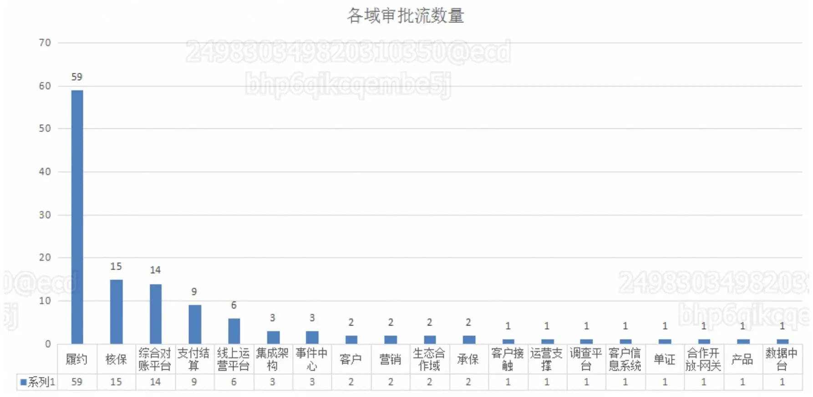
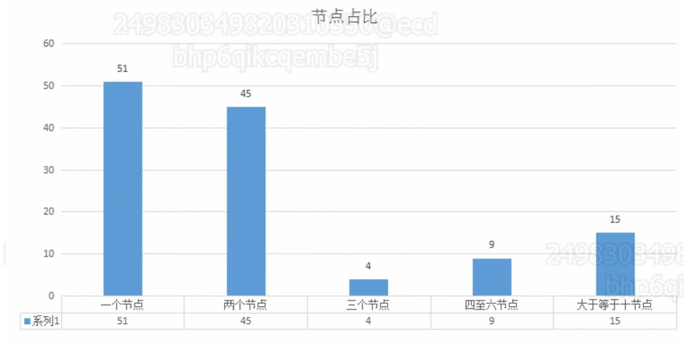
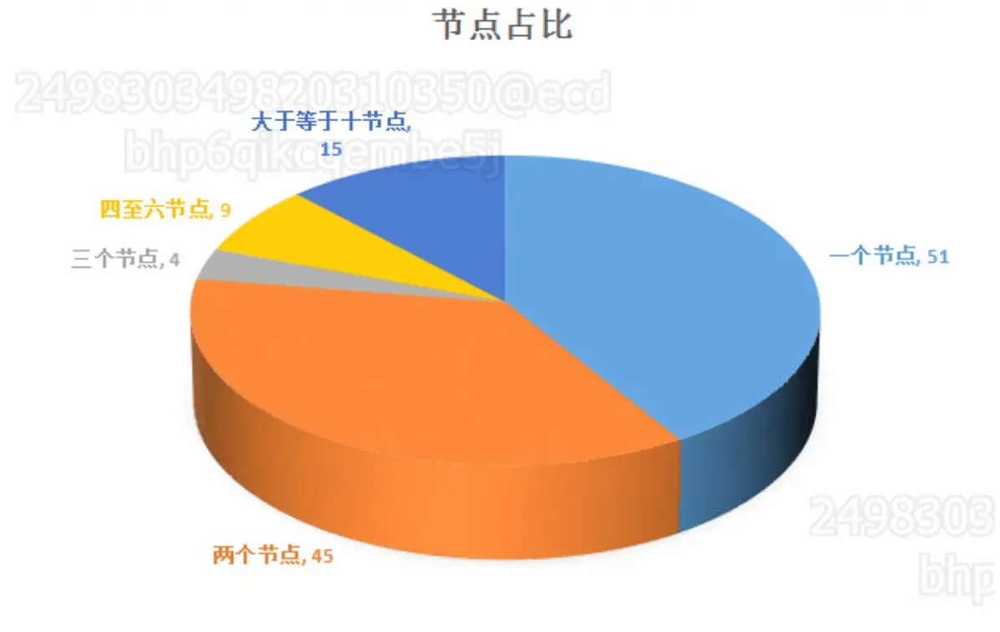
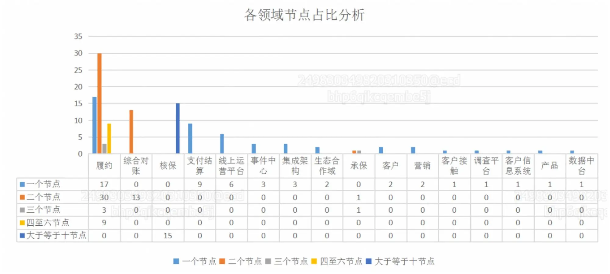
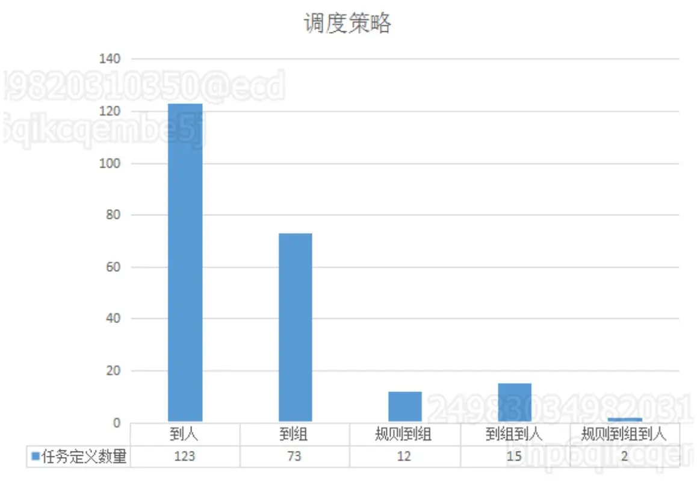

https://cic_irc.yuque.com/tyl581/ggwv9w/xy2su730gl36958c

### 工作流现状分析

---

##### 目的

分析工作流现状的目的是为了更直观的看到目前工作流各个板块的一个使用比重，工作流的复杂度，以及目前审批流缺失的产品功能，方便确立迁移战略目标以及技术成本。

##### 目前各业务平台/中台审批流程数量

  



  

  

原始数据

|   |   |
|---|---|
|业务平台/中台|审批流数量|
|履约|59|
|核保|15|
|综合对账平台|14|
|支付结算|9|
|线上运营平台|6 已迁移审批流) 2024/03/28|
|集成架构|3|
|事件中心|3|
|客户|2|
|营销|2|
|生态合作域|2|
|承保|2|
|客户接触|1|
|运营支撑|1(下线废弃)|
|调查平台|1|
|客户信息系统|1|
|单证|1(已迁移审批流)|
|合作开放-网关|1(已迁移审批流)|
|产品|1|
|数据中台|1已迁移审批流)2024/03/28|

##### 工作流节点数量分析

1. 所有的工作流均没有使用包容网关以及并行网关
2. 125 个工作流里 审批任务<=3个的数量为 101 ，>3<=6的数量为 9 且均为履约 , 审批任务个数>6 为15 且均为核保

|   |   |   |   |   |   |   |   |   |
|---|---|---|---|---|---|---|---|---|
|流程名字|领域|用户任务数量|分支节点数量|包容节点数量|并行节点数量|跳过的表达式集合|匹配表达式集合|用户任务集合|
|verify_rule_task|承保|3|3|0|0|[]|[${condition==1}, ${condition==2}, ${condition==1}, ${condition==2}, ${condition==1}, ${condition==2}]|[node1, node2, node3]|
|quatation_rule_task2|承保|2|2|0|0|[]|[${condition==1}, ${condition==2}, ${condition==1}, ${condition==2}]|[node2, node3]|
|document-handover|单证|2|2|0|0|[]|[${condition==1}, ${condition==1}, ${condition==2}, ${condition==2}]|[audit, accept]|
|customer-dim-apply|客户|1|1|0|0|[]|[${condition==vi1}, ${condition==2}]|[customer-approve]|
|custimer-partner-apply-01|客户|1|1|0|0|[]|[${condition==1}, ${condition==2}]|[architect-community]|
|product-approval-a|产品|1|1|0|0|[]|[${condition==2}, ${condition==1}]|[product-approval-a]|
|contact-plan|客户接触|1|1|0|0|[]|[${condition==1}, ${condition==2}]|[contact-planAudit]|
|promotion-approval|营销|1|1|0|0|[]|[${condition==1}, ${condition==2}]|[营销权益/活动审批]|
|promotion-activity-approve|营销|1|1|0|0|[]|[${condition==1}, ${condition==2}]|[activity-task ]|
|Manual_underwriting|核保|58|59|0|0|[]|[${condition==1}, ${condition==2}, ${condition==2}, ${condition==2}, ${condition==1 && level=='202'}, ${condition==1 && level=='203'}, ${condition==3 && level=='201'}, ${condition==1 && level=='204'}, ${condition==1 && level=='206'}, ${condition==1 && level=='208'}, ${condition==1 && level=='210'}, ${condition==1 && level=='203'}, ${condition==1 && level=='210'}, ${condition==1 && level=='211'}, ${condition==1 && level=='204'}, ${condition==1 && level=='204'}, ${condition==1 && level=='206'}, ${condition==1 && level=='210'}, ${condition==1&& level=='201'}, ${condition==1&& level=='202'}, ${condition==1 && level=='205'}, ${condition==1&& level=='205'}, ${condition==1&& level=='209'}, ${condition==1 && level=='203'}, ${condition==1 && level=='204'}, ${condition==2}, ${condition==1 && level=='206'}, ${condition==1&& level=='206'}, ${condition==2}, ${condition==2}, ${condition==3 && level=='206'}, ${condition==3 && level=='208'}, ${condition==1 && level=='209'}, ${condition==1&& level=='206'}, ${condition==1 && level=='207'}, ${condition==1&& level=='207'}, ${condition==1 && level=='208'}, ${condition==1 && level=='209'}, ${condition==1 && level=='208'}, ${condition==1 && level=='206'}, ${condition==1 && level=='202'}, ${condition==1 && level=='203'}, ${condition==1&& level=='204'}, ${condition==1 && level=='203'}, ${condition==1 && level=='202'}, ${condition==1 && level=='202'}, ${condition==1 && level=='203'}, ${condition==1 && level=='204'}, ${condition==1 && level=='205'}, ${condition==1&& level=='210'}, ${condition==3 && level=='202'}, ${condition==1 && level=='206'}, ${condition==1 && level=='202'}, ${condition==1 && level=='203'}, ${condition==1 && level=='204'}, ${condition==1 && level=='205'}, ${condition==1 && level=='206'}, ${condition==3 && level=='206'}, ${condition==1 && level=='207'}, ${condition==1 && level=='202'}, ${condition==1 && level=='203'}, ${condition==1 && level=='204'}, ${condition==1 && level=='205'}, ${condition==1 && level=='207'}, ${condition==1 && level=='208'}, ${condition==1 && level=='210'}, ${condition==1 && level=='211'}, ${condition==1 && level=='211'}, ${condition==1 && level=='211'}, ${condition==1 && level=='210'}, ${condition==1&& level=='211'}, ${condition==3 && level=='208'}, ${condition==1 && level=='208'}, ${condition==1 && level=='209'}, ${condition==1&& level=='203'}, ${condition==1 && level=='209'}, ${condition==1&& level=='302'}, ${condition==1&& level=='301'}, ${condition==1 && level=='206'}, ${(sFinalLevel == '201' \| sFinalLevel == '202' \| sFinalLevel == '203' \| sFinalLevel == '204' \| sFinalLevel == '205' \| sFinalLevel == '206' \| sFinalLevel == '207' \| sFinalLevel == '208' \| sFinalLevel == '209' \| sFinalLevel == '210') && (sUnderwriteFlag == '21' \| sUnderwriteFlag == '22' \| sUnderwriteFlag == '23') && sBusinessFlag == '01' && (orgcode!= '')}, ${sFinalLevel=='401' && (sUnderwriteFlag=='24'\| sUnderwriteFlag=='25' ) && ( sBusinessFlag=='99'\| sBusinessFlag=='01' ) && (orgcode!= '')}, ${sFinalLevel=='204' && (sUnderwriteFlag=='21'\| sUnderwriteFlag=='22'\| sUnderwriteFlag=='23') && sBusinessFlag=='05' && (orgcode!= '' )}, ${sFinalLevel=='206' && (sUnderwriteFlag=='21'\| sUnderwriteFlag=='22' \| sUnderwriteFlag=='23') && sBusinessFlag=='05' && (orgcode != '' )}, ${sFinalLevel == '207' && ( sUnderwriteFlag == '21' \| sUnderwriteFlag == '22' \| sUnderwriteFlag == '23' ) && sBusinessFlag == '03' && (orgcode != '')}, ${condition==1 && level=='207'}, ${condition==1 && level=='211'}, ${condition==1 && level=='210'}, ${condition==1&& level=='401'}, ${condition==1&& level=='204'}, ${sFinalLevel == '211' && ( sUnderwriteFlag == '21' \| sUnderwriteFlag == '22' \| sUnderwriteFlag == '23' ) && sBusinessFlag == '01' && (orgcode!= '') }, ${condition==2}, ${condition==2}, ${condition==2}, ${condition==2}, ${condition==2}, ${condition==2}, ${condition==2}, ${condition==2}, ${condition==2}, ${condition==2}, ${condition==2}, ${condition==2}, ${condition==2}, ${condition==2}, ${condition==2}, ${condition==2}, ${condition==2}, ${condition==2}, ${condition==2}, ${condition==2}, ${condition==2}, ${condition==2}, ${condition==2}, ${condition==2}, ${condition==2}, ${condition==2}, ${condition==2}, ${condition==2}, ${condition==2}, ${condition==2}, ${condition==2}, ${condition==2}, ${condition==2}, ${condition==2}, ${condition==2}, ${condition==2}, ${condition==2}, ${condition==2}, ${condition==2}, ${condition==2}, ${condition==2}, ${condition==2}, ${condition==2}, ${condition==2}, ${condition==2}, ${condition==2}, ${condition==2}, ${condition==2}, ${condition==1&& level=='208'}, ${condition==1 && level=='208'}, ${(sFinalLevel == '208') && (sUnderwriteFlag == '21' \| sUnderwriteFlag == '22' \| sUnderwriteFlag == '23') && sBusinessFlag == '99' && (orgcode != '')}, ${condition==2}, ${sFinalLevel=='209' && (sUnderwriteFlag=='21'\| sUnderwriteFlag=='22'\| sUnderwriteFlag=='23') && sBusinessFlag=='05' && (orgcode!= '')}, ${condition==2}, ${condition==2}, ${(sUnderwriteFlag=='11' \| sUnderwriteFlag == '12' \| sUnderwriteFlag == '13') }, ${condition==1 && level=='207'}, ${condition==1 && level=='205'}, ${condition==3 && level=='201'}, ${condition==3 && level=='206'}, ${condition==3 && level=='209'}, ${condition==3 && level=='203'}, ${condition==3 && level=='201'}, ${condition==3 && level=='202'}, ${condition==3 && level=='204'}, ${condition==3 && level=='206'}, ${condition==3 && level=='210'}, ${condition==3 && level=='209'}, ${condition==1 && level=='209'}, ${condition==1 && level=='208'}, ${condition==3 && level=='208'}, ${condition==3 && level=='208'}, ${condition==3 && level=='207'}, ${condition==3 && level=='207'}, ${condition==3 && level=='206'}, ${condition==3 && level=='205'}, ${condition==3 && level=='204'}, ${condition==3 && level=='203'}, ${condition==3 && level=='202'}, ${condition==3 && level=='201'}, ${condition==3 && level=='208'}, ${condition==3 && level=='207'}, ${condition==3 && level=='205'}, ${condition==3 && level=='207'}, ${condition==3 && level=='206'}, ${condition==3 && level=='205'}, ${condition==3 && level=='204'}, ${condition==3 && level=='203'}, ${condition==3 && level=='202'}, ${condition==3 && level=='201'}, ${condition==3 && level=='206'}, ${condition==3 && level=='205'}, ${condition==3 && level=='204'}, ${condition==3 && level=='204'}, ${condition==3 && level=='203'}, ${condition==3 && level=='202'}, ${condition==3 && level=='201'}, ${condition==3 && level=='205'}, ${condition==3 && level=='205'}, ${condition==3 && level=='204'}, ${condition==3 && level=='203'}, ${condition==3 && level=='202'}, ${condition==3 && level=='201'}, ${condition==3 && level=='203'}, ${condition==3 && level=='203'}, ${condition==3 && level=='202'}, ${condition==3 && level=='201'}, ${condition==3 && level=='204'}, ${condition==3 && level=='203'}, ${condition==3 && level=='202'}, ${condition==3 && level=='202'}, ${condition==3 && level=='201'}, ${condition==3 && level=='202'}, ${condition==3 && level=='201'}, ${condition==3 && level=='201'}, ${condition==3 && level=='201'}, ${condition==3 && level=='206'}, ${condition==3 && level=='209'}, ${condition==3 && level=='208'}, ${condition==3 && level=='207'}, ${condition==3 && level=='205'}, ${condition==3 && level=='201'}, ${condition==3 && level=='208'}, ${condition==3 && level=='207'}, ${condition==3 && level=='207'}, ${condition==3 && level=='206'}, ${condition==3 && level=='205'}, ${condition==3 && level=='204'}, ${condition==3 && level=='204'}, ${condition==3 && level=='202'}, ${condition==3 && level=='203'}, ${condition==3 && level=='203'}, ${condition==3 && level=='202'}, ${condition==3 && level=='201'}, ${condition==3 && level=='204'}, ${condition==3 && level=='203'}, ${condition==3 && level=='202'}, ${condition==3 && level=='201'}, ${condition==3 && level=='206'}, ${condition==3 && level=='206'}, ${condition==3 && level=='205'}, ${condition==3 && level=='205'}, ${condition==3 && level=='204'}, ${condition==3 && level=='203'}, ${condition==3 && level=='202'}, ${condition==3 && level=='201'}, ${condition==3 && level=='205'}, ${condition==3 && level=='204'}, ${condition==3 && level=='203'}, ${condition==3 && level=='202'}, ${condition==3 && level=='201'}, ${condition==3 && level=='201'}, ${condition==3 && level=='204'}, ${condition==3 && level=='202'}, ${condition==3 && level=='203'}, ${condition==3 && level=='203'}, ${condition==3 && level=='201'}, ${condition==3 && level=='202'}, ${condition==3 && level=='201'}, ${condition==3 && level=='201'}, ${condition==2}, ${condition==3 && level=='202'}, ${condition==3 && level=='201'}, ${condition==3 && level=='201'}, ${condition==3 && level=='204'}, ${condition==3 && level=='203'}, ${condition==3 && level=='202'}, ${condition==3 && level=='201'}, ${condition==3 && level=='204'}, ${condition==3 && level=='203'}, ${condition==3 && level=='202'}, ${condition==3 && level=='201'}, ${condition==3 && level=='203'}, ${condition==3 && level=='202'}, ${condition==3 && level=='201'}, ${condition==3 && level=='202'}, ${condition==3 && level=='201'}, ${condition==3 && level=='201'}, ${condition==3 && level=='205'}, ${condition==3 && level=='205'}, ${condition==3 && level=='204'}, ${condition==3 && level=='203'}, ${condition==3 && level=='202'}, ${condition==3 && level=='201'}, ${condition==3 && level=='205'}, ${condition==3 && level=='204'}, ${condition==3 && level=='203'}, ${condition==3 && level=='202'}, ${condition==3 && level=='201'}, ${condition==3 && level=='204'}, ${condition==3 && level=='203'}, ${condition==3 && level=='202'}, ${condition==3 && level=='201'}, ${condition==3 && level=='203'}, ${condition==3 && level=='202'}, ${condition==3 && level=='202'}, ${condition==3 && level=='201'}, ${condition==3 && level=='201'}, ${condition==3 && level=='201'}, ${condition==3 && level=='208'}, ${condition==3 && level=='210'}, ${condition==3 && level=='209'}, ${condition==3 && level=='208'}, ${condition==3 && level=='207'}, ${condition==3 && level=='206'}, ${condition==3 && level=='205'}, ${condition==3 && level=='204'}, ${condition==3 && level=='203'}, ${condition==3 && level=='202'}, ${condition==3 && level=='201'}, ${condition==3 && level=='209'}, ${condition==3 && level=='207'}, ${condition==3 && level=='206'}, ${condition==3 && level=='205'}, ${condition==3 && level=='204'}, ${condition==3 && level=='203'}, ${condition==3 && level=='202'}, ${condition==3 && level=='201'}, ${condition==3 && level=='207'}, ${condition==3 && level=='206'}, ${condition==3 && level=='205'}, ${condition==3 && level=='204'}, ${condition==3 && level=='203'}, ${condition==3 && level=='202'}, ${condition==3 && level=='201'}, ${condition==3 && level=='207'}, ${condition==3 && level=='206'}, ${condition==3 && level=='205'}, ${condition==3 && level=='204'}, ${condition==3 && level=='203'}, ${condition==3 && level=='202'}, ${condition==3 && level=='201'}, ${condition==3 && level=='206'}, ${condition==3 && level=='205'}, ${condition==3 && level=='204'}, ${condition==3 && level=='203'}, ${condition==3 && level=='202'}, ${condition==3 && level=='201'}, ${condition==3 && level=='205'}, ${condition==3 && level=='204'}, ${condition==3 && level=='203'}, ${condition==3 && level=='202'}, ${condition==3 && level=='201'}, ${condition==3 && level=='204'}, ${condition==3 && level=='203'}, ${condition==3 && level=='202'}, ${condition==3 && level=='201'}, ${condition==3 && level=='203'}, ${condition==3 && level=='202'}, ${condition==3 && level=='201'}, ${condition==3 && level=='202'}, ${condition==3 && level=='201'}, ${condition==3 && level=='201'}, ${(sFinalLevel == '208' \| sFinalLevel == '209' \| sFinalLevel == '210' \| sFinalLevel == '211') && (sUnderwriteFlag == '21' \| sUnderwriteFlag == '22' \| sUnderwriteFlag == '23') && sBusinessFlag == '03' && (orgcode != '')}, ${(sFinalLevel == '203' \| sFinalLevel == '202' \| sFinalLevel == '201' )&& ( sUnderwriteFlag == '21' \| sUnderwriteFlag == '22' \| sUnderwriteFlag == '23' ) && sBusinessFlag == '03' && (orgcode != '' )}, ${condition==1 && level=='206'}, ${(sFinalLevel == '204' \| sFinalLevel == '205' \| sFinalLevel == '206') && ( sUnderwriteFlag == '21' \| sUnderwriteFlag == '22' \| sUnderwriteFlag == '23' ) && sBusinessFlag == '03' && (orgcode!= '' )}, ${condition==1 && level=='205'}, ${condition==1 && level=='208'}, ${condition==1&& level=='209'}, ${condition==1&& level=='210'}, ${condition==1&& level=='211'}, ${condition==1&& level=='201'}, ${condition==1&& level=='202'}, ${condition==1&& level=='203'}, ${condition==1 && level=='204'}, ${sFinalLevel=='301' && (sUnderwriteFlag=='25'\|sUnderwriteFlag=='24') && sBusinessFlag=='01' && (orgcode!= '')}, ${sFinalLevel=='302' && ( sUnderwriteFlag=='24' \| sUnderwriteFlag=='25' ) &&(sBusinessFlag=='01'\|sBusinessFlag=='11'\|sBusinessFlag=='12'\|sBusinessFlag=='13') && (orgcode!= '' )}]|[预核保派工任务-中支-经办, 预核保派工任务-中支-部门, 车险核保任务, 预核保派工任务-中支-总经理室, 核保派工任务-中级二级, 核保派工任务-中级一级, 预核保派工任务-分公司-部门, 预核保派工任务-总公司-经办, 核保派工任务-高级一级, 预核保派工任务-分公司-经办, 预核保派工任务-分公司-科长, 预核保派工任务-分公司-部门, 预核保派工任务-分公司-总经理室, 预核保派工任务-总公司-经办, 预核保派工任务-总公司-处室, 预核保派工任务-总公司-部门, 预核保派工任务-中支-经办, 预核保派工任务-中支-部门, 预核保派工任务-中支-总经理室, 预核保派工任务-分公司-经办, 预核保派工任务-分公司-科长, 预核保派工任务-分公司-部门, 预核保派工任务-分公司-总经理室, 预核保派工任务-总公司-经办, 预核保派工任务-总公司-处室, 预核保派工任务-总公司-部门, 预核保派工任务-总公司-总经理室, 预核保派工任务-分公司-经办, 预核保派工任务-分公司-部门, 预核保派工任务-总公司-处室, 预核保派工任务-总公司-经办, 预核保派工任务-中支-经办, 预核保派工任务-中支-部门, 预核保派工任务-中支-总经理室, 预核保派工任务-中支-经办, 预核保派工任务-中支-部门, 预核保派工任务-中支-总经理室, 预核保派工任务-分公司-经办, 预核保派工任务-分公司-科长, 预核保派工任务-分公司-部门, 预核保派工任务-中支-经办, 预核保派工任务-中支-部门, 预核保派工任务-中支-总经理室, 预核保派工任务-分公司-经办, 预核保派工任务-分公司-科长, 预核保派工任务-分公司-部门, 预核保派工任务-分公司-总经理室, 预核保派工任务-中支-经办, 预核保派工任务-中支-部门, 预核保派工任务-中支-总经理室, 预核保派工任务-分公司-经办, 预核保派工任务-分公司-科长, 预核保派工任务-分公司-部门, 预核保派工任务-分公司-总经理室, 预核保派工任务-总公司-经办, 预核保派工任务-总公司-处室, 预核保派工任务-总公司-部门, 预核保派工任务-总公司-总经理室]|
|Policy_Approval_Process_Shanghai|核保|13|14|0|0|[]|[${condition==2}, ${condition==1}, ${condition==2}, ${condition==1&& level=='220'}, ${condition==1&& level=='221'}, ${condition==2}, ${condition==3 && level=='220'}, ${condition==2}, ${condition==2}, ${condition==2}, ${condition==3 && level=='209'}, ${condition==3 && level=='210'}, ${condition==2}, ${condition==1 && level=='210'}, ${condition==1 && level=='211'}, ${condition==1 && level=='210'}, ${condition==1 && level=='211'}, ${condition==2}, ${condition==1 && level=='209'}, ${condition==2}, ${condition==1 && level=='206'}, ${condition==1 && level=='207'}, ${condition==3 && level=='208'}, ${condition==1 && level=='208'}, ${condition==1 && level=='209'}, ${condition==2}, ${condition==1 && level=='221'}, ${condition==1 && level=='205'}, ${condition==2}, ${condition==2}, ${condition==1 && level=='204'}, ${condition==1 && level=='200'}, ${condition==3 && level=='200'}, ${sUnderwriteFlag == '11' \| sUnderwriteFlag == '12'}, ${condition==1 && level=='205.1'}, ${condition==1 && level=='204'}, ${condition==1 && level=='205'}, ${condition==1 && level=='205.1'}, ${condition==2}, ${condition==3 && level=='204'}, ${condition==1 && level=='205.1'}, ${condition==1 && level=='206'}, ${condition==1 && level=='206'}, ${condition==3 && level=='204'}, ${condition==3 && level=='205'}, ${condition==1 && level=='208'}, ${condition==1 && level=='207'}, ${condition==3 && level=='206'}, ${condition==1 && level=='207'}, ${condition==1 && level=='208'}, ${condition==1 && level=='208'}, ${condition==3 && level=='205.1'}, ${condition==3 && level=='206'}, ${condition==3 && level=='207'}, ${condition==3 && level=='205.1'}, ${condition==3 && level=='205.1'}, ${condition==1 && level=='206'}, ${condition==3 && level=='204'}, ${condition==3 && level=='205'}, ${sBusinessFlag == 'LEVEL' && (sUnderwriteFlag =='13' \| sUnderwriteFlag =='14') }, ${sBusinessFlag == 'POINT' && (sUnderwriteFlag =='13'\| sUnderwriteFlag =='14')}]|[政策通融派工任务-分公司工作组, 政策通融派工任务-总公司工作组, 车险核保任务, 政策通融派工任务--支公司总经理室, 政策通融派工任务-分公司科室, 政策通融派工任务-分公司部门, 政策通融派工任务-分公司总经理室, 政策通融派工任务-总公司处室, 政策通融派工任务-总公司部门, 政策通融派工任务-总公司总经理室, 政策通融派工任务-总公司经办, 政策通融派工任务-分公司经办, 分公司部门副总车险特批]|
|Group_Car_Shanghai|核保|38|38|0|0|[]|[${condition==2}, ${condition==2}, ${condition==2}, ${condition==3 && level=='209'}, ${condition==3 && level=='210'}, ${condition==2}, ${condition==1 && level=='210'}, ${condition==1 && level=='211'}, ${condition==1 && level=='210'}, ${condition==1 && level=='211'}, ${condition==2}, ${condition==1 && level=='205'}, ${condition==1 && level=='209'}, ${condition==2}, ${condition==1 && level=='207'}, ${condition==2}, ${condition==3 && level=='208'}, ${condition==1 && level=='204'}, ${condition==1 && level=='208'}, ${condition==1 && level=='209'}, ${condition==2}, ${condition==1 && level=='207'}, ${condition==1 && level=='208'}, ${condition==3 && level=='207'}, ${condition==2}, ${condition==1 && level=='200'}, ${condition==1 && level=='204'}, ${condition==3 && level=='200'}, ${condition==2}, ${condition==2}, ${condition==2}, ${condition==3 && level=='209'}, ${condition==3 && level=='210'}, ${condition==2}, ${condition==1 && level=='210'}, ${condition==1 && level=='211'}, ${condition==1 && level=='210'}, ${condition==1 && level=='211'}, ${condition==2}, ${condition==1 && level=='205'}, ${condition==1 && level=='209'}, ${condition==2}, ${condition==1 && level=='206'}, ${condition==1 && level=='207'}, ${condition==3 && level=='206'}, ${condition==2}, ${condition==3 && level=='208'}, ${condition==1 && level=='204'}, ${condition==1 && level=='208'}, ${condition==1 && level=='209'}, ${condition==2}, ${condition==1 && level=='208'}, ${condition==3 && level=='207'}, ${condition==2}, ${condition==1 && level=='200'}, ${condition==1 && level=='204'}, ${condition==1 && level=='205'}, ${condition==2}, ${condition==2}, ${condition==2}, ${condition==3 && level=='209'}, ${condition==3 && level=='210'}, ${condition==2}, ${condition==1 && level=='210'}, ${condition==1 && level=='211'}, ${condition==1 && level=='210'}, ${condition==1 && level=='211'}, ${condition==2}, ${condition==1 && level=='205'}, ${condition==1 && level=='209'}, ${condition==2}, ${condition==1 && level=='206'}, ${condition==1 && level=='207'}, ${condition==3 && level=='206'}, ${condition==2}, ${condition==3 && level=='208'}, ${condition==1 && level=='204'}, ${condition==1 && level=='208'}, ${condition==1 && level=='205'}, ${condition==1 && level=='209'}, ${condition==2}, ${condition==1 && level=='207'}, ${condition==1 && level=='208'}, ${condition==1 && level=='208'}, ${condition==3 && level=='207'}, ${condition==2}, ${condition==2}, ${condition==2}, ${condition==3 && level=='209'}, ${condition==3 && level=='210'}, ${condition==2}, ${condition==1 && level=='210'}, ${condition==1 && level=='211'}, ${condition==1 && level=='210'}, ${condition==1 && level=='211'}, ${condition==2}, ${condition==1 && level=='205'}, ${condition==1 && level=='209'}, ${condition==2}, ${condition==1 && level=='206'}, ${condition==1 && level=='207'}, ${condition==3 && level=='206'}, ${condition==2}, ${condition==3 && level=='208'}, ${condition==1 && level=='204'}, ${condition==1 && level=='208'}, ${condition==1 && level=='209'}, ${condition==2}, ${condition==1 && level=='208'}, ${condition==3 && level=='207'}, ${condition==1 && level=='205'}, ${condition==3 && level=='204'}, ${condition==3 && level=='204'}, ${condition==3 && level=='204'}, ${condition==3 && level=='204'}, ${overBudget == '0' && sBusinessFlag == 'LEVEL' && (sUnderwriteFlag =='15' \| sUnderwriteFlag =='16') && (isProvince != '1')}, ${overBudget == '1' && sBusinessFlag == 'LEVEL' && (isProvince == '1')}, ${overBudget == '0' && sBusinessFlag == 'LEVEL' && (sUnderwriteFlag =='15' \| sUnderwriteFlag =='16') && (isProvince == '1')}, ${condition==1 && level=='205'}, ${condition==3 && level=='204'}, ${condition==1 && level=='206'}, ${condition==1 && level=='207'}, ${condition==3 && level=='206'}, ${condition==3 && level=='205.1'}, ${condition==3 && level=='205.1'}, ${condition==3 && level=='205.1'}, ${condition==1 && level=='206'}, ${condition==1 && level=='208'}, ${condition==3 && level=='206'}, ${condition==3 && level=='206'}, ${condition==2}, ${condition==1 && level=='206'}, ${condition==3 && level=='204'}, ${condition==3 && level=='205.1'}, ${condition==3 && level=='205.1'}, ${condition==1 && level=='206'}, ${condition==1 && level=='207'}, ${condition==1 && level=='208'}, ${condition==3 && level=='206'}, ${condition==3 && level=='205.1'}, ${condition==3 && level=='205.1'}, ${condition==2}, ${condition==3 && level=='204'}, ${condition==3 && level=='204'}, ${condition==3 && level=='205'}, ${condition==3 && level=='205'}, ${condition==1 && level=='206'}, ${condition==1 && level=='206'}, ${condition==3 && level=='205'}, ${condition==3 && level=='206'}, ${condition==3 && level=='205.1'}, ${condition==3 && level=='205.1'}, ${overBudget == '1' && sBusinessFlag == 'LEVEL' && (sUnderwriteFlag =='15' \| sUnderwriteFlag =='16') && (isProvince != '1')}, ${condition==1 && level=='208'}, ${condition==1 && level=='207'}, ${condition==1 && level=='206'}, ${condition==1 && level=='206'}, ${condition==1 && level=='208'}, ${condition==1 && level=='207'}, ${condition==1 && level=='206'}, ${condition==1 && level=='207'}, ${condition==1 && level=='208'}, ${condition==3 && level=='204'}, ${condition==3 && level=='205'}, ${condition==3 && level=='205'}, ${condition==3 && level=='205'}, ${condition==1 && level=='206'}, ${condition==1 && level=='205.1'}, ${condition==1 && level=='205.1'}, ${condition==1 && level=='205.1'}, ${condition==1 && level=='205.1'}, ${condition==1 && level=='205.1'}, ${condition==1 && level=='205.1'}, ${condition==1 && level=='206'}, ${condition==2}, ${condition==3 && level=='200'}, ${condition==1 && level=='206'}, ${condition==1 && level=='205.1'}, ${condition==1 && level=='205.1'}, ${condition==1 && level=='205.1'}, ${condition==1 && level=='205.1'}, ${condition==1 && level=='206'}, ${condition==2}, ${condition==1 && level=='205.1'}, ${condition==1 && level=='205.1'}, ${condition==3 && level=='205'}, ${condition==3 && level=='204'}, ${condition==3 && level=='205'}, ${condition==3 && level=='204'}, ${condition==3 && level=='204'}, ${condition==1 && level=='208'}, ${condition==1 && level=='207'}, ${condition==3 && level=='205.1'}, ${condition==3 && level=='205.1'}]|[政策通融派工任务-分公司科室, 政策通融派工任务-分公司部门, 政策通融派工任务-分公司总经理室, 政策通融派工任务-总公司处室, 政策通融派工任务-总公司部门, 政策通融派工任务-总公司总经理室, 政策通融派工任务-总公司经办, 政策通融派工任务-分公司经办, 政策通融派工任务--支公司总经理室, 政策通融派工任务-分公司科室, 政策通融派工任务-分公司部门, 政策通融派工任务-分公司总经理室, 政策通融派工任务-总公司处室, 政策通融派工任务-总公司部门, 政策通融派工任务-总公司总经理室, 政策通融派工任务-总公司经办, 政策通融派工任务-分公司经办, 政策通融派工任务--支公司总经理室, 政策通融派工任务-分公司科室, 政策通融派工任务-分公司部门, 政策通融派工任务-分公司总经理室, 政策通融派工任务-总公司处室, 政策通融派工任务-总公司部门, 政策通融派工任务-总公司总经理室, 政策通融派工任务-总公司经办, 政策通融派工任务-分公司经办, 政策通融派工任务-分公司科室, 政策通融派工任务-分公司部门, 政策通融派工任务-分公司总经理室, 政策通融派工任务-总公司处室, 政策通融派工任务-总公司部门, 政策通融派工任务-总公司总经理室, 政策通融派工任务-总公司经办, 政策通融派工任务-分公司经办, 分公司部门副总车险特批, 分公司部门副总车险特批, 分公司部门副总车险特批, 分公司部门副总车险特批]|
|Accident_Division_Group_Normal|核保|18|19|0|0|[]|[${condition==2}, ${condition==2}, ${condition==2}, ${condition==2}, ${condition==2}, ${condition==2}, ${condition==2}, ${condition==2}, ${condition==2}, ${condition==2}, ${condition==2}, ${condition==2}, ${condition==2}, ${condition==2}, ${condition==2}, ${condition==3 && level=='5133'}, ${condition==3 && level=='5143'}, ${condition==3 && level=='5122'}, ${condition==3 && level=='5121'}, ${condition==3 && level=='5131'}, ${condition==3 && level=='5133'}, ${condition==3 && level=='5143'}, ${condition==3 && level=='5142'}, ${condition==3 && level=='5142'}, ${condition==3 && level=='5141'}, ${condition==3 && level=='5133'}, ${condition==3 && level=='5132'}, ${condition==3 && level=='5131'}, ${condition==3 && level=='5122'}, ${condition==3 && level=='5121'}, ${condition==3 && level=='5142'}, ${condition==3 && level=='5141'}, ${condition==3 && level=='5132'}, ${condition==3 && level=='5141'}, ${condition==3 && level=='5133'}, ${condition==3 && level=='5131'}, ${condition==3 && level=='5122'}, ${condition==3 && level=='5121'}, ${condition==3 && level=='5133'}, ${condition==3 && level=='5132'}, ${condition==3 && level=='5131'}, ${condition==3 && level=='5131'}, ${condition==3 && level=='5122'}, ${condition==3 && level=='5132'}, ${condition==3 && level=='5132'}, ${condition==3 && level=='5131'}, ${condition==3 && level=='5122'}, ${condition==3 && level=='5121'}, ${condition==3 && level=='5122'}, ${condition==3 && level=='5122'}, ${condition==3 && level=='5131'}, ${condition==3 && level=='5122'}, ${condition==3 && level=='5121'}, ${ ( sUnderwriteFlag == '21' \| sUnderwriteFlag == '22' \| sUnderwriteFlag == '23' ) && sBusinessFlag == '01' }, ${condition==2}, ${condition==2}, ${ ( sUnderwriteFlag == '21' \| sUnderwriteFlag == '22' \| sUnderwriteFlag == '23' ) && sBusinessFlag == '05' && sFinalLevel=='5131' }, ${ ( sUnderwriteFlag == '21' \| sUnderwriteFlag == '22' \| sUnderwriteFlag == '23' ) && sBusinessFlag == '05' && sFinalLevel=='5133' }, ${ ( sUnderwriteFlag == '21' \| sUnderwriteFlag == '22' \| sUnderwriteFlag == '23' ) && sBusinessFlag == '05' && sFinalLevel=='5142' }, ${condition==1 && level=='5122'}, ${condition==1 && level=='5131'}, ${condition==1 && level=='5132'}, ${condition==1 && level=='5133'}, ${condition==1 && level=='5141'}, ${condition==1 && level=='5142'}, ${condition==1 && level=='5143'}, ${condition==1 && level=='5144'}, ${condition==1 && level=='5145'}, ${condition==1&& level=='5145'}, ${condition==2}, ${ ( sUnderwriteFlag == '21' \| sUnderwriteFlag == '22' \| sUnderwriteFlag == '23' ) && sBusinessFlag == '21' }, ${condition==1&& level=='5131'}, ${condition==1&& level=='5131'}, ${condition==1&& level=='5133'}, ${condition==1&& level=='5142'}, ${condition==1&& level=='5142'}, ${condition==3 && level=='5141'}, ${condition==1&& level=='5131'}, ${condition==1&& level=='5131'}, ${condition==1&& level=='5132'}, ${sFinalLevel=='5131' && (sUnderwriteFlag=='24'\| sUnderwriteFlag=='25') }, ${ sBusinessFlag == '99' }, ${sFinalLevel=='5132' && (sUnderwriteFlag=='24'\| sUnderwriteFlag=='25') }, ${condition==3 && level=='5132'}, ${condition==3 && level=='5144'}, ${condition==3 && level=='5141'}, ${condition==3 && level=='5121'}, ${condition==3 && level=='5121'}, ${condition==3 && level=='5121'}, ${condition==3 && level=='5121'}, ${condition==1 && level=='5131'}]|[分设-团-分公司高级, 分设-团-分公司初级, 分设-团-分公司初级, 分设-团-分公司初级, 分设-团-中支一级, 分设-团-中支二级, 分设-团-分公司初级, 分设-团-分公司中级, 分设-团-分公司高级, 分设-团-总公司一级, 分设-团-总公司二级, 分设-团-总公司三级, 分设-团-总公司四级, 分设-团-总公司五级, 分设-团-分公司初级, 分设-团-分公司中级, 分设-团-总公司一级, 分设-团-总公司二级]|
|Policy_Approval_Process|核保|31|32|0|0|[]|[${condition==2}, ${condition==2}, ${condition==2}, ${condition==2}, ${condition==3 && level=='209'}, ${condition==3 && level=='210'}, ${condition==2}, ${condition==2}, ${condition==2}, ${condition==1}, ${condition==2}, ${condition==1 && level=='210'}, ${condition==1 && level=='211'}, ${condition==1 && level=='210'}, ${condition==1 && level=='211'}, ${condition==1&& level=='220'}, ${condition==1&& level=='221'}, ${condition==2}, ${condition==2}, ${condition==3 && level=='220'}, ${condition==1 && level=='205'}, ${condition==1 && level=='209'}, ${condition==2}, ${condition==1 && level=='206'}, ${condition==1 && level=='207'}, ${condition==3 && level=='206'}, ${condition==2}, ${condition==3 && level=='208'}, ${condition==1 && level=='203'}, ${condition==1 && level=='204'}, ${condition==1 && level=='208'}, ${condition==1 && level=='202'}, ${condition==1 && level=='209'}, ${condition==2}, ${condition==3 && level=='203'}, ${condition==1 && level=='207'}, ${condition==1 && level=='208'}, ${condition==1 && level=='208'}, ${condition==3 && level=='207'}, ${condition==3 && level=='206'}, ${condition==2}, ${condition==1 && level=='204'}, ${condition==2}, ${condition==2}, ${condition==2}, ${condition==3 && level=='205'}, ${condition==3 && level=='209'}, ${condition==3 && level=='210'}, ${condition==2}, ${condition==1 && level=='210'}, ${condition==1 && level=='211'}, ${condition==1 && level=='210'}, ${condition==1 && level=='211'}, ${condition==2}, ${condition==1 && level=='205'}, ${condition==1 && level=='209'}, ${condition==2}, ${condition==1 && level=='206'}, ${condition==1 && level=='207'}, ${condition==3 && level=='206'}, ${condition==3 && level=='208'}, ${condition==1 && level=='208'}, ${condition==1 && level=='209'}, ${condition==2}, ${condition==1 && level=='208'}, ${condition==1 && level=='208'}, ${condition==3 && level=='207'}, ${condition==3 && level=='206'}, ${condition==1 && level=='221'}, ${condition==1 && level=='202'}, ${condition==1 && level=='207'}, ${condition==1 && level=='201'}, ${condition==1 && level=='206'}, ${condition==1 && level=='205'}, ${condition==1 && level=='205'}, ${condition==2}, ${condition==2}, ${condition==1 && level=='204'}, ${condition==1 && level=='200'}, ${condition==3 && level=='204'}, ${condition==3 && level=='200'}, ${condition==1 && level=='203'}, ${condition==3 && level=='204'}, ${condition==3 && level=='202'}, ${condition==3 && level=='201'}, ${condition==3 && level=='201'}, ${condition==1 && level=='204'}, ${condition==1 && level=='206'}, ${condition==1 && level=='204'}, ${condition==1 && level=='204'}, ${condition==1 && level=='203'}, ${condition==3 && level=='202'}, ${condition==3 && level=='201'}, ${condition==1 && level=='206'}, ${condition==1 && level=='206'}, ${condition==3 && level=='204'}, ${condition==3 && level=='204'}, ${condition==2}, ${condition==2}, ${condition==2}, ${condition==3 && level=='205'}, ${condition==3 && level=='209'}, ${condition==3 && level=='210'}, ${condition==2}, ${condition==1 && level=='210'}, ${condition==1 && level=='211'}, ${condition==1 && level=='210'}, ${condition==1 && level=='211'}, ${condition==2}, ${condition==1 && level=='205'}, ${condition==1 && level=='209'}, ${condition==2}, ${condition==1 && level=='206'}, ${condition==1 && level=='207'}, ${condition==3 && level=='206'}, ${condition==3 && level=='208'}, ${condition==1 && level=='208'}, ${condition==1 && level=='209'}, ${condition==2}, ${condition==1 && level=='208'}, ${condition==1 && level=='208'}, ${condition==3 && level=='207'}, ${condition==3 && level=='206'}, ${condition==1 && level=='207'}, ${condition==1 && level=='206'}, ${condition==1 && level=='205'}, ${condition==2}, ${condition==3 && level=='204'}, ${condition==1 && level=='204'}, ${condition==1 && level=='206'}, ${condition==3 && level=='204'}, ${sUnderwriteFlag == '11' \| sUnderwriteFlag == '12'}, ${(sFinalLevel == '220' \| sFinalLevel == '221' ) && sBusinessFlag == 'POINT' && (sUnderwriteFlag =='13'\| sUnderwriteFlag =='14')}, ${(sFinalLevel == '201' \| sFinalLevel == '202' \| sFinalLevel == '203' \| sFinalLevel == '204' \| sFinalLevel == '205' \| sFinalLevel == '206' \| sFinalLevel == '207' \| sFinalLevel == '208' \| sFinalLevel == '209' \| sFinalLevel == '210' \| sFinalLevel == '211') && sBusinessFlag == 'LEVEL' && (sUnderwriteFlag =='13'\| sUnderwriteFlag =='14')&& (orgcode != '213302000000')&& (orgcode != '214403000000') && (orgcode != '213502000000')&& (orgcode != '212102000000')&& (orgcode != '211200000000') && (orgcode != '211100000000') && (orgcode != '213100000000')&& (orgcode != '213702000000') }, ${condition==3 && level=='205'}, ${(sFinalLevel == '200' \| sFinalLevel == '204' \| sFinalLevel == '205' \| sFinalLevel == '206' \| sFinalLevel == '207' \| sFinalLevel == '208' \| sFinalLevel == '209' \| sFinalLevel == '210' \| sFinalLevel == '211') && sBusinessFlag == 'LEVEL' && (sUnderwriteFlag =='13'\| sUnderwriteFlag =='14')&& (orgcode == '213702000000')}, ${(sFinalLevel == '200' \| sFinalLevel == '204' \| sFinalLevel == '205' \| sFinalLevel == '206' \| sFinalLevel == '207' \| sFinalLevel == '208' \| sFinalLevel == '209' \| sFinalLevel == '210' \| sFinalLevel == '211') && sBusinessFlag == 'LEVEL' && (sUnderwriteFlag =='13'\| sUnderwriteFlag =='14')&& ( (orgcode == '213302000000')\| (orgcode == '214403000000')\| (orgcode == '213502000000')) \| (orgcode == '212102000000') \| (orgcode == '211200000000') \| (orgcode == '211100000000') \| (orgcode == '213100000000') }]|[政策通融派工任务-中支部门, 政策通融派工任务-中支总经理室, 政策通融派工任务-分公司科室, 政策通融派工任务-分公司部门, 政策通融派工任务-分公司总经理室, 政策通融派工任务-总公司处室, 政策通融派工任务-总公司部门, 政策通融派工任务-总公司总经理室, 政策通融派工任务-分公司工作组, 政策通融派工任务-总公司工作组, 车险核保任务, 政策通融派工任务-总公司经办, 政策通融派工任务-分公司经办, 政策通融派工任务-中支经办, 政策通融派工任务--支公司总经理室, 政策通融派工任务-分公司科室, 政策通融派工任务-分公司部门, 政策通融派工任务-分公司总经理室, 政策通融派工任务-总公司处室, 政策通融派工任务-总公司部门, 政策通融派工任务-总公司总经理室, 政策通融派工任务-总公司经办, 政策通融派工任务-分公司经办, 政策通融派工任务-分公司科室, 政策通融派工任务-分公司部门, 政策通融派工任务-分公司总经理室, 政策通融派工任务-总公司处室, 政策通融派工任务-总公司部门, 政策通融派工任务-总公司总经理室, 政策通融派工任务-总公司经办, 政策通融派工任务-分公司经办]|
|团车核保审核工作流|核保|72|72|0|0|[]|[${condition==2}, ${condition==2}, ${condition==2}, ${condition==2}, ${condition==3 && level=='209'}, ${condition==3 && level=='210'}, ${condition==2}, ${condition==2}, ${condition==1 && level=='210'}, ${condition==1 && level=='211'}, ${condition==1 && level=='210'}, ${condition==1 && level=='211'}, ${condition==2}, ${condition==1 && level=='205'}, ${condition==1 && level=='209'}, ${condition==2}, ${condition==1 && level=='206'}, ${condition==1 && level=='207'}, ${condition==3 && level=='206'}, ${condition==2}, ${condition==3 && level=='208'}, ${condition==1 && level=='203'}, ${condition==1 && level=='204'}, ${condition==1 && level=='208'}, ${condition==1 && level=='205'}, ${condition==3 && level=='201'}, ${condition==1 && level=='201'}, ${condition==1 && level=='202'}, ${condition==1 && level=='209'}, ${condition==2}, ${condition==2}, ${condition==3 && level=='203'}, ${condition==1 && level=='203'}, ${condition==1 && level=='207'}, ${condition==1 && level=='208'}, ${condition==3 && level=='207'}, ${condition==3 && level=='206'}, ${condition==2}, ${condition==2}, ${condition==2}, ${condition==2}, ${condition==3 && level=='209'}, ${condition==3 && level=='210'}, ${condition==2}, ${condition==2}, ${condition==1 && level=='210'}, ${condition==1 && level=='211'}, ${condition==1 && level=='210'}, ${condition==1 && level=='211'}, ${condition==2}, ${condition==1 && level=='205'}, ${condition==1 && level=='209'}, ${condition==2}, ${condition==1 && level=='206'}, ${condition==1 && level=='207'}, ${condition==3 && level=='206'}, ${condition==2}, ${condition==3 && level=='208'}, ${condition==1 && level=='203'}, ${condition==1 && level=='204'}, ${condition==1 && level=='208'}, ${condition==1 && level=='204'}, ${condition==1 && level=='205'}, ${condition==3 && level=='204'}, ${condition==3 && level=='201'}, ${condition==1 && level=='201'}, ${condition==1 && level=='202'}, ${condition==1 && level=='209'}, ${condition==2}, ${condition==2}, ${condition==3 && level=='203'}, ${condition==1 && level=='203'}, ${condition==1 && level=='207'}, ${condition==1 && level=='208'}, ${condition==3 && level=='207'}, ${condition==3 && level=='206'}, ${condition==1 && level=='202'}, ${condition==2}, ${condition==2}, ${condition==3 && level=='205'}, ${condition==3 && level=='209'}, ${condition==3 && level=='210'}, ${condition==2}, ${condition==1 && level=='210'}, ${condition==1 && level=='211'}, ${condition==1 && level=='210'}, ${condition==1 && level=='211'}, ${condition==2}, ${condition==1 && level=='205'}, ${condition==1 && level=='209'}, ${condition==2}, ${condition==1 && level=='207'}, ${condition==3 && level=='206'}, ${condition==2}, ${condition==3 && level=='208'}, ${condition==1 && level=='204'}, ${condition==1 && level=='208'}, ${condition==1 && level=='209'}, ${condition==2}, ${condition==1 && level=='207'}, ${condition==1 && level=='208'}, ${condition==1 && level=='208'}, ${condition==3 && level=='207'}, ${condition==1 && level=='202'}, ${condition==2}, ${condition==1 && level=='200'}, ${condition==1 && level=='204'}, ${condition==1 && level=='205'}, ${condition==3 && level=='200'}, ${condition==2}, ${condition==2}, ${condition==2}, ${condition==3 && level=='209'}, ${condition==3 && level=='210'}, ${condition==2}, ${condition==1 && level=='210'}, ${condition==1 && level=='211'}, ${condition==1 && level=='210'}, ${condition==1 && level=='211'}, ${condition==2}, ${condition==1 && level=='205'}, ${condition==1 && level=='209'}, ${condition==2}, ${condition==1 && level=='206'}, ${condition==1 && level=='207'}, ${condition==3 && level=='206'}, ${condition==2}, ${condition==3 && level=='208'}, ${condition==1 && level=='204'}, ${condition==1 && level=='208'}, ${condition==1 && level=='209'}, ${condition==2}, ${condition==1 && level=='207'}, ${condition==1 && level=='208'}, ${condition==3 && level=='207'}, ${condition==2}, ${condition==1 && level=='200'}, ${condition==1 && level=='204'}, ${condition==1 && level=='205'}, ${condition==3 && level=='200'}, ${condition==2}, ${condition==2}, ${condition==2}, ${condition==3 && level=='205'}, ${condition==3 && level=='209'}, ${condition==3 && level=='210'}, ${condition==2}, ${condition==1 && level=='210'}, ${condition==1 && level=='211'}, ${condition==1 && level=='210'}, ${condition==1 && level=='211'}, ${condition==2}, ${condition==1 && level=='205'}, ${condition==1 && level=='209'}, ${condition==2}, ${condition==1 && level=='206'}, ${condition==1 && level=='207'}, ${condition==3 && level=='206'}, ${condition==2}, ${condition==3 && level=='208'}, ${condition==1 && level=='204'}, ${condition==1 && level=='208'}, ${condition==1 && level=='205'}, ${condition==1 && level=='209'}, ${condition==2}, ${condition==1 && level=='207'}, ${condition==1 && level=='208'}, ${condition==1 && level=='208'}, ${condition==3 && level=='207'}, ${condition==3 && level=='206'}, ${condition==3 && level=='204'}, ${condition==2}, ${condition==2}, ${condition==2}, ${condition==3 && level=='209'}, ${condition==3 && level=='210'}, ${condition==2}, ${condition==1 && level=='210'}, ${condition==1 && level=='211'}, ${condition==1 && level=='210'}, ${condition==1 && level=='211'}, ${condition==2}, ${condition==1 && level=='205'}, ${condition==1 && level=='209'}, ${condition==2}, ${condition==1 && level=='206'}, ${condition==1 && level=='207'}, ${condition==3 && level=='206'}, ${condition==2}, ${condition==3 && level=='208'}, ${condition==1 && level=='204'}, ${condition==1 && level=='208'}, ${condition==1 && level=='209'}, ${condition==2}, ${condition==1 && level=='207'}, ${condition==1 && level=='208'}, ${condition==3 && level=='207'}, ${condition==3 && level=='206'}, ${condition==1 && level=='205'}, ${condition==3 && level=='206'}, ${condition==1 && level=='204'}, ${condition==3 && level=='202'}, ${condition==3 && level=='201'}, ${condition==3 && level=='202'}, ${condition==3 && level=='201'}, ${condition==1 && level=='208'}, ${condition==1 && level=='204'}, ${condition==3 && level=='204'}, ${condition==1 && level=='206'}, ${condition==1 && level=='206'}, ${condition==3 && level=='205'}, ${condition==3 && level=='204'}, ${condition==1 && level=='208'}, ${condition==1 && level=='206'}, ${condition==1 && level=='206'}, ${condition==1 && level=='206'}, ${condition==3 && level=='205'}, ${condition==3 && level=='204'}, ${condition==3 && level=='204'}, ${condition==3 && level=='204'}, ${condition==1 && level=='206'}, ${condition==1 && level=='206'}, ${condition==1 && level=='206'}, ${condition==3 && level=='204'}, ${condition==3 && level=='204'}, ${condition==3 && level=='204'}, ${condition==1 && level=='206'}, ${condition==3 && level=='204'}, ${condition==1 && level=='204'}, ${condition==1 && level=='203'}, ${condition==1 && level=='204'}, ${condition==1 && level=='204'}, ${condition==1 && level=='206'}, ${condition==3 && level=='205'}, ${condition==3 && level=='202'}, ${condition==3 && level=='201'}, ${condition==3 && level=='202'}, ${condition==3 && level=='201'}, ${condition==3 && level=='205'}, ${condition==1 && level=='206'}, ${condition==3 && level=='204'}, ${condition==1 && level=='206'}, ${condition==2}, ${condition==2}, ${condition==2}, ${condition==2}, ${condition==3 && level=='209'}, ${condition==3 && level=='210'}, ${condition==2}, ${condition==1 && level=='210'}, ${condition==1 && level=='211'}, ${condition==1 && level=='210'}, ${condition==1 && level=='211'}, ${condition==2}, ${condition==1 && level=='205'}, ${condition==1 && level=='209'}, ${condition==2}, ${condition==1 && level=='206'}, ${condition==1 && level=='207'}, ${condition==3 && level=='206'}, ${condition==2}, ${condition==3 && level=='208'}, ${condition==1 && level=='204'}, ${condition==1 && level=='208'}, ${condition==1 && level=='209'}, ${condition==2}, ${condition==1 && level=='207'}, ${condition==1 && level=='208'}, ${condition==3 && level=='207'}, ${condition==1 && level=='205'}, ${condition==1 && level=='206'}, ${condition==1 && level=='206'}, ${condition==3 && level=='204'}, ${condition==3 && level=='204'}, ${condition==3 && level=='205'}, ${condition==3 && level=='206'}, ${condition==3 && level=='206'}, ${condition==1 && level=='203'}, ${condition==1 && level=='206'}, ${overBudget == '0' && sBusinessFlag == 'LEVEL' && (sUnderwriteFlag =='15' \| sUnderwriteFlag =='16') && (isProvince == '1')}, ${condition==2}, ${condition==2}, ${condition==2}, ${condition==3 && level=='209'}, ${condition==3 && level=='210'}, ${condition==2}, ${condition==1 && level=='210'}, ${condition==1 && level=='211'}, ${condition==1 && level=='210'}, ${condition==1 && level=='211'}, ${condition==2}, ${condition==1 && level=='205'}, ${condition==1 && level=='209'}, ${condition==2}, ${condition==1 && level=='206'}, ${condition==1 && level=='207'}, ${condition==3 && level=='206'}, ${condition==2}, ${condition==3 && level=='208'}, ${condition==1 && level=='204'}, ${condition==1 && level=='208'}, ${condition==1 && level=='209'}, ${condition==2}, ${condition==1 && level=='207'}, ${condition==1 && level=='208'}, ${condition==3 && level=='207'}, ${condition==1 && level=='205'}, ${condition==1 && level=='206'}, ${condition==1 && level=='206'}, ${condition==3 && level=='204'}, ${condition==3 && level=='204'}, ${condition==3 && level=='205'}, ${condition==3 && level=='206'}, ${overBudget == '0' && sBusinessFlag == 'LEVEL' && (sUnderwriteFlag =='15' \| sUnderwriteFlag =='16')&& ( (sOrg == '213702000000') ) && (isProvince != '1')}, ${overBudget == '1' && sBusinessFlag == 'LEVEL' && (sUnderwriteFlag =='15' \| sUnderwriteFlag =='16')&& ( (sOrg == '213702000000') ) && (isProvince != '1')}, ${overBudget == '1' && sBusinessFlag == 'LEVEL' && (sUnderwriteFlag =='15' \| sUnderwriteFlag =='16')&& ((sOrg == '213302000000')\| (sOrg == '214403000000')\| (sOrg == '213502000000') \| (sOrg == '211100000000') \|  <br>(sOrg == '212102000000')\| (sOrg== '211200000000') \| (sOrg== '213100000000') ) && (isProvince != '1')}, ${overBudget == '0' && sBusinessFlag == 'LEVEL' && (sUnderwriteFlag =='15' \| sUnderwriteFlag =='16') && (sOrg != '213302000000')&& (sOrg != '214403000000')&& (sOrg != '213702000000')&& (sOrg != '213502000000') && (sOrg != '211100000000') && (sOrg != '212102000000') && (sOrg!= '211200000000') && (sOrg!= '213100000000') && (isProvince == '0')}, ${overBudget == '0' && sBusinessFlag == 'LEVEL' && (sUnderwriteFlag =='15' \| sUnderwriteFlag =='16')&& ( (sOrg == '213302000000')\| (sOrg == '214403000000') \| (sOrg == '211100000000')\| (sOrg =='213502000000') \| (sOrg == '212102000000')\| (sOrg== '211200000000') \| (sOrg== '213100000000') ) && (isProvince != '1')}, ${overBudget == '1' && sBusinessFlag == 'LEVEL' && (sUnderwriteFlag =='15' \| sUnderwriteFlag =='16')&& ((sOrg == '213302000000')\| (sOrg == '214403000000')\| (sOrg == '213702000000')\| (sOrg == '211100000000')\| (sOrg == '213502000000') \| (sOrg == '212102000000')\| (sOrg== '211200000000') \| (sOrg== '213100000000') ) && (isProvince == '1')}, ${overBudget == '1' && sBusinessFlag == 'LEVEL' && ( sUnderwriteFlag =='16') && (sOrg != '213302000000')&& (sOrg != '214403000000')&& (sOrg != '213702000000')&& (sOrg != '213502000000') && (sOrg != '212102000000')&& (sOrg != '211200000000') && (sOrg != '213100000000') && (sOrg != '211100000000') }]|[政策通融派工任务-中支部门, 政策通融派工任务-中支总经理室, 政策通融派工任务-分公司科室, 政策通融派工任务-分公司部门, 政策通融派工任务-分公司总经理室, 政策通融派工任务-总公司处室, 政策通融派工任务-总公司部门, 政策通融派工任务-总公司总经理室, 政策通融派工任务-总公司经办, 政策通融派工任务-分公司经办, 政策通融派工任务-中支经办, 政策通融派工任务-中支部门, 政策通融派工任务-中支总经理室, 政策通融派工任务-分公司科室, 政策通融派工任务-分公司部门, 政策通融派工任务-分公司总经理室, 政策通融派工任务-总公司处室, 政策通融派工任务-总公司部门, 政策通融派工任务-总公司总经理室, 政策通融派工任务-总公司经办, 政策通融派工任务-分公司经办, 政策通融派工任务-中支经办, 政策通融派工任务-分公司科室, 政策通融派工任务-分公司部门, 政策通融派工任务-分公司总经理室, 政策通融派工任务-总公司处室, 政策通融派工任务-总公司部门, 政策通融派工任务-总公司总经理室, 政策通融派工任务-总公司经办, 政策通融派工任务-分公司经办, 政策通融派工任务--支公司总经理室, 政策通融派工任务-分公司科室, 政策通融派工任务-分公司部门, 政策通融派工任务-分公司总经理室, 政策通融派工任务-总公司处室, 政策通融派工任务-总公司部门, 政策通融派工任务-总公司总经理室, 政策通融派工任务-总公司经办, 政策通融派工任务-分公司经办, 政策通融派工任务--支公司总经理室, 政策通融派工任务-分公司科室, 政策通融派工任务-分公司部门, 政策通融派工任务-分公司总经理室, 政策通融派工任务-总公司处室, 政策通融派工任务-总公司部门, 政策通融派工任务-总公司总经理室, 政策通融派工任务-总公司经办, 政策通融派工任务-分公司经办, 政策通融派工任务-分公司科室, 政策通融派工任务-分公司部门, 政策通融派工任务-分公司总经理室, 政策通融派工任务-总公司处室, 政策通融派工任务-总公司部门, 政策通融派工任务-总公司总经理室, 政策通融派工任务-总公司经办, 政策通融派工任务-分公司经办, 政策通融派工任务-分公司科室, 政策通融派工任务-分公司部门, 政策通融派工任务-分公司总经理室, 政策通融派工任务-总公司处室, 政策通融派工任务-总公司部门, 政策通融派工任务-总公司总经理室, 政策通融派工任务-总公司经办, 政策通融派工任务-分公司经办, 政策通融派工任务-分公司科室, 政策通融派工任务-分公司部门, 政策通融派工任务-分公司总经理室, 政策通融派工任务-总公司处室, 政策通融派工任务-总公司部门, 政策通融派工任务-总公司总经理室, 政策通融派工任务-总公司经办, 政策通融派工任务-分公司经办]|
|Accident_Division_Group_City|核保|17|18|0|0|[]|[${condition==2}, ${condition==2}, ${condition==2}, ${condition==2}, ${condition==2}, ${condition==2}, ${condition==2}, ${condition==2}, ${condition==2}, ${condition==2}, ${condition==2}, ${condition==2}, ${condition==3 && level=='5133'}, ${condition==3 && level=='5143'}, ${condition==3 && level=='5133'}, ${condition==3 && level=='5143'}, ${condition==3 && level=='5142'}, ${condition==3 && level=='5142'}, ${condition==3 && level=='5141'}, ${condition==3 && level=='5133'}, ${condition==3 && level=='5132'}, ${condition==3 && level=='5142'}, ${condition==3 && level=='5141'}, ${condition==3 && level=='5132'}, ${condition==3 && level=='5141'}, ${condition==3 && level=='5133'}, ${condition==3 && level=='5133'}, ${condition==3 && level=='5132'}, ${condition==3 && level=='5132'}, ${ ( sUnderwriteFlag == '21' \| sUnderwriteFlag == '22' \| sUnderwriteFlag == '23' ) && sBusinessFlag == '01' }, ${condition==2}, ${condition==2}, ${ ( sUnderwriteFlag == '21' \| sUnderwriteFlag == '22' \| sUnderwriteFlag == '23' ) && sBusinessFlag == '05' && sFinalLevel=='5131' }, ${ ( sUnderwriteFlag == '21' \| sUnderwriteFlag == '22' \| sUnderwriteFlag == '23' ) && sBusinessFlag == '05' && sFinalLevel=='5133' }, ${ ( sUnderwriteFlag == '21' \| sUnderwriteFlag == '22' \| sUnderwriteFlag == '23' ) && sBusinessFlag == '05' && sFinalLevel=='5142' }, ${condition==1&& level=='5145'}, ${condition==2}, ${ ( sUnderwriteFlag == '21' \| sUnderwriteFlag == '22' \| sUnderwriteFlag == '23' ) && sBusinessFlag == '21' }, ${condition==1&& level=='5131'}, ${condition==1&& level=='5131'}, ${condition==1&& level=='5133'}, ${condition==1&& level=='5142'}, ${condition==1&& level=='5142'}, ${condition==3 && level=='5141'}, ${condition==1&& level=='5131'}, ${condition==1&& level=='5131'}, ${condition==1&& level=='5132'}, ${sFinalLevel=='5131' && (sUnderwriteFlag=='24'\| sUnderwriteFlag=='25') }, ${ sBusinessFlag == '99' }, ${sFinalLevel=='5132' && (sUnderwriteFlag=='24'\| sUnderwriteFlag=='25') }, ${condition==3 && level=='5132'}, ${condition==3 && level=='5144'}, ${condition==3 && level=='5141'}, ${condition==3 && level=='5111'}, ${condition==3 && level=='5111'}, ${condition==3 && level=='5111'}, ${condition==3 && level=='5111'}, ${condition==3 && level=='5111'}, ${condition==3 && level=='5132'}, ${condition==2}, ${condition==2}, ${condition==3 && level=='5111'}, ${condition==3 && level=='5111'}, ${condition==3 && level=='5111'}, ${condition==1 && level=='5131'}, ${condition==1 && level=='5132' }, ${condition==1 && level=='5133'}, ${condition==1 && level=='5141'}, ${condition==1 && level=='5142'}, ${condition==1 && level=='5143'}, ${condition==1 && level=='5144'}, ${condition==1 && level=='5145'}]|[分设-团-分公司高级, 分设-团-分公司初级, 分设-团-分公司初级, 分设-团-分公司初级, 分设-团-支公司一级, 分设-团-分公司中级, 分设-团-分公司高级, 分设-团-总公司一级, 分设-团-总公司二级, 分设-团-总公司三级, 分设-团-总公司四级, 分设-团-总公司五级, 分设-团-分公司初级, 分设-团-分公司中级, 分设-团-总公司一级, 分设-团-总公司二级, 分设-团-分公司初级]|
|Accident_Division_Individual_City|核保|18|19|0|0|[]|[${condition==2}, ${condition==2}, ${condition==2}, ${condition==2}, ${condition==2}, ${condition==2}, ${condition==2}, ${condition==2}, ${condition==2}, ${condition==2}, ${condition==2}, ${condition==2}, ${condition==2}, ${condition==3 && level=='5132'}, ${condition==3 && level=='5141'}, ${condition==3 && level=='5132'}, ${condition==3 && level=='5141'}, ${condition==3 && level=='5134'}, ${condition==3 && level=='5134'}, ${condition==3 && level=='5133'}, ${condition==3 && level=='5132'}, ${condition==3 && level=='5131'}, ${condition==3 && level=='5134'}, ${condition==3 && level=='5133'}, ${condition==3 && level=='5131'}, ${condition==3 && level=='5132'}, ${condition==3 && level=='5132'}, ${condition==3 && level=='5131'}, ${condition==3 && level=='5131'}, ${condition==3 && level=='5131'}, ${ ( sUnderwriteFlag == '21' \| sUnderwriteFlag == '22' \| sUnderwriteFlag == '23' ) && sBusinessFlag == '01' }, ${condition==2}, ${condition==2}, ${ ( sUnderwriteFlag == '21' \| sUnderwriteFlag == '22' \| sUnderwriteFlag == '23' ) && sBusinessFlag == '05' && sFinalLevel=='5131' }, ${ ( sUnderwriteFlag == '21' \| sUnderwriteFlag == '22' \| sUnderwriteFlag == '23' ) && sBusinessFlag == '05' && sFinalLevel=='5133' }, ${ ( sUnderwriteFlag == '21' \| sUnderwriteFlag == '22' \| sUnderwriteFlag == '23' ) && sBusinessFlag == '21' }, ${condition==1&& level=='5131'}, ${condition==1&& level=='5133'}, ${condition==1&& level=='5142'}, ${condition==1&& level=='5142'}, ${condition==3 && level=='5133'}, ${condition==1&& level=='5131'}, ${condition==1&& level=='5131'}, ${condition==1&& level=='5132'}, ${condition==3 && level=='5131'}, ${condition==3 && level=='5133'}, ${condition==3 && level=='5111'}, ${condition==3 && level=='5111'}, ${condition==3 && level=='5111'}, ${condition==3 && level=='5111'}, ${condition==3 && level=='5111'}, ${condition==2}, ${condition==1&& level=='5131'}, ${ ( sUnderwriteFlag == '21' \| sUnderwriteFlag == '22' \| sUnderwriteFlag == '23' ) && sBusinessFlag == '05' && sFinalLevel=='5142' }, ${ sBusinessFlag == '99' && ( sUnderwriteFlag == '21' \| sUnderwriteFlag == '22' \| sUnderwriteFlag == '23' )}, ${ sBusinessFlag == '99' && ( sUnderwriteFlag == '24' \| sUnderwriteFlag == '25' )}, ${condition==3 && level=='5133'}, ${condition==1 && level=='5131'}, ${condition==1 && level=='5132'}, ${condition==1&& level=='5144'}, ${sFinalLevel=='5131' && (sUnderwriteFlag=='24'\| sUnderwriteFlag=='25') &&sBusinessFlag == '01' }, ${sFinalLevel=='5132' && (sUnderwriteFlag=='24'\| sUnderwriteFlag=='25') &&sBusinessFlag == '01' }, ${condition==1 && level=='5143'}, ${condition==3 && level=='5111'}, ${condition==3 && level=='5142'}, ${condition==2}, ${condition==2}, ${condition==1&& level=='5131'}, ${condition==1&& level=='5144'}, ${condition==3 && level=='5141'}, ${condition==3 && level=='5142'}, ${condition==3 && level=='5143'}, ${condition==3 && level=='5134'}, ${condition==3 && level=='5133'}, ${condition==3 && level=='5132'}, ${condition==3 && level=='5131'}, ${condition==3 && level=='5111'}, ${condition==3 && level=='5111'}, ${condition==1 && level=='5142' }, ${condition==1 && level=='5143'}, ${condition==1 && level=='5144'}, ${condition==1 && level=='5141'}, ${condition==1 && level=='5134'}, ${condition==1 && level=='5141' }, ${condition==1 && level=='5133'}, ${condition==1 && level=='5133' }]|[分设-个-分公司三级, 分设-个-分公司一级, 分设-个-分公司一级, 分设-个-总公司一级, 分设-个-支公司一级, 分设-个-分公司一级, 分设-个-分公司二级, 分设-个-分公司三级, 分设-个-分公司四级, 分设-个-总公司一级, 分设-个-总公司二级, 分设-个-总公司三级, 分设-个-分公司一级, 分设-个-分公司二级, 分设-个-总公司一级, 分设-个-总公司二级, 分设-个-总公司四级, 分设-个-分公司二级]|
|Accident_Division_Individual_Normal|核保|20|21|0|0|[]|[${condition==2}, ${condition==2}, ${condition==2}, ${condition==2}, ${condition==2}, ${condition==2}, ${condition==2}, ${condition==2}, ${condition==2}, ${condition==2}, ${condition==2}, ${condition==2}, ${condition==2}, ${condition==2}, ${condition==2}, ${condition==3 && level=='5132'}, ${condition==3 && level=='5141'}, ${condition==3 && level=='5122'}, ${condition==3 && level=='5121'}, ${condition==3 && level=='5123'}, ${condition==3 && level=='5132'}, ${condition==3 && level=='5141'}, ${condition==3 && level=='5134'}, ${condition==3 && level=='5134'}, ${condition==3 && level=='5133'}, ${condition==3 && level=='5132'}, ${condition==3 && level=='5131'}, ${condition==3 && level=='5123'}, ${condition==3 && level=='5122'}, ${condition==3 && level=='5121'}, ${condition==3 && level=='5133'}, ${condition==3 && level=='5131'}, ${condition==3 && level=='5133'}, ${condition==3 && level=='5132'}, ${condition==3 && level=='5123'}, ${condition==3 && level=='5122'}, ${condition==3 && level=='5121'}, ${condition==3 && level=='5132'}, ${condition==3 && level=='5131'}, ${condition==3 && level=='5123'}, ${condition==3 && level=='5123'}, ${condition==3 && level=='5122'}, ${condition==3 && level=='5121'}, ${condition==3 && level=='5131'}, ${condition==3 && level=='5131'}, ${condition==3 && level=='5123'}, ${condition==3 && level=='5122'}, ${condition==3 && level=='5121'}, ${condition==3 && level=='5122'}, ${condition==3 && level=='5122'}, ${condition==3 && level=='5123'}, ${condition==3 && level=='5122'}, ${ ( sUnderwriteFlag == '21' \| sUnderwriteFlag == '22' \| sUnderwriteFlag == '23' ) && sBusinessFlag == '01' }, ${condition==2}, ${ ( sUnderwriteFlag == '21' \| sUnderwriteFlag == '22' \| sUnderwriteFlag == '23' ) && sBusinessFlag == '05' && sFinalLevel=='5131' }, ${ ( sUnderwriteFlag == '21' \| sUnderwriteFlag == '22' \| sUnderwriteFlag == '23' ) && sBusinessFlag == '05' && sFinalLevel=='5133' }, ${ ( sUnderwriteFlag == '21' \| sUnderwriteFlag == '22' \| sUnderwriteFlag == '23' ) && sBusinessFlag == '21' }, ${condition==1&& level=='5131'}, ${condition==1&& level=='5133'}, ${condition==1&& level=='5142'}, ${condition==1&& level=='5142'}, ${condition==3 && level=='5133'}, ${condition==1&& level=='5131'}, ${condition==1&& level=='5131'}, ${condition==3 && level=='5131'}, ${condition==3 && level=='5121'}, ${condition==3 && level=='5121'}, ${condition==3 && level=='5121'}, ${condition==2}, ${condition==1&& level=='5131'}, ${ ( sUnderwriteFlag == '21' \| sUnderwriteFlag == '22' \| sUnderwriteFlag == '23' ) && sBusinessFlag == '05' && sFinalLevel=='5142' }, ${sFinalLevel=='5132' && (sUnderwriteFlag=='24'\| sUnderwriteFlag=='25') }, ${condition==2}, ${condition==1&& level=='5131'}, ${ sBusinessFlag == '99' && ( sUnderwriteFlag == '21' \| sUnderwriteFlag == '22' \| sUnderwriteFlag == '23' )}, ${condition==1 && level=='5132'}, ${condition==3 && level=='5121'}, ${condition==1 && level=='5123'}, ${condition==1 && level=='5133'}, ${condition==1 && level=='5122'}, ${condition==1 && level=='5131'}, ${condition==1 && level=='5133'}, ${condition==3 && level=='5134'}, ${condition==1 && level=='5141'}, ${condition==1 && level=='5134'}, ${condition==1 && level=='5141'}, ${condition==1 && level=='5131'}, ${condition==1 && level=='5143'}, ${condition==1 && level=='5142'}, ${ sBusinessFlag == '99' && ( sUnderwriteFlag == '24' \| sUnderwriteFlag == '25' )}, ${sFinalLevel=='5131' && (sUnderwriteFlag=='24'\| sUnderwriteFlag=='25') &&sBusinessFlag == '01' }, ${condition==1 && level=='5143'}, ${condition==1&& level=='5144'}, ${condition==1 && level=='5144'}, ${condition==2}, ${condition==2}, ${condition==1&& level=='5132'}, ${condition==1&& level=='5144'}, ${condition==3 && level=='5133'}, ${condition==3 && level=='5142'}, ${condition==3 && level=='5143'}, ${condition==3 && level=='5142'}, ${condition==3 && level=='5141'}, ${condition==3 && level=='5134'}, ${condition==3 && level=='5133'}, ${condition==3 && level=='5132'}, ${condition==3 && level=='5131'}, ${condition==3 && level=='5123'}, ${condition==3 && level=='5122'}, ${condition==3 && level=='5121'}, ${condition==1 && level=='5131'}, ${condition==1 && level=='5123'}]|[分设-个-分公司三级, 分设-个-分公司一级, 分设-个-分公司一级, 分设-个-总公司一级, 分设-个-中支一级, 分设-个-中支二级, 分设-个-中支三级, 分设-个-分公司一级, 分设-个-分公司二级, 分设-个-分公司三级, 分设-个-分公司四级, 分设-个-总公司一级, 分设-个-总公司二级, 分设-个-总公司三级, 分设-个-分公司一级, 分设-个-分公司二级, 分设-个-总公司一级, 分设-个-总公司二级, 分设-个-总公司四级, 分设-个-分公司二级]|
|Asset_Division_Group_City|核保|12|13|0|0|[]|[${condition==2}, ${condition==2}, ${condition==2}, ${condition==2}, ${condition==2}, ${condition==2}, ${condition==2}, ${condition==2}, ${condition==3 && level=='5133'}, ${condition==3 && level=='5143'}, ${condition==3 && level=='5133'}, ${condition==3 && level=='5143'}, ${condition==3 && level=='5142'}, ${condition==3 && level=='5142'}, ${condition==3 && level=='5141'}, ${condition==3 && level=='5133'}, ${condition==3 && level=='5132'}, ${condition==3 && level=='5142'}, ${condition==3 && level=='5141'}, ${condition==3 && level=='5132'}, ${condition==3 && level=='5141'}, ${condition==3 && level=='5133'}, ${condition==3 && level=='5133'}, ${condition==3 && level=='5132'}, ${condition==3 && level=='5132'}, ${condition==3 && level=='5132'}, ${condition==2}, ${condition==2}, ${condition==1 && level=='5142'}, ${condition==1 && level=='5143'}, ${condition==1 && level=='5144'}, ${condition==1 && level=='5145'}, ${condition==1&& level=='5145'}, ${condition==2}, ${condition==1&& level=='5131'}, ${condition==3 && level=='5132'}, ${condition==3 && level=='5144'}, ${condition==3 && level=='5141'}, ${condition==3 && level=='5111'}, ${condition==3 && level=='5111'}, ${condition==3 && level=='5111'}, ${condition==3 && level=='5111'}, ${condition==1&& level=='5141'}, ${condition==1 && level=='5141'}, ${condition==1&& level=='5141'}, ${condition==3 && level=='5131'}, ${ ( sUnderwriteFlag == '31' \| sUnderwriteFlag == '32' \| sUnderwriteFlag == '33' ) && sBusinessFlag == '01' }, ${ ( sUnderwriteFlag == '35' \| sUnderwriteFlag == '34' ) && sBusinessFlag == '01' }, ${ ( sUnderwriteFlag == '34' \| sUnderwriteFlag == '35' ) && ( sBusinessFlag != '01' ) }, ${condition==3 && level=='5111'}, ${condition==1 && level=='5131'}, ${condition==2}, ${condition==1 && level=='5132'}, ${condition==1 && level=='5133'}, ${condition==3 && level=='5111'}, ${condition==3 && level=='5111'}, ${condition==3 && level=='5111'}, ${condition==3 && level=='5131'}, ${condition==3 && level=='5111'}, ${condition==3 && level=='5131'}, ${condition==3 && level=='5131'}, ${condition==3 && level=='5131'}, ${condition==3 && level=='5131'}, ${condition==3 && level=='5131'}, ${condition==3 && level=='5131'}]|[分设-团-分公司初级, 分设-团-支公司一级, 分设-团-分公司中级, 分设-团-分公司高级, 分设-团-总公司一级, 分设-团-总公司二级, 分设-团-总公司三级, 分设-团-总公司四级, 分设-团-总公司五级, 分设-团-分公司初级, 分设-团-总公司一级, 分设-团-分公司初级]|
|Asset_Division_Group_Normal|核保|11|12|0|0|[]|[${condition==2}, ${condition==2}, ${condition==2}, ${condition==2}, ${condition==2}, ${condition==2}, ${condition==2}, ${condition==2}, ${condition==2}, ${condition==2}, ${condition==3 && level=='5133'}, ${condition==3 && level=='5143'}, ${condition==3 && level=='5122'}, ${condition==3 && level=='5121'}, ${condition==3 && level=='5131'}, ${condition==3 && level=='5133'}, ${condition==3 && level=='5143'}, ${condition==3 && level=='5142'}, ${condition==3 && level=='5142'}, ${condition==3 && level=='5141'}, ${condition==3 && level=='5133'}, ${condition==3 && level=='5132'}, ${condition==3 && level=='5131'}, ${condition==3 && level=='5122'}, ${condition==3 && level=='5121'}, ${condition==3 && level=='5142'}, ${condition==3 && level=='5141'}, ${condition==3 && level=='5132'}, ${condition==3 && level=='5141'}, ${condition==3 && level=='5133'}, ${condition==3 && level=='5131'}, ${condition==3 && level=='5122'}, ${condition==3 && level=='5121'}, ${condition==3 && level=='5133'}, ${condition==3 && level=='5132'}, ${condition==3 && level=='5131'}, ${condition==3 && level=='5131'}, ${condition==3 && level=='5122'}, ${condition==3 && level=='5121'}, ${condition==3 && level=='5132'}, ${condition==3 && level=='5132'}, ${condition==3 && level=='5131'}, ${condition==3 && level=='5122'}, ${condition==3 && level=='5121'}, ${condition==3 && level=='5122'}, ${condition==3 && level=='5122'}, ${condition==3 && level=='5131'}, ${condition==3 && level=='5122'}, ${condition==3 && level=='5121'}, ${condition==1 && level=='5122'}, ${condition==1 && level=='5132'}, ${condition==1 && level=='5142'}, ${condition==1 && level=='5143'}, ${condition==1 && level=='5144'}, ${condition==1&& level=='5145'}, ${condition==2}, ${condition==1&& level=='5131'}, ${condition==3 && level=='5132'}, ${condition==3 && level=='5144'}, ${condition==3 && level=='5141'}, ${condition==3 && level=='5121'}, ${condition==3 && level=='5121'}, ${condition==3 && level=='5121'}, ${ ( sUnderwriteFlag == '31' \| sUnderwriteFlag == '32' \| sUnderwriteFlag == '33' ) }, ${ ( sUnderwriteFlag == '35' \| sUnderwriteFlag == '34' )}, ${condition==1 && level=='5131'}, ${condition==1 && level=='5131'}, ${condition==1 && level=='5133'}, ${condition==1 && level=='5145'}, ${condition==1 && level=='5141'}]|[分设-团-分公司初级, 分设-团-中支一级, 分设-团-中支二级, 分设-团-分公司初级, 分设-团-分公司中级, 分设-团-分公司高级, 分设-团-总公司一级, 分设-团-总公司二级, 分设-团-总公司三级, 分设-团-总公司四级, 分设-团-总公司五级]|
|Asset_Division_Individual_City|核保|10|11|0|0|[]|[${condition==2}, ${condition==2}, ${condition==2}, ${condition==2}, ${condition==2}, ${condition==2}, ${condition==2}, ${condition==3 && level=='5132'}, ${condition==3 && level=='5141'}, ${condition==3 && level=='5121'}, ${condition==3 && level=='5132'}, ${condition==3 && level=='5141'}, ${condition==3 && level=='5134'}, ${condition==3 && level=='5134'}, ${condition==3 && level=='5133'}, ${condition==3 && level=='5132'}, ${condition==3 && level=='5131'}, ${condition==3 && level=='5134'}, ${condition==3 && level=='5133'}, ${condition==3 && level=='5131'}, ${condition==3 && level=='5133'}, ${condition==3 && level=='5132'}, ${condition==3 && level=='5121'}, ${condition==3 && level=='5132'}, ${condition==3 && level=='5131'}, ${condition==3 && level=='5121'}, ${condition==3 && level=='5131'}, ${condition==3 && level=='5121'}, ${condition==3 && level=='5131'}, ${condition==3 && level=='5121'}, ${condition==3 && level=='5121'}, ${condition==2}, ${condition==1 && level=='5132'}, ${condition==1 && level=='5141'}, ${condition==3 && level=='5121'}, ${condition==3 && level=='5131'}, ${condition==3 && level=='5121'}, ${ ( sUnderwriteFlag == '31' \| sUnderwriteFlag == '32' \| sUnderwriteFlag == '33' ) }, ${condition==1 && level=='5133'}, ${condition==1 && level=='5132'}, ${condition==1 && level=='5131'}, ${condition==1 && level=='5141'}, ${condition==1 && level=='5143'}, ${condition==1&& level=='5144'}, ${condition==1 && level=='5141'}, ${condition==1 && level=='5144'}, ${ ( sUnderwriteFlag == '34' \| sUnderwriteFlag == '35' )}, ${condition==1 && level=='5142'}, ${condition==1 && level=='5144'}, ${condition==1 && level=='5143'}, ${condition==3 && level=='5133'}, ${condition==2}, ${condition==2}, ${condition==1&& level=='5131'}, ${condition==1&& level=='5144'}, ${condition==3 && level=='5142'}, ${condition==3 && level=='5142'}, ${condition==3 && level=='5143'}, ${condition==3 && level=='5141'}, ${condition==3 && level=='5134'}, ${condition==3 && level=='5133'}, ${condition==3 && level=='5132'}, ${condition==3 && level=='5131'}, ${condition==3 && level=='5111'}]|[分设-个-支公司一级, 分设-个-分公司一级, 分设-个-分公司二级, 分设-个-分公司三级, 分设-个-分公司四级, 分设-个-总公司一级, 分设-个-总公司二级, 分设-个-总公司三级, 分设-个-总公司四级, 分设-个-分公司二级]|
|Asset_Division_Individual_Normal|核保|20|21|0|0|[]|[${condition==2}, ${condition==2}, ${condition==2}, ${condition==2}, ${condition==2}, ${condition==2}, ${condition==2}, ${condition==2}, ${condition==2}, ${condition==2}, ${condition==2}, ${condition==2}, ${condition==2}, ${condition==2}, ${condition==3 && level=='5132'}, ${condition==3 && level=='5141'}, ${condition==3 && level=='5122'}, ${condition==3 && level=='5121'}, ${condition==3 && level=='5123'}, ${condition==3 && level=='5132'}, ${condition==3 && level=='5141'}, ${condition==3 && level=='5134'}, ${condition==3 && level=='5134'}, ${condition==3 && level=='5133'}, ${condition==3 && level=='5132'}, ${condition==3 && level=='5131'}, ${condition==3 && level=='5123'}, ${condition==3 && level=='5122'}, ${condition==3 && level=='5134'}, ${condition==3 && level=='5133'}, ${condition==3 && level=='5131'}, ${condition==3 && level=='5132'}, ${condition==3 && level=='5123'}, ${condition==3 && level=='5122'}, ${condition==3 && level=='5121'}, ${condition==3 && level=='5132'}, ${condition==3 && level=='5131'}, ${condition==3 && level=='5123'}, ${condition==3 && level=='5123'}, ${condition==3 && level=='5122'}, ${condition==3 && level=='5121'}, ${condition==3 && level=='5131'}, ${condition==3 && level=='5123'}, ${condition==3 && level=='5122'}, ${condition==3 && level=='5121'}, ${condition==3 && level=='5122'}, ${condition==3 && level=='5122'}, ${condition==3 && level=='5123'}, ${condition==3 && level=='5122'}, ${condition==2}, ${condition==2}, ${condition==1&& level=='5131'}, ${condition==1&& level=='5133'}, ${condition==1&& level=='5142'}, ${condition==3 && level=='5133'}, ${condition==1&& level=='5131'}, ${condition==1&& level=='5131'}, ${condition==1&& level=='5132'}, ${condition==3 && level=='5131'}, ${condition==3 && level=='5121'}, ${condition==3 && level=='5121'}, ${condition==3 && level=='5121'}, ${condition==1&& level=='5131'}, ${condition==2}, ${condition==1&& level=='5131'}, ${condition==3 && level=='5121'}, ${condition==3 && level=='5121'}, ${ ( sUnderwriteFlag == '31' \| sUnderwriteFlag == '32' \| sUnderwriteFlag == '33' ) && sBusinessFlag == '01' }, ${ sBusinessFlag == '99' && ( sUnderwriteFlag == '34' \| sUnderwriteFlag == '35' )}, ${ ( sUnderwriteFlag == '31' \| sUnderwriteFlag == '32' \| sUnderwriteFlag == '33' ) && sBusinessFlag == '21' }, ${ ( sUnderwriteFlag == '31' \| sUnderwriteFlag == '32' \| sUnderwriteFlag == '33' ) && sBusinessFlag == '05' && sFinalLevel=='5131' }, ${ ( sUnderwriteFlag == '31' \| sUnderwriteFlag == '32' \| sUnderwriteFlag == '33' ) && sBusinessFlag == '05' && sFinalLevel=='5133' }, ${ ( sUnderwriteFlag == '31' \| sUnderwriteFlag == '32' \| sUnderwriteFlag == '33' ) && sBusinessFlag == '05' && sFinalLevel=='5142' }, ${ sBusinessFlag == '99' && ( sUnderwriteFlag == '31' \| sUnderwriteFlag == '32' \| sUnderwriteFlag == '33' )}, ${condition==3 && level=='5131'}, ${condition==3 && level=='5133'}, ${condition==1 && level=='5122'}, ${condition==1 && level=='5141'}, ${condition==1 && level=='5143'}, ${condition==1&& level=='5144'}, ${condition==1 && level=='5132'}, ${condition==1 && level=='5131'}, ${condition==1 && level=='5131'}, ${condition==1 && level=='5133'}, ${condition==1 && level=='5141'}, ${condition==1 && level=='5144'}, ${sFinalLevel=='5131' && (sUnderwriteFlag=='34'\| sUnderwriteFlag=='35') &&sBusinessFlag == '01' }, ${sFinalLevel=='5132' && (sUnderwriteFlag=='34'\| sUnderwriteFlag=='35') &&sBusinessFlag == '01' }, ${condition==1 && level=='5142'}, ${condition==1 && level=='5134'}, ${condition==1 && level=='5133'}, ${condition==1 && level=='5144'}, ${condition==1 && level=='5143'}, ${condition==2}, ${condition==2}, ${condition==2}, ${condition==1&& level=='5142'}, ${condition==1&& level=='5144'}, ${condition==3 && level=='5133'}, ${condition==3 && level=='5142'}, ${condition==3 && level=='5143'}, ${condition==3 && level=='5142'}, ${condition==3 && level=='5141'}, ${condition==3 && level=='5134'}, ${condition==3 && level=='5133'}, ${condition==3 && level=='5132'}, ${condition==3 && level=='5131'}, ${condition==3 && level=='5122'}, ${condition==3 && level=='5123'}, ${condition==3 && level=='5121'}, ${condition==1 && level=='5131'}, ${condition==1 && level=='5123'}, ${condition==1 && level=='5123'}]|[分设-个-分公司三级, 分设-个-分公司一级, 分设-个-分公司一级, 分设-个-总公司一级, 分设-个-中支一级, 分设-个-中支二级, 分设-个-中支三级, 分设-个-分公司一级, 分设-个-分公司二级, 分设-个-分公司三级, 分设-个-分公司四级, 分设-个-总公司一级, 分设-个-总公司二级, 分设-个-总公司三级, 分设-个-分公司一级, 分设-个-分公司二级, 分设-个-总公司一级, 分设-个-总公司二级, 分设-个-总公司四级, 分设-个-分公司二级]|
|Manual_underwriting_only_city|核保|45|46|0|0|[]|[${condition==1}, ${condition==2}, ${condition==2}, ${condition==2}, ${condition==1 && level=='206'}, ${condition==1 && level=='208'}, ${condition==1 && level=='210'}, ${condition==1 && level=='210'}, ${condition==1 && level=='211'}, ${condition==1 && level=='206'}, ${condition==1 && level=='210'}, ${condition==1 && level=='205'}, ${condition==1&& level=='205'}, ${condition==1&& level=='209'}, ${condition==1 && level=='204'}, ${condition==2}, ${condition==1 && level=='206'}, ${condition==1&& level=='206'}, ${condition==2}, ${condition==2}, ${condition==3 && level=='206'}, ${condition==3 && level=='208'}, ${condition==1 && level=='209'}, ${condition==1&& level=='206'}, ${condition==1 && level=='207'}, ${condition==1&& level=='207'}, ${condition==1 && level=='208'}, ${condition==1 && level=='209'}, ${condition==1 && level=='208'}, ${condition==1 && level=='206'}, ${condition==1&& level=='204'}, ${condition==1 && level=='204'}, ${condition==1 && level=='205'}, ${condition==1&& level=='210'}, ${condition==1 && level=='206'}, ${condition==1 && level=='204'}, ${condition==1 && level=='205'}, ${condition==1 && level=='206'}, ${condition==3 && level=='206'}, ${condition==1 && level=='207'}, ${condition==1 && level=='204'}, ${condition==1 && level=='205'}, ${condition==1 && level=='207'}, ${condition==1 && level=='208'}, ${condition==1 && level=='210'}, ${condition==1 && level=='211'}, ${condition==1 && level=='211'}, ${condition==1 && level=='211'}, ${condition==1 && level=='210'}, ${condition==1&& level=='211'}, ${condition==3 && level=='208'}, ${condition==1 && level=='208'}, ${condition==1 && level=='209'}, ${condition==1&& level=='203'}, ${condition==1 && level=='209'}, ${condition==1&& level=='302'}, ${condition==1&& level=='301'}, ${condition==1 && level=='206'}, ${sFinalLevel=='301' && (sUnderwriteFlag=='25'\|sUnderwriteFlag=='24') && sBusinessFlag=='01' && (orgcode!= '')}, ${sFinalLevel=='401' && (sUnderwriteFlag=='24'\| sUnderwriteFlag=='25' ) && ( sBusinessFlag=='99'\| sBusinessFlag=='01' ) && (orgcode!= '')}, ${sFinalLevel=='204' && (sUnderwriteFlag=='21'\| sUnderwriteFlag=='22'\| sUnderwriteFlag=='23') && sBusinessFlag=='05' && (orgcode!= '' )}, ${sFinalLevel=='206' && (sUnderwriteFlag=='21'\| sUnderwriteFlag=='22' \| sUnderwriteFlag=='23') && sBusinessFlag=='05' && (orgcode != '' )}, ${sFinalLevel == '207' && ( sUnderwriteFlag == '21' \| sUnderwriteFlag == '22' \| sUnderwriteFlag == '23' ) && sBusinessFlag == '03' && (orgcode != '')}, ${condition==1 && level=='207'}, ${condition==1 && level=='211'}, ${condition==1 && level=='210'}, ${condition==1&& level=='401'}, ${condition==1&& level=='204'}, ${sFinalLevel == '211' && ( sUnderwriteFlag == '21' \| sUnderwriteFlag == '22' \| sUnderwriteFlag == '23' ) && sBusinessFlag == '01' && (orgcode!= '') }, ${condition==2}, ${condition==2}, ${condition==2}, ${condition==2}, ${condition==2}, ${condition==2}, ${condition==2}, ${condition==2}, ${condition==2}, ${condition==2}, ${condition==2}, ${condition==2}, ${condition==2}, ${condition==2}, ${condition==2}, ${condition==2}, ${condition==2}, ${condition==2}, ${condition==2}, ${condition==2}, ${condition==2}, ${condition==2}, ${condition==2}, ${condition==2}, ${condition==2}, ${condition==2}, ${condition==2}, ${condition==2}, ${condition==2}, ${condition==2}, ${condition==2}, ${condition==2}, ${condition==2}, ${condition==2}, ${condition==2}, ${condition==1&& level=='208'}, ${condition==1 && level=='208'}, ${(sFinalLevel == '208') && (sUnderwriteFlag == '21' \| sUnderwriteFlag == '22' \| sUnderwriteFlag == '23') && sBusinessFlag == '99' && (orgcode != '')}, ${condition==2}, ${sFinalLevel=='209' && (sUnderwriteFlag=='21'\| sUnderwriteFlag=='22'\| sUnderwriteFlag=='23') && sBusinessFlag=='05' && (orgcode!= '')}, ${condition==2}, ${condition==2}, ${(sUnderwriteFlag=='11' \| sUnderwriteFlag == '12' \| sUnderwriteFlag == '13') }, ${condition==1 && level=='207'}, ${condition==1 && level=='205'}, ${condition==3 && level=='206'}, ${condition==3 && level=='209'}, ${condition==3 && level=='204'}, ${condition==3 && level=='206'}, ${condition==3 && level=='210'}, ${condition==3 && level=='209'}, ${condition==1 && level=='209'}, ${condition==1 && level=='208'}, ${condition==3 && level=='208'}, ${condition==3 && level=='208'}, ${condition==3 && level=='207'}, ${condition==3 && level=='207'}, ${condition==3 && level=='206'}, ${condition==3 && level=='205'}, ${condition==3 && level=='204'}, ${condition==3 && level=='208'}, ${condition==3 && level=='207'}, ${condition==3 && level=='205'}, ${condition==3 && level=='207'}, ${condition==3 && level=='206'}, ${condition==3 && level=='205'}, ${condition==3 && level=='206'}, ${condition==3 && level=='205'}, ${condition==3 && level=='204'}, ${condition==3 && level=='204'}, ${condition==3 && level=='205'}, ${condition==3 && level=='205'}, ${condition==3 && level=='204'}, ${condition==3 && level=='204'}, ${condition==3 && level=='206'}, ${condition==3 && level=='209'}, ${condition==3 && level=='208'}, ${condition==3 && level=='207'}, ${condition==3 && level=='205'}, ${condition==3 && level=='208'}, ${condition==3 && level=='207'}, ${condition==3 && level=='207'}, ${condition==3 && level=='206'}, ${condition==3 && level=='205'}, ${condition==3 && level=='204'}, ${condition==3 && level=='204'}, ${condition==3 && level=='204'}, ${condition==3 && level=='206'}, ${condition==3 && level=='206'}, ${condition==3 && level=='205'}, ${condition==3 && level=='205'}, ${condition==3 && level=='204'}, ${condition==3 && level=='205'}, ${condition==3 && level=='204'}, ${condition==3 && level=='204'}, ${condition==3 && level=='204'}, ${condition==3 && level=='204'}, ${condition==3 && level=='205'}, ${condition==3 && level=='205'}, ${condition==3 && level=='204'}, ${condition==3 && level=='205'}, ${condition==3 && level=='204'}, ${condition==3 && level=='204'}, ${condition==3 && level=='208'}, ${condition==3 && level=='210'}, ${condition==3 && level=='209'}, ${condition==3 && level=='208'}, ${condition==3 && level=='207'}, ${condition==3 && level=='206'}, ${condition==3 && level=='205'}, ${condition==3 && level=='204'}, ${condition==3 && level=='209'}, ${condition==3 && level=='207'}, ${condition==3 && level=='206'}, ${condition==3 && level=='205'}, ${condition==3 && level=='204'}, ${condition==3 && level=='207'}, ${condition==3 && level=='206'}, ${condition==3 && level=='205'}, ${condition==3 && level=='204'}, ${condition==3 && level=='207'}, ${condition==3 && level=='206'}, ${condition==3 && level=='205'}, ${condition==3 && level=='204'}, ${condition==3 && level=='206'}, ${condition==3 && level=='205'}, ${condition==3 && level=='204'}, ${condition==3 && level=='205'}, ${condition==3 && level=='204'}, ${condition==3 && level=='204'}, ${(sFinalLevel == '208' \| sFinalLevel == '209' \| sFinalLevel == '210' \| sFinalLevel == '211') && (sUnderwriteFlag == '21' \| sUnderwriteFlag == '22' \| sUnderwriteFlag == '23') && sBusinessFlag == '03' && (orgcode != '')}, ${condition==1 && level=='206'}, ${(sFinalLevel == '204' \| sFinalLevel == '205' \| sFinalLevel == '206') && ( sUnderwriteFlag == '21' \| sUnderwriteFlag == '22' \| sUnderwriteFlag == '23' ) && sBusinessFlag == '03' && (orgcode!= '' )}, ${condition==1 && level=='205'}, ${condition==1 && level=='208'}, ${condition==1&& level=='209'}, ${condition==1&& level=='210'}, ${condition==1&& level=='211'}, ${condition==1 && level=='204'}, ${condition==3 && level=='204'}, ${condition==3 && level=='200'}, ${condition==3 && level=='200'}, ${condition==3 && level=='200'}, ${condition==3 && level=='200'}, ${condition==3 && level=='200'}, ${condition==3 && level=='200'}, ${condition==3 && level=='200'}, ${condition==3 && level=='200'}, ${condition==3 && level=='200'}, ${condition==3 && level=='200'}, ${condition==3 && level=='200'}, ${condition==3 && level=='200'}, ${condition==3 && level=='200'}, ${condition==3 && level=='200'}, ${condition==3 && level=='200'}, ${(sFinalLevel == '201' \| sFinalLevel == '202' \| sFinalLevel == '203' \| sFinalLevel == '204' \| sFinalLevel == '205' \| sFinalLevel == '206' \| sFinalLevel == '207' \| sFinalLevel == '208' \| sFinalLevel == '209' \| sFinalLevel == '210') && (sUnderwriteFlag == '21' \| sUnderwriteFlag == '22' \| sUnderwriteFlag == '23') && sBusinessFlag == '01' && (orgcode!= '')}, ${condition==3 && level=='200'}, ${condition==3 && level=='200'}, ${condition==3 && level=='200'}, ${condition==3 && level=='200'}, ${condition==3 && level=='200'}, ${condition==3 && level=='200'}, ${condition==3 && level=='200'}, ${condition==3 && level=='200'}, ${condition==3 && level=='200'}, ${condition==3 && level=='200'}, ${condition==3 && level=='200'}, ${condition==3 && level=='200'}, ${condition==3 && level=='200'}, ${condition==3 && level=='200'}, ${condition==3 && level=='200'}, ${condition==2}, ${condition==1 && level=='204'}, ${sFinalLevel=='302' && ( sUnderwriteFlag=='24' \| sUnderwriteFlag=='25' ) &&(sBusinessFlag=='01'\|sBusinessFlag=='11'\|sBusinessFlag=='12'\|sBusinessFlag=='13') && (orgcode!= '' )}]|[车险核保任务, 核保派工任务-中级二级, 核保派工任务-中级一级, 预核保派工任务-分公司-部门, 预核保派工任务-总公司-经办, 核保派工任务-高级一级, 预核保派工任务-分公司-经办, 预核保派工任务-分公司-科长, 预核保派工任务-分公司-部门, 预核保派工任务-分公司-总经理室, 预核保派工任务-总公司-经办, 预核保派工任务-总公司-处室, 预核保派工任务-总公司-部门, 预核保派工任务-分公司-经办, 预核保派工任务-分公司-科长, 预核保派工任务-分公司-部门, 预核保派工任务-分公司-总经理室, 预核保派工任务-总公司-经办, 预核保派工任务-总公司-处室, 预核保派工任务-总公司-部门, 预核保派工任务-总公司-总经理室, 预核保派工任务-分公司-经办, 预核保派工任务-分公司-部门, 预核保派工任务-总公司-处室, 预核保派工任务-总公司-经办, 预核保派工任务-分公司-经办, 预核保派工任务-分公司-科长, 预核保派工任务-分公司-部门, 预核保派工任务-分公司-经办, 预核保派工任务-分公司-科长, 预核保派工任务-分公司-部门, 预核保派工任务-分公司-总经理室, 预核保派工任务-分公司-经办, 预核保派工任务-分公司-科长, 预核保派工任务-分公司-部门, 预核保派工任务-分公司-总经理室, 预核保派工任务-总公司-经办, 预核保派工任务-总公司-处室, 预核保派工任务-总公司-部门, 预核保派工任务-总公司-总经理室, 预核保派工任务-支公司, 预核保派工任务-支公司, 预核保派工任务-支公司, 预核保派工任务-支公司, 预核保派工任务-支公司]|
|Manual_underwriting_property|核保|12|13|0|0|[]|[${condition==2}, ${condition==1 && level=='204'}, ${condition==1 && level=='204'}, ${condition==1 && level=='206'}, ${condition==1 && level=='210'}, ${condition==1&& level=='201'}, ${condition==1&& level=='202'}, ${condition==1 && level=='205'}, ${condition==1&& level=='205'}, ${condition==1&& level=='209'}, ${condition==2}, ${condition==1 && level=='206'}, ${condition==1&& level=='206'}, ${condition==1 && level=='207'}, ${condition==1&& level=='207'}, ${condition==1 && level=='208'}, ${condition==1 && level=='209'}, ${condition==1 && level=='208'}, ${condition==1&& level=='204'}, ${condition==1&& level=='210'}, ${condition==1 && level=='208'}, ${condition==1 && level=='210'}, ${condition==1&& level=='203'}, ${condition==1&& level=='301'}, ${condition==1&& level=='401'}, ${condition==2}, ${condition==2}, ${condition==2}, ${condition==2}, ${condition==2}, ${condition==2}, ${condition==2}, ${condition==2}, ${condition==2}, ${condition==3 && level=='206'}, ${condition==3 && level=='209'}, ${condition==3 && level=='208'}, ${condition==3 && level=='207'}, ${condition==3 && level=='205'}, ${condition==3 && level=='201'}, ${condition==3 && level=='208'}, ${condition==3 && level=='207'}, ${condition==3 && level=='207'}, ${condition==3 && level=='206'}, ${condition==3 && level=='205'}, ${condition==3 && level=='204'}, ${condition==3 && level=='204'}, ${condition==3 && level=='202'}, ${condition==3 && level=='203'}, ${condition==3 && level=='203'}, ${condition==3 && level=='202'}, ${condition==3 && level=='201'}, ${condition==3 && level=='204'}, ${condition==3 && level=='203'}, ${condition==3 && level=='202'}, ${condition==3 && level=='201'}, ${condition==3 && level=='206'}, ${condition==3 && level=='206'}, ${condition==3 && level=='205'}, ${condition==3 && level=='205'}, ${condition==3 && level=='204'}, ${condition==3 && level=='203'}, ${condition==3 && level=='202'}, ${condition==3 && level=='201'}, ${condition==3 && level=='205'}, ${condition==3 && level=='204'}, ${condition==3 && level=='203'}, ${condition==3 && level=='202'}, ${condition==3 && level=='201'}, ${condition==3 && level=='201'}, ${condition==3 && level=='204'}, ${condition==3 && level=='202'}, ${condition==3 && level=='203'}, ${condition==3 && level=='203'}, ${condition==3 && level=='201'}, ${condition==3 && level=='202'}, ${condition==3 && level=='201'}, ${condition==3 && level=='201'}, ${condition==2}, ${condition==3 && level=='202'}, ${condition==1 && level=='203'}, ${condition==1 && level=='202'}, ${condition==1 && level=='203'}, ${condition==1 && level=='204'}, ${(sUnderwriteFlag=='24'\| sUnderwriteFlag=='25' ) }, ${ (sUnderwriteFlag=='35'\|sUnderwriteFlag=='34') }, ${ (sUnderwriteFlag == '31' \| sUnderwriteFlag == '32' \| sUnderwriteFlag == '33') }]|[预核保派工任务-中支-经办, 预核保派工任务-中支-部门, 预核保派工任务-中支-总经理室, 核保派工任务-中级一级, 核保派工任务-高级一级, 预核保派工任务-分公司-经办, 预核保派工任务-分公司-科长, 预核保派工任务-分公司-部门, 预核保派工任务-分公司-总经理室, 预核保派工任务-总公司-经办, 预核保派工任务-总公司-处室, 预核保派工任务-总公司-部门]|
|综合对账-业财-履约&账务-异常任务|综合对账平台|2|0|0|0|[]|[]|[综合对账-预警任务预审批, 综合对账-业财-履约&账务]|
|综合对账-银企-资金&账务-异常任务|综合对账平台|2|0|0|0|[]|[]|[综合对账-预警任务预审批, 综合对账-银企-资金&账务]|
|综合对账-账帐-账务&总账-异常任务|综合对账平台|2|2|0|0|[]|[${condition==1}, ${condition==1}, ${condition==2}, ${condition==2}]|[综合对账-预警任务预审批, 综合对账-账帐-账务&总账]|
|综合对账-业财-承保,批改&账务-异常任务|综合对账平台|2|0|0|0|[]|[]|[综合对账-预警任务预审批, 综合对账-业财-承保,批改&账务]|
|综合对账-实时-支付结算&资金-异常任务|综合对账平台|2|2|0|0|[]|[${condition==1}, ${condition==1}, ${condition==2}, ${condition==2}]|[综合对账-预警任务预审批, 综合对账-实时-支付结算&资金]|
|综合对账-业财-销管&账务-异常任务|综合对账平台|2|0|0|0|[]|[]|[综合对账-预警任务预审批, 综合对账-业财-销管&账务]|
|综合对账-业财-批改&账务-异常任务|综合对账平台|2|0|0|0|[]|[]|[综合对账-预警任务预审批, 综合对账-业财-批改&账务]|
|综合对账-业财-承保&账务-异常任务|综合对账平台|2|0|0|0|[]|[]|[综合对账-预警任务预审批, 综合对账-业财-承保&账务]|
|综合对账-实时-承保&账务-异常任务|综合对账平台|2|2|0|0|[]|[${condition==1}, ${condition==2}, ${condition==1}, ${condition==2}]|[综合对账-预警任务预审批, 综合对账-实时-承保&账务]|
|综合对账-实时-支付结算&账务-异常任务|综合对账平台|2|2|0|0|[]|[${condition==2}, ${condition==1}, ${condition==1}, ${condition==2}]|[综合对账-预警任务预审批, 综合对账-实时-支付结算&账务]|
|综合对账-实时-支付结算&销管-异常任务|综合对账平台|2|2|0|0|[]|[${condition==1}, ${condition==1}, ${condition==2}, ${condition==2}]|[综合对账-预警任务预审批, 综合对账-实时-支付结算&销管]|
|综合对账-实时-履约&账务-异常任务|综合对账平台|2|2|0|0|[]|[${condition==1}, ${condition==2}, ${condition==2}, ${condition==1}]|[综合对账-预警任务预审批, 综合对账-实时-履约&账务]|
|综合对账-实时-履约&履约-异常任务|综合对账平台|2|2|0|0|[]|[${condition==1}, ${condition==1}, ${condition==2}, ${condition==2}]|[综合对账-预警任务预审批, 综合对账-实时-履约&履约]|
|courseStartFlow|数据中|1|0|0|0|[]|[${condition==2}, ${condition==1}]|[课程文章审批]|
|imagpie-batch|集成架构|1|1|0|0|[]|[${condition==1}, ${condition==2}]|[imagpie-batch-task]|
|limit_Ductible|集成架构|1|1|0|0|[]|[${condition==1}, ${condition==2}]|[limit_Ductible_task]|
|coop-gateway-config|集成架构|1|1|0|0|[]|[${condition==2}, ${condition==1}]|[gateway-config]|
|second-litigation|履约|4|3|0|0|[]|[${condition==2}, ${condition==3}, ${condition==1}, ${condition==1}, ${condition==3&&step==2}, ${condition==3&&step==1}, ${condition==2}, ${condition==2}, ${condition==1}, ${condition==3}]|[second_lawsuit_plan, second_plan_approve, second_result_enter, second_result_check]|
|execution-recovery-withdraw|履约|2|1|0|0|[]|[${condition==2}, ${condition==1}]|[recovery_undo_apply, recovery_undo_check]|
|execution-rescue-service-order|履约|4|6|0|0|[]|[${rescueOrderEdit==0}, ${rescueCaseApprove==0}, ${condition==1}, ${condition==3}, ${condition==2}, ${condition==1}, ${condition==3}, ${rescueCaseApprove==1}, ${rescuePaymentApply==0 && skip==0}, ${rescuePaymentApply==1 && skip==0}, ${skip==1 && (rescuePaymentApply==0 \| rescuePaymentApply==1)}, ${rescueOrderEdit==1}, ${condition==1}, ${condition==2}]|[rescue_order_edit, rescue_case_approve, rescue_payment_apply, rescue_third_approve]|
|execution-service-order|履约|4|6|0|0|[]|[${condition==1}, ${condition==3}, ${serviceOrderEdit==0}, ${condition==2}, ${condition==3}, ${condition==1}, ${serviceOrderEdit==1}, ${paymentApply==1&&skip==0}, ${skip==1&& (paymentApply==0 \| paymentApply==1)}, ${paymentApply==0&&skip==0}, ${condition==2}, ${condition==1}, ${caseTrackerApprove==0}, ${caseTrackerApprove==1}]|[service_order_edit, case_tracker_approve, payment_apply, third_approve]|
|execution-survey-rework|履约|2|1|0|0|[]|[${condition==2}, ${condition==1}, ${condition==3}]|[survey_rework_apply, survey_rework_check]|
|execution-underwriting-backtrack|履约|2|2|0|0|[]|[${condition==1}, ${condition==3}, ${condition==1}, ${condition==2}, ${condition==2}]|[backtrack_approve, backtrack_apply]|
|first-litigation|履约|6|4|0|0|[]|[${condition==3}, ${condition==2}, ${condition==1}, ${condition==2}, ${condition==1}, ${condition==3&&step==1}, ${condition==2}, ${condition==1}, ${condition==3&&step==2}, ${condition==3}, ${condition==3}, ${condition==1}, ${condition==2}]|[lawsuit_apply, lawsuit_approve, lawsuit_plan_apply, lawsuit_plan_approve, lawsuit_result_enter, lawsuit_result_check]|
|mediate-execution|履约|4|3|0|0|[]|[${condition==1}, ${condition==2}, ${condition==3}, ${condition==1}, ${condition==3&&step==2}, ${condition==3&&step==1}, ${condition==2}, ${condition==2}, ${condition==1}, ${condition==3}]|[mediate_plan_apply, mediate_plan_approve, mediate_result_enter, mediate_result_check]|
|no-policy-check|履约|1|0|0|0|[]|[]|[no_policy_check]|
|recover-force-execute|履约|1|0|0|0|[]|[]|[recover_execute]|
|recover-litigation|履约|4|4|0|0|[]|[${condition==2}, ${condition==3}, ${condition==1}, ${condition==1}, ${condition==3&&step==1}, ${condition==3&&step==2}, ${condition==2}, ${condition==1}, ${condition==3}, ${condition==2}, ${condition==1}, ${condition==2}]|[recover_plan_apply, recover_plan_approve, recover_result_enter, recover_result_check]|
|litigation-adjust-apply|履约|2|1|0|0|[]|[${condition==1}, ${condition==2}, ${condition==3}]|[litigation_apply, litigation_approve]|
|supply-cost|履约|2|1|0|0|[]|[${condition==1}, ${condition==2}, ${condition==3}]|[supply_cost_apply, supply_cost_approve]|
|supply-loss|履约|2|1|0|0|[]|[${condition==3}, ${condition==2}, ${condition==1}]|[supply_loss_apply, supply_loss_approve]|
|survey-offline|履约|2|1|0|0|[${reopened == true}]|[${isReturned==0}, ${isReturned==1}]|[guide_loss_assess, survey_offline]|
|survey-online|履约|1|0|0|0|[]|[]|[survey_online]|
|recover-another-litigation|履约|4|3|0|0|[]|[${condition==3}, ${condition==1}, ${condition==3&&step==1}, ${condition==2}, ${condition==1}, ${condition==3&&step==2}, ${condition==2}, ${condition==2}, ${condition==1}, ${condition==3}]|[rec_ano_plan_apl, rec_ano_plan_apr, rec_ano_res_enter, rec_ano_res_apr]|
|recover-more-litigation|履约|4|3|0|0|[]|[${condition==3}, ${condition==2}, ${condition==1}, ${condition==3&&step==1}, ${condition==3&&step==2}, ${condition==1}, ${condition==2}, ${condition==2}, ${condition==1}, ${condition==3}]|[rec_mor_plan_apl, rec_mor_plan_apr, rec_mor_res_enter, rec_mor_res_apr]|
|execution-recovery-track|履约|3|1|0|0|[]|[${condition==1}, ${condition==3}]|[recovery_track, recovery_track_check, recovery_track_end]|
|单证催收流程|履约|1|0|0|0|[]|[]|[agrexe_doc_notify]|
|execution-reopen|履约|2|0|0|0|[]|[]|[reopen_apply, reopen_approve]|
|assessment-item|履约|3|2|0|0|[]|[${condition==3}, ${condition==1}, ${condition==1}, ${condition==2}, ${condition==3}]|[assess_item_check, assess_item, assess_item_opinion]|
|another-litigation|履约|4|3|0|0|[]|[${condition==3}, ${condition==1}, ${condition==2}, ${condition==1}, ${condition==3&&step==2}, ${condition==3&&step==1}, ${condition==2}, ${condition==2}, ${condition==3}, ${condition==1}]|[more_lawsuit_plan, more_plan_approve, more_result_enter, more_result_check]|
|execution-aml-info-enter|履约|1|0|0|0|[]|[]|[aml_info_enter]|
|execution-policy-limit-deductible|履约|1|0|0|0|[]|[]|[limit_deductible]|
|execution-register|履约|2|0|0|0|[]|[]|[register_approve, register_apply]|
|adjustment-approve|履约|2|2|0|0|[]|[${condition==3}, ${condition==1}, ${condition==2}, ${isAuto=='0'}, ${isAuto=='1'}]|[adjustment, approve_adjustment]|
|execution-recovery|履约|3|4|0|0|[]|[${condition==1}, ${condition==3}, ${condition==2}, ${condition==3}, ${condition==2}, ${condition==1}, ${condition==1}, ${condition==2}, ${recoveryResultCheck==0}, ${recoveryResultCheck==1}]|[recovery_track, recovery_track_check, recovery_result]|
|execution-advance|履约|2|0|0|0|[]|[]|[advance_apply, advance_approve]|
|execution-reject|履约|2|0|0|0|[]|[]|[reject_apply, reject_apply_approve]|
|execution-reg-cancel|履约|2|0|0|0|[]|[]|[cancel_approve, cancel_apply]|
|execution-settle|履约|2|1|0|0|[]|[${condition==1}, ${condition==2}, ${condition==3}]|[settle_apply, settle_approve]|
|execution-recovery-apply|履约|2|1|0|0|[]|[${condition==1}, ${condition==2}, ${condition==3}]|[recovery_apply, recovery_apply_check]|
|claim-info-record|履约|1|0|0|0|[]|[]|[claim_info_record]|
|archive-confirm|履约|1|0|0|0|[]|[]|[archive_approve]|
|receipt-confirm|履约|1|0|0|0|[]|[]|[receipt_approve]|
|execution-claim-track|履约|1|0|0|0|[]|[]|[claim_track]|
|medical-review|履约|1|0|0|0|[]|[]|[medical_approve]|
|execution-refund|履约|2|2|0|0|[]|[${condition==1}, ${condition==2}, ${condition==1}, ${condition==2}, ${condition==3}]|[refund_apply, refund_approve]|
|execution-prepay|履约|2|0|0|0|[]|[]|[prepay_apply, prepay_approve]|
|execution-cancel-recover|履约|2|0|0|0|[]|[]|[cancel_recover_apply, cancel_rev_approve]|
|execution-mediate|履约|2|0|0|0|[]|[]|[mediate_apply, mediate_approve]|
|execution-life-insurance-examine|履约|1|0|0|0|[]|[]|[examine_submit]|
|car-injury-legal|履约|1|0|0|0|[]|[]|[car_injury_legal]|
|assessment-vehicle-online|履约|2|1|0|0|[]|[${condition==1}, ${condition==2}, ${condition==3}]|[assess_car_online, car_loss_confirm_on]|
|car-injury-assign|履约|2|0|0|0|[]|[]|[injury_assign_task, injury_assign_check]|
|assessment-vehicle-offline|履约|2|1|0|0|[]|[${condition==1}, ${condition==2}, ${condition==3}]|[assess_car_offline, car_loss_confirm_off]|
|assessment-vehicle|履约|2|1|0|0|[]|[${condition==1}, ${condition==2}, ${condition==3}]|[assess_car, car_loss_confirm]|
|assessment-item-online|履约|1|0|0|0|[]|[]|[assess_item_online]|
|car-injury-confirm|履约|2|0|0|0|[]|[]|[injury_confirm_task, injury_confirm_check]|
|car-injury-first|履约|2|0|0|0|[]|[]|[injury_first_task, injury_first_check]|
|car-injury-mediate|履约|2|0|0|0|[]|[]|[injury_mediate_task, injury_mediate_idea]|
|car-injury-track|履约|2|0|0|0|[]|[]|[injury_track_task, injury_track_check]|
|claim-adjustment|履约|1|0|0|0|[]|[]|[adjustment]|
|claim-info-record-medical-review|履约|2|1|0|0|[]|[${condition==1}, ${condition==2}, ${condition==3}]|[claim_info_record, medical_approve]|
|assessment-item-offline|履约|1|0|0|0|[]|[]|[assess_item_offline]|
|execution-pay-audit|履约|1|0|0|0|[]|[]|[pay_audit_approve]|
|execution-ahead-payment|履约|2|0|0|0|[]|[]|[ahead_payment_apply, ahead_payment_check]|
|execution-recovery-annul|履约|2|1|0|0|[]|[${condition==1}, ${condition==2}, ${condition==3}]|[recovery_annul_apply, recovery_annul_check]|
|支付结算-结算单核销|支付结算|1|1|0|0|[]|[${condition==2}, ${condition==1}]|[结算单核销]|
|支付结算-暂收单退款|支付结算|1|1|0|0|[]|[${condition==1}, ${condition==2}]|[暂收单退款审批]|
|支付结算-赔付结算单审批|支付结算|1|1|0|0|[]|[${condition==2}, ${condition==1}]|[赔付结算单审批]|
|支付结算-保费结算单审批|支付结算|1|1|0|0|[]|[${condition==2}, ${condition==1}]|[保费结算单审批]|
|支付结算-增值服务费结算单审批|支付结算|1|1|0|0|[]|[${condition==2}, ${condition==1}]|[增值服务费结算单审批]|
|支付结算-人工转暂收单|支付结算|1|1|0|0|[]|[${condition==1}, ${condition==2}]|[人工转暂收单审批]|
|支付结算-待缴费订单核销审批|支付结算|1|1|0|0|[]|[${condition==2}, ${condition==1}]|[待缴费订单核销审批]|
|支付结算-资金到账确认|支付结算|1|1|0|0|[]|[${condition==2}, ${condition==1}]|[资金到账确认]|
|支付结算-暂收单修改|支付结算|1|1|0|0|[]|[${condition==1}, ${condition==2}]|[暂收单修改审批]|
|support-audit|运营支撑|1|1|0|0|[]|[${condition==1}, ${condition==2}]|[变更]|
|gateway-mng|合作开放-网关|1|1|0|0|[]|[${condition==1}, ${condition==2}]|[gateway-mng-task]|
|crm-artificial-maintenance-01|客户信息系统|1|0|0|0|[]|[]|[crm_operate]|
|car-dealer-and-repair-approval|生态合作域|1|0|0|0|[]|[]|[c_and_d_approval]|
|出单配置任务流程|生态合作域|1|0|0|0|[]|[]|[出单配置任务]|
|create-event-code-apply-01|事件中心|1|1|0|0|[]|[${condition==1}, ${condition==2}]|[创建事件码审批]|
|offline-event-code-apply-01|事件中心|1|1|0|0|[]|[${condition==1}, ${condition==2}]|[下线事件码审批]|
|subscribe-event-code-apply-01|事件中心|1|1|0|0|[]|[${condition==1}, ${condition==2}]|[订阅上线审批]|
|operation-point-compensate|线上运营平台|1|1|0|0|[]|[${condition==1}, ${condition==2}]|[线上运营平台积分补发审批]|
|operations-material-flow|线上运营平台|1|1|0|0|[]|[${condition==1}, ${condition==2}]|[策略审批]|
|operation-point-adjust|线上运营平台|1|1|0|0|[]|[${condition==1}, ${condition==2}]|[线上运营平台机构账户调整积分审批]|
|operation-point-strategy|线上运营平台|1|1|0|0|[]|[${condition==1}, ${condition==2}]|[线上运营平台任务投放管理审批]|
|operation-sms-send|线上运营平台|1|1|0|0|[]|[${condition==1}, ${condition==2}]|[线上运营平台短信审批]|
|operation-individual-menu|线上运营平台|1|1|0|0|[]|[${condition==1}, ${condition==2}]|[线上运营平台个性化菜单审批]|
|survey-task|调查平台|1|0|0|0|[]|[]|[survey-taskx]|

##### 占比分析



  



  

##### 各领域节点占比分析



  

##### 产品能力缺失分析

|   |   |   |   |
|---|---|---|---|
|缺失能力|服务|含义|使用测|
|自动过审|工作流|节点自动审批流转|履约|
|指定下一节点审批人|工作流|流程启动/流程运行时可覆盖原有审批人配置，接口直接指定下一个节点审批人|履约|
|节点是否跳过|工作流|在满足某些表达式后自动跳过该审批( flowable 能力 )|履约|
|流程挂起|工作流|操作后，整个流程任务不允许进行任何操作|核保|
|流程激活|工作流|操作后，流程任务才能继续操作|核保|
|流程变量设置|工作流|任务处理中状态时设置流程的全局变量|各域|
|流程退回、拒绝、通过统一接口|工作流|工作流退回、拒绝、审批通过操作是同一个接口，通过排他网关画线退回或拒绝|各域|
|工作组业务类型、任务定义的任务类型|工作流|仅保存在工作流表中供查询|履约、核保、数据中台、综合对账平台|
|互溢组|工作流|工作组每天工作量超出后，任务丢到互溢组|履约、核保、综合履约平台|
|调度策略-规则执行单元、到组和到人算法|工作流|圈人服务目前算法只支持随机、不支持规则执行单元|各域|
|组标签（K,V）形式|圈人服务||履约，支付，承保|
|组产品属性|圈人服务||履约，支付，承保|

##### 原始分析数据

[bpmn.xlsx](https://cic_irc.yuque.com/attachments/yuque/0/2024/xlsx/12897743/1709257977074-b38a9296-e457-4834-afd5-201e400a2906.xlsx)

[flow.xlsx](https://cic_irc.yuque.com/attachments/yuque/0/2024/xlsx/12897743/1709257977060-7955dd33-6033-40f3-b7c6-802fd9969bc8.xlsx)

  

  

### 任务/调度定义分析

---

125 个审批流里共涉及到 228 个 任务定义 ,108个调度定义。

##### 目的

分析任务定义，调度定义的目的是为了了解目前审批流节点的调度策略占比，分析出后续技术迁移的成本。

##### 调度策略比重

  



  

  

##### 转换方式

|   |   |   |
|---|---|---|
|调度策略|审批中心对应方式|技术成本|
|到人|接口传入（涉及调用方入参改造）|1.审批中心直接转换|
|到组|用户组|1.圈人服务迁移老用户组 2.审批中心转换关联用户组|
|规则到组|圈人策略（涉及调用方入参改造）|1.圈人服务迁移老用户组以及标签 2.圈人服务创建策略3.审批中心转换关联圈人策略|
|到组到人|圈人策略|1.圈人服务迁移老用户组 2.圈人服务创建策略3.审批中心转换关联圈人策略|
|规则到组到人|圈人策略（涉及调用方入参改造）|1.圈人服务迁移老用户组以及标签 2.圈人服务创建策略3.审批中心转换关联圈人策略|

##### 整体比重

节点数量*工作流数量=任务定义数

|   |   |   |   |   |   |   |
|---|---|---|---|---|---|---|
|节点数量|工作流数量|到人节点数|到组节点数|到组到人节点数|规则到组节点数|规则到组到人节点数|
|1|51|20|19|1|9（支付结算）|1（履约）|
|2|45|61|0|26|2（承保）|1（履约）|
|3|4|9|0|0|3（承保）|0|
|4|8|32|0|0|0|0|
|6|1|6|0|0|0|0|
|38|1|0|38|0|0|0|
|72|1|0|72|0|0|0|
|10|1|0|10|0|0|0|
|11|1|0|11|0|0|0|
|12|2|0|24|0|0|0|
|45|1|0|45|0|0|0|
|13|1|0|13|0|0|0|
|17|1|0|17|0|0|0|
|18|2|0|36|0|0|0|
|20|2|0|40|0|0|0|
|58|1|0|58|0|0|0|
|31|1|0|31|0|0|0|

##### 原始分析数据

  

[任务定义映射.xlsx](https://cic_irc.yuque.com/attachments/yuque/0/2024/xlsx/12897743/1709257977055-62b43c88-41ea-4fc1-bfea-da78e0c4004e.xlsx)

  

```

SELECT a.task_define_name ,a.task_define_desc ,a.task_process_url ,a.task_detail_url ,a.auto_approve ,a.dispatch_strategy_id ,b.dispatch_rule_code,
b.dispatch_rule_name , b.dispatch_rule ,b.dispatch_policy_id ,b.work_group_id,
case 
   when  p.dispatch_strategy_cd = 0 then '到组到人'
   when  p.dispatch_strategy_cd = 1 then '到组'
   when  p.dispatch_strategy_cd = 2 then '到人'
   else '未知' 
end as '调度方式'
  FROM `task_define`  a left join dispatch_rule b on a.dispatch_rule_code  =b.dispatch_rule_code 
left join dispatch_policy p on b.dispatch_policy_id =p.id 
where b.sts =1;  
```

  

### API能力分析

---

[https://cicngs.yuque.com/ligcsd/cgvw1d/na58185h4vhmxevt](https://cicngs.yuque.com/ligcsd/cgvw1d/na58185h4vhmxevt)

### 迁移转换步骤

---

1. 拉取线上BPMN.XML 数据(xml id 在原始数据分析里)，并转换为 BpmnModel 模型

```

public static void main(String[] args) throws Exception{
ByteArrayInputStream byteArrayInputStream =new ByteArrayInputStream(getXmlContent(xmlFileId).getBytes());
BpmnXMLConverter bpmnXMLConverter = new BpmnXMLConverter();
BpmnModel bpmnModel = bpmnXMLConverter.convertToBpmnModel(new InputStreamSource(byteArrayInputStream), false, false);
Process mainProcess = bpmnModel.getMainProcess();
};


public static final String HOST ="http://platform.cic.inter/api/xg3ldxyr8gtbdaph";

private static String getUrl(String xmlFileId){
Map<String,Object> param = new HashMap<>(3);
param.put("fileIdList",Lists.newArrayList(xmlFileId));
param.put("isBackground",true);
param.put("serviceCode","114");
String result = HttpUtil.post(HOST+"/platform/api/file/get-file-url", JsonUtil.dump(param));
JSONObject jsonObject = JSONObject.parseObject(result);
JSONArray jsonArray = jsonObject.getJSONArray("data");
JSONObject jsonObject1 = jsonArray.getJSONObject(0);
String url = jsonObject1.getString("url");
return url;
}


private static String getXmlContent(String xmlFileId){
HashMap<String, Object> param = new HashMap<>(2);
param.put("url",getUrl(xmlFileId));
param.put("serviceCode","114");
String result = HttpUtil.post(HOST+"/platform/api/file/get-content", JsonUtil.dump(param));
JSONObject jsonObject = JSONObject.parseObject(result);
return jsonObject.getString("data");
}
```
