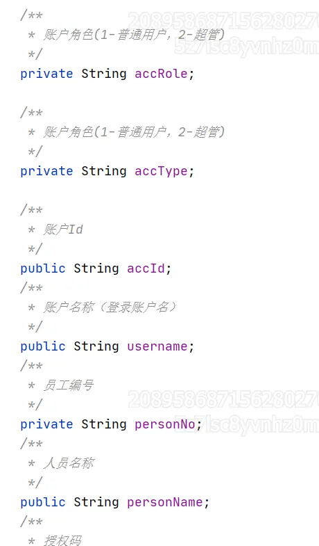

https://cic_irc.yuque.com/tyl581/ggwv9w/dbinlugg353oggu9

## 最新版本

此处为语雀内容卡片，点击链接查看：[https://cic_irc.yuque.com/tyl581/ggwv9w/ur3d8ufwydodiuug](https://cic_irc.yuque.com/tyl581/ggwv9w/ur3d8ufwydodiuug)

## 保存日志

**接口说明**

保存操作日志到审计中心

**RPC地址**

|   |   |
|---|---|
|包名|com.aliyun.fsi.insurance.audit.center.facade|
|类名|AuditLogFacade|
|函数名|saveAuditLog|

**请求参数**

SaveAuditLogReqDTO

|   |   |   |   |
|---|---|---|---|
|参数|类型|是否必填(Y/N)|说明|
|serverCode|String|Y|服务编码、例如：MID-ABOSS-SSO、使用方可自定义服务编码|
|moduleCode|String|Y|模块编码、例如：SSO-ACCOUNT、使用方可自定义模块编码|
|operateType|String|Y|操作类型、例如：ACCOUNT-CREATE、使用方可自定义枚举操作类型|
|logInfo|String|Y|日志详情、例如：1001张三创建了zhex001外部账号，使用方可根据场景组装自己的日志详情。|
|creator|String|Y|操作主体、例如：1001、产生这条日志的操作者，可根据上下文获取RpcInvokeContext.getContext().getRequestBaggage("authData");|
|creatorName|String|Y|创建人显示名称、可根据上下文获取RpcInvokeContext.getContext().getRequestBaggage("authData");|
|operatedObject|String|N|操作客体、例如：编码+名称/具体格式需产品规范|

authData：

