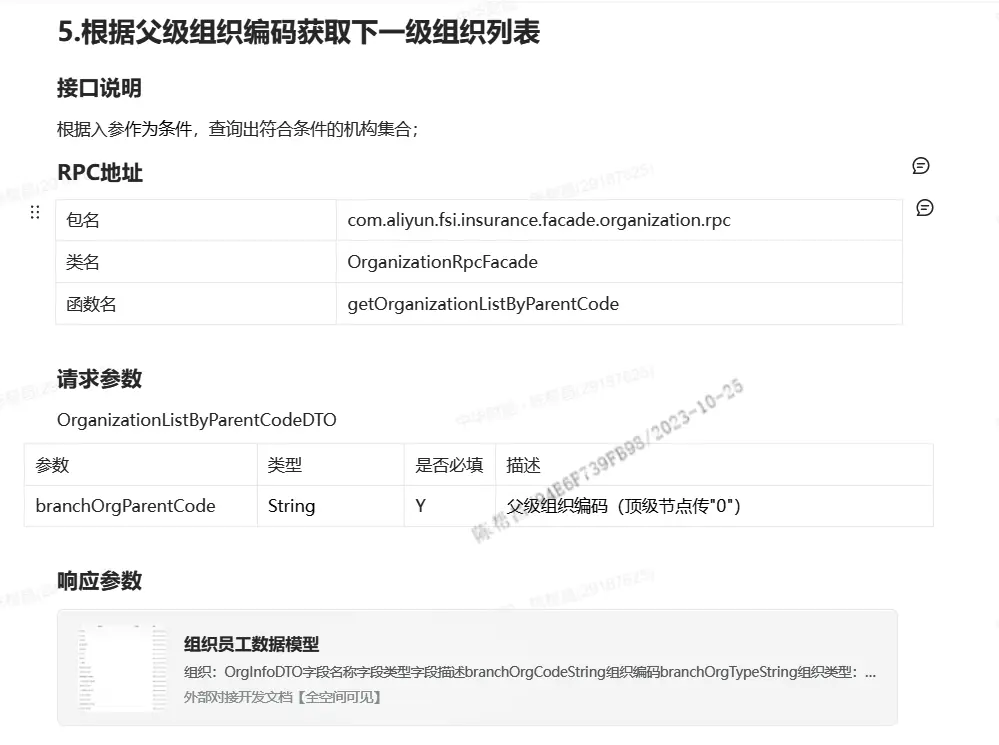
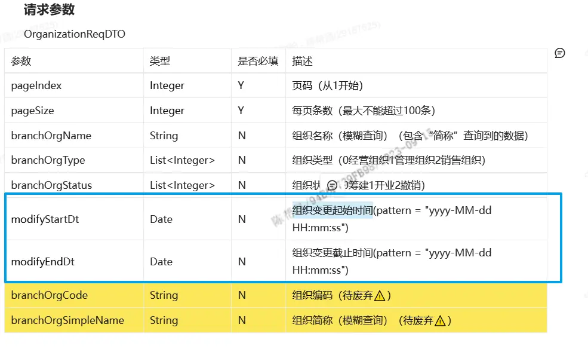
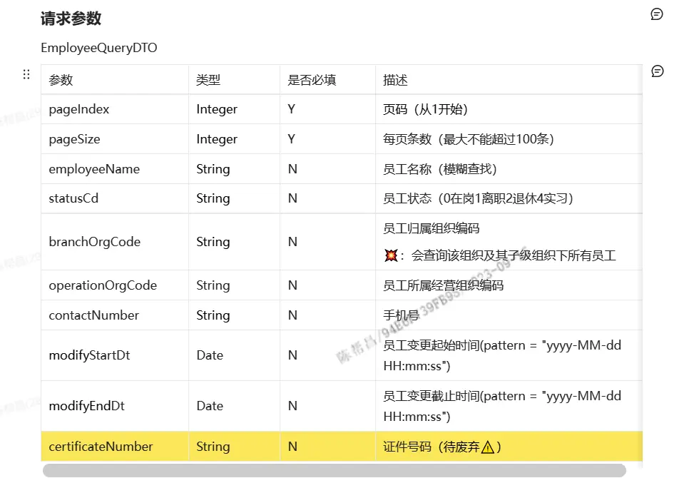

https://cic_irc.yuque.com/tyl581/ggwv9w/xcd8a1f864bcm2v3
## 最新🔥20241226：

根据统一社会信用代码查询机构信息，判断是否属于我司机构：

```
<dependency>
  <groupId>com.aliyun.fsi.insurance</groupId>
  <artifactId>organization-facade</artifactId>
  <version>1.5.1-RELEASE</version>
</dependency>
```

## 20240603：

根据一组工作岗位编码获取工作岗位详情

```
<dependency>
  <groupId>com.aliyun.fsi.insurance</groupId>
  <artifactId>organization-facade</artifactId>
  <version>1.4.0-RELEASE</version>
</dependency>
```

## 20240520:

根据一组员工工号批量获取员工详情，返回员工模型新加字段：employmentType/用工类型

```
<dependency>
  <groupId>com.aliyun.fsi.insurance</groupId>
  <artifactId>organization-facade</artifactId>
  <version>1.3.9-RELEASE</version>
</dependency>
```

## 20240422：

根据批量证件号码检查是否是内部员工

```
<dependency>
  <groupId>com.aliyun.fsi.insurance</groupId>
  <artifactId>organization-facade</artifactId>
  <version>1.3.8-RELEASE</version>
</dependency>
```

## 20240416：

根据岗位/职能获取员工列表(getEmployeeListByPositionCondition)

```
<dependency>
  <groupId>com.aliyun.fsi.insurance</groupId>
  <artifactId>organization-facade</artifactId>
  <version>1.3.7-RELEASE</version>
</dependency>
```

## 20240304：

根据组织编码获取子孙节点机构编码(getChildOrgCodesByCode)

```
<dependency>
  <groupId>com.aliyun.fsi.insurance</groupId>
  <artifactId>organization-facade</artifactId>
  <version>1.3.6-RELEASE</version>
</dependency>
```

## 20240119：

岗位rpc接口技改

```
<dependency>
  <groupId>com.aliyun.fsi.insurance</groupId>
  <artifactId>organization-facade</artifactId>
  <version>1.3.5-RELEASE</version>
</dependency>
```

## 20231214：

```
<dependency>
  <groupId>com.aliyun.fsi.insurance</groupId>
  <artifactId>organization-facade</artifactId>
  <version>1.3.4-RELEASE</version>
</dependency>
```

新增根据组织全称精确查询组织详情(上线时间20231214)

## 20231114：

```
<dependency>
  <groupId>com.aliyun.fsi.insurance</groupId>
  <artifactId>organization-facade</artifactId>
  <version>1.3.3-RELEASE</version>
</dependency>
```

精简RPC方法：

1、BranchOrgRpcFacade待废弃。

2、OrganizationRpcFacade性能优化。

## 20231025：

```
<dependency>
  <groupId>com.aliyun.fsi.insurance</groupId>
  <artifactId>organization-facade</artifactId>
  <version>1.3.2-RELEASE</version>
</dependency>
```

主要升级点：

新增接口：根据父级组织编码获取下一级组织列表



## 20230915：

```
<dependency>
    <groupId>com.aliyun.fsi.insurance</groupId>
    <artifactId>organization-facade</artifactId>
    <version>1.3.1-RELEASE</version>
</dependency>
```

主要升级点：

1、根据证件类型（默认身份证类型）、证件号码获取员工详情。


2、根据条件获取组织分页列表⚡

a：pageSize最大为100

b：新增根据组织变更起始时间和组织变更截止时间查询机构信息



3、根据条件获取员工分页列表⚡

a：改为分页接口，其中分页参数为必传，pageSize最大为100

b：新增根据组织变更起始时间和组织变更截止时间查询机构信息



## 20230810：

```
<dependency>
    <groupId>com.aliyun.fsi.insurance</groupId>
    <artifactId>organization-facade</artifactId>
    <version>1.3.0-RELEASE</version>
</dependency>
```

主要升级点：

package：com.aliyun.fsi.insurance.facade.employee.rpc

class：EmployeeBasicRpcFacade.getEmployeeInfoByCodes()

response：EmployeeInfoDTO.employeeWorkPositionResDTOS

EmployeeWorkPositionResDTO：

待废弃字段：private String activeStatus 在职状态判断是否兼职(待废弃-同positionType)

新加字段：

private String employeeActiveStatus 员工在职状态(CODE_EmployeeActiveStatus)

private String positionType 职位类型(CODE_PositionType)(1-主职位2-兼职职位3-外派职位4-借调职位)
